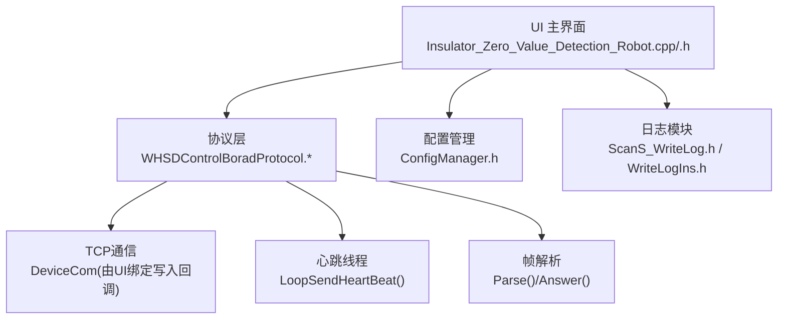
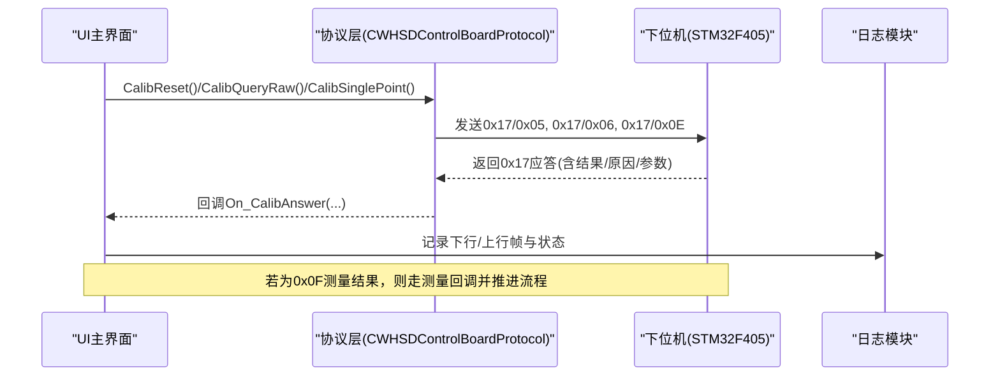
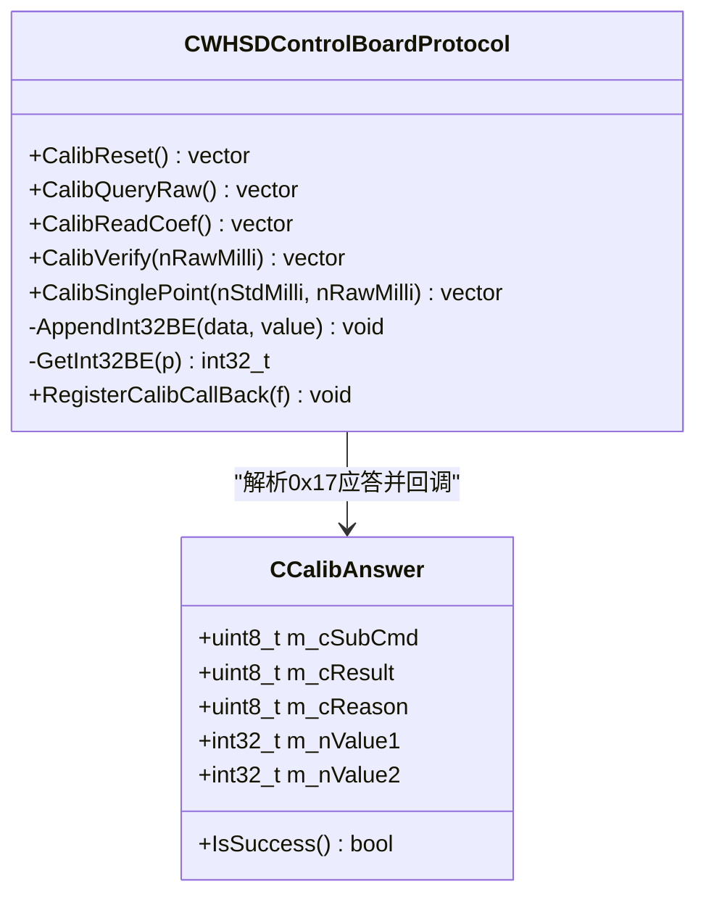
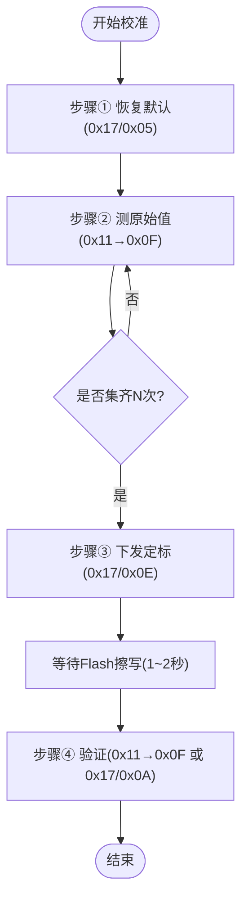
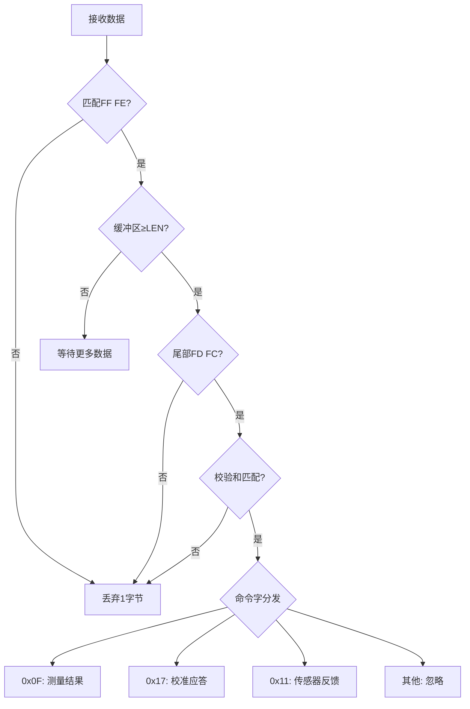
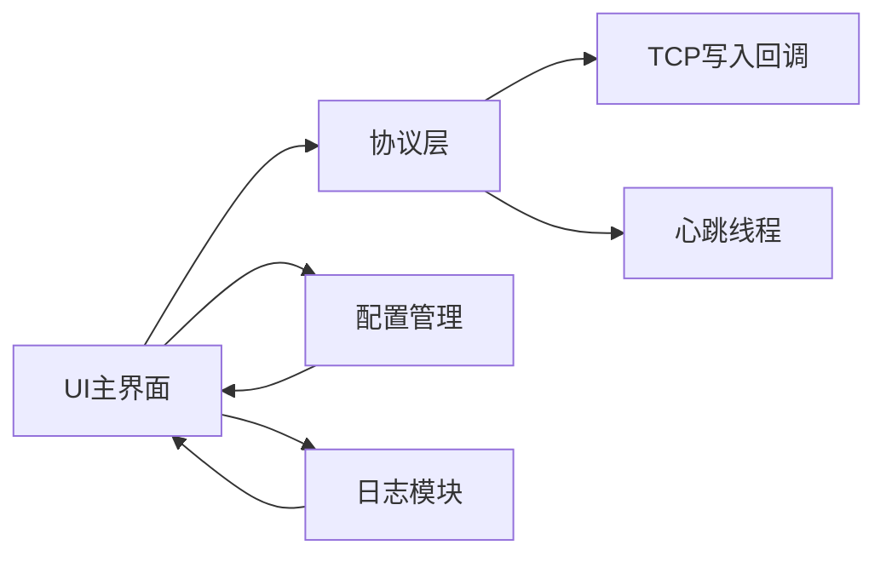
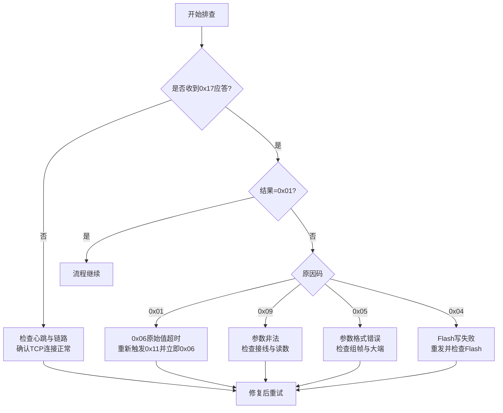

# 故障排除与常见问题

<cite>
**本文引用的文件**
- [单点定标协议与流程_V1.0.html](file://Insulator_Zero_Value_Detection_Robot/单点定标协议与流程_V1.0.html)
- [WHSDControlBoradProtocol.h](file://Insulator_Zero_Value_Detection_Robot/Protocol/WHSDControlBoradProtocol.h)
- [WHSDControlBoradProtocol.cpp](file://Insulator_Zero_Value_Detection_Robot/Protocol/WHSDControlBoradProtocol.cpp)
- [Insulator_Zero_Value_Detection_Robot.cpp](file://Insulator_Zero_Value_Detection_Robot/UI/Insulator_Zero_Value_Detection_Robot.cpp)
- [Insulator_Zero_Value_Detection_Robot.h](file://Insulator_Zero_Value_Detection_Robot/UI/Insulator_Zero_Value_Detection_Robot.h)
- [ConfigManager.h](file://Insulator_Zero_Value_Detection_Robot/Config/ConfigManager.h)
- [ScanS_WriteLog.h](file://Insulator_Zero_Value_Detection_Robot/Log/ScanS_WriteLog.h)
- [WriteLogIns.h](file://Insulator_Zero_Value_Detection_Robot/Log/WriteLogIns.h)
</cite>

## 目录
1. [简介](#简介)
2. [项目结构](#项目结构)
3. [核心组件](#核心组件)
4. [架构总览](#架构总览)
5. [详细组件分析](#详细组件分析)
6. [依赖关系分析](#依赖关系分析)
7. [性能考虑](#性能考虑)
8. [故障排查指南](#故障排查指南)
9. [结论](#结论)
10. [附录](#附录)

## 简介
本指南面向绝缘子零值检测机器人V2的校准功能，聚焦校准过程中可能出现的异常与错误码（如0x06应答原因0x01、0x0E应答原因0x09/0x05/0x04等），提供系统化的诊断方法、处理步骤、硬件连接检查、软件配置排查、性能优化建议以及调试工具与日志分析方法。目标是帮助用户快速定位问题根源并恢复校准流程。

## 项目结构
本项目采用分层组织：UI层负责交互与流程控制；协议层封装通信帧构造与解析；配置模块管理网络与设备参数；日志模块记录运行信息。校准相关的关键代码集中在协议类、UI主界面与协议文档中。

**图表来源**
- [Insulator_Zero_Value_Detection_Robot.cpp:277-290](file://Insulator_Zero_Value_Detection_Robot/UI/Insulator_Zero_Value_Detection_Robot.cpp#L277-L290)
- [WHSDControlBoradProtocol.cpp:199-205](file://Insulator_Zero_Value_Detection_Robot/Protocol/WHSDControlBoradProtocol.cpp#L199-L205)
- [WHSDControlBoradProtocol.cpp:769-802](file://Insulator_Zero_Value_Detection_Robot/Protocol/WHSDControlBoradProtocol.cpp#L769-L802)

**章节来源**
- [Insulator_Zero_Value_Detection_Robot.cpp:277-290](file://Insulator_Zero_Value_Detection_Robot/UI/Insulator_Zero_Value_Detection_Robot.cpp#L277-L290)
- [WHSDControlBoradProtocol.cpp:199-205](file://Insulator_Zero_Value_Detection_Robot/Protocol/WHSDControlBoradProtocol.cpp#L199-L205)

## 核心组件
- 校准命令与应答模型：CCalibAnswer定义子命令、结果、原因及参数字段，用于统一解析0x17系列校准应答。
- 协议封装：CWHSDControlBoardProtocol提供CalibReset/CalibQueryRaw/CalibReadCoef/CalibVerify/CalibSinglePoint等方法，按大端格式组装帧并发送。
- UI流程控制：主界面实现校准四步流程（恢复默认→测原始值→下发定标→验证），包含超时定时器、状态标记与日志输出。
- 配置管理：CControlBoardConfig保存IP、端口、心跳间隔等通信参数。
- 日志模块：CWriteLog/CWriteLogIns支持多行循环覆盖、同步/异步写入，便于问题回溯。

**章节来源**
- [WHSDControlBoradProtocol.h:21-52](file://Insulator_Zero_Value_Detection_Robot/Protocol/WHSDControlBoradProtocol.h#L21-L52)
- [WHSDControlBoradProtocol.cpp:582-616](file://Insulator_Zero_Value_Detection_Robot/Protocol/WHSDControlBoradProtocol.cpp#L582-L616)
- [Insulator_Zero_Value_Detection_Robot.cpp:873-911](file://Insulator_Zero_Value_Detection_Robot/UI/Insulator_Zero_Value_Detection_Robot.cpp#L873-L911)
- [ConfigManager.h:10-24](file://Insulator_Zero_Value_Detection_Robot/Config/ConfigManager.h#L10-L24)
- [ScanS_WriteLog.h:17-38](file://Insulator_Zero_Value_Detection_Robot/Log/ScanS_WriteLog.h#L17-L38)

## 架构总览
校准数据流从UI触发开始，经协议层构造帧并通过TCP发送至下位机；下位机返回0x17校准应答或0x0F测量结果，协议层解析后回调至UI槽函数，驱动下一步流程。心跳线程周期性发送心跳以维持链路健康。

**图表来源**
- [Insulator_Zero_Value_Detection_Robot.cpp:873-911](file://Insulator_Zero_Value_Detection_Robot/UI/Insulator_Zero_Value_Detection_Robot.cpp#L873-L911)
- [WHSDControlBoradProtocol.cpp:392-418](file://Insulator_Zero_Value_Detection_Robot/Protocol/WHSDControlBoradProtocol.cpp#L392-L418)
- [Insulator_Zero_Value_Detection_Robot.cpp:1160-1265](file://Insulator_Zero_Value_Detection_Robot/UI/Insulator_Zero_Value_Detection_Robot.cpp#L1160-L1265)

## 详细组件分析

### 校准命令与应答模型
- CCalibAnswer集中承载子命令、结果、原因与两参数（毫值大端）。成功标志为结果=0x01，失败原因包括原始值超时、Flash写失败、参数长度/格式错误、参数非法等。
- 协议层在解析0x17应答时，按长度安全读取参数1与参数2，并调用注册的校准回调。

**图表来源**
- [WHSDControlBoradProtocol.h:21-52](file://Insulator_Zero_Value_Detection_Robot/Protocol/WHSDControlBoradProtocol.h#L21-L52)
- [WHSDControlBoradProtocol.cpp:392-418](file://Insulator_Zero_Value_Detection_Robot/Protocol/WHSDControlBoradProtocol.cpp#L392-L418)
- [WHSDControlBoradProtocol.cpp:562-616](file://Insulator_Zero_Value_Detection_Robot/Protocol/WHSDControlBoradProtocol.cpp#L562-L616)

**章节来源**
- [WHSDControlBoradProtocol.h:21-52](file://Insulator_Zero_Value_Detection_Robot/Protocol/WHSDControlBoradProtocol.h#L21-L52)
- [WHSDControlBoradProtocol.cpp:392-418](file://Insulator_Zero_Value_Detection_Robot/Protocol/WHSDControlBoradProtocol.cpp#L392-L418)

### UI校准流程与超时控制
- 四步流程：①恢复默认；②测原始值（多次取平均）；③下发定标（写Flash需1~2秒）；④验证（实测修正值或离线抽查）。
- 使用QTimer进行单次等待超时，区分不同步骤的超时时间；失败时重置状态并提示重试。
- 通过原子标志m_bCalibMeasuring将0x0F测量结果路由到校准流程，避免污染工单测量数据。

**图表来源**
- [Insulator_Zero_Value_Detection_Robot.cpp:873-911](file://Insulator_Zero_Value_Detection_Robot/UI/Insulator_Zero_Value_Detection_Robot.cpp#L873-L911)
- [Insulator_Zero_Value_Detection_Robot.cpp:1007-1034](file://Insulator_Zero_Value_Detection_Robot/UI/Insulator_Zero_Value_Detection_Robot.cpp#L1007-L1034)
- [Insulator_Zero_Value_Detection_Robot.cpp:1116-1158](file://Insulator_Zero_Value_Detection_Robot/UI/Insulator_Zero_Value_Detection_Robot.cpp#L1116-L1158)
- [Insulator_Zero_Value_Detection_Robot.cpp:1267-1292](file://Insulator_Zero_Value_Detection_Robot/UI/Insulator_Zero_Value_Detection_Robot.cpp#L1267-L1292)

**章节来源**
- [Insulator_Zero_Value_Detection_Robot.cpp:873-911](file://Insulator_Zero_Value_Detection_Robot/UI/Insulator_Zero_Value_Detection_Robot.cpp#L873-L911)
- [Insulator_Zero_Value_Detection_Robot.cpp:1007-1034](file://Insulator_Zero_Value_Detection_Robot/UI/Insulator_Zero_Value_Detection_Robot.cpp#L1007-L1034)
- [Insulator_Zero_Value_Detection_Robot.cpp:1116-1158](file://Insulator_Zero_Value_Detection_Robot/UI/Insulator_Zero_Value_Detection_Robot.cpp#L1116-L1158)
- [Insulator_Zero_Value_Detection_Robot.cpp:1267-1292](file://Insulator_Zero_Value_Detection_Robot/UI/Insulator_Zero_Value_Detection_Robot.cpp#L1267-L1292)

### 协议帧构造与解析
- 帧头FF FE，长度LEN为整帧字节数，校验CHK为累加和低位，帧尾FD FC；多字节整数为大端。
- 解析时先匹配包头包尾与校验，再根据命令字分发处理：0x0F测量结果、0x17校准应答、0x11传感器指令反馈等。
- 心跳线程定时发送心跳帧，保证链路存活；断链会触发安全策略（如舵机归零）。

**图表来源**
- [WHSDControlBoradProtocol.cpp:228-444](file://Insulator_Zero_Value_Detection_Robot/Protocol/WHSDControlBoradProtocol.cpp#L228-L444)
- [WHSDControlBoradProtocol.cpp:654-677](file://Insulator_Zero_Value_Detection_Robot/Protocol/WHSDControlBoradProtocol.cpp#L654-L677)

**章节来源**
- [WHSDControlBoradProtocol.cpp:228-444](file://Insulator_Zero_Value_Detection_Robot/Protocol/WHSDControlBoradProtocol.cpp#L228-L444)
- [WHSDControlBoradProtocol.cpp:654-677](file://Insulator_Zero_Value_Detection_Robot/Protocol/WHSDControlBoradProtocol.cpp#L654-L677)

## 依赖关系分析
- UI依赖协议层提供的校准命令构造与回调机制；协议层依赖TCP通信写入回调（由UI注册）；配置模块提供网络与心跳参数；日志模块贯穿各层记录关键事件。
- 潜在耦合点：UI对协议回调的注册顺序与生命周期；协议层对心跳线程的控制；配置变更对通信参数的影响。

**图表来源**
- [Insulator_Zero_Value_Detection_Robot.cpp:277-290](file://Insulator_Zero_Value_Detection_Robot/UI/Insulator_Zero_Value_Detection_Robot.cpp#L277-L290)
- [WHSDControlBoradProtocol.cpp:199-205](file://Insulator_Zero_Value_Detection_Robot/Protocol/WHSDControlBoradProtocol.cpp#L199-L205)
- [ConfigManager.h:10-24](file://Insulator_Zero_Value_Detection_Robot/Config/ConfigManager.h#L10-L24)

**章节来源**
- [Insulator_Zero_Value_Detection_Robot.cpp:277-290](file://Insulator_Zero_Value_Detection_Robot/UI/Insulator_Zero_Value_Detection_Robot.cpp#L277-L290)
- [WHSDControlBoradProtocol.cpp:199-205](file://Insulator_Zero_Value_Detection_Robot/Protocol/WHSDControlBoradProtocol.cpp#L199-L205)

## 性能考虑
- Flash写入等待：0x0E写Flash需1~2秒，上位机应答超时应设置≥3秒，避免误判超时。
- 心跳保持：全程保持心跳，断链30秒触发舵机归零；心跳间隔可通过配置调整。
- 测量时序：0x11触发后约3.2秒回报0x0F，等待超时建议≥5秒；查询原始值0x06仅在最近一次0x0F后5秒内有效。
- 帧完整性：确保帧尾FD FC后不追加多余字节，避免解析错位。

[本节为通用性能建议，不直接分析具体文件]

## 故障排查指南

### 常见错误码诊断与处理
- 0x06应答原因0x01（原始值已超时）
  - 现象：查询原始值返回“结果=00，原因=01”。
  - 原因：距上次0x0F回报超过5秒，模块不再保留该原始值。
  - 处理：重新触发检测（0x11），立即查询原始值（0x06）；确保在5秒窗口内完成查询。
  - 参考：协议文档异常表与协议层对0x06的处理逻辑。

- 0x0E应答原因0x09（参数非法）
  - 现象：单点定标返回“结果=00，原因=09”。
  - 原因：标准值或原始值≤0，或原始值≥标准值（负补偿需求），说明模块读数偏高或接线异常。
  - 处理：检查接线与模块读数，勿强行定标；确认标准电阻接入正确且预热稳定。
  - 参考：协议文档异常表与UI前置合法性检查。

- 0x0E应答原因0x05（参数长度/格式错误）
  - 现象：单点定标返回“结果=00，原因=05”。
  - 原因：参数不是8字节（标准值4B+原始值4B），或字节序/类型错误。
  - 处理：检查组帧逻辑，确保使用大端int32毫值；核对协议封装函数是否正确追加参数。
  - 参考：协议层CalibSinglePoint封装与协议文档帧速查表。

- 0x0E应答原因0x04（Flash写失败）
  - 现象：单点定标返回“结果=00，原因=04”。
  - 原因：Flash擦写失败（Sector4）。
  - 处理：重发0x0E；反复失败需检查Flash健康与供电稳定性；必要时更换模块。
  - 参考：协议文档异常表与协议层对0x17应答的解析。

- 0x0F测量结果超时
  - 现象：触发检测后未收到0x0F回报。
  - 原因：链路中断、模块未就绪或超时设置过短。
  - 处理：检查心跳与链路；适当延长等待超时；确认模块处于可测量状态。
  - 参考：UI超时处理与协议层0x0F解析。

- 0x0A补偿验证失败
  - 现象：离线抽查返回失败。
  - 原因：参数长度错误或系数未生效。
  - 处理：检查下发原始值长度；确认已完成定标并写入Flash；再次执行验证。
  - 参考：协议层CalibVerify封装与UI回调处理。

**章节来源**
- [单点定标协议与流程_V1.0.html:93-148](file://Insulator_Zero_Value_Detection_Robot/单点定标协议与流程_V1.0.html#L93-L148)
- [WHSDControlBoradProtocol.cpp:392-418](file://Insulator_Zero_Value_Detection_Robot/Protocol/WHSDControlBoradProtocol.cpp#L392-L418)
- [Insulator_Zero_Value_Detection_Robot.cpp:1093-1114](file://Insulator_Zero_Value_Detection_Robot/UI/Insulator_Zero_Value_Detection_Robot.cpp#L1093-L1114)
- [Insulator_Zero_Value_Detection_Robot.cpp:1267-1292](file://Insulator_Zero_Value_Detection_Robot/UI/Insulator_Zero_Value_Detection_Robot.cpp#L1267-L1292)

### 问题诊断流程图

**图表来源**
- [单点定标协议与流程_V1.0.html:140-148](file://Insulator_Zero_Value_Detection_Robot/单点定标协议与流程_V1.0.html#L140-L148)
- [Insulator_Zero_Value_Detection_Robot.cpp:1267-1292](file://Insulator_Zero_Value_Detection_Robot/UI/Insulator_Zero_Value_Detection_Robot.cpp#L1267-L1292)

### 排查清单
- 硬件连接
  - 检查USR-C210以太网模组与主控板UART5连接；确认静态IP与端口配置正确。
  - 确认标准电阻接入正确，预热稳定后再测量。
  - 观察心跳是否正常到达，断链会触发安全策略。
- 软件配置
  - 通信参数：IP、端口、心跳间隔；确保与设备一致。
  - 超时时间：0x0F等待≥5秒；0x0E写Flash等待≥3秒；0x06查询在5秒窗口内。
  - 帧格式：确保帧头FF FE、帧尾FD FC、校验和正确；多字节整数为大端。
- 日志分析
  - 查看下行/上行帧日志，确认命令与应答匹配。
  - 关注错误原因码与参数值，定位具体失败环节。
  - 使用同步写入模式记录关键步骤，便于问题复现。

[本节为通用排查建议，不直接分析具体文件]

### 性能优化建议
- Flash写入等待时间：设置为≥3秒，避免误判超时。
- 心跳保持策略：保持心跳间隔合理（如1秒级），确保链路健康；断链时及时告警。
- 测量时序优化：0x11触发后立即进入等待，减少空闲轮询；0x06查询紧接0x0F回报。
- 帧完整性：避免在帧尾后追加多余字节，防止解析错位。

[本节为通用性能建议，不直接分析具体文件]

### 调试工具与日志分析方法
- 模拟器辅助：可使用设备模拟器验证协议交互，模拟0x17应答与0x0F回报，帮助定位上位机逻辑问题。
- 日志级别：关键步骤使用同步写入，确保日志完整；常规操作使用异步写入提升性能。
- 关键字段：关注结果码、原因码、参数值（毫值）、时间戳；对比理论值与实际值差异。
- 回放分析：导出日志文件，按时间线回放校准流程，定位失败节点。

**章节来源**
- [ScanS_WriteLog.h:17-38](file://Insulator_Zero_Value_Detection_Robot/Log/ScanS_WriteLog.h#L17-L38)
- [WriteLogIns.h:65-129](file://Insulator_Zero_Value_Detection_Robot/Log/WriteLogIns.h#L65-L129)

## 结论
本指南基于项目源码与协议文档，系统梳理了校准功能的异常类型、错误码含义、处理步骤与优化建议。通过明确的流程图与排查清单，用户可快速定位问题根源并采取相应措施。建议在现场操作中严格遵循协议规范，保持心跳与帧完整性，合理使用日志与模拟器辅助调试，以提高校准成功率与效率。

## 附录
- 协议文档关键帧速查：触发检测、恢复默认、查询原始值、单点定标、读回系数、补偿验证。
- 配置项说明：IP、端口、心跳间隔、工厂模式等。
- 日志接口：Write/WriteFormat/Write_Sync等，支持多行循环覆盖与同步写入。

[本节为补充信息，不直接分析具体文件]