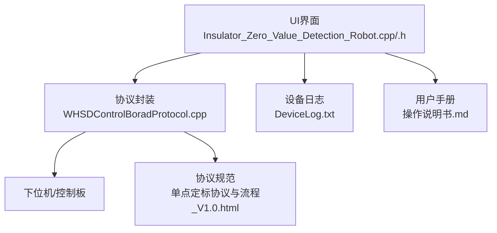
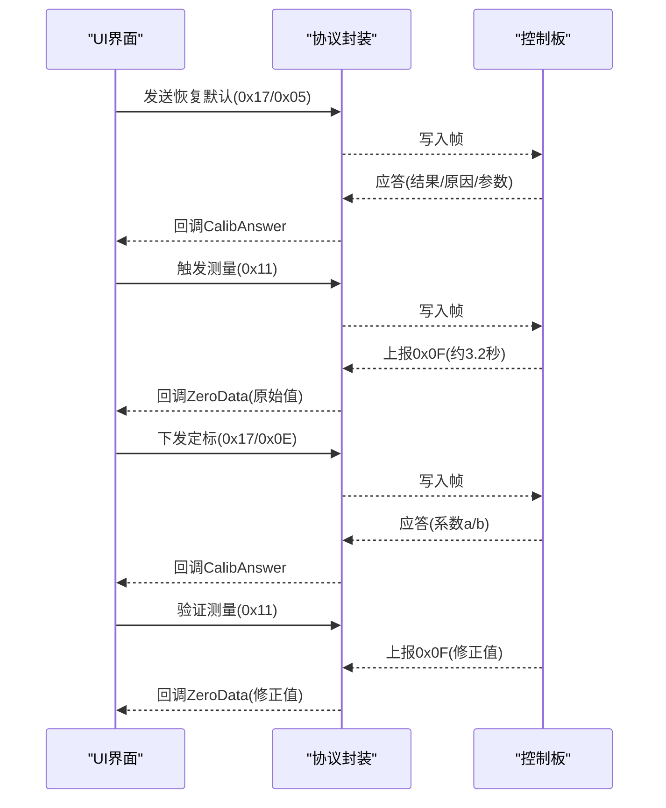
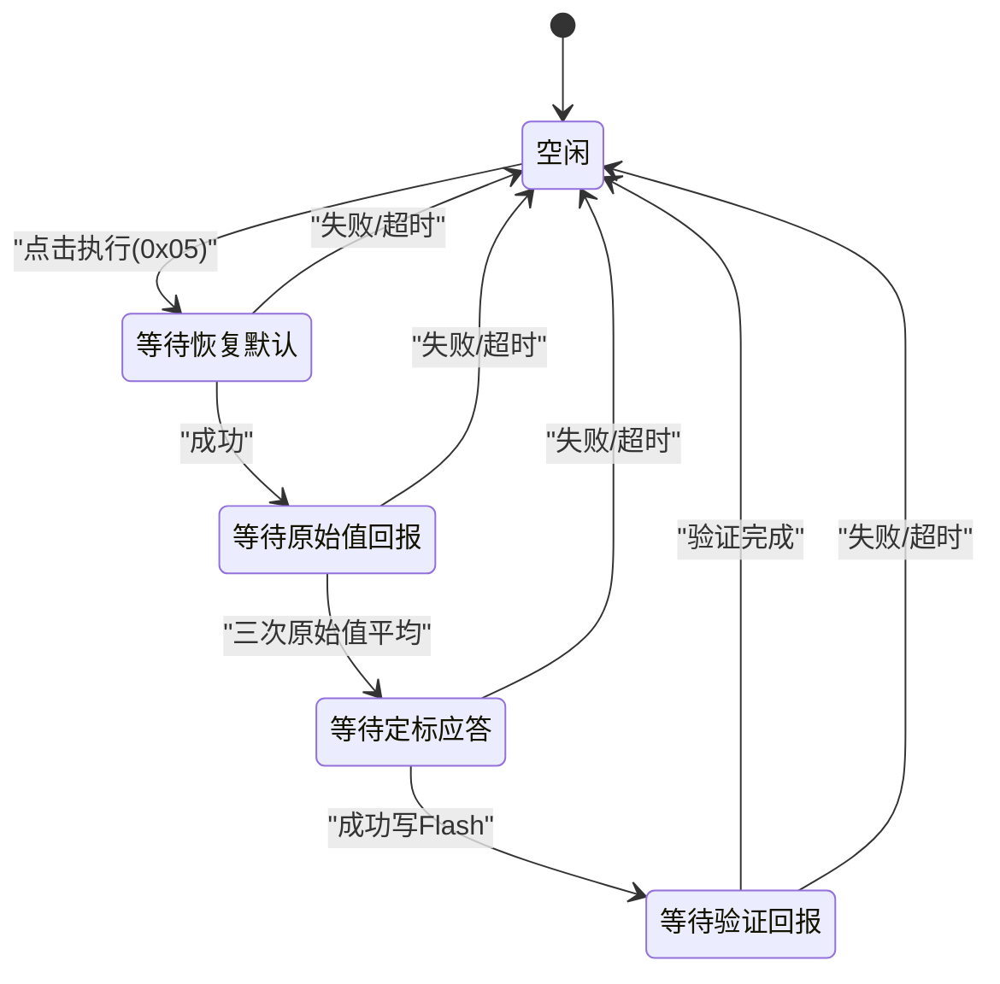
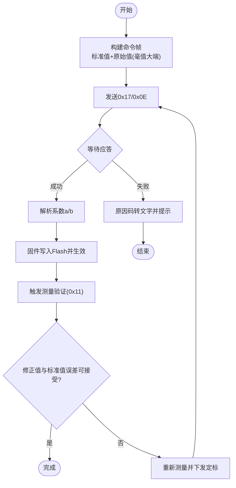
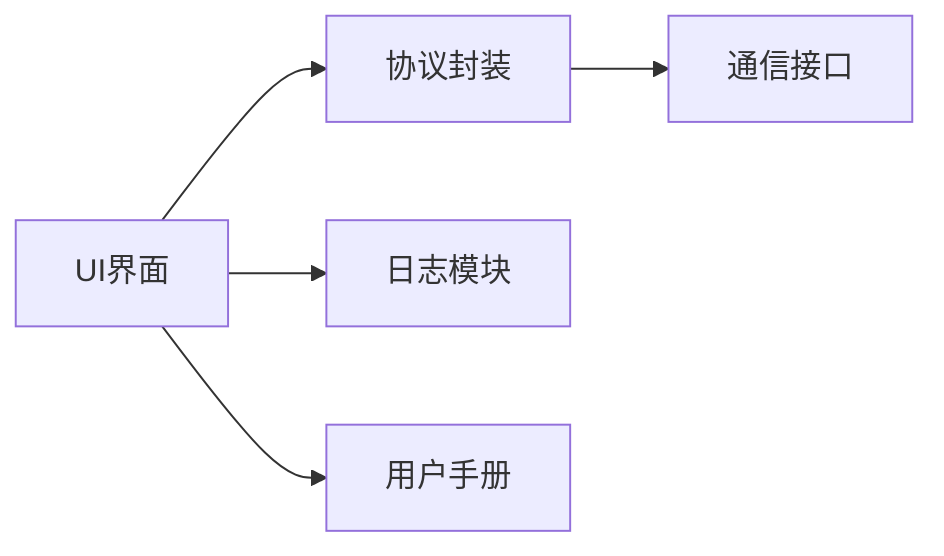

# 校准功能指南

<cite>
**本文引用的文件**
- [Insulator_Zero_Value_Detection_Robot.cpp](file://Insulator_Zero_Value_Detection_Robot/UI/Insulator_Zero_Value_Detection_Robot.cpp)
- [Insulator_Zero_Value_Detection_Robot.h](file://Insulator_Zero_Value_Detection_Robot/UI/Insulator_Zero_Value_Detection_Robot.h)
- [WHSDControlBoradProtocol.cpp](file://Insulator_Zero_Value_Detection_Robot/Protocol/WHSDControlBoradProtocol.cpp)
- [单点定标协议与流程_V1.0.html](file://Insulator_Zero_Value_Detection_Robot/单点定标协议与流程_V1.0.html)
- [操作说明书.md](file://操作说明书.md)
</cite>

## 目录
1. [简介](#简介)
2. [项目结构](#项目结构)
3. [核心组件](#核心组件)
4. [架构总览](#架构总览)
5. [详细组件分析](#详细组件分析)
6. [依赖关系分析](#依赖关系分析)
7. [性能注意事项](#性能注意事项)
8. [故障排查指南](#故障排查指南)
9. [结论](#结论)
10. [附录](#附录)

## 简介
本指南面向绝缘子零值检测机器人V2的“阻值单点校准”功能，帮助现场人员完成设备定标、参数核对与结果验证，确保测量精度与长期稳定性。内容涵盖：
- 校准的重要性与适用场景（阻值单点校准、设备定标）
- 完整操作流程（进入校准模式→恢复默认→测原始值→下发定标→验证→保存）
- 校准参数含义与调整方法
- 常见问题与解决方案
- 校准记录查看与管理（日志与历史追溯）
- 最佳实践建议

## 项目结构
与校准相关的代码主要分布在UI界面逻辑、通信协议封装以及用户手册中：
- UI层：负责步骤控制、超时管理、状态显示与日志输出
- 协议层：负责命令帧构造、解析与回调分发
- 文档：提供协议细节、帧格式与异常处理说明

图表来源
- [Insulator_Zero_Value_Detection_Robot.cpp:277-290](file://Insulator_Zero_Value_Detection_Robot/UI/Insulator_Zero_Value_Detection_Robot.cpp#L277-L290)
- [WHSDControlBoradProtocol.cpp:557-616](file://Insulator_Zero_Value_Detection_Robot/Protocol/WHSDControlBoradProtocol.cpp#L557-L616)
- [操作说明书.md:350-374](file://操作说明书.md#L350-L374)
- [单点定标协议与流程_V1.0.html:63-125](file://Insulator_Zero_Value_Detection_Robot/单点定标协议与流程_V1.0.html#L63-L125)

章节来源
- [Insulator_Zero_Value_Detection_Robot.cpp:277-290](file://Insulator_Zero_Value_Detection_Robot/UI/Insulator_Zero_Value_Detection_Robot.cpp#L277-L290)
- [操作说明书.md:350-374](file://操作说明书.md#L350-L374)

## 核心组件
- 校准状态机与流程控制：定义空闲、等待应答/回报等状态，保证步骤自上而下顺序执行，避免重入与冲突
- 测量触发与结果路由：在定标期间将0x0F测量结果改走定标信号槽，避免与工单测量数据混用
- 协议命令封装：提供恢复默认、查询原始值、读回系数、补偿验证、单点定标等命令构造
- 日志与可视化：实时追加校准日志，显示步骤状态与测量值

章节来源
- [Insulator_Zero_Value_Detection_Robot.h:315-373](file://Insulator_Zero_Value_Detection_Robot/UI/Insulator_Zero_Value_Detection_Robot.h#L315-L373)
- [Insulator_Zero_Value_Detection_Robot.cpp:853-911](file://Insulator_Zero_Value_Detection_Robot/UI/Insulator_Zero_Value_Detection_Robot.cpp#L853-L911)
- [WHSDControlBoradProtocol.cpp:582-616](file://Insulator_Zero_Value_Detection_Robot/Protocol/WHSDControlBoradProtocol.cpp#L582-L616)

## 架构总览
校准流程通过UI发起命令，经协议层封装为下行帧，由控制板处理后上报应答或测量结果；UI根据状态机推进下一步，并记录日志与更新界面。

图表来源
- [Insulator_Zero_Value_Detection_Robot.cpp:894-911](file://Insulator_Zero_Value_Detection_Robot/UI/Insulator_Zero_Value_Detection_Robot.cpp#L894-L911)
- [Insulator_Zero_Value_Detection_Robot.cpp:1007-1034](file://Insulator_Zero_Value_Detection_Robot/UI/Insulator_Zero_Value_Detection_Robot.cpp#L1007-L1034)
- [Insulator_Zero_Value_Detection_Robot.cpp:1116-1158](file://Insulator_Zero_Value_Detection_Robot/UI/Insulator_Zero_Value_Detection_Robot.cpp#L1116-L1158)
- [WHSDControlBoradProtocol.cpp:557-616](file://Insulator_Zero_Value_Detection_Robot/Protocol/WHSDControlBoradProtocol.cpp#L557-L616)

## 详细组件分析

### 校准状态机与流程控制
- 状态定义：空闲、等待恢复默认、等待原始值回报、等待定标应答、等待验证回报、等待辅助命令应答
- 步骤顺序：①恢复默认→②测原始值（连测3次取平均）→③下发定标→④验证（实测对比或离线抽查）
- 互斥保护：工单测量进行中禁止启动校准；校准期间0x0F结果改走定标槽，避免污染工单数据
- 超时管理：单次等待定时器，防止无应答卡死

图表来源
- [Insulator_Zero_Value_Detection_Robot.h:315-325](file://Insulator_Zero_Value_Detection_Robot/UI/Insulator_Zero_Value_Detection_Robot.h#L315-L325)
- [Insulator_Zero_Value_Detection_Robot.cpp:865-892](file://Insulator_Zero_Value_Detection_Robot/UI/Insulator_Zero_Value_Detection_Robot.cpp#L865-L892)

章节来源
- [Insulator_Zero_Value_Detection_Robot.h:315-373](file://Insulator_Zero_Value_Detection_Robot/UI/Insulator_Zero_Value_Detection_Robot.h#L315-L373)
- [Insulator_Zero_Value_Detection_Robot.cpp:853-911](file://Insulator_Zero_Value_Detection_Robot/UI/Insulator_Zero_Value_Detection_Robot.cpp#L853-L911)

### 协议命令封装与解析
- 命令族：0x17校准命令包含子命令0x05恢复默认、0x06查询原始值、0x0C读回系数、0x0A补偿验证、0x0E单点定标
- 数据格式：多字节整数大端，毫值为int32；校验和为累加和低位
- 回调机制：协议层解析后调用注册回调，UI侧接收并处理

图表来源
- [WHSDControlBoradProtocol.cpp:582-616](file://Insulator_Zero_Value_Detection_Robot/Protocol/WHSDControlBoradProtocol.cpp#L582-L616)
- [单点定标协议与流程_V1.0.html:79-125](file://Insulator_Zero_Value_Detection_Robot/单点定标协议与流程_V1.0.html#L79-L125)

章节来源
- [WHSDControlBoradProtocol.cpp:557-616](file://Insulator_Zero_Value_Detection_Robot/Protocol/WHSDControlBoradProtocol.cpp#L557-L616)
- [单点定标协议与流程_V1.0.html:63-125](file://Insulator_Zero_Value_Detection_Robot/单点定标协议与流程_V1.0.html#L63-L125)

### UI交互与日志
- 输入校验：标准电阻值范围限制，非法输入拦截
- 步骤状态：按钮按顺序启用，当前步骤高亮，成功/失败颜色标识
- 日志输出：每次下行/上行帧以HEX形式记录，便于与协议示例帧比对；原始值、平均值、系数等关键信息逐条追加

章节来源
- [Insulator_Zero_Value_Detection_Robot.cpp:214-228](file://Insulator_Zero_Value_Detection_Robot/UI/Insulator_Zero_Value_Detection_Robot.cpp#L214-L228)
- [Insulator_Zero_Value_Detection_Robot.cpp:833-836](file://Insulator_Zero_Value_Detection_Robot/UI/Insulator_Zero_Value_Detection_Robot.cpp#L833-L836)
- [操作说明书.md:350-374](file://操作说明书.md#L350-L374)

## 依赖关系分析
- UI依赖协议封装进行命令发送与回调处理
- 协议封装依赖底层通信接口写入数据
- 日志模块独立记录设备通信与状态变化
- 用户手册提供协议与流程参考

图表来源
- [Insulator_Zero_Value_Detection_Robot.cpp:277-290](file://Insulator_Zero_Value_Detection_Robot/UI/Insulator_Zero_Value_Detection_Robot.cpp#L277-L290)
- [WHSDControlBoradProtocol.cpp:631-677](file://Insulator_Zero_Value_Detection_Robot/Protocol/WHSDControlBoradProtocol.cpp#L631-L677)

章节来源
- [Insulator_Zero_Value_Detection_Robot.cpp:277-290](file://Insulator_Zero_Value_Detection_Robot/UI/Insulator_Zero_Value_Detection_Robot.cpp#L277-L290)
- [WHSDControlBoradProtocol.cpp:631-677](file://Insulator_Zero_Value_Detection_Robot/Protocol/WHSDControlBoradProtocol.cpp#L631-L677)

## 性能注意事项
- 心跳保持：全程保持心跳，断链可能触发舵机归零
- 超时设置：0x0F回报约3.2秒，建议≥5秒；0x0E写Flash需1~2秒，应答超时≥3秒
- 环境稳定：同环境同批次完成测量，避免日间漂移影响系数
- 帧完整性：帧尾FD FC后勿多发字节，避免解析错误

章节来源
- [单点定标协议与流程_V1.0.html:117-125](file://Insulator_Zero_Value_Detection_Robot/单点定标协议与流程_V1.0.html#L117-L125)

## 故障排查指南
- 0x06查询原始值返回原因0x01：距上次0x0F超5秒，重新触发检测后立即查询
- 0x0E返回原因0x09：标准值/原始值≤0或原始值≥标准值，检查接线与模块读数，勿强行定标
- 0x0E返回原因0x05：参数不是8字节，检查组帧（标准值4B+原始值4B，毫值大端）
- 定标后各档整体偏移：模块日间漂移，同环境重测基准档再发一次0x0E
- 0x0E应答慢：正常现象（擦写Flash Sector4），超时设≥3秒

章节来源
- [单点定标协议与流程_V1.0.html:140-148](file://Insulator_Zero_Value_Detection_Robot/单点定标协议与流程_V1.0.html#L140-L148)

## 结论
通过规范的阻值单点校准流程，结合协议层的可靠命令封装与UI的状态机控制，可有效提升绝缘子零值检测的准确性与稳定性。建议定期执行校准与验证，关注日志与异常提示，确保设备始终处于最佳工作状态。

## 附录

### 校准操作步骤速查
- 进入校准模式：系统设置页面右侧“阻值单点校准”区
- 准备：输入标准电阻值（建议500~1000 MΩ），接入标准电阻并预热至稳定
- 步骤①：执行恢复默认（0x05），清空旧校准，通道直通
- 步骤②：测原始值（连测3次取平均），必要时用0x06复核
- 步骤③：下发定标（0x0E），固件计算系数并写入Flash
- 步骤④：验证（触发测量看修正值，或不挂电阻用0x0A抽查）
- 保存：系数自动掉电保存，可通过0x0C读回核对

章节来源
- [操作说明书.md:350-374](file://操作说明书.md#L350-L374)
- [单点定标协议与流程_V1.0.html:107-125](file://Insulator_Zero_Value_Detection_Robot/单点定标协议与流程_V1.0.html#L107-L125)

### 校准参数与含义
- 标准值：标准电阻标称值（MΩ），用于计算补偿率
- 原始值：未补偿的测量输出（MΩ），用于与标准值对比
- 修正值：补偿后的输出（MΩ），应接近标准值
- 系数a/b：固件计算的补偿系数，a= c×1000，b固定为0

章节来源
- [单点定标协议与流程_V1.0.html:57-62](file://Insulator_Zero_Value_Detection_Robot/单点定标协议与流程_V1.0.html#L57-L62)
- [单点定标协议与流程_V1.0.html:88-92](file://Insulator_Zero_Value_Detection_Robot/单点定标协议与流程_V1.0.html#L88-L92)

### 校准记录查看与管理
- 校准日志：UI文本框实时追加，包含时间戳、下行/上行帧HEX、原始值、平均值、系数等
- 设备日志：DeviceLog.txt记录通信与状态变化，便于追溯
- 版本控制：系数存储在固件Flash，掉电保存；可通过0x0C读回核对

章节来源
- [Insulator_Zero_Value_Detection_Robot.cpp:833-836](file://Insulator_Zero_Value_Detection_Robot/UI/Insulator_Zero_Value_Detection_Robot.cpp#L833-L836)
- [单点定标协议与流程_V1.0.html:100-105](file://Insulator_Zero_Value_Detection_Robot/单点定标协议与流程_V1.0.html#L100-L105)

### 最佳实践建议
- 使用稳定标准电阻（500~1000 MΩ），预热至读数稳定
- 同一环境与批次完成测量，减少漂移影响
- 校准前后均进行验证，确保修正值与标准值误差在可接受范围
- 定期读取系数并归档，建立校准历史台账
- 出现异常时优先检查接线、模块读数与帧格式，避免强行定标

章节来源
- [操作说明书.md:350-374](file://操作说明书.md#L350-L374)
- [单点定标协议与流程_V1.0.html:117-125](file://Insulator_Zero_Value_Detection_Robot/单点定标协议与流程_V1.0.html#L117-L125)