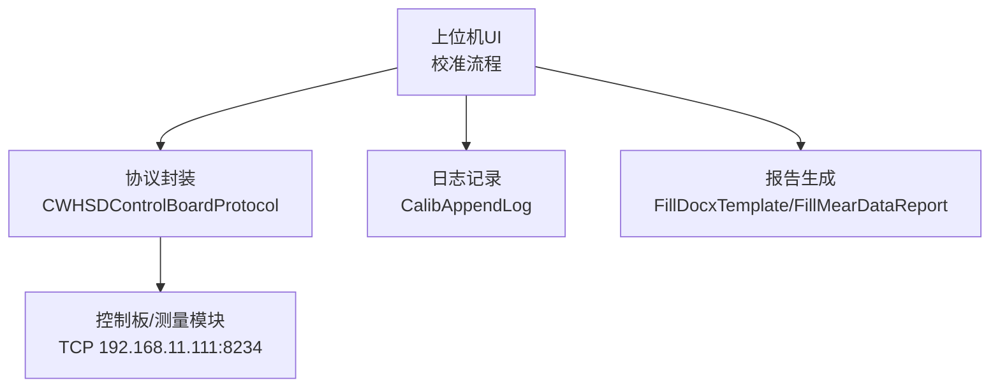
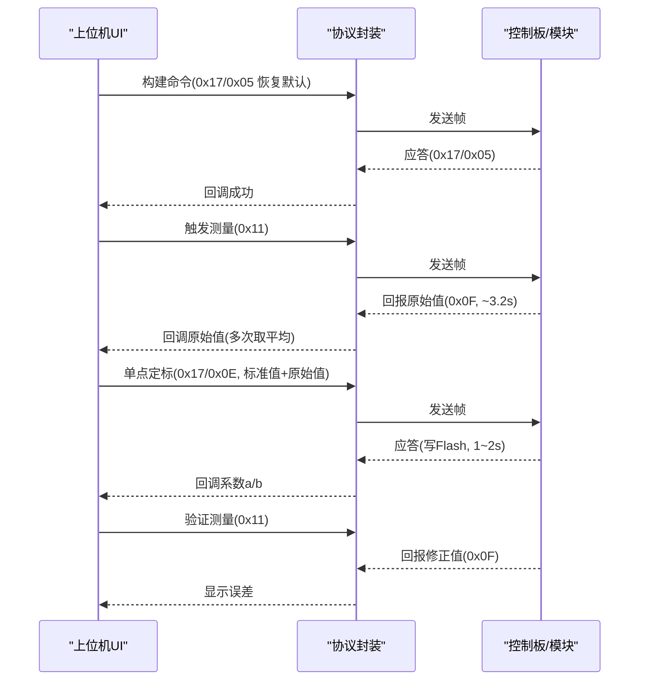
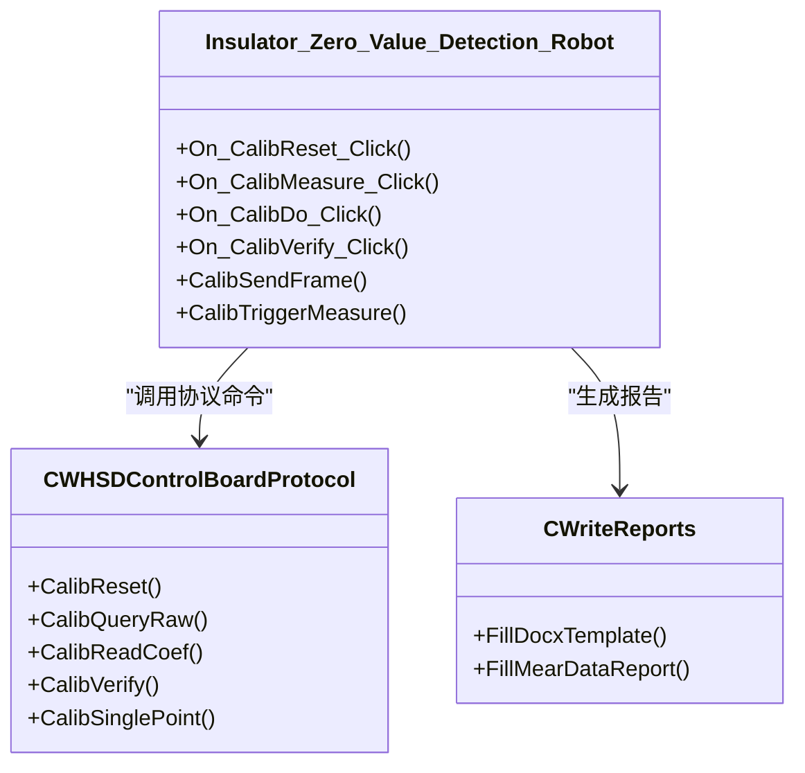
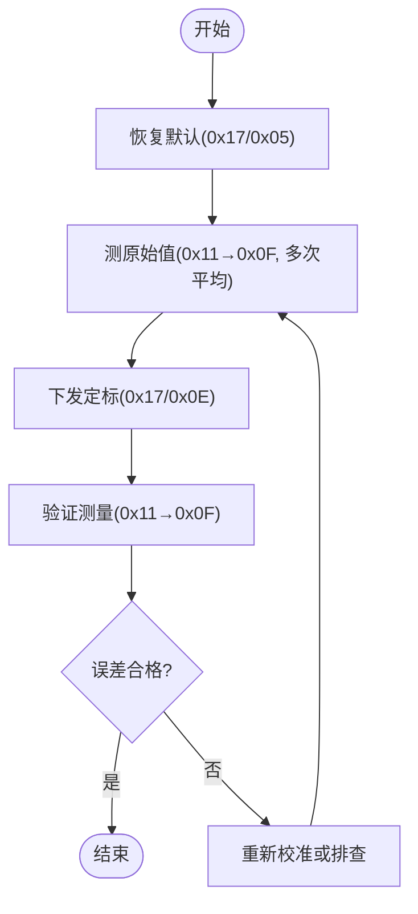

# 校准最佳实践

<cite>
**本文引用的文件**
- [单点定标协议与流程_V1.0.html](file://Insulator_Zero_Value_Detection_Robot/单点定标协议与流程_V1.0.html)
- [WHSDControlBoradProtocol.cpp](file://Insulator_Zero_Value_Detection_Robot/Protocol/WHSDControlBoradProtocol.cpp)
- [Insulator_Zero_Value_Detection_Robot.cpp](file://Insulator_Zero_Value_Detection_Robot/UI/Insulator_Zero_Value_Detection_Robot.cpp)
- [Insulator_Zero_Value_Detection_Robot.h](file://Insulator_Zero_Value_Detection_Robot/UI/Insulator_Zero_Value_Detection_Robot.h)
- [WriteReports.cpp](file://Insulator_Zero_Value_Detection_Robot/Report/WriteReports.cpp)
- [README.md](file://README.md)
</cite>

## 目录
1. [简介](#简介)
2. [项目结构](#项目结构)
3. [核心组件](#核心组件)
4. [架构总览](#架构总览)
5. [详细组件分析](#详细组件分析)
6. [依赖关系分析](#依赖关系分析)
7. [性能考虑](#性能考虑)
8. [故障排查指南](#故障排查指南)
9. [结论](#结论)
10. [附录](#附录)

## 简介
本指南面向绝缘子零值检测机器人V2的“阻值单点校准”操作，提供专业级校准建议与标准化流程，确保设备始终处于最佳工作状态。内容覆盖标准电阻选择、环境控制要求、校准频率与维护计划、数据评估方法、批量校准效率优化、质量保证措施以及证书报告生成规范等。所有技术细节均基于仓库中的协议文档与上位机实现。

## 项目结构
本项目包含通信协议封装、UI校准流程、报告生成等模块。校准相关的关键位置：
- 协议与命令封装：Protocol/WHSDControlBoradProtocol.cpp
- UI校准流程与状态机：UI/Insulator_Zero_Value_Detection_Robot.cpp/.h
- 校准协议说明：Insulator_Zero_Value_Detection_Robot/单点定标协议与流程_V1.0.html
- 报告模板与填充：Report/WriteReports.cpp

**图表来源**
- [Insulator_Zero_Value_Detection_Robot.cpp:894-910](file://Insulator_Zero_Value_Detection_Robot/UI/Insulator_Zero_Value_Detection_Robot.cpp#L894-L910)
- [WHSDControlBoradProtocol.cpp:582-616](file://Insulator_Zero_Value_Detection_Robot/Protocol/WHSDControlBoradProtocol.cpp#L582-L616)
- [单点定标协议与流程_V1.0.html:34-42](file://Insulator_Zero_Value_Detection_Robot/单点定标协议与流程_V1.0.html#L34-L42)
- [WriteReports.cpp:108-115](file://Insulator_Zero_Value_Detection_Robot/Report/WriteReports.cpp#L108-L115)

**章节来源**
- [README.md:1-3](file://README.md#L1-L3)
- [单点定标协议与流程_V1.0.html:34-42](file://Insulator_Zero_Value_Detection_Robot/单点定标协议与流程_V1.0.html#L34-L42)

## 核心组件
- 校准协议与命令封装：提供恢复默认(0x05)、查询原始值(0x06)、读回系数(0x0C)、补偿验证(0x0A)、单点定标(0x0E)等命令构造与解析。
- UI校准流程：四步顺序执行（恢复默认→测原始值→下发定标→验证），内置超时保护与步骤互斥，避免与工单测量冲突。
- 报告生成：支持Word模板占位符替换与动态表格行填充，便于输出校准结果与测量数据。

**章节来源**
- [WHSDControlBoradProtocol.cpp:582-616](file://Insulator_Zero_Value_Detection_Robot/Protocol/WHSDControlBoradProtocol.cpp#L582-L616)
- [Insulator_Zero_Value_Detection_Robot.h:108-125](file://Insulator_Zero_Value_Detection_Robot/UI/Insulator_Zero_Value_Detection_Robot.h#L108-L125)
- [WriteReports.cpp:108-115](file://Insulator_Zero_Value_Detection_Robot/Report/WriteReports.cpp#L108-L115)

## 架构总览
校准过程由上位机驱动，通过TCP与下位机交互，完成参数下发与结果读取。固件侧负责计算补偿系数并写入Flash，掉电保存。

**图表来源**
- [Insulator_Zero_Value_Detection_Robot.cpp:994-1055](file://Insulator_Zero_Value_Detection_Robot/UI/Insulator_Zero_Value_Detection_Robot.cpp#L994-L1055)
- [Insulator_Zero_Value_Detection_Robot.cpp:1078-1114](file://Insulator_Zero_Value_Detection_Robot/UI/Insulator_Zero_Value_Detection_Robot.cpp#L1078-L1114)
- [WHSDControlBoradProtocol.cpp:321-418](file://Insulator_Zero_Value_Detection_Robot/Protocol/WHSDControlBoradProtocol.cpp#L321-L418)
- [单点定标协议与流程_V1.0.html:107-124](file://Insulator_Zero_Value_Detection_Robot/单点定标协议与流程_V1.0.html#L107-L124)

## 详细组件分析

### 校准原理与命令
- 单点定标原理：固件根据“需求补偿率 p% = (1 − 实测原始值 / 标准值) × 100”和“补偿系数 c = p ÷ √实测原始值”自动计算，b固定为0；定标后按 p = c × √x 计算补偿率，输出修正值 y = x / (1 − p/100)，安全钳位 p < 0 按 0，p > 95% 按 95%。
- 关键命令：
  - 0x17/0x05：恢复默认（清空两点系数/折点表/公式系数）
  - 0x17/0x06：查询最近一次原始X（int32毫值大端，5秒内有效）
  - 0x17/0x0C：读回系数（校验Flash中已存系数）
  - 0x17/0x0A：补偿验证（不挂电阻，输入任意原始值，返回“原始值+校准后值”）
  - 0x17/0x0E：单点定标（标准值+实测原始值，均为int32毫值大端）

**章节来源**
- [单点定标协议与流程_V1.0.html:57-61](file://Insulator_Zero_Value_Detection_Robot/单点定标协议与流程_V1.0.html#L57-L61)
- [单点定标协议与流程_V1.0.html:71-105](file://Insulator_Zero_Value_Detection_Robot/单点定标协议与流程_V1.0.html#L71-L105)
- [WHSDControlBoradProtocol.cpp:582-616](file://Insulator_Zero_Value_Detection_Robot/Protocol/WHSDControlBoradProtocol.cpp#L582-L616)

### 标准电阻选择与使用规范
- 阻值范围：建议使用500~1000 MΩ档，该区间位于√x模型中段，稳定性更佳。
- 精度与温度系数：
  - 标准电阻应满足高阻量程下的长期稳定度与低漂移要求，推荐低温漂、高精度金属膜或空气介质标准电阻。
  - 温度系数需尽量小，以减少环境温度波动对标准值的影响；若现场温度变化较大，应在相同温度环境下进行校准与验证。
- 使用规范：
  - 连接可靠，避免接触电阻引入误差；接线短且屏蔽良好。
  - 预热模块至读数稳定后再测量；建议连测2~3次取平均。
  - 同一批次校准尽量在同一环境与短时间内完成，避免日间漂移污染系数。

**章节来源**
- [单点定标协议与流程_V1.0.html:107-116](file://Insulator_Zero_Value_Detection_Robot/单点定标协议与流程_V1.0.html#L107-L116)
- [Insulator_Zero_Value_Detection_Robot.cpp:1007-1055](file://Insulator_Zero_Value_Detection_Robot/UI/Insulator_Zero_Value_Detection_Robot.cpp#L1007-L1055)

### 环境控制要求
- 温度稳定性：校准与验证应在温度稳定的环境中进行；若温度变化明显，需重新测量基准档并再次下发0x0E。
- 湿度控制：高湿可能影响高阻测量稳定性，建议在干燥环境或使用防潮措施。
- 电磁干扰防护：采用屏蔽线缆、远离强电磁源，减少噪声对高阻测量的影响。
- 心跳与链路：保持心跳正常，断链将触发舵机归零；校准期间避免与其他流程争用0x0F结果。

**章节来源**
- [单点定标协议与流程_V1.0.html:117-125](file://Insulator_Zero_Value_Detection_Robot/单点定标协议与流程_V1.0.html#L117-L125)
- [Insulator_Zero_Value_Detection_Robot.cpp:865-883](file://Insulator_Zero_Value_Detection_Robot/UI/Insulator_Zero_Value_Detection_Robot.cpp#L865-L883)

### 校准频率与维护计划
- 定期校准周期：
  - 新设备首次使用前必须校准。
  - 日常作业前建议进行一次快速验证（0x0A抽查或换档验证）。
  - 当出现整体偏移或漂移时，立即重测基准档并重新下发0x0E。
- 漂移监测方法：
  - 使用0x0A离线抽查，对比“原始值→校准后值”是否符合预期。
  - 使用0x0C读回系数，核对Flash中已存系数是否异常。
  - 记录每次校准的c值与验证误差，建立历史趋势。
- 校准记录管理：
  - 通过UI日志（CalibAppendLog）记录每一步操作与结果。
  - 结合报告模板导出校准与测量数据，形成可追溯记录。

**章节来源**
- [Insulator_Zero_Value_Detection_Robot.cpp:1221-1234](file://Insulator_Zero_Value_Detection_Robot/UI/Insulator_Zero_Value_Detection_Robot.cpp#L1221-L1234)
- [Insulator_Zero_Value_Detection_Robot.cpp:1236-1257](file://Insulator_Zero_Value_Detection_Robot/UI/Insulator_Zero_Value_Detection_Robot.cpp#L1236-L1257)
- [WriteReports.cpp:108-115](file://Insulator_Zero_Value_Detection_Robot/Report/WriteReports.cpp#L108-L115)

### 校准数据分析与评估
- 有效性判断：
  - 0x0E成功后，固件会回显系数a（c = a/1000），确认写入Flash并立即生效。
  - 验证阶段对比0x0F回报的修正值与标准值，计算误差百分比。
- 精度验证：
  - 使用不同档位电阻实测，观察修正值与标准值的偏差是否在允许范围内。
  - 使用0x0A抽查，检查“原始值→校准后值”的转换是否符合预期。
- 历史趋势分析：
  - 记录每次校准的c值、验证误差、环境条件，绘制趋势图，识别漂移与异常。

**章节来源**
- [Insulator_Zero_Value_Detection_Robot.cpp:1064-1071](file://Insulator_Zero_Value_Detection_Robot/UI/Insulator_Zero_Value_Detection_Robot.cpp#L1064-L1071)
- [Insulator_Zero_Value_Detection_Robot.cpp:1236-1257](file://Insulator_Zero_Value_Detection_Robot/UI/Insulator_Zero_Value_Detection_Robot.cpp#L1236-L1257)
- [单点定标协议与流程_V1.0.html:89-92](file://Insulator_Zero_Value_Detection_Robot/单点定标协议与流程_V1.0.html#L89-L92)

### 批量校准操作流程与效率优化
- 流程要点：
  - 每个模块独立执行四步流程，避免并发冲突。
  - 利用0x06复核原始值（5秒内可用），提高数据采集效率。
  - 0x0E写Flash需1~2秒，设置合理超时（≥3秒）。
- 效率优化技巧：
  - 在等待0x0F回报期间，准备下一批次的标准电阻与参数。
  - 使用0x0A离线抽查快速验证多个模块的校准效果。
  - 统一环境条件下连续作业，减少重复预热与漂移影响。

**章节来源**
- [单点定标协议与流程_V1.0.html:107-125](file://Insulator_Zero_Value_Detection_Robot/单点定标协议与流程_V1.0.html#L107-L125)
- [Insulator_Zero_Value_Detection_Robot.cpp:1026-1039](file://Insulator_Zero_Value_Detection_Robot/UI/Insulator_Zero_Value_Detection_Robot.cpp#L1026-L1039)

### 校准质量保证措施
- 双人复核：关键步骤（如标准值输入、0x0E下发、验证结果）由第二人复核确认。
- 第三方验证：定期使用更高精度标准电阻或第三方设备进行比对验证。
- 不确定度评估：结合标准电阻不确定度、环境波动、测量重复性，评估校准结果的不确定度。
- 异常处理：遇到原因码09（参数非法）时，检查接线与模块读数，勿强行定标；原因码04（Flash写失败）需重试并检查存储。

**章节来源**
- [单点定标协议与流程_V1.0.html:93-99](file://Insulator_Zero_Value_Detection_Robot/单点定标协议与流程_V1.0.html#L93-L99)
- [Insulator_Zero_Value_Detection_Robot.cpp:1267-1313](file://Insulator_Zero_Value_Detection_Robot/UI/Insulator_Zero_Value_Detection_Robot.cpp#L1267-L1313)

### 校准证书与报告生成规范
- 报告模板：使用Word模板（document.xml）占位符替换，支持动态表格行填充。
- 数据字段：包括标准电阻值、原始值平均值、校准系数c、验证误差、环境条件、操作人员、时间戳等。
- 生成流程：
  - 收集校准数据与元信息。
  - 调用FillDocxTemplate或FillMearDataReport生成报告。
  - 保存报告文件，确保质量追溯与合规性。

**章节来源**
- [WriteReports.cpp:10-38](file://Insulator_Zero_Value_Detection_Robot/Report/WriteReports.cpp#L10-L38)
- [WriteReports.cpp:108-115](file://Insulator_Zero_Value_Detection_Robot/Report/WriteReports.cpp#L108-L115)
- [WriteReports.cpp:132-151](file://Insulator_Zero_Value_Detection_Robot/Report/WriteReports.cpp#L132-L151)

## 依赖关系分析
校准流程依赖以下组件：
- UI层：负责用户交互、状态机控制、日志记录。
- 协议层：负责命令封装、帧解析、回调分发。
- 设备层：控制板与测量模块，执行测量、计算系数、写入Flash。
- 报告层：模板填充与数据导出。

**图表来源**
- [Insulator_Zero_Value_Detection_Robot.h:108-125](file://Insulator_Zero_Value_Detection_Robot/UI/Insulator_Zero_Value_Detection_Robot.h#L108-L125)
- [WHSDControlBoradProtocol.cpp:582-616](file://Insulator_Zero_Value_Detection_Robot/Protocol/WHSDControlBoradProtocol.cpp#L582-L616)
- [WriteReports.cpp:108-115](file://Insulator_Zero_Value_Detection_Robot/Report/WriteReports.cpp#L108-L115)

**章节来源**
- [Insulator_Zero_Value_Detection_Robot.h:108-125](file://Insulator_Zero_Value_Detection_Robot/UI/Insulator_Zero_Value_Detection_Robot.h#L108-L125)
- [WHSDControlBoradProtocol.cpp:582-616](file://Insulator_Zero_Value_Detection_Robot/Protocol/WHSDControlBoradProtocol.cpp#L582-L616)
- [WriteReports.cpp:108-115](file://Insulator_Zero_Value_Detection_Robot/Report/WriteReports.cpp#L108-L115)

## 性能考虑
- 超时设置：0x0F回报约3.2秒，0x0E写Flash需1~2秒，超时阈值应合理设置以避免误判。
- 并发控制：校准流程与工单测量流程互斥，避免0x0F结果被抢占。
- 网络稳定性：TCP链路应保持心跳，断链将触发安全机制。
- 数据处理：多次测量取平均，降低随机误差影响。

**章节来源**
- [Insulator_Zero_Value_Detection_Robot.cpp:67-73](file://Insulator_Zero_Value_Detection_Robot/UI/Insulator_Zero_Value_Detection_Robot.cpp#L67-L73)
- [Insulator_Zero_Value_Detection_Robot.cpp:865-883](file://Insulator_Zero_Value_Detection_Robot/UI/Insulator_Zero_Value_Detection_Robot.cpp#L865-L883)
- [单点定标协议与流程_V1.0.html:117-125](file://Insulator_Zero_Value_Detection_Robot/单点定标协议与流程_V1.0.html#L117-L125)

## 故障排查指南
- 常见原因码：
  - 0x01：原始值超时（距上次0x0F超5秒），重新触发检测后立即查询。
  - 0x04：Flash写失败，重试并检查存储。
  - 0x05：参数长度错误（必须正好8字节），检查组帧。
  - 0x09：参数非法（标准值/原始值≤0或原始值≥标准值），检查接线与硬件。
- 排查步骤：
  - 检查链路心跳与网络连接。
  - 确认标准电阻连接与读数稳定。
  - 使用0x0A抽查验证校准效果。
  - 查看UI日志定位问题步骤。

**章节来源**
- [单点定标协议与流程_V1.0.html:140-148](file://Insulator_Zero_Value_Detection_Robot/单点定标协议与流程_V1.0.html#L140-L148)
- [Insulator_Zero_Value_Detection_Robot.cpp:1267-1313](file://Insulator_Zero_Value_Detection_Robot/UI/Insulator_Zero_Value_Detection_Robot.cpp#L1267-L1313)

## 结论
通过标准化的单点校准流程、严格的标准电阻与环境控制、完善的监控与记录机制，可确保绝缘子零值检测机器人V2的测量精度与稳定性。建议在日常维护中定期执行校准验证，并结合历史趋势分析及时干预漂移问题。报告生成与质量追溯能力为合规性与可审计性提供了有力支撑。

## 附录
- 校准流程图（概念性）：

[此图为概念性流程图，不直接映射具体代码结构]