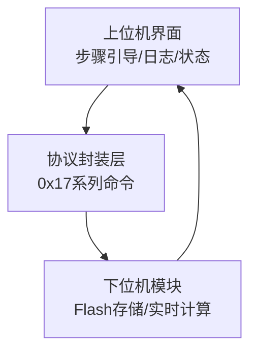
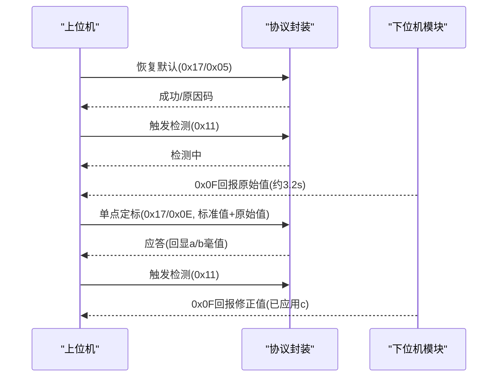
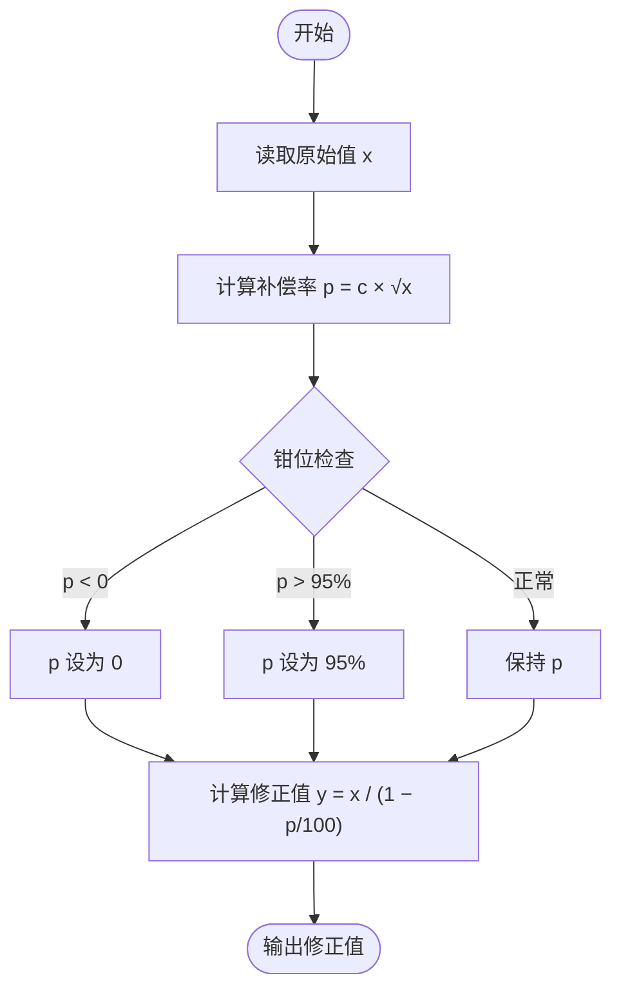
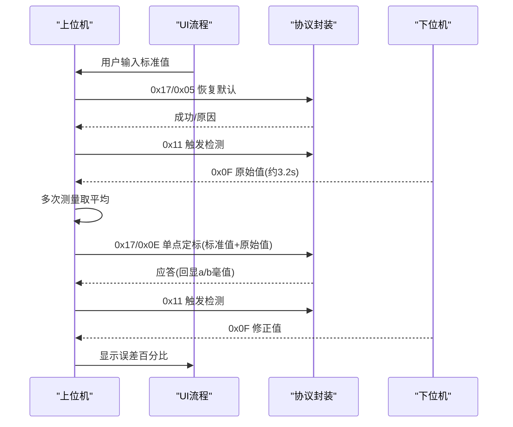
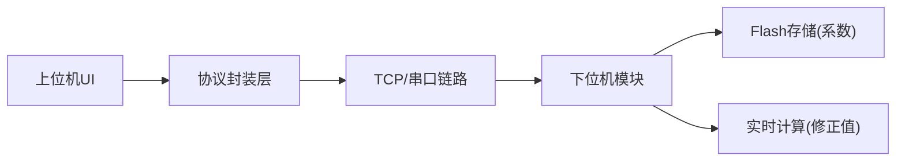

# 校准概述与原理

<cite>
**本文引用的文件**
- [单点定标协议与流程_V1.0.html](file://Insulator_Zero_Value_Detection_Robot/单点定标协议与流程_V1.0.html)
- [Insulator_Zero_Value_Detection_Robot.cpp](file://Insulator_Zero_Value_Detection_Robot/UI/Insulator_Zero_Value_Detection_Robot.cpp)
- [WHSDControlBoradProtocol.h](file://Insulator_Zero_Value_Detection_Robot/Protocol/WHSDControlBoradProtocol.h)
- [操作说明书.md](file://操作说明书.md)
</cite>

## 目录
1. [引言](#引言)
2. [项目结构](#项目结构)
3. [核心组件](#核心组件)
4. [架构总览](#架构总览)
5. [详细组件分析](#详细组件分析)
6. [依赖关系分析](#依赖关系分析)
7. [性能考虑](#性能考虑)
8. [故障排查指南](#故障排查指南)
9. [结论](#结论)
10. [附录：校准前后数据对比示例](#附录校准前后数据对比示例)

## 引言
本章节面向绝缘子零值检测机器人V2的现场工程师与维护人员，系统阐述“校准”的目的、必要性与对检测精度的影响；并基于固件内置的单点定标模型，解释补偿率公式、安全钳位机制以及按 √x 规律自动延伸补偿的工作原理。文档同时给出校准操作流程要点与常见问题定位方法，帮助用户快速完成一次可靠的单点定标。

## 项目结构
本项目中与校准相关的实现主要分布在以下位置：
- 协议与命令封装：用于构建/解析校准相关帧（如恢复默认、查询原始值、读回系数、补偿验证、单点定标）。
- 上位机UI与流程控制：引导用户完成“恢复默认—测原始值—下发定标—验证”的完整流程，记录日志与状态。
- 协议文档：定义通信格式、命令语义与单点定标算法说明。

图表来源
- [Insulator_Zero_Value_Detection_Robot.cpp:941-1292](file://Insulator_Zero_Value_Detection_Robot/UI/Insulator_Zero_Value_Detection_Robot.cpp#L941-L1292)
- [WHSDControlBoradProtocol.h:258-287](file://Insulator_Zero_Value_Detection_Robot/Protocol/WHSDControlBoradProtocol.h#L258-L287)
- [单点定标协议与流程_V1.0.html:45-93](file://Insulator_Zero_Value_Detection_Robot/单点定标协议与流程_V1.0.html#L45-L93)

章节来源
- [Insulator_Zero_Value_Detection_Robot.cpp:941-1292](file://Insulator_Zero_Value_Detection_Robot/UI/Insulator_Zero_Value_Detection_Robot.cpp#L941-L1292)
- [WHSDControlBoradProtocol.h:258-287](file://Insulator_Zero_Value_Detection_Robot/Protocol/WHSDControlBoradProtocol.h#L258-L287)
- [单点定标协议与流程_V1.0.html:45-93](file://Insulator_Zero_Value_Detection_Robot/单点定标协议与流程_V1.0.html#L45-L93)

## 核心组件
- 校准命令集（0x17系列）：包括恢复默认、查询原始值、读回系数、补偿验证、单点定标等，均由协议层封装为可发送的帧。
- 上位机校准流程：负责引导用户输入标准值、采集三次原始值取平均、合法性校验、下发单点定标、读取应答与结果展示。
- 固件补偿模型：在单点定标时根据“需求补偿率 p% = (1 − 实测原始值 / 标准值) × 100”与“补偿系数 c = p ÷ √实测原始值”计算系数，并在后续测量中按 p = c × √x 计算补偿率，输出修正值 y = x / (1 − p/100)，同时实施安全钳位（p < 0 按 0 计，p > 95% 按 95% 计）。

章节来源
- [单点定标协议与流程_V1.0.html:57-61](file://Insulator_Zero_Value_Detection_Robot/单点定标协议与流程_V1.0.html#L57-L61)
- [Insulator_Zero_Value_Detection_Robot.cpp:1007-1114](file://Insulator_Zero_Value_Detection_Robot/UI/Insulator_Zero_Value_Detection_Robot.cpp#L1007-L1114)
- [WHSDControlBoradProtocol.h:258-287](file://Insulator_Zero_Value_Detection_Robot/Protocol/WHSDControlBoradProtocol.h#L258-L287)

## 架构总览
校准过程由上位机驱动，通过TCP链路向模块发送0x17系列命令，模块执行相应动作并返回应答。关键路径如下：
- 恢复默认：清空旧校准，测量通道直通，确保后续测量得到未补偿的原始值。
- 测量原始值：触发检测后等待约3.2秒上报原始值，建议连测多次取平均。
- 单点定标：将“标准值 + 实测原始值”以毫值大端形式下发，模块内部计算c并写入Flash，立即生效。
- 验证：再次触发检测或进行离线抽查，确认修正值与标准值的误差。

图表来源
- [Insulator_Zero_Value_Detection_Robot.cpp:941-1292](file://Insulator_Zero_Value_Detection_Robot/UI/Insulator_Zero_Value_Detection_Robot.cpp#L941-L1292)
- [单点定标协议与流程_V1.0.html:64-93](file://Insulator_Zero_Value_Detection_Robot/单点定标协议与流程_V1.0.html#L64-L93)

## 详细组件分析

### 校准的重要性与必要性
- 设备漂移与环境变化会导致传感器读数偏离真实值，直接影响零值检测精度。
- 通过单点定标建立“原始值→修正值”的映射关系，使各档位测量具备一致性与可比性。
- 校准参数（毫值、原始值、修正值）统一单位与口径，避免换算错误导致的系统性偏差。

章节来源
- [单点定标协议与流程_V1.0.html:34-43](file://Insulator_Zero_Value_Detection_Robot/单点定标协议与流程_V1.0.html#L34-L43)
- [操作说明书.md:376-392](file://操作说明书.md#L376-L392)

### 单点定标的核心原理
- 需求补偿率：p% = (1 − 实测原始值 / 标准值) × 100
- 补偿系数：c = p ÷ √实测原始值（b固定为0）
- 运行时补偿：每次测量按 p = c × √x 计算补偿率，输出修正值 y = x / (1 − p/100)
- 安全钳位：p < 0 按 0 计，p > 95% 按 95% 计，防止过度补偿导致不稳定
- 自动延伸补偿：定标档零误差，其余各档按 √x 规律自动延伸补偿，保证跨档一致性

图表来源
- [单点定标协议与流程_V1.0.html:57-61](file://Insulator_Zero_Value_Detection_Robot/单点定标协议与流程_V1.0.html#L57-L61)

章节来源
- [单点定标协议与流程_V1.0.html:57-61](file://Insulator_Zero_Value_Detection_Robot/单点定标协议与流程_V1.0.html#L57-L61)

### 校准参数的含义与转换关系
- 毫值：物理值 × 1000 的整数（例如 500 MΩ → 500000 毫值），用于协议传输与存储，避免小数精度问题。
- 原始值：模块未经补偿的测量输出，单位为MΩ（显示）或毫值（传输）。
- 修正值：应用补偿后的输出，单位为MΩ（显示）或毫值（传输）。
- 转换关系：
  - 物理值 ↔ 毫值：乘以或除以1000
  - 原始值 → 修正值：y = x / (1 − p/100)，其中 p = c × √x

章节来源
- [单点定标协议与流程_V1.0.html:43-55](file://Insulator_Zero_Value_Detection_Robot/单点定标协议与流程_V1.0.html#L43-L55)
- [Insulator_Zero_Value_Detection_Robot.cpp:913-921](file://Insulator_Zero_Value_Detection_Robot/UI/Insulator_Zero_Value_Detection_Robot.cpp#L913-L921)

### 固件内置补偿率公式与安全钳位
- 公式模型：p% = (1 − 实测原始值 / 标准值) × 100；c = p ÷ √实测原始值（b=0）
- 运行期：p = c × √x；修正值 y = x / (1 − p/100)
- 安全钳位：p < 0 按 0 计，p > 95% 按 95% 计，保障稳定性与安全性

章节来源
- [单点定标协议与流程_V1.0.html:57-61](file://Insulator_Zero_Value_Detection_Robot/单点定标协议与流程_V1.0.html#L57-L61)

### 校准后各档位的自动延伸补偿（√x 规律）
- 定标档：在该档上强制零误差（即该档的修正值等于标准值）
- 其他档位：按 √x 规律自动延伸补偿，使得不同量程下的补偿比例平滑过渡，提升整体一致性
- 优势：减少跨档切换带来的非线性误差，提高多档位测量的可靠性

章节来源
- [单点定标协议与流程_V1.0.html:57-61](file://Insulator_Zero_Value_Detection_Robot/单点定标协议与流程_V1.0.html#L57-L61)

### 上位机校准流程与交互
- 步骤① 恢复默认：清空旧校准，测量通道直通，确保后续测量得到原始值
- 步骤② 测原始值：触发检测，等待约3.2秒上报原始值，建议连测2~3次取平均
- 步骤③ 下发定标：将“标准值 + 实测原始值”以毫值大端形式下发，模块内部计算c并写入Flash，立即生效
- 步骤④ 验证：再次触发检测或进行离线抽查，查看修正值与标准值的误差

图表来源
- [Insulator_Zero_Value_Detection_Robot.cpp:941-1292](file://Insulator_Zero_Value_Detection_Robot/UI/Insulator_Zero_Value_Detection_Robot.cpp#L941-L1292)
- [单点定标协议与流程_V1.0.html:107-125](file://Insulator_Zero_Value_Detection_Robot/单点定标协议与流程_V1.0.html#L107-L125)

章节来源
- [操作说明书.md:376-392](file://操作说明书.md#L376-L392)
- [Insulator_Zero_Value_Detection_Robot.cpp:941-1292](file://Insulator_Zero_Value_Detection_Robot/UI/Insulator_Zero_Value_Detection_Robot.cpp#L941-L1292)

## 依赖关系分析
- 上位机UI依赖协议封装层提供统一的命令构造与解析能力。
- 协议封装层依赖网络/串口链路，负责帧头、长度、地址、命令字、数据域、校验与帧尾的组装与校验。
- 下位机模块依赖Flash存储校准系数，并在每次测量时实时计算修正值。

图表来源
- [Insulator_Zero_Value_Detection_Robot.cpp:941-1292](file://Insulator_Zero_Value_Detection_Robot/UI/Insulator_Zero_Value_Detection_Robot.cpp#L941-L1292)
- [WHSDControlBoradProtocol.h:258-287](file://Insulator_Zero_Value_Detection_Robot/Protocol/WHSDControlBoradProtocol.h#L258-L287)
- [单点定标协议与流程_V1.0.html:45-55](file://Insulator_Zero_Value_Detection_Robot/单点定标协议与流程_V1.0.html#L45-L55)

章节来源
- [Insulator_Zero_Value_Detection_Robot.cpp:941-1292](file://Insulator_Zero_Value_Detection_Robot/UI/Insulator_Zero_Value_Detection_Robot.cpp#L941-L1292)
- [WHSDControlBoradProtocol.h:258-287](file://Insulator_Zero_Value_Detection_Robot/Protocol/WHSDControlBoradProtocol.h#L258-L287)
- [单点定标协议与流程_V1.0.html:45-55](file://Insulator_Zero_Value_Detection_Robot/单点定标协议与流程_V1.0.html#L45-L55)

## 性能考虑
- 写Flash耗时：单点定标需擦写Flash Sector4，耗时约1~2秒，上位机应答超时应设置≥3秒。
- 测量间隔：0x0F回报约3.2秒，建议连续测量2~3次取平均以降低随机噪声。
- 环境稳定：尽量在同一环境与批次内完成校准与验证，避免日间漂移污染系数。
- 心跳维持：全程保持心跳，断链可能触发舵机归零等保护行为。

章节来源
- [单点定标协议与流程_V1.0.html:117-125](file://Insulator_Zero_Value_Detection_Robot/单点定标协议与流程_V1.0.html#L117-L125)
- [操作说明书.md:376-392](file://操作说明书.md#L376-L392)

## 故障排查指南
- 0x06 查询原始值返回原因0x01：距上次0x0F超5秒，重新触发检测后立即查询。
- 0x0E 单点定标返回原因0x09：参数非法（标准值或原始值≤0，或原始值≥标准值），说明模块读数偏高，应检查接线与硬件，勿强行定标。
- 0x0E 返回原因0x05：参数不是8字节，检查组帧（标准值4B + 原始值4B，毫值大端）。
- 定标后各档整体偏移：模块日间漂移，同环境重测基准档再发一次0x0E覆盖。
- 0x0E 应答慢（1~2秒）：正常现象（需擦写Flash Sector4），超时设≥3秒。

章节来源
- [单点定标协议与流程_V1.0.html:140-148](file://Insulator_Zero_Value_Detection_Robot/单点定标协议与流程_V1.0.html#L140-L148)
- [Insulator_Zero_Value_Detection_Robot.cpp:924-939](file://Insulator_Zero_Value_Detection_Robot/UI/Insulator_Zero_Value_Detection_Robot.cpp#L924-L939)

## 结论
通过单点定标与√x自动延伸补偿，绝缘子零值检测机器人在多档位下可实现一致的测量精度与稳定性。遵循“恢复默认—测原始值—下发定标—验证”的流程，结合安全钳位与超时保护，可有效降低系统漂移与随机误差的影响。建议在相同环境与批次内完成校准与验证，并定期复核系数以确保长期可靠性。

## 附录：校准前后数据对比示例
以下为协议文档中的实机收发示例，便于理解校准效果：
- 示例一：标准值500 MΩ，实测原始值419.333 MΩ
  - 固件内部核算：p% = (1 − 419.333/500) × 100 = 16.1334%
  - 补偿系数：c = 16.1334 ÷ √419.333 ≈ 0.788
  - 定标档零误差：419.333 → 500.02 MΩ
- 示例二：补偿验证（不挂电阻）
  - 下发原始值788 MΩ，回显“原始值 + 校准后值”，用于离线抽查系数是否生效

章节来源
- [单点定标协议与流程_V1.0.html:79-105](file://Insulator_Zero_Value_Detection_Robot/单点定标协议与流程_V1.0.html#L79-L105)