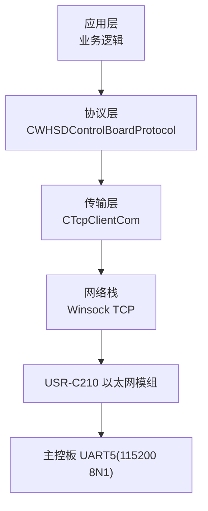
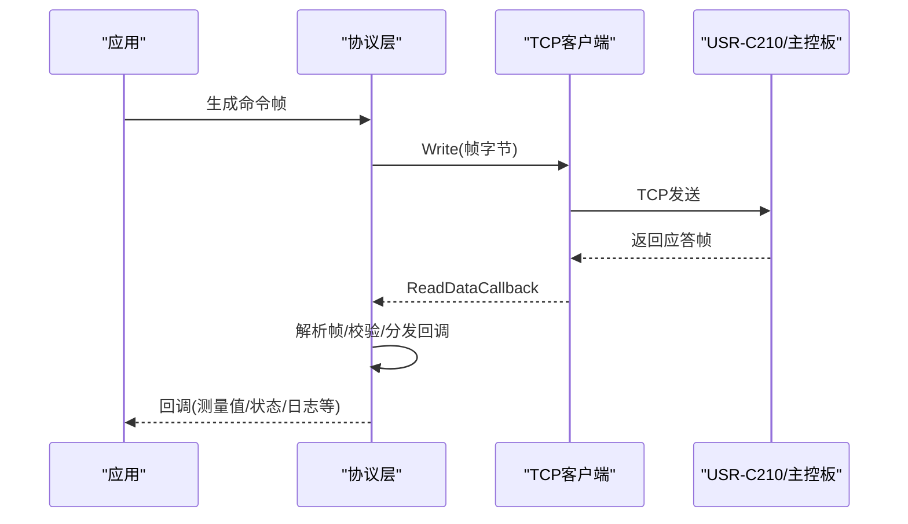
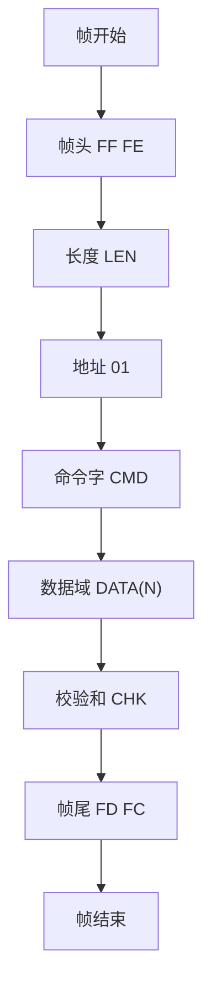
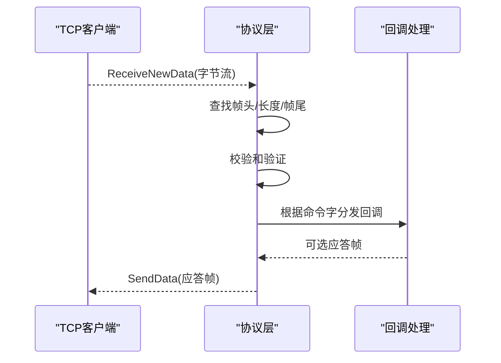
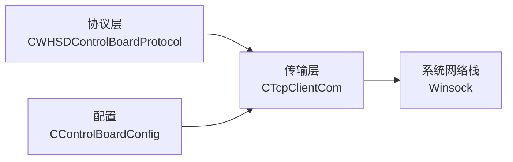

# 协议概述与帧格式

<cite>
**本文引用的文件**
- [WHSDControlBoradProtocol.h](file://Insulator_Zero_Value_Detection_Robot/Protocol/WHSDControlBoradProtocol.h)
- [WHSDControlBoradProtocol.cpp](file://Insulator_Zero_Value_Detection_Robot/Protocol/WHSDControlBoradProtocol.cpp)
- [TcpClient.h](file://Insulator_Zero_Value_Detection_Robot/DeviceCom/TcpClient.h)
- [TcpClient.cpp](file://Insulator_Zero_Value_Detection_Robot/DeviceCom/TcpClient.cpp)
- [ConfigManager.h](file://Insulator_Zero_Value_Detection_Robot/Config/ConfigManager.h)
- [单点定标协议与流程_V1.0.html](file://Insulator_Zero_Value_Detection_Robot/单点定标协议与流程_V1.0.html)
</cite>

## 目录
1. [简介](#简介)
2. [项目结构](#项目结构)
3. [核心组件](#核心组件)
4. [架构总览](#架构总览)
5. [详细组件分析](#详细组件分析)
6. [依赖关系分析](#依赖关系分析)
7. [性能考虑](#性能考虑)
8. [故障排查指南](#故障排查指南)
9. [结论](#结论)
10. [附录：术语与示例](#附录：术语与示例)

## 简介
本文件为绝缘子零值检测机器人V2的通信协议概述，聚焦通用帧格式、物理链路配置、网络参数、数据类型约定（大端、毫值）、以及校验和计算方法。文档同时给出帧结构图与校验计算示例，便于快速实现与联调。

## 项目结构
本项目中与通信协议直接相关的代码主要位于以下模块：
- 协议解析与组帧：Protocol 目录下的控制板协议类
- 网络传输：DeviceCom 目录下的 TCP 客户端
- 配置管理：Config 目录下的设备网络参数结构
- 协议参考文档：单点定标协议与流程 V1.0（含物理链路与网络参数）

图表来源
- [WHSDControlBoradProtocol.cpp:228-444](file://Insulator_Zero_Value_Detection_Robot/Protocol/WHSDControlBoradProtocol.cpp#L228-L444)
- [TcpClient.cpp:23-87](file://Insulator_Zero_Value_Detection_Robot/DeviceCom/TcpClient.cpp#L23-L87)
- [单点定标协议与流程_V1.0.html:34-43](file://Insulator_Zero_Value_Detection_Robot/单点定标协议与流程_V1.0.html#L34-L43)

章节来源
- [WHSDControlBoradProtocol.h:189-356](file://Insulator_Zero_Value_Detection_Robot/Protocol/WHSDControlBoradProtocol.h#L189-L356)
- [WHSDControlBoradProtocol.cpp:228-444](file://Insulator_Zero_Value_Detection_Robot/Protocol/WHSDControlBoradProtocol.cpp#L228-L444)
- [TcpClient.h:8-46](file://Insulator_Zero_Value_Detection_Robot/DeviceCom/TcpClient.h#L8-L46)
- [TcpClient.cpp:23-87](file://Insulator_Zero_Value_Detection_Robot/DeviceCom/TcpClient.cpp#L23-L87)
- [ConfigManager.h:10-24](file://Insulator_Zero_Value_Detection_Robot/Config/ConfigManager.h#L10-L24)
- [单点定标协议与流程_V1.0.html:34-43](file://Insulator_Zero_Value_Detection_Robot/单点定标协议与流程_V1.0.html#L34-L43)

## 核心组件
- 协议封装类：负责帧组装、解析、回调分发、心跳与OTA等
- TCP 客户端：负责连接、收发线程、队列与重连
- 配置结构：保存设备IP、端口、心跳周期等

关键职责
- 帧头/长度/地址/命令字/数据域/校验/帧尾的构造与校验
- 多字节整数统一为大端；X值与校准参数使用 int32 毫值
- 将接收到的原始字节流按帧边界切分并解析到上层回调

章节来源
- [WHSDControlBoradProtocol.h:189-356](file://Insulator_Zero_Value_Detection_Robot/Protocol/WHSDControlBoradProtocol.h#L189-L356)
- [WHSDControlBoradProtocol.cpp:654-677](file://Insulator_Zero_Value_Detection_Robot/Protocol/WHSDControlBoradProtocol.cpp#L654-L677)
- [TcpClient.h:8-46](file://Insulator_Zero_Value_Detection_Robot/DeviceCom/TcpClient.h#L8-L46)
- [TcpClient.cpp:23-87](file://Insulator_Zero_Value_Detection_Robot/DeviceCom/TcpClient.cpp#L23-L87)
- [ConfigManager.h:10-24](file://Insulator_Zero_Value_Detection_Robot/Config/ConfigManager.h#L10-L24)

## 架构总览
上位机通过 TCP 向 USR-C210 发送标准帧，下位机经串口透传到主控板；下行命令与上行应答均遵循同一帧格式。心跳用于维持链路活跃，异常时触发安全动作。

图表来源
- [WHSDControlBoradProtocol.cpp:213-226](file://Insulator_Zero_Value_Detection_Robot/Protocol/WHSDControlBoradProtocol.cpp#L213-L226)
- [WHSDControlBoradProtocol.cpp:228-444](file://Insulator_Zero_Value_Detection_Robot/Protocol/WHSDControlBoradProtocol.cpp#L228-L444)
- [TcpClient.cpp:238-382](file://Insulator_Zero_Value_Detection_Robot/DeviceCom/TcpClient.cpp#L238-L382)

## 详细组件分析

### 通用帧格式规范
- 帧头：固定 2 字节 FF FE
- 长度：1 字节，表示整帧总字节数（包含长度字段本身与校验字段）
- 地址：1 字节，固定 01
- 命令字：1 字节，标识具体操作
- 数据域：N 字节，承载命令参数或响应数据
- 校验和 CHK：1 字节，从帧头到数据域末尾所有字节累加和的低 8 位
- 帧尾：固定 2 字节 FD FC

说明
- 长度 LEN = 帧头(2) + 长度(1) + 地址(1) + 命令(1) + 数据域(N) + 校验(1) + 帧尾(2)
- 校验和 CHK = (FF+FE+LEN+ADDR+CMD+DATA[0..N-1]) mod 256
- 多字节整数一律大端（高位在前），X值与校准参数为 int32 毫值

章节来源
- [WHSDControlBoradProtocol.cpp:228-255](file://Insulator_Zero_Value_Detection_Robot/Protocol/WHSDControlBoradProtocol.cpp#L228-L255)
- [WHSDControlBoradProtocol.cpp:654-677](file://Insulator_Zero_Value_Detection_Robot/Protocol/WHSDControlBoradProtocol.cpp#L654-L677)
- [单点定标协议与流程_V1.0.html:45-55](file://Insulator_Zero_Value_Detection_Robot/单点定标协议与流程_V1.0.html#L45-L55)

### 物理链路配置
- 物理链路：主控板 UART5（115200 8N1）→ USR-C210 以太网模组 → TCP
- 网络参数：静态 IP 192.168.11.111，TCP 端口 8234

章节来源
- [单点定标协议与流程_V1.0.html:34-43](file://Insulator_Zero_Value_Detection_Robot/单点定标协议与流程_V1.0.html#L34-L43)
- [ConfigManager.h:10-24](file://Insulator_Zero_Value_Detection_Robot/Config/ConfigManager.h#L10-L24)

### 数据类型与大端格式
- 多字节整数一律大端（高位在前）
- X值与校准相关参数采用 int32 毫值（有符号）
- 提供大端写入与读取工具方法，确保上下位一致

章节来源
- [WHSDControlBoradProtocol.h:292-300](file://Insulator_Zero_Value_Detection_Robot/Protocol/WHSDControlBoradProtocol.h#L292-L300)
- [WHSDControlBoradProtocol.cpp:562-580](file://Insulator_Zero_Value_Detection_Robot/Protocol/WHSDControlBoradProtocol.cpp#L562-L580)

### 帧结构图

图表来源
- [WHSDControlBoradProtocol.cpp:654-677](file://Insulator_Zero_Value_Detection_Robot/Protocol/WHSDControlBoradProtocol.cpp#L654-L677)

### 校验和计算示例
以“恢复默认”命令为例（仅展示字段含义，不粘贴源码）：
- 帧头：FF FE
- 长度：09（整帧9字节）
- 地址：01
- 命令：17
- 数据域：05
- 校验：对前序所有字节累加取低8位
- 帧尾：FD FC

校验过程
- 累加：FF + FE + 09 + 01 + 17 + 05 = 计算得到累加和
- 取低8位即为CHK
- 拼接帧尾 FD FC 完成一帧

章节来源
- [WHSDControlBoradProtocol.cpp:654-677](file://Insulator_Zero_Value_Detection_Robot/Protocol/WHSDControlBoradProtocol.cpp#L654-L677)
- [单点定标协议与流程_V1.0.html:45-55](file://Insulator_Zero_Value_Detection_Robot/单点定标协议与流程_V1.0.html#L45-L55)

### 解析与回调流程
- 接收新数据后追加至缓冲区，循环尝试解析完整帧
- 找到帧头后根据长度判断是否完整，再校验帧尾与校验和
- 解析成功后提取命令字与数据域，调用对应回调（如测量结果、心跳、日志、校准应答等）

图表来源
- [WHSDControlBoradProtocol.cpp:213-226](file://Insulator_Zero_Value_Detection_Robot/Protocol/WHSDControlBoradProtocol.cpp#L213-L226)
- [WHSDControlBoradProtocol.cpp:228-444](file://Insulator_Zero_Value_Detection_Robot/Protocol/WHSDControlBoradProtocol.cpp#L228-L444)
- [WHSDControlBoradProtocol.cpp:631-652](file://Insulator_Zero_Value_Detection_Robot/Protocol/WHSDControlBoradProtocol.cpp#L631-L652)

## 依赖关系分析
- 协议层依赖 TCP 客户端进行数据收发
- TCP 客户端依赖操作系统 Winsock 实现 TCP 连接与IO
- 配置模块提供设备网络参数（IP、端口、心跳周期）

图表来源
- [WHSDControlBoradProtocol.cpp:761-767](file://Insulator_Zero_Value_Detection_Robot/Protocol/WHSDControlBoradProtocol.cpp#L761-L767)
- [TcpClient.cpp:59-87](file://Insulator_Zero_Value_Detection_Robot/DeviceCom/TcpClient.cpp#L59-L87)
- [ConfigManager.h:10-24](file://Insulator_Zero_Value_Detection_Robot/Config/ConfigManager.h#L10-L24)

章节来源
- [WHSDControlBoradProtocol.cpp:761-767](file://Insulator_Zero_Value_Detection_Robot/Protocol/WHSDControlBoradProtocol.cpp#L761-L767)
- [TcpClient.cpp:59-87](file://Insulator_Zero_Value_Detection_Robot/DeviceCom/TcpClient.cpp#L59-L87)
- [ConfigManager.h:10-24](file://Insulator_Zero_Value_Detection_Robot/Config/ConfigManager.h#L10-L24)

## 性能考虑
- 心跳机制：周期性发送心跳帧，避免长时间无交互导致的安全动作
- 非阻塞IO：TCP接收使用select超时，避免阻塞主循环
- 帧解析缓冲：按帧边界切分，避免粘包/半包问题影响解析
- OTA分包：按固定长度分包发送，降低单次传输压力

章节来源
- [WHSDControlBoradProtocol.cpp:769-782](file://Insulator_Zero_Value_Detection_Robot/Protocol/WHSDControlBoradProtocol.cpp#L769-L782)
- [TcpClient.cpp:301-382](file://Insulator_Zero_Value_Detection_Robot/DeviceCom/TcpClient.cpp#L301-L382)
- [WHSDControlBoradProtocol.cpp:679-759](file://Insulator_Zero_Value_Detection_Robot/Protocol/WHSDControlBoradProtocol.cpp#L679-L759)

## 故障排查指南
常见问题与定位要点
- 校验失败：检查帧头/长度/地址/命令/数据域是否正确，确认校验和计算范围（帧头到数据域末尾）
- 解析不到帧：确认帧尾 FD FC 是否存在且位置正确；检查长度字段与实际数据是否匹配
- 连接断开：检查TCP连接状态与重试逻辑；确认目标IP与端口配置
- 心跳丢失：确认心跳周期设置与发送线程运行状态

章节来源
- [WHSDControlBoradProtocol.cpp:228-444](file://Insulator_Zero_Value_Detection_Robot/Protocol/WHSDControlBoradProtocol.cpp#L228-L444)
- [TcpClient.cpp:123-150](file://Insulator_Zero_Value_Detection_Robot/DeviceCom/TcpClient.cpp#L123-L150)
- [单点定标协议与流程_V1.0.html:140-148](file://Insulator_Zero_Value_Detection_Robot/单点定标协议与流程_V1.0.html#L140-L148)

## 结论
本概述明确了V2机器人的通用帧格式、物理链路、网络参数、数据类型与校验规则，提供了帧结构与校验示例，帮助快速实现与调试。建议在实际部署中严格遵循大端与毫值约定，并确保心跳与超时策略合理，以提升稳定性。

## 附录：术语与示例
- 毫值：物理值 × 1000 的整数表示（例如 500 MΩ 表示为 500000）
- 原始值：检测模块未经补偿的测量输出（int32 毫值）
- 修正值：经过补偿后的输出（int32 毫值）

章节来源
- [单点定标协议与流程_V1.0.html:34-43](file://Insulator_Zero_Value_Detection_Robot/单点定标协议与流程_V1.0.html#L34-L43)
- [WHSDControlBoradProtocol.cpp:321-342](file://Insulator_Zero_Value_Detection_Robot/Protocol/WHSDControlBoradProtocol.cpp#L321-L342)