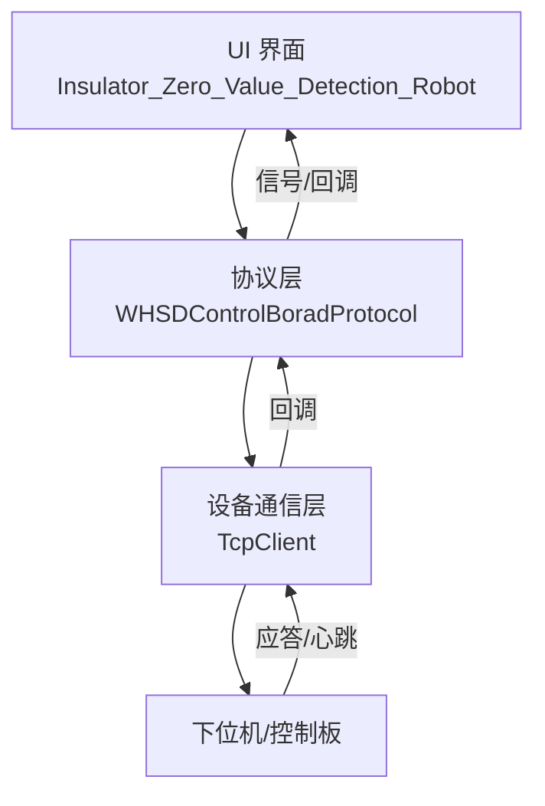
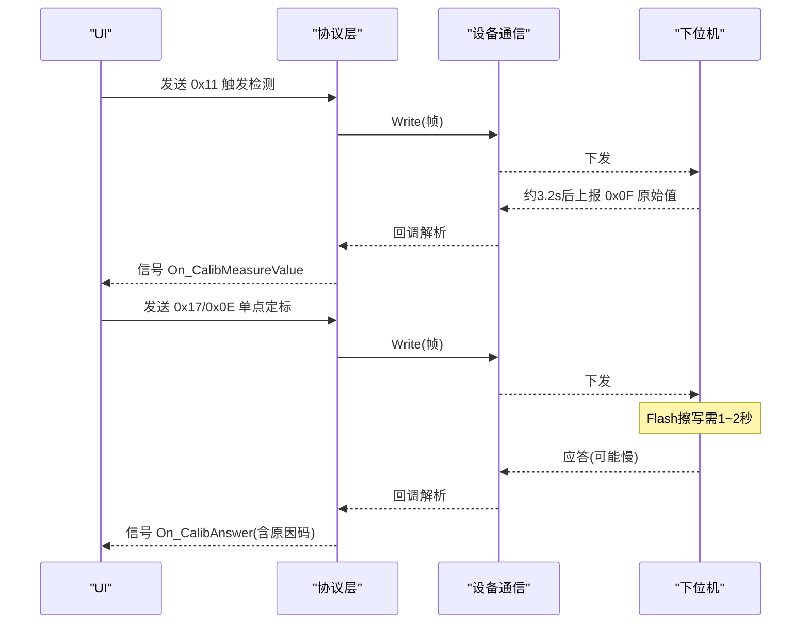
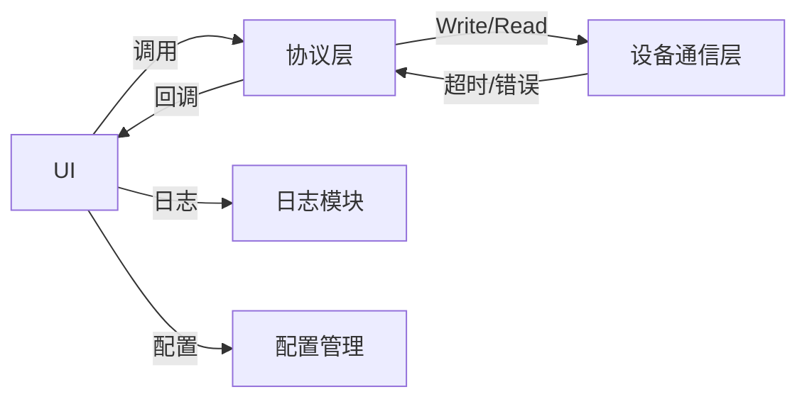
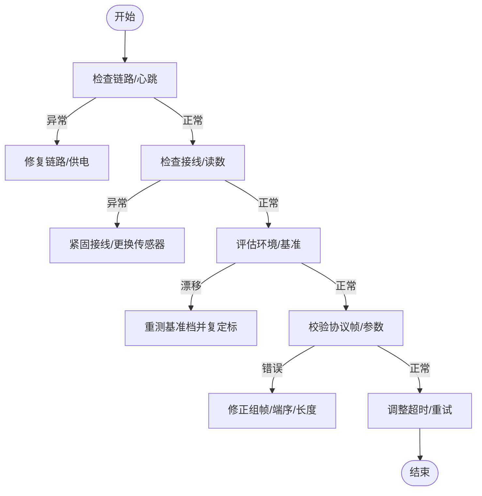

# 故障排查与异常处理

<cite>
**本文引用的文件**
- [单点定标协议与流程_V1.0.html](file://Insulator_Zero_Value_Detection_Robot/单点定标协议与流程_V1.0.html)
- [WHSDControlBoradProtocol.h](file://Insulator_Zero_Value_Detection_Robot/Protocol/WHSDControlBoradProtocol.h)
- [WHSDControlBoradProtocol.cpp](file://Insulator_Zero_Value_Detection_Robot/Protocol/WHSDControlBoradProtocol.cpp)
- [Insulator_Zero_Value_Detection_Robot.h](file://Insulator_Zero_Value_Detection_Robot/UI/Insulator_Zero_Value_Detection_Robot.h)
- [Insulator_Zero_Value_Detection_Robot.cpp](file://Insulator_Zero_Value_Detection_Robot/UI/Insulator_Zero_Value_Detection_Robot.cpp)
- [TcpClient.cpp](file://Insulator_Zero_Value_Detection_Robot/DeviceCom/TcpClient.cpp)
</cite>

## 目录
1. [简介](#简介)
2. [项目结构](#项目结构)
3. [核心组件](#核心组件)
4. [架构总览](#架构总览)
5. [详细组件分析](#详细组件分析)
6. [依赖关系分析](#依赖关系分析)
7. [性能与超时设置](#性能与超时设置)
8. [系统性故障排查流程](#系统性故障排查流程)
9. [常见问题与解决方案](#常见问题与解决方案)
10. [结论](#结论)

## 简介
本文件面向绝缘子零值检测机器人V2的现场运维与调试人员，聚焦于通信应答异常、定标漂移、超时与参数错误等高频问题，提供可操作的诊断步骤与修复建议。内容覆盖：
- 0x06 查询原始值应答原因 0x01（超时）的诊断与处理
- 0x0E 单点定标应答原因 0x09（参数非法）与 0x05（参数格式错误）的处理
- 定标后各档整体偏移漂移的原因与复定标方法
- 0x0E 应答慢（1~2秒）的正常性与超时设置建议
- 硬件连接检查、模块读数验证与环境因素考虑
- 系统化的故障排查流程与预防措施

## 项目结构
本项目采用分层设计：UI层负责交互与流程控制；协议层封装设备命令帧与应答解析；设备通信层负责串口/网络收发；日志与配置用于排障与持久化。关键路径包括：
- UI 触发测量/定标 → 协议层组帧 → 设备通信层下发 → 设备应答 → 协议层解析 → UI 状态推进与提示
- 心跳机制保障链路健康，断链将触发安全动作（如舵机归零）

图表来源
- [Insulator_Zero_Value_Detection_Robot.cpp:873-911](file://Insulator_Zero_Value_Detection_Robot/UI/Insulator_Zero_Value_Detection_Robot.cpp#L873-L911)
- [WHSDControlBoradProtocol.cpp:395-444](file://Insulator_Zero_Value_Detection_Robot/Protocol/WHSDControlBoradProtocol.cpp#L395-L444)
- [TcpClient.cpp:314-367](file://Insulator_Zero_Value_Detection_Robot/DeviceCom/TcpClient.cpp#L314-L367)

章节来源
- [Insulator_Zero_Value_Detection_Robot.cpp:873-911](file://Insulator_Zero_Value_Detection_Robot/UI/Insulator_Zero_Value_Detection_Robot.cpp#L873-L911)
- [WHSDControlBoradProtocol.cpp:395-444](file://Insulator_Zero_Value_Detection_Robot/Protocol/WHSDControlBoradProtocol.cpp#L395-L444)
- [TcpClient.cpp:314-367](file://Insulator_Zero_Value_Detection_Robot/DeviceCom/TcpClient.cpp#L314-L367)

## 核心组件
- 校准应答数据模型：统一包含子命令、结果、原因码与两参数字段，便于上层按原因码分支处理
- 协议命令封装：提供恢复默认、查询原始值、读回系数、补偿验证、单点定标等静态方法
- UI 定标流程：分步等待与超时管理，支持失败重试与日志记录
- 设备通信：TCP 客户端带超时与重连策略，保证链路健壮性

章节来源
- [WHSDControlBoradProtocol.h:17-52](file://Insulator_Zero_Value_Detection_Robot/Protocol/WHSDControlBoradProtocol.h#L17-L52)
- [WHSDControlBoradProtocol.h:256-287](file://Insulator_Zero_Value_Detection_Robot/Protocol/WHSDControlBoradProtocol.h#L256-L287)
- [Insulator_Zero_Value_Detection_Robot.h:315-358](file://Insulator_Zero_Value_Detection_Robot/UI/Insulator_Zero_Value_Detection_Robot.h#L315-L358)

## 架构总览
下图展示一次“查询原始值→定标→验证”的典型时序，突出超时与原因码处理节点。

图表来源
- [Insulator_Zero_Value_Detection_Robot.cpp:894-911](file://Insulator_Zero_Value_Detection_Robot/UI/Insulator_Zero_Value_Detection_Robot.cpp#L894-L911)
- [Insulator_Zero_Value_Detection_Robot.cpp:1116-1127](file://Insulator_Zero_Value_Detection_Robot/UI/Insulator_Zero_Value_Detection_Robot.cpp#L1116-L1127)
- [WHSDControlBoradProtocol.cpp:612-636](file://Insulator_Zero_Value_Detection_Robot/Protocol/WHSDControlBoradProtocol.cpp#L612-L636)

## 详细组件分析

### 校准应答与原因码处理
- 原因码定义：0x01 原始值已超时；0x04 Flash写失败；0x05 参数长度/格式错误；0x09 参数非法
- UI 侧对原因码进行可读化解释并引导下一步操作
- 0x0E 写入Flash耗时较长，需使用更长的超时保护

章节来源
- [WHSDControlBoradProtocol.h:31-49](file://Insulator_Zero_Value_Detection_Robot/Protocol/WHSDControlBoradProtocol.h#L31-L49)
- [Insulator_Zero_Value_Detection_Robot.cpp:930-938](file://Insulator_Zero_Value_Detection_Robot/UI/Insulator_Zero_Value_Detection_Robot.cpp#L930-L938)

### 查询原始值 0x06 与超时 0x01
- 现象：0x06 返回原因 0x01，表示距上次 0x0F 回报已超过5秒
- 处理：重新触发检测（0x11），随后立即查询（0x06）；避免在长时间无测量后直接查询
- 建议：在每次 0x0F 回报后的5秒窗口内完成复核

章节来源
- [单点定标协议与流程_V1.0.html:140-148](file://Insulator_Zero_Value_Detection_Robot/单点定标协议与流程_V1.0.html#L140-L148)
- [Insulator_Zero_Value_Detection_Robot.cpp:1190-1196](file://Insulator_Zero_Value_Detection_Robot/UI/Insulator_Zero_Value_Detection_Robot.cpp#L1190-L1196)

### 单点定标 0x0E 原因 0x09（参数非法）
- 现象：标准值或原始值 ≤ 0，或原始值 ≥ 标准值（负补偿需求）
- 根因：模块读数偏高或接线异常导致原始值不满足物理约束
- 处理：检查接线与模块读数，勿强行定标；必要时更换电阻或排查传感器
- 预防：上位机先做合法性校验再下发，减少无效请求

章节来源
- [单点定标协议与流程_V1.0.html:140-148](file://Insulator_Zero_Value_Detection_Robot/单点定标协议与流程_V1.0.html#L140-L148)
- [Insulator_Zero_Value_Detection_Robot.cpp:1095-1102](file://Insulator_Zero_Value_Detection_Robot/UI/Insulator_Zero_Value_Detection_Robot.cpp#L1095-L1102)
- [Insulator_Zero_Value_Detection_Robot.cpp:930-938](file://Insulator_Zero_Value_Detection_Robot/UI/Insulator_Zero_Value_Detection_Robot.cpp#L930-L938)

### 单点定标 0x0E 原因 0x05（参数格式错误）
- 现象：参数不是8字节（应为标准值4B+原始值4B，毫值大端）
- 处理：检查组帧逻辑与数据类型转换，确保整型为大端序且长度为4字节
- 预防：通过日志打印下行帧HEX，与协议示例帧逐字节比对

章节来源
- [单点定标协议与流程_V1.0.html:140-148](file://Insulator_Zero_Value_Detection_Robot/单点定标协议与流程_V1.0.html#L140-L148)
- [Insulator_Zero_Value_Detection_Robot.cpp:900-911](file://Insulator_Zero_Value_Detection_Robot/UI/Insulator_Zero_Value_Detection_Robot.cpp#L900-L911)

### 定标后各档整体偏移漂移
- 现象：定标后一段时间，各档读数出现整体偏移
- 原因：模块存在日间漂移，环境变化影响传感器基准
- 处理：在同一环境重测基准档，再次下发 0x0E 更新系数（后发覆盖先发，无须先清除）
- 预防：定期复定标；尽量在同批次同环境完成基准测量

章节来源
- [单点定标协议与流程_V1.0.html:140-148](file://Insulator_Zero_Value_Detection_Robot/单点定标协议与流程_V1.0.html#L140-L148)
- [Insulator_Zero_Value_Detection_Robot.cpp:1236-1249](file://Insulator_Zero_Value_Detection_Robot/UI/Insulator_Zero_Value_Detection_Robot.cpp#L1236-L1249)

### 0x0E 应答慢（1~2秒）与超时设置
- 现象：0x0E 应答较慢，属正常（需擦写Flash Sector4）
- 建议：超时时间应 ≥ 3秒，避免误判为链路故障
- 实现：UI 侧对不同步骤设置差异化超时（普通命令较快，0x0E 更长）

章节来源
- [单点定标协议与流程_V1.0.html:140-148](file://Insulator_Zero_Value_Detection_Robot/单点定标协议与流程_V1.0.html#L140-L148)
- [Insulator_Zero_Value_Detection_Robot.cpp:56-60](file://Insulator_Zero_Value_Detection_Robot/UI/Insulator_Zero_Value_Detection_Robot.cpp#L56-L60)
- [Insulator_Zero_Value_Detection_Robot.cpp:1288-1292](file://Insulator_Zero_Value_Detection_Robot/UI/Insulator_Zero_Value_Detection_Robot.cpp#L1288-L1292)

## 依赖关系分析
- UI 依赖协议层提供的命令构造与回调接口
- 协议层依赖设备通信层进行实际收发
- 设备通信层具备超时与错误处理，向上层暴露稳定接口
- 日志与配置贯穿全流程，支撑可观测性与可维护性

图表来源
- [Insulator_Zero_Value_Detection_Robot.cpp:873-911](file://Insulator_Zero_Value_Detection_Robot/UI/Insulator_Zero_Value_Detection_Robot.cpp#L873-L911)
- [WHSDControlBoradProtocol.cpp:395-444](file://Insulator_Zero_Value_Detection_Robot/Protocol/WHSDControlBoradProtocol.cpp#L395-L444)
- [TcpClient.cpp:314-367](file://Insulator_Zero_Value_Detection_Robot/DeviceCom/TcpClient.cpp#L314-L367)

章节来源
- [Insulator_Zero_Value_Detection_Robot.cpp:873-911](file://Insulator_Zero_Value_Detection_Robot/UI/Insulator_Zero_Value_Detection_Robot.cpp#L873-L911)
- [WHSDControlBoradProtocol.cpp:395-444](file://Insulator_Zero_Value_Detection_Robot/Protocol/WHSDControlBoradProtocol.cpp#L395-L444)
- [TcpClient.cpp:314-367](file://Insulator_Zero_Value_Detection_Robot/DeviceCom/TcpClient.cpp#L314-L367)

## 性能与超时设置
- 0x0F 测量回报约3.2秒，建议等待超时 ≥ 5秒
- 0x0E 写Flash需1~2秒，建议应答超时 ≥ 3秒
- 0x05/0x06/0x0C/0x0A 为普通命令，应答较快
- 心跳断链30秒会触发舵机归零，需保持链路稳定

章节来源
- [Insulator_Zero_Value_Detection_Robot.cpp:56-60](file://Insulator_Zero_Value_Detection_Robot/UI/Insulator_Zero_Value_Detection_Robot.cpp#L56-L60)
- [单点定标协议与流程_V1.0.html:122-126](file://Insulator_Zero_Value_Detection_Robot/单点定标协议与流程_V1.0.html#L122-L126)

## 系统性故障排查流程
以下为针对常见异常的标准化排查步骤，结合硬件、通信、环境与软件四维度：

1. 确认链路与健康
   - 检查控制板是否已连接，心跳计数是否正常
   - 若心跳丢失，优先恢复链路（网线/供电/重启）
   - 断链30秒将触发安全动作（舵机归零），需复位后再试

2. 核查硬件与读数
   - 检查接线是否牢固，传感器接触良好
   - 观察模块原始值是否合理（正数、小于标准值）
   - 若原始值异常偏高，可能导致 0x0E 原因 0x09

3. 环境与基准
   - 同一环境同批次完成基准测量，避免日间漂移污染系数
   - 若发现各档整体偏移，重测基准档并再次下发 0x0E

4. 协议与帧校验
   - 打印下行帧HEX，对照协议示例帧逐字节比对
   - 确认多字节整数为大端序，参数长度正确（0x0E 必须8字节）

5. 超时与重试
   - 0x06 查询原始值前，确保最近一次 0x0F 在5秒内
   - 0x0E 应答慢属正常，超时设置 ≥ 3秒
   - 多次失败时，逐步降级重试（恢复默认→重测→再定标）

6. 日志与定位
   - 查看设备日志与UI定标日志，定位具体步骤失败位置
   - 记录原因码与参数，便于回溯与改进

## 常见问题与解决方案

### 0x06 应答原因 0x01（超时）
- 现象：查询原始值返回原因 0x01
- 原因：距上次 0x0F 超过5秒
- 解决：重新触发检测（0x11），并在5秒内查询（0x06）
- 预防：测量后立即复核，避免长时间空窗

章节来源
- [单点定标协议与流程_V1.0.html:140-148](file://Insulator_Zero_Value_Detection_Robot/单点定标协议与流程_V1.0.html#L140-L148)
- [Insulator_Zero_Value_Detection_Robot.cpp:1190-1196](file://Insulator_Zero_Value_Detection_Robot/UI/Insulator_Zero_Value_Detection_Robot.cpp#L1190-L1196)

### 0x0E 应答原因 0x09（参数非法）
- 现象：定标失败，原因 0x09
- 原因：标准值或原始值 ≤ 0，或原始值 ≥ 标准值（负补偿需求）
- 解决：检查接线与模块读数，勿强行定标；必要时更换电阻或排查传感器
- 预防：上位机先做合法性校验，避免下发非法参数

章节来源
- [单点定标协议与流程_V1.0.html:140-148](file://Insulator_Zero_Value_Detection_Robot/单点定标协议与流程_V1.0.html#L140-L148)
- [Insulator_Zero_Value_Detection_Robot.cpp:1095-1102](file://Insulator_Zero_Value_Detection_Robot/UI/Insulator_Zero_Value_Detection_Robot.cpp#L1095-L1102)
- [Insulator_Zero_Value_Detection_Robot.cpp:930-938](file://Insulator_Zero_Value_Detection_Robot/UI/Insulator_Zero_Value_Detection_Robot.cpp#L930-L938)

### 0x0E 应答原因 0x05（参数格式错误）
- 现象：定标失败，原因 0x05
- 原因：参数不是8字节（标准值4B+原始值4B，毫值大端）
- 解决：检查组帧逻辑与数据类型转换，确保长度与端序正确
- 预防：通过日志打印下行帧HEX，与协议示例帧逐字节比对

章节来源
- [单点定标协议与流程_V1.0.html:140-148](file://Insulator_Zero_Value_Detection_Robot/单点定标协议与流程_V1.0.html#L140-L148)
- [Insulator_Zero_Value_Detection_Robot.cpp:900-911](file://Insulator_Zero_Value_Detection_Robot/UI/Insulator_Zero_Value_Detection_Robot.cpp#L900-L911)

### 定标后各档整体偏移漂移
- 现象：定标后一段时间，各档读数整体偏移
- 原因：模块日间漂移
- 解决：同环境重测基准档，再发一次 0x0E（后发覆盖先发，无须先清除）
- 预防：定期复定标；尽量在同批次同环境完成基准测量

章节来源
- [单点定标协议与流程_V1.0.html:140-148](file://Insulator_Zero_Value_Detection_Robot/单点定标协议与流程_V1.0.html#L140-L148)
- [Insulator_Zero_Value_Detection_Robot.cpp:1236-1249](file://Insulator_Zero_Value_Detection_Robot/UI/Insulator_Zero_Value_Detection_Robot.cpp#L1236-L1249)

### 0x0E 应答慢（1~2秒）
- 现象：0x0E 应答较慢
- 原因：需擦写Flash Sector4，属正常
- 建议：超时设置 ≥ 3秒，避免误判
- 预防：区分不同命令的超时策略，0x0E 使用更长超时

章节来源
- [单点定标协议与流程_V1.0.html:140-148](file://Insulator_Zero_Value_Detection_Robot/单点定标协议与流程_V1.0.html#L140-L148)
- [Insulator_Zero_Value_Detection_Robot.cpp:56-60](file://Insulator_Zero_Value_Detection_Robot/UI/Insulator_Zero_Value_Detection_Robot.cpp#L56-L60)
- [Insulator_Zero_Value_Detection_Robot.cpp:1288-1292](file://Insulator_Zero_Value_Detection_Robot/UI/Insulator_Zero_Value_Detection_Robot.cpp#L1288-L1292)

## 结论
通过对协议层、UI流程与设备通信层的协同分析，本文给出了针对 0x06/0x0E 常见错误的系统化排查方法与优化建议。重点在于：
- 严格遵循协议时序与超时设置
- 重视硬件连接与模块读数合理性
- 关注环境漂移并定期复定标
- 利用日志与HEX帧比对快速定位问题
- 建立标准化的故障排查流程，提升现场效率与稳定性