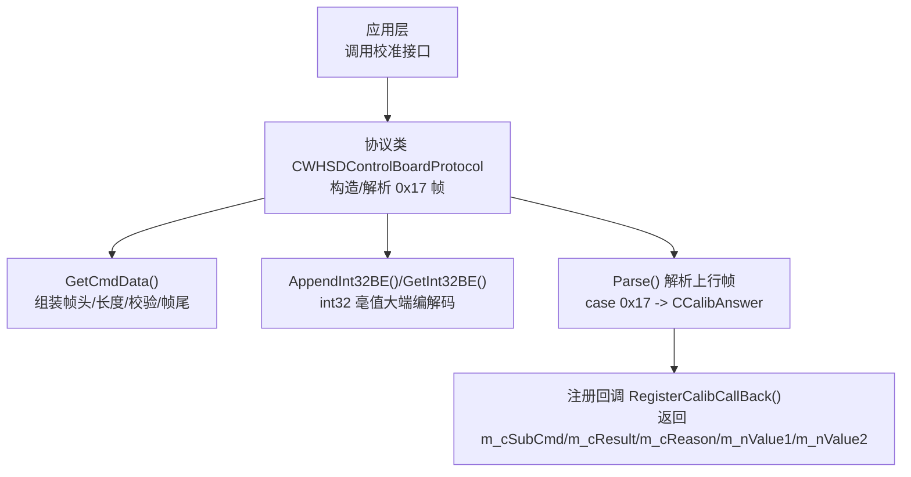
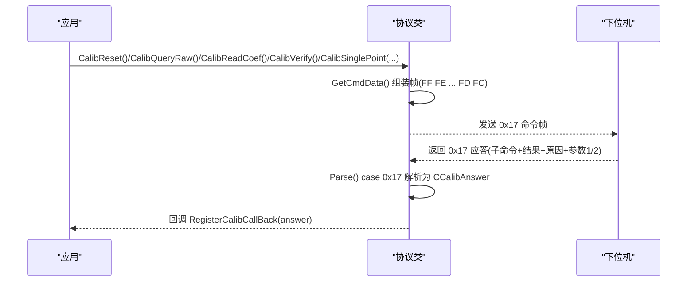
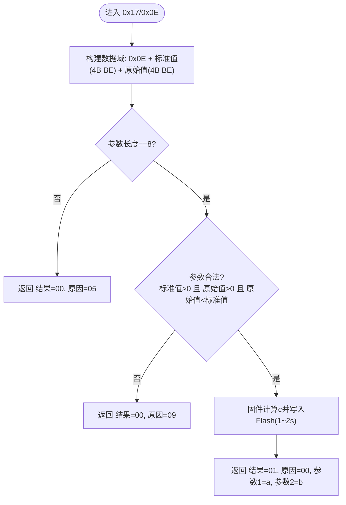
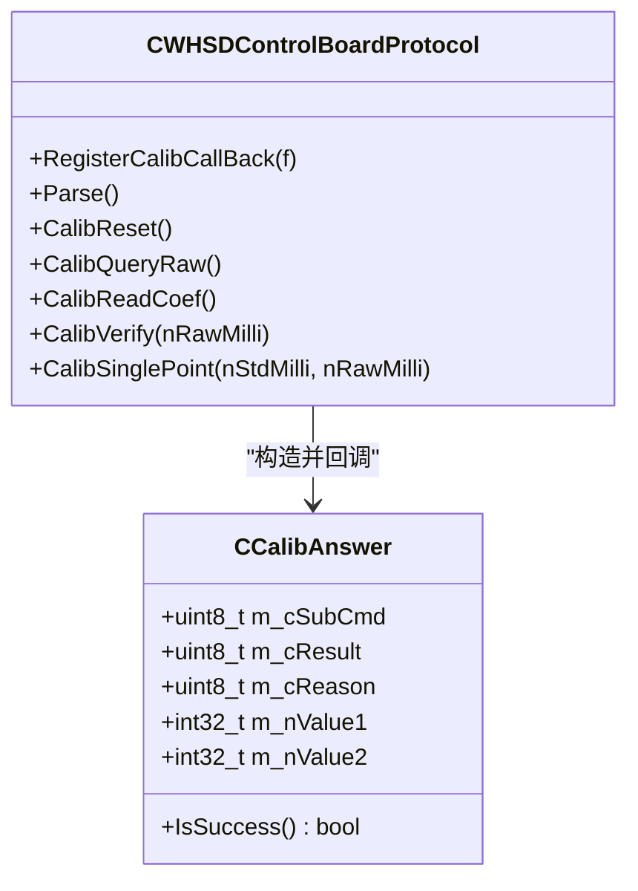
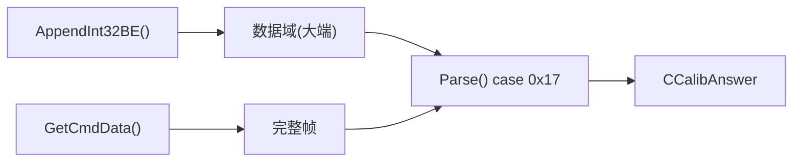

# 校准命令详解

<cite>
**本文引用的文件**
- [WHSDControlBoradProtocol.h](file://Insulator_Zero_Value_Detection_Robot/Protocol/WHSDControlBoradProtocol.h)
- [WHSDControlBoradProtocol.cpp](file://Insulator_Zero_Value_Detection_Robot/Protocol/WHSDControlBoradProtocol.cpp)
- [单点定标协议与流程_V1.0.html](file://Insulator_Zero_Value_Detection_Robot/单点定标协议与流程_V1.0.html)
</cite>

## 目录
1. [简介](#简介)
2. [项目结构](#项目结构)
3. [核心组件](#核心组件)
4. [架构总览](#架构总览)
5. [详细组件分析](#详细组件分析)
6. [依赖关系分析](#依赖关系分析)
7. [性能注意事项](#性能注意事项)
8. [故障排查指南](#故障排查指南)
9. [结论](#结论)
10. [附录：帧速查表与示例](#附录帧速查表与示例)

## 简介
本文件面向绝缘子零值检测机器人V2的“校准命令”使用与实现，聚焦于0x17主命令下的各子命令：恢复默认(0x05)、查询原始值(0x06)、读回系数(0x0C)、补偿验证(0x0A)、单点定标(0x0E)。文档给出每个命令的完整HEX帧、应答解析要点、参数编码规则（int32毫值大端）、以及关键限制与最佳实践。

## 项目结构
与校准相关的代码集中在协议层，负责构造/解析0x17系列命令帧，并回调上层应用处理结果；同时提供通用帧封装工具与数据编解码方法。

图表来源
- [WHSDControlBoradProtocol.cpp:654-677](file://Insulator_Zero_Value_Detection_Robot/Protocol/WHSDControlBoradProtocol.cpp#L654-L677)
- [WHSDControlBoradProtocol.cpp:562-580](file://Insulator_Zero_Value_Detection_Robot/Protocol/WHSDControlBoradProtocol.cpp#L562-L580)
- [WHSDControlBoradProtocol.cpp:392-418](file://Insulator_Zero_Value_Detection_Robot/Protocol/WHSDControlBoradProtocol.cpp#L392-L418)

章节来源
- [WHSDControlBoradProtocol.h:17-52](file://Insulator_Zero_Value_Detection_Robot/Protocol/WHSDControlBoradProtocol.h#L17-L52)
- [WHSDControlBoradProtocol.cpp:392-418](file://Insulator_Zero_Value_Detection_Robot/Protocol/WHSDControlBoradProtocol.cpp#L392-L418)

## 核心组件
- CCalibAnswer：统一承载0x17应答的子命令、结果、原因及两个参数（均为int32毫值大端）。
- CWHSDControlBoardProtocol：提供校准相关静态接口（CalibReset/CalibQueryRaw/CalibReadCoef/CalibVerify/CalibSinglePoint），内部通过GetCmdData封装帧，并通过AppendInt32BE/GetsInt32BE完成大端编码/解码。
- 协议解析：Parse()在收到0x17应答时，按“子命令+结果+原因+参数1(4B)+参数2(4B)”格式解析并触发回调。

章节来源
- [WHSDControlBoradProtocol.h:17-52](file://Insulator_Zero_Value_Detection_Robot/Protocol/WHSDControlBoradProtocol.h#L17-L52)
- [WHSDControlBoradProtocol.h:256-287](file://Insulator_Zero_Value_Detection_Robot/Protocol/WHSDControlBoradProtocol.h#L256-L287)
- [WHSDControlBoradProtocol.cpp:582-616](file://Insulator_Zero_Value_Detection_Robot/Protocol/WHSDControlBoradProtocol.cpp#L582-L616)
- [WHSDControlBoradProtocol.cpp:392-418](file://Insulator_Zero_Value_Detection_Robot/Protocol/WHSDControlBoradProtocol.cpp#L392-L418)

## 架构总览
下图展示从应用调用到设备应答的端到端流程，覆盖所有校准子命令。

图表来源
- [WHSDControlBoradProtocol.cpp:654-677](file://Insulator_Zero_Value_Detection_Robot/Protocol/WHSDControlBoradProtocol.cpp#L654-L677)
- [WHSDControlBoradProtocol.cpp:392-418](file://Insulator_Zero_Value_Detection_Robot/Protocol/WHSDControlBoradProtocol.cpp#L392-L418)

## 详细组件分析

### 通用帧格式与编码规则
- 帧结构：帧头(FF FE) + 长度 + 地址(01) + 命令字(CMD) + 数据域(N) + 校验和(CHK) + 帧尾(FD FC)。
- 校验：从帧头到数据域末尾的所有字节累加和的低8位。
- 多字节整数一律大端；X值与定标参数均为int32毫值（物理值×1000）。

章节来源
- [单点定标协议与流程_V1.0.html:45-55](file://Insulator_Zero_Value_Detection_Robot/单点定标协议与流程_V1.0.html#L45-L55)
- [WHSDControlBoradProtocol.cpp:654-677](file://Insulator_Zero_Value_Detection_Robot/Protocol/WHSDControlBoradProtocol.cpp#L654-L677)
- [WHSDControlBoradProtocol.cpp:562-580](file://Insulator_Zero_Value_Detection_Robot/Protocol/WHSDControlBoradProtocol.cpp#L562-L580)

### 恢复默认命令 0x17/0x05
- 作用：清空全部校准（两点系数、折点表、公式系数），测量通道直通（0x0F直接回报原始值）。单点定标前必发。
- 下行帧：0x17 + 0x05，无参数。
- 应答：子命令=0x05，结果=0x01成功，原因=0x00；参数1=k（固定1），参数2=b（固定0）。
- 典型帧（HEX）：FF FE 09 01 17 05 23 FD FC
- 典型应答（HEX片段）：17 05 01 00 + k/b 回显（k=1, b=0）

章节来源
- [WHSDControlBoradProtocol.h:256-260](file://Insulator_Zero_Value_Detection_Robot/Protocol/WHSDControlBoradProtocol.h#L256-L260)
- [WHSDControlBoradProtocol.cpp:582-586](file://Insulator_Zero_Value_Detection_Robot/Protocol/WHSDControlBoradProtocol.cpp#L582-L586)
- [单点定标协议与流程_V1.0.html:71-74](file://Insulator_Zero_Value_Detection_Robot/单点定标协议与流程_V1.0.html#L71-L74)

### 查询原始值命令 0x17/0x06
- 作用：回传最近一次原始X（int32毫值）。
- 限制：只认最近一次0x0F回报后5秒内刷新的值；超时返回结果=0x00，原因=0x01。
- 下行帧：0x17 + 0x06，无参数。
- 应答：子命令=0x06，结果=0x01成功，原因=0x00；参数1=原始X（int32毫值大端）；参数2=0。
- 典型帧（HEX）：FF FE 09 01 17 06 24 FD FC
- 典型应答（HEX片段）：17 06 01 00 + 原始X(4B int32 毫值大端)

章节来源
- [WHSDControlBoradProtocol.h:262-266](file://Insulator_Zero_Value_Detection_Robot/Protocol/WHSDControlBoradProtocol.h#L262-L266)
- [WHSDControlBoradProtocol.cpp:588-592](file://Insulator_Zero_Value_Detection_Robot/Protocol/WHSDControlBoradProtocol.cpp#L588-L592)
- [单点定标协议与流程_V1.0.html:75-78](file://Insulator_Zero_Value_Detection_Robot/单点定标协议与流程_V1.0.html#L75-L78)

### 单点定标核心命令 0x17/0x0E
- 作用：下发“标准值 + 实测原始值”，固件自动计算补偿系数c并立即写入Flash（擦写需1~2秒，应答超时建议≥3秒）。
- 参数格式：数据域为“0x0E + 标准值(4B int32 毫值大端) + 实测原始值(4B int32 毫值大端)”，共8字节参数。
- 约束：
  - 参数必须正好8字节，否则返回结果=0x00，原因=0x05。
  - 参数非法（标准值或原始值≤0，或原始值≥标准值）返回结果=0x00，原因=0x09。
  - Flash写失败返回结果=0x00，原因=0x04。
- 应答：子命令=0x0E，结果=0x01成功，原因=0x00；参数1=a（毫值，c=a/1000），参数2=b（毫值，固定0）。
- 典型帧（HEX，示例：标准值500 MΩ / 实测419.333 MΩ）：FF FE 11 01 17 0E 00 07 A1 20 00 06 66 05 6D FD FC
- 典型应答（HEX片段）：17 0E 01 00 + a(4B) + b(4B)，例如a=0x00000314=788 → c=0.788，b=0

图表来源
- [WHSDControlBoradProtocol.cpp:608-616](file://Insulator_Zero_Value_Detection_Robot/Protocol/WHSDControlBoradProtocol.cpp#L608-L616)
- [单点定标协议与流程_V1.0.html:79-99](file://Insulator_Zero_Value_Detection_Robot/单点定标协议与流程_V1.0.html#L79-L99)

章节来源
- [WHSDControlBoradProtocol.h:280-287](file://Insulator_Zero_Value_Detection_Robot/Protocol/WHSDControlBoradProtocol.h#L280-L287)
- [WHSDControlBoradProtocol.cpp:608-616](file://Insulator_Zero_Value_Detection_Robot/Protocol/WHSDControlBoradProtocol.cpp#L608-L616)
- [单点定标协议与流程_V1.0.html:79-99](file://Insulator_Zero_Value_Detection_Robot/单点定标协议与流程_V1.0.html#L79-L99)

### 读回系数命令 0x17/0x0C
- 作用：核对Flash中已存的a/b毫值，用于验证当前生效系数。
- 下行帧：0x17 + 0x0C，无参数。
- 应答：子命令=0x0C，结果=0x01成功，原因=0x00；参数1=a（毫值），参数2=b（毫值）。
- 典型帧（HEX）：FF FE 09 01 17 0C 2A FD FC

章节来源
- [WHSDControlBoradProtocol.h:268-271](file://Insulator_Zero_Value_Detection_Robot/Protocol/WHSDControlBoradProtocol.h#L268-L271)
- [WHSDControlBoradProtocol.cpp:594-598](file://Insulator_Zero_Value_Detection_Robot/Protocol/WHSDControlBoradProtocol.cpp#L594-L598)
- [单点定标协议与流程_V1.0.html:100-101](file://Insulator_Zero_Value_Detection_Robot/单点定标协议与流程_V1.0.html#L100-L101)

### 补偿验证命令 0x17/0x0A
- 作用：不挂电阻，直接下发任意原始值，回显“原始值 + 校准后值”，用于离线抽查系数是否生效。
- 下行帧：0x17 + 0x0A + 原始值(4B int32 毫值大端)。
- 应答：子命令=0x0A，结果=0x01成功，原因=0x00；参数1=原始值，参数2=校准后值。
- 典型帧（HEX，示例：原始值788 MΩ = 788000 毫 = 00 0C 06 20）：FF FE 0D 01 17 0A 00 0C 06 20 5E FD FC

章节来源
- [WHSDControlBoradProtocol.h:273-278](file://Insulator_Zero_Value_Detection_Robot/Protocol/WHSDControlBoradProtocol.h#L273-L278)
- [WHSDControlBoradProtocol.cpp:600-606](file://Insulator_Zero_Value_Detection_Robot/Protocol/WHSDControlBoradProtocol.cpp#L600-L606)
- [单点定标协议与流程_V1.0.html:102-105](file://Insulator_Zero_Value_Detection_Robot/单点定标协议与流程_V1.0.html#L102-L105)

### 响应解析与回调机制
- 解析位置：Parse()在case 0x17分支中，将应答按“子命令+结果+原因+参数1(4B)+参数2(4B)”解析为CCalibAnswer对象。
- 回调：通过RegisterCalibCallBack()将CCalibAnswer传递给上层，上层依据m_cSubCmd区分具体命令类型，再读取m_cResult/m_cReason及参数。

图表来源
- [WHSDControlBoradProtocol.h:17-52](file://Insulator_Zero_Value_Detection_Robot/Protocol/WHSDControlBoradProtocol.h#L17-L52)
- [WHSDControlBoradProtocol.cpp:392-418](file://Insulator_Zero_Value_Detection_Robot/Protocol/WHSDControlBoradProtocol.cpp#L392-L418)

章节来源
- [WHSDControlBoradProtocol.cpp:392-418](file://Insulator_Zero_Value_Detection_Robot/Protocol/WHSDControlBoradProtocol.cpp#L392-L418)

## 依赖关系分析
- 帧构造依赖：GetCmdData()负责帧头/长度/校验/帧尾的统一封装。
- 数据编码依赖：AppendInt32BE()/GetInt32BE()确保多字节整数为大端，且X值与定标参数按int32毫值处理。
- 解析依赖：Parse()对0x17应答进行统一解析，并分发至回调。

图表来源
- [WHSDControlBoradProtocol.cpp:654-677](file://Insulator_Zero_Value_Detection_Robot/Protocol/WHSDControlBoradProtocol.cpp#L654-L677)
- [WHSDControlBoradProtocol.cpp:562-580](file://Insulator_Zero_Value_Detection_Robot/Protocol/WHSDControlBoradProtocol.cpp#L562-L580)
- [WHSDControlBoradProtocol.cpp:392-418](file://Insulator_Zero_Value_Detection_Robot/Protocol/WHSDControlBoradProtocol.cpp#L392-L418)

章节来源
- [WHSDControlBoradProtocol.cpp:562-580](file://Insulator_Zero_Value_Detection_Robot/Protocol/WHSDControlBoradProtocol.cpp#L562-L580)
- [WHSDControlBoradProtocol.cpp:654-677](file://Insulator_Zero_Value_Detection_Robot/Protocol/WHSDControlBoradProtocol.cpp#L654-L677)
- [WHSDControlBoradProtocol.cpp:392-418](file://Insulator_Zero_Value_Detection_Robot/Protocol/WHSDControlBoradProtocol.cpp#L392-L418)

## 性能注意事项
- 0x17/0x0E写Flash需1~2秒，上位机应答超时建议≥3秒。
- 0x17/0x06仅能读取最近一次0x0F回报后5秒内的原始值，超时返回原因=0x01。
- 保持心跳通信，避免断链触发其他保护动作。

章节来源
- [单点定标协议与流程_V1.0.html:125-125](file://Insulator_Zero_Value_Detection_Robot/单点定标协议与流程_V1.0.html#L125-L125)
- [单点定标协议与流程_V1.0.html:75-78](file://Insulator_Zero_Value_Detection_Robot/单点定标协议与流程_V1.0.html#L75-L78)

## 故障排查指南
- 0x17/0x06原因=0x01：距上次0x0F超5秒；重新触发检测后立即查询。
- 0x17/0x0E原因=0x05：参数不是8字节；检查组帧（标准值4B + 原始值4B，毫值大端）。
- 0x17/0x0E原因=0x09：参数非法（标准值/原始值≤0，或原始值≥标准值）；检查接线与模块读数，勿强行定标。
- 0x17/0x0E原因=0x04：Flash写失败；重发并检查Flash健康。
- 定标后各档整体偏移：模块日间漂移；同环境重测基准档，再发一次0x0E。

章节来源
- [单点定标协议与流程_V1.0.html:140-148](file://Insulator_Zero_Value_Detection_Robot/单点定标协议与流程_V1.0.html#L140-L148)

## 结论
0x17系列校准命令提供了完整的单点定标能力：先恢复默认，再获取原始值，最后下发标准值与原始值完成定标；配合读回系数与补偿验证可快速确认系数生效。严格遵循帧格式与大端编码、注意超时与Flash写入耗时，可保证校准稳定可靠。

## 附录：帧速查表与示例
以下帧来自协议文档与代码注释，可直接用于测试与联调。

- 触发检测 0x11：FF FE 0C 01 11 00 01 00 00 1C FD FC
- 恢复默认 0x05：FF FE 09 01 17 05 23 FD FC
- 查询原始值 0x06：FF FE 09 01 17 06 24 FD FC
- 单点定标 0x0E（500 / 419.333）：FF FE 11 01 17 0E 00 07 A1 20 00 06 66 05 6D FD FC
- 单点定标 0x0E（500 / 415）：FF FE 11 01 17 0E 00 07 A1 20 00 06 55 18 6F FD FC
- 单点定标 0x0E（1000 / 788）：FF FE 11 01 17 0E 00 0F 42 40 00 0C 06 20 F7 FD FC
- 读回系数 0x0C：FF FE 09 01 17 0C 2A FD FC
- 补偿验证 0x0A（原始值 788 MΩ）：FF FE 0D 01 17 0A 00 0C 06 20 5E FD FC

章节来源
- [单点定标协议与流程_V1.0.html:127-138](file://Insulator_Zero_Value_Detection_Robot/单点定标协议与流程_V1.0.html#L127-L138)
- [WHSDControlBoradProtocol.cpp:582-616](file://Insulator_Zero_Value_Detection_Robot/Protocol/WHSDControlBoradProtocol.cpp#L582-L616)