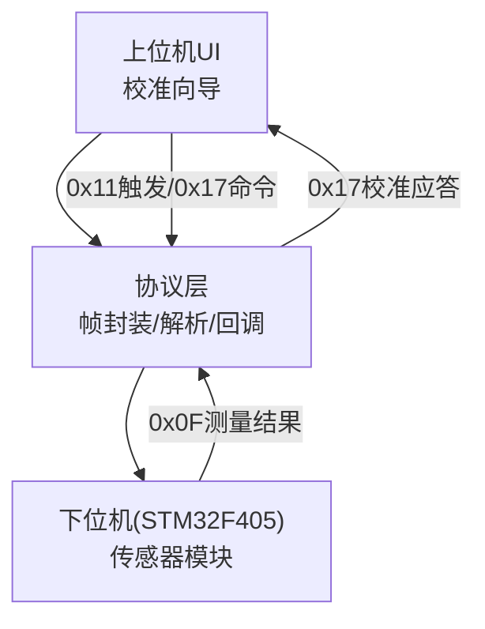
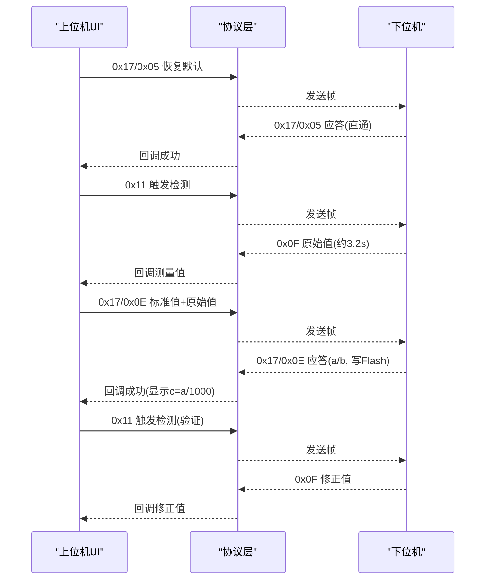
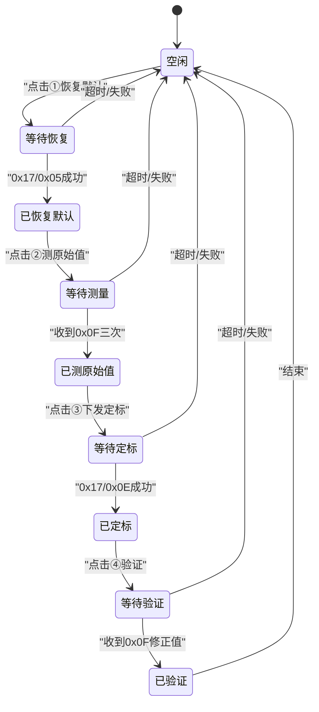

# 校准工作流程

<cite>
**本文引用的文件**
- [单点定标协议与流程_V1.0.html](file://Insulator_Zero_Value_Detection_Robot/单点定标协议与流程_V1.0.html)
- [WHSDControlBoradProtocol.cpp](file://Insulator_Zero_Value_Detection_Robot/Protocol/WHSDControlBoradProtocol.cpp)
- [Insulator_Zero_Value_Detection_Robot.cpp](file://Insulator_Zero_Value_Detection_Robot/UI/Insulator_Zero_Value_Detection_Robot.cpp)
- [操作说明书.md](file://操作说明书.md)
</cite>

## 目录
1. [简介](#简介)
2. [项目结构（与校准相关）](#项目结构与校准相关)
3. [核心组件](#核心组件)
4. [架构总览](#架构总览)
5. [详细组件分析](#详细组件分析)
6. [依赖关系分析](#依赖关系分析)
7. [性能与稳定性要点](#性能与稳定性要点)
8. [故障排查指南](#故障排查指南)
9. [结论](#结论)
10. [附录：时序图与状态图](#附录时序图与状态图)

## 简介
本文件面向“绝缘子零值检测机器人V2”的校准工作流，基于单点定标原理，给出从恢复默认到验证、再到再定标的完整步骤；解释固件内置补偿率公式模型与安全钳位机制；并提供时序流程图与状态转换图，以及实际操作中的关键注意事项（心跳保持、环境稳定性、Flash写入时间等）。

## 项目结构（与校准相关）
- 协议层：负责帧封装、校验、解析与回调分发，包含校准命令构造与应答解析。
- UI层：提供校准向导式界面，驱动测量、下发定标、验证与读回系数等操作，并管理超时与状态。
- 文档层：单点定标协议与流程说明，定义通信格式、命令语义与异常处理。

图表来源
- [WHSDControlBoradProtocol.cpp:228-444](file://Insulator_Zero_Value_Detection_Robot/Protocol/WHSDControlBoradProtocol.cpp#L228-L444)
- [Insulator_Zero_Value_Detection_Robot.cpp:894-910](file://Insulator_Zero_Value_Detection_Robot/UI/Insulator_Zero_Value_Detection_Robot.cpp#L894-L910)

章节来源
- [单点定标协议与流程_V1.0.html:45-55](file://Insulator_Zero_Value_Detection_Robot/单点定标协议与流程_V1.0.html#L45-L55)
- [WHSDControlBoradProtocol.cpp:582-616](file://Insulator_Zero_Value_Detection_Robot/Protocol/WHSDControlBoradProtocol.cpp#L582-L616)

## 核心组件
- 校准命令族（0x17系列）：恢复默认(0x05)、查询原始值(0x06)、读回系数(0x0C)、补偿验证(0x0A)、单点定标(0x0E)。
- 测量回报（0x0F）：约3.2秒上报一次X值（毫值），未校准时为原始值，定标生效后为修正值。
- 触发检测（0x11）：发起一次测量，返回“检测中”，真正数据由0x0F主动上报。
- 超时与等待：各步骤设置超时保护，避免阻塞或误判。

章节来源
- [单点定标协议与流程_V1.0.html:64-105](file://Insulator_Zero_Value_Detection_Robot/单点定标协议与流程_V1.0.html#L64-L105)
- [WHSDControlBoradProtocol.cpp:321-418](file://Insulator_Zero_Value_Detection_Robot/Protocol/WHSDControlBoradProtocol.cpp#L321-L418)
- [Insulator_Zero_Value_Detection_Robot.cpp:865-898](file://Insulator_Zero_Value_Detection_Robot/UI/Insulator_Zero_Value_Detection_Robot.cpp#L865-L898)

## 架构总览
校准流程由UI引导，通过协议层将命令帧发送至下位机；下位机执行测量或写Flash后，通过0x0F/0x17回传数据；UI根据应答更新状态与日志。

图表来源
- [Insulator_Zero_Value_Detection_Robot.cpp:947-1114](file://Insulator_Zero_Value_Detection_Robot/UI/Insulator_Zero_Value_Detection_Robot.cpp#L947-L1114)
- [Insulator_Zero_Value_Detection_Robot.cpp:1116-1257](file://Insulator_Zero_Value_Detection_Robot/UI/Insulator_Zero_Value_Detection_Robot.cpp#L1116-L1257)
- [单点定标协议与流程_V1.0.html:117-124](file://Insulator_Zero_Value_Detection_Robot/单点定标协议与流程_V1.0.html#L117-L124)

## 详细组件分析

### 校准步骤（恢复默认→挂标准电阻→测原始值→下发定标→验证→再定标）
- 恢复默认：清空两点系数、折点表、公式系数，通道直通，后续0x0F回报原始值。
- 挂标准电阻：建议500~1000 MΩ档，预热至读数稳定。
- 测原始值：触发检测，等待0x0F回报，建议连测2~3次取平均；可在5秒内用0x06复核最近一次原始值。
- 下发定标：将标准值与实测原始值（毫值大端）以0x0E下发；固件计算系数并写入Flash，立即生效。
- 验证：再次触发检测，0x0F回报修正值，对比标准值看误差；或使用0x0A离线抽查。
- 再定标：漂移后可重测同一电阻，直接再发0x0E覆盖旧系数，无需先清除。

章节来源
- [单点定标协议与流程_V1.0.html:107-125](file://Insulator_Zero_Value_Detection_Robot/单点定标协议与流程_V1.0.html#L107-L125)
- [操作说明书.md:376-392](file://操作说明书.md#L376-L392)
- [Insulator_Zero_Value_Detection_Robot.cpp:947-1114](file://Insulator_Zero_Value_Detection_Robot/UI/Insulator_Zero_Value_Detection_Robot.cpp#L947-L1114)

### 固件补偿率公式模型与安全钳位
- 需求补偿率 p% = (1 − 实测原始值 / 标准值) × 100
- 补偿系数 c = p ÷ √实测原始值（b固定为0）
- 安全钳位：p < 0 按0计；p > 95% 按95%计
- 定标后每次测量按 p = c × √x 计算补偿率，输出修正值 y = x / (1 − p/100)

章节来源
- [单点定标协议与流程_V1.0.html:57-62](file://Insulator_Zero_Value_Detection_Robot/单点定标协议与流程_V1.0.html#L57-L62)

### 通信命令与帧格式
- 通用帧：帧头FF FE，长度LEN，地址01，命令字CMD，数据域N，校验CHK，帧尾FD FC；多字节整数为大端。
- 0x11触发检测：数据域含传感器序号、命令、参数；应答“检测中”。
- 0x0F测量结果回报：X值位于数据域第7~10字节，int32有符号大端毫值；未校准回报原始值，定标生效后回报修正值。
- 0x17/0x05恢复默认：清空校准，直通。
- 0x17/0x06查询原始值：回传最近一次原始X（仅5秒内有效）。
- 0x17/0x0E单点定标：数据域为标准值(4B)+实测原始值(4B)，应答回显a/b（c=a/1000，b=0）。
- 辅助命令：0x17/0x0C读回系数；0x17/0x0A补偿验证（不挂电阻，输入任意原始值，回显原始值与校准后值）。

章节来源
- [单点定标协议与流程_V1.0.html:45-105](file://Insulator_Zero_Value_Detection_Robot/单点定标协议与流程_V1.0.html#L45-L105)
- [WHSDControlBoradProtocol.cpp:582-616](file://Insulator_Zero_Value_Detection_Robot/Protocol/WHSDControlBoradProtocol.cpp#L582-L616)

### 异常与原因码
- 0x06原因01：距上次0x0F超5秒；需重新触发检测后立即查询。
- 0x0E原因09：参数非法（标准值或原始值≤0，或原始值≥标准值）；检查接线与硬件，勿强行定标。
- 0x0E原因05：参数长度/格式错误（必须正好8字节）。
- 0x0E原因04：Flash写失败；重试并检查Flash。

章节来源
- [单点定标协议与流程_V1.0.html:93-99](file://Insulator_Zero_Value_Detection_Robot/单点定标协议与流程_V1.0.html#L93-L99)
- [单点定标协议与流程_V1.0.html:140-148](file://Insulator_Zero_Value_Detection_Robot/单点定标协议与流程_V1.0.html#L140-L148)

### UI侧实现要点
- 步骤顺序控制：上一步未完成时禁用下一步按钮，防止乱序。
- 超时保护：测量约6秒、写Flash约5秒、普通命令约3秒；超时在日志提示。
- 0x0F结果分流：校准期间0x0F结果改走校准信号槽，不与工单测量冲突。
- 日志记录：每步操作与结果实时记录，便于与协议逐条比对。

章节来源
- [操作说明书.md:376-392](file://操作说明书.md#L376-L392)
- [Insulator_Zero_Value_Detection_Robot.cpp:853-898](file://Insulator_Zero_Value_Detection_Robot/UI/Insulator_Zero_Value_Detection_Robot.cpp#L853-L898)
- [Insulator_Zero_Value_Detection_Robot.cpp:1116-1257](file://Insulator_Zero_Value_Detection_Robot/UI/Insulator_Zero_Value_Detection_Robot.cpp#L1116-L1257)

## 依赖关系分析
- UI依赖协议层提供的命令构造与回调接口，完成校准流程编排。
- 协议层依赖底层通信设备发送/接收帧，并解析0x0F/0x17等应答。
- 下位机固件负责Flash写入与补偿系数计算，保证掉电保存与即时生效。

图表来源
- [Insulator_Zero_Value_Detection_Robot.cpp:894-910](file://Insulator_Zero_Value_Detection_Robot/UI/Insulator_Zero_Value_Detection_Robot.cpp#L894-L910)
- [WHSDControlBoradProtocol.cpp:228-444](file://Insulator_Zero_Value_Detection_Robot/Protocol/WHSDControlBoradProtocol.cpp#L228-L444)

章节来源
- [Insulator_Zero_Value_Detection_Robot.cpp:894-910](file://Insulator_Zero_Value_Detection_Robot/UI/Insulator_Zero_Value_Detection_Robot.cpp#L894-L910)
- [WHSDControlBoradProtocol.cpp:228-444](file://Insulator_Zero_Value_Detection_Robot/Protocol/WHSDControlBoradProtocol.cpp#L228-L444)

## 性能与稳定性要点
- 心跳保持：全程保持心跳，断链会触发舵机归零；心跳周期由配置决定。
- 环境稳定性：测原始值与验证尽量同环境同批次完成，避免日间漂移污染系数。
- Flash写入时间：0x0E写Flash需1~2秒，上位机应答超时应设≥3秒。
- 帧尾规范：帧尾FD FC后勿多发字节，避免解析错乱。
- 超时保护：测量约6秒、写Flash约5秒、普通命令约3秒，超时会在日志提示。

章节来源
- [单点定标协议与流程_V1.0.html:125-125](file://Insulator_Zero_Value_Detection_Robot/单点定标协议与流程_V1.0.html#L125-L125)
- [操作说明书.md:376-392](file://操作说明书.md#L376-L392)
- [WHSDControlBoradProtocol.cpp:769-800](file://Insulator_Zero_Value_Detection_Robot/Protocol/WHSDControlBoradProtocol.cpp#L769-L800)

## 故障排查指南
- 0x06应答原因01：距上次0x0F超5秒；重新触发检测后立即查询。
- 0x0E应答原因09：标准值/原始值≤0或原始值≥标准值；检查接线与模块读数，勿强行定标。
- 0x0E应答原因05：参数不是8字节；检查组帧（标准值4B+原始值4B，毫值大端）。
- 定标后各档整体偏移：模块日间漂移；同环境重测基准档，再发一次0x0E。
- 0x0E应答慢（1~2秒）：正常现象（擦写Flash Sector4），超时设≥3秒。

章节来源
- [单点定标协议与流程_V1.0.html:140-148](file://Insulator_Zero_Value_Detection_Robot/单点定标协议与流程_V1.0.html#L140-L148)

## 结论
本校准流程以单点定标为核心，通过恢复默认、测量原始值、下发定标、验证与再定标形成闭环；固件内置补偿率公式与安全钳位确保稳定性与安全性；上位机提供完善的超时保护与日志记录，便于现场快速定位问题。遵循环境稳定性与心跳保持等关键要点，可显著提升校准成功率与测量精度。

## 附录：时序图与状态图

### 校准时序图（恢复默认→测原始值→下发定标→验证）

图表来源
- [Insulator_Zero_Value_Detection_Robot.cpp:947-1114](file://Insulator_Zero_Value_Detection_Robot/UI/Insulator_Zero_Value_Detection_Robot.cpp#L947-L1114)
- [Insulator_Zero_Value_Detection_Robot.cpp:1116-1257](file://Insulator_Zero_Value_Detection_Robot/UI/Insulator_Zero_Value_Detection_Robot.cpp#L1116-L1257)
- [单点定标协议与流程_V1.0.html:117-124](file://Insulator_Zero_Value_Detection_Robot/单点定标协议与流程_V1.0.html#L117-L124)

### 校准状态转换图

图表来源
- [Insulator_Zero_Value_Detection_Robot.cpp:853-898](file://Insulator_Zero_Value_Detection_Robot/UI/Insulator_Zero_Value_Detection_Robot.cpp#L853-L898)
- [Insulator_Zero_Value_Detection_Robot.cpp:1267-1292](file://Insulator_Zero_Value_Detection_Robot/UI/Insulator_Zero_Value_Detection_Robot.cpp#L1267-L1292)