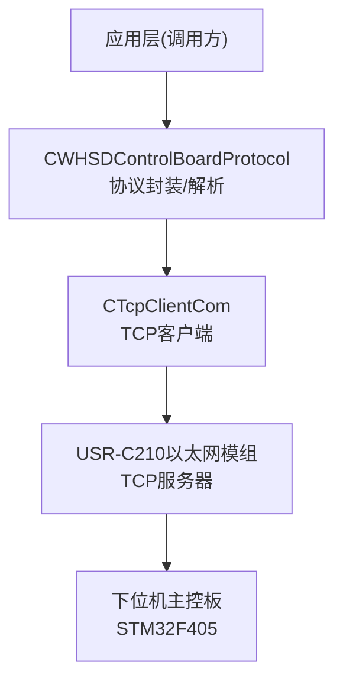
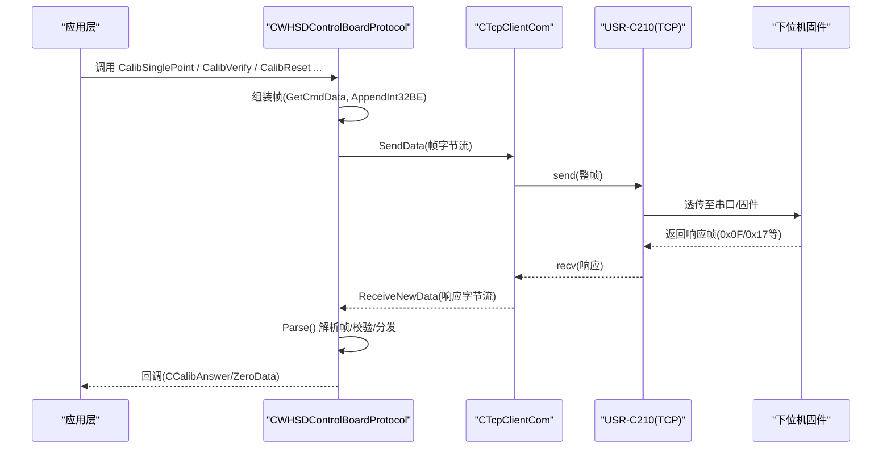
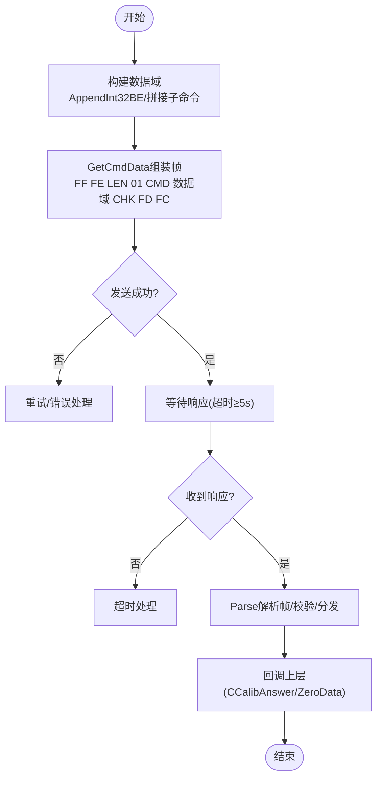
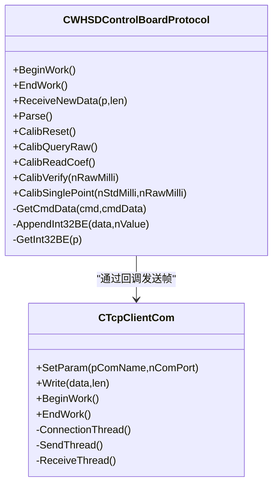

# 校准通信协议

<cite>
**本文引用的文件**
- [WHSDControlBoradProtocol.h](file://Insulator_Zero_Value_Detection_Robot/Protocol/WHSDControlBoradProtocol.h)
- [WHSDControlBoradProtocol.cpp](file://Insulator_Zero_Value_Detection_Robot/Protocol/WHSDControlBoradProtocol.cpp)
- [TcpClient.h](file://Insulator_Zero_Value_Detection_Robot/DeviceCom/TcpClient.h)
- [TcpClient.cpp](file://Insulator_Zero_Value_Detection_Robot/DeviceCom/TcpClient.cpp)
- [单点定标协议与流程_V1.0.html](file://Insulator_Zero_Value_Detection_Robot/单点定标协议与流程_V1.0.html)
</cite>

## 目录
1. [简介](#简介)
2. [项目结构](#项目结构)
3. [核心组件](#核心组件)
4. [架构总览](#架构总览)
5. [详细组件分析](#详细组件分析)
6. [依赖关系分析](#依赖关系分析)
7. [性能注意事项](#性能注意事项)
8. [故障排查指南](#故障排查指南)
9. [结论](#结论)
10. [附录：帧速查表与快速参考](#附录帧速查表与快速参考)

## 简介
本文件为绝缘子零值检测机器人V2的“校准通信协议”参考文档，聚焦于校准相关命令的完整帧格式、数据域结构与字节序，以及从上位机到设备的网络链路配置。内容基于代码实现与配套协议说明整理，便于现场工程师快速搭建、调试与验证校准流程。

## 项目结构
本项目中与校准通信直接相关的模块包括：
- 协议编解码与命令封装：位于 Protocol 目录
- TCP 客户端通信：位于 DeviceCom 目录
- 协议说明文档（HTML）：位于根目录下

图表来源
- [WHSDControlBoradProtocol.h:189-356](file://Insulator_Zero_Value_Detection_Robot/Protocol/WHSDControlBoradProtocol.h#L189-L356)
- [WHSDControlBoradProtocol.cpp:654-677](file://Insulator_Zero_Value_Detection_Robot/Protocol/WHSDControlBoradProtocol.cpp#L654-L677)
- [TcpClient.h:8-46](file://Insulator_Zero_Value_Detection_Robot/DeviceCom/TcpClient.h#L8-L46)
- [TcpClient.cpp:163-236](file://Insulator_Zero_Value_Detection_Robot/DeviceCom/TcpClient.cpp#L163-L236)

章节来源
- [WHSDControlBoradProtocol.h:189-356](file://Insulator_Zero_Value_Detection_Robot/Protocol/WHSDControlBoradProtocol.h#L189-L356)
- [WHSDControlBoradProtocol.cpp:213-444](file://Insulator_Zero_Value_Detection_Robot/Protocol/WHSDControlBoradProtocol.cpp#L213-L444)
- [TcpClient.cpp:163-236](file://Insulator_Zero_Value_Detection_Robot/DeviceCom/TcpClient.cpp#L163-L236)
- [单点定标协议与流程_V1.0.html:34-55](file://Insulator_Zero_Value_Detection_Robot/单点定标协议与流程_V1.0.html#L34-L55)

## 核心组件
- CWHSDControlBoardProtocol：负责构建和解析校准相关帧，提供校准命令封装接口（恢复默认、查询原始值、读回系数、补偿验证、单点定标），并处理测量结果回报与传感器指令应答。
- CTcpClientCom：提供TCP连接、发送与接收线程，将协议层生成的帧通过以太网发送到设备。
- 协议说明文档：定义了通用帧格式、命令字、数据域、校验和计算方式及典型HEX示例。

章节来源
- [WHSDControlBoradProtocol.h:21-52](file://Insulator_Zero_Value_Detection_Robot/Protocol/WHSDControlBoradProtocol.h#L21-L52)
- [WHSDControlBoradProtocol.cpp:582-616](file://Insulator_Zero_Value_Detection_Robot/Protocol/WHSDControlBoradProtocol.cpp#L582-L616)
- [TcpClient.cpp:238-382](file://Insulator_Zero_Value_Detection_Robot/DeviceCom/TcpClient.cpp#L238-L382)
- [单点定标协议与流程_V1.0.html:45-55](file://Insulator_Zero_Value_Detection_Robot/单点定标协议与流程_V1.0.html#L45-L55)

## 架构总览
校准通信的整体流程如下：
- 上位机通过 CWHSDControlBoardProtocol 构造校准命令帧（包含帧头、长度、地址、命令字、数据域、校验和、帧尾）。
- 帧经 CTcpClientCom 以 TCP 方式发送至 USR-C210 以太网模组的指定IP与端口。
- 设备侧固件解析帧后执行相应操作，并通过 0x0F 或 0x17 等命令上报结果。
- 上位机在协议层解析响应，回调上层业务逻辑。

图表来源
- [WHSDControlBoradProtocol.cpp:582-616](file://Insulator_Zero_Value_Detection_Robot/Protocol/WHSDControlBoradProtocol.cpp#L582-L616)
- [WHSDControlBoradProtocol.cpp:654-677](file://Insulator_Zero_Value_Detection_Robot/Protocol/WHSDControlBoradProtocol.cpp#L654-L677)
- [WHSDControlBoradProtocol.cpp:213-444](file://Insulator_Zero_Value_Detection_Robot/Protocol/WHSDControlBoradProtocol.cpp#L213-L444)
- [TcpClient.cpp:238-382](file://Insulator_Zero_Value_Detection_Robot/DeviceCom/TcpClient.cpp#L238-L382)

## 详细组件分析

### 通用帧格式规范
- 帧头：固定为 FF FE
- 长度：1字节，表示从帧头到帧尾的整帧总字节数（包含长度字段自身与校验字段）
- 地址：固定为 01
- 命令字：CMD，区分不同功能（如 0x11、0x0F、0x17 等）
- 数据域：N字节，承载具体参数或载荷
- 校验和：CHK，为从帧头到数据域末尾所有字节累加和的低8位
- 帧尾：固定为 FD FC

多字节整数一律采用大端（高位在前），X值与定标参数均为 int32 毫值（物理值×1000的整数）。

章节来源
- [单点定标协议与流程_V1.0.html:45-55](file://Insulator_Zero_Value_Detection_Robot/单点定标协议与流程_V1.0.html#L45-L55)
- [WHSDControlBoradProtocol.cpp:654-677](file://Insulator_Zero_Value_Detection_Robot/Protocol/WHSDControlBoradProtocol.cpp#L654-L677)

### 物理链路与网络参数
- 物理链路：主控板 UART5（115200 8N1）→ USR-C210 以太网模组 → TCP
- 网络参数：静态 IP 192.168.11.111，TCP 端口 8234

章节来源
- [单点定标协议与流程_V1.0.html:34-42](file://Insulator_Zero_Value_Detection_Robot/单点定标协议与流程_V1.0.html#L34-L42)
- [TcpClient.cpp:163-236](file://Insulator_Zero_Value_Detection_Robot/DeviceCom/TcpClient.cpp#L163-L236)

### 命令定义与数据域结构

#### 触发检测（0x11，下行）
- 数据域：11 + 传感器序号 + 命令 + 00 + 00；其中命令 0x01 表示触发一次测量
- 应答：约 30ms 内返回状态（例如 01=检测中）

章节来源
- [单点定标协议与流程_V1.0.html:64-67](file://Insulator_Zero_Value_Detection_Robot/单点定标协议与流程_V1.0.html#L64-L67)
- [WHSDControlBoradProtocol.cpp:557-560](file://Insulator_Zero_Value_Detection_Robot/Protocol/WHSDControlBoradProtocol.cpp#L557-L560)

#### 测量结果回报（0x0F，上行）
- 触发后约 3.2 秒下位机主动上报，建议等待超时 ≥ 5 秒
- X值位于数据域第 7~10 字节，int32 有符号大端毫值
- 未校准时回报原始值；定标生效后回报修正后的值

章节来源
- [单点定标协议与流程_V1.0.html:68-70](file://Insulator_Zero_Value_Detection_Robot/单点定标协议与流程_V1.0.html#L68-L70)
- [WHSDControlBoradProtocol.cpp:321-362](file://Insulator_Zero_Value_Detection_Robot/Protocol/WHSDControlBoradProtocol.cpp#L321-L362)

#### 恢复默认（0x17 / 0x05）
- 清空全部校准（两点系数、折点表、公式系数），恢复直通（0x0F 直接回报原始值）
- 定标前必发

章节来源
- [单点定标协议与流程_V1.0.html:71-74](file://Insulator_Zero_Value_Detection_Robot/单点定标协议与流程_V1.0.html#L71-L74)
- [WHSDControlBoradProtocol.cpp:582-586](file://Insulator_Zero_Value_Detection_Robot/Protocol/WHSDControlBoradProtocol.cpp#L582-L586)

#### 查询原始值（0x17 / 0x06）
- 回传最近一次原始 X（int32 毫值）
- 只认最近一次 0x0F 回报后 5 秒内刷新的值，超时返回结果=00，原因=01

章节来源
- [单点定标协议与流程_V1.0.html:75-78](file://Insulator_Zero_Value_Detection_Robot/单点定标协议与流程_V1.0.html#L75-L78)
- [WHSDControlBoradProtocol.cpp:588-592](file://Insulator_Zero_Value_Detection_Robot/Protocol/WHSDControlBoradProtocol.cpp#L588-L592)

#### 单点定标（0x17 / 0x0E，核心命令）
- 下行数据域：17 + 0E + 标准值(4B) + 实测原始值(4B)，均为 int32 毫值大端，共 8 字节参数
- 应答数据域：17 + 0E + 结果 + 原因 + a毫值(4B) + b毫值(4B)
- 成功时回显固件算出的系数（c = a ÷ 1000，b = 0），校准立即生效并写入 Flash

章节来源
- [单点定标协议与流程_V1.0.html:79-99](file://Insulator_Zero_Value_Detection_Robot/单点定标协议与流程_V1.0.html#L79-L99)
- [WHSDControlBoradProtocol.cpp:608-616](file://Insulator_Zero_Value_Detection_Robot/Protocol/WHSDControlBoradProtocol.cpp#L608-L616)

#### 读回系数（0x17 / 0x0C）
- 核对 Flash 中已存系数，回显 a/b 毫值

章节来源
- [单点定标协议与流程_V1.0.html:101-102](file://Insulator_Zero_Value_Detection_Robot/单点定标协议与流程_V1.0.html#L101-L102)
- [WHSDControlBoradProtocol.cpp:594-598](file://Insulator_Zero_Value_Detection_Robot/Protocol/WHSDControlBoradProtocol.cpp#L594-L598)

#### 补偿验证（0x17 / 0x0A）
- 不挂电阻，直接下发任意原始值，回显“原始值 + 校准后值”，用于离线抽查系数是否生效

章节来源
- [单点定标协议与流程_V1.0.html:102-105](file://Insulator_Zero_Value_Detection_Robot/单点定标协议与流程_V1.0.html#L102-L105)
- [WHSDControlBoradProtocol.cpp:600-606](file://Insulator_Zero_Value_Detection_Robot/Protocol/WHSDControlBoradProtocol.cpp#L600-L606)

### 数据类型与字节序
- 多字节整数一律大端（高位在前）
- X值与定标参数均为 int32 毫值（物理值×1000的整数）
- 读取/写入使用统一的大端转换函数

章节来源
- [单点定标协议与流程_V1.0.html:51-55](file://Insulator_Zero_Value_Detection_Robot/单点定标协议与流程_V1.0.html#L51-L55)
- [WHSDControlBoradProtocol.cpp:562-580](file://Insulator_Zero_Value_Detection_Robot/Protocol/WHSDControlBoradProtocol.cpp#L562-L580)

### 帧构建与解析流程图

图表来源
- [WHSDControlBoradProtocol.cpp:562-616](file://Insulator_Zero_Value_Detection_Robot/Protocol/WHSDControlBoradProtocol.cpp#L562-L616)
- [WHSDControlBoradProtocol.cpp:213-444](file://Insulator_Zero_Value_Detection_Robot/Protocol/WHSDControlBoradProtocol.cpp#L213-L444)

## 依赖关系分析
- 协议层依赖 TCP 客户端进行数据传输
- TCP 客户端负责连接管理、发送队列与接收线程
- 协议层内部维护包号、缓冲区与解析状态，支持心跳、日志、OTA等扩展功能

图表来源
- [WHSDControlBoradProtocol.h:189-356](file://Insulator_Zero_Value_Detection_Robot/Protocol/WHSDControlBoradProtocol.h#L189-L356)
- [TcpClient.h:8-46](file://Insulator_Zero_Value_Detection_Robot/DeviceCom/TcpClient.h#L8-L46)

章节来源
- [WHSDControlBoradProtocol.h:189-356](file://Insulator_Zero_Value_Detection_Robot/Protocol/WHSDControlBoradProtocol.h#L189-L356)
- [TcpClient.cpp:238-382](file://Insulator_Zero_Value_Detection_Robot/DeviceCom/TcpClient.cpp#L238-L382)

## 性能注意事项
- 单点定标写 Flash 需 1~2 秒，应答超时建议 ≥ 3 秒
- 测量结果回报约 3.2 秒，等待超时建议 ≥ 5 秒
- 保持心跳，断链可能触发设备安全动作（如舵机归零）
- 帧尾 FD FC 后勿多发字节，避免解析错位

章节来源
- [单点定标协议与流程_V1.0.html:125-126](file://Insulator_Zero_Value_Detection_Robot/单点定标协议与流程_V1.0.html#L125-L126)
- [WHSDControlBoradProtocol.cpp:769-782](file://Insulator_Zero_Value_Detection_Robot/Protocol/WHSDControlBoradProtocol.cpp#L769-L782)

## 故障排查指南
- 0x06 应答原因 0x01：距上次 0x0F 超 5 秒；重新触发检测后立即查询
- 0x0E 应答原因 0x09：标准值/原始值 ≤ 0，或原始值 ≥ 标准值；检查接线与模块读数，勿强行定标
- 0x0E 应答原因 0x05：参数不是 8 字节；检查组帧（标准值 4B + 原始值 4B，毫值大端）
- 定标后各档整体偏移：模块日间漂移；同环境重测基准档，再发一次 0x0E
- 0x0E 应答慢（1~2 秒）：正常现象（需擦写 Flash Sector4），超时设 ≥ 3 秒

章节来源
- [单点定标协议与流程_V1.0.html:140-148](file://Insulator_Zero_Value_Detection_Robot/单点定标协议与流程_V1.0.html#L140-L148)

## 结论
本参考文档明确了校准通信协议的通用帧格式、命令字与数据域结构，提供了完整的 HEX 帧示例与 ASCII 解析方法，并给出了网络参数与性能注意事项。按照本文档进行组帧与解析，可确保校准流程稳定可靠。

## 附录：帧速查表与快速参考

### 常用命令速查
- 触发检测（0x11，下行）：数据域含传感器序号与命令，约 30ms 内返回状态
- 测量结果回报（0x0F，上行）：约 3.2 秒上报，X值为 int32 毫值大端
- 恢复默认（0x17 / 0x05）：清空校准，恢复直通
- 查询原始值（0x17 / 0x06）：回传最近一次原始 X（5秒有效）
- 单点定标（0x17 / 0x0E）：下发标准值+实测原始值（各4B大端），回显a/b
- 读回系数（0x17 / 0x0C）：核对Flash中a/b
- 补偿验证（0x17 / 0x0A）：下发原始值，回显原始值+校准后值

章节来源
- [单点定标协议与流程_V1.0.html:64-105](file://Insulator_Zero_Value_Detection_Robot/单点定标协议与流程_V1.0.html#L64-L105)

### HEX帧示例与ASCII解析
- 触发检测 0x11：FF FE 0C 01 11 00 01 00 00 1C FD FC
- 恢复默认 0x05：FF FE 09 01 17 05 23 FD FC
- 查询原始值 0x06：FF FE 09 01 17 06 24 FD FC
- 单点定标 0x0E（示例：500 / 419.333）：FF FE 11 01 17 0E 00 07 A1 20 00 06 66 05 6D FD FC
- 读回系数 0x0C：FF FE 09 01 17 0C 2A FD FC
- 补偿验证 0x0A（原始值 788 MΩ）：FF FE 0D 01 17 0A 00 0C 06 20 5E FD FC

解析要点：
- 帧头 FF FE，帧尾 FD FC
- 长度字段为整帧总字节数
- 校验和为帧头至数据域末尾累加和的低8位
- 多字节整数为大端，X值与定标参数为 int32 毫值

章节来源
- [单点定标协议与流程_V1.0.html:127-138](file://Insulator_Zero_Value_Detection_Robot/单点定标协议与流程_V1.0.html#L127-L138)
- [WHSDControlBoradProtocol.cpp:654-677](file://Insulator_Zero_Value_Detection_Robot/Protocol/WHSDControlBoradProtocol.cpp#L654-L677)