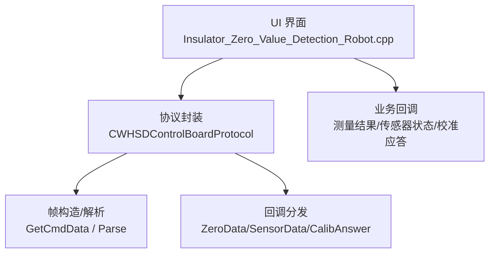
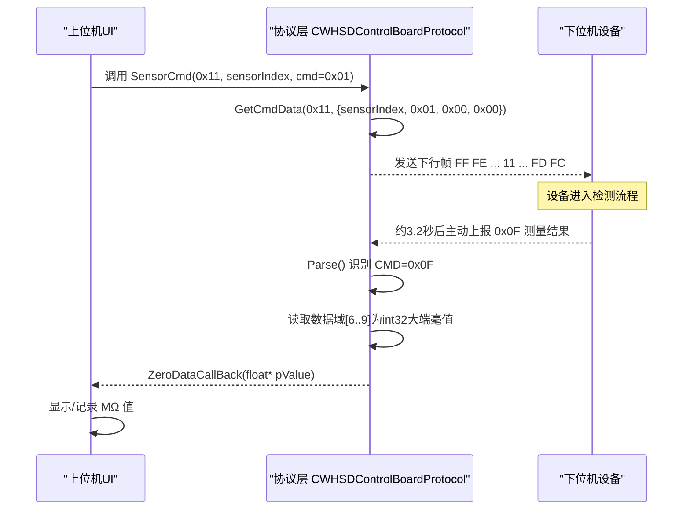
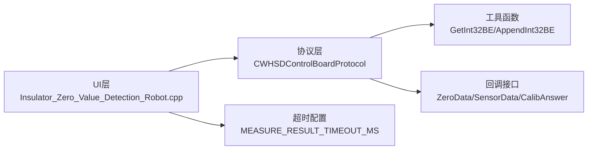

# 检测控制命令

<cite>
**本文引用的文件**
- [WHSDControlBoradProtocol.cpp](file://Insulator_Zero_Value_Detection_Robot/Protocol/WHSDControlBoradProtocol.cpp)
- [WHSDControlBoradProtocol.h](file://Insulator_Zero_Value_Detection_Robot/Protocol/WHSDControlBoradProtocol.h)
- [单点定标协议与流程_V1.0.html](file://Insulator_Zero_Value_Detection_Robot/单点定标协议与流程_V1.0.html)
- [Insulator_Zero_Value_Detection_Robot.cpp](file://Insulator_Zero_Value_Detection_Robot/UI/Insulator_Zero_Value_Detection_Robot.cpp)
</cite>

## 目录
1. [简介](#简介)
2. [项目结构](#项目结构)
3. [核心组件](#核心组件)
4. [架构总览](#架构总览)
5. [详细组件分析](#详细组件分析)
6. [依赖关系分析](#依赖关系分析)
7. [性能与时序考虑](#性能与时序考虑)
8. [故障排查指南](#故障排查指南)
9. [结论](#结论)
10. [附录：帧格式与解析示例](#附录帧格式与解析示例)

## 简介
本文件面向绝缘子零值检测机器人V2的“检测控制命令”，聚焦以下目标：
- 触发检测命令（0x11）的完整帧格式与数据域结构（传感器序号+命令+保留字节）。
- 测量结果回报命令（0x0F）的上行响应格式，重点说明X值位于数据域第7~10字节、int32有符号大端毫值的解析方法。
- 提供完整的HEX帧示例及对应的ASCII码解析过程。
- 明确时序要求：触发后约3.2秒返回结果，上位机等待超时建议≥5秒。
- 给出错误处理与异常情况说明。

## 项目结构
与检测控制命令相关的代码主要位于协议层与UI层：
- 协议层负责帧组装、校验、解析与回调分发。
- UI层定义测量与定标的超时参数，并消费协议回调。

图表来源
- [WHSDControlBoradProtocol.cpp:654-677](file://Insulator_Zero_Value_Detection_Robot/Protocol/WHSDControlBoradProtocol.cpp#L654-L677)
- [WHSDControlBoradProtocol.cpp:213-444](file://Insulator_Zero_Value_Detection_Robot/Protocol/WHSDControlBoradProtocol.cpp#L213-L444)
- [Insulator_Zero_Value_Detection_Robot.cpp:56-73](file://Insulator_Zero_Value_Detection_Robot/UI/Insulator_Zero_Value_Detection_Robot.cpp#L56-L73)

章节来源
- [WHSDControlBoradProtocol.cpp:1-802](file://Insulator_Zero_Value_Detection_Robot/Protocol/WHSDControlBoradProtocol.cpp#L1-L802)
- [Insulator_Zero_Value_Detection_Robot.cpp:56-73](file://Insulator_Zero_Value_Detection_Robot/UI/Insulator_Zero_Value_Detection_Robot.cpp#L56-L73)

## 核心组件
- 帧构造器：统一生成FF FE开头、FD FC结尾、含长度与累加和校验的帧。
- 解析器：按帧头/尾定位、校验CHK、提取命令字与数据域，分派到对应case处理。
- 回调机制：将解析后的数据通过函数指针回调给上层（测量结果、传感器状态、校准应答等）。
- 数据类型转换：提供大端int32读写工具，确保X值与校准参数正确解析。

章节来源
- [WHSDControlBoradProtocol.cpp:654-677](file://Insulator_Zero_Value_Detection_Robot/Protocol/WHSDControlBoradProtocol.cpp#L654-L677)
- [WHSDControlBoradProtocol.cpp:213-444](file://Insulator_Zero_Value_Detection_Robot/Protocol/WHSDControlBoradProtocol.cpp#L213-L444)
- [WHSDControlBoradProtocol.cpp:562-580](file://Insulator_Zero_Value_Detection_Robot/Protocol/WHSDControlBoradProtocol.cpp#L562-L580)

## 架构总览
下图展示从“触发检测”到“收到测量结果”的端到端调用链。

图表来源
- [WHSDControlBoradProtocol.cpp:557-560](file://Insulator_Zero_Value_Detection_Robot/Protocol/WHSDControlBoradProtocol.cpp#L557-L560)
- [WHSDControlBoradProtocol.cpp:654-677](file://Insulator_Zero_Value_Detection_Robot/Protocol/WHSDControlBoradProtocol.cpp#L654-L677)
- [WHSDControlBoradProtocol.cpp:321-362](file://Insulator_Zero_Value_Detection_Robot/Protocol/WHSDControlBoradProtocol.cpp#L321-L362)
- [Insulator_Zero_Value_Detection_Robot.cpp:675-703](file://Insulator_Zero_Value_Detection_Robot/UI/Insulator_Zero_Value_Detection_Robot.cpp#L675-L703)

## 详细组件分析

### 触发检测命令（0x11）
- 用途：触发一次测量。
- 数据域结构：传感器序号 + 命令 + 保留字节（2字节）。
- 命令值：0x01 表示触发一次测量。
- 帧格式要点：
  - 帧头：FF FE
  - 长度：整帧字节数
  - 地址：01
  - 命令字：11
  - 数据域：sensorIndex, 0x01, 0x00, 0x00
  - 校验：CHK = 从帧头到数据域末尾所有字节累加和的低8位
  - 帧尾：FD FC
- 实现位置：
  - 构造数据域：SensorCmd 函数将 sensorIndex、cmd、value拆成两字节追加。
  - 帧组装：GetCmdData 统一填充帧头、长度、命令字、数据域、校验、帧尾。

章节来源
- [WHSDControlBoradProtocol.cpp:557-560](file://Insulator_Zero_Value_Detection_Robot/Protocol/WHSDControlBoradProtocol.cpp#L557-L560)
- [WHSDControlBoradProtocol.cpp:654-677](file://Insulator_Zero_Value_Detection_Robot/Protocol/WHSDControlBoradProtocol.cpp#L654-L677)
- [单点定标协议与流程_V1.0.html:63-67](file://Insulator_Zero_Value_Detection_Robot/单点定标协议与流程_V1.0.html#L63-L67)

### 测量结果回报命令（0x0F）
- 方向：上行（设备→上位机）。
- 数据域结构（关键）：
  - 第1字节：数据类型标识（0=int32，1=float32，2=double64）。
  - 第2字节：保留或扩展字段。
  - 第3~6字节：序列号或其他标识（由设备侧维护）。
  - 第7~10字节：X值，int32有符号大端，单位为毫值（mΩ）。
- 解析方法：
  - 使用大端读取工具将数据域偏移6开始的4字节解析为int32。
  - 将毫值除以1000得到MΩ浮点数。
  - 未校准时回报原始值；定标生效后回报修正值。
- 实现位置：
  - 解析分支：CMD=0x0F时，判断数据类型并读取X值。
  - 回调：ZeroDataCallBack 将float*指向的值交给上层。

章节来源
- [WHSDControlBoradProtocol.cpp:321-362](file://Insulator_Zero_Value_Detection_Robot/Protocol/WHSDControlBoradProtocol.cpp#L321-L362)
- [WHSDControlBoradProtocol.cpp:562-580](file://Insulator_Zero_Value_Detection_Robot/Protocol/WHSDControlBoradProtocol.cpp#L562-L580)
- [单点定标协议与流程_V1.0.html:68-70](file://Insulator_Zero_Value_Detection_Robot/单点定标协议与流程_V1.0.html#L68-L70)

### 帧构造与校验
- 帧头/帧尾：固定为 FF FE 与 FD FC。
- 长度：包含自身在内的整帧字节数。
- 校验：CHK = 从帧头到数据域末尾所有字节累加和的低8位。
- 多字节整数：一律大端（高位在前），X值与校准参数均为int32毫值。

章节来源
- [WHSDControlBoradProtocol.cpp:654-677](file://Insulator_Zero_Value_Detection_Robot/Protocol/WHSDControlBoradProtocol.cpp#L654-L677)
- [单点定标协议与流程_V1.0.html:45-55](file://Insulator_Zero_Value_Detection_Robot/单点定标协议与流程_V1.0.html#L45-L55)

### 回调与上层处理
- 协议层在解析到0x0F后，将float*类型的测量值通过回调传递给UI层。
- UI层根据是否处于定标流程分流处理：定标期间不写入工单测量数据，仅走定标信号槽；非定标时更新UI并推进后续流程。

章节来源
- [WHSDControlBoradProtocol.cpp:451-454](file://Insulator_Zero_Value_Detection_Robot/Protocol/WHSDControlBoradProtocol.cpp#L451-L454)
- [Insulator_Zero_Value_Detection_Robot.cpp:675-703](file://Insulator_Zero_Value_Detection_Robot/UI/Insulator_Zero_Value_Detection_Robot.cpp#L675-L703)

## 依赖关系分析
- 协议层依赖：
  - 工具函数：大端int32读写、Base64等（用于其他功能）。
  - 回调接口：注册测量结果、传感器状态、校准应答等回调。
- UI层依赖：
  - 超时参数：测量结果超时≥5秒（实际实现中采用更保守的8秒）。
  - 日志与UI更新：记录并显示测量结果。

图表来源
- [WHSDControlBoradProtocol.cpp:562-580](file://Insulator_Zero_Value_Detection_Robot/Protocol/WHSDControlBoradProtocol.cpp#L562-L580)
- [Insulator_Zero_Value_Detection_Robot.cpp:56-73](file://Insulator_Zero_Value_Detection_Robot/UI/Insulator_Zero_Value_Detection_Robot.cpp#L56-L73)

章节来源
- [WHSDControlBoradProtocol.cpp:562-580](file://Insulator_Zero_Value_Detection_Robot/Protocol/WHSDControlBoradProtocol.cpp#L562-L580)
- [Insulator_Zero_Value_Detection_Robot.cpp:56-73](file://Insulator_Zero_Value_Detection_Robot/UI/Insulator_Zero_Value_Detection_Robot.cpp#L56-L73)

## 性能与时序考虑
- 触发检测后，设备约3.2秒主动上报0x0F测量结果。
- 上位机等待超时建议≥5秒；当前UI层实现采用8秒作为兜底超时，避免误判失败。
- 若超过5秒未收到最近一次0x0F回报，查询原始值（0x06）会失效（原因=01），需重新触发检测。

章节来源
- [单点定标协议与流程_V1.0.html:68-70](file://Insulator_Zero_Value_Detection_Robot/单点定标协议与流程_V1.0.html#L68-L70)
- [Insulator_Zero_Value_Detection_Robot.cpp:56-73](file://Insulator_Zero_Value_Detection_Robot/UI/Insulator_Zero_Value_Detection_Robot.cpp#L56-L73)
- [Insulator_Zero_Value_Detection_Robot.cpp:896-929](file://Insulator_Zero_Value_Detection_Robot/UI/Insulator_Zero_Value_Detection_Robot.cpp#L896-L929)

## 故障排查指南
- 校验失败：检查CHK计算是否正确（从帧头到数据域末尾累加和的低8位）。
- 帧长错误：确认长度字段为整帧字节数，且包含长度与校验字节本身。
- 数据域长度不足：0x0F解析前需确保数据域至少10字节，否则丢弃本帧。
- 数据类型未知：遇到非0/1/2类型时，仅丢弃本帧，不影响后续帧解析。
- 超时未收到结果：检查通信链路、设备状态与超时设置；必要时重新触发检测。
- 原始值失效：超过5秒未刷新则0x06查询无效，需重新触发0x11。

章节来源
- [WHSDControlBoradProtocol.cpp:228-444](file://Insulator_Zero_Value_Detection_Robot/Protocol/WHSDControlBoradProtocol.cpp#L228-L444)
- [Insulator_Zero_Value_Detection_Robot.cpp:896-929](file://Insulator_Zero_Value_Detection_Robot/UI/Insulator_Zero_Value_Detection_Robot.cpp#L896-L929)

## 结论
- 触发检测命令（0x11）数据域为“传感器序号+命令+保留字节”，帧格式遵循通用协议（FF FE/FD FC、长度、CHK）。
- 测量结果回报（0x0F）中X值位于数据域第7~10字节，int32有符号大端毫值，需转换为MΩ浮点数。
- 时序上，触发后约3.2秒返回结果，上位机超时建议≥5秒；当前实现采用8秒以增强鲁棒性。
- 错误处理涵盖校验失败、长度不足、未知数据类型与超时等情况，确保系统稳定运行。

## 附录：帧格式与解析示例

### 触发检测（0x11）下行帧示例
- 数据域：sensorIndex=0x00，cmd=0x01，保留=0x00 0x00。
- 示例帧（来自文档实测）：FF FE 0C 01 11 00 01 00 00 1C FD FC
- 解析步骤：
  - 帧头：FF FE
  - 长度：0C（12字节）
  - 地址：01
  - 命令字：11
  - 数据域：00 01 00 00
  - 校验：1C（对前面所有字节累加和的低8位）
  - 帧尾：FD FC

章节来源
- [单点定标协议与流程_V1.0.html:63-67](file://Insulator_Zero_Value_Detection_Robot/单点定标协议与流程_V1.0.html#L63-L67)
- [WHSDControlBoradProtocol.cpp:654-677](file://Insulator_Zero_Value_Detection_Robot/Protocol/WHSDControlBoradProtocol.cpp#L654-L677)

### 测量结果回报（0x0F）上行帧示例
- 示例帧（来自文档实测）：FF FE 12 01 0F 01 00 00 00 00 00 00 08 24 CF 1B FD FC
- 解析步骤：
  - 帧头：FF FE
  - 长度：12（18字节）
  - 地址：01
  - 命令字：0F
  - 数据域：01 00 00 00 00 00 00 08 24 CF 1B
    - 数据类型：01（此处为示例，实际解析按类型分支）
    - X值位置：数据域第7~10字节（1-based），即偏移6开始的4字节：08 24 CF 1B
    - 解析为int32大端：0x0824CF1B = 135,769,579（毫值）
    - 转换为MΩ：135.769579 MΩ
  - 校验：对前面所有字节累加和的低8位
  - 帧尾：FD FC

注意：
- 若数据类型为0（int32），直接按上述方式解析X值。
- 若数据类型为1或2，按对应浮点格式解析（当前实现中未展开）。

章节来源
- [单点定标协议与流程_V1.0.html:68-70](file://Insulator_Zero_Value_Detection_Robot/单点定标协议与流程_V1.0.html#L68-L70)
- [WHSDControlBoradProtocol.cpp:321-362](file://Insulator_Zero_Value_Detection_Robot/Protocol/WHSDControlBoradProtocol.cpp#L321-L362)
- [WHSDControlBoradProtocol.cpp:562-580](file://Insulator_Zero_Value_Detection_Robot/Protocol/WHSDControlBoradProtocol.cpp#L562-L580)

### ASCII码解析过程（文本化描述）
- 接收到的HEX字符串逐字节解析：
  - 匹配帧头FF FE，读取长度字段确定整帧大小。
  - 验证帧尾FD FC与校验字节CHK。
  - 提取命令字，进入对应处理分支。
  - 对于0x0F，定位数据域第7~10字节，按大端int32解析为毫值，再除以1000得到MΩ。
  - 通过回调将结果传递给UI层进行显示与记录。

章节来源
- [WHSDControlBoradProtocol.cpp:213-444](file://Insulator_Zero_Value_Detection_Robot/Protocol/WHSDControlBoradProtocol.cpp#L213-L444)
- [Insulator_Zero_Value_Detection_Robot.cpp:675-703](file://Insulator_Zero_Value_Detection_Robot/UI/Insulator_Zero_Value_Detection_Robot.cpp#L675-L703)