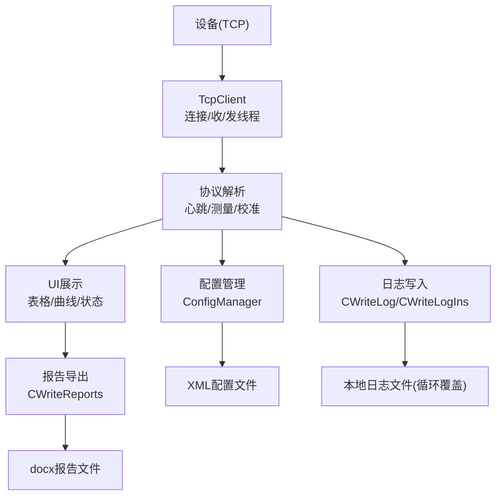
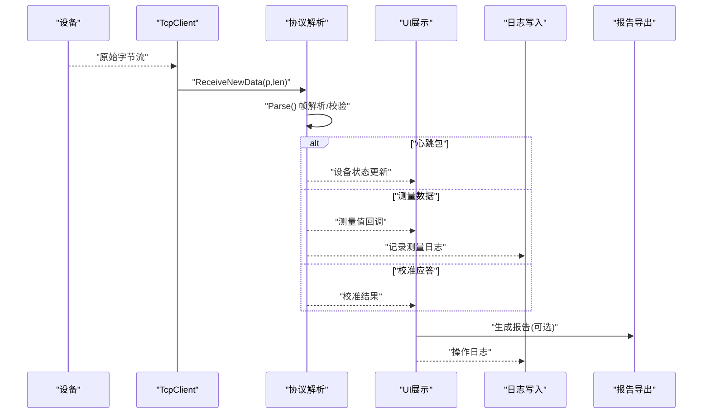
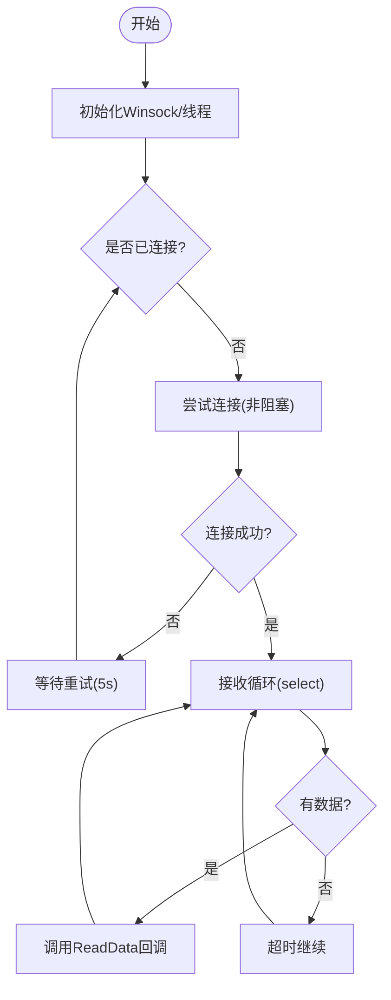
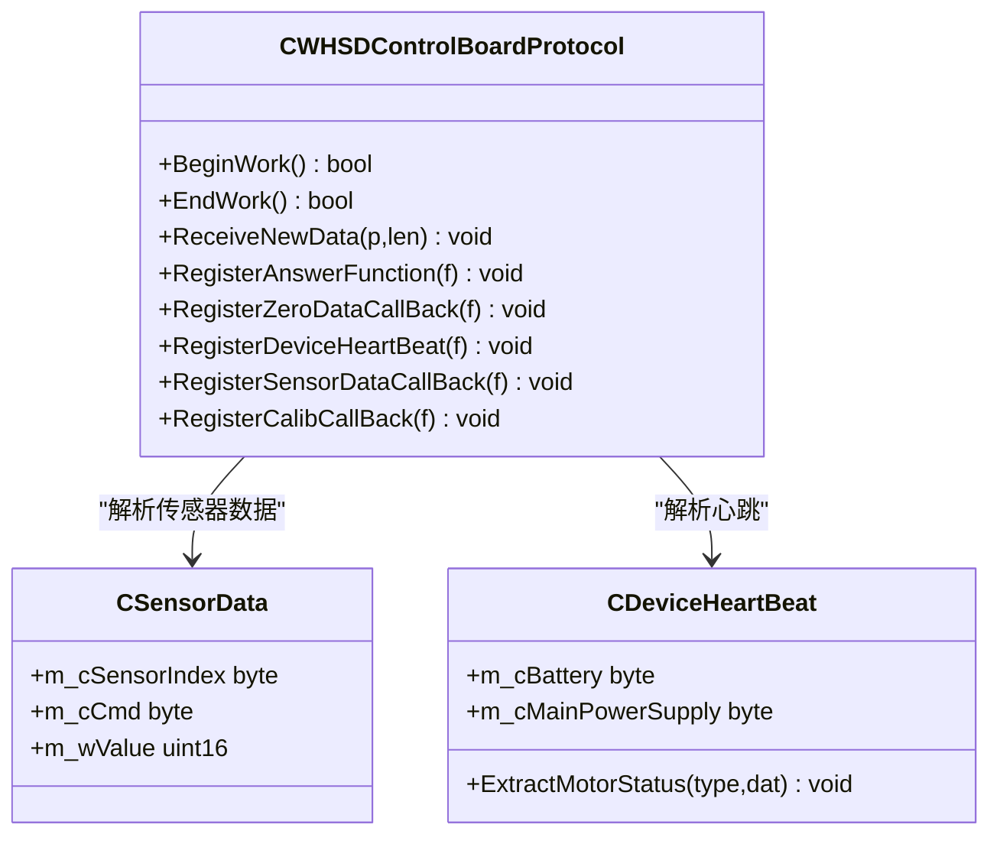
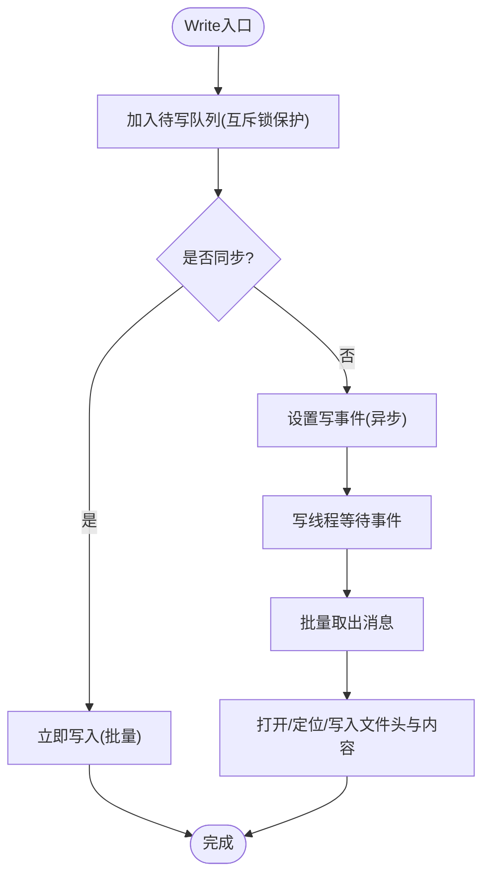
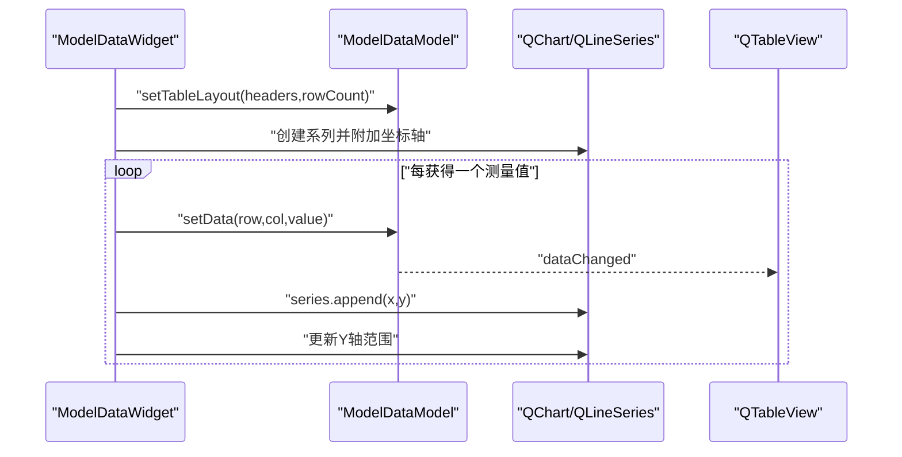
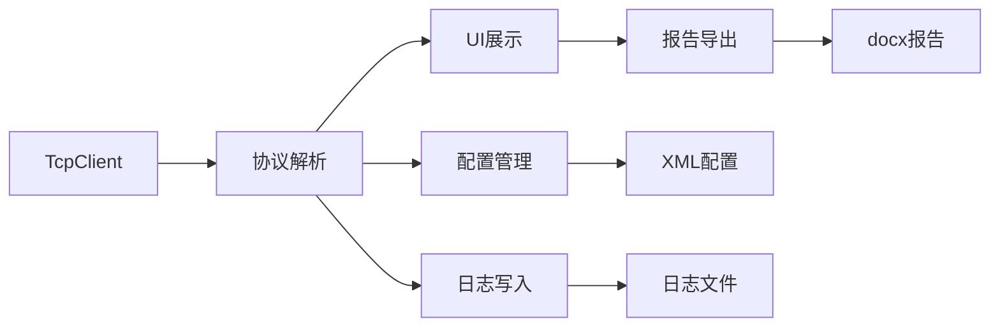

# 数据记录与监控

<cite>
**本文引用的文件**
- [README.md](file://README.md)
- [ScanS_WriteLog.h](file://Insulator_Zero_Value_Detection_Robot\Log\ScanS_WriteLog.h)
- [ScanS_WriteLog.cpp](file://Insulator_Zero_Value_Detection_Robot\Log\ScanS_WriteLog.cpp)
- [WriteLogIns.h](file://Insulator_Zero_Value_Detection_Robot\Log\WriteLogIns.h)
- [WriteLogIns.cpp](file://Insulator_Zero_Value_Detection_Robot\Log\WriteLogIns.cpp)
- [WriteReports.h](file://Insulator_Zero_Value_Detection_Robot\Report\WriteReports.h)
- [WriteReports.cpp](file://Insulator_Zero_Value_Detection_Robot\Report\WriteReports.cpp)
- [TcpClient.cpp](file://Insulator_Zero_Value_Detection_Robot\DeviceCom\TcpClient.cpp)
- [WHSDControlBoradProtocol.cpp](file://Insulator_Zero_Value_Detection_Robot\Protocol\WHSDControlBoradProtocol.cpp)
- [ConfigManager.cpp](file://Insulator_Zero_Value_Detection_Robot\Config\ConfigManager.cpp)
- [modeldatawidget.cpp](file://Insulator_Zero_Value_Detection_Robot\UI\modeldatawidget.cpp)
- [modeldatamodel.cpp](file://Insulator_Zero_Value_Detection_Robot\UI\modeldatamodel.cpp)
- [contentwidget.cpp](file://Insulator_Zero_Value_Detection_Robot\UI\contentwidget.cpp)
- [Insulator_Zero_Value_Detection_Robot.h](file://Insulator_Zero_Value_Detection_Robot\UI\Insulator_Zero_Value_Detection_Robot.h)
</cite>

## 目录
1. [简介](#简介)
2. [项目结构](#项目结构)
3. [核心组件](#核心组件)
4. [架构总览](#架构总览)
5. [详细组件分析](#详细组件分析)
6. [依赖关系分析](#依赖关系分析)
7. [性能考虑](#性能考虑)
8. [故障排查指南](#故障排查指南)
9. [结论](#结论)
10. [附录](#附录)

## 简介
本章节面向“绝缘子零值检测机器人V2”的数据记录与监控系统，说明检测过程中测量数据、设备状态、操作日志的采集与保存机制；描述实时监控界面的功能（视频流显示、数据图表更新、状态指示器）；解释前后端数据同步机制；阐述异常检测与告警机制；并提供历史数据查询回放、备份与导出的操作指引。

## 项目结构
本项目围绕“数据采集—协议解析—实时展示—持久化存储—报告导出”的主线组织：
- 设备通信层：TCP客户端负责与设备建立连接、收发数据。
- 协议解析层：将原始字节流解析为心跳、传感器数据、校准结果等结构化信息。
- 实时展示层：Qt界面提供表格、曲线图、状态指示器等可视化元素。
- 日志与存储层：异步线程写入固定行数的循环覆盖日志文件，保证高吞吐与一致性。
- 报告导出层：基于docx模板填充测量数据，生成可打印/归档的报告。
- 配置管理：从XML读取设备参数、相机RTSP地址、工单与报告模板配置。

**图示来源**
- [TcpClient.cpp:59-121](file://Insulator_Zero_Value_Detection_Robot\DeviceCom\TcpClient.cpp#L59-L121)
- [WHSDControlBoradProtocol.cpp:213-444](file://Insulator_Zero_Value_Detection_Robot\Protocol\WHSDControlBoradProtocol.cpp#L213-L444)
- [WriteLogIns.cpp:43-93](file://Insulator_Zero_Value_Detection_Robot\Log\WriteLogIns.cpp#L43-L93)
- [WriteReports.cpp:41-115](file://Insulator_Zero_Value_Detection_Robot\Report\WriteReports.cpp#L41-L115)
- [ConfigManager.cpp:16-257](file://Insulator_Zero_Value_Detection_Robot\Config\ConfigManager.cpp#L16-L257)

**章节来源**
- [README.md:1-3](file://README.md#L1-L3)

## 核心组件
- 设备通信模块：实现非阻塞TCP连接、自动重连、发送队列与接收回调。
- 协议解析模块：按帧头尾和校验解析数据包，分发心跳、测量数据、校准应答等。
- 日志记录模块：多线程安全、固定行数循环覆盖、支持同步/异步写入。
- UI展示模块：表格+曲线联动更新，动态坐标轴范围，颜色映射区域。
- 报告导出模块：基于docx模板替换占位符与动态表格行，输出标准报告。
- 配置管理模块：读写XML配置，包含设备参数、相机RTSP、工单与报告配置。

**章节来源**
- [TcpClient.cpp:21-121](file://Insulator_Zero_Value_Detection_Robot\DeviceCom\TcpClient.cpp#L21-L121)
- [WHSDControlBoradProtocol.cpp:179-211](file://Insulator_Zero_Value_Detection_Robot\Protocol\WHSDControlBoradProtocol.cpp#L179-L211)
- [ScanS_WriteLog.h:5-42](file://Insulator_Zero_Value_Detection_Robot\Log\ScanS_WriteLog.h#L5-L42)
- [WriteLogIns.h:65-129](file://Insulator_Zero_Value_Detection_Robot\Log\WriteLogIns.h#L65-L129)
- [modeldatawidget.cpp:24-120](file://Insulator_Zero_Value_Detection_Robot\UI\modeldatawidget.cpp#L24-L120)
- [WriteReports.h:20-89](file://Insulator_Zero_Value_Detection_Robot\Report\WriteReports.h#L20-L89)
- [ConfigManager.cpp:16-257](file://Insulator_Zero_Value_Detection_Robot\Config\ConfigManager.cpp#L16-L257)

## 架构总览
系统采用分层架构：
- 设备通信层：通过Winsock实现非阻塞I/O，使用条件变量协调发送队列，确保高并发下的稳定传输。
- 协议解析层：维护数据缓冲区，按帧边界解析并调用相应回调（心跳、测量、校准）。
- 展示层：Qt模型-视图分离，ModelDataModel承载数据，ModelDataWidget负责表格与曲线渲染。
- 存储层：CWriteLog/CWriteLogIns封装日志写入逻辑，内部线程批量落盘，避免频繁IO。
- 报告层：CWriteReports以docx为容器，仅替换正文XML中的占位符与表格行，保留样式与图片。
- 配置层：ConfigManager统一读写XML，集中管理设备、相机、工单与报告相关参数。

**图示来源**
- [TcpClient.cpp:301-382](file://Insulator_Zero_Value_Detection_Robot\DeviceCom\TcpClient.cpp#L301-L382)
- [WHSDControlBoradProtocol.cpp:213-444](file://Insulator_Zero_Value_Detection_Robot\Protocol\WHSDControlBoradProtocol.cpp#L213-L444)
- [WriteLogIns.cpp:128-159](file://Insulator_Zero_Value_Detection_Robot\Log\WriteLogIns.cpp#L128-L159)
- [WriteReports.cpp:107-115](file://Insulator_Zero_Value_Detection_Robot\Report\WriteReports.cpp#L107-L115)

## 详细组件分析

### 设备通信与数据接入
- 连接管理：BeginWork启动连接、接收、发送三个线程；ConnectionThread周期性尝试连接；SetConnected在状态变化时触发回调。
- 发送队列：Write将数据入队并通过条件变量唤醒发送线程；SendThread在连接可用时发送，错误时断开并重连。
- 接收处理：ReceiveThread使用select监听可读事件，收到数据后调用注册回调，供上层协议解析。

**图示来源**
- [TcpClient.cpp:59-121](file://Insulator_Zero_Value_Detection_Robot\DeviceCom\TcpClient.cpp#L59-L121)
- [TcpClient.cpp:123-236](file://Insulator_Zero_Value_Detection_Robot\DeviceCom\TcpClient.cpp#L123-L236)
- [TcpClient.cpp:238-382](file://Insulator_Zero_Value_Detection_Robot\DeviceCom\TcpClient.cpp#L238-L382)

**章节来源**
- [TcpClient.cpp:21-121](file://Insulator_Zero_Value_Detection_Robot\DeviceCom\TcpClient.cpp#L21-L121)
- [TcpClient.cpp:123-382](file://Insulator_Zero_Value_Detection_Robot\DeviceCom\TcpClient.cpp#L123-L382)

### 协议解析与数据分发
- 帧解析：Parse在缓冲区中查找帧头(0xff 0xfe)与帧尾(0xfd 0xfc)，校验和通过后提取命令类型与数据域。
- 命令分发：根据命令码分别处理心跳、日志上报、OTA状态、测量结果、传感器指令反馈、校准应答等。
- 回调机制：注册Answer、ZeroDataCallBack、DeviceHeartBeat、SensorDataCallBack、CalibCallBack等函数指针，解耦解析与业务逻辑。

**图示来源**
- [WHSDControlBoradProtocol.cpp:179-211](file://Insulator_Zero_Value_Detection_Robot\Protocol\WHSDControlBoradProtocol.cpp#L179-L211)
- [WHSDControlBoradProtocol.cpp:213-444](file://Insulator_Zero_Value_Detection_Robot\Protocol\WHSDControlBoradProtocol.cpp#L213-L444)
- [WHSDControlBoradProtocol.cpp:446-486](file://Insulator_Zero_Value_Detection_Robot\Protocol\WHSDControlBoradProtocol.cpp#L446-L486)

**章节来源**
- [WHSDControlBoradProtocol.cpp:213-444](file://Insulator_Zero_Value_Detection_Robot\Protocol\WHSDControlBoradProtocol.cpp#L213-L444)

### 实时数据记录与存储
- 写入接口：CWriteLog对外暴露Write/WriteFormat及同步版本Write_Sync/WriteFormat_Sync，内部委托CWriteLogIns。
- 线程模型：BeginWork创建写线程与事件对象；FuncWrite等待事件或退出信号，批量取出待写消息并落盘。
- 文件结构：文件头部维护最大行数、当前行、下一行、列宽等信息；内容行带时间戳与固定长度，支持循环覆盖。
- 同步策略：构造时可指定nSync=1强制同步写入；Write调用时也可临时指定nSync=1立即落盘。

**图示来源**
- [ScanS_WriteLog.cpp:5-66](file://Insulator_Zero_Value_Detection_Robot\Log\ScanS_WriteLog.cpp#L5-L66)
- [WriteLogIns.cpp:43-93](file://Insulator_Zero_Value_Detection_Robot\Log\WriteLogIns.cpp#L43-L93)
- [WriteLogIns.cpp:128-159](file://Insulator_Zero_Value_Detection_Robot\Log\WriteLogIns.cpp#L128-L159)
- [WriteLogIns.cpp:161-321](file://Insulator_Zero_Value_Detection_Robot\Log\WriteLogIns.cpp#L161-L321)

**章节来源**
- [ScanS_WriteLog.h:5-42](file://Insulator_Zero_Value_Detection_Robot\Log\ScanS_WriteLog.h#L5-L42)
- [ScanS_WriteLog.cpp:5-66](file://Insulator_Zero_Value_Detection_Robot\Log\ScanS_WriteLog.cpp#L5-L66)
- [WriteLogIns.h:65-129](file://Insulator_Zero_Value_Detection_Robot\Log\WriteLogIns.h#L65-L129)
- [WriteLogIns.cpp:43-321](file://Insulator_Zero_Value_Detection_Robot\Log\WriteLogIns.cpp#L43-L321)

### 实时监控界面与数据同步
- 表格与曲线：ModelDataWidget初始化QChartView与QTableView，按列生成曲线系列；appendValue逐点追加到表格与曲线，并动态扩展Y轴范围。
- 模型绑定：ModelDataModel继承QAbstractTableModel，维护二维数据矩阵，NaN表示未测量单元格；setData触发dataChanged通知视图刷新。
- 布局自适应：setTableLayout根据表头宽度计算表格最小宽度，splitter控制表格与曲线比例；resizeEvent延迟调整避免冲突。
- 状态指示：主窗口维护连接状态、录制标志、叠加标签等，用于显示设备连接、录像状态与当前检测结果浮层。

**图示来源**
- [modeldatawidget.cpp:24-120](file://Insulator_Zero_Value_Detection_Robot\UI\modeldatawidget.cpp#L24-L120)
- [modeldatawidget.cpp:139-187](file://Insulator_Zero_Value_Detection_Robot\UI\modeldatawidget.cpp#L139-L187)
- [modeldatamodel.cpp:20-38](file://Insulator_Zero_Value_Detection_Robot\UI\modeldatamodel.cpp#L20-L38)
- [modeldatamodel.cpp:72-113](file://Insulator_Zero_Value_Detection_Robot\UI\modeldatamodel.cpp#L72-L113)
- [Insulator_Zero_Value_Detection_Robot.h:246-293](file://Insulator_Zero_Value_Detection_Robot\UI\Insulator_Zero_Value_Detection_Robot.h#L246-L293)

**章节来源**
- [modeldatawidget.cpp:24-187](file://Insulator_Zero_Value_Detection_Robot\UI\modeldatawidget.cpp#L24-L187)
- [modeldatamodel.cpp:20-113](file://Insulator_Zero_Value_Detection_Robot\UI\modeldatamodel.cpp#L20-L113)
- [contentwidget.cpp:17-63](file://Insulator_Zero_Value_Detection_Robot\UI\contentwidget.cpp#L17-L63)
- [Insulator_Zero_Value_Detection_Robot.h:246-293](file://Insulator_Zero_Value_Detection_Robot\UI\Insulator_Zero_Value_Detection_Robot.h#L246-L293)

### 历史数据查询与回放
- 日志文件：固定列宽的文本格式，首行为头部元数据，后续每行包含序号、时间戳与消息体，支持循环覆盖。
- 查询方式：外部工具可按行号或时间戳检索；由于头部维护当前行与下一行位置，可快速定位最近写入区间。
- 回放建议：结合时间戳与业务语义进行过滤；对于高频测量数据，建议按批次或时间段截取片段进行分析。

**章节来源**
- [WriteLogIns.cpp:161-321](file://Insulator_Zero_Value_Detection_Robot\Log\WriteLogIns.cpp#L161-L321)
- [WriteLogIns.h:26-49](file://Insulator_Zero_Value_Detection_Robot\Log\WriteLogIns.h#L26-L49)

### 数据备份与导出
- 日志备份：直接复制日志文件至备份目录；注意循环覆盖策略，建议在关键节点前手动备份。
- 报告导出：CWriteReports提供FillDocxTemplate与FillMearDataReport，支持占位符替换与动态表格行生成；输出docx文件便于归档与分享。
- 配置备份：ConfigManager读写XML，可将当前配置导出为XML文件，便于迁移与回滚。

**章节来源**
- [WriteReports.cpp:41-115](file://Insulator_Zero_Value_Detection_Robot\Report\WriteReports.cpp#L41-L115)
- [WriteReports.cpp:129-321](file://Insulator_Zero_Value_Detection_Robot\Report\WriteReports.cpp#L129-L321)
- [ConfigManager.cpp:259-452](file://Insulator_Zero_Value_Detection_Robot\Config\ConfigManager.cpp#L259-L452)

## 依赖关系分析
- TcpClient依赖Winsock与std::thread，提供基础网络能力。
- 协议解析依赖工具函数（如大端转换），并与UI、日志、配置模块交互。
- UI模块依赖Qt框架（QChart、QTableView、QTimer等），通过模型-视图模式解耦数据与展示。
- 日志模块使用Windows事件与临界区实现线程安全，避免多写竞争。
- 报告模块依赖Qt私有ZipReader/Writer，直接操作docx内部XML。
- 配置模块依赖tinyxml2解析XML，并使用QJsonDocument序列化JSON字段。

**图示来源**
- [TcpClient.cpp:1-121](file://Insulator_Zero_Value_Detection_Robot\DeviceCom\TcpClient.cpp#L1-L121)
- [WHSDControlBoradProtocol.cpp:1-211](file://Insulator_Zero_Value_Detection_Robot\Protocol\WHSDControlBoradProtocol.cpp#L1-L211)
- [WriteLogIns.cpp:1-93](file://Insulator_Zero_Value_Detection_Robot\Log\WriteLogIns.cpp#L1-L93)
- [WriteReports.cpp:1-115](file://Insulator_Zero_Value_Detection_Robot\Report\WriteReports.cpp#L1-L115)
- [ConfigManager.cpp:1-257](file://Insulator_Zero_Value_Detection_Robot\Config\ConfigManager.cpp#L1-L257)

**章节来源**
- [TcpClient.cpp:1-121](file://Insulator_Zero_Value_Detection_Robot\DeviceCom\TcpClient.cpp#L1-L121)
- [WHSDControlBoradProtocol.cpp:1-211](file://Insulator_Zero_Value_Detection_Robot\Protocol\WHSDControlBoradProtocol.cpp#L1-L211)
- [WriteLogIns.cpp:1-93](file://Insulator_Zero_Value_Detection_Robot\Log\WriteLogIns.cpp#L1-L93)
- [WriteReports.cpp:1-115](file://Insulator_Zero_Value_Detection_Robot\Report\WriteReports.cpp#L1-L115)
- [ConfigManager.cpp:1-257](file://Insulator_Zero_Value_Detection_Robot\Config\ConfigManager.cpp#L1-L257)

## 性能考虑
- 网络I/O：非阻塞套接字与select减少CPU占用；发送队列缓冲突发流量，避免阻塞UI线程。
- 日志写入：批量写入与循环覆盖降低磁盘IO频率；固定列宽简化寻址与写入路径。
- UI更新：按需追加曲线点并动态扩展坐标轴，避免全量重绘；延迟布局调整防止抖动。
- 报告生成：仅替换必要XML片段，保留其他资源，提升生成效率。

[本节为通用性能讨论，不直接分析具体文件]

## 故障排查指南
- 连接失败：检查IP/端口配置；观察SetConnected回调与重连逻辑；确认防火墙与路由可达。
- 数据丢失：确认Parse帧头尾与校验逻辑；检查缓冲区大小与Erase时机；验证回调链是否完整注册。
- 日志异常：查看LE_Open/LE_Overflow错误码；确认文件路径存在且可写；检查列宽与行限制。
- UI卡顿：避免在主线程执行耗时操作；使用定时器延迟布局；减少频繁setRange调用。
- 报告生成失败：验证模板docx完整性；检查占位符键名与数据类型；确认输出目录权限。

**章节来源**
- [TcpClient.cpp:123-236](file://Insulator_Zero_Value_Detection_Robot\DeviceCom\TcpClient.cpp#L123-L236)
- [WHSDControlBoradProtocol.cpp:228-444](file://Insulator_Zero_Value_Detection_Robot\Protocol\WHSDControlBoradProtocol.cpp#L228-L444)
- [WriteLogIns.cpp:161-321](file://Insulator_Zero_Value_Detection_Robot\Log\WriteLogIns.cpp#L161-L321)
- [modeldatawidget.cpp:130-187](file://Insulator_Zero_Value_Detection_Robot\UI\modeldatawidget.cpp#L130-L187)
- [WriteReports.cpp:41-115](file://Insulator_Zero_Value_Detection_Robot\Report\WriteReports.cpp#L41-L115)

## 结论
本系统通过分层架构实现了稳定的数据采集、解析、展示与存储。TCP通信与协议解析确保数据可靠流入；日志模块提供高性能、可追溯的记录能力；UI模块以模型-视图模式实现流畅的实时可视化；报告导出满足归档需求。整体设计兼顾性能与可维护性，适合现场检测场景的长期运行。

[本节为总结性内容，不直接分析具体文件]

## 附录
- 实时视频区与数据标签页：参考操作说明书中的截图与说明，了解检测串状态与阻值曲线的展示方式。
- 检测操作流程：加载工单、选择侧别与相别、点击检测，测量结果实时显示并同步至状态与曲线。

**章节来源**
- [操作说明书.md:161-198](file://操作说明书.md#L161-L198)