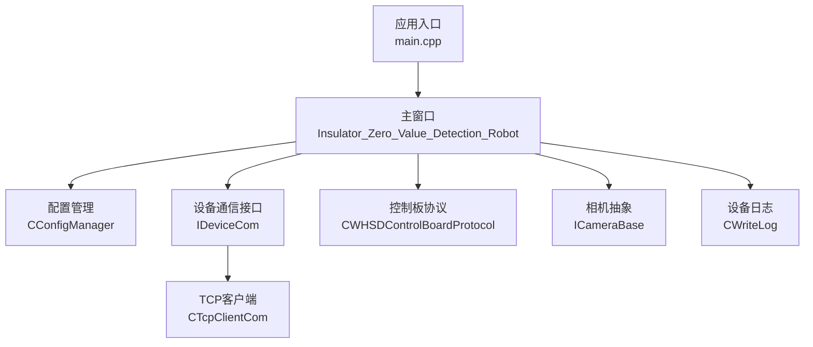
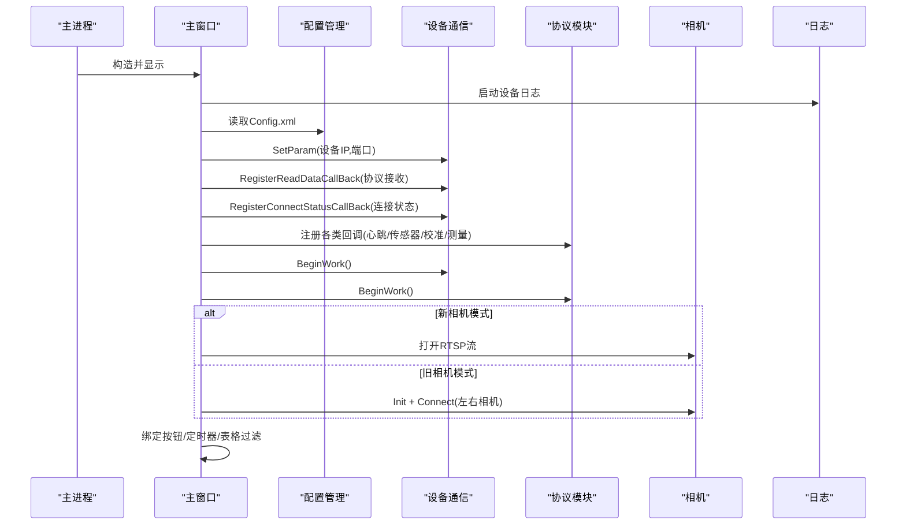
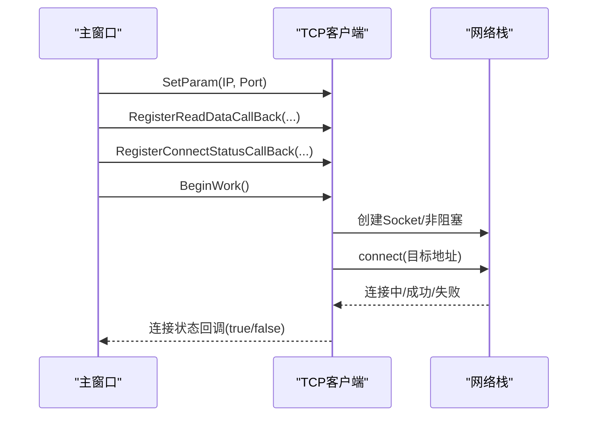
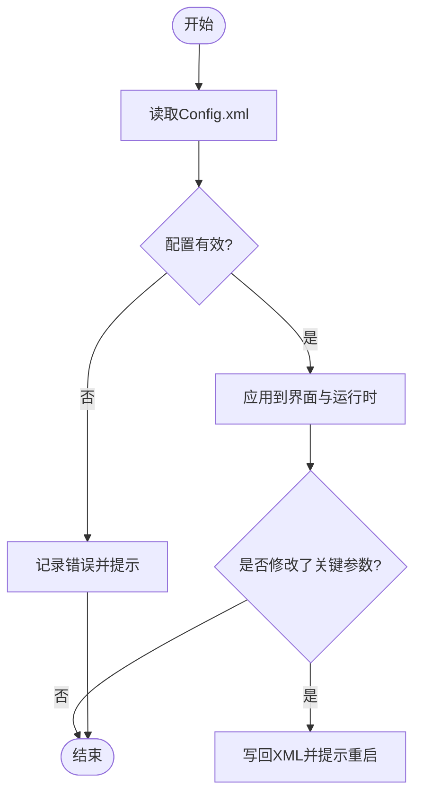
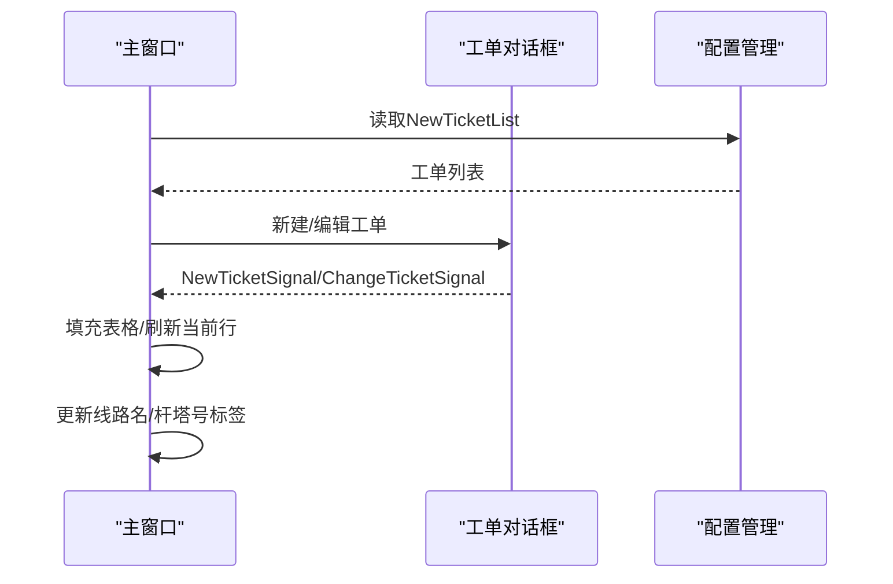
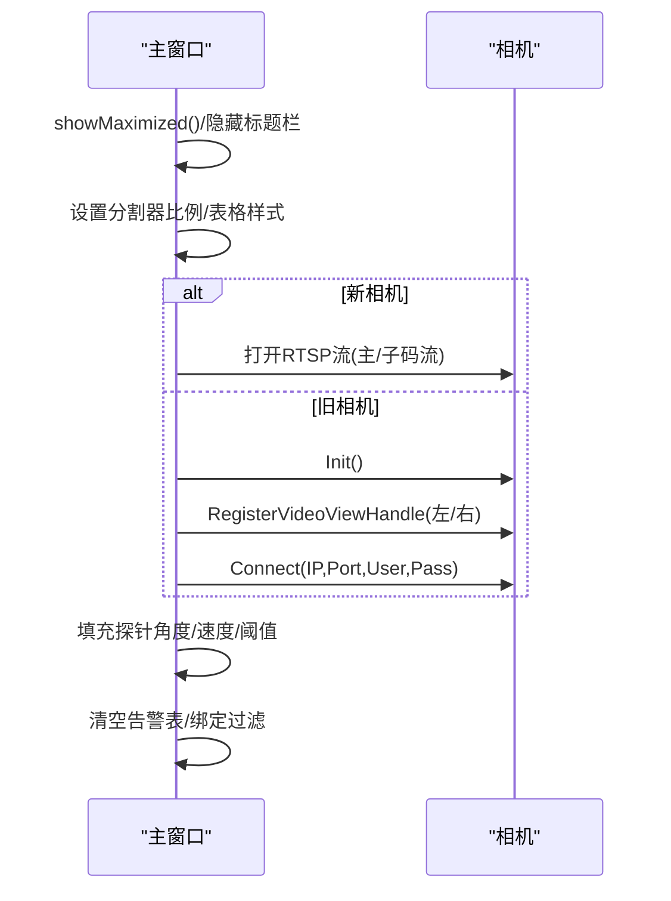
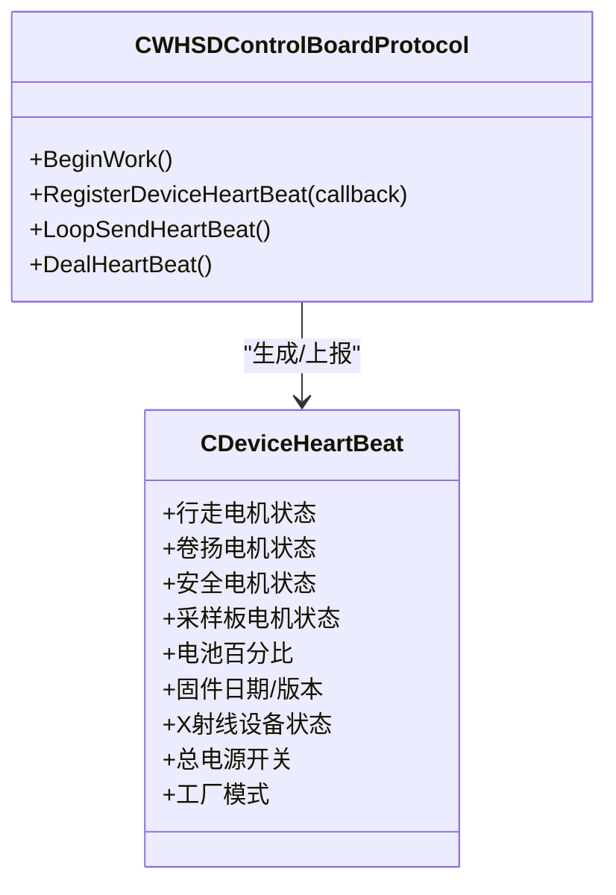
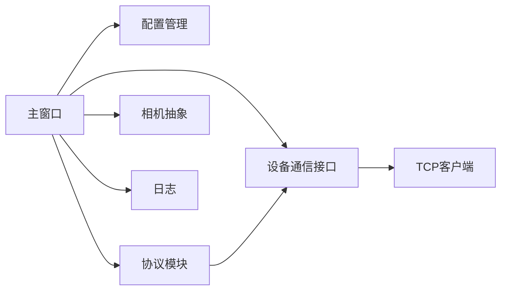

# 检测准备阶段

<cite>
**本文引用的文件**
- [main.cpp](file://Insulator_Zero_Value_Detection_Robot/main.cpp)
- [Insulator_Zero_Value_Detection_Robot.h](file://Insulator_Zero_Value_Detection_Robot/UI/Insulator_Zero_Value_Detection_Robot.h)
- [Insulator_Zero_Value_Detection_Robot.cpp](file://Insulator_Zero_Value_Detection_Robot/UI/Insulator_Zero_Value_Detection_Robot.cpp)
- [ConfigManager.h](file://Insulator_Zero_Value_Detection_Robot/Config/ConfigManager.h)
- [ConfigManager.cpp](file://Insulator_Zero_Value_Detection_Robot/Config/ConfigManager.cpp)
- [IDeviceCom.h](file://Insulator_Zero_Value_Detection_Robot/DeviceCom/IDeviceCom.h)
- [TcpClient.h](file://Insulator_Zero_Value_Detection_Robot/DeviceCom/TcpClient.h)
- [TcpClient.cpp](file://Insulator_Zero_Value_Detection_Robot/DeviceCom/TcpClient.cpp)
- [WHSDControlBoradProtocol.h](file://Insulator_Zero_Value_Detection_Robot/Protocol/WHSDControlBoradProtocol.h)
- [CameraBase.h](file://Insulator_Zero_Value_Detection_Robot/Camera/CameraBase.h)
- [NewTicketDialog.h](file://Insulator_Zero_Value_Detection_Robot/UI/NewTicketDialog.h)
</cite>

## 目录
1. [简介](#简介)
2. [项目结构](#项目结构)
3. [核心组件](#核心组件)
4. [架构总览](#架构总览)
5. [详细组件分析](#详细组件分析)
6. [依赖关系分析](#依赖关系分析)
7. [性能考虑](#性能考虑)
8. [故障排查指南](#故障排查指南)
9. [结论](#结论)
10. [附录](#附录)

## 简介
本章节面向“绝缘子零值检测机器人V2”的检测准备阶段，系统化说明启动后的准备工作流程：设备连接检查、参数配置验证、工单加载与确认、界面初始化（摄像头连接、UI组件加载、状态显示设置）、安全自检与心跳通信验证。文档以代码为依据，给出关键调用路径、时序与异常处理建议，帮助操作与维护人员快速完成上线前准备。

## 项目结构
系统采用分层模块化设计：
- UI层：主窗口负责界面初始化、事件绑定、状态展示与用户交互。
- 配置层：XML配置文件管理设备IP/端口、相机参数、工单与报告数据等。
- 通信层：抽象设备通信接口，TCP客户端实现与下位机通信。
- 协议层：解析/封装控制板协议帧，维护心跳、传感器数据、校准应答等。
- 相机层：统一相机接入接口，支持旧版SDK或新版RTSP流。
- 日志与安全：设备日志记录、安全阈值与状态监控。

图表来源
- [main.cpp:11-23](file://Insulator_Zero_Value_Detection_Robot/main.cpp#L11-L23)
- [Insulator_Zero_Value_Detection_Robot.cpp:231-315](file://Insulator_Zero_Value_Detection_Robot/UI/Insulator_Zero_Value_Detection_Robot.cpp#L231-L315)
- [ConfigManager.cpp:16-257](file://Insulator_Zero_Value_Detection_Robot/Config/ConfigManager.cpp#L16-L257)
- [TcpClient.cpp:59-87](file://Insulator_Zero_Value_Detection_Robot/DeviceCom/TcpClient.cpp#L59-L87)
- [WHSDControlBoradProtocol.h:189-217](file://Insulator_Zero_Value_Detection_Robot/Protocol/WHSDControlBoradProtocol.h#L189-L217)
- [CameraBase.h:5-14](file://Insulator_Zero_Value_Detection_Robot/Camera/CameraBase.h#L5-L14)

章节来源
- [main.cpp:11-23](file://Insulator_Zero_Value_Detection_Robot/main.cpp#L11-L23)
- [Insulator_Zero_Value_Detection_Robot.cpp:231-315](file://Insulator_Zero_Value_Detection_Robot/UI/Insulator_Zero_Value_Detection_Robot.cpp#L231-L315)

## 核心组件
- 主窗口：负责UI初始化、参数读取、设备通信注册、相机连接、定时器与事件绑定。
- 配置管理器：从XML读取并持久化设备、相机、工单与报告配置。
- 设备通信：抽象接口+TCP实现，提供读写、连接状态回调、收发线程。
- 协议模块：心跳上报、传感器数据、校准应答、测量结果回调。
- 相机模块：统一接口，支持旧版SDK直连或新版RTSP拉流。
- 日志模块：记录运行过程与异常信息，便于问题定位。

章节来源
- [Insulator_Zero_Value_Detection_Robot.h:26-385](file://Insulator_Zero_Value_Detection_Robot/UI/Insulator_Zero_Value_Detection_Robot.h#L26-L385)
- [ConfigManager.h:10-199](file://Insulator_Zero_Value_Detection_Robot/Config/ConfigManager.h#L10-L199)
- [IDeviceCom.h:1-15](file://Insulator_Zero_Value_Detection_Robot/DeviceCom/IDeviceCom.h#L1-L15)
- [TcpClient.h:8-47](file://Insulator_Zero_Value_Detection_Robot/DeviceCom/TcpClient.h#L8-L47)
- [WHSDControlBoradProtocol.h:121-217](file://Insulator_Zero_Value_Detection_Robot/Protocol/WHSDControlBoradProtocol.h#L121-L217)
- [CameraBase.h:5-14](file://Insulator_Zero_Value_Detection_Robot/Camera/CameraBase.h#L5-L14)

## 架构总览
检测准备阶段的整体流程如下：
- 程序启动后创建主窗口，执行参数初始化与界面初始化。
- 从XML加载配置（设备IP/端口、心跳周期、相机参数、工单与报告）。
- 建立设备通信通道（TCP），注册数据回调与连接状态回调。
- 启动协议模块，开始心跳循环与数据解析。
- 根据配置选择相机模式：旧版SDK或新版RTSP，分别连接并渲染画面。
- 绑定UI动作与定时器，进入待命状态，等待用户加载工单并发起检测。

图表来源
- [Insulator_Zero_Value_Detection_Robot.cpp:231-315](file://Insulator_Zero_Value_Detection_Robot/UI/Insulator_Zero_Value_Detection_Robot.cpp#L231-L315)
- [ConfigManager.cpp:16-257](file://Insulator_Zero_Value_Detection_Robot/Config/ConfigManager.cpp#L16-L257)
- [TcpClient.cpp:59-87](file://Insulator_Zero_Value_Detection_Robot/DeviceCom/TcpClient.cpp#L59-L87)
- [WHSDControlBoradProtocol.h:189-217](file://Insulator_Zero_Value_Detection_Robot/Protocol/WHSDControlBoradProtocol.h#L189-L217)
- [CameraBase.h:5-14](file://Insulator_Zero_Value_Detection_Robot/Camera/CameraBase.h#L5-L14)

## 详细组件分析

### 设备连接检查与TCP通信建立
- 参数设置：将设备IP与端口写入通信对象。
- 回调注册：注册读数据回调（交由协议模块解析）与连接状态回调（通知UI更新）。
- 工作启动：启动发送、接收、连接线程；非阻塞套接字+select机制尝试连接。
- 连接状态：通过回调向UI反馈连接成功/失败，用于后续步骤推进。

图表来源
- [Insulator_Zero_Value_Detection_Robot.cpp:265-290](file://Insulator_Zero_Value_Detection_Robot/UI/Insulator_Zero_Value_Detection_Robot.cpp#L265-L290)
- [TcpClient.cpp:27-87](file://Insulator_Zero_Value_Detection_Robot/DeviceCom/TcpClient.cpp#L27-L87)
- [TcpClient.cpp:123-200](file://Insulator_Zero_Value_Detection_Robot/DeviceCom/TcpClient.cpp#L123-L200)

章节来源
- [Insulator_Zero_Value_Detection_Robot.cpp:265-290](file://Insulator_Zero_Value_Detection_Robot/UI/Insulator_Zero_Value_Detection_Robot.cpp#L265-L290)
- [TcpClient.cpp:27-87](file://Insulator_Zero_Value_Detection_Robot/DeviceCom/TcpClient.cpp#L27-L87)
- [TcpClient.cpp:123-200](file://Insulator_Zero_Value_Detection_Robot/DeviceCom/TcpClient.cpp#L123-L200)

### 参数配置验证（设备、相机、阈值）
- 设备参数：IP、端口、心跳周期、工厂模式、探针角度、电机速度、绝缘阈值等。
- 相机参数：新旧相机标志、主/子码流URL、左右相机IP。
- 校验规则：输入框使用正则表达式校验IP格式；数值范围由界面控件限制。
- 持久化：修改后写回XML，必要时提示重启生效。

图表来源
- [ConfigManager.cpp:16-257](file://Insulator_Zero_Value_Detection_Robot/Config/ConfigManager.cpp#L16-L257)
- [ConfigManager.cpp:259-452](file://Insulator_Zero_Value_Detection_Robot/Config/ConfigManager.cpp#L259-L452)
- [Insulator_Zero_Value_Detection_Robot.cpp:206-229](file://Insulator_Zero_Value_Detection_Robot/UI/Insulator_Zero_Value_Detection_Robot.cpp#L206-L229)

章节来源
- [ConfigManager.cpp:16-257](file://Insulator_Zero_Value_Detection_Robot/Config/ConfigManager.cpp#L16-L257)
- [ConfigManager.cpp:259-452](file://Insulator_Zero_Value_Detection_Robot/Config/ConfigManager.cpp#L259-L452)
- [Insulator_Zero_Value_Detection_Robot.cpp:206-229](file://Insulator_Zero_Value_Detection_Robot/UI/Insulator_Zero_Value_Detection_Robot.cpp#L206-L229)

### 工单加载与确认
- 工单数据结构：包含串数类型、回路数、交直流类型、绝缘子片数、线路名称、杆塔号、时间、检测单位/人员、备注及测量数据JSON。
- 导入流程：从XML列表加载到界面表格，支持按线路名称与检测人员实时过滤。
- 确认流程：新建/编辑工单后，通过信号槽将配置传回主窗口，刷新当前工单行与显示标签。

图表来源
- [ConfigManager.cpp:132-217](file://Insulator_Zero_Value_Detection_Robot/Config/ConfigManager.cpp#L132-L217)
- [Insulator_Zero_Value_Detection_Robot.cpp:165-186](file://Insulator_Zero_Value_Detection_Robot/UI/Insulator_Zero_Value_Detection_Robot.cpp#L165-L186)
- [NewTicketDialog.h:10-35](file://Insulator_Zero_Value_Detection_Robot/UI/NewTicketDialog.h#L10-L35)
- [Insulator_Zero_Value_Detection_Robot.cpp:349-352](file://Insulator_Zero_Value_Detection_Robot/UI/Insulator_Zero_Value_Detection_Robot.cpp#L349-L352)

章节来源
- [ConfigManager.cpp:132-217](file://Insulator_Zero_Value_Detection_Robot/Config/ConfigManager.cpp#L132-L217)
- [Insulator_Zero_Value_Detection_Robot.cpp:165-186](file://Insulator_Zero_Value_Detection_Robot/UI/Insulator_Zero_Value_Detection_Robot.cpp#L165-L186)
- [NewTicketDialog.h:10-35](file://Insulator_Zero_Value_Detection_Robot/UI/NewTicketDialog.h#L10-L35)
- [Insulator_Zero_Value_Detection_Robot.cpp:349-352](file://Insulator_Zero_Value_Detection_Robot/UI/Insulator_Zero_Value_Detection_Robot.cpp#L349-L352)

### 界面初始化（摄像头、UI组件、状态显示）
- 界面布局：最大化、隐藏标题栏、分割器比例设置、表格表头拉伸。
- 相机连接：
  - 旧相机：获取窗口句柄，注册视频视图，Init后Connect左右相机。
  - 新相机：根据配置选择主/子码流RTSP URL，OpenCV低延迟拉流。
- 状态显示：探针角度、电机速度、绝缘阈值等从配置填入界面；告警表清空并动态填充。

图表来源
- [Insulator_Zero_Value_Detection_Robot.cpp:104-229](file://Insulator_Zero_Value_Detection_Robot/UI/Insulator_Zero_Value_Detection_Robot.cpp#L104-L229)
- [Insulator_Zero_Value_Detection_Robot.cpp:1315-1415](file://Insulator_Zero_Value_Detection_Robot/UI/Insulator_Zero_Value_Detection_Robot.cpp#L1315-L1415)
- [CameraBase.h:5-14](file://Insulator_Zero_Value_Detection_Robot/Camera/CameraBase.h#L5-L14)

章节来源
- [Insulator_Zero_Value_Detection_Robot.cpp:104-229](file://Insulator_Zero_Value_Detection_Robot/UI/Insulator_Zero_Value_Detection_Robot.cpp#L104-L229)
- [Insulator_Zero_Value_Detection_Robot.cpp:1315-1415](file://Insulator_Zero_Value_Detection_Robot/UI/Insulator_Zero_Value_Detection_Robot.cpp#L1315-L1415)
- [CameraBase.h:5-14](file://Insulator_Zero_Value_Detection_Robot/Camera/CameraBase.h#L5-L14)

### 安全检查和系统自检
- 心跳机制：协议模块周期性上报设备心跳，包含电池、固件版本、各电机状态、总电源开关、工厂模式等。
- 状态快照：UI线程定期获取心跳快照，判断设备在线与电源状态。
- 安全阈值：激光测距、安全轮角度、成像板角度、各电机电压阈值在协议配置中定义，用于异常判定。
- 自检要点：
  - 心跳是否到达（超时则视为离线）。
  - 总电源是否为关（需先收到心跳且回报为关才视为关闭）。
  - 各电机状态是否正常（使能、状态码）。
  - 传感器数据是否有效（如X射线设备状态）。

图表来源
- [WHSDControlBoradProtocol.h:121-187](file://Insulator_Zero_Value_Detection_Robot/Protocol/WHSDControlBoradProtocol.h#L121-L187)
- [WHSDControlBoradProtocol.h:189-217](file://Insulator_Zero_Value_Detection_Robot/Protocol/WHSDControlBoradProtocol.h#L189-L217)
- [Insulator_Zero_Value_Detection_Robot.h:103-106](file://Insulator_Zero_Value_Detection_Robot/UI/Insulator_Zero_Value_Detection_Robot.h#L103-L106)

章节来源
- [WHSDControlBoradProtocol.h:121-187](file://Insulator_Zero_Value_Detection_Robot/Protocol/WHSDControlBoradProtocol.h#L121-L187)
- [WHSDControlBoradProtocol.h:189-217](file://Insulator_Zero_Value_Detection_Robot/Protocol/WHSDControlBoradProtocol.h#L189-L217)
- [Insulator_Zero_Value_Detection_Robot.h:103-106](file://Insulator_Zero_Value_Detection_Robot/UI/Insulator_Zero_Value_Detection_Robot.h#L103-L106)

## 依赖关系分析
- 主窗口依赖配置管理、设备通信接口、协议模块、相机抽象与日志模块。
- 设备通信接口被TCP客户端实现；协议模块依赖通信接口进行数据收发。
- 相机抽象支持多实现（旧SDK/新RTSP），由主窗口根据配置选择。
- 日志模块贯穿初始化、连接、配置读写与异常处理。

图表来源
- [Insulator_Zero_Value_Detection_Robot.cpp:231-315](file://Insulator_Zero_Value_Detection_Robot/UI/Insulator_Zero_Value_Detection_Robot.cpp#L231-L315)
- [IDeviceCom.h:1-15](file://Insulator_Zero_Value_Detection_Robot/DeviceCom/IDeviceCom.h#L1-L15)
- [TcpClient.h:8-47](file://Insulator_Zero_Value_Detection_Robot/DeviceCom/TcpClient.h#L8-L47)
- [WHSDControlBoradProtocol.h:189-217](file://Insulator_Zero_Value_Detection_Robot/Protocol/WHSDControlBoradProtocol.h#L189-L217)
- [CameraBase.h:5-14](file://Insulator_Zero_Value_Detection_Robot/Camera/CameraBase.h#L5-L14)

章节来源
- [Insulator_Zero_Value_Detection_Robot.cpp:231-315](file://Insulator_Zero_Value_Detection_Robot/UI/Insulator_Zero_Value_Detection_Robot.cpp#L231-L315)
- [IDeviceCom.h:1-15](file://Insulator_Zero_Value_Detection_Robot/DeviceCom/IDeviceCom.h#L1-L15)
- [TcpClient.h:8-47](file://Insulator_Zero_Value_Detection_Robot/DeviceCom/TcpClient.h#L8-L47)
- [WHSDControlBoradProtocol.h:189-217](file://Insulator_Zero_Value_Detection_Robot/Protocol/WHSDControlBoradProtocol.h#L189-L217)
- [CameraBase.h:5-14](file://Insulator_Zero_Value_Detection_Robot/Camera/CameraBase.h#L5-L14)

## 性能考虑
- 非阻塞网络与多线程：TCP客户端使用非阻塞套接字与独立收发线程，降低UI阻塞风险。
- 低延迟视频流：新相机模式设置最小缓冲区，减少端到端延迟。
- 定时器粒度：UI定时器间隔100ms/10ms，兼顾响应性与负载。
- 日志缓冲：设备日志采用缓冲写入，避免频繁IO影响性能。

[本节为通用指导，不直接分析具体文件]

## 故障排查指南
- 设备连接失败
  - 现象：连接状态回调返回false，UI未显示在线。
  - 排查：检查Config.xml中的设备IP与端口是否正确；确认网络可达；查看TCP客户端日志与Winsock错误码。
  - 参考路径：[TcpClient.cpp:59-87](file://Insulator_Zero_Value_Detection_Robot/DeviceCom/TcpClient.cpp#L59-L87)、[TcpClient.cpp:123-200](file://Insulator_Zero_Value_Detection_Robot/DeviceCom/TcpClient.cpp#L123-L200)
- 参数配置错误
  - 现象：界面无法正确显示或保存失败。
  - 排查：检查XML节点是否存在与数据类型；确认IP正则校验通过；保存后重启软件（相机IP变更需重启）。
  - 参考路径：[ConfigManager.cpp:16-257](file://Insulator_Zero_Value_Detection_Robot/Config/ConfigManager.cpp#L16-L257)、[ConfigManager.cpp:259-452](file://Insulator_Zero_Value_Detection_Robot/Config/ConfigManager.cpp#L259-L452)、[Insulator_Zero_Value_Detection_Robot.cpp:2526-2541](file://Insulator_Zero_Value_Detection_Robot/UI/Insulator_Zero_Value_Detection_Robot.cpp#L2526-L2541)
- 相机连接失败
  - 旧相机：Init或Connect失败，检查相机IP、用户名密码、窗口句柄注册。
  - 新相机：RTSP URL无效或FFMPEG打不开，检查UseMainSp/MainRtsp/SubRtsp配置。
  - 参考路径：[Insulator_Zero_Value_Detection_Robot.cpp:1315-1415](file://Insulator_Zero_Value_Detection_Robot/UI/Insulator_Zero_Value_Detection_Robot.cpp#L1315-L1415)、[CameraBase.h:5-14](file://Insulator_Zero_Value_Detection_Robot/Camera/CameraBase.h#L5-L14)
- 心跳超时/设备离线
  - 现象：长时间无心跳，UI显示离线或电源状态未知。
  - 排查：确认设备已上电且协议模块BeginWork；检查心跳周期配置；查看协议日志。
  - 参考路径：[WHSDControlBoradProtocol.h:189-217](file://Insulator_Zero_Value_Detection_Robot/Protocol/WHSDControlBoradProtocol.h#L189-L217)、[Insulator_Zero_Value_Detection_Robot.h:103-106](file://Insulator_Zero_Value_Detection_Robot/UI/Insulator_Zero_Value_Detection_Robot.h#L103-L106)
- 工单数据异常
  - 现象：表格为空或过滤无效。
  - 排查：检查XML中NewTicketList结构；确认必填字段存在；重新加载或重置过滤条件。
  - 参考路径：[ConfigManager.cpp:132-217](file://Insulator_Zero_Value_Detection_Robot/Config/ConfigManager.cpp#L132-L217)、[Insulator_Zero_Value_Detection_Robot.cpp:165-186](file://Insulator_Zero_Value_Detection_Robot/UI/Insulator_Zero_Value_Detection_Robot.cpp#L165-L186)

章节来源
- [TcpClient.cpp:59-87](file://Insulator_Zero_Value_Detection_Robot/DeviceCom/TcpClient.cpp#L59-L87)
- [TcpClient.cpp:123-200](file://Insulator_Zero_Value_Detection_Robot/DeviceCom/TcpClient.cpp#L123-L200)
- [ConfigManager.cpp:16-257](file://Insulator_Zero_Value_Detection_Robot/Config/ConfigManager.cpp#L16-L257)
- [ConfigManager.cpp:259-452](file://Insulator_Zero_Value_Detection_Robot/Config/ConfigManager.cpp#L259-L452)
- [Insulator_Zero_Value_Detection_Robot.cpp:2526-2541](file://Insulator_Zero_Value_Detection_Robot/UI/Insulator_Zero_Value_Detection_Robot.cpp#L2526-L2541)
- [Insulator_Zero_Value_Detection_Robot.cpp:1315-1415](file://Insulator_Zero_Value_Detection_Robot/UI/Insulator_Zero_Value_Detection_Robot.cpp#L1315-L1415)
- [CameraBase.h:5-14](file://Insulator_Zero_Value_Detection_Robot/Camera/CameraBase.h#L5-L14)
- [WHSDControlBoradProtocol.h:189-217](file://Insulator_Zero_Value_Detection_Robot/Protocol/WHSDControlBoradProtocol.h#L189-L217)
- [Insulator_Zero_Value_Detection_Robot.h:103-106](file://Insulator_Zero_Value_Detection_Robot/UI/Insulator_Zero_Value_Detection_Robot.h#L103-L106)
- [ConfigManager.cpp:132-217](file://Insulator_Zero_Value_Detection_Robot/Config/ConfigManager.cpp#L132-L217)
- [Insulator_Zero_Value_Detection_Robot.cpp:165-186](file://Insulator_Zero_Value_Detection_Robot/UI/Insulator_Zero_Value_Detection_Robot.cpp#L165-L186)

## 结论
检测准备阶段的核心在于“配置正确、通信可靠、界面就绪、安全可控”。通过XML配置统一管理设备与相机参数，借助TCP与协议模块建立稳定通信链路，结合心跳与阈值实现安全自检；界面初始化确保可视化与交互可用。遵循本文流程与排查指南，可高效完成上线前准备并快速定位常见问题。

[本节为总结性内容，不直接分析具体文件]

## 附录
- 关键常量与超时建议：
  - 测量结果超时：约3.2秒回报，建议≥8秒。
  - 校准命令应答超时：Flash擦写耗时1~2秒，建议≥5秒。
  - 探针到位兜底等待：协议未提供到位信号时最大等待约4秒。
- 参考路径：
  - [Insulator_Zero_Value_Detection_Robot.cpp:55-73](file://Insulator_Zero_Value_Detection_Robot/UI/Insulator_Zero_Value_Detection_Robot.cpp#L55-L73)

[本节为补充信息，不直接分析具体文件]