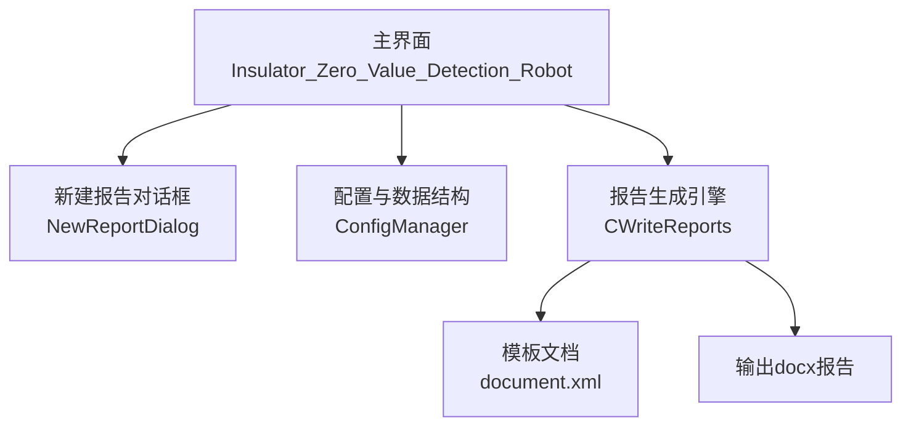
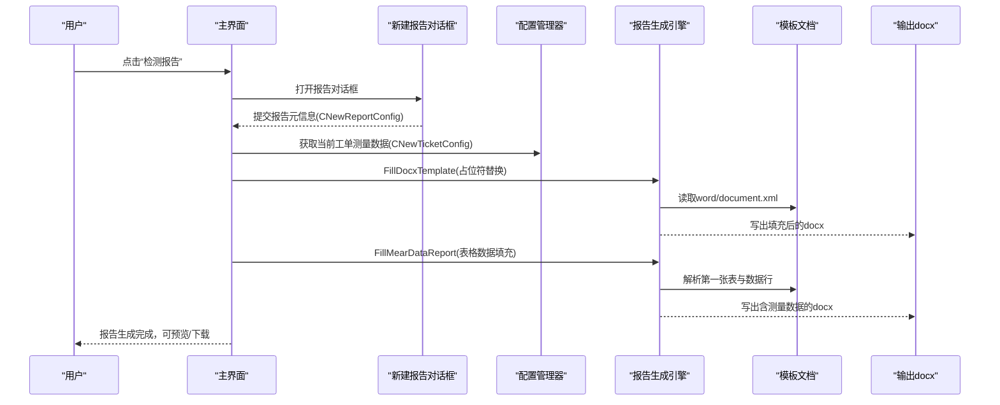
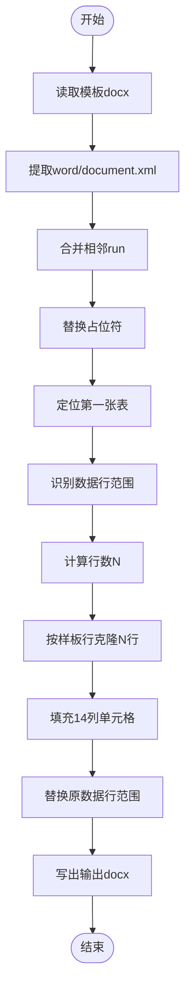
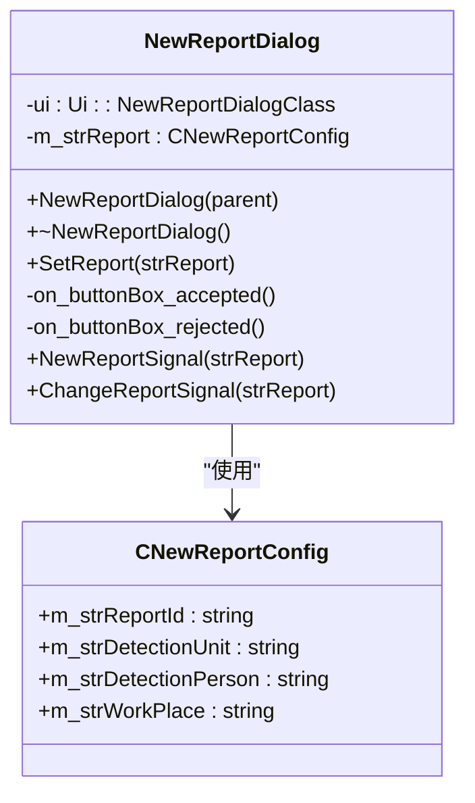
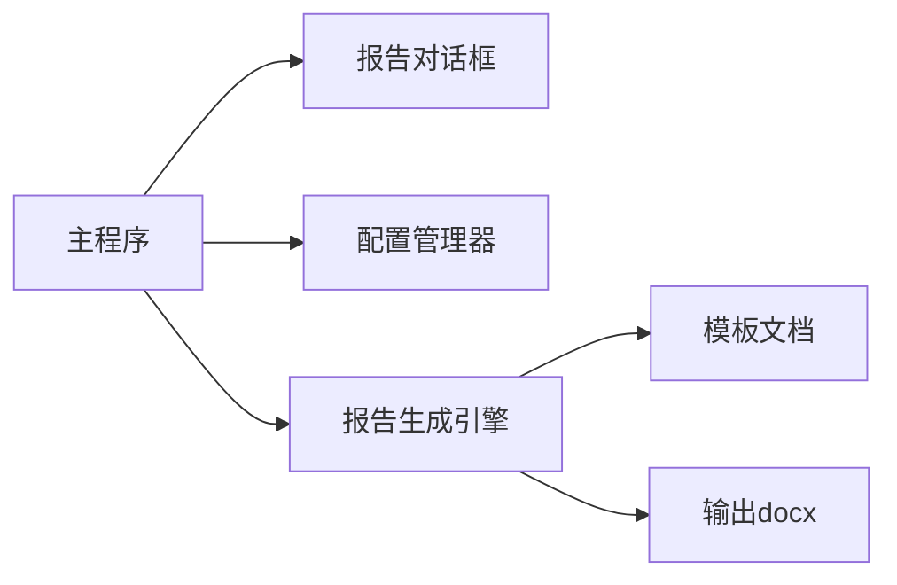

# 检测完成与报告生成

<cite>
**本文引用的文件**
- [WriteReports.h](file://Insulator_Zero_Value_Detection_Robot/Report/WriteReports.h)
- [WriteReports.cpp](file://Insulator_Zero_Value_Detection_Robot/Report/WriteReports.cpp)
- [document.xml](file://Insulator_Zero_Value_Detection_Robot/Report/document.xml)
- [ConfigManager.h](file://Insulator_Zero_Value_Detection_Robot/Config/ConfigManager.h)
- [NewReportDialog.h](file://Insulator_Zero_Value_Detection_Robot/UI/NewReportDialog.h)
- [NewReportDialog.cpp](file://Insulator_Zero_Value_Detection_Robot/UI/NewReportDialog.cpp)
- [NewReportDialog.ui](file://Insulator_Zero_Value_Detection_Robot/UI/NewReportDialog.ui)
- [Insulator_Zero_Value_Detection_Robot.h](file://Insulator_Zero_Value_Detection_Robot/UI/Insulator_Zero_Value_Detection_Robot.h)
- [操作说明书.md](file://操作说明书.md)
</cite>

## 目录
1. [简介](#简介)
2. [项目结构](#项目结构)
3. [核心组件](#核心组件)
4. [架构总览](#架构总览)
5. [详细组件分析](#详细组件分析)
6. [依赖关系分析](#依赖关系分析)
7. [性能考虑](#性能考虑)
8. [故障排查指南](#故障排查指南)
9. [结论](#结论)
10. [附录](#附录)

## 简介
本章节面向“绝缘子零值检测机器人V2”的检测完成与报告生成流程，说明从检测任务结束到Word报告自动生成的完整链路：数据汇总、质量检查、结果验证、模板填充、数据格式化、表格行自适应、异常数据分析、结论建议组织，以及报告的预览、编辑、导出、历史查询与管理、模板定制与质量保证等。

## 项目结构
围绕报告生成能力，代码主要分布在以下模块：
- 报告生成引擎：Report/WriteReports.* 负责基于docx模板的占位符替换与测量数据表格填充。
- 报告配置与UI：UI/NewReportDialog.* 提供报告元信息录入界面；Config/ConfigManager.h 定义报告与工单的数据结构。
- 主程序集成：UI/Insulator_Zero_Value_Detection_Robot.* 负责将测量数据与报告生成流程串联。
- 模板文件：Report/document.xml 为报告模板正文XML，包含标题、目录、检测概况、判定方法、数据表等结构。

**图表来源**
- [Insulator_Zero_Value_Detection_Robot.h:26-133](file://Insulator_Zero_Value_Detection_Robot/UI/Insulator_Zero_Value_Detection_Robot.h#L26-L133)
- [NewReportDialog.h:10-31](file://Insulator_Zero_Value_Detection_Robot/UI/NewReportDialog.h#L10-L31)
- [WriteReports.h:24-88](file://Insulator_Zero_Value_Detection_Robot/Report/WriteReports.h#L24-L88)
- [document.xml:1-2](file://Insulator_Zero_Value_Detection_Robot/Report/document.xml#L1-L2)

**章节来源**
- [Insulator_Zero_Value_Detection_Robot.h:26-133](file://Insulator_Zero_Value_Detection_Robot/UI/Insulator_Zero_Value_Detection_Robot.h#L26-L133)
- [NewReportDialog.h:10-31](file://Insulator_Zero_Value_Detection_Robot/UI/NewReportDialog.h#L10-L31)
- [WriteReports.h:24-88](file://Insulator_Zero_Value_Detection_Robot/Report/WriteReports.h#L24-L88)
- [document.xml:1-2](file://Insulator_Zero_Value_Detection_Robot/Report/document.xml#L1-L2)

## 核心组件
- CWriteReports（报告生成引擎）
  - 功能：读取docx模板，替换word/document.xml中的占位符，并基于双联测量数据动态生成表格数据行。
  - 关键接口：FillDocxTemplate（文本占位符替换）、FillMearDataReport（测量数据表格填充）。
  - 内部机制：合并被拆分的run、XML转义、正则定位表格与单元格、按样板行克隆并写入14列数据。
- NewReportDialog（报告元信息输入）
  - 功能：收集报告编号、检测单位、检测人员、作业地点等信息，提交至主程序用于报告生成。
- ConfigManager（配置与数据结构）
  - 功能：定义CNewReportConfig（报告元信息）、CNewTicketConfig（工单与测量数据容器），并提供读写配置的能力。
- 主程序（Insulator_Zero_Value_Detection_Robot）
  - 功能：承载检测流程、测量数据聚合、触发报告生成、管理报告列表与下载等操作。

**章节来源**
- [WriteReports.h:24-88](file://Insulator_Zero_Value_Detection_Robot/Report/WriteReports.h#L24-L88)
- [WriteReports.cpp:10-321](file://Insulator_Zero_Value_Detection_Robot/Report/WriteReports.cpp#L10-L321)
- [NewReportDialog.h:10-31](file://Insulator_Zero_Value_Detection_Robot/UI/NewReportDialog.h#L10-L31)
- [NewReportDialog.cpp:4-49](file://Insulator_Zero_Value_Detection_Robot/UI/NewReportDialog.cpp#L4-L49)
- [ConfigManager.h:39-199](file://Insulator_Zero_Value_Detection_Robot/Config/ConfigManager.h#L39-L199)
- [Insulator_Zero_Value_Detection_Robot.h:26-133](file://Insulator_Zero_Value_Detection_Robot/UI/Insulator_Zero_Value_Detection_Robot.h#L26-L133)

## 架构总览
报告生成采用“模板+数据”的方式：
- 模板层：report/document.xml 定义了报告的结构与样式，包括标题、目录、检测概况、依据与判定方法、方位定义、检测数据情况、附录等。
- 数据层：CNewTicketConfig.m_mapTicketMearData 以JSON形式存储测量数据，键为侧别（大号/小号），值为相别数组（A/B/C），每相内按[内侧,外侧]成对存放。
- 处理层：CWriteReports 通过正则解析XML，定位表格与数据行，按样板行克隆并填充14列数据，同时支持占位符替换。
- 输出层：生成新的docx文件，保留模板其他部件（样式、图片、页眉页脚等）不变。

**图表来源**
- [NewReportDialog.cpp:19-49](file://Insulator_Zero_Value_Detection_Robot/UI/NewReportDialog.cpp#L19-L49)
- [WriteReports.cpp:40-115](file://Insulator_Zero_Value_Detection_Robot/Report/WriteReports.cpp#L40-L115)
- [WriteReports.cpp:131-151](file://Insulator_Zero_Value_Detection_Robot/Report/WriteReports.cpp#L131-L151)
- [WriteReports.cpp:206-321](file://Insulator_Zero_Value_Detection_Robot/Report/WriteReports.cpp#L206-L321)
- [操作说明书.md:284-316](file://操作说明书.md#L284-L316)

## 详细组件分析

### 报告生成引擎（CWriteReports）
- 占位符替换
  - 合并相邻run使${key}连续，避免被Word拆分导致替换失败。
  - XML转义确保特殊字符在Word中正确显示。
  - 遍历QHash键值对，批量替换所有占位符。
- 测量数据表格填充
  - 解析JSON数据，提取六列数组：大号侧A/B/C、小号侧A/B/C。
  - 计算行数N = max(ceil(size/2))，实现行数自适应。
  - 定位第一张表，识别数据行范围（首列为片号数字且共14列）。
  - 以样板行为基础，克隆生成N行，逐单元格写入内侧/外侧测量值。
  - 用新数据行替换原范围，回填document.xml并写出docx。

**图表来源**
- [WriteReports.cpp:20-38](file://Insulator_Zero_Value_Detection_Robot/Report/WriteReports.cpp#L20-L38)
- [WriteReports.cpp:40-115](file://Insulator_Zero_Value_Detection_Robot/Report/WriteReports.cpp#L40-L115)
- [WriteReports.cpp:153-204](file://Insulator_Zero_Value_Detection_Robot/Report/WriteReports.cpp#L153-L204)
- [WriteReports.cpp:206-321](file://Insulator_Zero_Value_Detection_Robot/Report/WriteReports.cpp#L206-L321)

**章节来源**
- [WriteReports.h:24-88](file://Insulator_Zero_Value_Detection_Robot/Report/WriteReports.h#L24-L88)
- [WriteReports.cpp:10-321](file://Insulator_Zero_Value_Detection_Robot/Report/WriteReports.cpp#L10-L321)

### 报告元信息输入（NewReportDialog）
- 界面字段：报告编号、检测单位、检测人员、作业地点。
- 交互逻辑：确认按钮将输入封装为CNewReportConfig并通过信号发射；取消按钮关闭对话框。
- 数据绑定：SetReport方法用于回显已有报告信息。

**图表来源**
- [NewReportDialog.h:10-31](file://Insulator_Zero_Value_Detection_Robot/UI/NewReportDialog.h#L10-L31)
- [NewReportDialog.cpp:4-49](file://Insulator_Zero_Value_Detection_Robot/UI/NewReportDialog.cpp#L4-L49)
- [ConfigManager.h:39-50](file://Insulator_Zero_Value_Detection_Robot/Config/ConfigManager.h#L39-L50)

**章节来源**
- [NewReportDialog.h:10-31](file://Insulator_Zero_Value_Detection_Robot/UI/NewReportDialog.h#L10-L31)
- [NewReportDialog.cpp:4-49](file://Insulator_Zero_Value_Detection_Robot/UI/NewReportDialog.cpp#L4-L49)
- [ConfigManager.h:39-50](file://Insulator_Zero_Value_Detection_Robot/Config/ConfigManager.h#L39-L50)

### 配置与数据结构（ConfigManager）
- CNewReportConfig：报告元信息（编号、单位、人员、地点）。
- CNewTicketConfig：工单信息（线路、杆塔、串数、回路数、交直流类型、时间、人员、备注、是否已生成报告）与测量数据（JSON格式）。
- 测量数据约定：第一层key为侧别（大号/小号），第二层key为相别（A/B/C），值为该相测量值数组（QJsonArray），每片按[内侧,外侧]成对存放。

**章节来源**
- [ConfigManager.h:39-199](file://Insulator_Zero_Value_Detection_Robot/Config/ConfigManager.h#L39-L199)

### 主程序集成（Insulator_Zero_Value_Detection_Robot）
- 报告入口：On_Report_Click、On_NewReport_Click、On_DeleteReport_Click、On_ResetReport_Click等。
- 报告生成前校验：若已存在报告，询问是否覆盖；生成前需加载工单。
- 报告列表：展示序号、报告编号、检测单位、检测人员、线路信息；支持删除与下载。
- 与对话框集成：接收NewReportDialog的信号，更新配置并触发报告生成。

**章节来源**
- [Insulator_Zero_Value_Detection_Robot.h:54-133](file://Insulator_Zero_Value_Detection_Robot/UI/Insulator_Zero_Value_Detection_Robot.h#L54-L133)
- [操作说明书.md:284-316](file://操作说明书.md#L284-L316)

## 依赖关系分析
- 主程序依赖对话框与配置管理器，用于收集报告元信息与工单数据。
- 报告生成引擎依赖模板文档与Qt的ZIP读写能力，直接操作XML进行替换与表格填充。
- 模板文档定义了报告结构与样式，引擎仅修改必要内容，保持其余部件不变。

**图表来源**
- [Insulator_Zero_Value_Detection_Robot.h:26-133](file://Insulator_Zero_Value_Detection_Robot/UI/Insulator_Zero_Value_Detection_Robot.h#L26-L133)
- [WriteReports.h:24-88](file://Insulator_Zero_Value_Detection_Robot/Report/WriteReports.h#L24-L88)
- [document.xml:1-2](file://Insulator_Zero_Value_Detection_Robot/Report/document.xml#L1-L2)

**章节来源**
- [Insulator_Zero_Value_Detection_Robot.h:26-133](file://Insulator_Zero_Value_Detection_Robot/UI/Insulator_Zero_Value_Detection_Robot.h#L26-L133)
- [WriteReports.h:24-88](file://Insulator_Zero_Value_Detection_Robot/Report/WriteReports.h#L24-L88)
- [document.xml:1-2](file://Insulator_Zero_Value_Detection_Robot/Report/document.xml#L1-L2)

## 性能考虑
- 模板处理：通过正则匹配与字符串替换，避免DOM解析开销，适合大文档快速处理。
- 表格行生成：按样板行克隆，减少重复构建成本；仅修改必要单元格，降低内存占用。
- ZIP读写：使用Qt私有ZipReader/ZipWriter，直接操作docx内部文件，无需安装Word。
- 线程安全：测量数据与配置在UI线程读写，避免并发冲突。

[本节为通用性能讨论，不直接分析具体文件]

## 故障排查指南
- 模板或输出路径为空：检查传入参数，确保路径有效。
- 模板与输出路径相同：防止覆盖自身，需指定不同输出路径。
- 模板打开失败：确认模板docx存在且可读。
- word/document.xml为空：模板不完整，需修复模板。
- 未找到数据表：模板中缺少表格或结构不符，需调整模板。
- 未找到可参照的数据行：模板数据行需满足14列且首列为片号数字。
- 测量数据为空：数据表将不含任何片号数据行，需检查数据采集流程。

**章节来源**
- [WriteReports.cpp:40-115](file://Insulator_Zero_Value_Detection_Robot/Report/WriteReports.cpp#L40-L115)
- [WriteReports.cpp:206-321](file://Insulator_Zero_Value_Detection_Robot/Report/WriteReports.cpp#L206-L321)

## 结论
本系统通过“模板+数据”的报告生成机制，实现了检测完成后自动化生成Word报告。引擎具备占位符替换、表格数据自适应填充、XML转义与合并等功能，确保报告内容与格式的一致性。配合主程序的报告管理与对话框交互，形成完整的检测完成与报告生成闭环。未来可扩展图表插入、多格式导出、历史报告高级筛选与模板自定义等功能，进一步提升用户体验与报告质量。

[本节为总结性内容，不直接分析具体文件]

## 附录

### 报告内容组织结构
- 检测基本信息：报告编号、检测单位、检测人员、作业地点、线路名称、杆塔号、检测时间等。
- 测量结果汇总：表格展示各相内侧/外侧测量值，按片号排列，支持双联数据。
- 异常数据分析：基于阈值判定劣化绝缘子，标注异常位置与数值。
- 结论建议：根据检测结果给出维护建议与复检提示。

**章节来源**
- [document.xml:1-2](file://Insulator_Zero_Value_Detection_Robot/Report/document.xml#L1-L2)
- [ConfigManager.h:154-183](file://Insulator_Zero_Value_Detection_Robot/Config/ConfigManager.h#L154-L183)

### 报告预览、编辑与导出
- 预览：生成后可在系统中查看报告列表，支持下载。
- 编辑：可在外部Word中编辑报告内容，保持模板样式。
- 导出：支持多种格式输出（如PDF、图片等），通过外部工具转换。

**章节来源**
- [操作说明书.md:284-316](file://操作说明书.md#L284-L316)

### 历史报告查询与管理
- 查询条件：线路名称、电压等级、检测人员。
- 管理操作：删除选中报告（二次确认），同步写入配置文件。
- 列表展示：序号、报告编号、检测单位、检测人员、线路信息。

**章节来源**
- [操作说明书.md:284-316](file://操作说明书.md#L284-L316)

### 报告定制化与模板修改指南
- 模板修改：在document.xml中添加或删除占位符，调整表格结构与样式。
- 数据映射：确保JSON数据键名与模板占位符一致，遵循侧别与相别约定。
- 测试验证：使用示例数据运行生成流程，检查输出报告是否符合预期。

**章节来源**
- [WriteReports.h:24-88](file://Insulator_Zero_Value_Detection_Robot/Report/WriteReports.h#L24-L88)
- [WriteReports.cpp:206-321](file://Insulator_Zero_Value_Detection_Robot/Report/WriteReports.cpp#L206-L321)

### 报告质量保证与数据完整性验证
- 数据完整性：检查测量数据是否为空，确保表格行生成正确。
- 质量检查：基于阈值判定异常，记录异常位置与数值。
- 验证流程：定标与补偿验证确保测量准确性，误差控制在允许范围内。

**章节来源**
- [WriteReports.cpp:206-321](file://Insulator_Zero_Value_Detection_Robot/Report/WriteReports.cpp#L206-L321)
- [操作说明书.md:284-316](file://操作说明书.md#L284-L316)