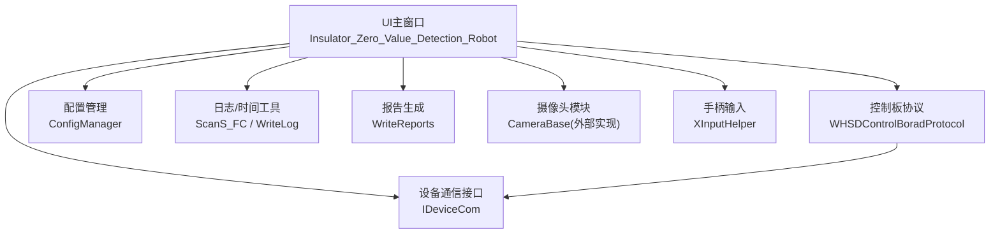
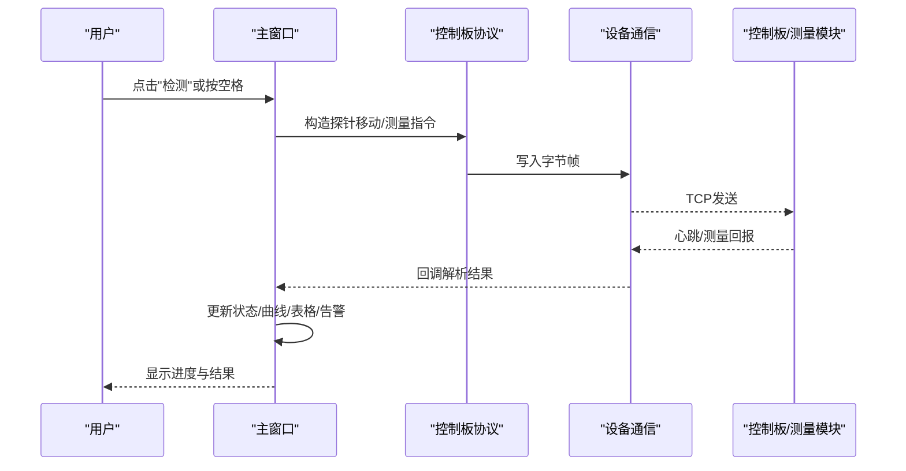
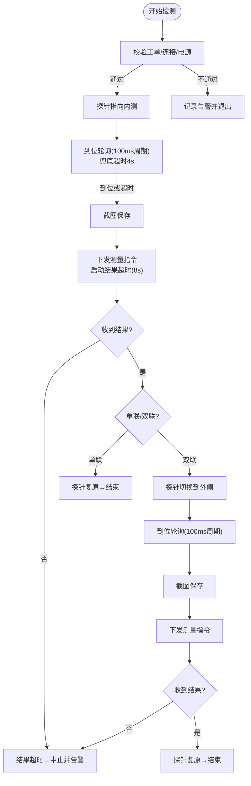
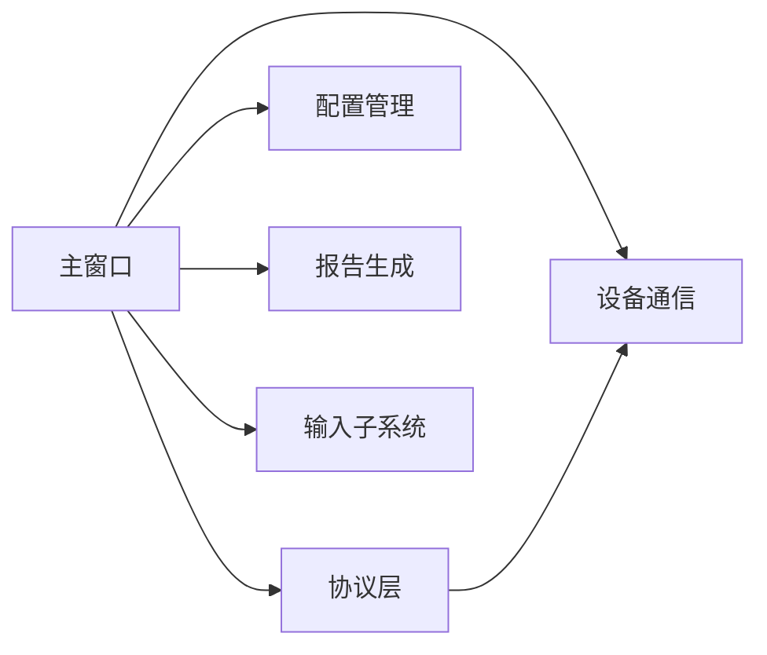

# 检测工作流程

<cite>
**本文引用的文件**
- [README.md](file://README.md)
- [操作说明书.md](file://操作说明书.md)
- [Insulator_Zero_Value_Detection_Robot.h](file://Insulator_Zero_Value_Detection_Robot/UI/Insulator_Zero_Value_Detection_Robot.h)
- [Insulator_Zero_Value_Detection_Robot.cpp](file://Insulator_Zero_Value_Detection_Robot/UI/Insulator_Zero_Value_Detection_Robot.cpp)
- [ConfigManager.h](file://Insulator_Zero_Value_Detection_Robot/Config/ConfigManager.h)
- [WHSDControlBoradProtocol.h](file://Insulator_Zero_Value_Detection_Robot/Protocol/WHSDControlBoradProtocol.h)
- [IDeviceCom.h](file://Insulator_Zero_Value_Detection_Robot/DeviceCom/IDeviceCom.h)
- [WriteReports.h](file://Insulator_Zero_Value_Detection_Robot/Report/WriteReports.h)
- [XInputHelper.h](file://Insulator_Zero_Value_Detection_Robot/Tools/XInputHelper.h)
</cite>

## 更新摘要
**所做更改**
- 更新了测量流程时序参数配置章节，详细说明新增的可配置定时机制
- 增强了检测流程状态机与关键时序部分，包含精确的轮询周期和超时处理
- 完善了性能与可靠性考虑章节，突出新的定时机制优势
- 更新了故障排查指南，包含新的超时处理逻辑说明

## 目录
1. [简介](#简介)
2. [项目结构](#项目结构)
3. [核心组件](#核心组件)
4. [架构总览](#架构总览)
5. [详细组件分析](#详细组件分析)
6. [依赖关系分析](#依赖关系分析)
7. [性能与可靠性考虑](#性能与可靠性考虑)
8. [故障排查指南](#故障排查指南)
9. [结论](#结论)
10. [附录：常见场景操作指南](#附录：常见场景操作指南)

## 简介
本文件面向绝缘子零值检测机器人V2的上位机软件，提供从启动检测到完成报告的完整工作流程说明。内容涵盖设备连接、参数配置、检测执行、数据记录、状态反馈、异常处理以及批量检测、复检、紧急停止等常见场景的操作要点与安全提示，帮助用户安全、规范地完成检测任务。

**更新** 本次更新重点增强了测量工作流的定时机制，包括可配置的探针到位轮询间隔、智能超时处理和改进的状态管理，确保检测过程更加稳定和高效。

## 项目结构
本项目采用分层模块化组织：
- UI层：主窗口、工单/报告对话框、数据展示控件
- 协议层：控制板通信协议封装（含心跳、传感器命令、校准命令）
- 设备通信层：抽象的串口/TCP通信接口
- 配置管理：控制板、相机、工单、报告等配置读写
- 日志与工具：时间、转换、手柄输入等通用能力
- 报告生成：基于模板的docx报告填充

图表来源
- [Insulator_Zero_Value_Detection_Robot.h:26-22](file://Insulator_Zero_Value_Detection_Robot/UI/Insulator_Zero_Value_Detection_Robot.h#L26-L22)
- [WHSDControlBoradProtocol.h:189-216](file://Insulator_Zero_Value_Detection_Robot/Protocol/WHSDControlBoradProtocol.h#L189-L216)
- [IDeviceCom.h:4-15](file://Insulator_Zero_Value_Detection_Robot/DeviceCom/IDeviceCom.h#L4-L15)
- [ConfigManager.h:185-194](file://Insulator_Zero_Value_Detection_Robot/Config/ConfigManager.h#L185-L194)
- [WriteReports.h:24-55](file://Insulator_Zero_Value_Detection_Robot/Report/WriteReports.h#L24-L55)

章节来源
- [README.md:1-3](file://README.md#L1-L3)
- [操作说明书.md:27-38](file://操作说明书.md#L27-L38)

## 核心组件
- 主窗口与流程编排：负责界面交互、测量流程状态机、定时器轮询、弹窗提示、告警记录、数据持久化
- 控制板协议：封装传感器测量命令、电机/舵机控制、心跳解析、校准命令应答
- 设备通信：统一写数据、注册回调、连接状态上报
- 配置管理：保存探针角度、速度、IP、阈值、工单与报告信息
- 报告生成：按模板填充检测信息与测量数据表
- 输入与外设：手柄按键映射、摄像头取流与录像

**更新** 新增了精密的定时管理机制，包括探针到位轮询定时器（100ms周期）、测量结果超时定时器（8秒）和智能超时保护机制。

章节来源
- [Insulator_Zero_Value_Detection_Robot.h:26-22](file://Insulator_Zero_Value_Detection_Robot/UI/Insulator_Zero_Value_Detection_Robot.h#L26-L22)
- [WHSD_ControlBoradProtocol.h:189-216](file://Insulator_Zero_Value_Detection_Robot/Protocol/WHSDControlBoradProtocol.h#L189-L216)
- [IDeviceCom.h:4-15](file://Insulator_Zero_Value_Detection_Robot/DeviceCom/IDeviceCom.h#L4-L15)
- [ConfigManager.h:10-37](file://Insulator_Zero_Value_Detection_Robot/Config/ConfigManager.h#L10-L37)
- [WriteReports.h:24-55](file://Insulator_Zero_Value_Detection_Robot/Report/WriteReports.h#L24-L55)
- [XInputHelper.h:5-47](file://Insulator_Zero_Value_Detection_Robot/Tools/XInputHelper.h#L5-L47)

## 架构总览
上位机通过UI触发检测动作，调用协议层构造指令，经设备通信层下发至控制板；控制板驱动行走电机与探针舵机，并返回测量结果与心跳。UI维护测量流程状态机，结合到位轮询与结果超时机制保证鲁棒性。

**更新** 新的架构包含了三层定时保护：探针到位轮询（100ms周期）、探针到位兜底超时（4秒）和测量结果超时（8秒），形成完整的容错机制。

图表来源
- [Insulator_Zero_Value_Detection_Robot.cpp:2030-2071](file://Insulator_Zero_Value_Detection_Robot/UI/Insulator_Zero_Value_Detection_Robot.cpp#L2030-L2071)
- [Insulator_Zero_Value_Detection_Robot.cpp:2073-2139](file://Insulator_Zero_Value_Detection_Robot/UI/Insulator_Zero_Value_Detection_Robot.cpp#L2073-L2139)
- [WHSDControlBoradProtocol.h:220-254](file://Insulator_Zero_Value_Detection_Robot/Protocol/WHSDControlBoradProtocol.h#L220-L254)
- [IDeviceCom.h:9-14](file://Insulator_Zero_Value_Detection_Robot/DeviceCom/IDeviceCom.h#L9-L14)

## 详细组件分析

### 检测流程状态机与关键时序
**更新** 新的检测流程采用了三层定时保护机制：

- **开始检测**：校验已加载工单、控制板连接与电源状态，进入等待弹窗
- **内测阶段**：探针移动到内测角度，以100ms周期轮询到位信号，4秒兜底超时后截图并下发测量指令，启动8秒结果超时计时
- **结果处理**：收到内测结果后，单联直接复原结束；双联切换到外侧继续第二次测量
- **外侧阶段**：重复到位轮询→截图→测量→结果处理→复原结束
- **异常保护**：轮询期间若断连或确认关电，立即中止并告警；结果超时自动中止并告警

**更新** 关键时序参数：
- 探针到位轮询周期：100ms（PROBE_ARRIVE_POLL_MS）
- 探针到位兜底超时：4000ms（PROBE_ARRIVE_TIMEOUT_MS）
- 测量结果超时：8000ms（MEASURE_RESULT_TIMEOUT_MS）

图表来源
- [Insulator_Zero_Value_Detection_Robot.cpp:2030-2071](file://Insulator_Zero_Value_Detection_Robot/UI/Insulator_Zero_Value_Detection_Robot.cpp#L2030-L2071)
- [Insulator_Zero_Value_Detection_Robot.cpp:2073-2139](file://Insulator_Zero_Value_Detection_Robot/UI/Insulator_Zero_Value_Detection_Robot.cpp#L2073-L2139)
- [Insulator_Zero_Value_Detection_Robot.cpp:2186-2233](file://Insulator_Zero_Value_Detection_Robot/UI/Insulator_Zero_Value_Detection_Robot.cpp#L2186-L2233)

章节来源
- [Insulator_Zero_Value_Detection_Robot.cpp:2030-2071](file://Insulator_Zero_Value_Detection_Robot/UI/Insulator_Zero_Value_Detection_Robot.cpp#L2030-L2071)
- [Insulator_Zero_Value_Detection_Robot.cpp:2073-2139](file://Insulator_Zero_Value_Detection_Robot/UI/Insulator_Zero_Value_Detection_Robot.cpp#L2073-L2139)
- [Insulator_Zero_Value_Detection_Robot.cpp:2186-2233](file://Insulator_Zero_Value_Detection_Robot/UI/Insulator_Zero_Value_Detection_Robot.cpp#L2186-L2233)

### 设备连接与参数配置
- 设备连接：通过设备通信接口建立与控制板的TCP连接，订阅连接状态回调；心跳线程持续上报设备状态（电池、电源、电机状态等）
- 参数配置：在系统设置中配置探针角度、行走/舵机速度、机器人IP、摄像头IP、绝缘阈值等，并持久化到配置文件
- 相机模式：新摄像头模式支持录像；旧SDK直显模式不支持录像

**更新** 新增了精密的定时参数配置，包括轮询周期、超时时间等关键时序参数的统一管理。

章节来源
- [IDeviceCom.h:4-15](file://Insulator_Zero_Value_Detection_Robot/DeviceCom/IDeviceCom.h#L4-L15)
- [WHSDControlBoradProtocol.h:121-187](file://Insulator_Zero_Value_Detection_Robot/Protocol/WHSDControlBoradProtocol.h#L121-L187)
- [ConfigManager.h:10-37](file://Insulator_Zero_Value_Detection_Robot/Config/ConfigManager.h#L10-L37)
- [操作说明书.md:320-340](file://操作说明书.md#L320-L340)

### 检测执行与数据记录
- 检测执行：选择号侧与相别后点击检测，软件自动完成探针定位、测量、结果回填与曲线刷新
- 数据记录：测量值以JSON结构保存在当前工单中，实时写入配置；同时可在界面查看串状态与曲线
- 截图/录像：到位后自动截图；支持手动截图与录像（新摄像头模式）

**更新** 检测执行过程现在包含智能的超时保护机制，确保在任何异常情况下的稳定运行。

章节来源
- [Insulator_Zero_Value_Detection_Robot.cpp:2030-2071](file://Insulator_Zero_Value_Detection_Robot/UI/Insulator_Zero_Value_Detection_Robot.cpp#L2030-L2071)
- [Insulator_Zero_Value_Detection_Robot.cpp:1656-1700](file://Insulator_Zero_Value_Detection_Robot/UI/Insulator_Zero_Value_Detection_Robot.cpp#L1656-L1700)
- [操作说明书.md:184-199](file://操作说明书.md#L184-L199)

### 报告生成
- 报告生成：基于模板docx，将工单信息与测量数据表填充为最终报告；若已存在报告可覆盖生成
- 数据表填充：根据侧别与相别组织测量数组，自适应行数生成表格

章节来源
- [WriteReports.h:24-55](file://Insulator_Zero_Value_Detection_Robot/Report/WriteReports.h#L24-L55)
- [Insulator_Zero_Value_Detection_Robot.cpp:1838-1873](file://Insulator_Zero_Value_Detection_Robot/UI/Insulator_Zero_Value_Detection_Robot.cpp#L1838-L1873)
- [操作说明书.md:310-316](file://操作说明书.md#L310-L316)

### 输入与操控（键盘/手柄）
- 键盘快捷：Q/E/R分别控制探针内/外/复原；A/D或方向键控制行走向左/右；S停止；空格开始检测
- 手柄支持：读取手柄状态，映射到相同动作，便于现场操作

章节来源
- [Insulator_Zero_Value_Detection_Robot.cpp:2308-2418](file://Insulator_Zero_Value_Detection_Robot/UI/Insulator_Zero_Value_Detection_Robot.cpp#L2308-L2418)
- [XInputHelper.h:5-47](file://Insulator_Zero_Value_Detection_Robot/Tools/XInputHelper.h#L5-L47)

## 依赖关系分析
- 主窗口依赖协议层进行指令构造与回调接收，依赖设备通信层进行数据收发
- 配置管理贯穿参数设置、工单与报告信息的读写
- 报告生成依赖模板与测量数据组织
- 输入子系统提供键盘与手柄事件，提升操作效率

**更新** 新的定时机制依赖于QTimer类库，实现了高精度的轮询控制和超时管理。

图表来源
- [Insulator_Zero_Value_Detection_Robot.h:26-22](file://Insulator_Zero_Value_Detection_Robot/UI/Insulator_Zero_Value_Detection_Robot.h#L26-L22)
- [WHSDControlBoradProtocol.h:189-216](file://Insulator_Zero_Value_Detection_Robot/Protocol/WHSDControlBoradProtocol.h#L189-L216)
- [IDeviceCom.h:4-15](file://Insulator_Zero_Value_Detection_Robot/DeviceCom/IDeviceCom.h#L4-L15)
- [ConfigManager.h:185-194](file://Insulator_Zero_Value_Detection_Robot/Config/ConfigManager.h#L185-L194)
- [WriteReports.h:24-55](file://Insulator_Zero_Value_Detection_Robot/Report/WriteReports.h#L24-L55)
- [XInputHelper.h:5-47](file://Insulator_Zero_Value_Detection_Robot/Tools/XInputHelper.h#L5-L47)

章节来源
- [Insulator_Zero_Value_Detection_Robot.h:26-22](file://Insulator_Zero_Value_Detection_Robot/UI/Insulator_Zero_Value_Detection_Robot.h#L26-L22)
- [WHSDControlBoradProtocol.h:189-216](file://Insulator_Zero_Value_Detection_Robot/Protocol/WHSDControlBoradProtocol.h#L189-L216)
- [IDeviceCom.h:4-15](file://Insulator_Zero_Value_Detection_Robot/DeviceCom/IDeviceCom.h#L4-L15)
- [ConfigManager.h:185-194](file://Insulator_Zero_Value_Detection_Robot/Config/ConfigManager.h#L185-L194)
- [WriteReports.h:24-55](file://Insulator_Zero_Value_Detection_Robot/Report/WriteReports.h#L24-L55)
- [XInputHelper.h:5-47](file://Insulator_Zero_Value_Detection_Robot/Tools/XInputHelper.h#L5-L47)

## 性能与可靠性考虑
**更新** 新的定时机制显著提升了系统的性能和可靠性：

- **高精度轮询**：探针到位轮询周期缩短至100ms，大幅减少等待延迟，提高响应速度
- **智能超时保护**：4秒探针到位兜底超时和8秒测量结果超时，防止系统卡死和无响应
- **双重触发机制**：支持到位信号即时触发和超时兜底触发，兼顾效率和稳定性
- **资源管理优化**：定时器按需创建和销毁，避免内存泄漏和资源浪费
- **线程安全设计**：使用原子变量管理到位标志，确保多线程环境下的数据一致性
- **测量期间防护**：测量过程中禁用相关按钮，避免误触重入导致的冲突

**更新** 新增的性能优化特性：
- 原子操作的到位标志位（std::atomic<bool> m_bProbeArrived）
- 智能的定时器生命周期管理
- 统一的异常处理机制，确保所有异常路径都能正确恢复系统状态

章节来源
- [Insulator_Zero_Value_Detection_Robot.cpp:67-73](file://Insulator_Zero_Value_Detection_Robot/UI/Insulator_Zero_Value_Detection_Robot.cpp#L67-L73)
- [Insulator_Zero_Value_Detection_Robot.cpp:2131-2139](file://Insulator_Zero_Value_Detection_Robot/UI/Insulator_Zero_Value_Detection_Robot.cpp#L2131-L2139)
- [Insulator_Zero_Value_Detection_Robot.cpp:2235-2249](file://Insulator_Zero_Value_Detection_Robot/UI/Insulator_Zero_Value_Detection_Robot.cpp#L2235-L2249)
- [Insulator_Zero_Value_Detection_Robot.cpp:1533-1553](file://Insulator_Zero_Value_Detection_Robot/UI/Insulator_Zero_Value_Detection_Robot.cpp#L1533-L1553)
- [Insulator_Zero_Value_Detection_Robot.cpp:1656-1700](file://Insulator_Zero_Value_Detection_Robot/UI/Insulator_Zero_Value_Detection_Robot.cpp#L1656-L1700)

## 故障排查指南
**更新** 新增针对定时机制的故障排查指导：

- **无法开始检测**：检查是否已加载工单、控制板是否连接、总电源是否开启；若未连接或电源关闭会弹出提示并记录告警
- **测量等待窗长时间不动**：检查探针是否到位、网络是否稳定；若断连或关电会自动中止并告警。**新增**：如果超过4秒仍无响应，可能是探针机械故障或通信异常
- **测量无结果**：结果超时将自动中止并告警；可尝试重新检测或检查测量模块状态。**新增**：8秒超时表明检测模块可能无响应，需检查硬件连接
- **录像失败**：确认使用新摄像头模式；否则提示不支持录像
- **报告生成失败**：确认已加载工单且存在测量数据；如已存在报告可覆盖生成
- **频繁超时错误**：**新增**：如果频繁出现探针到位超时（4秒）或测量结果超时（8秒），检查网络连接稳定性和控制板供电情况

**更新** 新增的定时相关故障处理：
- 定时器异常：检查系统时间是否正确，定时器是否正常创建
- 轮询卡顿：检查是否有其他高优先级任务占用CPU资源
- 内存泄漏：监控定时器对象的创建和销毁是否匹配

章节来源
- [Insulator_Zero_Value_Detection_Robot.cpp:2030-2071](file://Insulator_Zero_Value_Detection_Robot/UI/Insulator_Zero_Value_Detection_Robot.cpp#L2030-L2071)
- [Insulator_Zero_Value_Detection_Robot.cpp:2141-2178](file://Insulator_Zero_Value_Detection_Robot/UI/Insulator_Zero_Value_Detection_Robot.cpp#L2141-L2178)
- [Insulator_Zero_Value_Detection_Robot.cpp:1656-1700](file://Insulator_Zero_Value_Detection_Robot/UI/Insulator_Zero_Value_Detection_Robot.cpp#L1656-L1700)
- [Insulator_Zero_Value_Detection_Robot.cpp:1838-1873](file://Insulator_Zero_Value_Detection_Robot/UI/Insulator_Zero_Value_Detection_Robot.cpp#L1838-L1873)

## 结论
本工作流程通过严谨的状态机与超时保护，确保检测过程稳定可靠；配合直观的界面反馈与完善的日志告警，帮助用户高效完成批量检测、复检与报告生成。遵循本文档的安全提示与操作步骤，可最大程度降低误操作风险，保障设备与人员安全。

**更新** 新的定时机制进一步提升了系统的稳定性和响应速度，100ms的高精度轮询和多层超时保护确保了在各种工况下的可靠运行。

## 附录：常见场景操作指南

### 标准单次检测
- 步骤：加载工单→选择号侧与相别→点击"检测"或按空格→等待弹窗提示→结果回填→结束
- 注意：测量进行中按钮被禁用，不可关闭等待弹窗。**新增**：整个检测过程约4-12秒，包括探针定位、测量和数据上传时间

章节来源
- [操作说明书.md:184-199](file://操作说明书.md#L184-L199)
- [Insulator_Zero_Value_Detection_Robot.cpp:2030-2071](file://Insulator_Zero_Value_Detection_Robot/UI/Insulator_Zero_Value_Detection_Robot.cpp#L2030-L2071)

### 批量检测
- 建议：按"号侧 + 相别"顺序依次检测，每片完成后自动推进；双联工单自动完成内/外侧两次测量
- 监控：关注串状态颜色变化（绿=合格，红=异常）与曲线更新。**新增**：批量检测时系统会自动处理每个样本的超时保护，确保整体流程的稳定性

章节来源
- [操作说明书.md:167-182](file://操作说明书.md#L167-L182)
- [Insulator_Zero_Value_Detection_Robot.cpp:2186-2233](file://Insulator_Zero_Value_Detection_Robot/UI/Insulator_Zero_Value_Detection_Robot.cpp#L2186-L2233)

### 复检流程
- 步骤：选择目标相别→点击"复检"→删除最近一次测量值→重新执行测量流程→回填结果
- 适用：某片结果可疑需重测时

章节来源
- [操作说明书.md:204-210](file://操作说明书.md#L204-L210)
- [Insulator_Zero_Value_Detection_Robot.cpp:2420-2427](file://Insulator_Zero_Value_Detection_Robot/UI/Insulator_Zero_Value_Detection_Robot.cpp#L2420-L2427)

### 紧急停止
- 方式：按下"停止"或按S键停止行走；若遇异常，等待弹窗会在超时或断连时自动中止并告警
- 复位：异常结束后探针自动复原，按钮恢复可用

章节来源
- [Insulator_Zero_Value_Detection_Robot.cpp:2308-2418](file://Insulator_Zero_Value_Detection_Robot/UI/Insulator_Zero_Value_Detection_Robot.cpp#L2308-L2418)
- [Insulator_Zero_Value_Detection_Robot.cpp:2151-2178](file://Insulator_Zero_Value_Detection_Robot/UI/Insulator_Zero_Value_Detection_Robot.cpp#L2151-L2178)

### 报告生成与导出
- 步骤：加载工单→点击"检测报告"→填写报告信息→确认生成（可覆盖旧报告）
- 输出：基于模板生成docx报告，包含检测信息与测量数据表

章节来源
- [操作说明书.md:310-316](file://操作说明书.md#L310-L316)
- [Insulator_Zero_Value_Detection_Robot.cpp:1838-1873](file://Insulator_Zero_Value_Detection_Robot/UI/Insulator_Zero_Value_Detection_Robot.cpp#L1838-L1873)
- [WriteReports.h:24-55](file://Insulator_Zero_Value_Detection_Robot/Report/WriteReports.h#L24-L55)

### 安全提示
- 开始前确认控制板与摄像头已上电并网络连通
- 检测过程中勿强行关闭总电源；如需关机请先结束测量流程
- 录像功能仅在新摄像头模式下可用
- 出现异常时优先查看告警与日志，必要时重启软件刷新摄像头
- **新增**：如遇连续超时错误，检查网络连接和控制板供电，必要时重启设备进行故障排除

章节来源
- [操作说明书.md:42-64](file://操作说明书.md#L42-L64)
- [操作说明书.md:146-160](file://操作说明书.md#L146-L160)
- [Insulator_Zero_Value_Detection_Robot.cpp:1656-1700](file://Insulator_Zero_Value_Detection_Robot/UI/Insulator_Zero_Value_Detection_Robot.cpp#L1656-L1700)