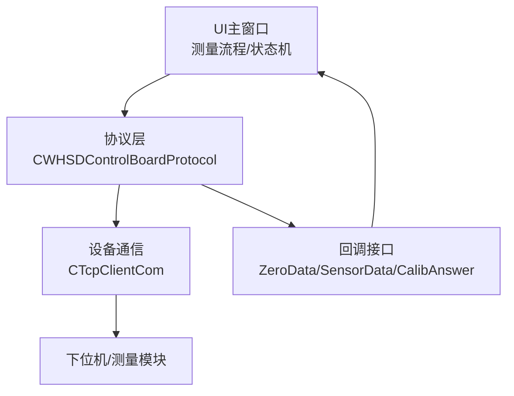
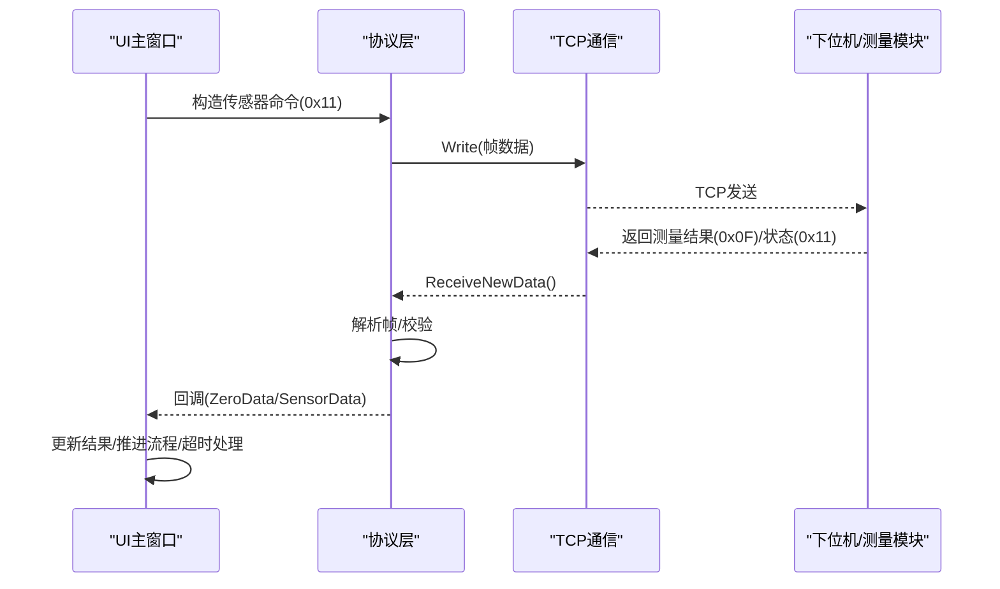
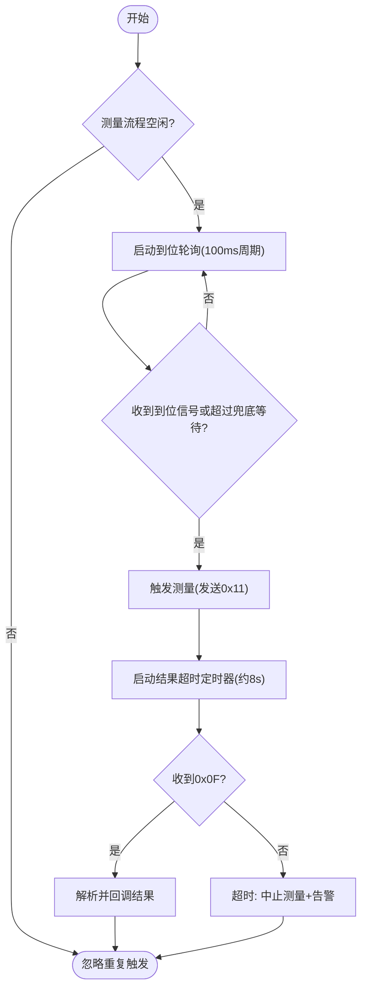
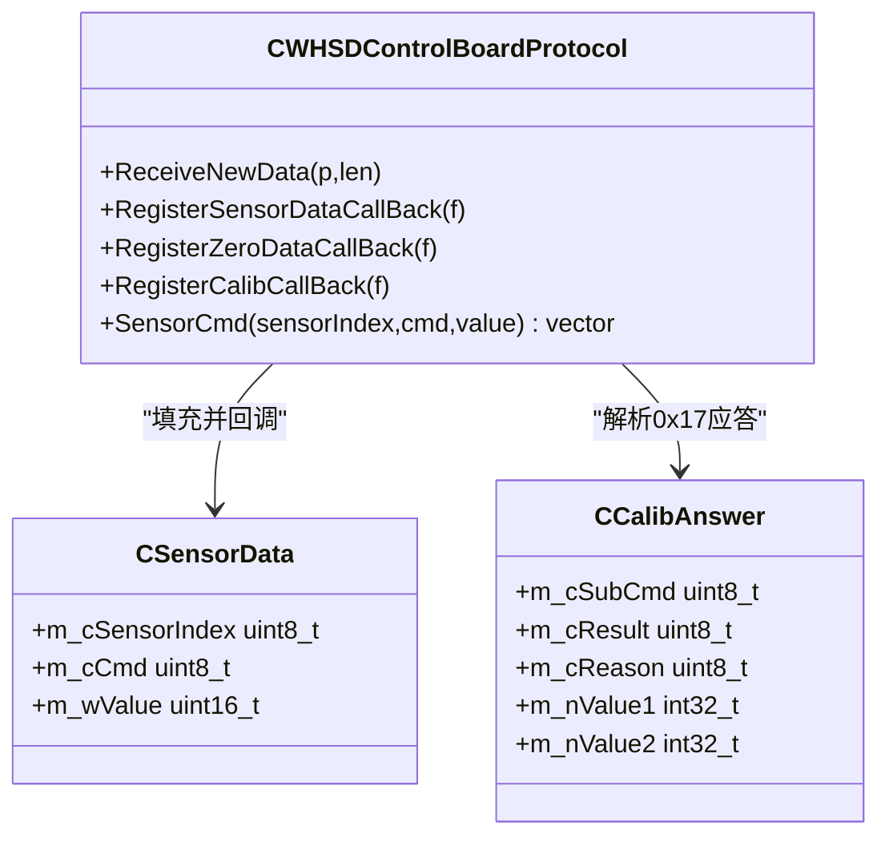
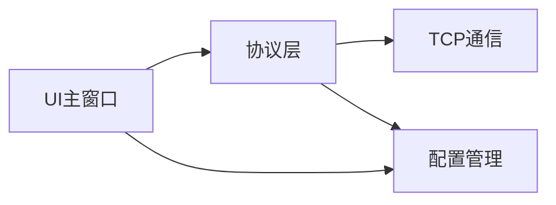

# 传感器数据采集

<cite>
**本文引用的文件**
- [main.cpp](file://Insulator_Zero_Value_Detection_Robot/main.cpp)
- [WHSDControlBoradProtocol.h](file://Insulator_Zero_Value_Detection_Robot/Protocol/WHSDControlBoradProtocol.h)
- [WHSDControlBoradProtocol.cpp](file://Insulator_Zero_Value_Detection_Robot/Protocol/WHSDControlBoradProtocol.cpp)
- [TcpClient.h](file://Insulator_Zero_Value_Detection_Robot/DeviceCom/TcpClient.h)
- [Insulator_Zero_Value_Detection_Robot.h](file://Insulator_Zero_Value_Detection_Robot/UI/Insulator_Zero_Value_Detection_Robot.h)
- [Insulator_Zero_Value_Detection_Robot.cpp](file://Insulator_Zero_Value_Detection_Robot/UI/Insulator_Zero_Value_Detection_Robot.cpp)
- [ConfigManager.cpp](file://Insulator_Zero_Value_Detection_Robot/Config/ConfigManager.cpp)
- [单点定标协议与流程_V1.0.html](file://Insulator_Zero_Value_Detection_Robot/单点定标协议与流程_V1.0.html)
- [device_simulator.py](file://Simulator/device_simulator.py)
</cite>

## 目录
1. [简介](#简介)
2. [项目结构](#项目结构)
3. [核心组件](#核心组件)
4. [架构总览](#架构总览)
5. [详细组件分析](#详细组件分析)
6. [依赖关系分析](#依赖关系分析)
7. [性能考虑](#性能考虑)
8. [故障诊断指南](#故障诊断指南)
9. [结论](#结论)
10. [附录](#附录)

## 简介
本文件面向绝缘子零值检测机器人，聚焦“传感器数据采集”的完整实现：从测量触发、数据获取、格式解析到质量控制、时序控制、实时处理与性能调优。系统通过上位机UI发起测量指令，经由通信层下发至控制板/测量模块；下位机完成测量后以协议帧上报结果（主要为阻抗/电阻值），由协议层解析并回调至上位机进行记录、展示与后续处理。

## 项目结构
- UI层：负责用户交互、测量流程状态机、定时器控制、结果展示与告警。
- 协议层：封装控制板通信协议，负责帧组装/解析、心跳、校准命令、传感器数据回调。
- 设备通信层：TCP客户端抽象，提供读写、连接状态回调与收发线程。
- 配置层：加载XML配置（如心跳周期、角度阈值等）。
- 模拟器：用于联调测试，模拟下位机行为（心跳、测量结果、传感器状态等）。

图表来源
- [Insulator_Zero_Value_Detection_Robot.cpp:67-73](file://Insulator_Zero_Value_Detection_Robot/UI/Insulator_Zero_Value_Detection_Robot.cpp#L67-L73)
- [WHSDControlBoradProtocol.h:189-216](file://Insulator_Zero_Value_Detection_Robot/Protocol/WHSDControlBoradProtocol.h#L189-L216)
- [TcpClient.h:8-46](file://Insulator_Zero_Value_Detection_Robot/DeviceCom/TcpClient.h#L8-L46)

章节来源
- [Insulator_Zero_Value_Detection_Robot.cpp:67-73](file://Insulator_Zero_Value_Detection_Robot/UI/Insulator_Zero_Value_Detection_Robot.cpp#L67-L73)
- [WHSDControlBoradProtocol.h:189-216](file://Insulator_Zero_Value_Detection_Robot/Protocol/WHSDControlBoradProtocol.h#L189-L216)
- [TcpClient.h:8-46](file://Insulator_Zero_Value_Detection_Robot/DeviceCom/TcpClient.h#L8-L46)

## 核心组件
- 协议层（CWHSDControlBoardProtocol）
  - 负责帧缓冲、解析、心跳循环、校准命令、传感器数据回调注册与分发。
  - 关键数据结构：CSensorData（传感器索引/命令/值）、CCalibAnswer（校准应答）。
- 设备通信层（CTcpClientCom）
  - 基于TCP的连接、发送队列、接收线程、连接状态回调。
- UI主窗口（Insulator_Zero_Value_Detection_Robot）
  - 测量流程状态机：探针到位轮询、测量触发、结果超时处理、异常中止。
  - 定时参数：探针到位轮询周期、兜底等待时间、测量结果超时。
- 配置管理（ConfigManager）
  - 读取设备心跳周期、角度阈值、速度等运行参数。

章节来源
- [WHSDControlBoradProtocol.h:7-52](file://Insulator_Zero_Value_Detection_Robot/Protocol/WHSDControlBoradProtocol.h#L7-L52)
- [WHSDControlBoradProtocol.h:189-216](file://Insulator_Zero_Value_Detection_Robot/Protocol/WHSDControlBoradProtocol.h#L189-L216)
- [TcpClient.h:8-46](file://Insulator_Zero_Value_Detection_Robot/DeviceCom/TcpClient.h#L8-L46)
- [Insulator_Zero_Value_Detection_Robot.h:99-127](file://Insulator_Zero_Value_Detection_Robot/UI/Insulator_Zero_Value_Detection_Robot.h#L99-L127)
- [ConfigManager.cpp:43-118](file://Insulator_Zero_Value_Detection_Robot/Config/ConfigManager.cpp#L43-L118)

## 架构总览
整体采集链路如下：
- UI在合适时机（探针到位或兜底超时）发送测量指令（传感器命令）。
- 协议层将指令打包为协议帧并通过TCP发送。
- 下位机执行测量，完成后主动上报测量结果（0x0F）与传感器状态（0x11）。
- 协议层解析帧，调用注册的回调函数将数据推送到UI线程。
- UI根据当前测量步骤更新表格、曲线与告警，并处理超时与异常。

图表来源
- [Insulator_Zero_Value_Detection_Robot.cpp:2121-2139](file://Insulator_Zero_Value_Detection_Robot/UI/Insulator_Zero_Value_Detection_Robot.cpp#L2121-L2139)
- [WHSDControlBoradProtocol.cpp:213-215](file://Insulator_Zero_Value_Detection_Robot/Protocol/WHSDControlBoradProtocol.cpp#L213-L215)
- [WHSDControlBoradProtocol.cpp:360-390](file://Insulator_Zero_Value_Detection_Robot/Protocol/WHSDControlBoradProtocol.cpp#L360-L390)
- [device_simulator.py:391-414](file://Simulator/device_simulator.py#L391-L414)

## 详细组件分析

### 测量触发与时序控制
- 探针到位轮询：每100ms检查是否收到到位信号或已超过兜底等待时间（默认约4秒）。若满足条件则触发测量。
- 测量结果超时：发出测量指令后启动单次定时器（默认约8秒），未收到0x0F回报则判定失败并自动结束流程。
- 前置校验：控制板未连接或已确认总电源关闭时不进入流程，避免卡死等待。

图表来源
- [Insulator_Zero_Value_Detection_Robot.cpp:67-73](file://Insulator_Zero_Value_Detection_Robot/UI/Insulator_Zero_Value_Detection_Robot.cpp#L67-L73)
- [Insulator_Zero_Value_Detection_Robot.cpp:2121-2149](file://Insulator_Zero_Value_Detection_Robot/UI/Insulator_Zero_Value_Detection_Robot.cpp#L2121-L2149)

章节来源
- [Insulator_Zero_Value_Detection_Robot.cpp:67-73](file://Insulator_Zero_Value_Detection_Robot/UI/Insulator_Zero_Value_Detection_Robot.cpp#L67-L73)
- [Insulator_Zero_Value_Detection_Robot.cpp:2121-2149](file://Insulator_Zero_Value_Detection_Robot/UI/Insulator_Zero_Value_Detection_Robot.cpp#L2121-L2149)

### 数据获取与格式解析
- 传感器命令：通过静态方法构造传感器命令帧（含传感器索引、命令字、值）。
- 协议解析：接收新数据后加入缓冲区，按帧头/长度/校验/帧尾解析，识别命令字（如0x11传感器反馈、0x0F测量结果）。
- 回调分发：解析成功后填充CSensorData或校准应答结构，调用已注册的回调函数。

图表来源
- [WHSDControlBoradProtocol.h:7-52](file://Insulator_Zero_Value_Detection_Robot/Protocol/WHSDControlBoradProtocol.h#L7-L52)
- [WHSDControlBoradProtocol.h:189-216](file://Insulator_Zero_Value_Detection_Robot/Protocol/WHSDControlBoradProtocol.h#L189-L216)
- [WHSDControlBoradProtocol.cpp:360-406](file://Insulator_Zero_Value_Detection_Robot/Protocol/WHSDControlBoradProtocol.cpp#L360-L406)

章节来源
- [WHSDControlBoradProtocol.h:7-52](file://Insulator_Zero_Value_Detection_Robot/Protocol/WHSDControlBoradProtocol.h#L7-L52)
- [WHSDControlBoradProtocol.cpp:360-406](file://Insulator_Zero_Value_Detection_Robot/Protocol/WHSDControlBoradProtocol.cpp#L360-L406)

### 不同传感器类型的数据采集方式
- 电压/电流/阻抗测量：当前代码中传感器数据以CSensorData表示，包含传感器索引、命令字与数值字段。具体物理量（电压、电流、阻抗）由下位机定义与协议约定决定；上位机侧统一通过回调接收并处理。
- 校准与补偿：支持单点定标（0x17/0x0E），固件内部计算补偿系数并写入Flash，测量结果可输出修正值；也支持查询原始值与离线验证。

章节来源
- [WHSDControlBoradProtocol.h:18-52](file://Insulator_Zero_Value_Detection_Robot/Protocol/WHSDControlBoradProtocol.h#L18-L52)
- [单点定标协议与流程_V1.0.html:45-60](file://Insulator_Zero_Value_Detection_Robot/单点定标协议与流程_V1.0.html#L45-L60)
- [Insulator_Zero_Value_Detection_Robot.cpp:941-1147](file://Insulator_Zero_Value_Detection_Robot/UI/Insulator_Zero_Value_Detection_Robot.cpp#L941-L1147)

### 数据采集的时序控制
- 测量间隔与采样频率：由UI层的定时器与状态机控制。探针到位轮询周期固定（约100ms），测量结果超时固定（约8s）。实际采样频率取决于下位机测量耗时与响应时间（例如0x0F约3.2秒回报）。
- 数据同步机制：协议回调运行在协议线程，通过Qt信号槽将数据切到UI线程处理，确保界面安全与一致性。

章节来源
- [Insulator_Zero_Value_Detection_Robot.cpp:67-73](file://Insulator_Zero_Value_Detection_Robot/UI/Insulator_Zero_Value_Detection_Robot.cpp#L67-L73)
- [Insulator_Zero_Value_Detection_Robot.cpp:675-693](file://Insulator_Zero_Value_Detection_Robot/UI/Insulator_Zero_Value_Detection_Robot.cpp#L675-L693)

### 数据质量控制
- 噪声过滤：当前代码未实现软件侧滤波算法；可通过多次测量取平均（定标流程中连测3次取平均）降低随机误差。
- 异常值检测：通过超时与原因码判断异常（如0x01原始值超时、0x09参数非法等），并在UI层给出提示与告警。
- 数据验证：定标前后通过验证命令（0x17/0x0A）对比修正值与标准值，评估补偿效果。

章节来源
- [Insulator_Zero_Value_Detection_Robot.cpp:924-939](file://Insulator_Zero_Value_Detection_Robot/UI/Insulator_Zero_Value_Detection_Robot.cpp#L924-L939)
- [Insulator_Zero_Value_Detection_Robot.cpp:1064-1076](file://Insulator_Zero_Value_Detection_Robot/UI/Insulator_Zero_Value_Detection_Robot.cpp#L1064-L1076)
- [单点定标协议与流程_V1.0.html:140-148](file://Insulator_Zero_Value_Detection_Robot/单点定标协议与流程_V1.0.html#L140-L148)

### 实时数据处理流程
- 数据缓存与缓冲管理：协议层维护数据缓冲区，逐帧解析；TCP层使用发送队列与接收线程解耦收发。
- 内存优化策略：回调中使用局部变量与栈对象减少堆分配；录像帧缓存采用clone避免共享缓冲区问题，互斥锁保护跨线程访问。
- 性能要点：避免在协议回调中进行重计算或阻塞操作；UI更新通过信号槽异步进行。

章节来源
- [WHSDControlBoradProtocol.cpp:213-215](file://Insulator_Zero_Value_Detection_Robot/Protocol/WHSDControlBoradProtocol.cpp#L213-L215)
- [TcpClient.h:35-46](file://Insulator_Zero_Value_Detection_Robot/DeviceCom/TcpClient.h#L35-L46)
- [Insulator_Zero_Value_Detection_Robot.h:272-279](file://Insulator_Zero_Value_Detection_Robot/UI/Insulator_Zero_Value_Detection_Robot.h#L272-L279)

## 依赖关系分析
- UI依赖协议层提供的回调接口，用于接收测量结果与校准应答。
- 协议层依赖设备通信层进行TCP读写。
- 配置层为协议与UI提供运行时参数（如心跳周期、角度阈值等）。

图表来源
- [Insulator_Zero_Value_Detection_Robot.h:229-235](file://Insulator_Zero_Value_Detection_Robot/UI/Insulator_Zero_Value_Detection_Robot.h#L229-L235)
- [WHSDControlBoradProtocol.h:189-216](file://Insulator_Zero_Value_Detection_Robot/Protocol/WHSDControlBoradProtocol.h#L189-L216)
- [ConfigManager.cpp:43-118](file://Insulator_Zero_Value_Detection_Robot/Config/ConfigManager.cpp#L43-L118)

章节来源
- [Insulator_Zero_Value_Detection_Robot.h:229-235](file://Insulator_Zero_Value_Detection_Robot/UI/Insulator_Zero_Value_Detection_Robot.h#L229-L235)
- [WHSDControlBoradProtocol.h:189-216](file://Insulator_Zero_Value_Detection_Robot/Protocol/WHSDControlBoradProtocol.h#L189-L216)
- [ConfigManager.cpp:43-118](file://Insulator_Zero_Value_Detection_Robot/Config/ConfigManager.cpp#L43-L118)

## 性能考虑
- 定时器调优：探针到位轮询周期与测量结果超时可根据现场环境调整，平衡响应速度与资源占用。
- 回调轻量化：协议回调仅做最小必要处理，复杂逻辑移至UI线程。
- 网络I/O：TCP发送队列与接收线程分离，避免阻塞；合理设置超时与重试策略。
- 内存管理：避免频繁动态分配，复用对象；录像帧缓存使用clone与互斥锁保证线程安全。

[本节为通用指导，无需特定文件引用]

## 故障诊断指南
- 测量超时：检查控制板连接与总电源状态；确认探针到位信号或兜底等待是否生效；查看日志中的“测量流程:结果超时”。
- 校准失败：关注原因码（如0x01原始值超时、0x09参数非法），按提示重新触发检测或检查硬件接线。
- 传感器状态异常：通过0x11传感器反馈确认设备状态；必要时重启设备或复位通信。

章节来源
- [Insulator_Zero_Value_Detection_Robot.cpp:2141-2149](file://Insulator_Zero_Value_Detection_Robot/UI/Insulator_Zero_Value_Detection_Robot.cpp#L2141-L2149)
- [Insulator_Zero_Value_Detection_Robot.cpp:924-939](file://Insulator_Zero_Value_Detection_Robot/UI/Insulator_Zero_Value_Detection_Robot.cpp#L924-L939)
- [device_simulator.py:409-414](file://Simulator/device_simulator.py#L409-L414)

## 结论
本系统通过UI状态机、协议层解析与回调机制，实现了可靠的传感器数据采集流程。测量触发与时序控制清晰明确，数据质量控制通过超时与原因码保障基本健壮性。建议在实际部署中结合现场环境对定时器与采样频率进行调优，并引入更多软件侧滤波与异常检测算法以提升数据质量。

[本节为总结，无需特定文件引用]

## 附录
- 协议帧格式与校验规则参考《单点定标协议与流程 V1.0》。
- 模拟器可用于联调测试，模拟心跳、测量结果与传感器状态。

章节来源
- [单点定标协议与流程_V1.0.html:45-60](file://Insulator_Zero_Value_Detection_Robot/单点定标协议与流程_V1.0.html#L45-L60)
- [device_simulator.py:94-112](file://Simulator/device_simulator.py#L94-L112)