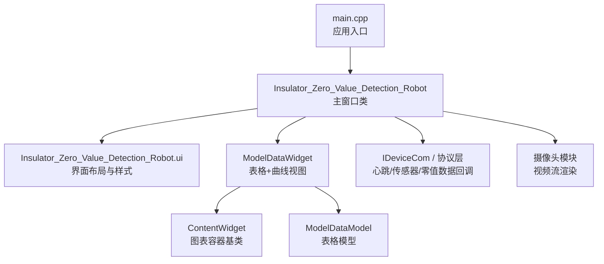
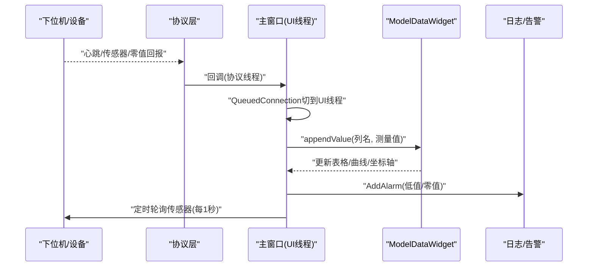
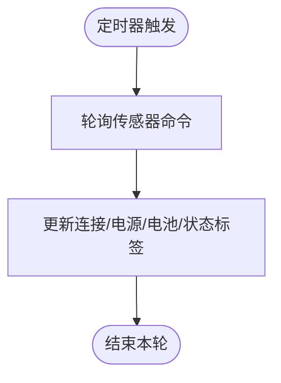
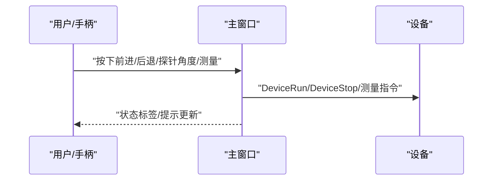
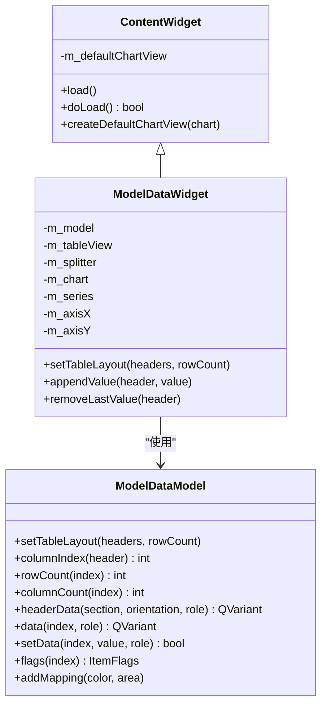
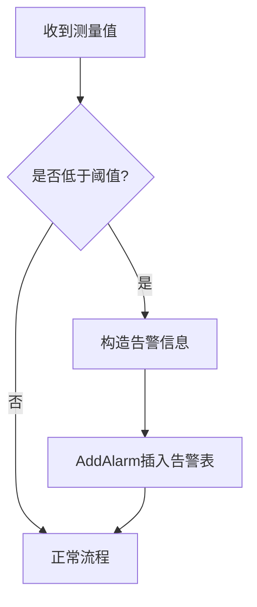
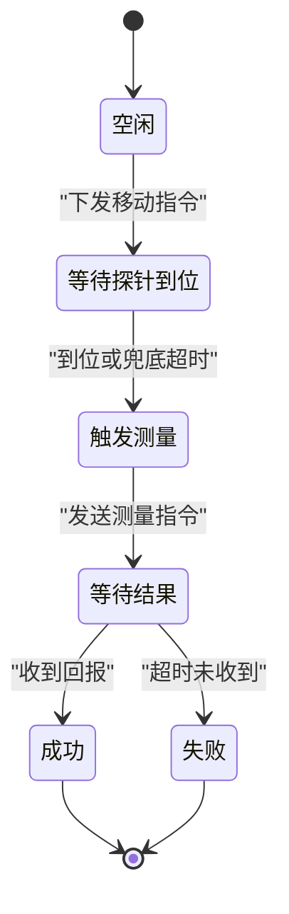
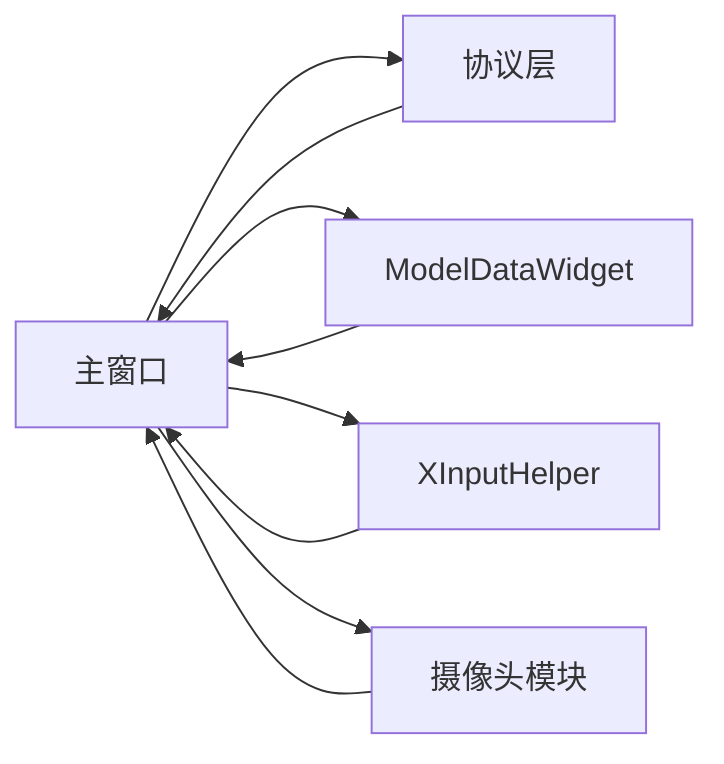

# 实时监控界面

<cite>
**本文引用的文件**
- [main.cpp](file://Insulator_Zero_Value_Detection_Robot/main.cpp)
- [Insulator_Zero_Value_Detection_Robot.h](file://Insulator_Zero_Value_Detection_Robot/UI/Insulator_Zero_Value_Detection_Robot.h)
- [Insulator_Zero_Value_Detection_Robot.cpp](file://Insulator_Zero_Value_Detection_Robot/UI/Insulator_Zero_Value_Detection_Robot.cpp)
- [Insulator_Zero_Value_Detection_Robot.ui](file://Insulator_Zero_Value_Detection_Robot/UI/Insulator_Zero_Value_Detection_Robot.ui)
- [contentwidget.h](file://Insulator_Zero_Value_Detection_Robot/UI/contentwidget.h)
- [contentwidget.cpp](file://Insulator_Zero_Value_Detection_Robot/UI/contentwidget.cpp)
- [modeldatawidget.h](file://Insulator_Zero_Value_Detection_Robot/UI/modeldatawidget.h)
- [modeldatawidget.cpp](file://Insulator_Zero_Value_Detection_Robot/UI/modeldatawidget.cpp)
- [modeldatamodel.h](file://Insulator_Zero_Value_Detection_Robot/UI/modeldatamodel.h)
- [modeldatamodel.cpp](file://Insulator_Zero_Value_Detection_Robot/UI/modeldatamodel.cpp)
</cite>

## 目录
1. [简介](#简介)
2. [项目结构](#项目结构)
3. [核心组件](#核心组件)
4. [架构总览](#架构总览)
5. [详细组件分析](#详细组件分析)
6. [依赖关系分析](#依赖关系分析)
7. [性能考虑](#性能考虑)
8. [故障排查指南](#故障排查指南)
9. [结论](#结论)
10. [附录](#附录)

## 简介
本文件面向“绝缘子零值检测机器人”的实时监控界面，聚焦以下目标：
- 实时数据显示：测量值更新、进度与等待提示、状态指示器（连接、电源、电池、设备状态等）的实现与刷新机制。
- 用户交互设计：操作按钮、参数设置、紧急停止、手柄/键盘控制等行为逻辑与布局说明。
- 数据可视化：实时曲线图、统计表格、报警提示的显示效果与联动。
- 界面响应优化：数据刷新频率、UI线程管理、资源占用控制策略。
- 界面定制：主题样式、布局调整、显示配置选项。
- 测试方法与体验优化建议：覆盖关键流程的验证与改进方向。

## 项目结构
监控界面基于Qt框架，采用主窗口+多标签页的布局方式，结合自定义图表控件实现数据可视化。整体入口在应用启动后创建主窗口并展示，随后初始化参数、绑定动作、建立通信与摄像头链路，并通过定时器周期性刷新状态与采集传感器数据。

**图示来源**
- [main.cpp:11-23](file://Insulator_Zero_Value_Detection_Robot/main.cpp#L11-L23)
- [Insulator_Zero_Value_Detection_Robot.h:26-385](file://Insulator_Zero_Value_Detection_Robot/UI/Insulator_Zero_Value_Detection_Robot.h#L26-L385)
- [Insulator_Zero_Value_Detection_Robot.ui:1-200](file://Insulator_Zero_Value_Detection_Robot/UI/Insulator_Zero_Value_Detection_Robot.ui#L1-L200)
- [modeldatawidget.h:20-49](file://Insulator_Zero_Value_Detection_Robot/UI/modeldatawidget.h#L20-L49)
- [contentwidget.h:12-32](file://Insulator_Zero_Value_Detection_Robot/UI/contentwidget.h#L12-L32)
- [modeldatamodel.h:12-39](file://Insulator_Zero_Value_Detection_Robot/UI/modeldatamodel.h#L12-L39)

**章节来源**
- [main.cpp:11-23](file://Insulator_Zero_Value_Detection_Robot/main.cpp#L11-L23)
- [Insulator_Zero_Value_Detection_Robot.cpp:88-95](file://Insulator_Zero_Value_Detection_Robot/UI/Insulator_Zero_Value_Detection_Robot.cpp#L88-L95)
- [Insulator_Zero_Value_Detection_Robot.ui:1-200](file://Insulator_Zero_Value_Detection_Robot/UI/Insulator_Zero_Value_Detection_Robot.ui#L1-L200)

## 核心组件
- 主窗口类：负责界面初始化、参数加载、动作绑定、通信注册、定时器驱动、测量流程状态机、告警面板、工单/报告管理等。
- 数据可视化组件：基于QChart/QTableView的ModelDataWidget，提供按列追加测量值、动态坐标轴范围、表格与曲线的联动显示。
- 图表容器基类：ContentWidget封装图表视图生命周期与错误提示。
- 表格模型：ModelDataModel维护二维数据、表头映射、背景色映射，支持编辑与重绘。
- 输入与控制：通过XInput手柄与键盘事件映射到设备控制指令；定时器轮询传感器状态。
- 通信与协议：IDeviceCom与WHSD控制板协议，接收心跳、传感器数据、零值测量结果，回调切回UI线程处理。

**章节来源**
- [Insulator_Zero_Value_Detection_Robot.h:26-385](file://Insulator_Zero_Value_Detection_Robot/UI/Insulator_Zero_Value_Detection_Robot.h#L26-L385)
- [Insulator_Zero_Value_Detection_Robot.cpp:317-405](file://Insulator_Zero_Value_Detection_Robot/UI/Insulator_Zero_Value_Detection_Robot.cpp#L317-L405)
- [modeldatawidget.cpp:24-69](file://Insulator_Zero_Value_Detection_Robot/UI/modeldatawidget.cpp#L24-L69)
- [modeldatamodel.cpp:20-38](file://Insulator_Zero_Value_Detection_Robot/UI/modeldatamodel.cpp#L20-L38)

## 架构总览
监控界面的数据流与控制流如下：
- 设备侧通过协议层上报心跳、传感器状态、零值测量结果；UI在定时器中主动轮询传感器数据。
- UI线程通过信号槽将协议线程的数据安全切换到UI线程进行界面更新。
- 测量结果进入ModelDataWidget，逐列追加数值并绘制曲线；同时触发阈值判断与告警。
- 用户通过按钮、下拉框、对话框、手柄/键盘输入控制设备行为与界面配置。

**图示来源**
- [Insulator_Zero_Value_Detection_Robot.cpp:413-559](file://Insulator_Zero_Value_Detection_Robot/UI/Insulator_Zero_Value_Detection_Robot.cpp#L413-L559)
- [Insulator_Zero_Value_Detection_Robot.cpp:675-767](file://Insulator_Zero_Value_Detection_Robot/UI/Insulator_Zero_Value_Detection_Robot.cpp#L675-L767)
- [modeldatawidget.cpp:139-166](file://Insulator_Zero_Value_Detection_Robot/UI/modeldatawidget.cpp#L139-L166)

## 详细组件分析

### 实时数据显示与刷新机制
- 状态指示器：连接状态、电源开关、电池电量、设备运行状态由定时器周期轮询传感器并更新标签文本。
- 测量值更新：收到零值测量结果后，通过QueuedConnection切到UI线程，调用ModelDataWidget.appendValue追加数据并绘制曲线；同时叠加临时提示标签显示当前检测结果。
- 进度与等待提示：测量流程使用模态等待弹窗与步骤标签，探针到位轮询与结果超时共同保障流程推进与异常兜底。

**图示来源**
- [Insulator_Zero_Value_Detection_Robot.cpp:413-559](file://Insulator_Zero_Value_Detection_Robot/UI/Insulator_Zero_Value_Detection_Robot.cpp#L413-L559)

**章节来源**
- [Insulator_Zero_Value_Detection_Robot.cpp:413-559](file://Insulator_Zero_Value_Detection_Robot/UI/Insulator_Zero_Value_Detection_Robot.cpp#L413-L559)
- [Insulator_Zero_Value_Detection_Robot.cpp:675-767](file://Insulator_Zero_Value_Detection_Robot/UI/Insulator_Zero_Value_Detection_Robot.cpp#L675-L767)

### 用户交互设计与控制逻辑
- 操作按钮：启停、截图、录屏、工单/报告管理、设置保存（探针角度、电机速度、舵机速度、IP、绝缘阈值）等，均在BindAction中完成信号槽绑定。
- 参数设置：通过输入框与下拉框读取配置，保存至配置文件；IP输入带正则校验。
- 紧急停止：手柄或键盘触发时发送停止指令；测量流程异常时自动中止并恢复探针位置、关闭等待窗、恢复按钮可用性。
- 手柄/键盘映射：On_timerInput_timeout与keyPressEvent/keyReleaseEvent将方向键、按键映射为设备控制指令。

**图示来源**
- [Insulator_Zero_Value_Detection_Robot.cpp:317-405](file://Insulator_Zero_Value_Detection_Robot/UI/Insulator_Zero_Value_Detection_Robot.cpp#L317-L405)
- [Insulator_Zero_Value_Detection_Robot.cpp:561-633](file://Insulator_Zero_Value_Detection_Robot/UI/Insulator_Zero_Value_Detection_Robot.cpp#L561-L633)

**章节来源**
- [Insulator_Zero_Value_Detection_Robot.cpp:317-405](file://Insulator_Zero_Value_Detection_Robot/UI/Insulator_Zero_Value_Detection_Robot.cpp#L317-L405)
- [Insulator_Zero_Value_Detection_Robot.cpp:561-633](file://Insulator_Zero_Value_Detection_Robot/UI/Insulator_Zero_Value_Detection_Robot.cpp#L561-L633)

### 数据可视化组件
- 表格与曲线联动：ModelDataWidget根据comboBox选择生成表头列，按片数生成行；每个测量值填充到对应列的空单元格，并在曲线图中追加点。
- 坐标轴自适应：首次值设定初始范围，后续随数据动态扩展Y轴范围，保证曲线可见性。
- 表格宽度自适应：根据表头文字宽度计算表格最小宽度，Splitter分配剩余空间给曲线图，避免布局冲突。

**图示来源**
- [contentwidget.h:12-32](file://Insulator_Zero_Value_Detection_Robot/UI/contentwidget.h#L12-L32)
- [modeldatawidget.h:20-49](file://Insulator_Zero_Value_Detection_Robot/UI/modeldatawidget.h#L20-L49)
- [modeldatamodel.h:12-39](file://Insulator_Zero_Value_Detection_Robot/UI/modeldatamodel.h#L12-L39)

**章节来源**
- [modeldatawidget.cpp:24-69](file://Insulator_Zero_Value_Detection_Robot/UI/modeldatawidget.cpp#L24-L69)
- [modeldatawidget.cpp:139-166](file://Insulator_Zero_Value_Detection_Robot/UI/modeldatawidget.cpp#L139-L166)
- [modeldatamodel.cpp:20-38](file://Insulator_Zero_Value_Detection_Robot/UI/modeldatamodel.cpp#L20-L38)

### 报警提示与阈值判定
- 当测量值低于配置的绝缘阈值时，记录一条“零值/低值”告警，包含位置与详情信息，插入告警表首行。
- 双联模式下，根据内侧/外侧序号定位具体片号，提升告警可读性。

**图示来源**
- [Insulator_Zero_Value_Detection_Robot.cpp:755-767](file://Insulator_Zero_Value_Detection_Robot/UI/Insulator_Zero_Value_Detection_Robot.cpp#L755-L767)

**章节来源**
- [Insulator_Zero_Value_Detection_Robot.cpp:755-767](file://Insulator_Zero_Value_Detection_Robot/UI/Insulator_Zero_Value_Detection_Robot.cpp#L755-L767)

### 测量流程状态机（进度条/等待提示）
- 探针到位轮询：周期检查到位信号或兜底超时，到达条件后触发一次测量。
- 结果超时：发出测量指令后启动单次超时定时器，未收到回报则判失败并自动结束流程。
- 异常中止：探针复原、关闭等待窗、恢复按钮、清理步骤并记录告警。

**图示来源**
- [Insulator_Zero_Value_Detection_Robot.h:188-197](file://Insulator_Zero_Value_Detection_Robot/UI/Insulator_Zero_Value_Detection_Robot.h#L188-L197)
- [Insulator_Zero_Value_Detection_Robot.cpp:67-73](file://Insulator_Zero_Value_Detection_Robot/UI/Insulator_Zero_Value_Detection_Robot.cpp#L67-L73)

**章节来源**
- [Insulator_Zero_Value_Detection_Robot.h:188-197](file://Insulator_Zero_Value_Detection_Robot/UI/Insulator_Zero_Value_Detection_Robot.h#L188-L197)
- [Insulator_Zero_Value_Detection_Robot.cpp:67-73](file://Insulator_Zero_Value_Detection_Robot/UI/Insulator_Zero_Value_Detection_Robot.cpp#L67-L73)

### 界面定制功能
- 主题样式：主窗口背景色、按钮选中态、分割条手柄样式、标签圆角与底色等在InitUI中设置。
- 布局调整：splitter初始比例设置、表格与曲线图的宽度自适应、最大化与无标题栏模式。
- 显示配置：探针角度、电机/舵机速度、设备与摄像头IP、绝缘阈值等可配置项，支持保存与校验。

**章节来源**
- [Insulator_Zero_Value_Detection_Robot.cpp:104-229](file://Insulator_Zero_Value_Detection_Robot/UI/Insulator_Zero_Value_Detection_Robot.cpp#L104-L229)
- [Insulator_Zero_Value_Detection_Robot.ui:16-26](file://Insulator_Zero_Value_Detection_Robot/UI/Insulator_Zero_Value_Detection_Robot.ui#L16-L26)

## 依赖关系分析
- 主窗口依赖：
  - 通信与协议：IDeviceCom、WHSD控制板协议，用于心跳、传感器、零值数据回调。
  - 可视化：ModelDataWidget、ContentWidget、ModelDataModel，用于表格与曲线展示。
  - 输入：XInputHelper，用于手柄状态捕获。
  - 摄像头：ICameraBase，用于视频流渲染。
- 数据流向：
  - 协议回调 → UI线程（QueuedConnection）→ 更新ModelDataWidget → 刷新曲线与表格。
  - 定时器 → 轮询传感器 → 更新状态标签。
  - 用户输入 → 设备控制指令 → 设备反馈 → 再次更新界面。

**图示来源**
- [Insulator_Zero_Value_Detection_Robot.h:26-385](file://Insulator_Zero_Value_Detection_Robot/UI/Insulator_Zero_Value_Detection_Robot.h#L26-L385)
- [Insulator_Zero_Value_Detection_Robot.cpp:231-315](file://Insulator_Zero_Value_Detection_Robot/UI/Insulator_Zero_Value_Detection_Robot.cpp#L231-L315)

**章节来源**
- [Insulator_Zero_Value_Detection_Robot.h:26-385](file://Insulator_Zero_Value_Detection_Robot/UI/Insulator_Zero_Value_Detection_Robot.h#L26-L385)
- [Insulator_Zero_Value_Detection_Robot.cpp:231-315](file://Insulator_Zero_Value_Detection_Robot/UI/Insulator_Zero_Value_Detection_Robot.cpp#L231-L315)

## 性能考虑
- 刷新频率：
  - 定时器间隔100ms，传感器轮询每1秒执行一次，平衡实时性与负载。
  - 输入事件定时器10ms，快速响应手柄按键。
- UI线程管理：
  - 协议回调通过QueuedConnection切到UI线程，避免跨线程直接操作UI导致崩溃。
  - 测量结果与告警更新均通过invokeMethod确保线程安全。
- 资源占用控制：
  - 曲线图动态扩展Y轴范围，减少重绘开销。
  - 表格宽度自适应与Splitter布局，避免频繁resize导致的卡顿。
  - 录像帧缓存使用互斥锁保护，避免多线程竞争。

**章节来源**
- [Insulator_Zero_Value_Detection_Robot.cpp:317-329](file://Insulator_Zero_Value_Detection_Robot/UI/Insulator_Zero_Value_Detection_Robot.cpp#L317-L329)
- [Insulator_Zero_Value_Detection_Robot.cpp:675-767](file://Insulator_Zero_Value_Detection_Robot/UI/Insulator_Zero_Value_Detection_Robot.cpp#L675-L767)
- [modeldatawidget.cpp:130-137](file://Insulator_Zero_Value_Detection_Robot/UI/modeldatawidget.cpp#L130-L137)

## 故障排查指南
- 连接状态异常：检查设备IP与端口配置，确认IDeviceCom连接回调状态变化。
- 传感器数据不更新：确认定时器是否启动、传感器命令是否正确下发、回调是否被注册。
- 测量结果不显示：检查QueuedConnection是否生效、ModelDataWidget列名匹配、曲线系列是否已添加。
- 告警不触发：核对绝缘阈值配置、测量值单位与阈值一致性、双联模式下片号计算逻辑。
- 界面卡顿：降低刷新频率、避免在高频回调中进行复杂计算、使用异步任务处理耗时操作。

**章节来源**
- [Insulator_Zero_Value_Detection_Robot.cpp:413-559](file://Insulator_Zero_Value_Detection_Robot/UI/Insulator_Zero_Value_Detection_Robot.cpp#L413-L559)
- [Insulator_Zero_Value_Detection_Robot.cpp:675-767](file://Insulator_Zero_Value_Detection_Robot/UI/Insulator_Zero_Value_Detection_Robot.cpp#L675-L767)

## 结论
该实时监控界面以Qt为核心，结合协议回调与定时器机制，实现了测量值的实时更新、状态指示、报警提示与数据可视化。通过线程安全的UI更新策略与自适应布局，保证了良好的用户体验与系统稳定性。未来可进一步优化刷新频率、增加更多可视化维度与主题切换能力，以提升操作效率与可视性。

## 附录
- 关键流程参考路径：
  - 应用入口与主窗口创建：[main.cpp:11-23](file://Insulator_Zero_Value_Detection_Robot/main.cpp#L11-L23)
  - 界面初始化与样式设置：[Insulator_Zero_Value_Detection_Robot.cpp:104-229](file://Insulator_Zero_Value_Detection_Robot/UI/Insulator_Zero_Value_Detection_Robot.cpp#L104-L229)
  - 动作绑定与定时器：[Insulator_Zero_Value_Detection_Robot.cpp:317-405](file://Insulator_Zero_Value_Detection_Robot/UI/Insulator_Zero_Value_Detection_Robot.cpp#L317-L405)
  - 状态轮询与更新：[Insulator_Zero_Value_Detection_Robot.cpp:413-559](file://Insulator_Zero_Value_Detection_Robot/UI/Insulator_Zero_Value_Detection_Robot.cpp#L413-L559)
  - 测量结果处理与可视化：[Insulator_Zero_Value_Detection_Robot.cpp:675-767](file://Insulator_Zero_Value_Detection_Robot/UI/Insulator_Zero_Value_Detection_Robot.cpp#L675-L767)
  - 数据可视化组件：[modeldatawidget.cpp:24-69](file://Insulator_Zero_Value_Detection_Robot/UI/modeldatawidget.cpp#L24-L69)、[modeldatawidget.cpp:139-166](file://Insulator_Zero_Value_Detection_Robot/UI/modeldatawidget.cpp#L139-L166)
  - 表格模型：[modeldatamodel.cpp:20-38](file://Insulator_Zero_Value_Detection_Robot/UI/modeldatamodel.cpp#L20-L38)