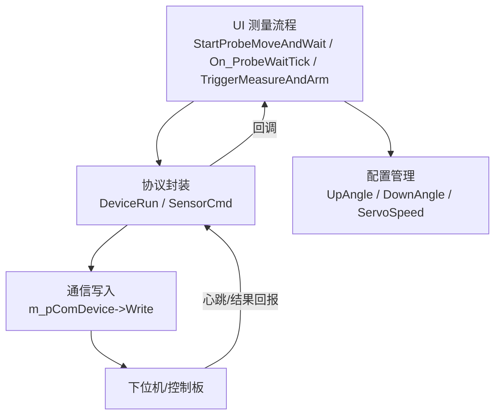
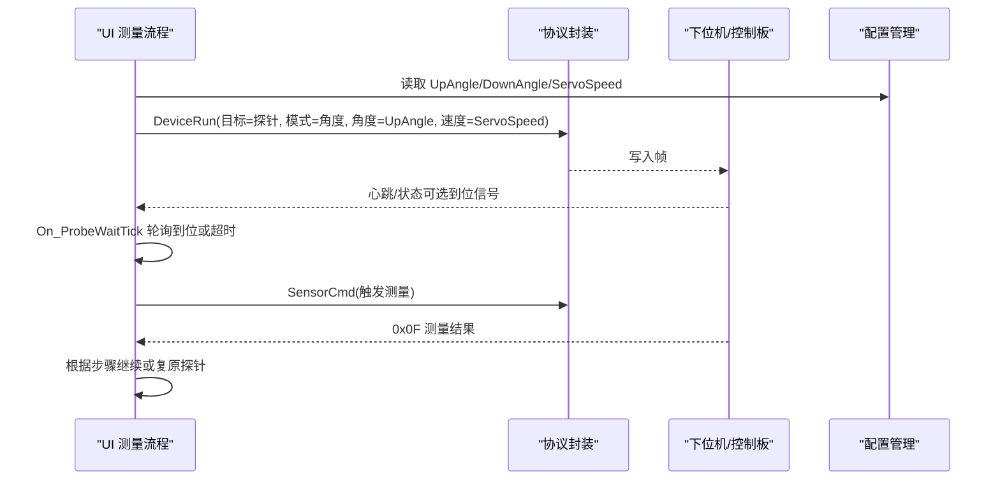
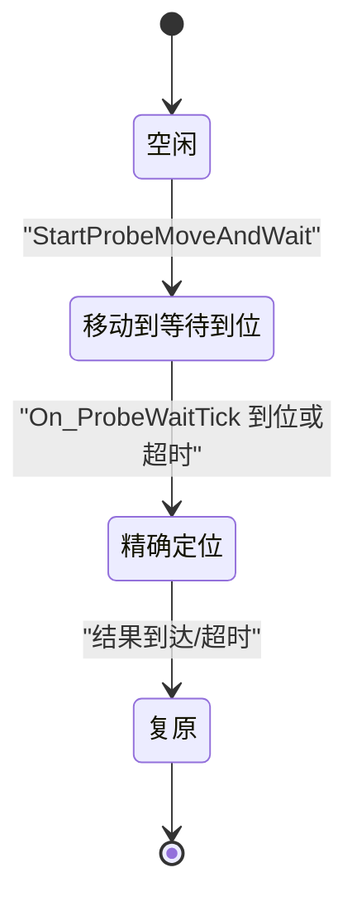
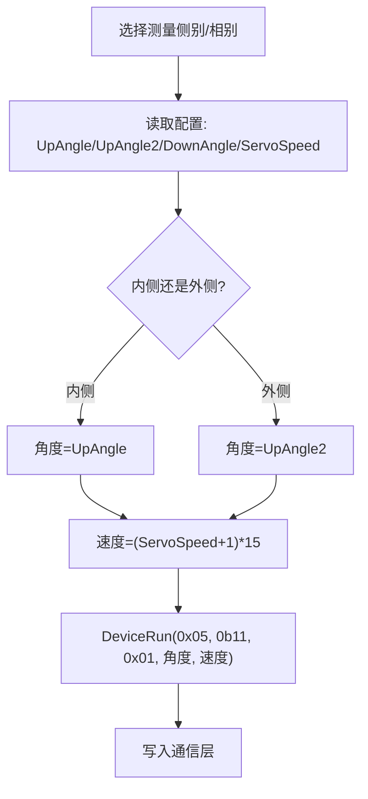
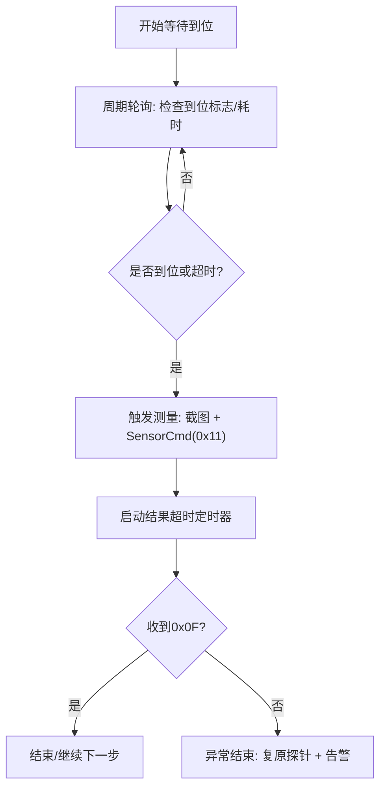
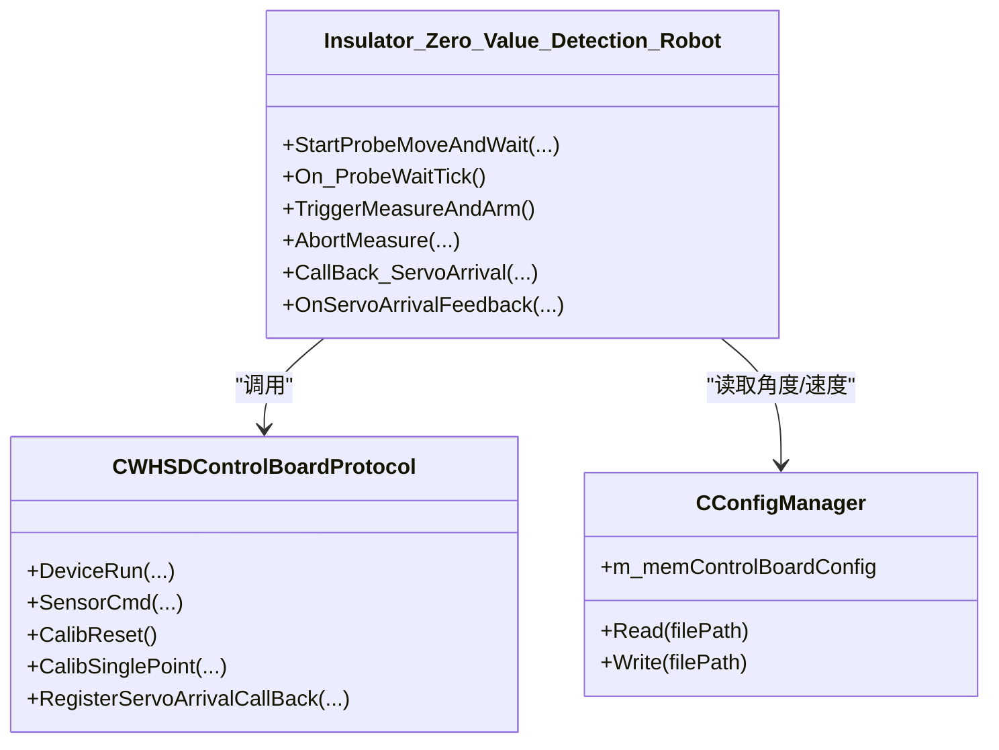
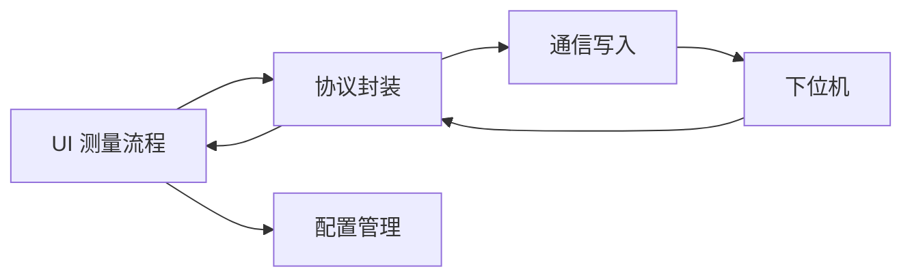

# 探针定位控制

<cite>
**本文引用的文件**
- [Insulator_Zero_Value_Detection_Robot.cpp](file://Insulator_Zero_Value_Detection_Robot/UI/Insulator_Zero_Value_Detection_Robot.cpp)
- [Insulator_Zero_Value_Detection_Robot.h](file://Insulator_Zero_Value_Detection_Robot/UI/Insulator_Zero_Value_Detection_Robot.h)
- [WHSDControlBoradProtocol.cpp](file://Insulator_Zero_Value_Detection_Robot/Protocol/WHSDControlBoradProtocol.cpp)
- [WHSDControlBoradProtocol.h](file://Insulator_Zero_Value_Detection_Robot/Protocol/WHSDControlBoradProtocol.h)
- [ConfigManager.cpp](file://Insulator_Zero_Value_Detection_Robot/Config/ConfigManager.cpp)
- [ConfigManager.h](file://Insulator_Zero_Value_Detection_Robot/Config/ConfigManager.h)
</cite>

## 更新摘要
**变更内容**
- 新增基于实时到位检测的 StartProbeMoveAndWait() 方法，替代固定延迟方式
- 增强探针定位系统，支持舵机到位反馈回调和超时保护
- 改进错误处理机制，包含通信断开检测和电源状态验证
- 优化定位精度控制，集成步进电机控制和位置反馈处理

## 目录
1. [简介](#简介)
2. [项目结构](#项目结构)
3. [核心组件](#核心组件)
4. [架构总览](#架构总览)
5. [详细组件分析](#详细组件分析)
6. [依赖关系分析](#依赖关系分析)
7. [性能与精度优化](#性能与精度优化)
8. [故障排查指南](#故障排查指南)
9. [结论](#结论)
10. [附录：调试方法与参数建议](#附录：调试方法与参数建议)

## 简介
本文件面向绝缘子零值检测机器人中的"探针定位控制"子系统，系统化说明从目标位置计算、电机控制指令发送、到位检测到异常停止的完整流程；解释状态机设计（移动到等待到位再到精确定位）；描述定位精度控制与安全保护机制；并提供性能优化建议与调试方法。文档严格基于仓库代码实现进行归纳，避免臆测。

**更新** 新增了基于实时到位检测的智能定位控制，通过舵机到位反馈回调实现精确的探针定位，替代了原有的固定延迟方式。

## 项目结构
与探针定位控制直接相关的模块包括：
- UI层：测量流程状态机、定时器轮询、人机交互与告警
- 协议层：设备运行命令封装、心跳解析、传感器数据回调
- 配置层：探针角度、舵机速度等可配置参数
- 通信层：TCP客户端写入命令帧

**图表来源**
- [Insulator_Zero_Value_Detection_Robot.cpp:2137-2161](file://Insulator_Zero_Value_Detection_Robot/UI/Insulator_Zero_Value_Detection_Robot.cpp#L2137-L2161)
- [WHSDControlBoradProtocol.cpp:529-541](file://Insulator_Zero_Value_Detection_Robot/Protocol/WHSDControlBoradProtocol.cpp#L529-L541)
- [ConfigManager.h:10-24](file://Insulator_Zero_Value_Detection_Robot/Config/ConfigManager.h#L10-L24)

章节来源
- [Insulator_Zero_Value_Detection_Robot.cpp:2094-2135](file://Insulator_Zero_Value_Detection_Robot/UI/Insulator_Zero_Value_Detection_Robot.cpp#L2094-L2135)
- [WHSDControlBoradProtocol.cpp:529-541](file://Insulator_Zero_Value_Detection_Robot/Protocol/WHSDControlBoradProtocol.cpp#L529-L541)
- [ConfigManager.h:10-24](file://Insulator_Zero_Value_Detection_Robot/Config/ConfigManager.h#L10-L24)

## 核心组件
- 测量流程状态机（UI线程）
  - StartProbeMoveAndWait：下发探针移动指令并启动到位轮询
  - On_ProbeWaitTick：周期检查到位信号或兜底超时，触发测量
  - TriggerMeasureAndArm：截图、下发测量指令、设置步骤、启动结果超时
  - AbortMeasure：异常结束，探针复原、关闭等待窗、恢复按钮、记录告警
- 协议封装
  - DeviceRun：控制电机运行（含角度与速度）
  - SensorCmd：触发测量（0x11），接收结果（0x0F）
  - 心跳解析：提取各电机状态、总电源状态
- 配置管理
  - UpAngle/DownAngle/UpAngle2：探针角度（内/外/待机）
  - ServoSpeed：舵机速度（影响定位时间）
  - InsuThreshold：绝缘阈值（用于后续判定）

**更新** 新增了舵机到位反馈回调机制，通过 RegisterServoArrivalCallBack 注册回调函数，实现实时的探针到位检测。

章节来源
- [Insulator_Zero_Value_Detection_Robot.h:199-208](file://Insulator_Zero_Value_Detection_Robot/UI/Insulator_Zero_Value_Detection_Robot.h#L199-L208)
- [Insulator_Zero_Value_Detection_Robot.cpp:2137-2242](file://Insulator_Zero_Value_Detection_Robot/UI/Insulator_Zero_Value_Detection_Robot.cpp#L2137-L2242)
- [WHSDControlBoradProtocol.h:253-257](file://Insulator_Zero_Value_Detection_Robot/Protocol/WHSDControlBoradProtocol.h#L253-L257)
- [ConfigManager.h:10-24](file://Insulator_Zero_Value_Detection_Robot/Config/ConfigManager.h#L10-L24)

## 架构总览
探针定位控制采用"UI状态机 + 协议封装 + 配置驱动"的分层架构：
- UI层负责流程编排、定时器轮询、异常处理与人机提示
- 协议层负责将高层意图转换为具体帧格式，并处理下行/上行数据
- 配置层提供可调参数，影响定位路径、速度与容错策略

**图表来源**
- [Insulator_Zero_Value_Detection_Robot.cpp:2137-2161](file://Insulator_Zero_Value_Detection_Robot/UI/Insulator_Zero_Value_Detection_Robot.cpp#L2137-L2161)
- [WHSDControlBoradProtocol.cpp:529-541](file://Insulator_Zero_Value_Detection_Robot/Protocol/WHSDControlBoradProtocol.cpp#L529-L541)
- [ConfigManager.h:10-24](file://Insulator_Zero_Value_Detection_Robot/Config/ConfigManager.h#L10-L24)

## 详细组件分析

### 探针定位状态机
- 状态定义与流转
  - 空闲：等待用户触发测量
  - 移动到等待到位：下发角度指令，启动轮询定时器
  - 精确定位（测量）：收到到位或超时后触发测量，启动结果超时
  - 复原/结束：单联直接复原；双联先外侧再复原
- 关键成员变量
  - m_bProbeArrived：原子标志，表示下位机到位信号到达
  - m_probeWaitStart：记录本轮等待起始时间，用于兜底超时
  - m_nMeasureStep：当前测量步骤（1内测/2外侧）
  - m_pProbeWaitTimer / m_pMeasureTimeoutTimer：轮询与结果超时定时器

**更新** 新增了基于舵机到位反馈的状态机增强，通过 CallBack_ServoArrival 和 OnServoArrivalFeedback 处理实时到位信号。

**图表来源**
- [Insulator_Zero_Value_Detection_Robot.cpp:2137-2183](file://Insulator_Zero_Value_Detection_Robot/UI/Insulator_Zero_Value_Detection_Robot.cpp#L2137-L2183)
- [Insulator_Zero_Value_Detection_Robot.cpp:2215-2242](file://Insulator_Zero_Value_Detection_Robot/UI/Insulator_Zero_Value_Detection_Robot.cpp#L2215-L2242)

章节来源
- [Insulator_Zero_Value_Detection_Robot.h:312-324](file://Insulator_Zero_Value_Detection_Robot/UI/Insulator_Zero_Value_Detection_Robot.h#L312-L324)
- [Insulator_Zero_Value_Detection_Robot.cpp:2137-2242](file://Insulator_Zero_Value_Detection_Robot/UI/Insulator_Zero_Value_Detection_Robot.cpp#L2137-L2242)

### 目标位置计算与电机控制指令
- 目标角度来源
  - 内测角度：UpAngle
  - 外侧角度：UpAngle2
  - 待机角度：DownAngle
- 速度计算
  - 速度 = (ServoSpeed + 1) * 15，通过配置项调节定位时间
- 指令封装
  - DeviceRun(target=0x05, enable=0b11, runMode=0x01, angle=speed)
  - 通过 m_pComDevice->Write 发送到下位机

**图表来源**
- [Insulator_Zero_Value_Detection_Robot.cpp:2145-2148](file://Insulator_Zero_Value_Detection_Robot/UI/Insulator_Zero_Value_Detection_Robot.cpp#L2145-L2148)
- [ConfigManager.h:10-24](file://Insulator_Zero_Value_Detection_Robot/Config/ConfigManager.h#L10-L24)
- [WHSDControlBoradProtocol.cpp:529-541](file://Insulator_Zero_Value_Detection_Robot/Protocol/WHSDControlBoradProtocol.cpp#L529-L541)

章节来源
- [Insulator_Zero_Value_Detection_Robot.cpp:2137-2148](file://Insulator_Zero_Value_Detection_Robot/UI/Insulator_Zero_Value_Detection_Robot.cpp#L2137-L2148)
- [WHSDControlBoradProtocol.h:261-271](file://Insulator_Zero_Value_Detection_Robot/Protocol/WHSDControlBoradProtocol.h#L261-L271)
- [ConfigManager.h:10-24](file://Insulator_Zero_Value_Detection_Robot/Config/ConfigManager.h#L10-L24)

### 到位检测机制
- 轮询策略
  - 每 PROBE_ARRIVE_POLL_MS 检查一次到位标志或累计耗时
  - 若 m_bProbeArrived 为真或超过 PROBE_ARRIVE_TIMEOUT_MS，则触发测量
- 安全兜底
  - 若通信断开或总电源已确认关闭，立即中止测量并复原探针
- 结果超时
  - 测量指令发出后启动 MEASURE_RESULT_TIMEOUT_MS 定时器，未收到 0x0F 则自动结束

**更新** 增强了到位检测机制，集成了舵机到位反馈回调，实现了双重检测保障：既有轮询兜底，又有实时反馈触发。

**图表来源**
- [Insulator_Zero_Value_Detection_Robot.cpp:2163-2183](file://Insulator_Zero_Value_Detection_Robot/UI/Insulator_Zero_Value_Detection_Robot.cpp#L2163-L2183)
- [Insulator_Zero_Value_Detection_Robot.cpp:2205-2213](file://Insulator_Zero_Value_Detection_Robot/UI/Insulator_Zero_Value_Detection_Robot.cpp#L2205-L2213)

章节来源
- [Insulator_Zero_Value_Detection_Robot.cpp:67-73](file://Insulator_Zero_Value_Detection_Robot/UI/Insulator_Zero_Value_Detection_Robot.cpp#L67-L73)
- [Insulator_Zero_Value_Detection_Robot.cpp:2163-2213](file://Insulator_Zero_Value_Detection_Robot/UI/Insulator_Zero_Value_Detection_Robot.cpp#L2163-L2213)

### 定位精度控制算法
- 步进/舵机控制
  - 通过 DeviceRun 的角度参数控制探针角度，速度由 ServoSpeed 决定
  - 无闭环编码器反馈，精度依赖机械结构与角度标定
- 位置反馈处理
  - 使用心跳包解析各电机状态位，结合总电源状态判断设备可用性
- 误差补偿机制
  - 通过单点定标（0x17/0x0E）修正测量模块读数偏差，间接提升定位后的测量准确性
  - 校准前需恢复默认（0x17/0x05），确保通道直通

**更新** 新增了基于舵机到位反馈的精度控制，通过 CServoArrivalFeedback 获取实际位置信息，提供更精确的位置反馈。

**图表来源**
- [WHSDControlBoradProtocol.h:253-271](file://Insulator_Zero_Value_Detection_Robot/Protocol/WHSDControlBoradProtocol.h#L253-L271)
- [ConfigManager.h:10-24](file://Insulator_Zero_Value_Detection_Robot/Config/ConfigManager.h#L10-L24)
- [Insulator_Zero_Value_Detection_Robot.h:199-208](file://Insulator_Zero_Value_Detection_Robot/UI/Insulator_Zero_Value_Detection_Robot.h#L199-L208)

章节来源
- [WHSDControlBoradProtocol.cpp:529-541](file://Insulator_Zero_Value_Detection_Robot/Protocol/WHSDControlBoradProtocol.cpp#L529-L541)
- [Insulator_Zero_Value_Detection_Robot.cpp:836-893](file://Insulator_Zero_Value_Detection_Robot/UI/Insulator_Zero_Value_Detection_Robot.cpp#L836-L893)

### 安全保护措施
- 限位保护
  - 通过角度参数限制探针运动范围（UpAngle/UpAngle2/DownAngle）
- 碰撞检测
  - 心跳中解析电机状态位，若检测到异常可中止流程
- 异常停止
  - 通信断开或总电源关闭时，立即中止并复原探针
  - 测量结果超时自动结束，防止卡死

**更新** 增强了安全保护措施，增加了舵机到位超时检测和通信状态监控，提升了系统的可靠性。

章节来源
- [WHSDControlBoradProtocol.cpp:436-453](file://Insulator_Zero_Value_Detection_Robot/Protocol/WHSDControlBoradProtocol.cpp#L436-L453)
- [Insulator_Zero_Value_Detection_Robot.cpp:2167-2174](file://Insulator_Zero_Value_Detection_Robot/UI/Insulator_Zero_Value_Detection_Robot.cpp#L2167-L2174)
- [Insulator_Zero_Value_Detection_Robot.cpp:2215-2242](file://Insulator_Zero_Value_Detection_Robot/UI/Insulator_Zero_Value_Detection_Robot.cpp#L2215-L2242)

## 依赖关系分析
- UI 层依赖协议层进行命令封装与数据解析
- 协议层依赖配置层获取角度与速度参数
- 通信层负责实际帧写入，受心跳与连接状态影响

**图表来源**
- [Insulator_Zero_Value_Detection_Robot.cpp:2137-2161](file://Insulator_Zero_Value_Detection_Robot/UI/Insulator_Zero_Value_Detection_Robot.cpp#L2137-L2161)
- [WHSDControlBoradProtocol.cpp:529-541](file://Insulator_Zero_Value_Detection_Robot/Protocol/WHSDControlBoradProtocol.cpp#L529-L541)
- [ConfigManager.h:10-24](file://Insulator_Zero_Value_Detection_Robot/Config/ConfigManager.h#L10-L24)

章节来源
- [Insulator_Zero_Value_Detection_Robot.cpp:2137-2242](file://Insulator_Zero_Value_Detection_Robot/UI/Insulator_Zero_Value_Detection_Robot.cpp#L2137-L2242)
- [WHSDControlBoradProtocol.cpp:529-541](file://Insulator_Zero_Value_Detection_Robot/Protocol/WHSDControlBoradProtocol.cpp#L529-L541)

## 性能与精度优化
- 路径规划
  - 优先使用最小角度变化路径（内测→外侧→待机）减少机械行程
- 速度控制
  - 调整 ServoSpeed 以平衡定位时间与稳定性；速度过高可能引起抖动
- 定位时间优化
  - 缩短轮询周期（PROBE_ARRIVE_POLL_MS）可提高响应速度，但增加CPU开销
  - 合理设置兜底超时（PROBE_ARRIVE_TIMEOUT_MS）避免长时间等待
- 精度提升
  - 定期执行单点定标（0x17/0x0E），确保测量模块读数准确
  - 校验 UpAngle/UpAngle2 标定值，必要时重新标定

**更新** 新增了基于实时到位反馈的性能优化，通过舵机到位回调减少等待时间，提高整体检测效率。

章节来源
- [Insulator_Zero_Value_Detection_Robot.cpp:67-73](file://Insulator_Zero_Value_Detection_Robot/UI/Insulator_Zero_Value_Detection_Robot.cpp#L67-L73)
- [Insulator_Zero_Value_Detection_Robot.cpp:2145-2148](file://Insulator_Zero_Value_Detection_Robot/UI/Insulator_Zero_Value_Detection_Robot.cpp#L2145-L2148)
- [Insulator_Zero_Value_Detection_Robot.cpp:836-893](file://Insulator_Zero_Value_Detection_Robot/UI/Insulator_Zero_Value_Detection_Robot.cpp#L836-L893)

## 故障排查指南
- 常见问题
  - 探针不动：检查通信连接、总电源状态、角度配置
  - 定位不准：检查 UpAngle/UpAngle2 标定值，执行单点定标
  - 测量超时：检查 0x0F 回报是否正常，调整 MEASURE_RESULT_TIMEOUT_MS
- 日志与告警
  - 查看设备日志与告警表，定位异常原因
  - 使用 HEX 输出比对协议帧，确保命令正确

**更新** 新增了舵机到位反馈相关的故障排查指导，包括到位超时、位置偏差等问题的诊断方法。

章节来源
- [Insulator_Zero_Value_Detection_Robot.cpp:2215-2242](file://Insulator_Zero_Value_Detection_Robot/UI/Insulator_Zero_Value_Detection_Robot.cpp#L2215-L2242)
- [Insulator_Zero_Value_Detection_Robot.cpp:836-893](file://Insulator_Zero_Value_Detection_Robot/UI/Insulator_Zero_Value_Detection_Robot.cpp#L836-L893)

## 结论
探针定位控制通过清晰的状态机、可靠的轮询机制与完善的异常处理，实现了稳定高效的定位与测量流程。结合配置管理与单点定标，可在不同工况下保持良好精度与鲁棒性。新增的舵机到位反馈机制进一步提升了定位精度和响应速度。建议在实际部署中根据现场环境调优速度与超时参数，并定期维护标定数据。

## 附录：调试方法与参数建议
- 调试方法
  - 启用设备日志，记录下行帧与心跳状态
  - 使用手动控制按钮组验证探针动作与角度
  - 通过单点定标流程验证测量模块准确性
- 参数建议
  - ServoSpeed：初始设为中间值，逐步调整至最佳定位时间
  - PROBE_ARRIVE_TIMEOUT_MS：根据机械响应时间设定，避免过长等待
  - MEASURE_RESULT_TIMEOUT_MS：略大于 0x0F 典型回报时间（约3.2秒）

**更新** 新增了舵机到位反馈的调试方法，包括回调注册、反馈数据处理等调试技巧。

章节来源
- [Insulator_Zero_Value_Detection_Robot.cpp:67-73](file://Insulator_Zero_Value_Detection_Robot/UI/Insulator_Zero_Value_Detection_Robot.cpp#L67-L73)
- [Insulator_Zero_Value_Detection_Robot.cpp:2145-2148](file://Insulator_Zero_Value_Detection_Robot/UI/Insulator_Zero_Value_Detection_Robot.cpp#L2145-L2148)
- [Insulator_Zero_Value_Detection_Robot.cpp:836-893](file://Insulator_Zero_Value_Detection_Robot/UI/Insulator_Zero_Value_Detection_Robot.cpp#L836-L893)