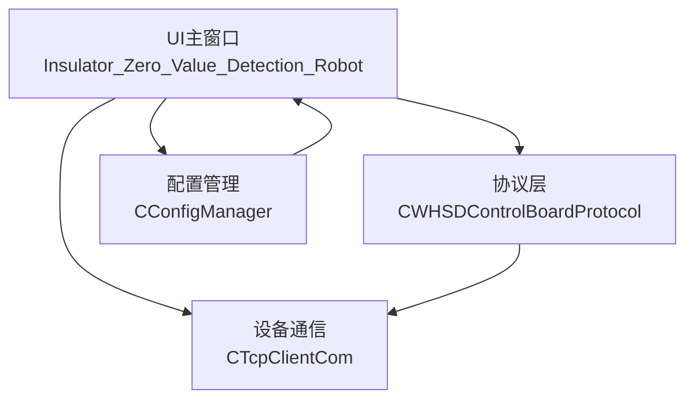
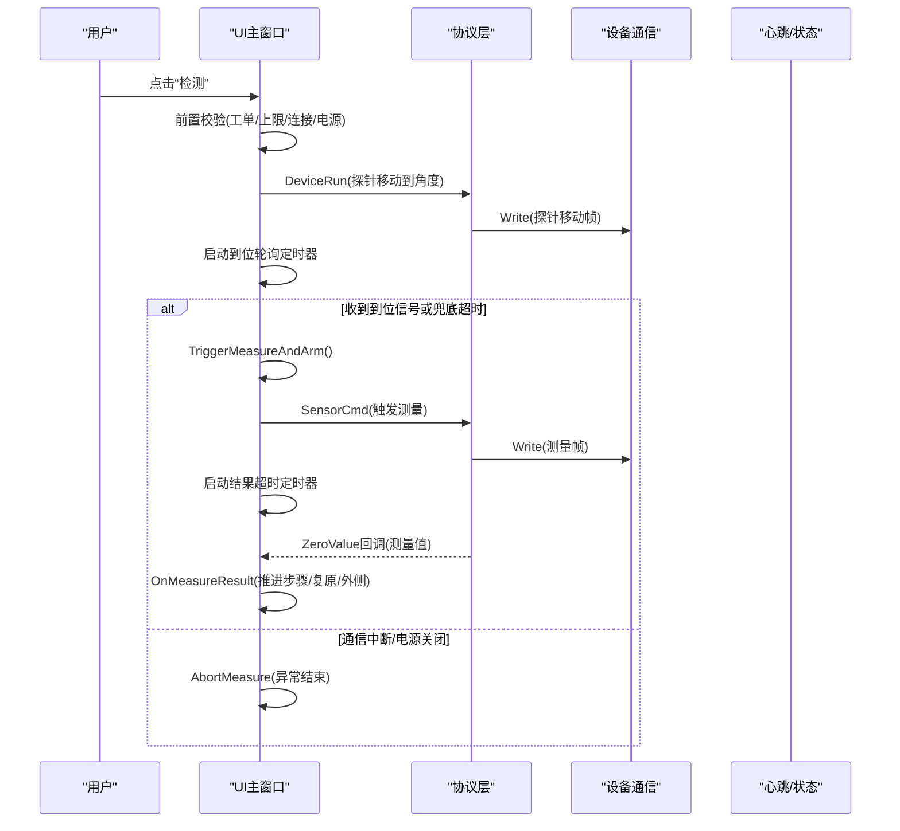
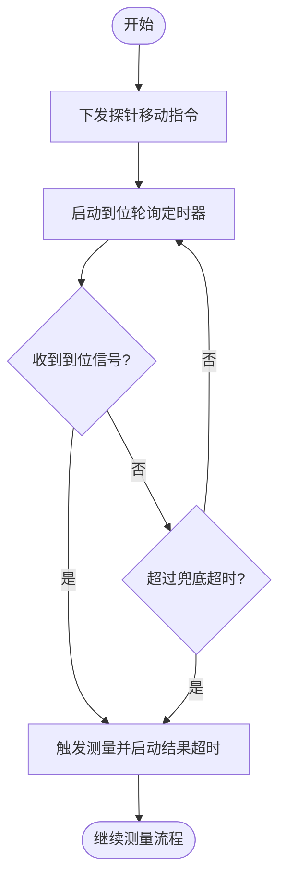
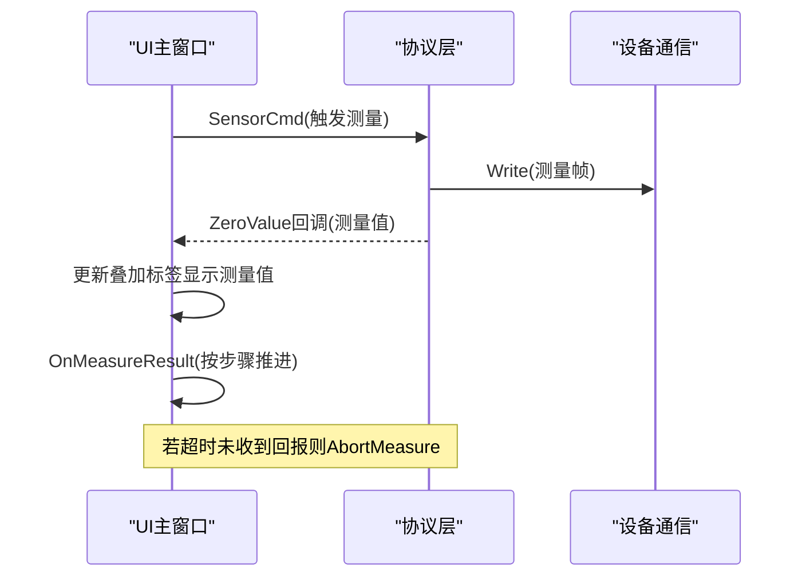
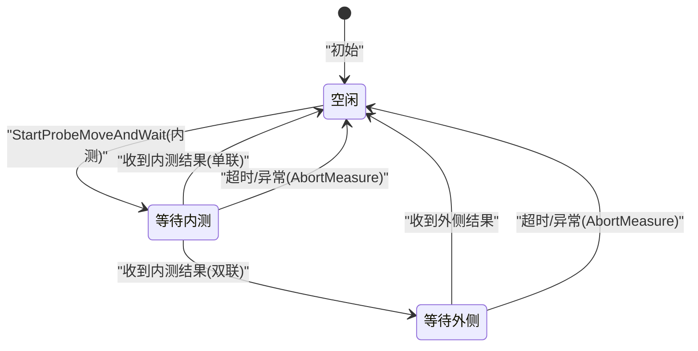
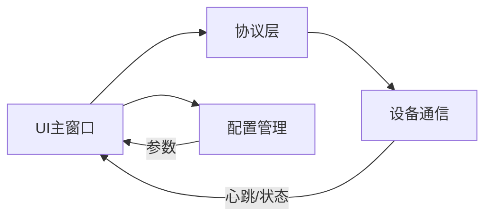

# 检测执行阶段

<cite>
**本文引用的文件**
- [main.cpp](file://Insulator_Zero_Value_Detection_Robot/main.cpp)
- [Insulator_Zero_Value_Detection_Robot.h](file://Insulator_Zero_Value_Detection_Robot/UI/Insulator_Zero_Value_Detection_Robot.h)
- [Insulator_Zero_Value_Detection_Robot.cpp](file://Insulator_Zero_Value_Detection_Robot/UI/Insulator_Zero_Value_Detection_Robot.cpp)
- [WHSDControlBoradProtocol.h](file://Insulator_Zero_Value_Detection_Robot/Protocol/WHSDControlBoradProtocol.h)
- [WHSDControlBoradProtocol.cpp](file://Insulator_Zero_Value_Detection_Robot/Protocol/WHSDControlBoradProtocol.cpp)
- [TcpClient.h](file://Insulator_Zero_Value_Detection_Robot/DeviceCom/TcpClient.h)
- [ConfigManager.h](file://Insulator_Zero_Value_Detection_Robot/Config/ConfigManager.h)
</cite>

## 目录
1. [简介](#简介)
2. [项目结构](#项目结构)
3. [核心组件](#核心组件)
4. [架构总览](#架构总览)
5. [详细组件分析](#详细组件分析)
6. [依赖关系分析](#依赖关系分析)
7. [性能考虑](#性能考虑)
8. [故障排查指南](#故障排查指南)
9. [结论](#结论)
10. [附录](#附录)

## 简介
本章节聚焦绝缘子零值检测机器人V2的“检测执行阶段”，围绕探针定位、传感器数据采集、测量结果处理、状态机切换、实时数据监控、批量检测流程、错误处理与恢复机制，以及性能优化建议进行系统化说明。文档面向工程实施与运维人员，既提供高层流程概览，也给出代码级映射与可视化图示，便于快速定位问题与优化系统表现。

## 项目结构
检测执行阶段涉及UI主窗口、协议解析、设备通信、配置管理四大模块：
- UI主窗口负责用户交互、测量流程编排、界面反馈与告警展示
- 协议层封装控制板命令与心跳、测量回调、校准应答等
- 设备通信层提供TCP连接、收发线程与连接状态回调
- 配置管理层维护控制板参数（角度、速度、阈值等）与工单/报告信息

图表来源
- [Insulator_Zero_Value_Detection_Robot.h:26-236](file://Insulator_Zero_Value_Detection_Robot/UI/Insulator_Zero_Value_Detection_Robot.h#L26-L236)
- [WHSDControlBoradProtocol.h:189-356](file://Insulator_Zero_Value_Detection_Robot/Protocol/WHSDControlBoradProtocol.h#L189-L356)
- [TcpClient.h:8-46](file://Insulator_Zero_Value_Detection_Robot/DeviceCom/TcpClient.h#L8-L46)
- [ConfigManager.h:10-24](file://Insulator_Zero_Value_Detection_Robot/Config/ConfigManager.h#L10-L24)

章节来源
- [main.cpp:11-24](file://Insulator_Zero_Value_Detection_Robot/main.cpp#L11-L24)
- [Insulator_Zero_Value_Detection_Robot.h:26-236](file://Insulator_Zero_Value_Detection_Robot/UI/Insulator_Zero_Value_Detection_Robot.h#L26-L236)

## 核心组件
- 测量流程状态机：包含空闲、等待内测结果、等待外侧结果等状态，驱动探针移动、截图、测量指令下发与结果处理
- 探针到位轮询：周期定时器判断到位信号或兜底超时，触发测量
- 测量结果超时保护：单次定时器在发出测量指令后启动，超时自动结束并告警
- 实时数据监控：测量值叠加显示、进度提示弹窗、告警表首行插入异常记录
- 批量检测：基于工单与侧别/相别维度累计测量值，支持复检删除最近一对内/外侧值并重新测量
- 错误处理与恢复：通信中断、电源关闭、无返回值等情况自动中止、探针复原、恢复UI并记录告警

章节来源
- [Insulator_Zero_Value_Detection_Robot.cpp:67-73](file://Insulator_Zero_Value_Detection_Robot/UI/Insulator_Zero_Value_Detection_Robot.cpp#L67-L73)
- [Insulator_Zero_Value_Detection_Robot.cpp:2030-2053](file://Insulator_Zero_Value_Detection_Robot/UI/Insulator_Zero_Value_Detection_Robot.cpp#L2030-L2053)
- [Insulator_Zero_Value_Detection_Robot.cpp:2074-2119](file://Insulator_Zero_Value_Detection_Robot/UI/Insulator_Zero_Value_Detection_Robot.cpp#L2074-L2119)
- [Insulator_Zero_Value_Detection_Robot.cpp:2121-2178](file://Insulator_Zero_Value_Detection_Robot/UI/Insulator_Zero_Value_Detection_Robot.cpp#L2121-L2178)
- [Insulator_Zero_Value_Detection_Robot.cpp:2186-2233](file://Insulator_Zero_Value_Detection_Robot/UI/Insulator_Zero_Value_Detection_Robot.cpp#L2186-L2233)

## 架构总览
检测执行阶段的整体调用链如下：
- 用户点击“检测”按钮触发On_Test_Click，完成前置校验（工单加载、已测数量上限、控制板连接与电源状态）
- 进入StartProbeMoveAndWait，下发探针移动指令并启动到位轮询定时器
- 收到到位信号或达到兜底超时后，TriggerMeasureAndArm执行截图与测量指令下发，并启动结果超时定时器
- 协议层回调ZeroValue测量值到UI线程，OnMeasureResult根据步骤推进后续动作（单联直接复原；双联切换到外侧再测）
- 若结果超时或通信中断/电源关闭，AbortMeasure统一收尾（停止定时器、探针复原、隐藏等待窗、恢复按钮、记录告警）

图表来源
- [Insulator_Zero_Value_Detection_Robot.cpp:2030-2053](file://Insulator_Zero_Value_Detection_Robot/UI/Insulator_Zero_Value_Detection_Robot.cpp#L2030-L2053)
- [Insulator_Zero_Value_Detection_Robot.cpp:2074-2119](file://Insulator_Zero_Value_Detection_Robot/UI/Insulator_Zero_Value_Detection_Robot.cpp#L2074-L2119)
- [Insulator_Zero_Value_Detection_Robot.cpp:2121-2178](file://Insulator_Zero_Value_Detection_Robot/UI/Insulator_Zero_Value_Detection_Robot.cpp#L2121-L2178)
- [Insulator_Zero_Value_Detection_Robot.cpp:2186-2233](file://Insulator_Zero_Value_Detection_Robot/UI/Insulator_Zero_Value_Detection_Robot.cpp#L2186-L2233)
- [WHSDControlBoradProtocol.cpp:488-500](file://Insulator_Zero_Value_Detection_Robot/Protocol/WHSDControlBoradProtocol.cpp#L488-L500)

## 详细组件分析

### 探针定位与到位轮询
- 探针移动指令通过协议层DeviceRun下发，角度与速度来自配置管理
- 到位轮询定时器以固定周期检查m_bProbeArrived标志或计算自开始时间以来的耗时，超过PROBE_ARRIVE_TIMEOUT_MS即视为到达
- 若检测到通信断开或总电源确认关闭，立即中止并告警，避免卡死等待

图表来源
- [Insulator_Zero_Value_Detection_Robot.cpp:2074-2119](file://Insulator_Zero_Value_Detection_Robot/UI/Insulator_Zero_Value_Detection_Robot.cpp#L2074-L2119)
- [Insulator_Zero_Value_Detection_Robot.cpp:2180-2184](file://Insulator_Zero_Value_Detection_Robot/UI/Insulator_Zero_Value_Detection_Robot.cpp#L2180-L2184)

章节来源
- [Insulator_Zero_Value_Detection_Robot.cpp:2074-2119](file://Insulator_Zero_Value_Detection_Robot/UI/Insulator_Zero_Value_Detection_Robot.cpp#L2074-L2119)
- [ConfigManager.h:10-24](file://Insulator_Zero_Value_Detection_Robot/Config/ConfigManager.h#L10-L24)

### 传感器数据采集与测量结果处理
- 触发测量后，协议层回调ZeroValue测量值，UI线程接收并更新界面叠加标签显示当前检测结果
- 根据当前测量步骤（内测/外侧）推进流程：单联收到内测结果即复原结束；双联先内测再外侧，外侧结果收到后复原结束
- 结果超时定时器在MEASURE_RESULT_TIMEOUT_MS内未收到回报则判定失败并自动结束

图表来源
- [Insulator_Zero_Value_Detection_Robot.cpp:675-703](file://Insulator_Zero_Value_Detection_Robot/UI/Insulator_Zero_Value_Detection_Robot.cpp#L675-L703)
- [Insulator_Zero_Value_Detection_Robot.cpp:2121-2149](file://Insulator_Zero_Value_Detection_Robot/UI/Insulator_Zero_Value_Detection_Robot.cpp#L2121-L2149)
- [Insulator_Zero_Value_Detection_Robot.cpp:2186-2233](file://Insulator_Zero_Value_Detection_Robot/UI/Insulator_Zero_Value_Detection_Robot.cpp#L2186-L2233)

章节来源
- [Insulator_Zero_Value_Detection_Robot.cpp:675-703](file://Insulator_Zero_Value_Detection_Robot/UI/Insulator_Zero_Value_Detection_Robot.cpp#L675-L703)
- [Insulator_Zero_Value_Detection_Robot.cpp:2121-2149](file://Insulator_Zero_Value_Detection_Robot/UI/Insulator_Zero_Value_Detection_Robot.cpp#L2121-L2149)
- [Insulator_Zero_Value_Detection_Robot.cpp:2186-2233](file://Insulator_Zero_Value_Detection_Robot/UI/Insulator_Zero_Value_Detection_Robot.cpp#L2186-L2233)

### 检测状态机转换逻辑
- 状态定义：m_nMeasureStep=0为空闲；=1为等待内测结果；=2为等待外侧结果
- 转换条件：
  - 空闲→等待内测：StartProbeMoveAndWait下发内测角度并启动轮询
  - 等待内测→外侧：收到内测结果且为双联时，切换到外侧角度并再次轮询
  - 任意等待→空闲：收到对应结果或超时/异常时复原并清零
- 辅助标志：m_bProbeArrived用于提前触发测量；m_probeWaitStart用于计算兜底超时

图表来源
- [Insulator_Zero_Value_Detection_Robot.h:294-313](file://Insulator_Zero_Value_Detection_Robot/UI/Insulator_Zero_Value_Detection_Robot.h#L294-L313)
- [Insulator_Zero_Value_Detection_Robot.cpp:2186-2233](file://Insulator_Zero_Value_Detection_Robot/UI/Insulator_Zero_Value_Detection_Robot.cpp#L2186-L2233)

章节来源
- [Insulator_Zero_Value_Detection_Robot.h:294-313](file://Insulator_Zero_Value_Detection_Robot/UI/Insulator_Zero_Value_Detection_Robot.h#L294-L313)
- [Insulator_Zero_Value_Detection_Robot.cpp:2186-2233](file://Insulator_Zero_Value_Detection_Robot/UI/Insulator_Zero_Value_Detection_Robot.cpp#L2186-L2233)

### 实时数据监控与界面反馈
- 测量值叠加显示：在label_9右下角显示“当前检测结果: X MΩ”
- 进度跟踪：测量等待弹窗显示“探针移动到内侧,等待到位...”、“正在执行第二次测量（外侧）,等待结果...”等提示
- 异常报警：AddAlarm在告警表首行插入一条记录（时间/类型/位置/详情/状态），同时写入设备日志

章节来源
- [Insulator_Zero_Value_Detection_Robot.cpp:695-703](file://Insulator_Zero_Value_Detection_Robot/UI/Insulator_Zero_Value_Detection_Robot.cpp#L695-L703)
- [Insulator_Zero_Value_Detection_Robot.cpp:2074-2119](file://Insulator_Zero_Value_Detection_Robot/UI/Insulator_Zero_Value_Detection_Robot.cpp#L2074-L2119)
- [Insulator_Zero_Value_Detection_Robot.h:199-201](file://Insulator_Zero_Value_Detection_Robot/UI/Insulator_Zero_Value_Detection_Robot.h#L199-L201)

### 批量检测执行流程
- 批量依据工单的侧别/相别维度累计测量值，限制最大数量为片数（单联）或2×片数（双联）
- 连续检测点自动处理：每次点击检测后，若未达上限则继续选择下一相/方向执行
- 人工干预点：
  - 当某相/方向已测满时提示“请换相或换号侧”
  - 复检操作可删除最近一次（双联为最近一对内/外侧）测量值并重新测量

章节来源
- [Insulator_Zero_Value_Detection_Robot.cpp:2030-2053](file://Insulator_Zero_Value_Detection_Robot/UI/Insulator_Zero_Value_Detection_Robot.cpp#L2030-L2053)
- [Insulator_Zero_Value_Detection_Robot.cpp:2425-2452](file://Insulator_Zero_Value_Detection_Robot/UI/Insulator_Zero_Value_Detection_Robot.cpp#L2425-L2452)

### 错误处理与恢复机制
- 通信中断：在到位轮询中检测m_bControlBroadConnected，若断开则AbortMeasure并告警
- 设备异常/电源关闭：IsMainPowerConfirmedOff判断总电源是否确认关闭，若是则中止流程并告警
- 测量无返回值：结果超时定时器触发On_MeasureTimeout，自动结束并告警
- 恢复策略：统一调用AbortMeasure停止所有相关定时器、下发探针复原指令、隐藏等待窗、恢复按钮可用性、记录告警与日志

章节来源
- [Insulator_Zero_Value_Detection_Robot.cpp:2099-2119](file://Insulator_Zero_Value_Detection_Robot/UI/Insulator_Zero_Value_Detection_Robot.cpp#L2099-L2119)
- [Insulator_Zero_Value_Detection_Robot.cpp:2141-2178](file://Insulator_Zero_Value_Detection_Robot/UI/Insulator_Zero_Value_Detection_Robot.cpp#L2141-L2178)

## 依赖关系分析
- UI主窗口依赖协议层发送控制命令与接收测量回调
- 协议层依赖设备通信层进行TCP读写，并通过心跳回调维护设备状态
- 配置管理层提供探针角度、速度、阈值等参数，影响探针移动与测量行为
- 设备通信层提供连接状态回调，支撑UI层的连接感知与异常处理

图表来源
- [Insulator_Zero_Value_Detection_Robot.h:26-236](file://Insulator_Zero_Value_Detection_Robot/UI/Insulator_Zero_Value_Detection_Robot.h#L26-L236)
- [WHSDControlBoradProtocol.h:189-356](file://Insulator_Zero_Value_Detection_Robot/Protocol/WHSDControlBoradProtocol.h#L189-L356)
- [TcpClient.h:8-46](file://Insulator_Zero_Value_Detection_Robot/DeviceCom/TcpClient.h#L8-L46)
- [ConfigManager.h:10-24](file://Insulator_Zero_Value_Detection_Robot/Config/ConfigManager.h#L10-L24)

章节来源
- [Insulator_Zero_Value_Detection_Robot.h:26-236](file://Insulator_Zero_Value_Detection_Robot/UI/Insulator_Zero_Value_Detection_Robot.h#L26-L236)
- [WHSDControlBoradProtocol.h:189-356](file://Insulator_Zero_Value_Detection_Robot/Protocol/WHSDControlBoradProtocol.h#L189-L356)
- [TcpClient.h:8-46](file://Insulator_Zero_Value_Detection_Robot/DeviceCom/TcpClient.h#L8-L46)
- [ConfigManager.h:10-24](file://Insulator_Zero_Value_Detection_Robot/Config/ConfigManager.h#L10-L24)

## 性能考虑
- 探针到位轮询周期设置为较短间隔以提升响应速度，但需平衡CPU占用
- 结果超时时间设置应略大于典型回报时间，避免误判失败
- 批量检测时避免重复触发，利用状态机防止重入
- 截图与测量顺序优化：先截图保存再下发测量指令，减少画面抖动对图像质量的影响
- 使用原子变量与互斥锁保护跨线程共享状态，降低竞争开销

[本节为通用性能指导，不直接分析具体文件]

## 故障排查指南
- 通信中断：检查TCP连接状态回调，确认m_bControlBroadConnected是否为真；查看设备日志中的断连记录
- 电源关闭：通过心跳快照判断总电源状态，若确认关闭则中止流程并提示开启电源
- 测量无返回值：检查结果超时定时器是否启动，确认协议回调是否被正确注册与触发
- 探针未到位：检查到位轮询定时器是否运行，确认m_bProbeArrived是否置位；核对探针角度配置是否正确
- 复检失败：确认当前相/方向是否存在可删除的最近测量值；检查双联模式下内/外侧值是否成对

章节来源
- [Insulator_Zero_Value_Detection_Robot.cpp:2099-2119](file://Insulator_Zero_Value_Detection_Robot/UI/Insulator_Zero_Value_Detection_Robot.cpp#L2099-L2119)
- [Insulator_Zero_Value_Detection_Robot.cpp:2141-2178](file://Insulator_Zero_Value_Detection_Robot/UI/Insulator_Zero_Value_Detection_Robot.cpp#L2141-L2178)
- [Insulator_Zero_Value_Detection_Robot.cpp:2425-2452](file://Insulator_Zero_Value_Detection_Robot/UI/Insulator_Zero_Value_Detection_Robot.cpp#L2425-L2452)

## 结论
检测执行阶段通过清晰的状态机与定时器机制，实现了探针定位、数据采集、结果处理与异常恢复的闭环流程。结合实时界面反馈与告警机制，保障了现场操作的可视性与可控性。批量检测与复检功能提升了作业效率与容错能力。建议在部署时合理配置超时参数与探针角度，确保稳定高效的检测执行。

[本节为总结性内容，不直接分析具体文件]

## 附录
- 关键时序参数：
  - 探针到位轮询周期：100ms
  - 探针到位兜底等待：4000ms
  - 测量结果超时：8000ms
- 配置项示例：
  - 探针向内/向外/复原角度
  - 舵机速度
  - 绝缘阈值

章节来源
- [Insulator_Zero_Value_Detection_Robot.cpp:67-73](file://Insulator_Zero_Value_Detection_Robot/UI/Insulator_Zero_Value_Detection_Robot.cpp#L67-L73)
- [ConfigManager.h:10-24](file://Insulator_Zero_Value_Detection_Robot/Config/ConfigManager.h#L10-L24)