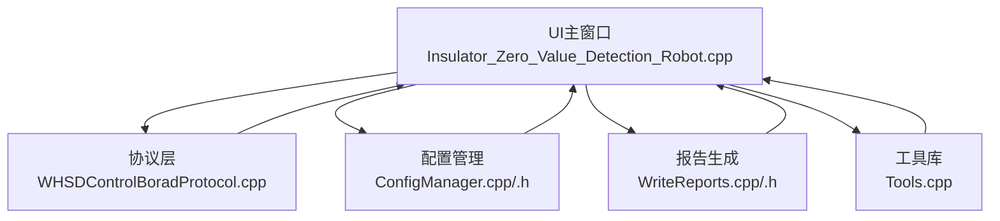
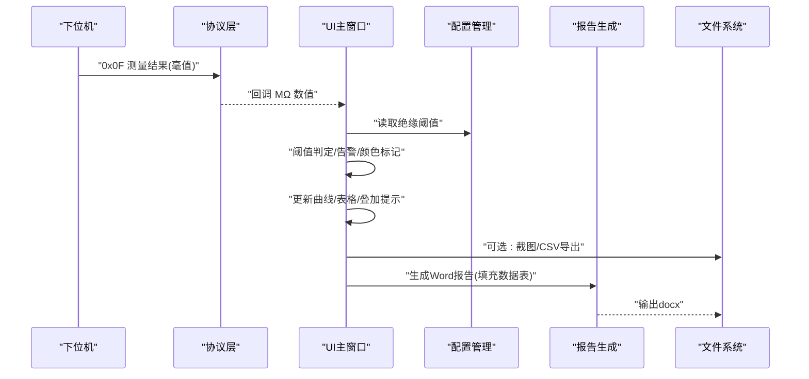
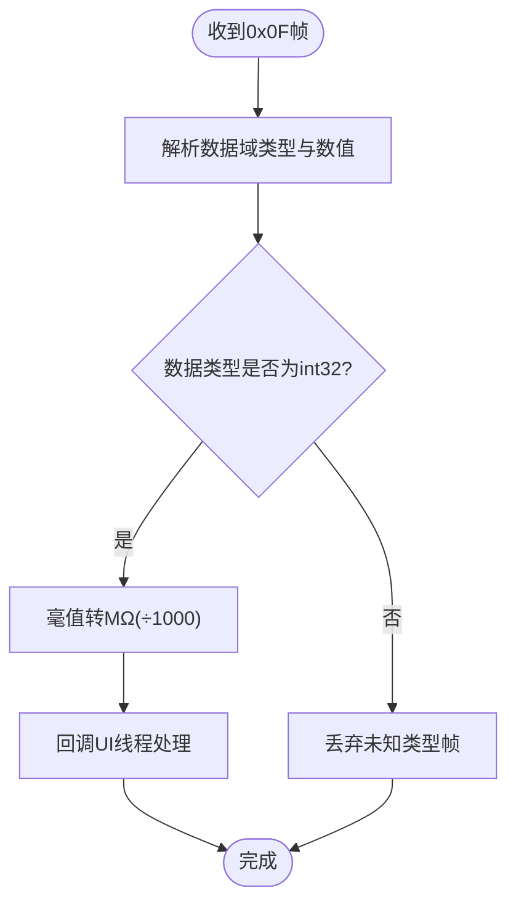
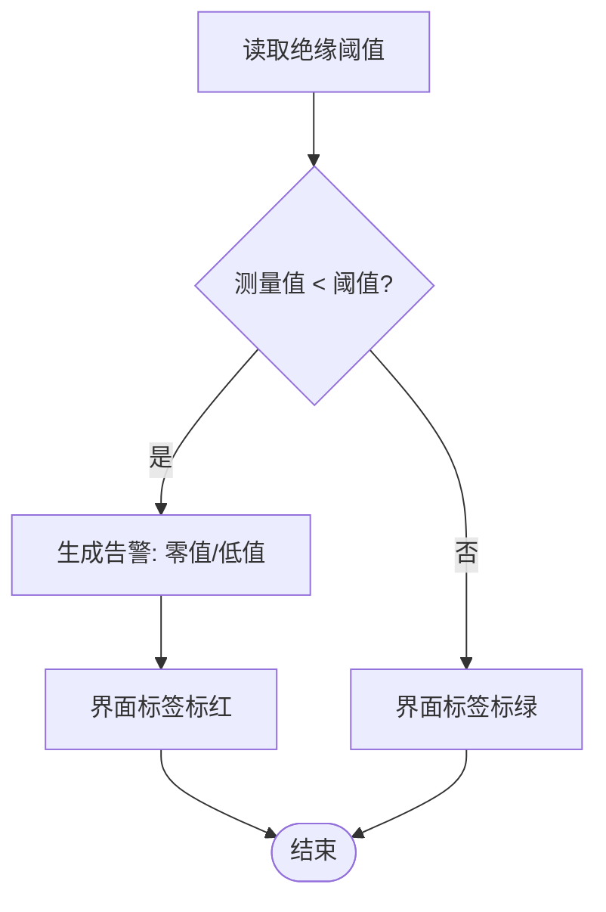
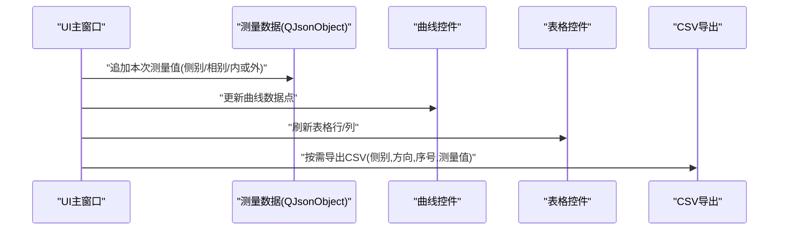
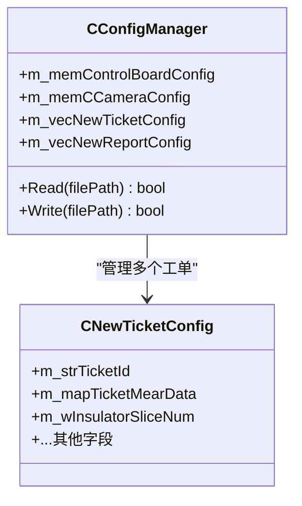
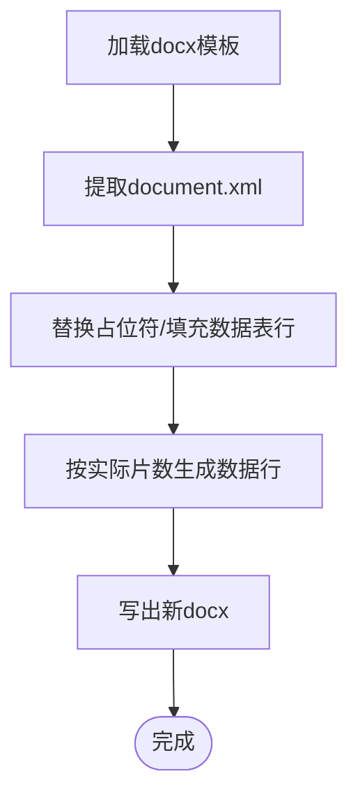
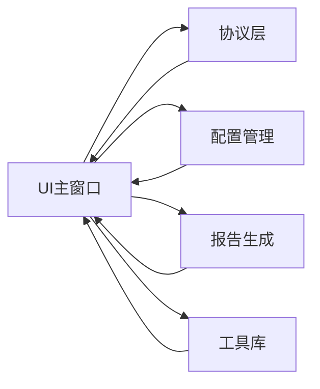

# 测量结果处理

<cite>
**本文引用的文件**
- [Insulator_Zero_Value_Detection_Robot.cpp](file://Insulator_Zero_Value_Detection_Robot/UI/Insulator_Zero_Value_Detection_Robot.cpp)
- [Insulator_Zero_Value_Detection_Robot.h](file://Insulator_Zero_Value_Detection_Robot/UI/Insulator_Zero_Value_Detection_Robot.h)
- [WHSDControlBoradProtocol.cpp](file://Insulator_Zero_Value_Detection_Robot/Protocol/WHSDControlBoradProtocol.cpp)
- [ConfigManager.h](file://Insulator_Zero_Value_Detection_Robot/Config/ConfigManager.h)
- [ConfigManager.cpp](file://Insulator_Zero_Value_Detection_Robot/Config/ConfigManager.cpp)
- [WriteReports.h](file://Insulator_Zero_Value_Detection_Robot/Report/WriteReports.h)
- [WriteReports.cpp](file://Insulator_Zero_Value_Detection_Robot/Report/WriteReports.cpp)
- [Tools.cpp](file://Insulator_Zero_Value_Detection_Robot/Tools/Tools.cpp)
- [操作说明书.md](file://操作说明书.md)
</cite>

## 目录
1. [简介](#简介)
2. [项目结构](#项目结构)
3. [核心组件](#核心组件)
4. [架构总览](#架构总览)
5. [详细组件分析](#详细组件分析)
6. [依赖关系分析](#依赖关系分析)
7. [性能考虑](#性能考虑)
8. [故障排查指南](#故障排查指南)
9. [结论](#结论)
10. [附录](#附录)

## 简介
本文件面向绝缘子零值检测机器人的“测量结果处理”子系统，聚焦从原始数据到最终报告的全链路：包括协议层数据解析、单位换算、阈值判定与告警、批量数据的统计与趋势展示、存储格式与管理策略、以及可视化与报表导出。文档同时给出性能优化建议与错误恢复机制，帮助读者快速理解并扩展该模块。

## 项目结构
围绕测量结果处理的关键代码分布在以下位置：
- UI主窗口：负责测量流程控制、阈值判断、告警、CSV导出、图表显示等
- 协议层：负责接收设备回报的测量帧，解析为MΩ数值并回调
- 配置管理：持久化绝缘阈值、探针角度、工单与报告配置等
- 报告生成：基于docx模板填充测量数据表，输出Word报告
- 工具库：文件保存、路径构造、二进制写入等通用能力

**图示来源**
- [Insulator_Zero_Value_Detection_Robot.cpp:675-703](file://Insulator_Zero_Value_Detection_Robot/UI/Insulator_Zero_Value_Detection_Robot.cpp#L675-L703)
- [WHSDControlBoradProtocol.cpp:321-363](file://Insulator_Zero_Value_Detection_Robot/Protocol/WHSDControlBoradProtocol.cpp#L321-L363)
- [ConfigManager.cpp:16-257](file://Insulator_Zero_Value_Detection_Robot/Config/ConfigManager.cpp#L16-L257)
- [WriteReports.cpp:107-151](file://Insulator_Zero_Value_Detection_Robot/Report/WriteReports.cpp#L107-L151)
- [Tools.cpp:52-143](file://Insulator_Zero_Value_Detection_Robot/Tools/Tools.cpp#L52-L143)

**章节来源**
- [Insulator_Zero_Value_Detection_Robot.cpp:675-703](file://Insulator_Zero_Value_Detection_Robot/UI/Insulator_Zero_Value_Detection_Robot.cpp#L675-L703)
- [WHSDControlBoradProtocol.cpp:321-363](file://Insulator_Zero_Value_Detection_Robot/Protocol/WHSDControlBoradProtocol.cpp#L321-L363)
- [ConfigManager.cpp:16-257](file://Insulator_Zero_Value_Detection_Robot/Config/ConfigManager.cpp#L16-L257)
- [WriteReports.cpp:107-151](file://Insulator_Zero_Value_Detection_Robot/Report/WriteReports.cpp#L107-L151)
- [Tools.cpp:52-143](file://Insulator_Zero_Value_Detection_Robot/Tools/Tools.cpp#L52-L143)

## 核心组件
- 协议解析与单位换算：将设备返回的毫值整型转换为MΩ浮点数，并通过回调传递到UI线程
- 阈值判定与告警：依据配置的绝缘阈值进行零值/低值判定，生成告警并在界面高亮
- 批量数据处理：按侧别/相别组织测量数组，支持复检、CSV导出、曲线更新
- 存储与备份：XML配置文件持久化（含JSON格式的测量数据）、CSV导出、自动归档目录
- 可视化与报表：表格/曲线展示、Word报告填充数据表

**章节来源**
- [Insulator_Zero_Value_Detection_Robot.cpp:756-784](file://Insulator_Zero_Value_Detection_Robot/UI/Insulator_Zero_Value_Detection_Robot.cpp#L756-L784)
- [Insulator_Zero_Value_Detection_Robot.cpp:2745-2801](file://Insulator_Zero_Value_Detection_Robot/UI/Insulator_Zero_Value_Detection_Robot.cpp#L2745-L2801)
- [ConfigManager.cpp:203-212](file://Insulator_Zero_Value_Detection_Robot/Config/ConfigManager.cpp#L203-L212)
- [WriteReports.cpp:206-321](file://Insulator_Zero_Value_Detection_Robot/Report/WriteReports.cpp#L206-L321)
- [Tools.cpp:52-143](file://Insulator_Zero_Value_Detection_Robot/Tools/Tools.cpp#L52-L143)

## 架构总览
测量结果处理的端到端流程如下：
1. 设备通过TCP上报测量结果帧（命令字0x0F），协议层解析出毫值并转为MΩ
2. UI线程收到回调后，记录当前步骤（内测/外侧），更新叠加提示与曲线
3. 根据配置中的绝缘阈值进行判定，低于阈值则产生告警并标记颜色
4. 将结果追加到当前工单的测量数据（QJsonObject/QJsonArray）
5. 支持复检删除最近一次或一对内/外侧值并重测
6. 生成CSV与Word报告，Word中动态重建数据行以匹配实际片数

**图示来源**
- [WHSDControlBoradProtocol.cpp:321-363](file://Insulator_Zero_Value_Detection_Robot/Protocol/WHSDControlBoradProtocol.cpp#L321-L363)
- [Insulator_Zero_Value_Detection_Robot.cpp:675-703](file://Insulator_Zero_Value_Detection_Robot/UI/Insulator_Zero_Value_Detection_Robot.cpp#L675-L703)
- [Insulator_Zero_Value_Detection_Robot.cpp:756-784](file://Insulator_Zero_Value_Detection_Robot/UI/Insulator_Zero_Value_Detection_Robot.cpp#L756-L784)
- [WriteReports.cpp:206-321](file://Insulator_Zero_Value_Detection_Robot/Report/WriteReports.cpp#L206-L321)
- [Tools.cpp:52-143](file://Insulator_Zero_Value_Detection_Robot/Tools/Tools.cpp#L52-L143)

## 详细组件分析

### 原始数据转换与单位换算
- 协议层在接收到0x0F测量结果时，从数据域提取int32大端毫值，除以1000得到MΩ浮点数，并通过回调函数传递给UI线程
- UI线程在回调中记录日志、切换至UI线程执行后续逻辑，并显示实时叠加提示

**图示来源**
- [WHSDControlBoradProtocol.cpp:321-363](file://Insulator_Zero_Value_Detection_Robot/Protocol/WHSDControlBoradProtocol.cpp#L321-L363)
- [Insulator_Zero_Value_Detection_Robot.cpp:675-703](file://Insulator_Zero_Value_Detection_Robot/UI/Insulator_Zero_Value_Detection_Robot.cpp#L675-L703)

**章节来源**
- [WHSDControlBoradProtocol.cpp:321-363](file://Insulator_Zero_Value_Detection_Robot/Protocol/WHSDControlBoradProtocol.cpp#L321-L363)
- [Insulator_Zero_Value_Detection_Robot.cpp:675-703](file://Insulator_Zero_Value_Detection_Robot/UI/Insulator_Zero_Value_Detection_Robot.cpp#L675-L703)

### 阈值设定、判定逻辑与结果分类
- 阈值来源：配置项“绝缘阈值”，由用户在系统设置中保存，运行时从配置读取
- 判定逻辑：若测量值小于阈值，则判定为零值/低值，触发告警并在界面相应标签上以红色高亮；否则绿色表示合格
- 结果分类：正常/异常两类，异常会记录告警信息（类型、位置、详情）

**图示来源**
- [Insulator_Zero_Value_Detection_Robot.cpp:756-784](file://Insulator_Zero_Value_Detection_Robot/UI/Insulator_Zero_Value_Detection_Robot.cpp#L756-L784)
- [ConfigManager.cpp:72-76](file://Insulator_Zero_Value_Detection_Robot/Config/ConfigManager.cpp#L72-L76)

**章节来源**
- [Insulator_Zero_Value_Detection_Robot.cpp:756-784](file://Insulator_Zero_Value_Detection_Robot/UI/Insulator_Zero_Value_Detection_Robot.cpp#L756-L784)
- [ConfigManager.cpp:72-76](file://Insulator_Zero_Value_Detection_Robot/Config/ConfigManager.cpp#L72-L76)

### 批量数据处理：统计、趋势分析与异常识别
- 数据结构：按“侧别→相别/方向→测量值数组”组织，双联时每片包含内侧与外侧两个值
- 统计与趋势：UI侧维护表格与曲线控件，随测量推进实时更新；可基于数组长度计算片号与内外侧索引
- 异常识别：阈值判定即异常识别；复检功能可删除最近一次或一对内/外侧值并重测，用于剔除可疑数据
- CSV导出：将当前工单的测量数据按层级顺序导出为CSV，便于离线分析

**图示来源**
- [Insulator_Zero_Value_Detection_Robot.cpp:2745-2801](file://Insulator_Zero_Value_Detection_Robot/UI/Insulator_Zero_Value_Detection_Robot.cpp#L2745-L2801)
- [操作说明书.md:200-217](file://操作说明书.md#L200-L217)

**章节来源**
- [Insulator_Zero_Value_Detection_Robot.cpp:2745-2801](file://Insulator_Zero_Value_Detection_Robot/UI/Insulator_Zero_Value_Detection_Robot.cpp#L2745-L2801)
- [操作说明书.md:200-217](file://操作说明书.md#L200-L217)

### 存储格式与管理方式
- 配置持久化：使用XML文件保存设备参数、相机参数、工单与报告配置；工单内的测量数据以JSON文本形式嵌入XML节点，读写时序列化为QJsonObject
- 文件保存：提供统一工具方法保存二进制文件，支持按GUID创建目录、时间戳命名、自动创建目录
- 备份策略：通过AutoSave目录与GUID路径组织历史数据，便于追溯与归档

**图示来源**
- [ConfigManager.h:185-199](file://Insulator_Zero_Value_Detection_Robot/Config/ConfigManager.h#L185-L199)
- [ConfigManager.cpp:203-212](file://Insulator_Zero_Value_Detection_Robot/Config/ConfigManager.cpp#L203-L212)
- [ConfigManager.cpp:406-411](file://Insulator_Zero_Value_Detection_Robot/Config/ConfigManager.cpp#L406-L411)
- [Tools.cpp:52-143](file://Insulator_Zero_Value_Detection_Robot/Tools/Tools.cpp#L52-L143)

**章节来源**
- [ConfigManager.cpp:203-212](file://Insulator_Zero_Value_Detection_Robot/Config/ConfigManager.cpp#L203-L212)
- [ConfigManager.cpp:406-411](file://Insulator_Zero_Value_Detection_Robot/Config/ConfigManager.cpp#L406-L411)
- [Tools.cpp:52-143](file://Insulator_Zero_Value_Detection_Robot/Tools/Tools.cpp#L52-L143)

### 结果可视化与报表导出
- 可视化：表格与曲线控件随测量推进实时更新；双联模式下内侧/外侧分别着色，异常时红色高亮
- Word报告：基于docx模板，解析word/document.xml，用正则定位并替换占位符；数据表行自适应（多于模板增行，少于则减行）
- 数据映射：按“大号A/B/C、小号A/B/C”六列顺序，每片取内侧与外侧值填入对应单元格

**图示来源**
- [WriteReports.cpp:107-151](file://Insulator_Zero_Value_Detection_Robot/Report/WriteReports.cpp#L107-L151)
- [WriteReports.cpp:206-321](file://Insulator_Zero_Value_Detection_Robot/Report/WriteReports.cpp#L206-L321)

**章节来源**
- [WriteReports.cpp:107-151](file://Insulator_Zero_Value_Detection_Robot/Report/WriteReports.cpp#L107-L151)
- [WriteReports.cpp:206-321](file://Insulator_Zero_Value_Detection_Robot/Report/WriteReports.cpp#L206-L321)

## 依赖关系分析
- UI主窗口依赖协议层获取测量值，依赖配置管理读取阈值，依赖报告生成输出Word，依赖工具库进行文件操作
- 协议层仅负责数据解析与回调，不关心业务逻辑
- 配置管理独立于UI，提供统一的读/写接口
- 报告生成对XML与ZIP容器进行操作，无需外部依赖

**图示来源**
- [Insulator_Zero_Value_Detection_Robot.h:26-22](file://Insulator_Zero_Value_Detection_Robot/UI/Insulator_Zero_Value_Detection_Robot.h#L26-L22)
- [ConfigManager.h:185-199](file://Insulator_Zero_Value_Detection_Robot/Config/ConfigManager.h#L185-L199)
- [WriteReports.h:24-89](file://Insulator_Zero_Value_Detection_Robot/Report/WriteReports.h#L24-L89)
- [Tools.cpp:52-143](file://Insulator_Zero_Value_Detection_Robot/Tools/Tools.cpp#L52-L143)

**章节来源**
- [Insulator_Zero_Value_Detection_Robot.h:26-22](file://Insulator_Zero_Value_Detection_Robot/UI/Insulator_Zero_Value_Detection_Robot.h#L26-L22)
- [ConfigManager.h:185-199](file://Insulator_Zero_Value_Detection_Robot/Config/ConfigManager.h#L185-L199)
- [WriteReports.h:24-89](file://Insulator_Zero_Value_Detection_Robot/Report/WriteReports.h#L24-L89)
- [Tools.cpp:52-143](file://Insulator_Zero_Value_Detection_Robot/Tools/Tools.cpp#L52-L143)

## 性能考虑
- 回调线程安全：协议回调运行在协议线程，通过Qt队列连接切到UI线程处理，避免跨线程直接修改UI
- 超时保护：测量结果超时未收到回报时自动结束流程并告警，防止阻塞
- 文件I/O：二进制文件写入采用try-catch捕获异常，失败时返回false，避免崩溃
- 报告生成：基于字符串正则替换与ZIP容器操作，适合中等规模数据；大量数据时可考虑分批写入或异步处理

[本节为通用指导，不直接分析具体文件]

## 故障排查指南
- 测量无返回值：检查心跳与电源状态，确认探针到位轮询与结果超时定时器是否工作；若超时则自动中止并记录告警
- 定标失败：检查标准值与原始值合法性（原始值需大于0且小于标准值），Flash写入需要1~2秒，超时需适当延长
- 报告生成失败：确认模板路径与输出路径不同，确保word/document.xml存在并可读取
- 配置读写失败：检查XML文件格式与节点名称，确保JSON序列化成功

**章节来源**
- [Insulator_Zero_Value_Detection_Robot.cpp:2141-2176](file://Insulator_Zero_Value_Detection_Robot/UI/Insulator_Zero_Value_Detection_Robot.cpp#L2141-L2176)
- [Insulator_Zero_Value_Detection_Robot.cpp:1078-1114](file://Insulator_Zero_Value_Detection_Robot/UI/Insulator_Zero_Value_Detection_Robot.cpp#L1078-L1114)
- [WriteReports.cpp:40-105](file://Insulator_Zero_Value_Detection_Robot/Report/WriteReports.cpp#L40-L105)
- [ConfigManager.cpp:16-257](file://Insulator_Zero_Value_Detection_Robot/Config/ConfigManager.cpp#L16-L257)

## 结论
本模块实现了从设备测量到结果可视化的完整闭环：协议层负责数据解析与单位换算，UI层负责阈值判定、告警与可视化，配置管理提供参数持久化，报告生成实现Word数据表填充。整体设计清晰、职责分明，具备较好的可扩展性与稳定性。建议在后续迭代中增加异步报告生成与更丰富的统计分析能力，以提升大批量数据处理效率。

[本节为总结性内容，不直接分析具体文件]

## 附录
- 关键常量与流程：测量结果超时约8秒，探针到位兜底等待约4秒，0x0F回报周期约3.2秒
- 校准原理：固件内置补偿率模型，单点定标下发标准值与原始值平均值，固件计算系数并写入Flash
- 操作说明：复检、手动控制、工单管理等详见操作手册

**章节来源**
- [Insulator_Zero_Value_Detection_Robot.cpp:67-73](file://Insulator_Zero_Value_Detection_Robot/UI/Insulator_Zero_Value_Detection_Robot.cpp#L67-L73)
- [操作说明书.md:342-374](file://操作说明书.md#L342-L374)
- [单点定标协议与流程_V1.0.html:45-61](file://Insulator_Zero_Value_Detection_Robot/单点定标协议与流程_V1.0.html#L45-L61)