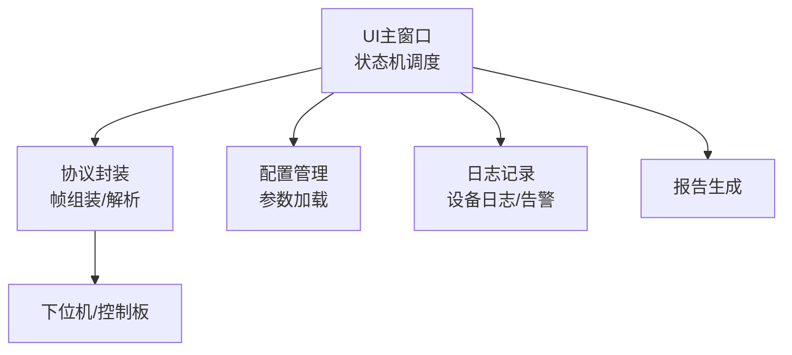
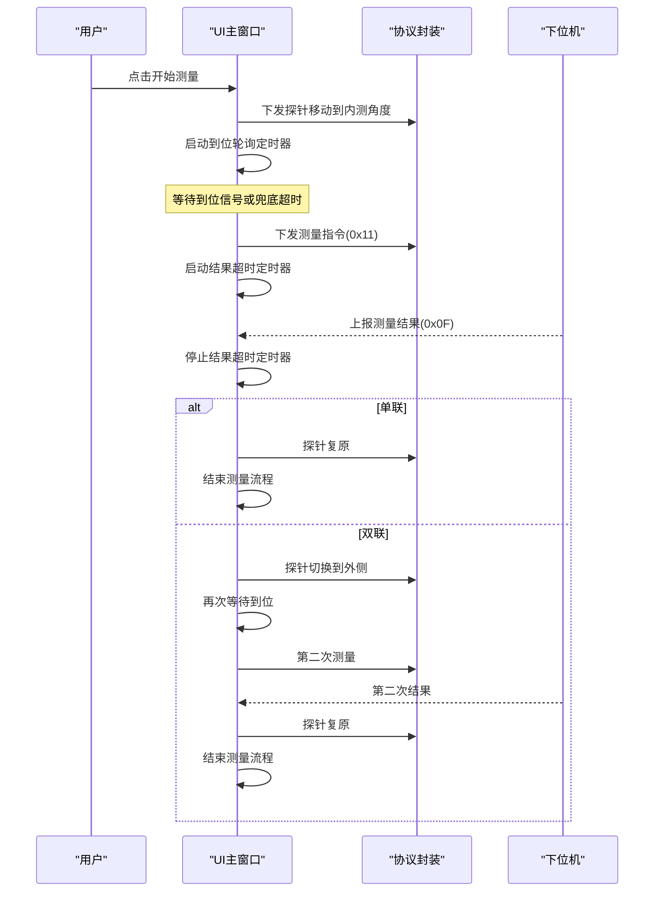
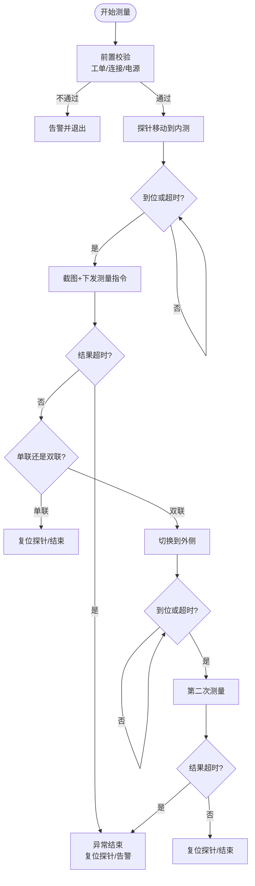
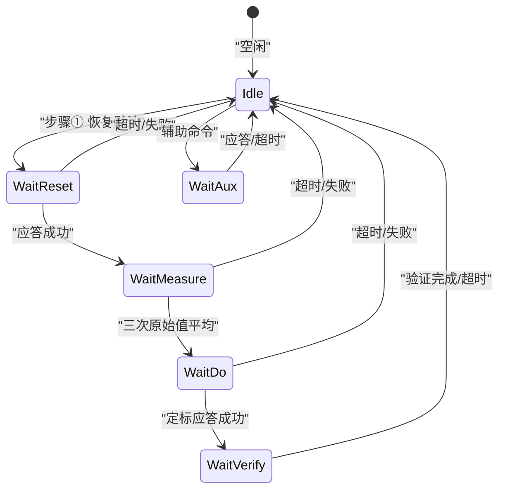
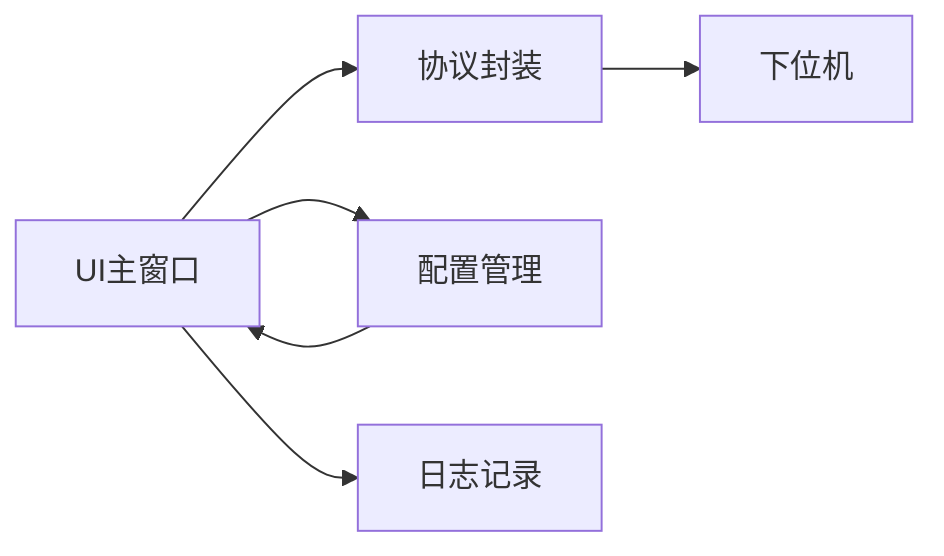

# 状态机控制

<cite>
**本文引用的文件**
- [main.cpp](file://Insulator_Zero_Value_Detection_Robot/main.cpp)
- [Insulator_Zero_Value_Detection_Robot.h](file://Insulator_Zero_Value_Detection_Robot/UI/Insulator_Zero_Value_Detection_Robot.h)
- [Insulator_Zero_Value_Detection_Robot.cpp](file://Insulator_Zero_Value_Detection_Robot/UI/Insulator_Zero_Value_Detection_Robot.cpp)
- [WHSDControlBoradProtocol.cpp](file://Insulator_Zero_Value_Detection_Robot/Protocol/WHSDControlBoradProtocol.cpp)
- [ConfigManager.cpp](file://Insulator_Zero_Value_Detection_Robot/Config/ConfigManager.cpp)
- [单点定标协议与流程_V1.0.html](file://Insulator_Zero_Value_Detection_Robot/单点定标协议与流程_V1.0.html)
</cite>

## 目录
1. [简介](#简介)
2. [项目结构](#项目结构)
3. [核心组件](#核心组件)
4. [架构总览](#架构总览)
5. [详细组件分析](#详细组件分析)
6. [依赖关系分析](#依赖关系分析)
7. [性能考虑](#性能考虑)
8. [故障诊断与排错指南](#故障诊断与排错指南)
9. [结论](#结论)
10. [附录：测试方法与调试技巧](#附录测试方法与调试技巧)

## 简介
本文件面向绝缘子零值检测机器人的“状态机控制”主题，系统化梳理并说明两类关键状态机：
- 测量流程状态机：负责一次检测的完整生命周期（准备就绪、检测中、暂停/等待、完成、异常恢复）。
- 校准流程状态机：负责X值单点定标的步骤化流程（空闲、等待应答/回报、执行、验证、辅助命令等）。

文档重点包括：
- 状态定义与转换条件（事件驱动、超时兜底、互斥保护）
- 异常处理机制（错误状态、自动恢复、重置）
- 监控与调试（日志、告警、实时提示）
- 扩展性设计（新增检测流程、自定义状态）
- 测试方法与调试技巧

## 项目结构
本项目采用分层组织：UI层负责交互与状态机调度；协议层封装设备通信帧；配置模块提供运行参数；日志与报告用于可观测性与追溯。

**图表来源**
- [Insulator_Zero_Value_Detection_Robot.h:26-28](file://Insulator_Zero_Value_Detection_Robot/UI/Insulator_Zero_Value_Detection_Robot.h#L26-L28)
- [Insulator_Zero_Value_Detection_Robot.cpp:2030-2149](file://Insulator_Zero_Value_Detection_Robot/UI/Insulator_Zero_Value_Detection_Robot.cpp#L2030-L2149)
- [WHSDControlBoradProtocol.cpp:631-677](file://Insulator_Zero_Value_Detection_Robot/Protocol/WHSDControlBoradProtocol.cpp#L631-L677)
- [ConfigManager.cpp:43-118](file://Insulator_Zero_Value_Detection_Robot/Config/ConfigManager.cpp#L43-L118)

**章节来源**
- [main.cpp:11-24](file://Insulator_Zero_Value_Detection_Robot/main.cpp#L11-L24)
- [Insulator_Zero_Value_Detection_Robot.h:26-28](file://Insulator_Zero_Value_Detection_Robot/UI/Insulator_Zero_Value_Detection_Robot.h#L26-L28)

## 核心组件
- 测量流程状态机
  - 状态：空闲(0)、内测等待(1)、外侧等待(2)
  - 事件：探针到位、测量结果返回、超时、断连/断电
  - 动作：探针移动、截图、下发测量指令、复位探针、关闭等待窗、恢复按钮
- 校准流程状态机
  - 状态：空闲、等待恢复默认、等待原始值回报、等待定标应答、等待验证回报、等待辅助命令应答
  - 事件：命令应答、测量回报、超时
  - 动作：发送命令、更新步骤状态、终止等待、回写系数校验

**章节来源**
- [Insulator_Zero_Value_Detection_Robot.h:294-325](file://Insulator_Zero_Value_Detection_Robot/UI/Insulator_Zero_Value_Detection_Robot.h#L294-L325)
- [Insulator_Zero_Value_Detection_Robot.cpp:2186-2233](file://Insulator_Zero_Value_Detection_Robot/UI/Insulator_Zero_Value_Detection_Robot.cpp#L2186-L2233)
- [Insulator_Zero_Value_Detection_Robot.cpp:873-892](file://Insulator_Zero_Value_Detection_Robot/UI/Insulator_Zero_Value_Detection_Robot.cpp#L873-L892)

## 架构总览
测量流程由UI触发，进入“等待探针到位”轮询；到位或超时后触发测量并启动“结果超时”定时器；收到结果后根据单联/双联推进到下一步或结束；异常时统一走AbortMeasure进行清理与告警。

**图表来源**
- [Insulator_Zero_Value_Detection_Robot.cpp:2030-2149](file://Insulator_Zero_Value_Detection_Robot/UI/Insulator_Zero_Value_Detection_Robot.cpp#L2030-L2149)
- [Insulator_Zero_Value_Detection_Robot.cpp:2186-2233](file://Insulator_Zero_Value_Detection_Robot/UI/Insulator_Zero_Value_Detection_Robot.cpp#L2186-L2233)
- [WHSDControlBoradProtocol.cpp:631-677](file://Insulator_Zero_Value_Detection_Robot/Protocol/WHSDControlBoradProtocol.cpp#L631-L677)

## 详细组件分析

### 测量流程状态机
- 状态定义
  - 空闲：m_nMeasureStep == 0，允许开始新测量
  - 内测等待：m_nMeasureStep == 1，等待第一次测量结果
  - 外侧等待：m_nMeasureStep == 2，等待第二次测量结果
- 转换条件
  - 开始测量：On_Test_Click 前置校验通过（工单已加载、未重复触发、控制板连接且电源未确认关闭）
  - 探针到位：StartProbeMoveAndWait 启动轮询，On_ProbeWaitTick 判断到位标志或超时
  - 结果到达：CallBack_ZeroValue 将回调切到UI线程调用 OnMeasureResult
  - 超时：On_MeasureTimeout 在MEASURE_RESULT_TIMEOUT_MS内未收到0x0F则中止
  - 异常：断连或电源关闭时 AbortMeasure 清理并告警
- 关键实现要点
  - 防重入：检查 m_nMeasureStep 与探针等待定时器是否活跃
  - 互斥：测量期间禁用相关UI控件，避免误操作
  - 安全：异常时复位探针、关闭等待弹窗、恢复按钮、记录告警

**图表来源**
- [Insulator_Zero_Value_Detection_Robot.cpp:2030-2149](file://Insulator_Zero_Value_Detection_Robot/UI/Insulator_Zero_Value_Detection_Robot.cpp#L2030-L2149)
- [Insulator_Zero_Value_Detection_Robot.cpp:2186-2233](file://Insulator_Zero_Value_Detection_Robot/UI/Insulator_Zero_Value_Detection_Robot.cpp#L2186-L2233)

**章节来源**
- [Insulator_Zero_Value_Detection_Robot.cpp:2030-2149](file://Insulator_Zero_Value_Detection_Robot/UI/Insulator_Zero_Value_Detection_Robot.cpp#L2030-L2149)
- [Insulator_Zero_Value_Detection_Robot.cpp:2186-2233](file://Insulator_Zero_Value_Detection_Robot/UI/Insulator_Zero_Value_Detection_Robot.cpp#L2186-L2233)
- [Insulator_Zero_Value_Detection_Robot.h:294-313](file://Insulator_Zero_Value_Detection_Robot/UI/Insulator_Zero_Value_Detection_Robot.h#L294-L313)

### 校准流程状态机
- 状态定义
  - eCalibIdle：空闲，可发起步骤①
  - eCalibWaitReset：等待恢复默认应答
  - eCalibWaitMeasure：等待原始值回报（连测3次取平均）
  - eCalibWaitDo：等待定标应答（写Flash需1~2秒）
  - eCalibWaitVerify：等待修正值回报（验证）
  - eCalibWaitAux：等待辅助命令应答（读回系数/离线抽查）
- 转换条件
  - 进入等待：CalibStartWait 设置状态、启动单次超时定时器、禁用UI
  - 正常完成：对应应答/回报到达，更新步骤状态，CalibStopWait 回到空闲
  - 超时：On_CalibTimeout 按当前步骤记录错误信息并结束等待
- 关键实现要点
  - 顺序执行：上一步未完成不允许进入下一步
  - 互斥：测量流程进行中拒绝进入校准等待态，避免0x0F结果分流冲突
  - 健壮性：对Flash写失败、参数非法等错误码给出明确提示

**图表来源**
- [Insulator_Zero_Value_Detection_Robot.h:317-325](file://Insulator_Zero_Value_Detection_Robot/UI/Insulator_Zero_Value_Detection_Robot.h#L317-L325)
- [Insulator_Zero_Value_Detection_Robot.cpp:873-892](file://Insulator_Zero_Value_Detection_Robot/UI/Insulator_Zero_Value_Detection_Robot.cpp#L873-L892)
- [Insulator_Zero_Value_Detection_Robot.cpp:1267-1313](file://Insulator_Zero_Value_Detection_Robot/UI/Insulator_Zero_Value_Detection_Robot.cpp#L1267-L1313)

**章节来源**
- [Insulator_Zero_Value_Detection_Robot.h:317-325](file://Insulator_Zero_Value_Detection_Robot/UI/Insulator_Zero_Value_Detection_Robot.h#L317-L325)
- [Insulator_Zero_Value_Detection_Robot.cpp:873-892](file://Insulator_Zero_Value_Detection_Robot/UI/Insulator_Zero_Value_Detection_Robot.cpp#L873-L892)
- [Insulator_Zero_Value_Detection_Robot.cpp:1267-1313](file://Insulator_Zero_Value_Detection_Robot/UI/Insulator_Zero_Value_Detection_Robot.cpp#L1267-L1313)

### 异常处理与恢复
- 测量异常
  - 触发时机：断连、电源关闭、结果超时
  - 处理动作：停止所有测量相关定时器、复位探针、隐藏等待窗、恢复按钮、记录告警
- 校准异常
  - 触发时机：各步骤超时、Flash写失败、参数非法
  - 处理动作：记录错误原因、结束等待、回到空闲、提示重试

**章节来源**
- [Insulator_Zero_Value_Detection_Robot.cpp:2141-2178](file://Insulator_Zero_Value_Detection_Robot/UI/Insulator_Zero_Value_Detection_Robot.cpp#L2141-L2178)
- [Insulator_Zero_Value_Detection_Robot.cpp:1267-1313](file://Insulator_Zero_Value_Detection_Robot/UI/Insulator_Zero_Value_Detection_Robot.cpp#L1267-L1313)

### 监控与调试
- 实时提示
  - 测量等待弹窗显示当前阶段文本，不可关闭直到流程结束
  - 叠加标签显示当前检测结果数值
- 日志记录
  - 设备日志记录关键节点（开始测量、发送指令、结果到达、异常结束）
  - 校准流程追加日志到专用区域，便于逐条核对
- 告警面板
  - 统一插入告警条目（时间/类型/位置/详情/状态），便于快速定位问题

**章节来源**
- [Insulator_Zero_Value_Detection_Robot.cpp:2062-2071](file://Insulator_Zero_Value_Detection_Robot/UI/Insulator_Zero_Value_Detection_Robot.cpp#L2062-L2071)
- [Insulator_Zero_Value_Detection_Robot.cpp:675-698](file://Insulator_Zero_Value_Detection_Robot/UI/Insulator_Zero_Value_Detection_Robot.cpp#L675-L698)
- [Insulator_Zero_Value_Detection_Robot.cpp:2174-2178](file://Insulator_Zero_Value_Detection_Robot/UI/Insulator_Zero_Value_Detection_Robot.cpp#L2174-L2178)

### 扩展性设计
- 新增检测流程
  - 在状态机中增加新状态与转换条件，复用 StartProbeMoveAndWait/TriggerMeasureAndArm/AbortMeasure 等通用能力
  - 通过配置项（如角度、速度）解耦硬件参数，便于不同机型适配
- 自定义状态
  - 使用枚举或整型状态变量集中管理，配合统一的等待/超时机制，降低耦合度
  - 通过信号槽将协议线程回调切到UI线程处理，保证线程安全

**章节来源**
- [Insulator_Zero_Value_Detection_Robot.h:188-197](file://Insulator_Zero_Value_Detection_Robot/UI/Insulator_Zero_Value_Detection_Robot.h#L188-L197)
- [Insulator_Zero_Value_Detection_Robot.cpp:2073-2149](file://Insulator_Zero_Value_Detection_Robot/UI/Insulator_Zero_Value_Detection_Robot.cpp#L2073-L2149)

## 依赖关系分析
- UI主窗口依赖协议封装发送/接收帧，依赖配置模块读取运行参数，依赖日志模块记录过程数据
- 协议封装负责帧组装与校验和计算，确保与下位机通信一致性
- 配置模块从XML加载控制板参数（心跳间隔、角度、速度、阈值等）

**图表来源**
- [Insulator_Zero_Value_Detection_Robot.h:26-28](file://Insulator_Zero_Value_Detection_Robot/UI/Insulator_Zero_Value_Detection_Robot.h#L26-L28)
- [WHSDControlBoradProtocol.cpp:631-677](file://Insulator_Zero_Value_Detection_Robot/Protocol/WHSDControlBoradProtocol.cpp#L631-L677)
- [ConfigManager.cpp:43-118](file://Insulator_Zero_Value_Detection_Robot/Config/ConfigManager.cpp#L43-L118)

**章节来源**
- [Insulator_Zero_Value_Detection_Robot.h:26-28](file://Insulator_Zero_Value_Detection_Robot/UI/Insulator_Zero_Value_Detection_Robot.h#L26-L28)
- [WHSDControlBoradProtocol.cpp:631-677](file://Insulator_Zero_Value_Detection_Robot/Protocol/WHSDControlBoradProtocol.cpp#L631-L677)
- [ConfigManager.cpp:43-118](file://Insulator_Zero_Value_Detection_Robot/Config/ConfigManager.cpp#L43-L118)

## 性能考虑
- 轮询与超时
  - 到位轮询周期与兜底超时平衡响应速度与资源占用
  - 结果超时避免长时间阻塞，及时释放资源并告警
- 线程安全
  - 协议回调切到UI线程处理，避免跨线程直接修改UI状态
  - 原子变量与互斥锁保护共享状态（如录像缓冲、探针到位标志）
- I/O优化
  - 仅在必要时发送指令，减少总线负载
  - 批量操作（如三次测量）合并处理，提升效率

[本节为通用指导，无需特定文件引用]

## 故障诊断与排错指南
- 常见问题定位
  - 控制板未连接：开始测量前检查连接状态，避免进入等待弹窗无法退出
  - 总电源未开启：若心跳确认电源关闭，禁止进入测量流程
  - 结果超时：检查链路、心跳、设备供电与传感器模块是否正常
- 排查步骤
  - 查看设备日志中的关键节点（开始测量、发送指令、结果到达、异常结束）
  - 观察告警面板，获取异常类型与位置信息
  - 校准流程中核对错误原因码（如Flash写失败、参数非法）
- 恢复措施
  - 异常结束时自动复位探针，恢复UI可用状态
  - 校准失败后重新执行相应步骤，确保数据一致性

**章节来源**
- [Insulator_Zero_Value_Detection_Robot.cpp:2052-2060](file://Insulator_Zero_Value_Detection_Robot/UI/Insulator_Zero_Value_Detection_Robot.cpp#L2052-L2060)
- [Insulator_Zero_Value_Detection_Robot.cpp:2141-2178](file://Insulator_Zero_Value_Detection_Robot/UI/Insulator_Zero_Value_Detection_Robot.cpp#L2141-L2178)
- [Insulator_Zero_Value_Detection_Robot.cpp:1267-1313](file://Insulator_Zero_Value_Detection_Robot/UI/Insulator_Zero_Value_Detection_Robot.cpp#L1267-L1313)

## 结论
该项目的状态机控制以UI为主调度中心，结合协议封装与配置管理，实现了测量与校准两大流程的可靠闭环。通过事件驱动、超时兜底、异常恢复与完善的监控调试手段，保证了检测过程的稳定性与可维护性。扩展性方面，通过模块化设计与通用能力复用，便于新增检测流程与自定义状态。

[本节为总结性内容，无需特定文件引用]

## 附录：测试方法与调试技巧
- 单元测试建议
  - 模拟协议回调，验证状态转换逻辑（空闲→内测等待→外侧等待→完成）
  - 注入超时与断连事件，验证异常路径与恢复行为
- 集成测试建议
  - 使用真实设备链路，覆盖正常流程与异常场景（电源关闭、链路中断）
  - 校准流程端到端验证：恢复默认→测原始值→定标→验证→读回系数
- 调试技巧
  - 启用设备日志与告警面板，关注关键节点与错误码
  - 使用叠加标签与等待弹窗文本，直观观察当前状态
  - 校准流程中利用HEX日志与协议文档示例帧比对，快速定位通信问题

**章节来源**
- [Insulator_Zero_Value_Detection_Robot.cpp:675-698](file://Insulator_Zero_Value_Detection_Robot/UI/Insulator_Zero_Value_Detection_Robot.cpp#L675-L698)
- [Insulator_Zero_Value_Detection_Robot.cpp:2174-2178](file://Insulator_Zero_Value_Detection_Robot/UI/Insulator_Zero_Value_Detection_Robot.cpp#L2174-L2178)
- [单点定标协议与流程_V1.0.html:93-138](file://Insulator_Zero_Value_Detection_Robot/单点定标协议与流程_V1.0.html#L93-L138)