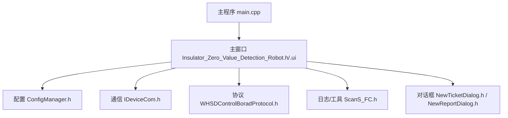
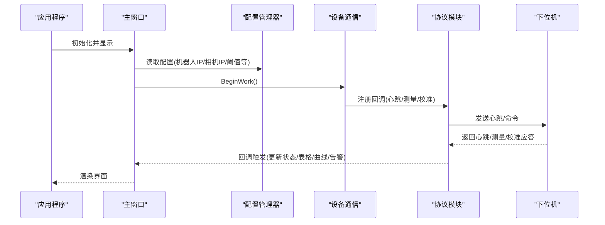
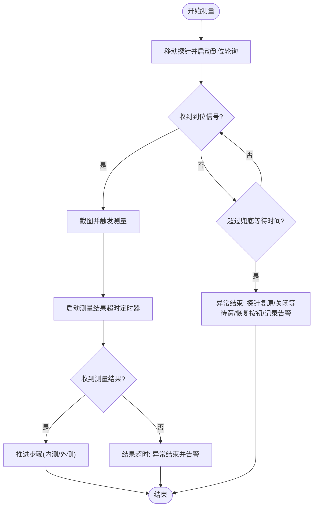
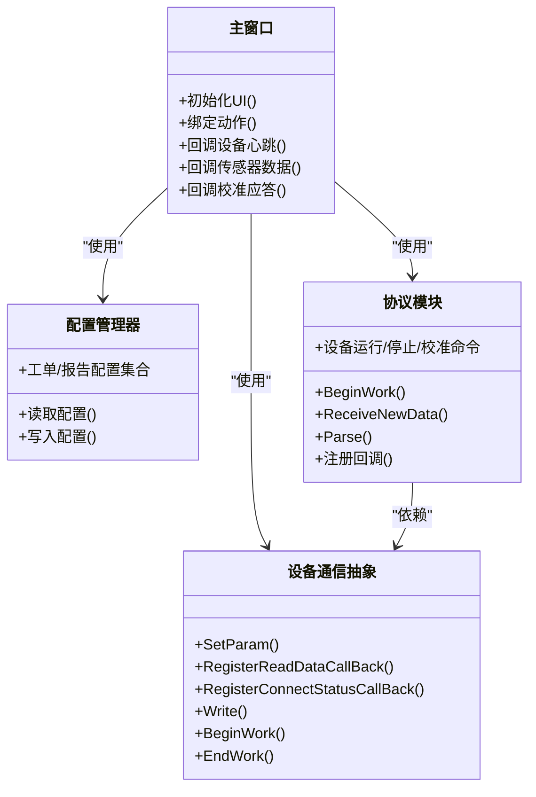

# 用户手册

<cite>
**本文引用的文件**
- [README.md](file://README.md)
- [main.cpp](file://Insulator_Zero_Value_Detection_Robot/main.cpp)
- [Insulator_Zero_Value_Detection_Robot.h](file://Insulator_Zero_Value_Detection_Robot/UI/Insulator_Zero_Value_Detection_Robot.h)
- [Insulator_Zero_Value_Detection_Robot.ui](file://Insulator_Zero_Value_Detection_Robot/UI/Insulator_Zero_Value_Detection_Robot.ui)
- [NewTicketDialog.h](file://Insulator_Zero_Value_Detection_Robot/UI/NewTicketDialog.h)
- [NewReportDialog.h](file://Insulator_Zero_Value_Detection_Robot/UI/NewReportDialog.h)
- [ConfigManager.h](file://Insulator_Zero_Value_Detection_Robot/Config/ConfigManager.h)
- [IDeviceCom.h](file://Insulator_Zero_Value_Detection_Robot/DeviceCom/IDeviceCom.h)
- [WHSDControlBoradProtocol.h](file://Insulator_Zero_Value_Detection_Robot/Protocol/WHSDControlBoradProtocol.h)
- [ScanS_FC.h](file://Insulator_Zero_Value_Detection_Robot/Log/ScanS_FC.h)
- [操作说明书.md](file://操作说明书.md)
</cite>

## 目录
1. [简介](#简介)
2. [项目结构](#项目结构)
3. [核心组件](#核心组件)
4. [架构总览](#架构总览)
5. [详细组件分析](#详细组件分析)
6. [依赖关系分析](#依赖关系分析)
7. [性能与稳定性建议](#性能与稳定性建议)
8. [故障排除指南](#故障排除指南)
9. [结论](#结论)
10. [附录：标准作业流程与快捷键](#附录：标准作业流程与快捷键)

## 简介
本手册面向绝缘子零值检测机器人V2的用户，帮助快速上手软件界面、完成检测工作、管理工单与报告、进行设备校准与日常维护。软件基于Qt构建，提供实时检测、工单管理、检测报告生成、系统设置与校准等功能，支持键盘与手柄控制，具备完善的超时保护与异常处理机制。

## 项目结构
软件采用分层模块化设计：
- UI层：主窗口、对话框、图表与表格控件，负责交互展示与用户输入
- 配置层：参数与工单/报告配置的读写
- 通信层：设备通信抽象接口与协议解析
- 协议层：控制板协议封装（电机、传感器、心跳、校准等）
- 日志与工具：时间、转换、日志记录等通用能力

图示来源
- [main.cpp:11-23](file://Insulator_Zero_Value_Detection_Robot/main.cpp#L11-L23)
- [Insulator_Zero_Value_Detection_Robot.h:26-140](file://Insulator_Zero_Value_Detection_Robot/UI/Insulator_Zero_Value_Detection_Robot.h#L26-L140)
- [ConfigManager.h:185-199](file://Insulator_Zero_Value_Detection_Robot/Config/ConfigManager.h#L185-L199)
- [IDeviceCom.h:4-15](file://Insulator_Zero_Value_Detection_Robot/DeviceCom/IDeviceCom.h#L4-L15)
- [WHSDControlBoradProtocol.h:189-356](file://Insulator_Zero_Value_Detection_Robot/Protocol/WHSDControlBoradProtocol.h#L189-L356)
- [ScanS_FC.h:132-367](file://Insulator_Zero_Value_Detection_Robot/Log/ScanS_FC.h#L132-L367)
- [NewTicketDialog.h:10-35](file://Insulator_Zero_Value_Detection_Robot/UI/NewTicketDialog.h#L10-L35)
- [NewReportDialog.h:10-31](file://Insulator_Zero_Value_Detection_Robot/UI/NewReportDialog.h#L10-L31)

章节来源
- [main.cpp:11-23](file://Insulator_Zero_Value_Detection_Robot/main.cpp#L11-L23)
- [Insulator_Zero_Value_Detection_Robot.ui:1-800](file://Insulator_Zero_Value_Detection_Robot/UI/Insulator_Zero_Value_Detection_Robot.ui#L1-L800)

## 核心组件
- 主窗口：承载“实时检测”“工单管理”“检测报告”“系统设置”四大功能页签；包含状态显示区、控制面板、数据表格与曲线图、告警面板等
- 配置管理器：集中管理控制板参数、相机参数、工单与报告配置
- 设备通信抽象：统一接入不同通信后端，注册回调与连接状态监听
- 协议模块：封装控制板命令（电机控制、传感器读取、心跳、校准等），提供回调分发
- 对话框：新建/编辑工单、新建/编辑报告的弹窗
- 日志与工具：时间处理、字符串转换、临界区同步等

章节来源
- [Insulator_Zero_Value_Detection_Robot.h:26-140](file://Insulator_Zero_Value_Detection_Robot/UI/Insulator_Zero_Value_Detection_Robot.h#L26-L140)
- [ConfigManager.h:10-199](file://Insulator_Zero_Value_Detection_Robot/Config/ConfigManager.h#L10-L199)
- [IDeviceCom.h:4-15](file://Insulator_Zero_Value_Detection_Robot/DeviceCom/IDeviceCom.h#L4-L15)
- [WHSDControlBoradProtocol.h:189-356](file://Insulator_Zero_Value_Detection_Robot/Protocol/WHSDControlBoradProtocol.h#L189-L356)
- [NewTicketDialog.h:10-35](file://Insulator_Zero_Value_Detection_Robot/UI/NewTicketDialog.h#L10-L35)
- [NewReportDialog.h:10-31](file://Insulator_Zero_Value_Detection_Robot/UI/NewReportDialog.h#L10-L31)

## 架构总览
软件启动后创建主窗口并进入事件循环。UI通过配置管理器加载/保存参数，通过设备通信抽象与协议层下发指令，接收心跳与测量结果，驱动界面更新与数据可视化。

图示来源
- [main.cpp:11-23](file://Insulator_Zero_Value_Detection_Robot/main.cpp#L11-L23)
- [Insulator_Zero_Value_Detection_Robot.h:142-161](file://Insulator_Zero_Value_Detection_Robot/UI/Insulator_Zero_Value_Detection_Robot.h#L142-L161)
- [WHSDControlBoradProtocol.h:198-216](file://Insulator_Zero_Value_Detection_Robot/Protocol/WHSDControlBoradProtocol.h#L198-L216)
- [IDeviceCom.h:9-14](file://Insulator_Zero_Value_Detection_Robot/DeviceCom/IDeviceCom.h#L9-L14)

## 详细组件分析

### 主窗口与界面布局
- 顶部导航按钮：实时检测、工单管理、检测报告、系统设置
- 左侧面板：工单详情（线路名称、杆塔号、号侧/相别选择、检测/复检按钮）
- 右侧区域：设备状态显示（连接状态、行走电机、电池电量、固件信息等）、手动控制（前进/后退/探针角度/停止/测量）、阻值单点校准区
- 底部/中部：数据表格与曲线图（按片数与列头组织）、告警表（时间/类型/位置/详情/状态）

章节来源
- [Insulator_Zero_Value_Detection_Robot.ui:1-800](file://Insulator_Zero_Value_Detection_Robot/UI/Insulator_Zero_Value_Detection_Robot.ui#L1-L800)
- [Insulator_Zero_Value_Detection_Robot.h:26-140](file://Insulator_Zero_Value_Detection_Robot/UI/Insulator_Zero_Value_Detection_Robot.h#L26-L140)

### 实时监控界面使用
- 设备状态显示：连接状态、各电机状态、电池百分比、固件版本信息，由心跳数据刷新
- 电池电量监控：以百分比形式显示，低电量时注意及时充电
- 通信质量指示：连接状态变化提示；若长时间无心跳或频繁断开，检查网络与IP设置
- 数据可视化：表格逐片记录测量值，曲线实时更新趋势；可疑片可复检并移除最近一次值重测

章节来源
- [WHSDControlBoradProtocol.h:121-187](file://Insulator_Zero_Value_Detection_Robot/Protocol/WHSDControlBoradProtocol.h#L121-L187)
- [Insulator_Zero_Value_Detection_Robot.h:225-247](file://Insulator_Zero_Value_Detection_Robot/UI/Insulator_Zero_Value_Detection_Robot.h#L225-L247)

### 检测工作流程（从启动到报告）
1. 启动软件，确认机器人“连接状态”正常
2. 系统设置：核对探针角度、绝缘阈值、电机/舵机速度等参数
3. （可选）阻值单点校准，确保测量模块读数准确
4. 工单管理：新增/选择工单 → 点击“加载”
5. 实时检测：选择“号侧 + 相别”
6. 点击“检测”，等待自动测量流程完成（内测→外侧，含超时保护）
7. 逐片测量：每测完一片，行走机器人到下一片位置，重复检测
8. 可疑片使用“复检”重测
9. 全部测完 → 工单管理/检测报告：点击“生成报告”
10. 检测报告：查询、下载报告

章节来源
- [操作说明书.md:395-419](file://操作说明书.md#L395-L419)
- [Insulator_Zero_Value_Detection_Robot.h:177-197](file://Insulator_Zero_Value_Detection_Robot/UI/Insulator_Zero_Value_Detection_Robot.h#L177-L197)

### 工单管理功能
- 创建新工单：打开“新建工单”对话框，填写线路名称、杆塔号、串数、绝缘子片数、回路数、交直流类型、检测人员/单位、备注等，确认后生成唯一工单编号
- 加载现有工单：在工单列表中选择目标行，点击“加载”将当前工单信息填充至左侧面板
- 编辑工单信息：选中工单后修改必要字段，保存后同步至配置存储
- 删除工单：选中后删除，并自动重排序号列保持连续
- 查询与过滤：通过输入框对工单列表进行筛选

章节来源
- [NewTicketDialog.h:10-35](file://Insulator_Zero_Value_Detection_Robot/UI/NewTicketDialog.h#L10-L35)
- [ConfigManager.h:52-183](file://Insulator_Zero_Value_Detection_Robot/Config/ConfigManager.h#L52-L183)
- [Insulator_Zero_Value_Detection_Robot.h:203-207](file://Insulator_Zero_Value_Detection_Robot/UI/Insulator_Zero_Value_Detection_Robot.h#L203-L207)

### 检测报告功能
- 新建报告：填写报告编号、检测单位、检测人员、作业地点等信息
- 生成报告：在工单或报告页面点击“生成报告”，根据当前工单数据生成报告文件
- 查询与下载：在报告列表中查询历史报告，支持导出与查看

章节来源
- [NewReportDialog.h:10-31](file://Insulator_Zero_Value_Detection_Robot/UI/NewReportDialog.h#L10-L31)
- [ConfigManager.h:39-50](file://Insulator_Zero_Value_Detection_Robot/Config/ConfigManager.h#L39-L50)

### 校准功能（阻值单点校准）
- 校准前准备：在“系统设置”页面的“阻值单点校准”区输入标准电阻值（建议500~1000 MΩ），接入标准电阻并预热稳定
- 步骤① 恢复默认：清空旧校准系数，使测量通道直通
- 步骤② 测原始值：自动连测3次原始值并取平均
- 步骤③ 下发定标：将标准值与原始值平均值下发，固件计算补偿系数并写入Flash（掉电保存）
- 步骤④ 验证：触发实测对比修正值与标准值，或离线抽查核对
- 辅助：读回系数用于核对Flash中已存系数
- 注意事项：
  - 步骤间顺序执行，上一步未完成下一步不可操作
  - 校准与工单测量互斥
  - 各步骤有超时保护，失败会在流程日志中提示原因码

章节来源
- [操作说明书.md:342-392](file://操作说明书.md#L342-L392)
- [Insulator_Zero_Value_Detection_Robot.h:108-127](file://Insulator_Zero_Value_Detection_Robot/UI/Insulator_Zero_Value_Detection_Robot.h#L108-L127)
- [WHSDControlBoradProtocol.h:256-287](file://Insulator_Zero_Value_Detection_Robot/Protocol/WHSDControlBoradProtocol.h#L256-L287)

### 键盘与手柄操作对照
- Q：探针向内（内测）
- E：探针向外（外侧）
- R：探针复原
- A/←：行走向左（按住运动，松开停止）
- D/→：行走向右（按住运动，松开停止）
- S：停止
- 空格：开始测量（等同点击“检测”）

章节来源
- [操作说明书.md:422-441](file://操作说明书.md#L422-L441)
- [Insulator_Zero_Value_Detection_Robot.h:213-215](file://Insulator_Zero_Value_Detection_Robot/UI/Insulator_Zero_Value_Detection_Robot.h#L213-L215)

### 测量流程状态机（到位轮询 + 结果超时）

图示来源
- [Insulator_Zero_Value_Detection_Robot.h:188-197](file://Insulator_Zero_Value_Detection_Robot/UI/Insulator_Zero_Value_Detection_Robot.h#L188-L197)
- [Insulator_Zero_Value_Detection_Robot.h:294-313](file://Insulator_Zero_Value_Detection_Robot/UI/Insulator_Zero_Value_Detection_Robot.h#L294-L313)

## 依赖关系分析
- 主窗口依赖配置管理器、设备通信抽象、协议模块、日志工具
- 协议模块依赖通信抽象，负责心跳、测量、校准等命令的收发与回调
- 对话框依赖配置模型，用于工单与报告数据的录入与传递
- 日志工具提供时间与字符串处理能力，支撑计时与格式化输出

图示来源
- [Insulator_Zero_Value_Detection_Robot.h:26-140](file://Insulator_Zero_Value_Detection_Robot/UI/Insulator_Zero_Value_Detection_Robot.h#L26-L140)
- [ConfigManager.h:185-199](file://Insulator_Zero_Value_Detection_Robot/Config/ConfigManager.h#L185-L199)
- [IDeviceCom.h:4-15](file://Insulator_Zero_Value_Detection_Robot/DeviceCom/IDeviceCom.h#L4-L15)
- [WHSDControlBoradProtocol.h:189-356](file://Insulator_Zero_Value_Detection_Robot/Protocol/WHSDControlBoradProtocol.h#L189-L356)

章节来源
- [Insulator_Zero_Value_Detection_Robot.h:26-140](file://Insulator_Zero_Value_Detection_Robot/UI/Insulator_Zero_Value_Detection_Robot.h#L26-L140)
- [ConfigManager.h:185-199](file://Insulator_Zero_Value_Detection_Robot/Config/ConfigManager.h#L185-L199)
- [IDeviceCom.h:4-15](file://Insulator_Zero_Value_Detection_Robot/DeviceCom/IDeviceCom.h#L4-L15)
- [WHSDControlBoradProtocol.h:189-356](file://Insulator_Zero_Value_Detection_Robot/Protocol/WHSDControlBoradProtocol.h#L189-L356)

## 性能与稳定性建议
- 合理设置超时参数：测量约6秒、写Flash约5秒、普通命令约3秒，避免误判失败
- 避免并发冲突：校准与工单测量互斥，防止状态混乱
- 网络与IP：修改机器人/摄像头IP后立即生效，必要时重启软件使新配置生效
- 数据备份：定期导出检测报告与工单数据，便于追溯与分析
- 资源占用：录制视频与实时流同时运行时注意内存与帧率，必要时降低分辨率或帧率

[本节为通用指导，不直接分析具体文件]

## 故障排除指南
- 无法连接设备
  - 检查机器人IP与端口是否正确
  - 查看“连接状态”是否为“未连接”，尝试重新连接
  - 确认防火墙或网络策略允许通信
- 心跳丢失或频繁断开
  - 检查网络稳定性与线缆连接
  - 观察电池电量是否过低导致设备休眠
- 测量结果异常
  - 执行阻值单点校准，确认标准电阻接入正确
  - 检查探针角度与绝缘阈值设置
  - 查看流程日志中的错误原因码（如原始值超时、参数非法等）
- 报告生成失败
  - 确认工单数据完整（线路、杆塔、片数、相别等）
  - 检查存储空间与权限

章节来源
- [操作说明书.md:342-392](file://操作说明书.md#L342-L392)
- [Insulator_Zero_Value_Detection_Robot.h:199-201](file://Insulator_Zero_Value_Detection_Robot/UI/Insulator_Zero_Value_Detection_Robot.h#L199-L201)
- [WHSDControlBoradProtocol.h:256-287](file://Insulator_Zero_Value_Detection_Robot/Protocol/WHSDControlBoradProtocol.h#L256-L287)

## 结论
本手册介绍了绝缘子零值检测机器人V2的软件界面、操作流程、工单与报告管理、校准方法与常见问题处理。按照标准作业流程与快捷键操作，可高效完成检测任务并生成可靠报告。建议在每次检测前进行参数核对与必要校准，确保测量准确性与设备稳定性。

[本节为总结性内容，不直接分析具体文件]

## 附录：标准作业流程与快捷键
- 标准作业流程见第9章，涵盖从启动到报告生成的完整步骤
- 快捷键与手柄操作对照见第10章，便于现场快速操控

章节来源
- [操作说明书.md:395-441](file://操作说明书.md#L395-L441)