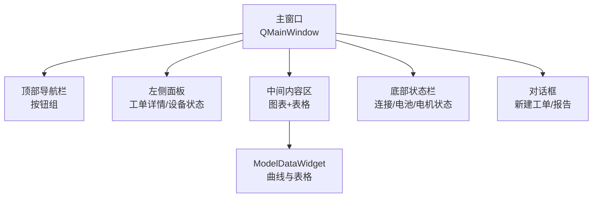
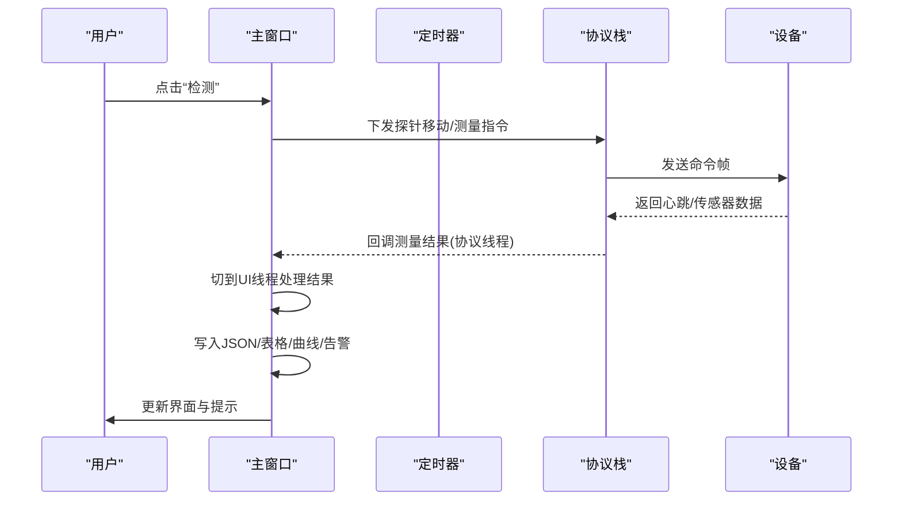
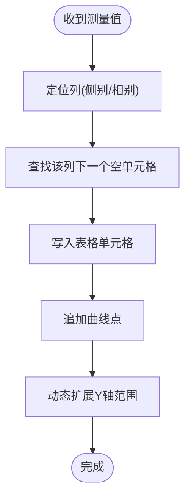
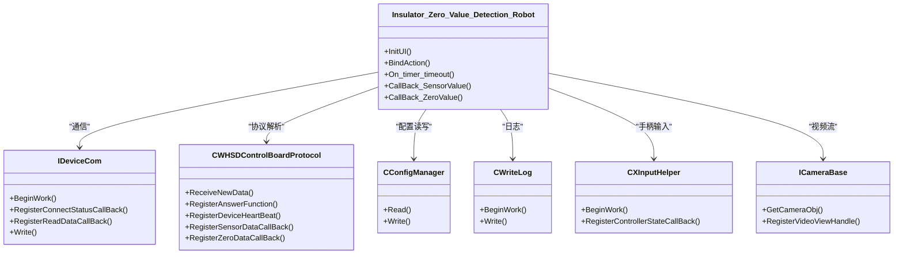

# 界面概览

<cite>
**本文引用的文件**
- [Insulator_Zero_Value_Detection_Robot.ui](file://Insulator_Zero_Value_Detection_Robot/UI/Insulator_Zero_Value_Detection_Robot.ui)
- [Insulator_Zero_Value_Detection_Robot.h](file://Insulator_Zero_Value_Detection_Robot/UI/Insulator_Zero_Value_Detection_Robot.h)
- [Insulator_Zero_Value_Detection_Robot.cpp](file://Insulator_Zero_Value_Detection_Robot/UI/Insulator_Zero_Value_Detection_Robot.cpp)
- [contentwidget.h](file://Insulator_Zero_Value_Detection_Robot/UI/contentwidget.h)
- [contentwidget.cpp](file://Insulator_Zero_Value_Detection_Robot/UI/contentwidget.cpp)
- [modeldatawidget.h](file://Insulator_Zero_Value_Detection_Robot/UI/modeldatawidget.h)
- [modeldatawidget.cpp](file://Insulator_Zero_Value_Detection_Robot/UI/modeldatawidget.cpp)
- [NewTicketDialog.h](file://Insulator_Zero_Value_Detection_Robot/UI/NewTicketDialog.h)
- [NewReportDialog.h](file://Insulator_Zero_Value_Detection_Robot/UI/NewReportDialog.h)
- [README.md](file://README.md)
</cite>

## 目录
1. [简介](#简介)
2. [项目结构](#项目结构)
3. [核心组件](#核心组件)
4. [架构总览](#架构总览)
5. [详细组件分析](#详细组件分析)
6. [依赖关系分析](#依赖关系分析)
7. [性能与交互建议](#性能与交互建议)
8. [故障排查指南](#故障排查指南)
9. [结论](#结论)
10. [附录：新用户快速上手](#附录：新用户快速上手)

## 简介
本文件面向绝缘子零值检测机器人V2的“主窗口界面”，以用户视角系统说明界面布局、功能入口、状态显示与主题样式，并提供快速上手指引。软件采用深色主题，顶部为导航栏，左侧为工单详情面板，中间为内容区域（视频/图表/表格），底部为状态栏与设备状态信息。通过“实时检测”“工单管理”“检测报告”“系统设置”四大入口，完成从数据采集到报告输出的完整流程。

## 项目结构
- UI层：基于Qt Designer的UI文件定义主窗口布局与控件；C++类负责初始化、绑定事件、刷新状态。
- 数据展示：中间内容区包含曲线与表格组合控件，用于可视化测量结果。
- 对话框：新建工单/报告弹窗，提供表单输入与确认。
- 配置与通信：通过配置管理器与设备通信模块驱动硬件与协议栈。

**图示来源**
- [Insulator_Zero_Value_Detection_Robot.ui:1-350](file://Insulator_Zero_Value_Detection_Robot/UI/Insulator_Zero_Value_Detection_Robot.ui#L1-L350)
- [modeldatawidget.cpp:24-69](file://Insulator_Zero_Value_Detection_Robot/UI/modeldatawidget.cpp#L24-L69)

**章节来源**
- [Insulator_Zero_Value_Detection_Robot.ui:1-350](file://Insulator_Zero_Value_Detection_Robot/UI/Insulator_Zero_Value_Detection_Robot.ui#L1-L350)
- [README.md:1-3](file://README.md#L1-L3)

## 核心组件
- 顶部导航栏：包含“实时检测”“工单管理”“检测报告”“系统设置”四个可切换的主功能页签，以及应用标题、管理员标识与关闭按钮。
- 左侧面板：显示当前工单详情（线路名称、杆塔号、侧别/相别选择）、检测控制按钮（检测、复检）与设备运行状态（连接状态、行走电机、安全电机、电源、电池等）。
- 中间内容区：默认加载模型数据视图，支持按侧别/相别动态建列、逐点填充并绘制曲线；同时提供表格查看与重测删除能力。
- 底部状态栏：实时刷新心跳计数、连接状态、电机状态、电源开关、电池电量等关键指标。

**章节来源**
- [Insulator_Zero_Value_Detection_Robot.ui:28-350](file://Insulator_Zero_Value_Detection_Robot/UI/Insulator_Zero_Value_Detection_Robot.ui#L28-L350)
- [Insulator_Zero_Value_Detection_Robot.ui:351-800](file://Insulator_Zero_Value_Detection_Robot/UI/Insulator_Zero_Value_Detection_Robot.ui#L351-L800)
- [modeldatawidget.cpp:24-69](file://Insulator_Zero_Value_Detection_Robot/UI/modeldatawidget.cpp#L24-L69)

## 架构总览
主窗口在启动时完成参数初始化、UI初始化与动作绑定；定时器周期轮询设备传感器数据并更新界面；协议回调将测量结果切回UI线程进行记录、可视化与告警。

**图示来源**
- [Insulator_Zero_Value_Detection_Robot.cpp:317-405](file://Insulator_Zero_Value_Detection_Robot/UI/Insulator_Zero_Value_Detection_Robot.cpp#L317-L405)
- [Insulator_Zero_Value_Detection_Robot.cpp:413-559](file://Insulator_Zero_Value_Detection_Robot/UI/Insulator_Zero_Value_Detection_Robot.cpp#L413-L559)
- [Insulator_Zero_Value_Detection_Robot.cpp:675-767](file://Insulator_Zero_Value_Detection_Robot/UI/Insulator_Zero_Value_Detection_Robot.cpp#L675-L767)

## 详细组件分析

### 顶部导航栏
- 功能入口
  - 实时检测：进入检测工作流，触发探针到位、测量、结果记录与可视化。
  - 工单管理：新增/修改/删除/加载工单，维护检测任务与历史数据。
  - 检测报告：新增/删除/导出检测报告，关联工单测量数据。
  - 系统设置：保存探针角度、电机速度、舵机速度、设备IP、摄像头IP、绝缘阈值等。
- 交互特性
  - 四个按钮为互斥单选（checkable + autoExclusive），选中态高亮背景与荧光绿文字。
  - 右上角显示管理员标识与关闭按钮。

**章节来源**
- [Insulator_Zero_Value_Detection_Robot.ui:98-293](file://Insulator_Zero_Value_Detection_Robot/UI/Insulator_Zero_Value_Detection_Robot.ui#L98-L293)
- [Insulator_Zero_Value_Detection_Robot.cpp:317-405](file://Insulator_Zero_Value_Detection_Robot/UI/Insulator_Zero_Value_Detection_Robot.cpp#L317-L405)

### 左侧工单详情面板
- 工单信息
  - 线路名称、杆塔号：当前工单的关键标识。
  - 侧别/相别选择：下拉框用于指定检测位置（如大号/小号侧，A/B/C相等）。
- 检测控制
  - 检测：开始一次测量流程（内测或外侧，依据当前步骤）。
  - 复检：对最近一次测量进行撤销并重测（删除最后一个值并重新采集）。
- 设备状态
  - 连接状态：已连接/未连接，随通信回调实时更新。
  - 行走电机/安全电机：停止/运行中/故障等状态。
  - 电源：开/关。
  - 电池：百分比或未知。
  - 检测状态：待机/触发/触发完成/检测中等。

**章节来源**
- [Insulator_Zero_Value_Detection_Robot.ui:362-662](file://Insulator_Zero_Value_Detection_Robot/UI/Insulator_Zero_Value_Detection_Robot.ui#L362-L662)
- [Insulator_Zero_Value_Detection_Robot.cpp:413-559](file://Insulator_Zero_Value_Detection_Robot/UI/Insulator_Zero_Value_Detection_Robot.cpp#L413-L559)

### 中间内容区域
- 模型数据视图
  - 表格：按侧别/相别建列，行对应片号；每获得一个测量值自动填入下一个空单元格。
  - 曲线：每条曲线对应一列（相别/方向），横轴为片号，纵轴为测量值；Y轴范围随数据动态扩展。
  - 重测：删除该列最近一个测量值及其曲线点。
- 布局与自适应
  - 表格宽度由表头长度决定，曲线图占剩余空间；支持拖动分割条调整比例。
  - 图表启用抗锯齿与动画，提升可读性。

**图示来源**
- [modeldatawidget.cpp:139-166](file://Insulator_Zero_Value_Detection_Robot/UI/modeldatawidget.cpp#L139-L166)

**章节来源**
- [modeldatawidget.h:20-49](file://Insulator_Zero_Value_Detection_Robot/UI/modeldatawidget.h#L20-L49)
- [modeldatawidget.cpp:24-69](file://Insulator_Zero_Value_Detection_Robot/UI/modeldatawidget.cpp#L24-L69)
- [modeldatawidget.cpp:71-128](file://Insulator_Zero_Value_Detection_Robot/UI/modeldatawidget.cpp#L71-L128)
- [modeldatawidget.cpp:139-187](file://Insulator_Zero_Value_Detection_Robot/UI/modeldatawidget.cpp#L139-L187)

### 底部状态栏与全局状态
- 心跳计数：累计接收到的心跳次数。
- 连接状态：与控制板连接成功与否。
- 电机状态：行走与安全电机的运行/停止/故障。
- 电源：开/关。
- 电池：百分比或未知。
- 检测状态：根据传感器状态机显示待机/触发/触发完成/检测中等。

**章节来源**
- [Insulator_Zero_Value_Detection_Robot.cpp:413-559](file://Insulator_Zero_Value_Detection_Robot/UI/Insulator_Zero_Value_Detection_Robot.cpp#L413-L559)

### 主题样式与自定义选项
- 整体主题：深色背景（#0A0E17），白色文字，强调色使用荧光绿（#39FFAA）表示选中态。
- 控件样式
  - 导航按钮：无边框圆角，选中态背景加深并高亮文字。
  - 分组框：深色背景，边框透明或细线。
  - 分割器手柄：加宽美化，便于触摸操作。
- 可定制项
  - 探针角度、电机速度、舵机速度、设备IP、摄像头IP、绝缘阈值等均可在系统设置中保存。

**章节来源**
- [Insulator_Zero_Value_Detection_Robot.ui:16-26](file://Insulator_Zero_Value_Detection_Robot/UI/Insulator_Zero_Value_Detection_Robot.ui#L16-L26)
- [Insulator_Zero_Value_Detection_Robot.ui:119-131](file://Insulator_Zero_Value_Detection_Robot/UI/Insulator_Zero_Value_Detection_Robot.ui#L119-L131)
- [Insulator_Zero_Value_Detection_Robot.ui:375-381](file://Insulator_Zero_Value_Detection_Robot/UI/Insulator_Zero_Value_Detection_Robot.ui#L375-L381)
- [Insulator_Zero_Value_Detection_Robot.cpp:118-124](file://Insulator_Zero_Value_Detection_Robot/UI/Insulator_Zero_Value_Detection_Robot.cpp#L118-L124)

## 依赖关系分析
- 主窗口依赖
  - 配置管理器：读取/写入Config.xml，持久化设置与工单数据。
  - 设备通信：IDeviceCom负责TCP/串口通信，注册读数据回调与连接状态回调。
  - 协议栈：WHSDControlBoardProtocol解析心跳、传感器数据、零值结果与校准应答。
  - 日志：CWriteLog记录设备日志与调试信息。
  - 输入设备：XInputHelper读取手柄状态，映射为界面操作。
  - 摄像头：ICameraBase接入RTSP流，显示在label_9/label_22。
- 数据流
  - 协议回调（协议线程）→ 信号槽（队列连接）→ UI线程处理 → 更新表格/曲线/告警。

**图示来源**
- [Insulator_Zero_Value_Detection_Robot.h:26-384](file://Insulator_Zero_Value_Detection_Robot/UI/Insulator_Zero_Value_Detection_Robot.h#L26-L384)
- [Insulator_Zero_Value_Detection_Robot.cpp:231-315](file://Insulator_Zero_Value_Detection_Robot/UI/Insulator_Zero_Value_Detection_Robot.cpp#L231-L315)

**章节来源**
- [Insulator_Zero_Value_Detection_Robot.h:26-384](file://Insulator_Zero_Value_Detection_Robot/UI/Insulator_Zero_Value_Detection_Robot.h#L26-L384)
- [Insulator_Zero_Value_Detection_Robot.cpp:231-315](file://Insulator_Zero_Value_Detection_Robot/UI/Insulator_Zero_Value_Detection_Robot.cpp#L231-L315)

## 性能与交互建议
- 定时器频率
  - 设备状态轮询：约每秒一次，避免频繁I/O造成卡顿。
  - 手柄输入轮询：较高频（10ms级），保证响应及时。
- 数据更新
  - 协议回调使用队列连接切到UI线程，避免跨线程直接操作UI。
  - 曲线Y轴动态扩展，减少重绘开销。
- 交互优化
  - 分割器手柄加宽，便于触摸屏拖拽。
  - 表格列宽按表头文本计算，避免拉伸导致的错位。
  - 测量期间禁用相关按钮，防止重复触发。

[本节为通用指导，不直接分析具体文件]

## 故障排查指南
- 连接异常
  - 检查“连接状态”是否为“已连接”；若断开，确认设备IP与端口配置是否正确。
  - 查看设备日志是否出现连接失败提示。
- 无测量结果
  - 确认“检测状态”不为“未找到设备”；检查探针角度与相机IP设置。
  - 观察曲线与表格是否有新数据写入；若无，检查协议回调是否被调用。
- 电池/电源异常
  - 若电池显示“未知”，可能传感器未上报或数值越界；检查传感器命令是否发出。
  - 电源状态为“关”时无法执行检测；需先开启电源。
- 告警过多
  - 当阻值低于阈值时会记录“零值/低值”告警；检查阈值设置与实际阻值是否匹配。

**章节来源**
- [Insulator_Zero_Value_Detection_Robot.cpp:413-559](file://Insulator_Zero_Value_Detection_Robot/UI/Insulator_Zero_Value_Detection_Robot.cpp#L413-L559)
- [Insulator_Zero_Value_Detection_Robot.cpp:675-767](file://Insulator_Zero_Value_Detection_Robot/UI/Insulator_Zero_Value_Detection_Robot.cpp#L675-L767)

## 结论
本界面以清晰的分区与直观的视觉反馈，覆盖从设备连接到数据采集、可视化与报告输出的全流程。通过顶部导航、左侧面板、中间内容与底部状态栏的协同，用户可高效完成绝缘子零值检测任务。建议在首次使用时按照“系统设置→工单管理→实时检测→检测报告”的顺序熟悉界面，并结合状态栏与告警信息进行问题定位。

[本节为总结性内容，不直接分析具体文件]

## 附录：新用户快速上手
- 第一步：系统设置
  - 设置探针角度、电机速度、舵机速度、设备IP、摄像头IP、绝缘阈值，并保存。
- 第二步：工单管理
  - 新建工单，填写线路名称、杆塔号等信息；选择侧别/相别。
- 第三步：实时检测
  - 点击“检测”，等待探针到位与测量完成；观察曲线与表格变化。
  - 如需修正，点击“复检”删除最近一次测量并重新采集。
- 第四步：检测报告
  - 新建报告，关联工单数据；导出或保存报告。
- 日常监控
  - 关注底部状态栏的连接状态、电机状态、电源与电池；留意告警列表中的零值/低值提示。

**章节来源**
- [Insulator_Zero_Value_Detection_Robot.ui:98-293](file://Insulator_Zero_Value_Detection_Robot/UI/Insulator_Zero_Value_Detection_Robot.ui#L98-L293)
- [Insulator_Zero_Value_Detection_Robot.ui:362-662](file://Insulator_Zero_Value_Detection_Robot/UI/Insulator_Zero_Value_Detection_Robot.ui#L362-L662)
- [modeldatawidget.cpp:139-187](file://Insulator_Zero_Value_Detection_Robot/UI/modeldatawidget.cpp#L139-L187)