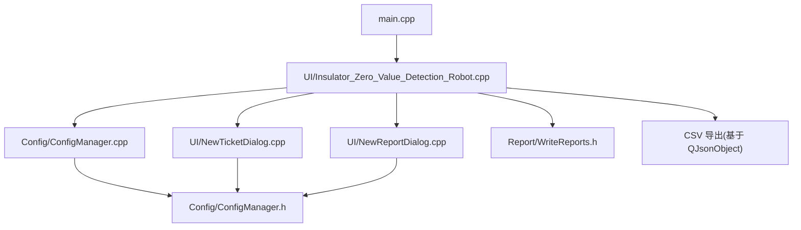
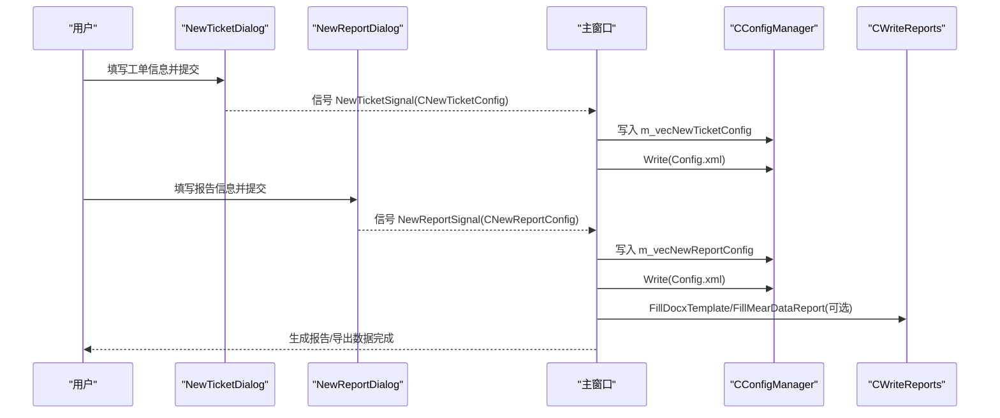
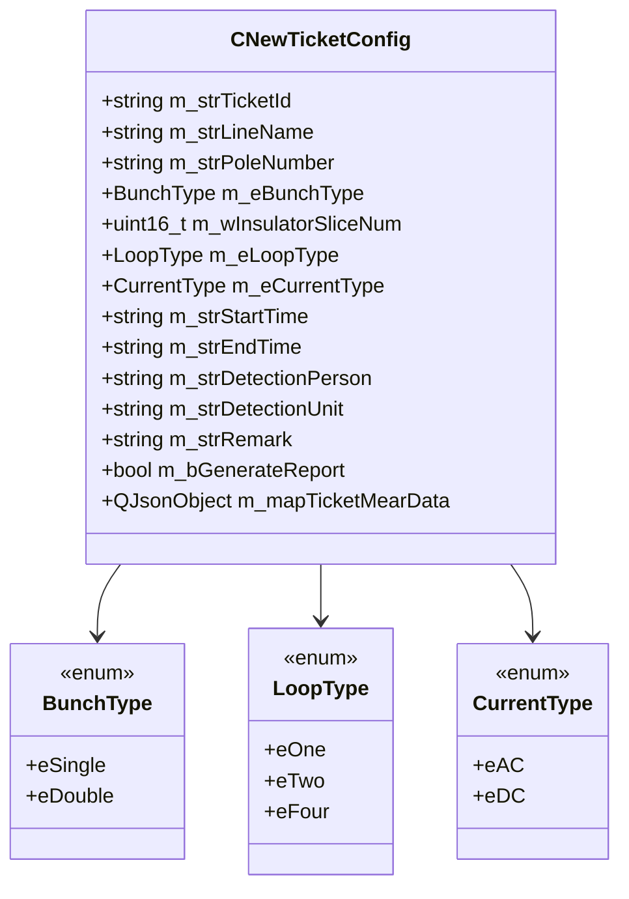
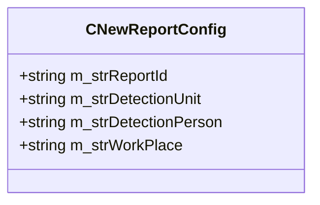
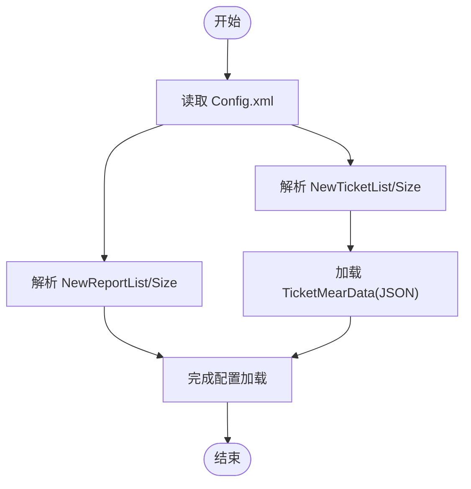
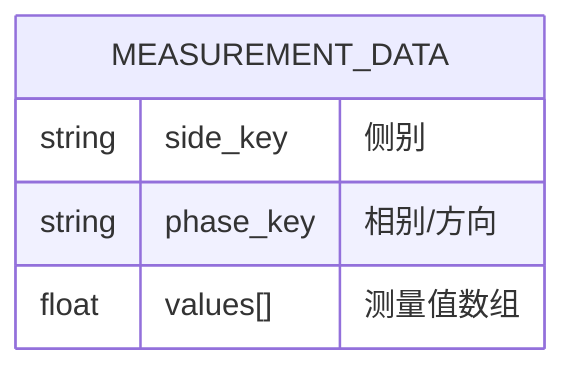
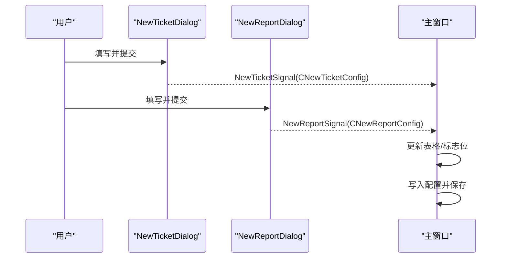
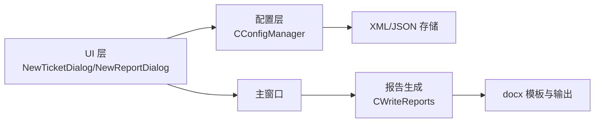

# 工单报告配置

<cite>
**本文引用的文件**
- [ConfigManager.h](file://Insulator_Zero_Value_Detection_Robot/Config/ConfigManager.h)
- [ConfigManager.cpp](file://Insulator_Zero_Value_Detection_Robot/Config/ConfigManager.cpp)
- [NewTicketDialog.h](file://Insulator_Zero_Value_Detection_Robot/UI/NewTicketDialog.h)
- [NewTicketDialog.cpp](file://Insulator_Zero_Value_Detection_Robot/UI/NewTicketDialog.cpp)
- [NewReportDialog.h](file://Insulator_Zero_Value_Detection_Robot/UI/NewReportDialog.h)
- [NewReportDialog.cpp](file://Insulator_Zero_Value_Detection_Robot/UI/NewReportDialog.cpp)
- [WriteReports.h](file://Insulator_Zero_Value_Detection_Robot/Report/WriteReports.h)
- [Insulator_Zero_Value_Detection_Robot.cpp](file://Insulator_Zero_Value_Detection_Robot/UI/Insulator_Zero_Value_Detection_Robot.cpp)
- [main.cpp](file://Insulator_Zero_Value_Detection_Robot/main.cpp)
</cite>

## 目录
1. [简介](#简介)
2. [项目结构](#项目结构)
3. [核心组件](#核心组件)
4. [架构总览](#架构总览)
5. [详细组件分析](#详细组件分析)
6. [依赖关系分析](#依赖关系分析)
7. [性能与存储特性](#性能与存储特性)
8. [故障排查指南](#故障排查指南)
9. [结论](#结论)
10. [附录：数据导出与模板定制](#附录：数据导出与模板定制)

## 简介
本文件为绝缘子零值检测机器人V2的“工单报告配置”专项文档，聚焦以下目标：
- 完整说明 CNewTicketConfig 类的配置结构与字段含义（线路信息、检测参数、作业信息等）。
- 详细说明 CNewReportConfig 类的报告配置选项（报告编号管理、检测单位信息、作业地点记录等）。
- 解释测量数据 JSON 格式 m_mapTicketMearData 的数据结构与存储规范。
- 提供工单模板定制、报告格式配置与数据导出功能的实操指导。

## 项目结构
围绕工单与报告的核心代码分布在以下模块：
- 配置与持久化：ConfigManager.h/.cpp
- UI 交互：NewTicketDialog.h/.cpp、NewReportDialog.h/.cpp
- 报告生成：WriteReports.h
- 主流程集成：UI/Insulator_Zero_Value_Detection_Robot.cpp
- 应用入口：main.cpp

图表来源
- [main.cpp:11-23](file://Insulator_Zero_Value_Detection_Robot/main.cpp#L11-L23)
- [Insulator_Zero_Value_Detection_Robot.cpp:2745-2818](file://Insulator_Zero_Value_Detection_Robot/UI/Insulator_Zero_Value_Detection_Robot.cpp#L2745-L2818)
- [ConfigManager.cpp:133-256](file://Insulator_Zero_Value_Detection_Robot/Config/ConfigManager.cpp#L133-L256)
- [ConfigManager.cpp:349-439](file://Insulator_Zero_Value_Detection_Robot/Config/ConfigManager.cpp#L349-L439)
- [WriteReports.h:24-88](file://Insulator_Zero_Value_Detection_Robot/Report/WriteReports.h#L24-L88)

章节来源
- [main.cpp:11-23](file://Insulator_Zero_Value_Detection_Robot/main.cpp#L11-L23)

## 核心组件
- CNewTicketConfig：描述一次检测任务的工单配置，包含线路信息、检测参数、作业信息与测量数据容器。
- CNewReportConfig：描述一份检测报告的基本元信息，如报告编号、检测单位、检测人员与作业地点。
- CConfigManager：负责将上述两类配置读写到 XML 配置文件，并序列化/反序列化测量数据为 JSON 文本。
- NewTicketDialog / NewReportDialog：用户界面层，用于录入和提交工单与报告配置。
- WriteReports：基于 docx 模板填充报告内容，支持占位符替换与测量数据表填充。

章节来源
- [ConfigManager.h:39-199](file://Insulator_Zero_Value_Detection_Robot/Config/ConfigManager.h#L39-L199)
- [ConfigManager.cpp:133-256](file://Insulator_Zero_Value_Detection_Robot/Config/ConfigManager.cpp#L133-L256)
- [ConfigManager.cpp:349-439](file://Insulator_Zero_Value_Detection_Robot/Config/ConfigManager.cpp#L349-L439)
- [NewTicketDialog.cpp:30-84](file://Insulator_Zero_Value_Detection_Robot/UI/NewTicketDialog.cpp#L30-L84)
- [NewReportDialog.cpp:19-44](file://Insulator_Zero_Value_Detection_Robot/UI/NewReportDialog.cpp#L19-L44)
- [WriteReports.h:24-88](file://Insulator_Zero_Value_Detection_Robot/Report/WriteReports.h#L24-L88)

## 架构总览
下图展示了从用户创建工单/报告到配置持久化与数据导出的整体流程。

图表来源
- [NewTicketDialog.cpp:30-64](file://Insulator_Zero_Value_Detection_Robot/UI/NewTicketDialog.cpp#L30-L64)
- [NewReportDialog.cpp:19-33](file://Insulator_Zero_Value_Detection_Robot/UI/NewReportDialog.cpp#L19-L33)
- [Insulator_Zero_Value_Detection_Robot.cpp:2745-2774](file://Insulator_Zero_Value_Detection_Robot/UI/Insulator_Zero_Value_Detection_Robot.cpp#L2745-L2774)
- [ConfigManager.cpp:349-439](file://Insulator_Zero_Value_Detection_Robot/Config/ConfigManager.cpp#L349-L439)
- [WriteReports.h:24-88](file://Insulator_Zero_Value_Detection_Robot/Report/WriteReports.h#L24-L88)

## 详细组件分析

### CNewTicketConfig 类：工单配置结构
- 线路信息
  - m_strLineName：线路名称
  - m_strPoleNumber：杆塔号
- 检测参数
  - m_eBunchType：串数类型（单联/双联）
  - m_wInsulatorSliceNum：绝缘子片数
  - m_eLoopType：回路数（同塔单回/双回/四回）
  - m_eCurrentType：电流类型（交流/直流）
- 作业信息
  - m_strStartTime：开始时间（yyyy-MM-dd HH:mm）
  - m_strEndTime：结束时间（yyyy-MM-dd HH:mm）
  - m_strDetectionPerson：检测人员
  - m_strDetectionUnit：检测单位
  - m_strRemark：备注
  - m_bGenerateReport：是否已生成报告
  - m_strTicketId：唯一标识符
- 测量数据容器
  - m_mapTicketMearData：QJsonObject，第一层 key 为“侧别”，第二层 key 为“相别/方向”，值为该相测量值数组（QJsonArray）

图表来源
- [ConfigManager.h:52-183](file://Insulator_Zero_Value_Detection_Robot/Config/ConfigManager.h#L52-L183)

章节来源
- [ConfigManager.h:52-183](file://Insulator_Zero_Value_Detection_Robot/Config/ConfigManager.h#L52-L183)
- [NewTicketDialog.cpp:47-57](file://Insulator_Zero_Value_Detection_Robot/UI/NewTicketDialog.cpp#L47-L57)

### CNewReportConfig 类：报告配置结构
- m_strReportId：报告编号
- m_strDetectionUnit：检测单位
- m_strDetectionPerson：检测人员
- m_strWorkPlace：作业地点

图表来源
- [ConfigManager.h:39-50](file://Insulator_Zero_Value_Detection_Robot/Config/ConfigManager.h#L39-L50)

章节来源
- [ConfigManager.h:39-50](file://Insulator_Zero_Value_Detection_Robot/Config/ConfigManager.h#L39-L50)
- [NewReportDialog.cpp:21-25](file://Insulator_Zero_Value_Detection_Robot/UI/NewReportDialog.cpp#L21-L25)

### 配置读写与持久化（XML + JSON）
- 读取流程
  - 解析 XML 中的 NewTicketList/Size 节点，填充 CNewTicketConfig 各字段；其中 TicketMearData 节点内容为 JSON 字符串，反序列化为 QJsonObject。
  - 解析 NewReportList/Size 节点，填充 CNewReportConfig。
- 写入流程
  - 将 CNewTicketConfig/CNewReportConfig 列表写回 XML；测量数据以紧凑 JSON 文本形式存入 TicketMearData 节点。

图表来源
- [ConfigManager.cpp:133-217](file://Insulator_Zero_Value_Detection_Robot/Config/ConfigManager.cpp#L133-L217)
- [ConfigManager.cpp:221-256](file://Insulator_Zero_Value_Detection_Robot/Config/ConfigManager.cpp#L221-L256)
- [ConfigManager.cpp:349-414](file://Insulator_Zero_Value_Detection_Robot/Config/ConfigManager.cpp#L349-L414)

章节来源
- [ConfigManager.cpp:133-256](file://Insulator_Zero_Value_Detection_Robot/Config/ConfigManager.cpp#L133-L256)
- [ConfigManager.cpp:349-439](file://Insulator_Zero_Value_Detection_Robot/Config/ConfigManager.cpp#L349-L439)

### 测量数据 JSON 格式（m_mapTicketMearData）
- 结构约定
  - 第一层 key：侧别（例如“大号侧”“小号侧”）
  - 第二层 key：相别/方向（例如“A相”“B相”“C相”或具体方向名）
  - 值：QJsonArray，按测量顺序存放数值（浮点，保留三位小数导出）
- 存储规范
  - 在 XML 中以 TicketMearData 节点存储，内容为紧凑 JSON 字符串。
  - 导出 CSV 时，按“侧别→方向→数组元素”的顺序逐行输出。

图表来源
- [ConfigManager.cpp:406-411](file://Insulator_Zero_Value_Detection_Robot/Config/ConfigManager.cpp#L406-L411)
- [Insulator_Zero_Value_Detection_Robot.cpp:2776-2818](file://Insulator_Zero_Value_Detection_Robot/UI/Insulator_Zero_Value_Detection_Robot.cpp#L2776-L2818)

章节来源
- [ConfigManager.cpp:406-411](file://Insulator_Zero_Value_Detection_Robot/Config/ConfigManager.cpp#L406-L411)
- [Insulator_Zero_Value_Detection_Robot.cpp:2776-2818](file://Insulator_Zero_Value_Detection_Robot/UI/Insulator_Zero_Value_Detection_Robot.cpp#L2776-L2818)

### 工单与报告的 UI 交互
- 新建/修改工单
  - 输入线路名称、杆塔号、串数类型、绝缘子片数、回路数、检测单位、备注、电流类型、检测人员。
  - 起止时间由系统自动打点，界面只读显示。
- 新建/修改报告
  - 输入报告编号、检测单位、检测人员、作业地点。
- 信号传递
  - 对话框通过信号将配置对象传递给主窗口，主窗口更新配置并持久化。

图表来源
- [NewTicketDialog.cpp:30-64](file://Insulator_Zero_Value_Detection_Robot/UI/NewTicketDialog.cpp#L30-L64)
- [NewReportDialog.cpp:19-33](file://Insulator_Zero_Value_Detection_Robot/UI/NewReportDialog.cpp#L19-L33)
- [Insulator_Zero_Value_Detection_Robot.cpp:2745-2774](file://Insulator_Zero_Value_Detection_Robot/UI/Insulator_Zero_Value_Detection_Robot.cpp#L2745-L2774)

章节来源
- [NewTicketDialog.cpp:30-84](file://Insulator_Zero_Value_Detection_Robot/UI/NewTicketDialog.cpp#L30-L84)
- [NewReportDialog.cpp:19-44](file://Insulator_Zero_Value_Detection_Robot/UI/NewReportDialog.cpp#L19-L44)
- [Insulator_Zero_Value_Detection_Robot.cpp:2745-2774](file://Insulator_Zero_Value_Detection_Robot/UI/Insulator_Zero_Value_Detection_Robot.cpp#L2745-L2774)

## 依赖关系分析
- 配置层（ConfigManager）依赖 Qt 的 JSON/XML 能力，负责 CNewTicketConfig/CNewReportConfig 的持久化。
- UI 层（NewTicketDialog/NewReportDialog）仅负责采集与提交配置对象。
- 主窗口协调 UI 与配置层，并在需要时调用报告生成器（WriteReports）进行报告填充。
- 报告生成器（WriteReports）独立于配置层，通过模板与数据映射生成最终报告。

图表来源
- [ConfigManager.h:185-199](file://Insulator_Zero_Value_Detection_Robot/Config/ConfigManager.h#L185-L199)
- [WriteReports.h:24-88](file://Insulator_Zero_Value_Detection_Robot/Report/WriteReports.h#L24-L88)

章节来源
- [ConfigManager.h:185-199](file://Insulator_Zero_Value_Detection_Robot/Config/ConfigManager.h#L185-L199)
- [WriteReports.h:24-88](file://Insulator_Zero_Value_Detection_Robot/Report/WriteReports.h#L24-L88)

## 性能与存储特性
- 配置读写
  - 使用 tinyxml2 进行 XML 读写，轻量高效；测量数据以紧凑 JSON 字符串存储，避免额外开销。
- CSV 导出
  - 直接遍历 QJsonObject/QJsonArray，按序写入 UTF-8 编码 CSV，便于 Excel 打开与分析。
- 报告生成
  - 基于 docx 模板的占位符替换与表格重建，无需安装 Word，跨平台可用。

[本节为通用性能讨论，不直接分析具体文件]

## 故障排查指南
- 配置未生效
  - 检查 NewTicketList/NewReportList 节点是否存在且 Size 子节点完整。
  - 确认 TicketMearData 节点内容为合法 JSON 字符串。
- CSV 导出失败
  - 检查路径权限与文件名合法性；查看日志中“测量数据CSV保存成功/失败”提示。
- 报告生成失败
  - 确认模板路径与输出路径有效；确保占位符 ${xxx} 与传入键一致。
  - 若数据表行数异常，核对 m_mapTicketMearData 的结构是否符合“侧别→相别→数组”的约定。

章节来源
- [ConfigManager.cpp:133-256](file://Insulator_Zero_Value_Detection_Robot/Config/ConfigManager.cpp#L133-L256)
- [Insulator_Zero_Value_Detection_Robot.cpp:2776-2818](file://Insulator_Zero_Value_Detection_Robot/UI/Insulator_Zero_Value_Detection_Robot.cpp#L2776-L2818)
- [WriteReports.h:24-88](file://Insulator_Zero_Value_Detection_Robot/Report/WriteReports.h#L24-L88)

## 结论
- CNewTicketConfig 提供了完整的工单配置模型，涵盖线路、检测参数与作业信息，并通过 m_mapTicketMearData 承载测量数据。
- CNewReportConfig 简洁地描述了报告元信息，便于管理与追溯。
- CConfigManager 实现了配置的 XML 持久化与 JSON 序列化，保证数据一致性。
- 结合 UI 与报告生成器，系统可完成从数据采集、配置管理到报告输出的全流程。

[本节为总结性内容，不直接分析具体文件]

## 附录：数据导出与模板定制

### 数据导出（CSV）
- 触发时机：新增报告后，主窗口将当前工单的测量数据导出为 CSV 文件，文件名为 MearData_{报告编号}.csv。
- 数据顺序：按“侧别→方向→数组元素”顺序输出，数值保留三位小数。
- 编码：UTF-8，带 BOM，便于 Excel 正确显示中文。

章节来源
- [Insulator_Zero_Value_Detection_Robot.cpp:2776-2818](file://Insulator_Zero_Value_Detection_Robot/UI/Insulator_Zero_Value_Detection_Robot.cpp#L2776-L2818)

### 报告模板定制
- 占位符替换：在模板 docx 中使用 ${key} 形式的占位符，调用 FillDocxTemplate 传入键值对即可替换。
- 测量数据表填充：使用 FillMearDataReport，根据 m_mapTicketMearData 动态生成数据行，适配不同片数。
- 注意事项：
  - 模板需包含至少一张用于展示数据的表格。
  - 数据行单元格数量为 14（每行包含片号与大号/小号侧的三相内外侧数据），请确保模板表格结构匹配。

章节来源
- [WriteReports.h:24-88](file://Insulator_Zero_Value_Detection_Robot/Report/WriteReports.h#L24-L88)