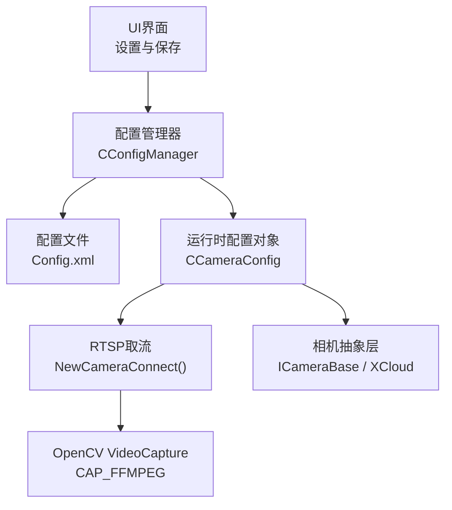
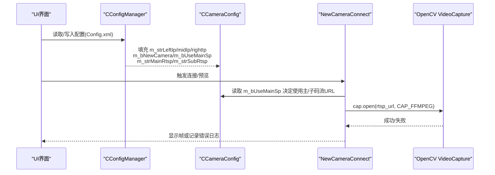
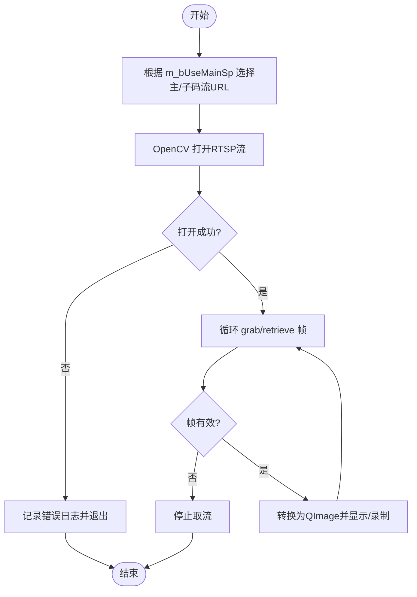
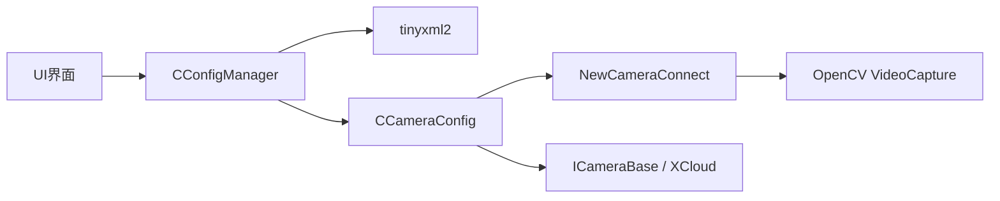

# 摄像头配置

<cite>
**本文引用的文件**
- [ConfigManager.h](file://Insulator_Zero_Value_Detection_Robot/Config/ConfigManager.h)
- [ConfigManager.cpp](file://Insulator_Zero_Value_Detection_Robot/Config/ConfigManager.cpp)
- [CameraBase.h](file://Insulator_Zero_Value_Detection_Robot/Camera/CameraBase.h)
- [XCloud.h](file://Insulator_Zero_Value_Detection_Robot/Camera/XCloud.h)
- [Insulator_Zero_Value_Detection_Robot.cpp](file://Insulator_Zero_Value_Detection_Robot/UI/Insulator_Zero_Value_Detection_Robot.cpp)
</cite>

## 目录
1. [简介](#简介)
2. [项目结构](#项目结构)
3. [核心组件](#核心组件)
4. [架构总览](#架构总览)
5. [详细组件分析](#详细组件分析)
6. [依赖关系分析](#依赖关系分析)
7. [性能与网络优化](#性能与网络优化)
8. [故障诊断指南](#故障诊断指南)
9. [结论](#结论)
10. [附录：配置项与XML结构](#附录：配置项与xml结构)

## 简介
本文件面向绝缘子零值检测机器人V2的“多摄像头系统”配置，围绕 CCameraConfig 类的全部配置项进行说明，重点包括：
- 三台摄像头的IP地址配置（左、中、右）
- 相机类型选择（新款相机开关）
- 码流选择与RTSP配置（主码流/子码流）
- 连接测试、视频流验证与常见故障定位方法
- 不同品牌摄像头的兼容性建议与网络优化要点

## 项目结构
与摄像头配置直接相关的代码主要分布在以下模块：
- 配置管理：CCameraConfig 定义与 XML 读写
- UI交互：保存摄像头IP、触发重启生效
- RTSP取流：基于OpenCV的NewCameraConnect流程
- 相机抽象：ICameraBase接口与XCloud实现（用于特定SDK接入）

图表来源
- [ConfigManager.h:26-37](file://Insulator_Zero_Value_Detection_Robot/Config/ConfigManager.h#L26-L37)
- [ConfigManager.cpp:84-130](file://Insulator_Zero_Value_Detection_Robot/Config/ConfigManager.cpp#L84-L130)
- [Insulator_Zero_Value_Detection_Robot.cpp:1371-1405](file://Insulator_Zero_Value_Detection_Robot/UI/Insulator_Zero_Value_Detection_Robot.cpp#L1371-L1405)
- [CameraBase.h:5-13](file://Insulator_Zero_Value_Detection_Robot/Camera/CameraBase.h#L5-L13)

章节来源
- [ConfigManager.h:26-37](file://Insulator_Zero_Value_Detection_Robot/Config/ConfigManager.h#L26-L37)
- [ConfigManager.cpp:84-130](file://Insulator_Zero_Value_Detection_Robot/Config/ConfigManager.cpp#L84-L130)
- [Insulator_Zero_Value_Detection_Robot.cpp:1371-1405](file://Insulator_Zero_Value_Detection_Robot/UI/Insulator_Zero_Value_Detection_Robot.cpp#L1371-L1405)
- [CameraBase.h:5-13](file://Insulator_Zero_Value_Detection_Robot/Camera/CameraBase.h#L5-L13)

## 核心组件
- CCameraConfig：集中管理三台摄像头的IP、相机类型与码流参数
- CConfigManager：负责将 CCameraConfig 持久化到 Config.xml，并在启动时读取
- UI保存逻辑：修改摄像头IP后自动写回配置并提示重启以生效
- NewCameraConnect：根据配置选择主/子码流，使用OpenCV通过RTSP拉流并显示/录制

章节来源
- [ConfigManager.h:26-37](file://Insulator_Zero_Value_Detection_Robot/Config/ConfigManager.h#L26-L37)
- [ConfigManager.cpp:84-130](file://Insulator_Zero_Value_Detection_Robot/Config/ConfigManager.cpp#L84-L130)
- [Insulator_Zero_Value_Detection_Robot.cpp:2526-2541](file://Insulator_Zero_Value_Detection_Robot/UI/Insulator_Zero_Value_Detection_Robot.cpp#L2526-L2541)
- [Insulator_Zero_Value_Detection_Robot.cpp:1371-1405](file://Insulator_Zero_Value_Detection_Robot/UI/Insulator_Zero_Value_Detection_Robot.cpp#L1371-L1405)

## 架构总览
下图展示了从配置到取流的完整链路：

图表来源
- [ConfigManager.cpp:84-130](file://Insulator_Zero_Value_Detection_Robot/Config/ConfigManager.cpp#L84-L130)
- [Insulator_Zero_Value_Detection_Robot.cpp:1371-1405](file://Insulator_Zero_Value_Detection_Robot/UI/Insulator_Zero_Value_Detection_Robot.cpp#L1371-L1405)

## 详细组件分析

### CCameraConfig 配置项详解
- 三台摄像头IP
  - m_strLeftIp：左侧摄像头IP
  - m_strMidIp：中间摄像头IP
  - m_strRightIp：右侧摄像头IP
  - 说明：在UI中修改后保存到Config.xml；若IP变更，程序会提示重启以使新IP生效。
- 相机类型选择
  - m_bNewCamera：是否使用“新款相机”。该标志位由配置读取，可用于后续分支控制（当前代码中主要用于区分新旧相机路径）。
- 码流配置
  - m_bUseMainSp：是否使用主码流
  - m_strMainRtsp：主码流RTSP URL
  - m_strSubRtsp：子码流RTSP URL
  - 说明：NewCameraConnect会根据 m_bUseMainSp 选择主/子码流URL；若为空则回退到界面变量 strRTSP_URL。

章节来源
- [ConfigManager.h:26-37](file://Insulator_Zero_Value_Detection_Robot/Config/ConfigManager.h#L26-L37)
- [ConfigManager.cpp:84-130](file://Insulator_Zero_Value_Detection_Robot/Config/ConfigManager.cpp#L84-L130)
- [Insulator_Zero_Value_Detection_Robot.cpp:2526-2541](file://Insulator_Zero_Value_Detection_Robot/UI/Insulator_Zero_Value_Detection_Robot.cpp#L2526-L2541)
- [Insulator_Zero_Value_Detection_Robot.cpp:1371-1405](file://Insulator_Zero_Value_Detection_Robot/UI/Insulator_Zero_Value_Detection_Robot.cpp#L1371-L1405)

### 主码流与子码流的区别与适用场景
- 主码流
  - 通常分辨率更高、码率更大，适合本地高清预览、录像与离线分析
  - 对带宽和CPU解码压力要求较高
- 子码流
  - 分辨率较低、码率较小，适合实时低延迟预览、弱网环境或多路并发
  - 更适合现场快速巡检与低延迟监控

章节来源
- [Insulator_Zero_Value_Detection_Robot.cpp:1371-1405](file://Insulator_Zero_Value_Detection_Robot/UI/Insulator_Zero_Value_Detection_Robot.cpp#L1371-L1405)

### 相机抽象与扩展点
- ICameraBase：定义统一的相机初始化、反初始化、注册视频句柄、连接等接口
- XCloud：具体实现之一，用于对接某类云台/SDK相机
- 获取方式：通过 GetCameraObj(type) 按类型创建实例，便于未来扩展更多相机厂商

章节来源
- [CameraBase.h:5-13](file://Insulator_Zero_Value_Detection_Robot/Camera/CameraBase.h#L5-L13)
- [XCloud.h:6-14](file://Insulator_Zero_Value_Detection_Robot/Camera/XCloud.h#L6-L14)

### 配置持久化与加载
- 读取：CConfigManager::Read 解析 Config.xml 中的 Camera 节点，填充 CCameraConfig
- 写入：CConfigManager::Write 将 CCameraConfig 写回 Config.xml 对应节点
- UI联动：修改摄像头IP后调用 Write 并提示重启

章节来源
- [ConfigManager.cpp:84-130](file://Insulator_Zero_Value_Detection_Robot/Config/ConfigManager.cpp#L84-L130)
- [ConfigManager.cpp:315-347](file://Insulator_Zero_Value_Detection_Robot/Config/ConfigManager.cpp#L315-L347)
- [Insulator_Zero_Value_Detection_Robot.cpp:2526-2541](file://Insulator_Zero_Value_Detection_Robot/UI/Insulator_Zero_Value_Detection_Robot.cpp#L2526-L2541)

### RTSP取流流程（NewCameraConnect）
- 根据 m_bUseMainSp 选择主/子码流URL
- 使用 OpenCV VideoCapture 以 CAP_FFMPEG 打开RTSP
- 设置最小缓冲区以降低延迟
- 循环抓取帧并转QImage显示；支持录制缓存
- 失败时记录日志并退出取流

图表来源
- [Insulator_Zero_Value_Detection_Robot.cpp:1371-1473](file://Insulator_Zero_Value_Detection_Robot/UI/Insulator_Zero_Value_Detection_Robot.cpp#L1371-L1473)

章节来源
- [Insulator_Zero_Value_Detection_Robot.cpp:1371-1473](file://Insulator_Zero_Value_Detection_Robot/UI/Insulator_Zero_Value_Detection_Robot.cpp#L1371-L1473)

## 依赖关系分析
- UI层依赖配置管理器进行参数读写
- 配置管理器依赖XML解析库与工具函数
- 取流层依赖OpenCV与FFmpeg后端
- 相机抽象层提供可扩展的厂商接入点

图表来源
- [ConfigManager.cpp:1-6](file://Insulator_Zero_Value_Detection_Robot/Config/ConfigManager.cpp#L1-L6)
- [Insulator_Zero_Value_Detection_Robot.cpp:1371-1405](file://Insulator_Zero_Value_Detection_Robot/UI/Insulator_Zero_Value_Detection_Robot.cpp#L1371-L1405)
- [CameraBase.h:5-13](file://Insulator_Zero_Value_Detection_Robot/Camera/CameraBase.h#L5-L13)

章节来源
- [ConfigManager.cpp:1-6](file://Insulator_Zero_Value_Detection_Robot/Config/ConfigManager.cpp#L1-L6)
- [Insulator_Zero_Value_Detection_Robot.cpp:1371-1405](file://Insulator_Zero_Value_Detection_Robot/UI/Insulator_Zero_Value_Detection_Robot.cpp#L1371-L1405)
- [CameraBase.h:5-13](file://Insulator_Zero_Value_Detection_Robot/Camera/CameraBase.h#L5-L13)

## 性能与网络优化
- 码流选择
  - 多路同时预览优先使用子码流，降低带宽与解码压力
  - 需要高清存档或离线分析时使用主码流
- 延迟优化
  - 已设置最小缓冲区，有助于降低首帧延迟
  - 建议在相机端开启低延迟模式（如启用UDP/RTP over UDP，关闭H.265高复杂度编码）
- 网络拓扑建议
  - 三台摄像头与机器人处于同一局域网，避免跨网段路由
  - 为摄像头分配固定IP，避免DHCP漂移导致配置失效
  - 交换机端口限速与QoS策略，保障RTSP流稳定
- 兼容性与编解码
  - 确保OpenCV编译包含FFmpeg支持，以便正确解析RTSP
  - 优先使用H.264编码，兼容性更好；部分设备需关闭“智能编码”或“动态码率”

[本节为通用指导，不直接引用具体代码]

## 故障诊断指南
- 无法打开RTSP流
  - 检查 m_bUseMainSp 与对应的 m_strMainRtsp/m_strSubRtsp 是否正确
  - 确认相机IP可达、用户名/密码/端口正确
  - 查看日志输出中的“打开RTSP流失败”信息
- 画面卡顿或丢帧
  - 切换至子码流，降低分辨率与码率
  - 调整相机编码参数（降低GOP、关闭B帧）
  - 检查网络拥塞与无线信号质量
- IP修改未生效
  - 修改摄像头IP后需重启软件才能生效（UI已内置提示与自动重启逻辑）
- 多路并发问题
  - 优先使用子码流；必要时分时段采集主码流
  - 合理分配网络带宽，避免单一路占用过多资源

章节来源
- [Insulator_Zero_Value_Detection_Robot.cpp:1371-1405](file://Insulator_Zero_Value_Detection_Robot/UI/Insulator_Zero_Value_Detection_Robot.cpp#L1371-L1405)
- [Insulator_Zero_Value_Detection_Robot.cpp:2526-2541](file://Insulator_Zero_Value_Detection_Robot/UI/Insulator_Zero_Value_Detection_Robot.cpp#L2526-L2541)

## 结论
通过 CCameraConfig 统一管理三台摄像头的IP、相机类型与码流参数，结合CConfigManager的持久化能力与UI的便捷操作，可实现稳定的多路RTSP监控。建议在现场部署时采用子码流进行实时预览，主码流用于关键片段录制；配合合理的网络规划与编码参数，可显著提升系统的稳定性与流畅度。

[本节为总结性内容，不直接引用具体代码]

## 附录：配置项与XML结构
- 配置项清单
  - 摄像头IP：m_strLeftIp、m_strMidIp、m_strRightIp
  - 相机类型：m_bNewCamera
  - 码流选择：m_bUseMainSp
  - RTSP URL：m_strMainRtsp、m_strSubRtsp
- XML节点映射（Camera 节点下）
  - Left、Mid、Right：分别对应三台摄像头IP
  - NewCamera：是否使用新款相机（0/1）
  - UseMainSp：是否使用主码流（0/1）
  - MainRtsp、SubRtsp：主/子码流RTSP URL

章节来源
- [ConfigManager.cpp:84-130](file://Insulator_Zero_Value_Detection_Robot/Config/ConfigManager.cpp#L84-L130)
- [ConfigManager.cpp:315-347](file://Insulator_Zero_Value_Detection_Robot/Config/ConfigManager.cpp#L315-L347)