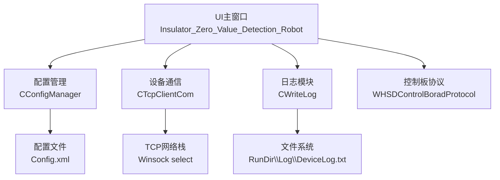
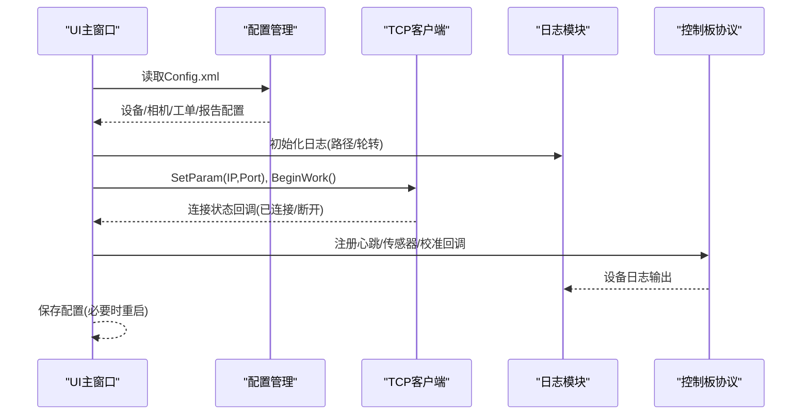
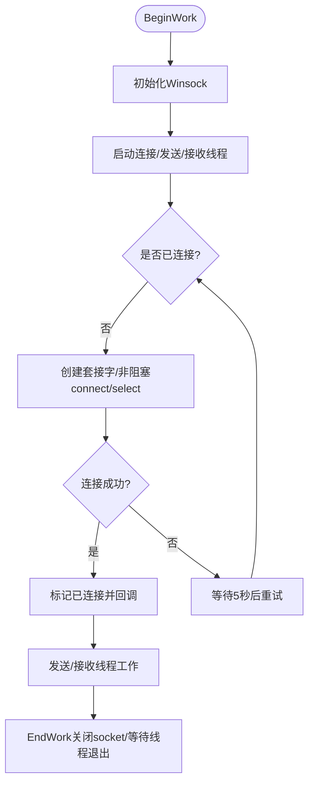
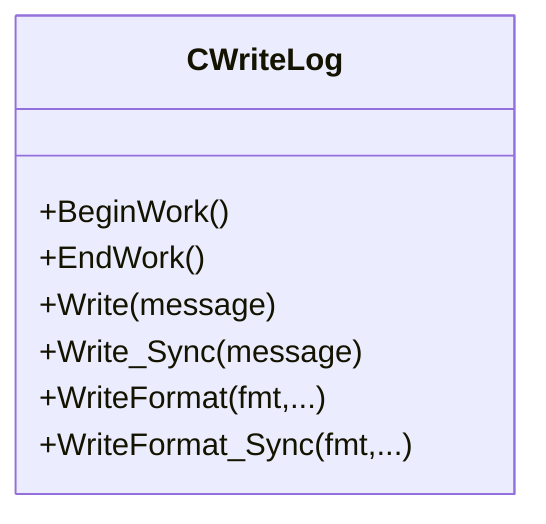
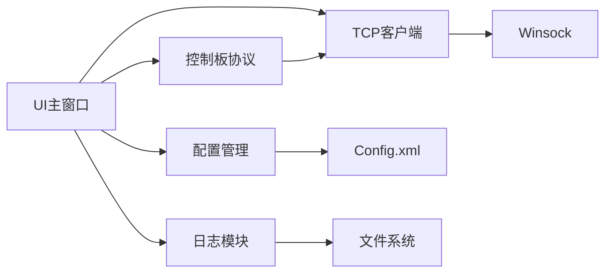

# 系统设置配置

<cite>
**本文引用的文件**
- [ConfigManager.h](file://Insulator_Zero_Value_Detection_Robot/Config/ConfigManager.h)
- [ConfigManager.cpp](file://Insulator_Zero_Value_Detection_Robot/Config/ConfigManager.cpp)
- [TcpClient.h](file://Insulator_Zero_Value_Detection_Robot/DeviceCom/TcpClient.h)
- [TcpClient.cpp](file://Insulator_Zero_Value_Detection_Robot/DeviceCom/TcpClient.cpp)
- [ScanS_WriteLog.h](file://Insulator_Zero_Value_Detection_Robot/Log/ScanS_WriteLog.h)
- [ScanS_WriteLog.cpp](file://Insulator_Zero_Value_Detection_Robot/Log/ScanS_WriteLog.cpp)
- [Insulator_Zero_Value_Detection_Robot.h](file://Insulator_Zero_Value_Detection_Robot/UI/Insulator_Zero_Value_Detection_Robot.h)
- [Insulator_Zero_Value_Detection_Robot.cpp](file://Insulator_Zero_Value_Detection_Robot/UI/Insulator_Zero_Value_Detection_Robot.cpp)
- [操作说明书.md](file://操作说明书.md)
</cite>

## 目录
1. [简介](#简介)
2. [项目结构](#项目结构)
3. [核心组件](#核心组件)
4. [架构总览](#架构总览)
5. [详细组件分析](#详细组件分析)
6. [依赖关系分析](#依赖关系分析)
7. [性能与稳定性建议](#性能与稳定性建议)
8. [故障排查指南](#故障排查指南)
9. [结论](#结论)
10. [附录：配置项速查表](#附录配置项速查表)

## 简介
本文件面向绝缘子零值检测机器人V2的系统设置与配置，覆盖设备通信参数、网络配置、用户权限管理、界面个性化、日志配置、备份恢复、系统信息与监控等。文档基于代码实现进行说明，帮助运维与工程人员正确理解并安全地调整系统参数，确保设备稳定运行与数据安全。

## 项目结构
系统采用分层设计：UI层负责交互与展示；配置层通过XML持久化设备与相机等参数；通信层提供TCP客户端连接控制板；日志层提供线程安全的文件写入；协议层封装与控制板的报文交互；工具层提供路径、文件读写等通用能力。

图表来源
- [Insulator_Zero_Value_Detection_Robot.cpp:277-290](file://Insulator_Zero_Value_Detection_Robot/UI/Insulator_Zero_Value_Detection_Robot.cpp#L277-L290)
- [ConfigManager.cpp:16-257](file://Insulator_Zero_Value_Detection_Robot/Config/ConfigManager.cpp#L16-L257)
- [TcpClient.cpp:59-121](file://Insulator_Zero_Value_Detection_Robot/DeviceCom/TcpClient.cpp#L59-L121)
- [操作说明书.md:43-54](file://操作说明书.md#L43-L54)

章节来源
- [操作说明书.md:43-54](file://操作说明书.md#L43-L54)
- [Insulator_Zero_Value_Detection_Robot.cpp:277-290](file://Insulator_Zero_Value_Detection_Robot/UI/Insulator_Zero_Value_Detection_Robot.cpp#L277-L290)

## 核心组件
- 配置管理（CConfigManager）
  - 负责读取/写入XML配置文件，包含设备控制板参数、相机参数、工单与报告模板等。
  - 关键数据模型：CControlBoardConfig、CCameraConfig、CNewTicketConfig、CNewReportConfig。
- 设备通信（CTcpClientCom）
  - 基于Winsock的TCP客户端，支持非阻塞连接、自动重连、发送队列、接收回调。
- 日志模块（CWriteLog）
  - 线程安全日志写入，支持同步/异步模式，行/列大小限制，循环覆盖策略。
- UI主窗口
  - 初始化配置、绑定动作、启动通信与协议、处理保存配置与重启逻辑。

章节来源
- [ConfigManager.h:10-199](file://Insulator_Zero_Value_Detection_Robot/Config/ConfigManager.h#L10-L199)
- [ConfigManager.cpp:16-452](file://Insulator_Zero_Value_Detection_Robot/Config/ConfigManager.cpp#L16-L452)
- [TcpClient.h:8-46](file://Insulator_Zero_Value_Detection_Robot/DeviceCom/TcpClient.h#L8-L46)
- [TcpClient.cpp:21-382](file://Insulator_Zero_Value_Detection_Robot/DeviceCom/TcpClient.cpp#L21-L382)
- [ScanS_WriteLog.h:5-42](file://Insulator_Zero_Value_Detection_Robot/Log/ScanS_WriteLog.h#L5-L42)
- [ScanS_WriteLog.cpp:5-66](file://Insulator_Zero_Value_Detection_Robot/Log/ScanS_WriteLog.cpp#L5-L66)
- [Insulator_Zero_Value_Detection_Robot.h:26-385](file://Insulator_Zero_Value_Detection_Robot/UI/Insulator_Zero_Value_Detection_Robot.h#L26-L385)

## 架构总览
系统启动后，UI加载配置、初始化日志、建立TCP连接并注册协议回调。配置变更通过UI触发保存到XML，部分参数修改需要重启软件生效。日志记录通信、测量流程与告警信息，便于问题定位。

图表来源
- [Insulator_Zero_Value_Detection_Robot.cpp:277-290](file://Insulator_Zero_Value_Detection_Robot/UI/Insulator_Zero_Value_Detection_Robot.cpp#L277-L290)
- [ConfigManager.cpp:16-257](file://Insulator_Zero_Value_Detection_Robot/Config/ConfigManager.cpp#L16-L257)
- [TcpClient.cpp:59-121](file://Insulator_Zero_Value_Detection_Robot/DeviceCom/TcpClient.cpp#L59-L121)

## 详细组件分析

### 设备通信参数与网络配置
- TCP服务器地址与端口
  - 由配置中的“设备控制板”节点Ip与Port决定，UI保存时调用SetParam并立即尝试连接。
  - 推荐值：使用局域网内稳定的IP段，端口避免与系统服务冲突；默认端口需与设备一致。
- 超时与重连
  - 连接超时：非阻塞connect后使用select等待，超时时间固定为5秒。
  - 接收超时：select读超时1秒，未收到数据继续循环。
  - 重连策略：连接失败后每5秒重试一次，直到运行结束。
- 发送与接收
  - 发送走独立线程，使用队列+条件变量保证并发安全。
  - 接收回调将数据交给上层协议解析。

图表来源
- [TcpClient.cpp:59-121](file://Insulator_Zero_Value_Detection_Robot/DeviceCom/TcpClient.cpp#L59-L121)
- [TcpClient.cpp:163-236](file://Insulator_Zero_Value_Detection_Robot/DeviceCom/TcpClient.cpp#L163-L236)
- [TcpClient.cpp:238-382](file://Insulator_Zero_Value_Detection_Robot/DeviceCom/TcpClient.cpp#L238-L382)

章节来源
- [TcpClient.h:8-46](file://Insulator_Zero_Value_Detection_Robot/DeviceCom/TcpClient.h#L8-L46)
- [TcpClient.cpp:21-382](file://Insulator_Zero_Value_Detection_Robot/DeviceCom/TcpClient.cpp#L21-L382)
- [Insulator_Zero_Value_Detection_Robot.cpp:2522-2542](file://Insulator_Zero_Value_Detection_Robot/UI/Insulator_Zero_Value_Detection_Robot.cpp#L2522-L2542)

### 设备控制板参数
- 探针角度与速度
  - UpAngle/DownAngle/UpAngle2：探针向内、复原、向外角度。
  - WalkMotorSpeed：行走电机速度。
  - ServoSpeed：舵机速度。
- 阈值与模式
  - InsuThreshold：绝缘阈值。
  - DeviceHeartBeat：心跳间隔（毫秒）。
  - FactoryMode：工厂模式开关。
- 影响与注意事项
  - 角度与速度直接影响机械运动与测量精度，修改后需保存并测试。
  - 心跳过小会增加网络负载，过大可能降低断线检测灵敏度。

章节来源
- [ConfigManager.h:10-24](file://Insulator_Zero_Value_Detection_Robot/Config/ConfigManager.h#L10-L24)
- [ConfigManager.cpp:27-82](file://Insulator_Zero_Value_Detection_Robot/Config/ConfigManager.cpp#L27-L82)
- [操作说明书.md:342-347](file://操作说明书.md#L342-L347)

### 相机配置
- 相机IP与码流
  - Left/Mid/Right：三目相机IP。
  - NewCamera：是否使用新摄像头模式。
  - UseMainSp：是否使用主码流。
  - MainRtsp/SubRtsp：RTSP地址。
- 影响与注意事项
  - 修改相机IP后需重启软件才能生效。
  - 新摄像头模式下支持录像功能。

章节来源
- [ConfigManager.h:26-37](file://Insulator_Zero_Value_Detection_Robot/Config/ConfigManager.h#L26-L37)
- [ConfigManager.cpp:85-131](file://Insulator_Zero_Value_Detection_Robot/Config/ConfigManager.cpp#L85-L131)
- [Insulator_Zero_Value_Detection_Robot.cpp:2526-2542](file://Insulator_Zero_Value_Detection_Robot/UI/Insulator_Zero_Value_Detection_Robot.cpp#L2526-L2542)
- [操作说明书.md:146-159](file://操作说明书.md#L146-L159)

### 工单与报告模板
- 工单字段
  - TicketId、LineName、PoleNumber、BunchType、InsulatorSliceNum、LoopType、CurrentType、StartTime、EndTime、DetectionPerson、DetectionUnit、Remark、TicketMearData(JSON)。
- 报告字段
  - ReportId、WorkPlace、DetectionPerson、DetectionUnit。
- 用途
  - 用于生成检测报告与历史查询，JSON存储测量结果便于后续分析。

章节来源
- [ConfigManager.h:39-183](file://Insulator_Zero_Value_Detection_Robot/Config/ConfigManager.h#L39-L183)
- [ConfigManager.cpp:133-257](file://Insulator_Zero_Value_Detection_Robot/Config/ConfigManager.cpp#L133-L257)
- [ConfigManager.cpp:349-443](file://Insulator_Zero_Value_Detection_Robot/Config/ConfigManager.cpp#L349-L443)

### 日志配置选项
- 日志对象
  - CWriteLog构造函数接受路径、最大行数、每行字节数、同步标志。
- 写入方式
  - Write/WriteFormat：异步写入。
  - Write_Sync/WriteFormat_Sync：同步写入。
- 轮转策略
  - 通过最大行数与每行字节数实现循环覆盖，避免无限增长。
- 路径与级别
  - 路径：RunDir\Log\DeviceLog.txt（见操作说明书）。
  - 级别：当前实现未暴露动态级别切换，可通过不同写入接口与调用点控制详细度。

图表来源
- [ScanS_WriteLog.h:5-42](file://Insulator_Zero_Value_Detection_Robot/Log/ScanS_WriteLog.h#L5-L42)
- [ScanS_WriteLog.cpp:5-66](file://Insulator_Zero_Value_Detection_Robot/Log/ScanS_WriteLog.cpp#L5-L66)
- [操作说明书.md:43-54](file://操作说明书.md#L43-L54)

章节来源
- [ScanS_WriteLog.h:5-42](file://Insulator_Zero_Value_Detection_Robot/Log/ScanS_WriteLog.h#L5-L42)
- [ScanS_WriteLog.cpp:5-66](file://Insulator_Zero_Value_Detection_Robot/Log/ScanS_WriteLog.cpp#L5-L66)
- [操作说明书.md:43-54](file://操作说明书.md#L43-L54)

### 用户权限管理与访问控制
- 现状
  - 代码中未发现显式的多用户账户管理或权限控制模块。
  - 界面顶部导航栏显示“管理员”标识，但未见登录/鉴权逻辑。
- 建议
  - 如需多用户环境，可在UI层增加登录校验与角色权限控制，结合配置文件维护用户白名单与操作审计。
  - 对敏感操作（如修改设备IP、校准）增加二次确认与审计日志。

章节来源
- [操作说明书.md:74-84](file://操作说明书.md#L74-L84)
- [Insulator_Zero_Value_Detection_Robot.h:26-385](file://Insulator_Zero_Value_Detection_Robot/UI/Insulator_Zero_Value_Detection_Robot.h#L26-L385)

### 界面个性化设置
- 全屏无边框
  - 启动时隐藏标题栏并最大化显示，提升现场操作体验。
- 布局比例
  - 视频区与标签页按像素比例分配，支持手动拖拽。
- 控件样式
  - 分割手柄加宽美化，适配触摸屏操作。

章节来源
- [Insulator_Zero_Value_Detection_Robot.cpp:104-135](file://Insulator_Zero_Value_Detection_Robot/UI/Insulator_Zero_Value_Detection_Robot.cpp#L104-L135)

### 系统维护与工具功能
- 配置备份与恢复
  - 配置文件位于RunDir\Config.xml，可手工备份/恢复。
  - 程序提供保存配置到XML的能力，修改后建议备份。
- 系统信息查看
  - 底部状态栏显示设备编号、软件版本、检测时长、当前时间。
- 性能监控
  - 心跳计数递增表示通信正常；日志记录测量流程与告警。
  - 可通过日志分析网络延迟与错误。

章节来源
- [操作说明书.md:93-101](file://操作说明书.md#L93-L101)
- [ConfigManager.cpp:259-452](file://Insulator_Zero_Value_Detection_Robot/Config/ConfigManager.cpp#L259-L452)
- [Insulator_Zero_Value_Detection_Robot.cpp:277-290](file://Insulator_Zero_Value_Detection_Robot/UI/Insulator_Zero_Value_Detection_Robot.cpp#L277-L290)

## 依赖关系分析
- UI依赖配置管理以加载设备与相机参数。
- UI依赖TCP客户端建立与控制板通信。
- 协议层依赖通信层发送/接收数据。
- 日志贯穿各层，记录关键事件。

图表来源
- [Insulator_Zero_Value_Detection_Robot.cpp:277-290](file://Insulator_Zero_Value_Detection_Robot/UI/Insulator_Zero_Value_Detection_Robot.cpp#L277-L290)
- [ConfigManager.cpp:16-257](file://Insulator_Zero_Value_Detection_Robot/Config/ConfigManager.cpp#L16-L257)
- [TcpClient.cpp:59-121](file://Insulator_Zero_Value_Detection_Robot/DeviceCom/TcpClient.cpp#L59-L121)

章节来源
- [Insulator_Zero_Value_Detection_Robot.cpp:277-290](file://Insulator_Zero_Value_Detection_Robot/UI/Insulator_Zero_Value_Detection_Robot.cpp#L277-L290)
- [ConfigManager.cpp:16-257](file://Insulator_Zero_Value_Detection_Robot/Config/ConfigManager.cpp#L16-L257)
- [TcpClient.cpp:59-121](file://Insulator_Zero_Value_Detection_Robot/DeviceCom/TcpClient.cpp#L59-L121)

## 性能与稳定性建议
- 网络参数
  - 心跳间隔建议根据现场网络质量调整，避免过密导致拥塞或过疏导致误判。
  - 连接超时与重连间隔已在代码中固定，若网络波动较大可适当调整应用层重试策略。
- 日志策略
  - 生产环境建议使用异步写入，减少IO阻塞；定期清理或归档日志文件。
  - 合理设置最大行数与每行长度，防止磁盘占满。
- 相机与视频
  - 新摄像头模式支持录像，注意存储空间与编码性能；旧模式不支持录像。
- 配置变更
  - 修改相机IP后需重启软件；修改设备IP后立即生效并重连。
  - 探针角度与绝缘阈值影响测量精度，谨慎调整并验证。

[本节为通用指导，不直接分析具体文件]

## 故障排查指南
- 无法连接控制板
  - 检查Config.xml中Ip与Port是否正确。
  - 查看日志是否有连接错误与重连记录。
  - 确认防火墙与网络连通性。
- 通信中断
  - 观察心跳计数是否持续递增。
  - 检查日志中接收错误与断开原因。
- 相机画面异常
  - 确认NewCamera与UseMainSp设置。
  - 检查RTSP地址与相机IP，必要时重启软件。
- 配置保存失败
  - 检查RunDir目录权限与磁盘空间。
  - 查看日志中保存失败的提示。

章节来源
- [操作说明书.md:43-54](file://操作说明书.md#L43-L54)
- [TcpClient.cpp:163-236](file://Insulator_Zero_Value_Detection_Robot/DeviceCom/TcpClient.cpp#L163-L236)
- [Insulator_Zero_Value_Detection_Robot.cpp:2526-2542](file://Insulator_Zero_Value_Detection_Robot/UI/Insulator_Zero_Value_Detection_Robot.cpp#L2526-L2542)

## 结论
本系统通过配置管理、TCP通信、日志记录与UI交互实现了绝缘子零值检测的自动化与可视化。设备通信参数、相机配置、日志策略与界面设置均可在运行时或配置文件中调整。建议在生产环境中严格管理配置变更，结合日志与监控保障系统稳定运行。对于多用户权限与审计需求，可在现有基础上扩展。

[本节为总结，不直接分析具体文件]

## 附录：配置项速查表
- 设备控制板
  - Ip：控制板IP地址
  - Port：控制板端口号
  - DeviceHeartBeat：心跳间隔（毫秒）
  - FactoryMode：工厂模式开关
  - UpAngle/DownAngle/UpAngle2：探针角度
  - WalkMotorSpeed：行走电机速度
  - ServoSpeed：舵机速度
  - InsuThreshold：绝缘阈值
- 相机
  - Left/Mid/Right：相机IP
  - NewCamera：新摄像头模式
  - UseMainSp：主码流开关
  - MainRtsp/SubRtsp：RTSP地址
- 工单与报告
  - 工单：TicketId、LineName、PoleNumber、BunchType、InsulatorSliceNum、LoopType、CurrentType、StartTime、EndTime、DetectionPerson、DetectionUnit、Remark、TicketMearData(JSON)
  - 报告：ReportId、WorkPlace、DetectionPerson、DetectionUnit

章节来源
- [ConfigManager.h:10-183](file://Insulator_Zero_Value_Detection_Robot/Config/ConfigManager.h#L10-L183)
- [ConfigManager.cpp:27-257](file://Insulator_Zero_Value_Detection_Robot/Config/ConfigManager.cpp#L27-L257)
- [操作说明书.md:342-347](file://操作说明书.md#L342-L347)