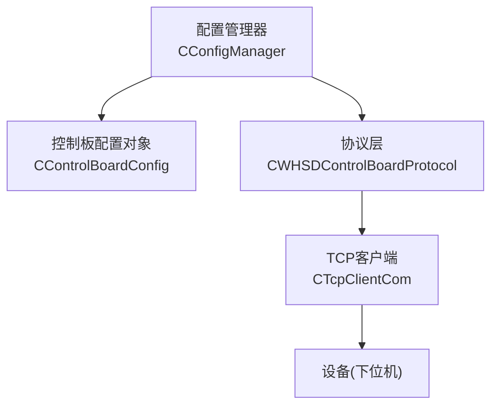
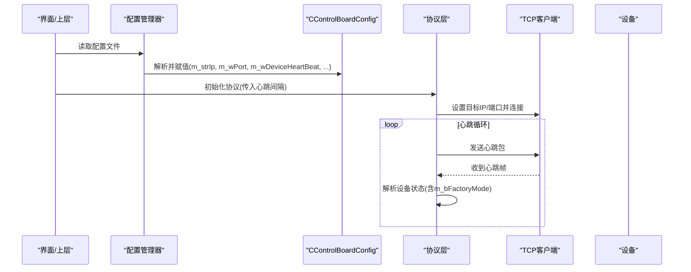
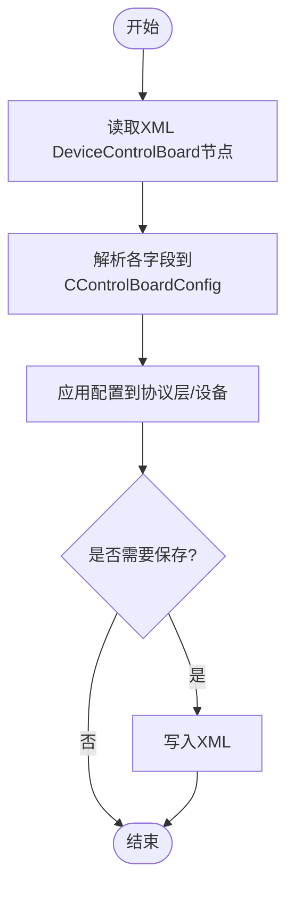
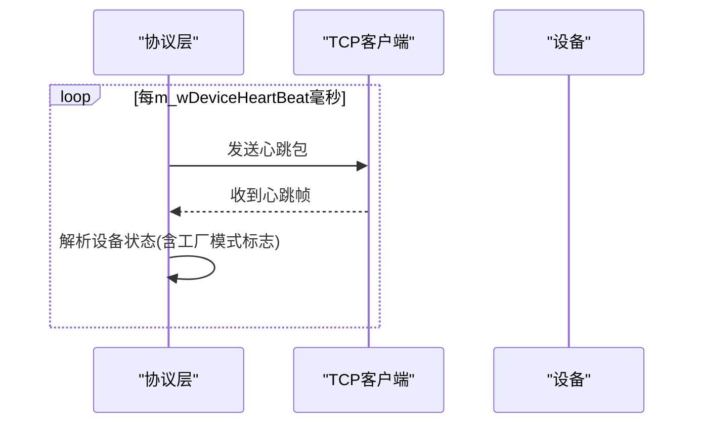
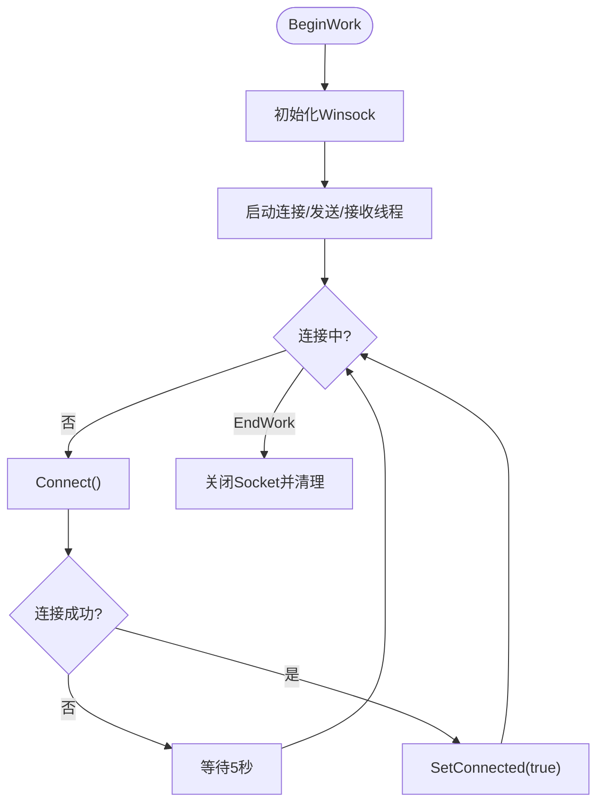

# 设备通信配置

<cite>
**本文引用的文件**
- [ConfigManager.h](file://Insulator_Zero_Value_Detection_Robot/Config/ConfigManager.h)
- [ConfigManager.cpp](file://Insulator_Zero_Value_Detection_Robot/Config/ConfigManager.cpp)
- [WHSDControlBoradProtocol.h](file://Insulator_Zero_Value_Detection_Robot/Protocol/WHSDControlBoradProtocol.h)
- [WHSDControlBoradProtocol.cpp](file://Insulator_Zero_Value_Detection_Robot/Protocol/WHSDControlBoradProtocol.cpp)
- [TcpClient.h](file://Insulator_Zero_Value_Detection_Robot/DeviceCom/TcpClient.h)
- [TcpClient.cpp](file://Insulator_Zero_Value_Detection_Robot/DeviceCom/TcpClient.cpp)
- [操作说明书.md](file://操作说明书.md)
</cite>

## 目录
1. [简介](#简介)
2. [项目结构](#项目结构)
3. [核心组件](#核心组件)
4. [架构总览](#架构总览)
5. [详细组件分析](#详细组件分析)
6. [依赖关系分析](#依赖关系分析)
7. [性能与稳定性建议](#性能与稳定性建议)
8. [故障排查指南](#故障排查指南)
9. [结论](#结论)
10. [附录：参数速查表](#附录参数速查表)

## 简介
本文件面向绝缘子零值检测机器人V2的设备通信配置，聚焦于CControlBoardConfig类的各项配置参数及其对设备行为的影响。内容涵盖网络通信参数（TCP服务器地址、端口、心跳间隔）、设备控制参数（工厂模式开关、探针角度、电机速度、绝缘阈值）的取值范围、默认值、调优方法与应用场景，并提供不同工作环境下的配置建议与安全注意事项。

## 项目结构
本项目通过XML配置文件集中管理设备与控制板相关参数，运行时由配置管理器读取并写入到内存对象中；协议层负责心跳、命令封装与下发；底层使用TCP客户端与设备建立连接并进行数据收发。

图表来源
- [ConfigManager.cpp:16-82](file://Insulator_Zero_Value_Detection_Robot/Config/ConfigManager.cpp#L16-L82)
- [WHSDControlBoradProtocol.h:189-356](file://Insulator_Zero_Value_Detection_Robot/Protocol/WHSDControlBoradProtocol.h#L189-L356)
- [TcpClient.h:8-46](file://Insulator_Zero_Value_Detection_Robot/DeviceCom/TcpClient.h#L8-L46)

章节来源
- [ConfigManager.h:10-24](file://Insulator_Zero_Value_Detection_Robot/Config/ConfigManager.h#L10-L24)
- [ConfigManager.cpp:16-82](file://Insulator_Zero_Value_Detection_Robot/Config/ConfigManager.cpp#L16-L82)

## 核心组件
- CControlBoardConfig：承载设备控制板相关配置，包括网络通信与设备控制参数。
- CConfigManager：从XML读取/写入配置，映射到CControlBoardConfig实例。
- CWHSDControlBoardProtocol：协议封装，包含心跳发送、设备状态解析、校准与运行命令等。
- CTcpClientCom：基于Winsock的TCP客户端，负责连接、重连、发送与接收数据。

章节来源
- [ConfigManager.h:10-24](file://Insulator_Zero_Value_Detection_Robot/Config/ConfigManager.h#L10-L24)
- [ConfigManager.cpp:16-82](file://Insulator_Zero_Value_Detection_Robot/Config/ConfigManager.cpp#L16-L82)
- [WHSDControlBoradProtocol.h:189-356](file://Insulator_Zero_Value_Detection_Robot/Protocol/WHSDControlBoradProtocol.h#L189-L356)
- [TcpClient.h:8-46](file://Insulator_Zero_Value_Detection_Robot/DeviceCom/TcpClient.h#L8-L46)

## 架构总览
配置加载流程：
- 启动时读取XML中的DeviceControlBoard节点，填充CControlBoardConfig成员。
- 协议层根据心跳间隔定时发送心跳包，解析设备返回的心跳帧以获取设备状态（含工厂模式标志）。
- TCP客户端维护与设备的长连接，支持断线自动重连。

图表来源
- [ConfigManager.cpp:16-82](file://Insulator_Zero_Value_Detection_Robot/Config/ConfigManager.cpp#L16-L82)
- [WHSDControlBoradProtocol.cpp:769-802](file://Insulator_Zero_Value_Detection_Robot/Protocol/WHSDControlBoradProtocol.cpp#L769-L802)
- [TcpClient.cpp:163-201](file://Insulator_Zero_Value_Detection_Robot/DeviceCom/TcpClient.cpp#L163-L201)

## 详细组件分析

### CControlBoardConfig 参数详解
该类定义了设备控制板的配置项，具体字段如下：

- m_strIp：TCP服务器地址（字符串）
  - 作用：指定设备侧监听或上位机连接的IP地址
  - 类型：std::string
  - 默认值：空字符串（构造函数中赋值为空）
  - 取值范围：合法IPv4地址
  - 应用场景：现场部署时需设置为设备实际IP或网关可达地址
  - 注意：修改后需重新连接设备

- m_wPort：端口号（无符号16位整数）
  - 作用：TCP通信端口
  - 默认值：0（未配置时为0）
  - 取值范围：1–65535
  - 建议：避免与系统或其他服务冲突，常用端口如8000~9000

- m_wDeviceHeartBeat：心跳间隔（毫秒）
  - 作用：协议层心跳发送周期
  - 默认值：200（构造函数中设定）
  - 取值范围：建议≥100ms，过大影响实时性，过小增加网络负载
  - 调优建议：稳定局域网可用100–200ms；跨网段或高延迟环境可增大至300–500ms

- m_bFactoryMode：工厂模式开关（布尔）
  - 作用：启用工厂模式（通常用于调试/测试）
  - 默认值：false（构造函数中设定）
  - 取值范围：true/false
  - 注意：该标志在设备心跳帧中也存在，可用于校验当前设备是否处于工厂模式

- m_cUpAngle：探针1位置角度（8位无符号整数）
  - 作用：探针向上/向内角度
  - 默认值：由XML读取，若缺失则保持上次值或默认
  - 取值范围：0–255（受硬件限位约束）
  - 调优：根据机械结构与绝缘子串型调整，确保探针可靠接触

- m_cDownAngle：探针待机位置角度（8位无符号整数）
  - 作用：探针复位/待机角度
  - 默认值：由XML读取
  - 取值范围：0–255
  - 调优：保证非工作状态下不干涉设备运动

- m_cUpAngle2：探针2位置角度（8位无符号整数）
  - 作用：第二探针向外角度
  - 默认值：由XML读取
  - 取值范围：0–255
  - 调优：与m_cUpAngle配合，实现双探针协同

- m_cWalkMotorSpeed：行走电机速度（8位无符号整数）
  - 作用：控制机器人行走速度
  - 默认值：由XML读取
  - 取值范围：0–255
  - 调优：低速提高精度，高速提高效率；考虑轨道/导线表面摩擦

- m_cServoSpeed：舵机速度（8位无符号整数）
  - 作用：控制舵机动作速度
  - 默认值：由XML读取
  - 取值范围：0–255
  - 调优：精细调节以保证探针定位精度与响应速度

- m_wInsuThreshold：绝缘阈值（16位无符号整数）
  - 作用：用于判断绝缘状态的阈值
  - 默认值：由XML读取
  - 取值范围：0–65535
  - 调优：依据测量模块标定结果与环境噪声水平设定；过高可能漏判，过低易误判

章节来源
- [ConfigManager.h:10-24](file://Insulator_Zero_Value_Detection_Robot/Config/ConfigManager.h#L10-L24)
- [ConfigManager.cpp:8-14](file://Insulator_Zero_Value_Detection_Robot/Config/ConfigManager.cpp#L8-L14)
- [ConfigManager.cpp:31-81](file://Insulator_Zero_Value_Detection_Robot/Config/ConfigManager.cpp#L31-L81)
- [操作说明书.md:342-346](file://操作说明书.md#L342-L346)

### 配置读写机制
- 读取：CConfigManager::Read从XML的DeviceControlBoard节点解析各字段，填充到CControlBoardConfig。
- 写入：CConfigManager::Write将内存中的配置写回XML，供下次启动加载。
- 保存入口：UI层调用保存逻辑，更新对应字段后调用Write持久化。

图表来源
- [ConfigManager.cpp:16-82](file://Insulator_Zero_Value_Detection_Robot/Config/ConfigManager.cpp#L16-L82)
- [ConfigManager.cpp:259-313](file://Insulator_Zero_Value_Detection_Robot/Config/ConfigManager.cpp#L259-L313)

章节来源
- [ConfigManager.cpp:16-82](file://Insulator_Zero_Value_Detection_Robot/Config/ConfigManager.cpp#L16-L82)
- [ConfigManager.cpp:259-313](file://Insulator_Zero_Value_Detection_Robot/Config/ConfigManager.cpp#L259-L313)

### 心跳与设备状态
- 心跳线程：协议层按m_wDeviceHeartBeat周期发送心跳包。
- 心跳解析：解析设备返回的心跳帧，提取电池、固件信息、主电源状态及工厂模式标志。
- 工厂模式：可通过配置或设备心跳帧中的标志位确认当前模式。

图表来源
- [WHSDControlBoradProtocol.cpp:769-802](file://Insulator_Zero_Value_Detection_Robot/Protocol/WHSDControlBoradProtocol.cpp#L769-L802)
- [WHSDControlBoradProtocol.h:121-187](file://Insulator_Zero_Value_Detection_Robot/Protocol/WHSDControlBoradProtocol.h#L121-L187)

章节来源
- [WHSDControlBoradProtocol.cpp:769-802](file://Insulator_Zero_Value_Detection_Robot/Protocol/WHSDControlBoradProtocol.cpp#L769-L802)
- [WHSDControlBoradProtocol.h:121-187](file://Insulator_Zero_Value_Detection_Robot/Protocol/WHSDControlBoradProtocol.h#L121-L187)

### TCP连接与重连
- 连接方式：非阻塞套接字，连接失败进入重试循环。
- 重连策略：每5秒尝试一次重连，直到成功或停止工作。
- 回调通知：连接状态变化通过回调通知上层。

图表来源
- [TcpClient.cpp:59-87](file://Insulator_Zero_Value_Detection_Robot/DeviceCom/TcpClient.cpp#L59-L87)
- [TcpClient.cpp:123-135](file://Insulator_Zero_Value_Detection_Robot/DeviceCom/TcpClient.cpp#L123-L135)
- [TcpClient.cpp:163-201](file://Insulator_Zero_Value_Detection_Robot/DeviceCom/TcpClient.cpp#L163-L201)

章节来源
- [TcpClient.cpp:59-87](file://Insulator_Zero_Value_Detection_Robot/DeviceCom/TcpClient.cpp#L59-L87)
- [TcpClient.cpp:123-135](file://Insulator_Zero_Value_Detection_Robot/DeviceCom/TcpClient.cpp#L123-L135)
- [TcpClient.cpp:163-201](file://Insulator_Zero_Value_Detection_Robot/DeviceCom/TcpClient.cpp#L163-L201)

## 依赖关系分析
- 配置层依赖tinyxml2进行XML解析与生成。
- 协议层依赖工具函数进行位操作与数据打包。
- TCP客户端依赖Winsock API实现网络通信。
- 各层通过回调与事件机制解耦，便于扩展与维护。

图表来源
- [ConfigManager.cpp:1-6](file://Insulator_Zero_Value_Detection_Robot/Config/ConfigManager.cpp#L1-L6)
- [WHSDControlBoradProtocol.cpp:1-7](file://Insulator_Zero_Value_Detection_Robot/Protocol/WHSDControlBoradProtocol.cpp#L1-L7)
- [TcpClient.cpp:1-9](file://Insulator_Zero_Value_Detection_Robot/DeviceCom/TcpClient.cpp#L1-L9)

章节来源
- [ConfigManager.cpp:1-6](file://Insulator_Zero_Value_Detection_Robot/Config/ConfigManager.cpp#L1-L6)
- [WHSDControlBoradProtocol.cpp:1-7](file://Insulator_Zero_Value_Detection_Robot/Protocol/WHSDControlBoradProtocol.cpp#L1-L7)
- [TcpClient.cpp:1-9](file://Insulator_Zero_Value_Detection_Robot/DeviceCom/TcpClient.cpp#L1-L9)

## 性能与稳定性建议
- 心跳间隔：在稳定局域网内建议100–200ms；跨网段或高延迟环境适当增大，避免频繁重连。
- 端口选择：避免与系统服务冲突，建议使用高位端口。
- 探针角度：根据实际机械结构微调，确保接触可靠且不干涉运动。
- 电机速度：在保证精度的前提下提升效率；复杂工况下降低速度以提高稳定性。
- 绝缘阈值：结合标定结果与环境噪声设定，定期复测以确保准确性。
- 工厂模式：仅在调试阶段开启，正常作业应关闭以避免异常行为。

[本节为通用指导，无需特定文件引用]

## 故障排查指南
- 无法连接设备：
  - 检查m_strIp与m_wPort是否正确，确认设备已开机且网络可达。
  - 观察TCP客户端日志，确认是否进入重连循环。
- 心跳超时或状态异常：
  - 调整m_wDeviceHeartBeat，避免过短导致丢包或过长导致超时。
  - 检查设备是否处于工厂模式（m_bFactoryMode），必要时切换回正常模式。
- 探针角度异常：
  - 核对m_cUpAngle、m_cDownAngle、m_cUpAngle2的设置，确保在机械允许范围内。
  - 执行单点校准流程，确保测量模块读数准确。
- 绝缘阈值误判：
  - 重新标定测量模块，更新m_wInsuThreshold。
  - 参考操作说明书中的校准步骤进行验证。

章节来源
- [操作说明书.md:342-346](file://操作说明书.md#L342-L346)
- [WHSDControlBoradProtocol.cpp:769-802](file://Insulator_Zero_Value_Detection_Robot/Protocol/WHSDControlBoradProtocol.cpp#L769-L802)
- [ConfigManager.cpp:16-82](file://Insulator_Zero_Value_Detection_Robot/Config/ConfigManager.cpp#L16-L82)

## 结论
CControlBoardConfig提供了设备通信与控制的完整参数集，合理配置可显著提升检测精度与运行稳定性。建议在不同工作环境下进行针对性调优，并遵循安全注意事项，避免不当配置导致设备损坏或测量误差。

[本节为总结性内容，无需特定文件引用]

## 附录：参数速查表
- m_strIp：TCP服务器地址，字符串，默认空，需设置为设备可达IP
- m_wPort：端口号，1–65535，默认0，避免冲突
- m_wDeviceHeartBeat：心跳间隔(ms)，默认200，建议100–500
- m_bFactoryMode：工厂模式开关，默认false，调试用
- m_cUpAngle：探针1角度，0–255，根据机械结构设定
- m_cDownAngle：探针待机角度，0–255，确保复位安全
- m_cUpAngle2：探针2角度，0–255，与m_cUpAngle协同
- m_cWalkMotorSpeed：行走速度，0–255，平衡精度与效率
- m_cServoSpeed：舵机速度，0–255，保证定位精度
- m_wInsuThreshold：绝缘阈值，0–65535，依据标定与环境设定

章节来源
- [ConfigManager.h:10-24](file://Insulator_Zero_Value_Detection_Robot/Config/ConfigManager.h#L10-L24)
- [ConfigManager.cpp:8-14](file://Insulator_Zero_Value_Detection_Robot/Config/ConfigManager.cpp#L8-L14)
- [操作说明书.md:342-346](file://操作说明书.md#L342-L346)