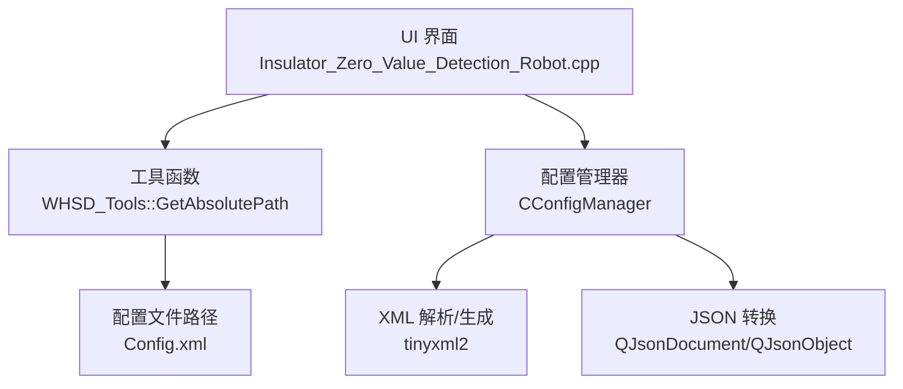
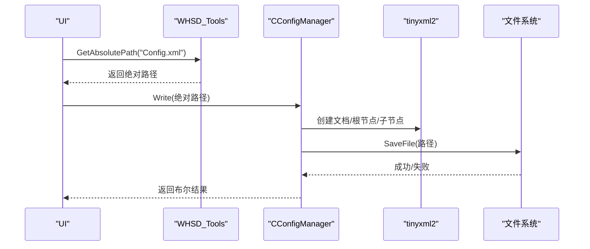
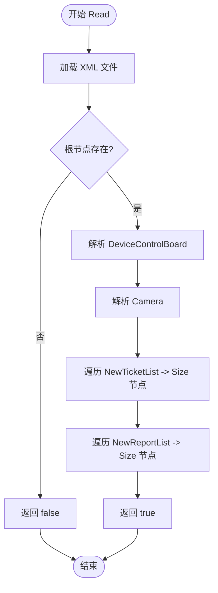
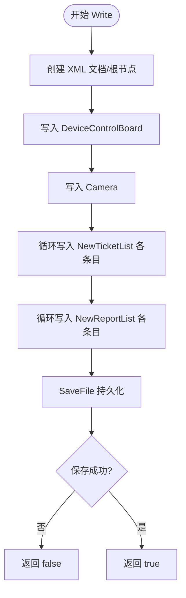
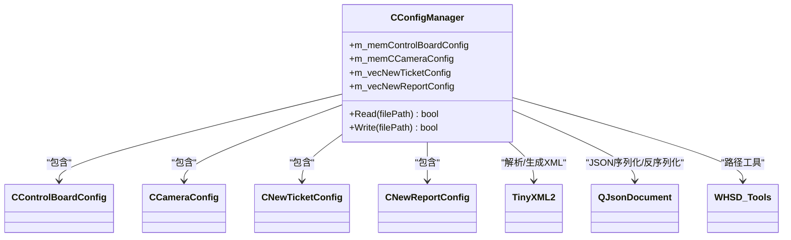

# 配置文件管理

<cite>
**本文引用的文件**
- [ConfigManager.h](file://Insulator_Zero_Value_Detection_Robot/Config/ConfigManager.h)
- [ConfigManager.cpp](file://Insulator_Zero_Value_Detection_Robot/Config/ConfigManager.cpp)
- [Tools.h](file://Insulator_Zero_Value_Detection_Robot/Tools/Tools.h)
- [Tools.cpp](file://Insulator_Zero_Value_Detection_Robot/Tools/Tools.cpp)
- [Insulator_Zero_Value_Detection_Robot.cpp](file://Insulator_Zero_Value_Detection_Robot/UI/Insulator_Zero_Value_Detection_Robot.cpp)
</cite>

## 目录
1. [简介](#简介)
2. [项目结构](#项目结构)
3. [核心组件](#核心组件)
4. [架构总览](#架构总览)
5. [详细组件分析](#详细组件分析)
6. [依赖关系分析](#依赖关系分析)
7. [性能考虑](#性能考虑)
8. [故障排查指南](#故障排查指南)
9. [结论](#结论)
10. [附录](#附录)

## 简介
本文件面向绝缘子零值检测机器人V2的“配置文件管理”模块，聚焦 CConfigManager 类及其对 XML 配置文件的读取与写入机制。文档涵盖：
- 配置文件的组织结构、命名规范与存储路径约定
- 配置数据的序列化/反序列化流程（含 QJsonObject、std::vector 等复杂类型）
- 配置备份恢复、版本管理与迁移建议
- 配置验证、错误处理与异常恢复策略
- 安全保护与访问权限控制建议

## 项目结构
配置相关代码集中在 Config 目录，工具函数在 Tools 目录，UI 层通过工具函数拼接配置文件路径并调用 CConfigManager 进行读写。

**图表来源**
- [Insulator_Zero_Value_Detection_Robot.cpp:2022-2027](file://Insulator_Zero_Value_Detection_Robot/UI/Insulator_Zero_Value_Detection_Robot.cpp#L2022-L2027)
- [Tools.cpp:317-327](file://Insulator_Zero_Value_Detection_Robot/Tools/Tools.cpp#L317-L327)
- [ConfigManager.cpp:16-257](file://Insulator_Zero_Value_Detection_Robot/Config/ConfigManager.cpp#L16-L257)
- [ConfigManager.cpp:259-452](file://Insulator_Zero_Value_Detection_Robot/Config/ConfigManager.cpp#L259-L452)

**章节来源**
- [ConfigManager.h:10-199](file://Insulator_Zero_Value_Detection_Robot/Config/ConfigManager.h#L10-L199)
- [ConfigManager.cpp:16-452](file://Insulator_Zero_Value_Detection_Robot/Config/ConfigManager.cpp#L16-L452)
- [Tools.cpp:317-327](file://Insulator_Zero_Value_Detection_Robot/Tools/Tools.cpp#L317-L327)
- [Insulator_Zero_Value_Detection_Robot.cpp:2022-2027](file://Insulator_Zero_Value_Detection_Robot/UI/Insulator_Zero_Value_Detection_Robot.cpp#L2022-L2027)

## 核心组件
- CControlBoardConfig：控制板通信与运行参数（IP、端口、心跳、工厂模式、角度、速度、阈值等）
- CCameraConfig：相机配置（左右中 IP、是否新款相机、主码流开关、RTSP 地址）
- CNewTicketConfig：工单配置（线路、杆塔、串数、回路、交直流、时间、人员、备注、测量数据 JSON）
- CNewReportConfig：报告配置（报告编号、单位、人员、地点）
- CConfigManager：统一入口，提供 Read(filePath)/Write(filePath)，负责 XML 到内存对象的双向转换

**章节来源**
- [ConfigManager.h:10-199](file://Insulator_Zero_Value_Detection_Robot/Config/ConfigManager.h#L10-L199)

## 架构总览
CConfigManager 作为配置中心，使用 tinyxml2 解析/生成 XML，使用 Qt JSON 库处理复杂字段（如测量数据）。UI 层通过 WHSD_Tools::GetAbsolutePath 获取绝对路径，再调用 CConfigManager 完成持久化。

**图表来源**
- [Insulator_Zero_Value_Detection_Robot.cpp:2022-2027](file://Insulator_Zero_Value_Detection_Robot/UI/Insulator_Zero_Value_Detection_Robot.cpp#L2022-L2027)
- [Tools.cpp:317-327](file://Insulator_Zero_Value_Detection_Robot/Tools/Tools.cpp#L317-L327)
- [ConfigManager.cpp:259-452](file://Insulator_Zero_Value_Detection_Robot/Config/ConfigManager.cpp#L259-L452)

## 详细组件分析

### CConfigManager：读取流程（Read）
- 使用 tinyxml2::XMLDocument 加载文件，校验根节点存在
- 按固定层级解析 DeviceControlBoard、Camera、NewTicketList、NewReportList
- 将字符串/数值映射到对应成员变量；枚举通过静态方法在字符串与枚举间转换
- 复杂字段 TicketMearData 以 JSON 文本形式存储，读取时通过 QJsonDocument 解析为 QJsonObject

**图表来源**
- [ConfigManager.cpp:16-257](file://Insulator_Zero_Value_Detection_Robot/Config/ConfigManager.cpp#L16-L257)

**章节来源**
- [ConfigManager.cpp:16-257](file://Insulator_Zero_Value_Detection_Robot/Config/ConfigManager.cpp#L16-L257)

### CConfigManager：写入流程（Write）
- 构建 XML 文档，设置根节点 Config
- 依次写入 DeviceControlBoard、Camera、NewTicketList、NewReportList
- 枚举字段通过静态方法转为字符串写入
- 复杂字段 TicketMearData 先将 QJsonObject 序列化为紧凑 JSON 字符串，再写入 XML 文本节点
- 最终调用 tinyxml2 保存文件，失败返回 false

**图表来源**
- [ConfigManager.cpp:259-452](file://Insulator_Zero_Value_Detection_Robot/Config/ConfigManager.cpp#L259-L452)

**章节来源**
- [ConfigManager.cpp:259-452](file://Insulator_Zero_Value_Detection_Robot/Config/ConfigManager.cpp#L259-L452)

### 数据结构与序列化要点
- 基础类型：string、uint16_t、uint8_t、bool 直接映射到 XML 元素文本
- 枚举类型：通过 CNewTicketConfig 的静态方法在字符串与枚举之间双向转换
- 复杂类型：
  - QJsonObject：序列化/反序列化为 JSON 字符串后嵌入 XML 文本节点
  - std::vector<CNewTicketConfig> / std::vector<CNewReportConfig>：通过循环遍历写入/读取多个 Size 节点

**章节来源**
- [ConfigManager.h:52-183](file://Insulator_Zero_Value_Detection_Robot/Config/ConfigManager.h#L52-L183)
- [ConfigManager.cpp:132-217](file://Insulator_Zero_Value_Detection_Robot/Config/ConfigManager.cpp#L132-L217)
- [ConfigManager.cpp:349-414](file://Insulator_Zero_Value_Detection_Robot/Config/ConfigManager.cpp#L349-L414)

### 配置文件的组织结构与命名规范
- 根节点：Config
- 一级分组：
  - DeviceControlBoard：控制板通信与运行参数
  - Camera：相机配置
  - NewTicketList：工单列表，每个工单为一个 Size 节点
  - NewReportList：报告列表，每个报告为一个 Size 节点
- 命名规范：
  - 所有字段名与解析/写入逻辑严格一致（如 Ip、Port、Left、Mid、Right、BunchType、LoopType、CurrentType、StartTime、EndTime、Remark、TicketId、LineName、PoleNumber、InsulatorSliceNum、DetectionUnit、DetectionPerson、WorkPlace、ReportId）
  - 枚举字段采用中文可读字符串（如“单联”、“双联”、“同塔单回”、“交流”等），便于人工编辑与核对

**章节来源**
- [ConfigManager.cpp:269-443](file://Insulator_Zero_Value_Detection_Robot/Config/ConfigManager.cpp#L269-L443)

### 存储路径约定
- 配置文件名称：Config.xml
- 路径获取：通过 WHSD_Tools::GetAbsolutePath("Config.xml") 获得绝对路径
- 运行期行为：
  - Debug 模式：相对当前工作目录
  - Release 模式：位于可执行文件所在目录下

**章节来源**
- [Insulator_Zero_Value_Detection_Robot.cpp:2022-2027](file://Insulator_Zero_Value_Detection_Robot/UI/Insulator_Zero_Value_Detection_Robot.cpp#L2022-L2027)
- [Tools.cpp:317-327](file://Insulator_Zero_Value_Detection_Robot/Tools/Tools.cpp#L317-L327)

### 配置验证机制
- 读取阶段：
  - 文件加载失败或根节点缺失直接返回 false
  - 关键节点缺失（如 DeviceControlBoard、Camera、NewTicketList、NewReportList）返回 false
  - 数值型字段使用 QueryIntText 转换，失败则跳过赋值（保持默认值）
- 写入阶段：
  - 枚举字段通过静态方法转换为合法字符串
  - JSON 字段序列化失败会保留空对象（不中断整体写入）
- 建议增强：
  - 增加范围校验（如端口号、角度、阈值等）
  - 增加必填字段校验（如 TicketId、LineName 等）
  - 增加格式校验（如 StartTime/EndTime 日期格式）

**章节来源**
- [ConfigManager.cpp:16-257](file://Insulator_Zero_Value_Detection_Robot/Config/ConfigManager.cpp#L16-L257)
- [ConfigManager.cpp:259-452](file://Insulator_Zero_Value_Detection_Robot/Config/ConfigManager.cpp#L259-L452)

### 错误处理与异常恢复策略
- 文件 I/O：
  - 读取失败：返回 false，调用方应提示用户或回退到默认配置
  - 写入失败：返回 false，建议重试一次或提示用户检查磁盘权限/空间
- 解析异常：
  - XML 节点缺失：返回 false，避免部分加载导致状态不一致
  - JSON 解析失败：忽略该条目的复杂字段，继续处理其他字段
- 建议：
  - 在 UI 层捕获返回值并给出明确提示
  - 记录日志（文件名、错误码、堆栈信息）以便定位问题

**章节来源**
- [ConfigManager.cpp:16-257](file://Insulator_Zero_Value_Detection_Robot/Config/ConfigManager.cpp#L16-L257)
- [ConfigManager.cpp:259-452](file://Insulator_Zero_Value_Detection_Robot/Config/ConfigManager.cpp#L259-L452)

### 备份恢复、版本管理与迁移工具
- 备份恢复：
  - 建议在每次写操作前复制 Config.xml 为 Config.xml.bak
  - 读操作失败时可尝试从 .bak 恢复
- 版本管理：
  - 可在根节点或独立节点加入版本号字段，用于兼容旧版配置
  - 读取时根据版本进行字段映射或迁移
- 迁移工具：
  - 新增字段时，提供向后兼容的默认值
  - 废弃字段时，在迁移阶段剔除或转换到新字段

[本节为通用实践建议，未直接引用具体实现]

### 安全保护措施与访问权限控制
- 文件权限：
  - 确保应用对 Config.xml 有读写权限
  - 部署环境限制非管理员修改配置文件
- 内容完整性：
  - 可对配置文件计算哈希值（如 SHA-256）并校验，防止篡改
- 敏感信息：
  - 若包含密码或密钥，建议加密存储或使用系统凭据管理
- 最小权限原则：
  - 仅授予必要的文件系统访问权限

[本节为通用实践建议，未直接引用具体实现]

## 依赖关系分析
- CConfigManager 依赖：
  - tinyxml2：XML 解析与生成
  - Qt JSON：QJsonDocument/QJsonObject 处理复杂字段
  - WHSD_Tools：路径与文件工具
- UI 层依赖：
  - 通过 WHSD_Tools::GetAbsolutePath 获取绝对路径
  - 调用 CConfigManager::Write 保存配置

**图表来源**
- [ConfigManager.h:10-199](file://Insulator_Zero_Value_Detection_Robot/Config/ConfigManager.h#L10-L199)
- [ConfigManager.cpp:16-452](file://Insulator_Zero_Value_Detection_Robot/Config/ConfigManager.cpp#L16-L452)
- [Tools.cpp:317-327](file://Insulator_Zero_Value_Detection_Robot/Tools/Tools.cpp#L317-L327)

**章节来源**
- [ConfigManager.h:10-199](file://Insulator_Zero_Value_Detection_Robot/Config/ConfigManager.h#L10-L199)
- [ConfigManager.cpp:16-452](file://Insulator_Zero_Value_Detection_Robot/Config/ConfigManager.cpp#L16-L452)
- [Tools.cpp:317-327](file://Insulator_Zero_Value_Detection_Robot/Tools/Tools.cpp#L317-L327)

## 性能考虑
- XML 解析/生成：
  - 小文件场景下性能良好；大量工单/报告时注意循环开销
- JSON 序列化：
  - 使用紧凑模式减少体积，提升 I/O 效率
- 内存占用：
  - 避免重复构造临时对象；合理预分配容器容量
- I/O 优化：
  - 批量写入前先构建完整 XML 树，再一次性保存
  - 避免频繁打开/关闭文件句柄

[本节为通用性能建议，未直接引用具体实现]

## 故障排查指南
- 常见问题与定位：
  - 读取失败：检查文件是否存在、路径是否正确、XML 格式是否合法
  - 写入失败：检查磁盘空间、文件权限、路径是否有效
  - 字段未生效：检查 XML 节点名称是否与解析逻辑一致
  - JSON 字段为空：检查序列化过程是否抛出异常或被忽略
- 建议步骤：
  - 打印或记录 Read/Write 返回值
  - 输出关键节点的值，确认序列化/反序列化正确性
  - 对比备份文件，定位变更点

**章节来源**
- [ConfigManager.cpp:16-257](file://Insulator_Zero_Value_Detection_Robot/Config/ConfigManager.cpp#L16-L257)
- [ConfigManager.cpp:259-452](file://Insulator_Zero_Value_Detection_Robot/Config/ConfigManager.cpp#L259-L452)

## 结论
CConfigManager 提供了稳定、清晰的 XML 配置读写能力，支持基础数据类型、枚举以及复杂 JSON 字段的序列化/反序列化。结合 WHSD_Tools 的路径管理，实现了跨调试/发布模式的统一配置存储。建议在此基础上增强配置验证、备份恢复与版本迁移能力，以提升系统的健壮性与可维护性。

## 附录
- 典型调用示例（路径与保存）：
  - 获取绝对路径：WHSD_Tools::GetAbsolutePath("Config.xml")
  - 保存配置：CConfigManager::Write(绝对路径)
- 参考位置：
  - 路径工具：[Tools.cpp:317-327](file://Insulator_Zero_Value_Detection_Robot/Tools/Tools.cpp#L317-L327)
  - 保存调用：[Insulator_Zero_Value_Detection_Robot.cpp:2022-2027](file://Insulator_Zero_Value_Detection_Robot/UI/Insulator_Zero_Value_Detection_Robot.cpp#L2022-L2027)