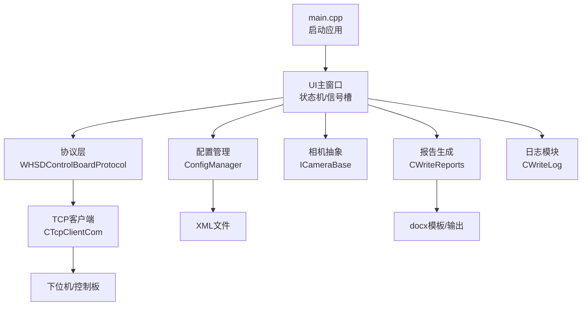
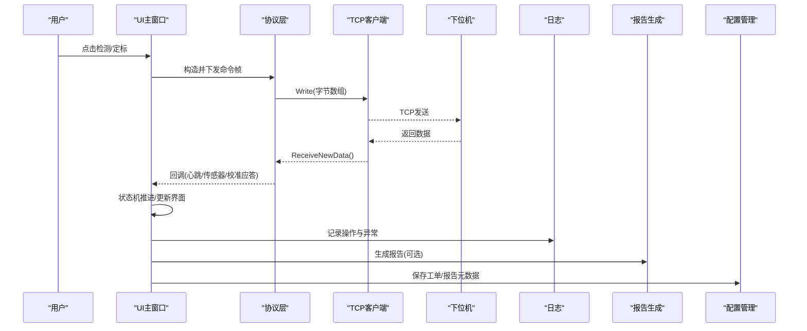
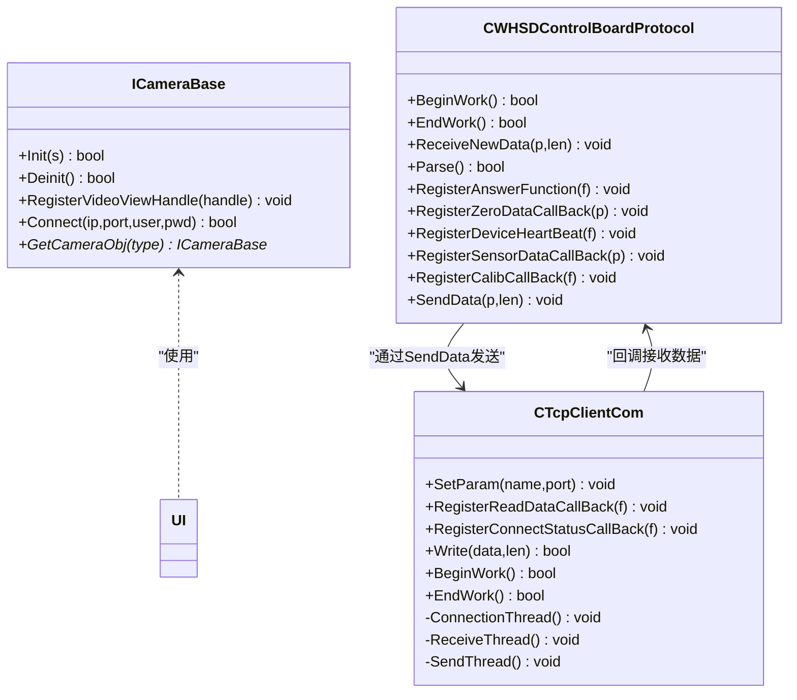
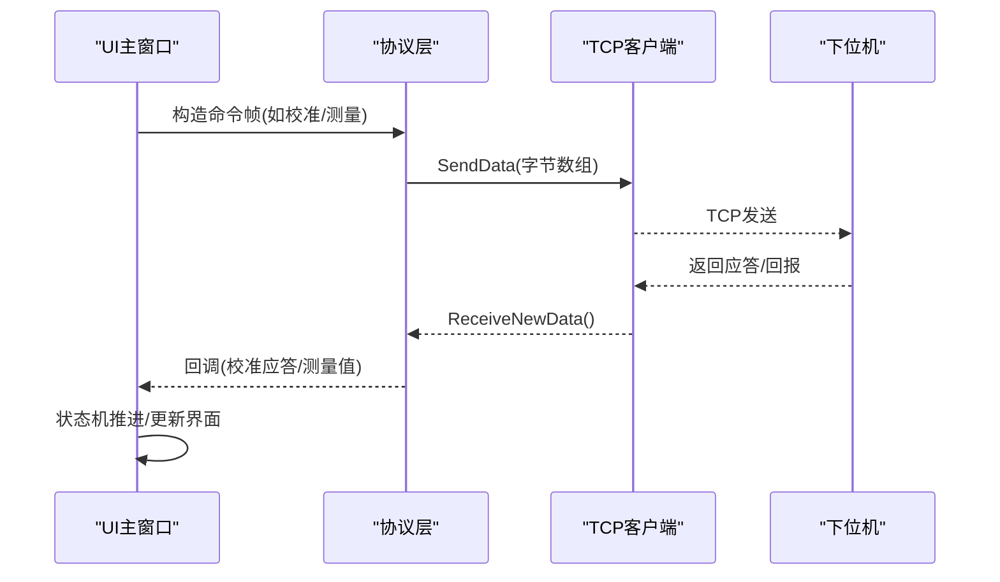
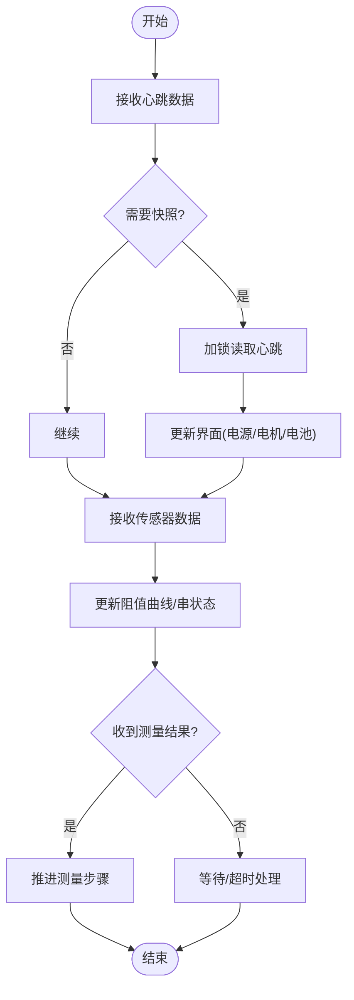
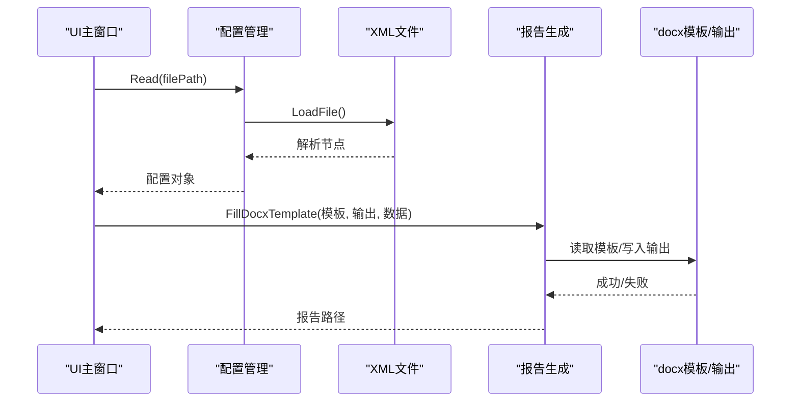
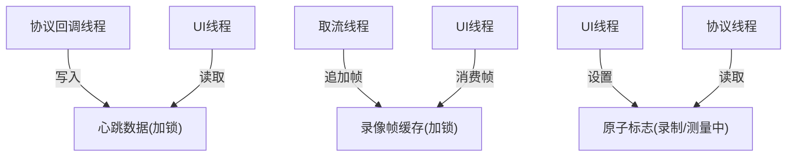
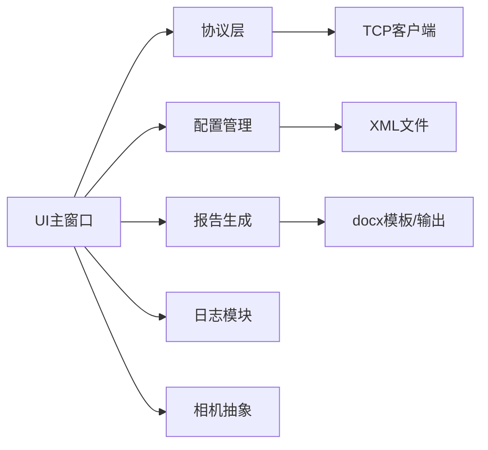
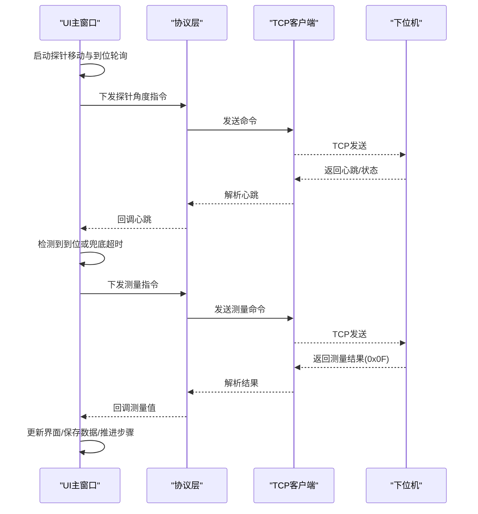
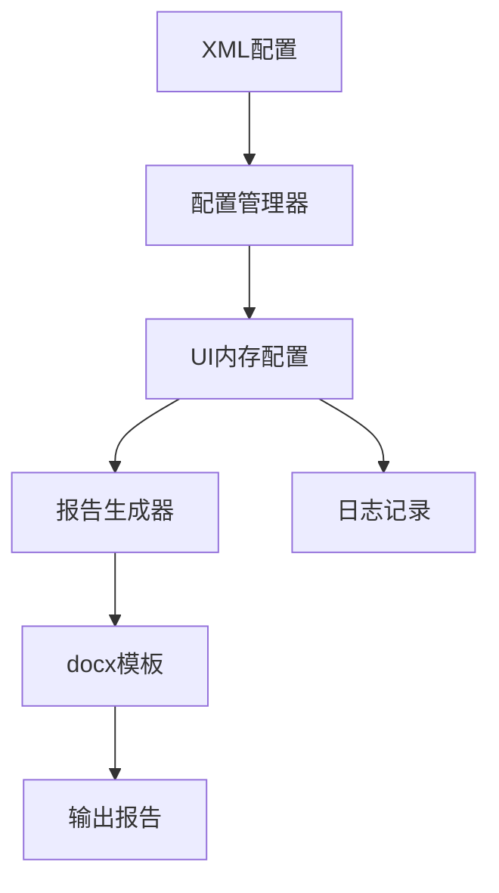

# 数据流设计

<cite>
**本文引用的文件**
- [main.cpp](file://Insulator_Zero_Value_Detection_Robot/main.cpp)
- [UI/Insulator_Zero_Value_Detection_Robot.h](file://Insulator_Zero_Value_Detection_Robot/UI/Insulator_Zero_Value_Detection_Robot.h)
- [Config/ConfigManager.h](file://Insulator_Zero_Value_Detection_Robot/Config/ConfigManager.h)
- [Config/ConfigManager.cpp](file://Insulator_Zero_Value_Detection_Robot/Config/ConfigManager.cpp)
- [DeviceCom/TcpClient.h](file://Insulator_Zero_Value_Detection_Robot/DeviceCom/TcpClient.h)
- [DeviceCom/TcpClient.cpp](file://Insulator_Zero_Value_Detection_Robot/DeviceCom/TcpClient.cpp)
- [Protocol/WHSDControlBoradProtocol.h](file://Insulator_Zero_Value_Detection_Robot/Protocol/WHSDControlBoradProtocol.h)
- [Camera/CameraBase.h](file://Insulator_Zero_Value_Detection_Robot/Camera/CameraBase.h)
- [Report/WriteReports.h](file://Insulator_Zero_Value_Detection_Robot/Report/WriteReports.h)
- [Report/WriteReports.cpp](file://Insulator_Zero_Value_Detection_Robot/Report/WriteReports.cpp)
- [Log/ScanS_WriteLog.h](file://Insulator_Zero_Value_Detection_Robot/Log/ScanS_WriteLog.h)
- [Tools/BinData.h](file://Insulator_Zero_Value_Detection_Robot/Tools/BinData.h)
</cite>

## 目录
1. [引言](#引言)
2. [项目结构](#项目结构)
3. [核心组件](#核心组件)
4. [架构总览](#架构总览)
5. [详细组件分析](#详细组件分析)
6. [依赖关系分析](#依赖关系分析)
7. [性能考虑](#性能考虑)
8. [故障排查指南](#故障排查指南)
9. [结论](#结论)
10. [附录：关键数据流图与时序](#附录关键数据流图与时序)

## 引言
本文件面向绝缘子零值检测机器人V2，聚焦“数据流设计”，覆盖以下方面：
- 检测数据采集、传输、处理与存储的完整流程
- 控制指令下发与响应处理机制
- 实时数据的监控与显示流程
- 配置文件与报告文件的读写流程
- 数据同步机制与线程安全考虑
- 异常情况处理与数据一致性保证
- 数据流的调试与监控方法

## 项目结构
系统采用分层模块化组织：
- UI层：Qt主窗口与交互逻辑，负责状态机、定时器、信号槽、界面刷新
- 协议层：控制板通信协议封装，解析心跳、传感器数据、校准应答等
- 设备通信层：TCP客户端实现，多线程收发、重连、队列缓冲
- 配置管理：XML配置读取/写入，工单/报告元数据持久化
- 报告生成：基于docx模板填充测量数据与占位符
- 日志记录：多进程/多线程安全的日志写入
- 工具库：二进制序列化、Base64编解码等

图表来源
- [main.cpp:11-23](file://Insulator_Zero_Value_Detection_Robot/main.cpp#L11-L23)
- [UI/Insulator_Zero_Value_Detection_Robot.h:26-384](file://Insulator_Zero_Value_Detection_Robot/UI/Insulator_Zero_Value_Detection_Robot.h#L26-L384)
- [Config/ConfigManager.h:185-194](file://Insulator_Zero_Value_Detection_Robot/Config/ConfigManager.h#L185-L194)
- [Protocol/WHSDControlBoradProtocol.h:189-356](file://Insulator_Zero_Value_Detection_Robot/Protocol/WHSDControlBoradProtocol.h#L189-L356)
- [DeviceCom/TcpClient.h:8-46](file://Insulator_Zero_Value_Detection_Robot/DeviceCom/TcpClient.h#L8-L46)
- [Report/WriteReports.h:24-89](file://Insulator_Zero_Value_Detection_Robot/Report/WriteReports.h#L24-L89)
- [Log/ScanS_WriteLog.h:5-43](file://Insulator_Zero_Value_Detection_Robot/Log/ScanS_WriteLog.h#L5-L43)

章节来源
- [main.cpp:11-23](file://Insulator_Zero_Value_Detection_Robot/main.cpp#L11-L23)
- [UI/Insulator_Zero_Value_Detection_Robot.h:26-384](file://Insulator_Zero_Value_Detection_Robot/UI/Insulator_Zero_Value_Detection_Robot.h#L26-L384)

## 核心组件
- UI主窗口：承载测量流程状态机、探针到位轮询、结果超时处理、截图与录像、告警面板、工单/报告表维护、定标流程控制
- 协议层：封装控制板命令帧构造与解析，注册各类回调（心跳、传感器数据、校准应答、OTA）
- TCP客户端：连接管理、发送队列、接收线程、重连策略、连接状态回调
- 配置管理：从XML加载设备参数、相机参数、工单列表；支持写入
- 报告生成：基于docx模板替换占位符，动态填充测量数据表格
- 日志模块：线程安全写日志，支持同步/异步模式
- 工具库：容器与二进制互转、Base64编解码

章节来源
- [UI/Insulator_Zero_Value_Detection_Robot.h:26-384](file://Insulator_Zero_Value_Detection_Robot/UI/Insulator_Zero_Value_Detection_Robot.h#L26-L384)
- [Protocol/WHSDControlBoradProtocol.h:189-356](file://Insulator_Zero_Value_Detection_Robot/Protocol/WHSDControlBoradProtocol.h#L189-L356)
- [DeviceCom/TcpClient.h:8-46](file://Insulator_Zero_Value_Detection_Robot/DeviceCom/TcpClient.h#L8-L46)
- [Config/ConfigManager.h:185-194](file://Insulator_Zero_Value_Detection_Robot/Config/ConfigManager.h#L185-L194)
- [Report/WriteReports.h:24-89](file://Insulator_Zero_Value_Detection_Robot/Report/WriteReports.h#L24-L89)
- [Log/ScanS_WriteLog.h:5-43](file://Insulator_Zero_Value_Detection_Robot/Log/ScanS_WriteLog.h#L5-L43)
- [Tools/BinData.h:9-73](file://Insulator_Zero_Value_Detection_Robot/Tools/BinData.h#L9-L73)

## 架构总览
系统数据流围绕“采集—传输—处理—展示—存储”闭环展开：
- 采集：相机取流、传感器/控制板数据通过协议层解析
- 传输：TCP客户端多线程收发，带队列与条件变量
- 处理：UI状态机驱动测量流程，协议回调切回UI线程处理
- 展示：实时视频、曲线、串状态、告警面板
- 存储：配置XML、报告docx、日志文件

图表来源
- [UI/Insulator_Zero_Value_Detection_Robot.h:26-384](file://Insulator_Zero_Value_Detection_Robot/UI/Insulator_Zero_Value_Detection_Robot.h#L26-L384)
- [Protocol/WHSDControlBoradProtocol.h:189-356](file://Insulator_Zero_Value_Detection_Robot/Protocol/WHSDControlBoradProtocol.h#L189-L356)
- [DeviceCom/TcpClient.cpp:43-87](file://Insulator_Zero_Value_Detection_Robot/DeviceCom/TcpClient.cpp#L43-L87)
- [Report/WriteReports.cpp:107-151](file://Insulator_Zero_Value_Detection_Robot/Report/WriteReports.cpp#L107-L151)
- [Config/ConfigManager.cpp:16-200](file://Insulator_Zero_Value_Detection_Robot/Config/ConfigManager.cpp#L16-L200)

## 详细组件分析

### 数据采集与传输（相机与控制板）
- 相机抽象接口提供初始化、连接、视图句柄注册能力，具体实现由类型工厂获取
- 控制板协议层负责心跳、传感器数据、校准应答等解析，并通过回调通知上层
- TCP客户端使用三个线程：连接、接收、发送；发送使用队列+条件变量，避免阻塞；连接失败自动重试

图表来源
- [Camera/CameraBase.h:5-14](file://Insulator_Zero_Value_Detection_Robot/Camera/CameraBase.h#L5-L14)
- [Protocol/WHSDControlBoradProtocol.h:189-356](file://Insulator_Zero_Value_Detection_Robot/Protocol/WHSDControlBoradProtocol.h#L189-L356)
- [DeviceCom/TcpClient.h:8-46](file://Insulator_Zero_Value_Detection_Robot/DeviceCom/TcpClient.h#L8-L46)

章节来源
- [Camera/CameraBase.h:5-14](file://Insulator_Zero_Value_Detection_Robot/Camera/CameraBase.h#L5-L14)
- [Protocol/WHSDControlBoradProtocol.h:189-356](file://Insulator_Zero_Value_Detection_Robot/Protocol/WHSDControlBoradProtocol.h#L189-L356)
- [DeviceCom/TcpClient.h:8-46](file://Insulator_Zero_Value_Detection_Robot/DeviceCom/TcpClient.h#L8-L46)
- [DeviceCom/TcpClient.cpp:43-87](file://Insulator_Zero_Value_Detection_Robot/DeviceCom/TcpClient.cpp#L43-L87)

### 控制指令下发与响应处理
- UI根据当前步骤构造协议命令帧，调用协议层发送
- 协议层将命令写入TCP发送队列，由发送线程发出
- 下位机返回数据经接收线程进入协议层解析，触发相应回调
- UI侧通过信号槽将协议线程回调切换到UI线程处理，确保界面安全更新

图表来源
- [Protocol/WHSDControlBoradProtocol.h:189-356](file://Insulator_Zero_Value_Detection_Robot/Protocol/WHSDControlBoradProtocol.h#L189-L356)
- [DeviceCom/TcpClient.cpp:43-87](file://Insulator_Zero_Value_Detection_Robot/DeviceCom/TcpClient.cpp#L43-L87)
- [UI/Insulator_Zero_Value_Detection_Robot.h:36-127](file://Insulator_Zero_Value_Detection_Robot/UI/Insulator_Zero_Value_Detection_Robot.h#L36-L127)

章节来源
- [Protocol/WHSDControlBoradProtocol.h:189-356](file://Insulator_Zero_Value_Detection_Robot/Protocol/WHSDControlBoradProtocol.h#L189-L356)
- [DeviceCom/TcpClient.cpp:43-87](file://Insulator_Zero_Value_Detection_Robot/DeviceCom/TcpClient.cpp#L43-L87)
- [UI/Insulator_Zero_Value_Detection_Robot.h:36-127](file://Insulator_Zero_Value_Detection_Robot/UI/Insulator_Zero_Value_Detection_Robot.h#L36-L127)

### 实时数据监控与显示
- 心跳数据：协议层解析后回调UI，UI持有锁快照读取，避免读到半写数据
- 传感器数据：协议层回调UI，更新阻值曲线与串状态
- 测量结果：UI状态机在收到结果后更新界面，并触发后续步骤或结束
- 截图与录像：测量期间截图保存，录像帧缓存由互斥保护

图表来源
- [UI/Insulator_Zero_Value_Detection_Robot.h:99-106](file://Insulator_Zero_Value_Detection_Robot/UI/Insulator_Zero_Value_Detection_Robot.h#L99-L106)
- [Protocol/WHSDControlBoradProtocol.h:121-187](file://Insulator_Zero_Value_Detection_Robot/Protocol/WHSDControlBoradProtocol.h#L121-L187)

章节来源
- [UI/Insulator_Zero_Value_Detection_Robot.h:99-106](file://Insulator_Zero_Value_Detection_Robot/UI/Insulator_Zero_Value_Detection_Robot.h#L99-L106)
- [Protocol/WHSDControlBoradProtocol.h:121-187](file://Insulator_Zero_Value_Detection_Robot/Protocol/WHSDControlBoradProtocol.h#L121-L187)

### 配置文件与报告文件的读写流程
- 配置读取：XML解析设备参数、相机参数、工单列表；支持二进制字段Base64存取
- 配置写入：将内存配置对象序列化为XML
- 报告生成：基于docx模板替换占位符，动态填充测量数据表格，输出新docx

图表来源
- [Config/ConfigManager.cpp:16-200](file://Insulator_Zero_Value_Detection_Robot/Config/ConfigManager.cpp#L16-L200)
- [Report/WriteReports.cpp:107-151](file://Insulator_Zero_Value_Detection_Robot/Report/WriteReports.cpp#L107-L151)
- [Tools/BinData.h:34-44](file://Insulator_Zero_Value_Detection_Robot/Tools/BinData.h#L34-L44)

章节来源
- [Config/ConfigManager.cpp:16-200](file://Insulator_Zero_Value_Detection_Robot/Config/ConfigManager.cpp#L16-L200)
- [Report/WriteReports.cpp:107-151](file://Insulator_Zero_Value_Detection_Robot/Report/WriteReports.cpp#L107-L151)
- [Tools/BinData.h:34-44](file://Insulator_Zero_Value_Detection_Robot/Tools/BinData.h#L34-L44)

### 数据同步机制与线程安全
- TCP客户端：发送队列使用互斥锁+条件变量，接收/发送/连接三线程独立运行
- 心跳快照：协议回调线程持锁写入，UI线程读取同样需持锁，避免脏读
- 录像帧缓存：互斥锁保护跨线程读写，避免缓冲区竞争
- 原子标志：连接状态、录制标志、测量中标志使用atomic，保证无锁可见性

图表来源
- [DeviceCom/TcpClient.h:32-41](file://Insulator_Zero_Value_Detection_Robot/DeviceCom/TcpClient.h#L32-L41)
- [UI/Insulator_Zero_Value_Detection_Robot.h:272-279](file://Insulator_Zero_Value_Detection_Robot/UI/Insulator_Zero_Value_Detection_Robot.h#L272-L279)
- [UI/Insulator_Zero_Value_Detection_Robot.h:367-368](file://Insulator_Zero_Value_Detection_Robot/UI/Insulator_Zero_Value_Detection_Robot.h#L367-L368)

章节来源
- [DeviceCom/TcpClient.h:32-41](file://Insulator_Zero_Value_Detection_Robot/DeviceCom/TcpClient.h#L32-L41)
- [UI/Insulator_Zero_Value_Detection_Robot.h:272-279](file://Insulator_Zero_Value_Detection_Robot/UI/Insulator_Zero_Value_Detection_Robot.h#L272-L279)
- [UI/Insulator_Zero_Value_Detection_Robot.h:367-368](file://Insulator_Zero_Value_Detection_Robot/UI/Insulator_Zero_Value_Detection_Robot.h#L367-L368)

### 异常情况处理与数据一致性保证
- 连接异常：TCP客户端自动重连，周期性尝试；连接状态变化回调UI
- 测量超时：UI侧定时器在设定时间内未收到结果则判定失败，自动结束并告警
- 探针到位兜底：若协议未提供到位信号，按兜底超时触发测量
- 配置/报告写入失败：检查路径有效性，输出目录不存在时自动创建；模板为空或路径相同则拒绝
- 数据一致性：心跳快照加锁；录像帧缓存加锁；原子标志避免竞态

章节来源
- [DeviceCom/TcpClient.cpp:123-150](file://Insulator_Zero_Value_Detection_Robot/DeviceCom/TcpClient.cpp#L123-L150)
- [UI/Insulator_Zero_Value_Detection_Robot.h:99-106](file://Insulator_Zero_Value_Detection_Robot/UI/Insulator_Zero_Value_Detection_Robot.h#L99-L106)
- [Report/WriteReports.cpp:46-105](file://Insulator_Zero_Value_Detection_Robot/Report/WriteReports.cpp#L46-L105)

### 数据流的调试与监控方法
- 日志记录：通过日志模块记录操作、异常、协议帧HEX，便于逐字节比对
- 界面告警：在告警面板插入时间/类型/位置/详情/状态，快速定位问题
- 定标日志：定标流程追加日志到文本框，辅助验证系数与步骤
- 超时监控：测量结果超时、探针到位兜底超时，结合日志判断网络/设备状态

章节来源
- [Log/ScanS_WriteLog.h:5-43](file://Insulator_Zero_Value_Detection_Robot/Log/ScanS_WriteLog.h#L5-L43)
- [UI/Insulator_Zero_Value_Detection_Robot.h:199-201](file://Insulator_Zero_Value_Detection_Robot/UI/Insulator_Zero_Value_Detection_Robot.h#L199-L201)
- [UI/Insulator_Zero_Value_Detection_Robot.h:327-334](file://Insulator_Zero_Value_Detection_Robot/UI/Insulator_Zero_Value_Detection_Robot.h#L327-L334)

## 依赖关系分析
- UI依赖协议层、配置管理、报告生成、日志模块、相机抽象
- 协议层依赖TCP客户端进行数据传输
- 配置管理依赖XML解析与工具库
- 报告生成依赖docx模板与JSON数据

图表来源
- [UI/Insulator_Zero_Value_Detection_Robot.h:26-384](file://Insulator_Zero_Value_Detection_Robot/UI/Insulator_Zero_Value_Detection_Robot.h#L26-L384)
- [Protocol/WHSDControlBoradProtocol.h:189-356](file://Insulator_Zero_Value_Detection_Robot/Protocol/WHSDControlBoradProtocol.h#L189-L356)
- [DeviceCom/TcpClient.h:8-46](file://Insulator_Zero_Value_Detection_Robot/DeviceCom/TcpClient.h#L8-L46)
- [Config/ConfigManager.h:185-194](file://Insulator_Zero_Value_Detection_Robot/Config/ConfigManager.h#L185-L194)
- [Report/WriteReports.h:24-89](file://Insulator_Zero_Value_Detection_Robot/Report/WriteReports.h#L24-L89)

章节来源
- [UI/Insulator_Zero_Value_Detection_Robot.h:26-384](file://Insulator_Zero_Value_Detection_Robot/UI/Insulator_Zero_Value_Detection_Robot.h#L26-L384)
- [Protocol/WHSDControlBoradProtocol.h:189-356](file://Insulator_Zero_Value_Detection_Robot/Protocol/WHSDControlBoradProtocol.h#L189-L356)
- [DeviceCom/TcpClient.h:8-46](file://Insulator_Zero_Value_Detection_Robot/DeviceCom/TcpClient.h#L8-L46)
- [Config/ConfigManager.h:185-194](file://Insulator_Zero_Value_Detection_Robot/Config/ConfigManager.h#L185-L194)
- [Report/WriteReports.h:24-89](file://Insulator_Zero_Value_Detection_Robot/Report/WriteReports.h#L24-L89)

## 性能考虑
- TCP发送队列：避免阻塞UI与协议线程，提升吞吐
- 心跳快照：减少锁粒度，仅在读时加锁
- 录像帧缓存：clone避免复用缓冲区，降低拷贝开销
- 报告生成：基于模板替换，避免复杂计算，提升生成速度
- 配置读写：XML解析一次性加载，减少频繁IO

[本节为通用指导，不直接分析具体文件]

## 故障排查指南
- 连接问题：检查TCP客户端重连日志，确认IP/端口配置
- 测量失败：查看测量超时日志，确认下位机是否返回0x0F
- 探针不到位：检查到位兜底超时，确认机械/传感器状态
- 报告生成失败：检查模板路径、输出目录权限、XML内容完整性
- 配置异常：检查XML节点是否存在，字段类型是否正确

章节来源
- [DeviceCom/TcpClient.cpp:123-150](file://Insulator_Zero_Value_Detection_Robot/DeviceCom/TcpClient.cpp#L123-L150)
- [UI/Insulator_Zero_Value_Detection_Robot.h:99-106](file://Insulator_Zero_Value_Detection_Robot/UI/Insulator_Zero_Value_Detection_Robot.h#L99-L106)
- [Report/WriteReports.cpp:46-105](file://Insulator_Zero_Value_Detection_Robot/Report/WriteReports.cpp#L46-L105)
- [Config/ConfigManager.cpp:16-200](file://Insulator_Zero_Value_Detection_Robot/Config/ConfigManager.cpp#L16-L200)

## 结论
本数据流设计以UI状态机为核心，结合协议层与TCP客户端实现稳定可靠的指令下发与数据接收；通过配置管理与报告生成完成数据持久化；借助日志与告警机制保障可观测性与可维护性。整体架构清晰、职责分离，具备良好的扩展性与健壮性。

[本节为总结，不直接分析具体文件]

## 附录：关键数据流图与时序

### 测量流程时序

图表来源
- [UI/Insulator_Zero_Value_Detection_Robot.h:188-197](file://Insulator_Zero_Value_Detection_Robot/UI/Insulator_Zero_Value_Detection_Robot.h#L188-L197)
- [Protocol/WHSDControlBoradProtocol.h:189-356](file://Insulator_Zero_Value_Detection_Robot/Protocol/WHSDControlBoradProtocol.h#L189-L356)
- [DeviceCom/TcpClient.cpp:43-87](file://Insulator_Zero_Value_Detection_Robot/DeviceCom/TcpClient.cpp#L43-L87)

### 配置与报告数据流

图表来源
- [Config/ConfigManager.cpp:16-200](file://Insulator_Zero_Value_Detection_Robot/Config/ConfigManager.cpp#L16-L200)
- [Report/WriteReports.cpp:107-151](file://Insulator_Zero_Value_Detection_Robot/Report/WriteReports.cpp#L107-L151)