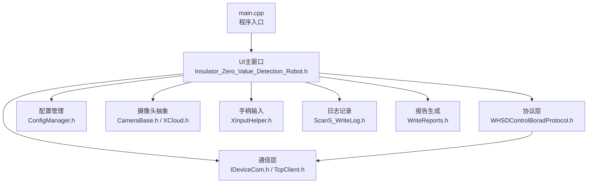
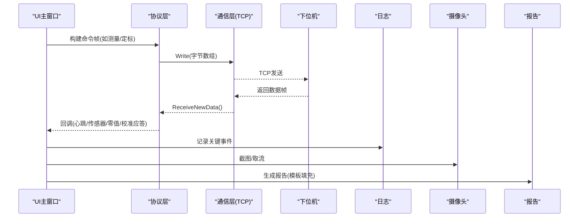
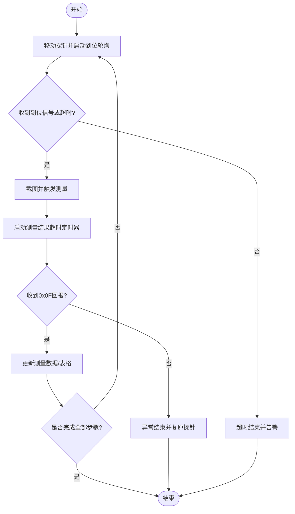
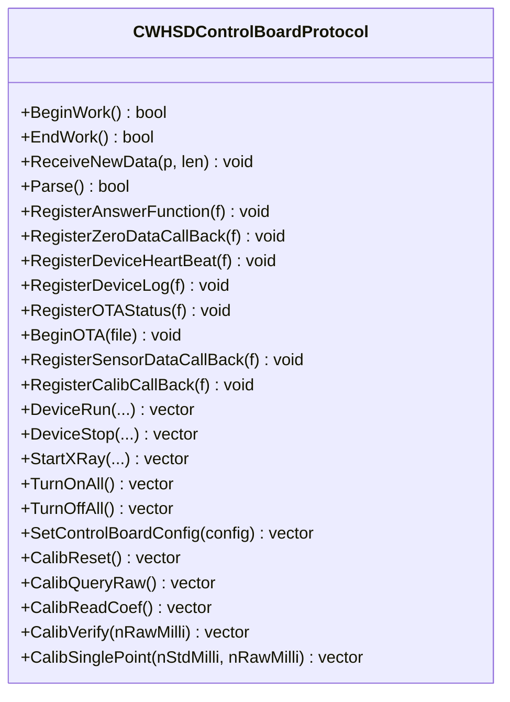
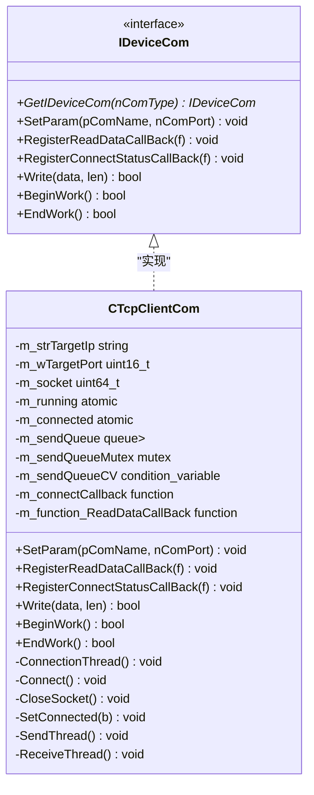
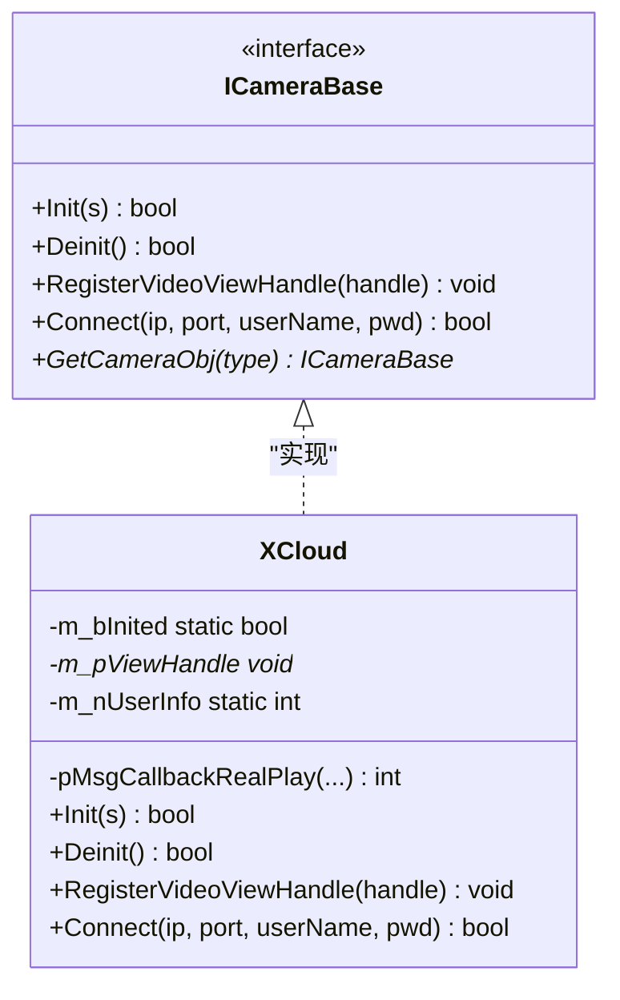
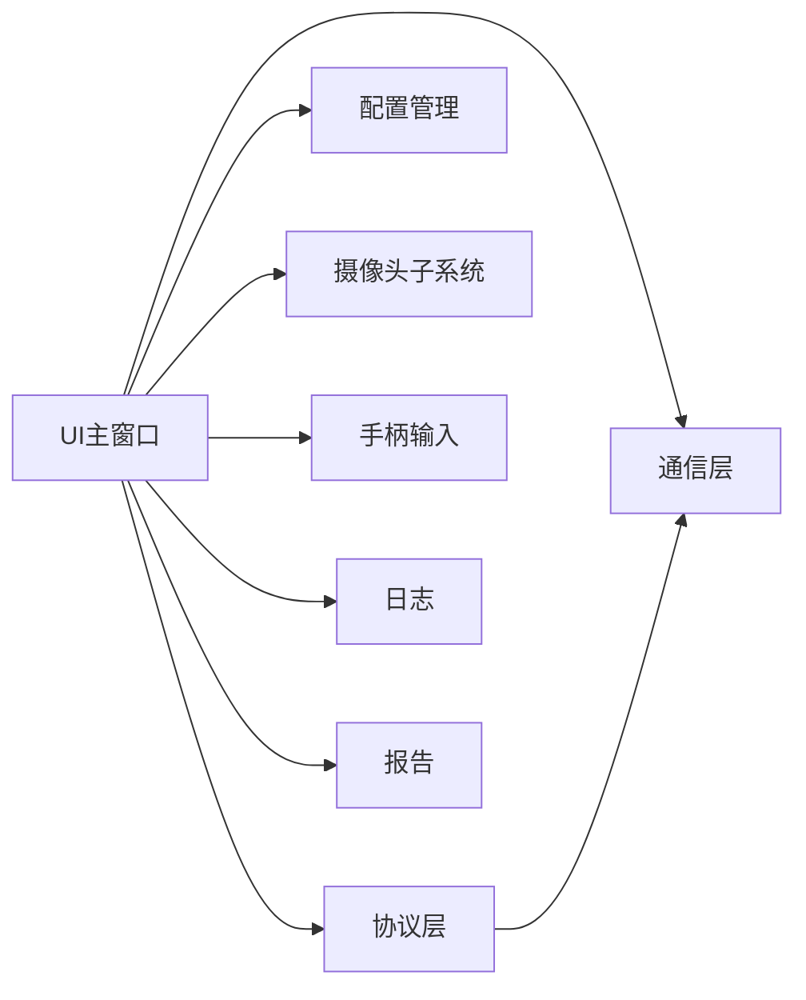

# 架构概览

<cite>
**本文引用的文件**
- [main.cpp](file://Insulator_Zero_Value_Detection_Robot/main.cpp)
- [UI主窗口头文件](file://Insulator_Zero_Value_Detection_Robot/UI/Insulator_Zero_Value_Detection_Robot.h)
- [设备通信抽象接口](file://Insulator_Zero_Value_Detection_Robot/DeviceCom/IDeviceCom.h)
- [TCP客户端实现](file://Insulator_Zero_Value_Detection_Robot/DeviceCom/TcpClient.h)
- [控制板协议定义](file://Insulator_Zero_Value_Detection_Robot/Protocol/WHSDControlBoradProtocol.h)
- [配置管理器头文件](file://Insulator_Zero_Value_Detection_Robot/Config/ConfigManager.h)
- [摄像头抽象接口](file://Insulator_Zero_Value_Detection_Robot/Camera/CameraBase.h)
- [XCloud相机实现](file://Insulator_Zero_Value_Detection_Robot/Camera/XCloud.h)
- [手柄输入辅助](file://Insulator_Zero_Value_Detection_Robot/Tools/XInputHelper.h)
- [日志写入器](file://Insulator_Zero_Value_Detection_Robot/Log/ScanS_WriteLog.h)
- [报告生成器](file://Insulator_Zero_Value_Detection_Robot/Report/WriteReports.h)
- [项目说明](file://README.md)
</cite>

## 目录
1. [简介](#简介)
2. [项目结构](#项目结构)
3. [核心组件](#核心组件)
4. [架构总览](#架构总览)
5. [详细组件分析](#详细组件分析)
6. [依赖关系分析](#依赖关系分析)
7. [性能与并发特性](#性能与并发特性)
8. [故障排查指南](#故障排查指南)
9. [结论](#结论)
10. [附录：技术选型与扩展性](#附录技术选型与扩展性)

## 简介
本系统为“绝缘子零值检测机器人V2”的桌面端控制软件，负责与下位机控制板进行协议通信、管理工单与报告、驱动摄像头采集图像、处理手柄输入并呈现可视化界面。整体采用分层架构：表现层（Qt UI）、业务逻辑层（主控制器）、协议层（WHSD控制板协议）、通信层（设备通信），并通过工厂模式与观察者模式解耦硬件与算法模块，支持可扩展与插件化演进。

## 项目结构
- 入口与启动：main.cpp 创建 Qt 应用并展示主窗口
- 表现层（UI）：基于 QMainWindow 的主窗口，承载按钮、表格、图表、弹窗等交互
- 业务逻辑层：主窗口协调各子系统，编排测量流程、定标流程、工单与报告生命周期
- 协议层：封装 WHSD 控制板协议帧构造、解析、心跳、回调分发
- 通信层：抽象 IDeviceCom 接口，当前以 TCP 客户端实现，提供读写与连接状态回调
- 外设与工具：摄像头抽象与 XCloud 实现、手柄输入辅助、日志记录、报告模板填充、配置管理

图示来源
- [main.cpp:11-23](file://Insulator_Zero_Value_Detection_Robot/main.cpp#L11-L23)
- [UI主窗口头文件:26-384](file://Insulator_Zero_Value_Detection_Robot/UI/Insulator_Zero_Value_Detection_Robot.h#L26-L384)
- [设备通信抽象接口:4-15](file://Insulator_Zero_Value_Detection_Robot/DeviceCom/IDeviceCom.h#L4-L15)
- [TCP客户端实现:8-46](file://Insulator_Zero_Value_Detection_Robot/DeviceCom/TcpClient.h#L8-L46)
- [控制板协议定义:189-355](file://Insulator_Zero_Value_Detection_Robot/Protocol/WHSDControlBoradProtocol.h#L189-L355)
- [配置管理器头文件:185-199](file://Insulator_Zero_Value_Detection_Robot/Config/ConfigManager.h#L185-L199)
- [摄像头抽象接口:5-14](file://Insulator_Zero_Value_Detection_Robot/Camera/CameraBase.h#L5-L14)
- [XCloud相机实现:6-33](file://Insulator_Zero_Value_Detection_Robot/Camera/XCloud.h#L6-L33)
- [手柄输入辅助:18-47](file://Insulator_Zero_Value_Detection_Robot/Tools/XInputHelper.h#L18-L47)
- [日志写入器:5-42](file://Insulator_Zero_Value_Detection_Robot/Log/ScanS_WriteLog.h#L5-L42)
- [报告生成器:24-88](file://Insulator_Zero_Value_Detection_Robot/Report/WriteReports.h#L24-L88)

章节来源
- [main.cpp:11-23](file://Insulator_Zero_Value_Detection_Robot/main.cpp#L11-L23)
- [项目说明:1-3](file://README.md#L1-L3)

## 核心组件
- 表现层（UI）：主窗口集中管理用户操作、显示数据、维护测量与定标流程的状态机，通过信号槽与定时器驱动业务流程
- 业务逻辑层（主控制器）：协调协议层、通信层、摄像头、手柄、日志与报告；维护工单与测量数据模型
- 协议层（WHSD控制板协议）：封装命令帧构造与解析，注册各类回调（心跳、传感器数据、零值数据、校准应答、日志、OTA），内部维护心跳线程与缓冲区
- 通信层（设备通信）：抽象设备通信接口，当前使用 TCP 客户端，多线程收发，队列缓冲发送，原子状态管理连接
- 摄像头子系统：抽象 ICameraBase，具体实现 XCloud，支持初始化、连接、视频句柄注册
- 配置管理：读取/写入 XML 配置，包含控制板参数、相机参数、工单与报告模板信息
- 日志与报告：异步/同步日志写入；基于 docx 模板替换占位符与表格数据生成检测报告

章节来源
- [UI主窗口头文件:26-384](file://Insulator_Zero_Value_Detection_Robot/UI/Insulator_Zero_Value_Detection_Robot.h#L26-L384)
- [控制板协议定义:189-355](file://Insulator_Zero_Value_Detection_Robot/Protocol/WHSDControlBoradProtocol.h#L189-L355)
- [设备通信抽象接口:4-15](file://Insulator_Zero_Value_Detection_Robot/DeviceCom/IDeviceCom.h#L4-L15)
- [TCP客户端实现:8-46](file://Insulator_Zero_Value_Detection_Robot/DeviceCom/TcpClient.h#L8-L46)
- [摄像头抽象接口:5-14](file://Insulator_Zero_Value_Detection_Robot/Camera/CameraBase.h#L5-L14)
- [XCloud相机实现:6-33](file://Insulator_Zero_Value_Detection_Robot/Camera/XCloud.h#L6-L33)
- [配置管理器头文件:185-199](file://Insulator_Zero_Value_Detection_Robot/Config/ConfigManager.h#L185-L199)
- [日志写入器:5-42](file://Insulator_Zero_Value_Detection_Robot/Log/ScanS_WriteLog.h#L5-L42)
- [报告生成器:24-88](file://Insulator_Zero_Value_Detection_Robot/Report/WriteReports.h#L24-L88)

## 架构总览
系统采用分层+事件驱动的架构：
- 表现层通过 Qt 信号槽接收用户输入与外部事件，调用业务逻辑方法
- 业务逻辑层编排流程（测量、定标、工单、报告），将指令下发至协议层
- 协议层负责帧组装/解析，通过回调通知上层结果（心跳、传感器、零值、校准应答）
- 通信层提供稳定的 TCP 收发通道，屏蔽底层网络细节
- 摄像头、手柄、日志、报告作为横向支撑能力，被业务逻辑按需调用

图示来源
- [UI主窗口头文件:26-384](file://Insulator_Zero_Value_Detection_Robot/UI/Insulator_Zero_Value_Detection_Robot.h#L26-L384)
- [控制板协议定义:189-355](file://Insulator_Zero_Value_Detection_Robot/Protocol/WHSDControlBoradProtocol.h#L189-L355)
- [TCP客户端实现:8-46](file://Insulator_Zero_Value_Detection_Robot/DeviceCom/TcpClient.h#L8-L46)
- [日志写入器:5-42](file://Insulator_Zero_Value_Detection_Robot/Log/ScanS_WriteLog.h#L5-L42)
- [报告生成器:24-88](file://Insulator_Zero_Value_Detection_Robot/Report/WriteReports.h#L24-L88)

## 详细组件分析

### 表现层（UI主窗口）
- 职责：用户交互、流程编排、状态机管理（测量等待/超时、探针到位轮询、定标步骤推进）、数据展示（表格、曲线、告警面板）
- 关键机制：
  - 使用 Qt 信号槽将协议线程回调切到 UI 线程处理，避免跨线程直接更新界面
  - 使用 QTimer 实现兜底超时与轮询（探针到位、测量结果超时、定标等待）
  - 维护测量步骤状态 m_nMeasureStep 与定标步骤枚举 ECalibStep，保证流程顺序执行
  - 通过成员变量与互斥锁保护共享状态（心跳快照、录像帧缓存、探针到位标志）

图示来源
- [UI主窗口头文件:188-197](file://Insulator_Zero_Value_Detection_Robot/UI/Insulator_Zero_Value_Detection_Robot.h#L188-L197)
- [UI主窗口头文件:294-313](file://Insulator_Zero_Value_Detection_Robot/UI/Insulator_Zero_Value_Detection_Robot.h#L294-L313)

章节来源
- [UI主窗口头文件:26-384](file://Insulator_Zero_Value_Detection_Robot/UI/Insulator_Zero_Value_Detection_Robot.h#L26-L384)

### 协议层（WHSD控制板协议）
- 职责：帧构造/解析、心跳循环、回调分发、OT A 状态上报、传感器数据与零值数据转发、校准应答处理
- 关键设计：
  - 通过 RegisterAnswerFunction/RegisterZeroDataCallBack/RegisterDeviceHeartBeat/RegisterCalibCallBack 等注册回调，实现松耦合的事件分发
  - BeginWork/EndWork 管理协议生命周期，内部维护数据缓冲与命令队列
  - 提供静态命令构造方法（设备运行、停止、X射线控制、恢复默认、查询原始值、读回系数、补偿验证、单点定标）

图示来源
- [控制板协议定义:189-355](file://Insulator_Zero_Value_Detection_Robot/Protocol/WHSDControlBoradProtocol.h#L189-L355)

章节来源
- [控制板协议定义:189-355](file://Insulator_Zero_Value_Detection_Robot/Protocol/WHSDControlBoradProtocol.h#L189-L355)

### 通信层（设备通信）
- 职责：抽象设备通信接口，提供统一 Write/BeginWork/EndWork/回调注册
- 当前实现：CTcpClientCom 基于 TCP，多线程（连接、接收、发送），使用队列与条件变量协调发送，原子变量管理运行与连接状态
- 优势：屏蔽不同传输介质差异，便于后续扩展串口/UDP等

图示来源
- [设备通信抽象接口:4-15](file://Insulator_Zero_Value_Detection_Robot/DeviceCom/IDeviceCom.h#L4-L15)
- [TCP客户端实现:8-46](file://Insulator_Zero_Value_Detection_Robot/DeviceCom/TcpClient.h#L8-L46)

章节来源
- [设备通信抽象接口:4-15](file://Insulator_Zero_Value_Detection_Robot/DeviceCom/IDeviceCom.h#L4-L15)
- [TCP客户端实现:8-46](file://Insulator_Zero_Value_Detection_Robot/DeviceCom/TcpClient.h#L8-L46)

### 摄像头子系统
- 抽象接口 ICameraBase 定义初始化、反初始化、视频句柄注册、连接等方法
- 具体实现 XCloud 对接 XCloud SDK，提供真实播放回调与资源管理
- 通过 GetCameraObj(type) 工厂方法创建实例，便于扩展新相机类型

图示来源
- [摄像头抽象接口:5-14](file://Insulator_Zero_Value_Detection_Robot/Camera/CameraBase.h#L5-L14)
- [XCloud相机实现:6-33](file://Insulator_Zero_Value_Detection_Robot/Camera/XCloud.h#L6-L33)
- [摄像头抽象实现:1-19](file://Insulator_Zero_Value_Detection_Robot/Camera/CameraBase.cpp#L1-L19)

章节来源
- [摄像头抽象接口:5-14](file://Insulator_Zero_Value_Detection_Robot/Camera/CameraBase.h#L5-L14)
- [XCloud相机实现:6-33](file://Insulator_Zero_Value_Detection_Robot/Camera/XCloud.h#L6-L33)
- [摄像头抽象实现:1-19](file://Insulator_Zero_Value_Detection_Robot/Camera/CameraBase.cpp#L1-L19)

### 配置管理与数据模型
- CConfigManager 负责读取/写入 XML 配置，包含控制板参数、相机参数、工单与报告配置
- CNewTicketConfig 与 CNewReportConfig 定义工单与报告的数据结构，支持枚举转换与 JSON 数据容器
- 主窗口持有当前工单配置与测量数据（QJsonObject），用于报告生成与表格展示

章节来源
- [配置管理器头文件:10-199](file://Insulator_Zero_Value_Detection_Robot/Config/ConfigManager.h#L10-L199)
- [UI主窗口头文件:289-293](file://Insulator_Zero_Value_Detection_Robot/UI/Insulator_Zero_Value_Detection_Robot.h#L289-L293)

### 日志与报告
- CWriteLog 提供多行日志写入，支持同步/异步模式，适合多线程环境
- CWriteReports 基于 docx 模板（zip 容器）替换占位符与表格数据，生成最终报告

章节来源
- [日志写入器:5-42](file://Insulator_Zero_Value_Detection_Robot/Log/ScanS_WriteLog.h#L5-L42)
- [报告生成器:24-88](file://Insulator_Zero_Value_Detection_Robot/Report/WriteReports.h#L24-L88)

## 依赖关系分析
- 主窗口依赖协议层、通信层、配置、摄像头、手柄、日志、报告
- 协议层依赖通信层进行数据收发
- 摄像头子系统通过工厂模式解耦具体实现
- 配置管理为全局配置源，供各层读取
- 日志与报告为横切关注点，被业务逻辑在关键节点调用

图示来源
- [UI主窗口头文件:26-384](file://Insulator_Zero_Value_Detection_Robot/UI/Insulator_Zero_Value_Detection_Robot.h#L26-L384)
- [控制板协议定义:189-355](file://Insulator_Zero_Value_Detection_Robot/Protocol/WHSDControlBoradProtocol.h#L189-L355)
- [设备通信抽象接口:4-15](file://Insulator_Zero_Value_Detection_Robot/DeviceCom/IDeviceCom.h#L4-L15)
- [摄像头抽象接口:5-14](file://Insulator_Zero_Value_Detection_Robot/Camera/CameraBase.h#L5-L14)
- [手柄输入辅助:18-47](file://Insulator_Zero_Value_Detection_Robot/Tools/XInputHelper.h#L18-L47)
- [日志写入器:5-42](file://Insulator_Zero_Value_Detection_Robot/Log/ScanS_WriteLog.h#L5-L42)
- [报告生成器:24-88](file://Insulator_Zero_Value_Detection_Robot/Report/WriteReports.h#L24-L88)

章节来源
- [UI主窗口头文件:26-384](file://Insulator_Zero_Value_Detection_Robot/UI/Insulator_Zero_Value_Detection_Robot.h#L26-L384)
- [控制板协议定义:189-355](file://Insulator_Zero_Value_Detection_Robot/Protocol/WHSDControlBoradProtocol.h#L189-L355)
- [设备通信抽象接口:4-15](file://Insulator_Zero_Value_Detection_Robot/DeviceCom/IDeviceCom.h#L4-L15)
- [摄像头抽象接口:5-14](file://Insulator_Zero_Value_Detection_Robot/Camera/CameraBase.h#L5-L14)
- [手柄输入辅助:18-47](file://Insulator_Zero_Value_Detection_Robot/Tools/XInputHelper.h#L18-L47)
- [日志写入器:5-42](file://Insulator_Zero_Value_Detection_Robot/Log/ScanS_WriteLog.h#L5-L42)
- [报告生成器:24-88](file://Insulator_Zero_Value_Detection_Robot/Report/WriteReports.h#L24-L88)

## 性能与并发特性
- 通信层使用多线程（连接、接收、发送）与队列缓冲，降低阻塞风险；原子变量管理连接与运行状态，提升并发安全
- 协议层维护心跳线程与数据缓冲，减少主线程压力；回调机制将耗时解析与业务处理解耦
- UI层通过信号槽与定时器避免跨线程直接访问控件，保障界面响应性
- 日志写入支持异步模式，减少IO对主流程的影响
- 摄像头取流与录制分离，录制期间累积帧后统一转码，避免实时编码瓶颈

[本节为通用性能讨论，不直接分析具体文件]

## 故障排查指南
- 连接问题：检查通信层连接状态回调与TCP端口/IP配置；确认设备心跳是否正常到达
- 协议解析失败：核对帧格式与大端序；查看协议层日志输出；校验命令参数长度与范围
- 测量超时：检查探针到位轮询与结果超时定时器；确认下位机是否返回0x0F回报；必要时调整超时阈值
- 定标失败：根据原因码定位（原始值超时、Flash写失败、参数非法等）；核对标准值与实测原始值大小关系
- 摄像头异常：确认初始化与连接成功；检查视频句柄注册是否正确；查看SDK回调错误码
- 报告生成失败：检查模板路径与占位符匹配；确保表格数据结构与键名一致

章节来源
- [设备通信抽象接口:4-15](file://Insulator_Zero_Value_Detection_Robot/DeviceCom/IDeviceCom.h#L4-L15)
- [TCP客户端实现:8-46](file://Insulator_Zero_Value_Detection_Robot/DeviceCom/TcpClient.h#L8-L46)
- [控制板协议定义:189-355](file://Insulator_Zero_Value_Detection_Robot/Protocol/WHSDControlBoradProtocol.h#L189-L355)
- [UI主窗口头文件:188-197](file://Insulator_Zero_Value_Detection_Robot/UI/Insulator_Zero_Value_Detection_Robot.h#L188-L197)
- [报告生成器:24-88](file://Insulator_Zero_Value_Detection_Robot/Report/WriteReports.h#L24-L88)

## 结论
本系统通过清晰的分层架构与事件驱动机制，实现了UI、业务、协议、通信的有效解耦。工厂模式与观察者模式提升了扩展性与可维护性；多线程与回调机制保障了实时性与稳定性。未来可在通信层与摄像头子系统继续扩展更多设备类型，并在协议层增加新命令与回调，以满足多样化检测需求。

[本节为总结性内容，不直接分析具体文件]

## 附录：技术选型与扩展性

### 技术选型原因
- Qt框架：成熟的GUI与事件机制，信号槽天然支持跨线程回调，便于UI与后台线程解耦
- TCP通信：稳定可靠、易于调试与抓包，适合工业现场设备通信；抽象接口便于替换其他传输方式
- XCloud SDK：提供稳定的摄像头取流与播放能力，满足多路视频采集与显示需求
- docx模板报告：无需安装Word即可生成报告，跨平台且易于定制模板

### 扩展性与插件化机制
- 工厂模式：ICameraBase::GetCameraObj 与 IDeviceCom::GetIDeviceCom 支持按类型创建具体实现，新增设备或相机只需注册新类型
- 观察者模式：协议层通过多种 Register* 回调注册处理器，新增数据类型或事件只需添加回调注册点
- 状态机模式：测量流程与定标流程使用显式状态与定时器，便于扩展新步骤与异常分支
- 配置驱动：XML配置集中管理参数，便于不同场景快速切换

章节来源
- [摄像头抽象接口:5-14](file://Insulator_Zero_Value_Detection_Robot/Camera/CameraBase.h#L5-L14)
- [设备通信抽象接口:4-15](file://Insulator_Zero_Value_Detection_Robot/DeviceCom/IDeviceCom.h#L4-L15)
- [控制板协议定义:189-355](file://Insulator_Zero_Value_Detection_Robot/Protocol/WHSDControlBoradProtocol.h#L189-L355)
- [UI主窗口头文件:294-325](file://Insulator_Zero_Value_Detection_Robot/UI/Insulator_Zero_Value_Detection_Robot.h#L294-L325)
- [配置管理器头文件:185-199](file://Insulator_Zero_Value_Detection_Robot/Config/ConfigManager.h#L185-L199)