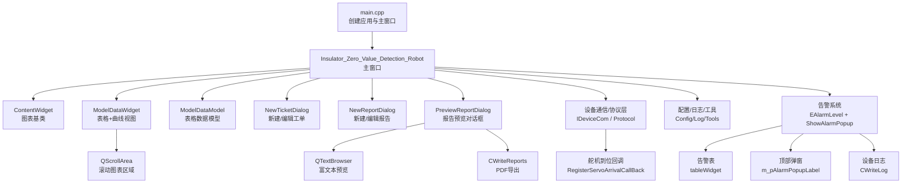
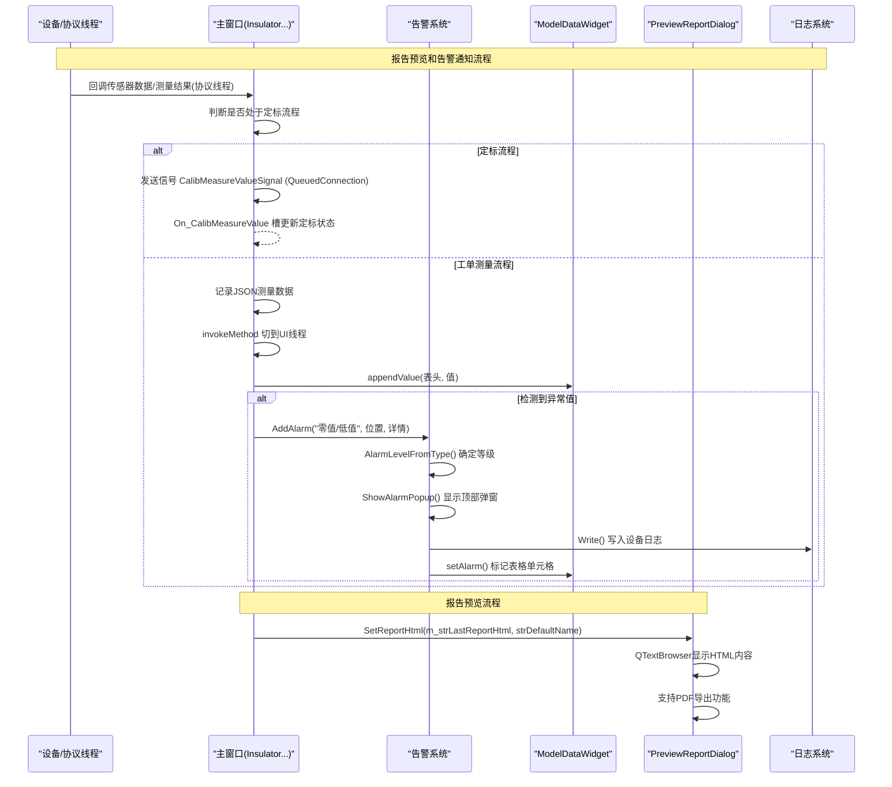
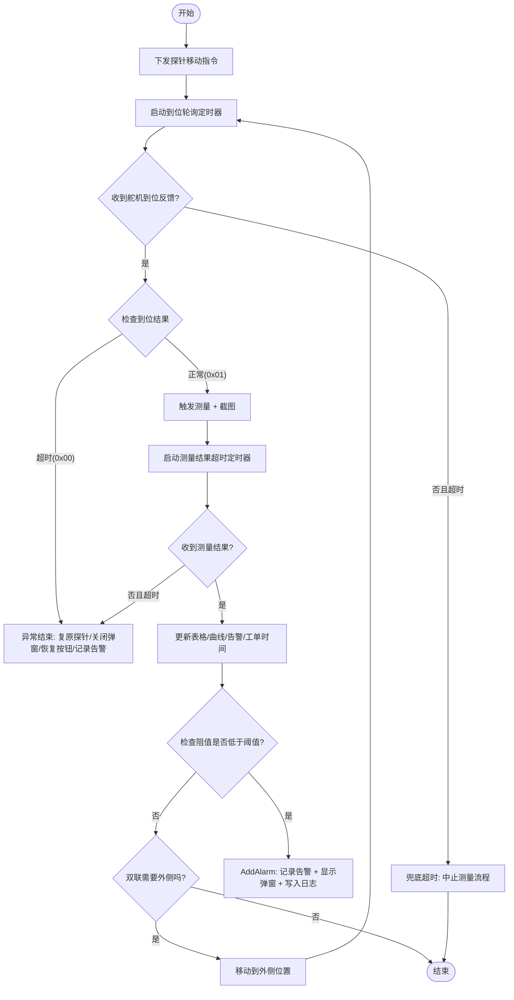
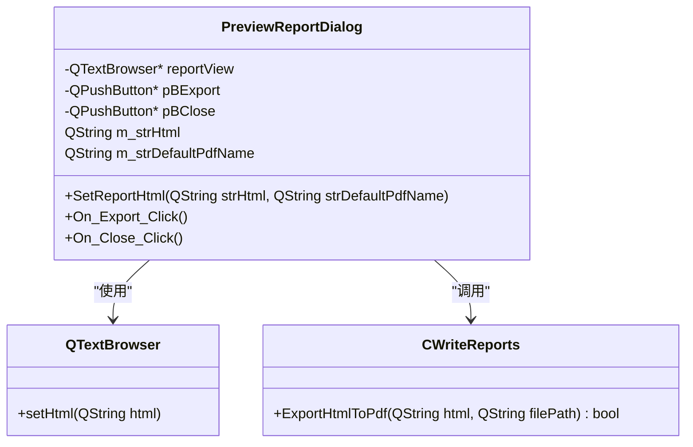
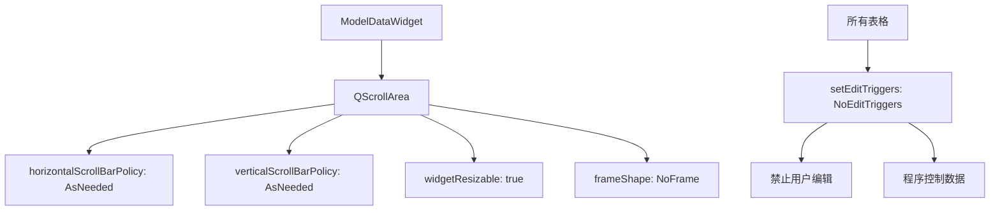
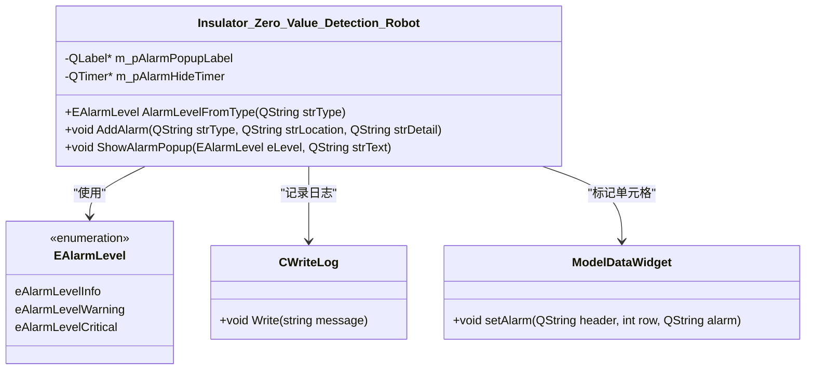
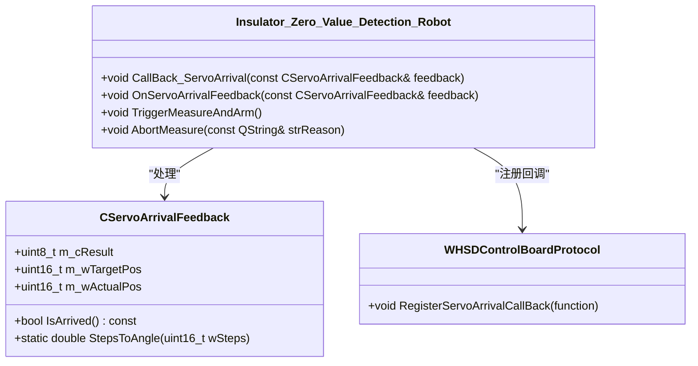
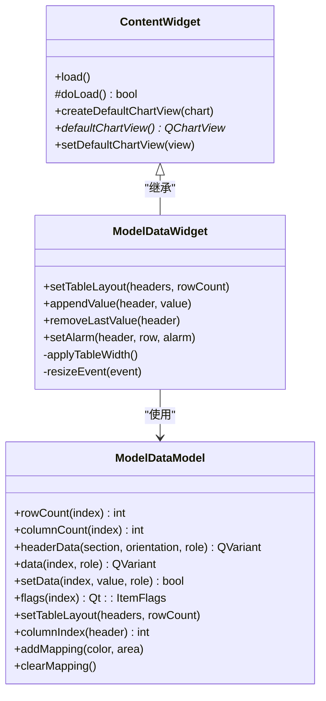
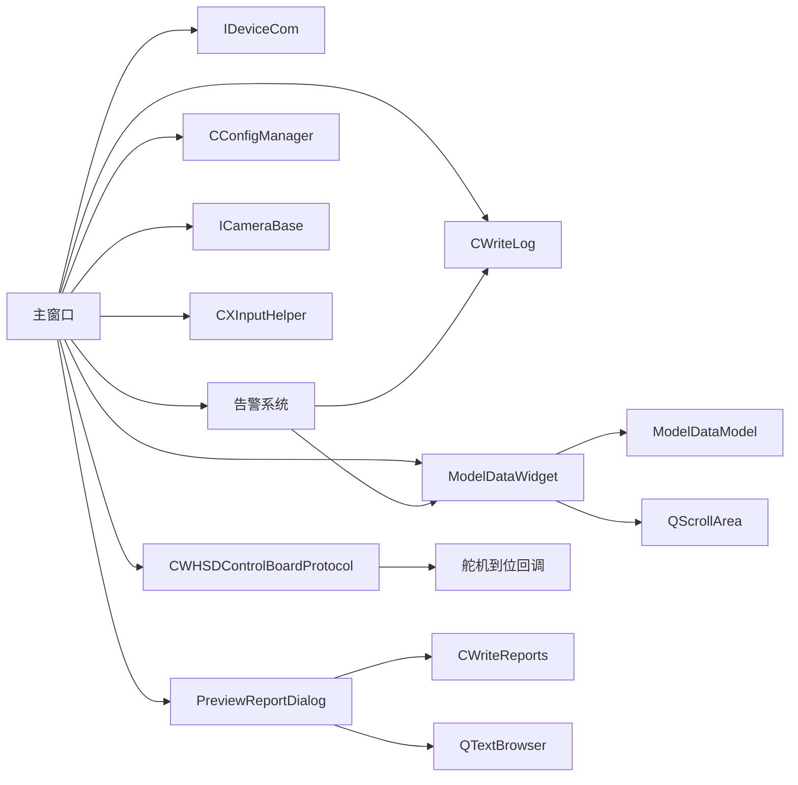

# UI模块

<cite>
**本文引用的文件**
- [main.cpp](file://Insulator_Zero_Value_Detection_Robot/main.cpp)
- [Insulator_Zero_Value_Detection_Robot.h](file://Insulator_Zero_Value_Detection_Robot/UI/Insulator_Zero_Value_Detection_Robot.h)
- [Insulator_Zero_Value_Detection_Robot.cpp](file://Insulator_Zero_Value_Detection_Robot/UI/Insulator_Zero_Value_Detection_Robot.cpp)
- [Insulator_Zero_Value_Detection_Robot.ui](file://Insulator_Zero_Value_Detection_Robot/UI/Insulator_Zero_Value_Detection_Robot.ui)
- [contentwidget.h](file://Insulator_Zero_Value_Detection_Robot/UI/contentwidget.h)
- [contentwidget.cpp](file://Insulator_Zero_Value_Detection_Robot/UI/contentwidget.cpp)
- [modeldatawidget.h](file://Insulator_Zero_Value_Detection_Robot/UI/modeldatawidget.h)
- [modeldatawidget.cpp](file://Insulator_Zero_Value_Detection_Robot/UI/modeldatawidget.cpp)
- [modeldatamodel.h](file://Insulator_Zero_Value_Detection_Robot/UI/modeldatamodel.h)
- [modeldatamodel.cpp](file://Insulator_Zero_Value_Detection_Robot/UI/modeldatamodel.cpp)
- [NewTicketDialog.h](file://Insulator_Zero_Value_Detection_Robot/UI/NewTicketDialog.h)
- [NewReportDialog.h](file://Insulator_Zero_Value_Detection_Robot/UI/NewReportDialog.h)
- [PreviewReportDialog.h](file://Insulator_Zero_Value_Detection_Robot/UI/PreviewReportDialog.h)
- [PreviewReportDialog.cpp](file://Insulator_Zero_Value_Detection_Robot/UI/PreviewReportDialog.cpp)
- [PreviewReportDialog.ui](file://Insulator_Zero_Value_Detection_Robot/UI/PreviewReportDialog.ui)
- [WHSDControlBoradProtocol.h](file://Insulator_Zero_Value_Detection_Robot/Protocol/WHSDControlBoradProtocol.h)
- [WriteLogIns.h](file://Insulator_Zero_Value_Detection_Robot\Log\WriteLogIns.h)
</cite>

## 更新摘要
**所做更改**
- 新增PreviewReportDialog预览对话框章节，详细说明报告预览和PDF导出功能
- 更新界面组件分析部分，增加滚动图表区域和只读表格模式说明
- 完善告警可视化功能，增强用户体验和数据展示效果
- 更新用户交互流程图，包含报告预览流程
- 增强故障排查指南，包含预览对话框相关问题诊断

## 目录
1. [简介](#简介)
2. [项目结构](#项目结构)
3. [核心组件](#核心组件)
4. [架构总览](#架构总览)
5. [详细组件分析](#详细组件分析)
6. [依赖关系分析](#依赖关系分析)
7. [性能与并发](#性能与并发)
8. [故障排查指南](#故障排查指南)
9. [结论](#结论)
10. [附录：UI扩展开发指南与最佳实践](#附录ui扩展开发指南与最佳实践)

## 简介
本模块为绝缘子零值检测机器人V2的图形用户界面（UI）层，基于Qt框架实现。主窗口类负责整体布局、事件绑定、设备通信回调处理、测量流程控制、定标流程控制、告警通知、工单/报告管理以及图表与表格的动态更新。通过信号槽机制将协议线程与UI线程解耦，保证多线程环境下UI更新的线程安全与流畅性。**最新增强**：新增了完整的告警通知系统、报告预览对话框、滚动图表区域和只读表格模式，提供了更完善的用户体验和数据展示效果。

## 项目结构
UI模块位于工程目录的 UI 子目录下，包含主窗口、自定义图表控件、数据模型、对话框等。入口程序创建并显示主窗口，随后进入事件循环。

**图示来源**
- [main.cpp:11-23](file://Insulator_Zero_Value_Detection_Robot/main.cpp#L11-L23)
- [Insulator_Zero_Value_Detection_Robot.h:239-253](file://Insulator_Zero_Value_Detection_Robot/UI/Insulator_Zero_Value_Detection_Robot.h#L239-L253)
- [Insulator_Zero_Value_Detection_Robot.cpp:3460-3529](file://Insulator_Zero_Value_Detection_Robot/UI/Insulator_Zero_Value_Detection_Robot.cpp#L3460-L3529)
- [PreviewReportDialog.cpp:25-56](file://Insulator_Zero_Value_Detection_Robot/UI/PreviewReportDialog.cpp#L25-L56)

**章节来源**
- [main.cpp:11-23](file://Insulator_Zero_Value_Detection_Robot/main.cpp#L11-L23)
- [Insulator_Zero_Value_Detection_Robot.ui:1-200](file://Insulator_Zero_Value_Detection_Robot/UI/Insulator_Zero_Value_Detection_Robot.ui#L1-L200)

## 核心组件
- 主窗口 Insulator_Zero_Value_Detection_Robot
  - 职责：初始化UI与参数、绑定按钮与定时器、处理设备心跳与传感器数据、驱动测量与定标流程、维护工单/报告数据、更新图表与表格、处理键盘与手柄输入、截图与录像、**新增报告预览和告警通知系统**。
  - 关键状态：测量步骤 m_nMeasureStep、定标步骤 m_eCalibStep、探针到位标志 m_bProbeArrived、录制标志 m_bRecording、连接状态 m_bControlBroadConnected 等。
  - 关键定时器：m_pTimer（设备状态轮询）、m_pTimerInput（手柄输入轮询）、m_pProbeWaitTimer（探针到位轮询）、m_pMeasureTimeoutTimer（测量结果超时）、m_pCalibTimeoutTimer（定标等待超时）。
  - **新增**：报告预览成员变量 m_pPreviewReportDialog、m_strLastReportHtml 用于报告预览和缓存；告警系统成员变量 m_pAlarmPopupLabel、m_pAlarmHideTimer 用于顶部弹窗和自动消失功能。
- 自定义控件 ContentWidget
  - 职责：提供可复用的图表容器与加载流程，支持错误提示与默认ChartView管理。
- 数据可视化 ModelDataWidget + ModelDataModel
  - 职责：根据表头动态生成表格列，按行填充测量值；同步绘制折线图；支持重测删除最近值；自适应宽度与坐标轴范围；**新增滚动图表区域和告警标记功能**。
- 对话框 NewTicketDialog / NewReportDialog / PreviewReportDialog
  - 职责：收集工单/报告信息，通过信号通知主窗口进行新增或修改；**新增报告预览对话框，支持HTML富文本预览和PDF导出**。

**章节来源**
- [Insulator_Zero_Value_Detection_Robot.h:26-384](file://Insulator_Zero_Value_Detection_Robot/UI/Insulator_Zero_Value_Detection_Robot.h#L26-L384)
- [contentwidget.h:12-32](file://Insulator_Zero_Value_Detection_Robot/UI/contentwidget.h#L12-L32)
- [modeldatawidget.h:20-66](file://Insulator_Zero_Value_Detection_Robot/UI/modeldatawidget.h#L20-L66)
- [modeldatamodel.h:12-39](file://Insulator_Zero_Value_Detection_Robot/UI/modeldatamodel.h#L12-L39)
- [NewTicketDialog.h:10-35](file://Insulator_Zero_Value_Detection_Robot/UI/NewTicketDialog.h#L10-35)
- [NewReportDialog.h:10-31](file://Insulator_Zero_Value_Detection_Robot/UI/NewReportDialog.h#L10-31)
- [PreviewReportDialog.h:9-29](file://Insulator_Zero_Value_Detection_Robot/UI/PreviewReportDialog.h#L9-L29)

## 架构总览
UI层采用"主窗口协调 + 自定义控件封装 + 信号槽跨线程"的分层设计：
- 主窗口作为控制器，负责业务编排与状态机推进。
- 自定义控件专注于数据呈现与交互细节。
- 协议/设备通信在独立线程中运行，通过信号槽将结果投递到UI线程，避免直接操作UI引发的线程安全问题。
- **新增**：报告预览系统和告警系统作为独立的子系统，提供统一的异常处理和用户反馈机制。

**图示来源**
- [Insulator_Zero_Value_Detection_Robot.cpp:810-821](file://Insulator_Zero_Value_Detection_Robot/UI/Insulator_Zero_Value_Detection_Robot.cpp#L810-L821)
- [Insulator_Zero_Value_Detection_Robot.cpp:3460-3529](file://Insulator_Zero_Value_Detection_Robot/UI/Insulator_Zero_Value_Detection_Robot.cpp#L3460-L3529)
- [Insulator_Zero_Value_Detection_Robot.h:239-253](file://Insulator_Zero_Value_Detection_Robot/UI/Insulator_Zero_Value_Detection_Robot.h#L239-L253)
- [PreviewReportDialog.cpp:25-56](file://Insulator_Zero_Value_Detection_Robot/UI/PreviewReportDialog.cpp#L25-L56)

## 详细组件分析

### 主窗口 Insulator_Zero_Value_Detection_Robot
- 界面布局
  - 使用 Qt Designer 生成的 .ui 文件定义主窗口布局，包含顶部导航按钮、视频区域、标签页、表格与图表区域等。
  - 启动时隐藏标题栏、最大化窗口、设置分割器初始比例（视频区:标签页=2:1），并对控件样式进行统一美化。
  - **新增**：滚动图表区域，使用QScrollArea承载ModelDataWidget，支持横向和纵向滚动。
- 事件处理机制
  - 定时器：每100ms轮询设备状态（传感器状态、电量、结果），每10ms读取手柄输入并下发控制指令。
  - 按钮/下拉框：通过 BindAction 集中 connect 绑定到对应槽函数，完成开关设备、截图、录屏、保存参数、测量、定标等操作。
  - 键盘与手柄：keyPressEvent/keyReleaseEvent 与 On_timerInput_timeout 配合，实现探针角度、行走、停止、开始测量等动作。
  - **新增**：报告预览按钮绑定到On_PreviewReport_Click槽函数。
- 状态管理
  - 测量流程状态机：m_nMeasureStep 表示当前步骤（空闲/内测/外侧），配合探针到位轮询与结果超时控制流程推进。
  - 定标流程状态机：ECalibStep 枚举描述步骤顺序，依靠信号槽接收下位机应答/回报推进流程。
  - 设备状态快照：GetHeartBeatSnapshot 加锁返回心跳数据副本，UI线程读取需持锁避免读到写一半的数据。
  - **新增**：报告预览状态管理，m_strLastReportHtml缓存最近一次生成的报告HTML内容。
- 多线程UI更新策略
  - 协议回调在协议线程，通过 emit 信号 + QueuedConnection 切换到UI线程执行槽函数，确保UI更新线程安全。
  - **新增**：舵机到位回调使用 `QMetaObject::invokeMethod()` 实现跨线程通信，避免直接操作UI对象。
  - 对共享资源（如测量数据、录制帧缓存）使用 std::mutex 与 std::atomic 保护。
- 截图与录像
  - 截图：captureCurrentWindow/screenshot相关逻辑，文件名含内测/外侧标记与时间。
  - 录像：m_bRecording 标志位由UI线程写，取流线程读；帧缓存用 clone 避免复用缓冲区，停止后统一编码成视频文件。
- **新增**：报告预览功能
  - 懒创建机制：m_pPreviewReportDialog在首次使用时创建，避免启动时的内存开销。
  - HTML缓存：m_strLastReportHtml缓存最近一次生成的报告HTML，切换工单时清空。
  - PDF导出：集成CWriteReports::ExportHtmlToPdf方法，支持将HTML报告导出为PDF文件。
  - 中文支持：使用Microsoft YaHei字体确保富文本预览中文正常显示。
- **新增**：滚动图表区域
  - 使用QScrollArea包裹ModelDataWidget，设置widgetResizable=true使内容自动铺满。
  - 启用水平和垂直滚动条，当表格列过多时自动显示横向滚动条。
  - 避免将整个界面撑宽，提升大数据量场景下的用户体验。
- **新增**：只读表格模式
  - 所有表格（tableWidget、tableWidget_2、tableWidget_3）设置为NoEditTriggers，禁止用户编辑。
  - 表格数据由程序填充，确保数据一致性和安全性。
- **新增**：告警通知系统
  - 三级告警等级：eAlarmLevelInfo（提示）、eAlarmLevelWarning（警告）、eAlarmLevelCritical（严重）。
  - 顶部弹窗：ShowAlarmPopup 方法创建浮动 QLabel，根据告警等级设置不同背景色（蓝/橙/红），4秒后自动消失。
  - 告警表记录：AddAlarm 方法在 tableWidget 首行插入新告警，包含时间、类型、位置、详情、状态等信息。
  - 日志集成：所有告警同时写入设备日志，便于问题追踪和分析。

**图示来源**
- [Insulator_Zero_Value_Detection_Robot.h:188-197](file://Insulator_Zero_Value_Detection_Robot/UI/Insulator_Zero_Value_Detection_Robot.h#L188-L197)
- [Insulator_Zero_Value_Detection_Robot.cpp:413-559](file://Insulator_Zero_Value_Detection_Robot/UI/Insulator_Zero_Value_Detection_Robot.cpp#L413-L559)
- [Insulator_Zero_Value_Detection_Robot.cpp:810-821](file://Insulator_Zero_Value_Detection_Robot/UI/Insulator_Zero_Value_Detection_Robot.cpp#L810-L821)
- [Insulator_Zero_Value_Detection_Robot.cpp:3460-3529](file://Insulator_Zero_Value_Detection_Robot/UI/Insulator_Zero_Value_Detection_Robot.cpp#L3460-L3529)

**章节来源**
- [Insulator_Zero_Value_Detection_Robot.h:26-384](file://Insulator_Zero_Value_Detection_Robot/UI/Insulator_Zero_Value_Detection_Robot.h#L26-L384)
- [Insulator_Zero_Value_Detection_Robot.cpp:88-405](file://Insulator_Zero_Value_Detection_Robot/UI/Insulator_Zero_Value_Detection_Robot.cpp#L88-L405)
- [Insulator_Zero_Value_Detection_Robot.cpp:413-800](file://Insulator_Zero_Value_Detection_Robot/UI/Insulator_Zero_Value_Detection_Robot.cpp#L413-L800)

### 报告预览对话框 PreviewReportDialog
**新增功能**：实现了完整的报告预览和PDF导出功能，提供友好的用户界面和丰富的报告展示能力。

- 对话框设计
  - 继承QDialog，设置窗口置顶属性(Qt::WindowStaysOnTopHint)确保始终在最前显示。
  - 使用QTextBrowser作为富文本预览容器，支持HTML格式报告展示。
  - 设置Microsoft YaHei字体确保中文显示正常。
  - 深色主题界面，符合现代软件设计风格。
- 核心功能
  - SetReportHtml方法：设置报告HTML内容和默认导出文件名。
  - 实时预览：通过setHtml方法即时显示报告内容。
  - PDF导出：调用CWriteReports::ExportHtmlToPdf方法将HTML转换为PDF文件。
  - 智能命名：默认文件名格式为"<线路>_<杆塔>_<报告编号>.pdf"。
- 用户交互
  - 导出按钮：打开文件保存对话框，选择PDF导出路径。
  - 关闭按钮：简单关闭窗口。
  - 错误处理：无报告内容时显示提示信息。

**图示来源**
- [PreviewReportDialog.h:9-29](file://Insulator_Zero_Value_Detection_Robot/UI/PreviewReportDialog.h#L9-L29)
- [PreviewReportDialog.cpp:25-56](file://Insulator_Zero_Value_Detection_Robot/UI/PreviewReportDialog.cpp#L25-L56)
- [PreviewReportDialog.ui:28-34](file://Insulator_Zero_Value_Detection_Robot/UI/PreviewReportDialog.ui#L28-L34)

**章节来源**
- [PreviewReportDialog.h:9-29](file://Insulator_Zero_Value_Detection_Robot/UI/PreviewReportDialog.h#L9-L29)
- [PreviewReportDialog.cpp:8-62](file://Insulator_Zero_Value_Detection_Robot/UI/PreviewReportDialog.cpp#L8-L62)
- [PreviewReportDialog.ui:1-127](file://Insulator_Zero_Value_Detection_Robot/UI/PreviewReportDialog.ui#L1-L127)
- [Insulator_Zero_Value_Detection_Robot.cpp:2100-2122](file://Insulator_Zero_Value_Detection_Robot/UI/Insulator_Zero_Value_Detection_Robot.cpp#L2100-L2122)

### 滚动图表区域和只读表格模式
**新增功能**：实现了滚动图表区域和只读表格模式，提升了大数据量场景下的用户体验。

- 滚动图表区域
  - 使用QScrollArea包裹ModelDataWidget，设置widgetResizable=true使内容自动适应父容器大小。
  - 启用水平和垂直滚动条策略(Qt::ScrollBarAsNeeded)，仅在内容超出视口时显示。
  - 移除边框(QFrame::NoFrame)，提供更简洁的视觉效果。
  - 通过布局管理器自动跟随ui.widget尺寸变化，避免启动时的尺寸计算问题。
- 只读表格模式
  - 所有表格控件设置为NoEditTriggers，禁止用户通过双击或键盘编辑表格内容。
  - 表格数据完全由程序控制，确保数据一致性和安全性。
  - 保持表格列宽自动拉伸(QHeaderView::Stretch)，优化显示效果。

**图示来源**
- [Insulator_Zero_Value_Detection_Robot.cpp:220-234](file://Insulator_Zero_Value_Detection_Robot/UI/Insulator_Zero_Value_Detection_Robot.cpp#L220-L234)
- [Insulator_Zero_Value_Detection_Robot.cpp:240-247](file://Insulator_Zero_Value_Detection_Robot/UI/Insulator_Zero_Value_Detection_Robot.cpp#L240-L247)

**章节来源**
- [Insulator_Zero_Value_Detection_Robot.cpp:220-234](file://Insulator_Zero_Value_Detection_Robot/UI/Insulator_Zero_Value_Detection_Robot.cpp#L220-L234)
- [Insulator_Zero_Value_Detection_Robot.cpp:240-247](file://Insulator_Zero_Value_Detection_Robot/UI/Insulator_Zero_Value_Detection_Robot.cpp#L240-L247)

### 告警通知系统
**新增功能**：实现了完整的三级告警通知系统，包括告警等级定义、弹窗显示、表格记录和日志集成。

- 告警等级定义
  - EAlarmLevel 枚举：eAlarmLevelInfo（提示-蓝色）、eAlarmLevelWarning（警告-橙色）、eAlarmLevelCritical（严重-红色）。
  - AlarmLevelFromType 方法：根据告警类型自动映射等级，"零值/低值"为严重，"测量异常"为警告，其他为提示。
- 顶部弹窗显示
  - ShowAlarmPopup 方法：创建浮动 QLabel，根据告警等级设置背景色，居中靠顶部显示，4秒后自动消失。
  - 懒创建机制：首次使用时创建控件，后续复用，避免重复创建开销。
  - 鼠标透明：setAttribute(Qt::WA_TransparentForMouseEvents) 允许点击穿透，不影响用户操作。
- 告警表记录
  - AddAlarm 方法：在 tableWidget 首行插入新告警，包含时间戳、类型、位置、详情、状态（未处理）。
  - 实时更新：新告警始终置顶显示，便于用户快速查看最新异常。
- 日志系统集成
  - 所有告警同时写入设备日志，使用 CWriteLog 的 Write 方法记录详细信息。
  - 格式统一：包含告警类型、位置和详细描述，便于问题追踪和分析。

**图示来源**
- [Insulator_Zero_Value_Detection_Robot.h:239-253](file://Insulator_Zero_Value_Detection_Robot/UI/Insulator_Zero_Value_Detection_Robot.h#L239-L253)
- [Insulator_Zero_Value_Detection_Robot.cpp:3460-3529](file://Insulator_Zero_Value_Detection_Robot/UI/Insulator_Zero_Value_Detection_Robot.cpp#L3460-L3529)
- [modeldatawidget.h:38](file://Insulator_Zero_Value_Detection_Robot/UI/modeldatawidget.h#L38)

**章节来源**
- [Insulator_Zero_Value_Detection_Robot.cpp:3460-3529](file://Insulator_Zero_Value_Detection_Robot/UI/Insulator_Zero_Value_Detection_Robot.cpp#L3460-L3529)
- [Insulator_Zero_Value_Detection_Robot.cpp:810-821](file://Insulator_Zero_Value_Detection_Robot/UI/Insulator_Zero_Value_Detection_Robot.cpp#L810-L821)
- [WriteLogIns.h:117-120](file://Insulator_Zero_Value_Detection_Robot\Log\WriteLogIns.h#L117-L120)

### 舵机到位反馈处理机制
**新增功能**：实现了完整的舵机到位反馈处理机制，包括回调注册、跨线程通信和异常处理。

- 回调注册
  - 在 `BindAction()` 中通过 `RegisterServoArrivalCallBack()` 注册回调函数。
  - 回调函数 `CallBack_ServoArrival()` 运行在协议线程，负责跨线程通信。
- 跨线程通信
  - 使用 `QMetaObject::invokeMethod()` 将回调从协议线程切换到UI线程执行。
  - 确保UI操作的线程安全性，避免直接操作UI对象导致的崩溃。
- 到位处理逻辑
  - `OnServoArrivalFeedback()` 在UI线程处理到位反馈。
  - 正常到位(0x01)：触发测量流程，调用 `TriggerMeasureAndArm()`。
  - 超时异常(0x00)：记录告警并中止测量，调用 `AbortMeasure()`。
  - 非测量流程：仅记录日志，不做其他处理。

**图示来源**
- [WHSDControlBoradProtocol.h:21-50](file://Insulator_Zero_Value_Detection_Robot/Protocol/WHSDControlBoradProtocol.h#L21-L50)
- [Insulator_Zero_Value_Detection_Robot.h:163-172](file://Insulator_Zero_Value_Detection_Robot/UI/Insulator_Zero_Value_Detection_Robot.h#L163-L172)
- [Insulator_Zero_Value_Detection_Robot.cpp:836-893](file://Insulator_Zero_Value_Detection_Robot/UI/Insulator_Zero_Value_Detection_Robot.cpp#L836-L893)

**章节来源**
- [Insulator_Zero_Value_Detection_Robot.cpp:286](file://Insulator_Zero_Value_Detection_Robot/UI/Insulator_Zero_Value_Detection_Robot.cpp#L286)
- [Insulator_Zero_Value_Detection_Robot.cpp:836-893](file://Insulator_Zero_Value_Detection_Robot/UI/Insulator_Zero_Value_Detection_Robot.cpp#L836-L893)
- [WHSDControlBoradProtocol.h:253-257](file://Insulator_Zero_Value_Detection_Robot/Protocol/WHSDControlBoradProtocol.h#L253-L257)

### 自定义控件 ContentWidget
- 职责：提供统一的图表容器与加载流程，支持错误提示与默认ChartView管理。
- 关键点：load() 防止重复加载；doLoad() 供子类重写以完成具体初始化；resizeEvent 自动调整默认ChartView尺寸。

**章节来源**
- [contentwidget.h:12-32](file://Insulator_Zero_Value_Detection_Robot/UI/contentwidget.h#L12-L32)
- [contentwidget.cpp:12-63](file://Insulator_Zero_Value_Detection_Robot/UI/contentwidget.cpp#L12-L63)

### 数据可视化 ModelDataWidget + ModelDataModel
- ModelDataWidget
  - 构建QTableView与QChartView，使用QSplitter控制表格与曲线图宽度。
  - setTableLayout：根据表头重建表格列与曲线系列，设置坐标轴范围。
  - appendValue：找到该列下一个空单元格填充值，同时追加曲线点，动态扩展Y轴范围。
  - removeLastValue：删除最近一个测量值及其曲线点，用于重测场景。
  - **新增**：setAlarm 方法：在指定单元格记录告警信息，支持悬停显示详情。
  - **新增**：滚动支持：通过外层QScrollArea实现横向和纵向滚动。
- ModelDataModel
  - 继承QAbstractTableModel，维护二维数据列表与映射区域。
  - setTableLayout：重置模型，初始化NaN占位。
  - data：DisplayRole/EditRole返回数值，BackgroundRole按映射着色。
  - setData：编辑单元格并触发dataChanged。

**图示来源**
- [contentwidget.h:12-32](file://Insulator_Zero_Value_Detection_Robot/UI/contentwidget.h#L12-L32)
- [modeldatawidget.h:20-66](file://Insulator_Zero_Value_Detection_Robot/UI/modeldatawidget.h#L20-L66)
- [modeldatamodel.h:12-39](file://Insulator_Zero_Value_Detection_Robot/UI/modeldatamodel.h#L12-L39)

**章节来源**
- [modeldatawidget.cpp:24-187](file://Insulator_Zero_Value_Detection_Robot/UI/modeldatawidget.cpp#L24-L187)
- [modeldatawidget.cpp:260-293](file://Insulator_Zero_Value_Detection_Robot/UI/modeldatawidget.cpp#L260-L293)
- [modeldatamodel.cpp:13-113](file://Insulator_Zero_Value_Detection_Robot/UI/modeldatamodel.cpp#L13-L113)

### 对话框 NewTicketDialog / NewReportDialog
- 职责：收集工单/报告信息，通过信号通知主窗口进行新增或修改。
- 信号：NewTicketSignal/ChangeTicketSignal、NewReportSignal/ChangeReportSignal。
- 主窗口侧：BindAction 中连接这些信号到对应槽函数，完成数据持久化与界面刷新。

**章节来源**
- [NewTicketDialog.h:10-35](file://Insulator_Zero_Value_Detection_Robot/UI/NewTicketDialog.h#L10-L35)
- [NewReportDialog.h:10-31](file://Insulator_Zero_Value_Detection_Robot/UI/NewReportDialog.h#L10-L31)
- [Insulator_Zero_Value_Detection_Robot.cpp:349-352](file://Insulator_Zero_Value_Detection_Robot/UI/Insulator_Zero_Value_Detection_Robot.cpp#L349-L352)

## 依赖关系分析
- 主窗口依赖：
  - 设备通信接口 IDeviceCom 与协议 CWHSDControlBoardProtocol，用于收发命令与解析数据。
  - 配置管理器 CConfigManager，读写Config.xml。
  - 日志系统 CWriteLog，记录设备日志与操作日志。
  - 摄像头抽象 ICameraBase，支持新/旧摄像头接入。
  - 输入辅助 CXInputHelper，处理手柄状态。
  - **新增**：报告预览对话框 PreviewReportDialog，用于报告预览和PDF导出。
- 控件依赖：
  - ModelDataWidget 依赖 ModelDataModel 提供表格数据。
  - ContentWidget 提供通用图表容器能力。
  - **新增**：QScrollArea用于承载ModelDataWidget，提供滚动功能。
- 外部库：
  - OpenCV 用于图像处理（截图、录像帧）。
  - Qt Charts/QChartView 用于曲线绘制。
  - **新增**：CWriteReports用于HTML转PDF功能。

**图示来源**
- [Insulator_Zero_Value_Detection_Robot.h:8-21](file://Insulator_Zero_Value_Detection_Robot/UI/Insulator_Zero_Value_Detection_Robot.h#L8-L21)
- [Insulator_Zero_Value_Detection_Robot.cpp:243-290](file://Insulator_Zero_Value_Detection_Robot/UI/Insulator_Zero_Value_Detection_Robot.cpp#L243-L290)
- [Insulator_Zero_Value_Detection_Robot.cpp:3460-3529](file://Insulator_Zero_Value_Detection_Robot/UI/Insulator_Zero_Value_Detection_Robot.cpp#L3460-L3529)
- [PreviewReportDialog.cpp:1-62](file://Insulator_Zero_Value_Detection_Robot/UI/PreviewReportDialog.cpp#L1-L62)

**章节来源**
- [Insulator_Zero_Value_Detection_Robot.h:8-21](file://Insulator_Zero_Value_Detection_Robot/UI/Insulator_Zero_Value_Detection_Robot.h#L8-L21)
- [Insulator_Zero_Value_Detection_Robot.cpp:243-290](file://Insulator_Zero_Value_Detection_Robot/UI/Insulator_Zero_Value_Detection_Robot.cpp#L243-L290)

## 性能与并发
- 定时器频率：设备状态轮询100ms，手柄输入10ms，避免过高频率导致CPU占用。
- 线程安全：
  - 协议回调在协议线程，通过信号槽（QueuedConnection）切换到UI线程更新界面。
  - **新增**：舵机到位回调使用 `QMetaObject::invokeMethod()` 实现安全的跨线程通信。
  - 共享状态使用 std::mutex 与 std::atomic 保护，如心跳快照、录制标志、探针到位标志。
- 图表更新：
  - 每次appendValue仅追加一个点，动态扩展Y轴范围，减少重绘开销。
  - 表格列宽按表头文字计算，避免过度拉伸导致的布局抖动。
  - **新增**：滚动图表区域通过QScrollArea优化大数据量场景下的性能。
- 录像优化：
  - 帧缓存使用clone避免OpenCV缓冲区复用问题，停止后统一编码，降低实时编码压力。
- **新增**：报告预览性能优化
  - 懒创建机制：PreviewReportDialog在首次使用时创建，避免启动时的内存开销。
  - HTML缓存：m_strLastReportHtml缓存报告内容，避免重复生成。
  - 字体优化：使用Microsoft YaHei字体确保中文显示效率。
- **新增**：告警系统性能优化
  - 懒创建机制：告警弹窗控件首次使用时创建，避免启动时的内存开销。
  - 定时器复用：m_pAlarmHideTimer 单次定时器，新告警到达时重新计时，避免频繁创建销毁。
  - 字符串缓存：静态数组存储告警等级名称，减少重复字符串分配。

## 故障排查指南
- 设备未连接
  - 现象：状态显示"未连接"，无法下发指令。
  - 排查：检查IP与端口配置，查看连接状态回调与日志。
- 测量无结果
  - 现象：发出测量指令后长时间无回报。
  - 排查：确认探针到位轮询与结果超时定时器是否正常启动；检查协议线程回调是否被正确注册。
- **新增**：报告预览问题
  - 现象：报告预览对话框不显示或显示空白。
  - 排查：检查m_strLastReportHtml是否为空；确认BuildReportHtml()方法是否正确生成HTML；查看PreviewReportDialog的SetReportHtml调用。
  - 现象：PDF导出失败。
  - 排查：检查CWriteReports::ExportHtmlToPdf方法实现；确认文件路径权限；查看导出错误信息。
  - 现象：中文显示异常。
  - 排查：确认Microsoft YaHei字体是否正确设置；检查HTML内容中的中文字符编码。
- **新增**：滚动图表问题
  - 现象：图表区域无法滚动或滚动异常。
  - 排查：检查QScrollArea的widgetResizable设置；确认scrollBarPolicy配置；查看ModelDataWidget的尺寸计算。
- **新增**：只读表格问题
  - 现象：表格仍可被编辑。
  - 排查：检查setEditTriggers(N oEditTriggers)是否正确设置；确认表格实例是否正确引用。
- 舵机到位异常
  - 现象：探针移动后无到位反馈或超时异常。
  - 排查：检查 `CallBack_ServoArrival()` 回调是否正确注册；确认 `OnServoArrivalFeedback()` 是否在UI线程执行；查看日志中的目标位置与实际位置偏差。
- 图表不更新
  - 现象：表格或曲线未显示新值。
  - 排查：确认appendValue调用路径是否在UI线程；检查表头匹配是否正确。
- 录像卡顿或丢帧
  - 现象：录像延迟或帧率不稳定。
  - 排查：检查m_bRecording标志位与帧缓存大小；确认编码线程工作正常。
- **新增**：告警系统问题
  - 现象：告警弹窗不显示或显示异常。
  - 排查：检查 AddAlarm 调用是否在UI线程；确认 m_pAlarmPopupLabel 是否正确初始化；查看 ShowAlarmPopup 中的样式设置。
  - 现象：告警表不记录或记录异常。
  - 排查：检查 tableWidget 是否正确初始化；确认 AddAlarm 中的 insertRow 调用；查看日志输出是否正常。

**章节来源**
- [Insulator_Zero_Value_Detection_Robot.cpp:413-559](file://Insulator_Zero_Value_Detection_Robot/UI/Insulator_Zero_Value_Detection_Robot.cpp#L413-L559)
- [Insulator_Zero_Value_Detection_Robot.cpp:675-753](file://Insulator_Zero_Value_Detection_Robot/UI/Insulator_Zero_Value_Detection_Robot.cpp#L675-L753)
- [Insulator_Zero_Value_Detection_Robot.cpp:836-893](file://Insulator_Zero_Value_Detection_Robot/UI/Insulator_Zero_Value_Detection_Robot.cpp#L836-L893)
- [Insulator_Zero_Value_Detection_Robot.cpp:3460-3529](file://Insulator_Zero_Value_Detection_Robot/UI/Insulator_Zero_Value_Detection_Robot.cpp#L3460-L3529)
- [PreviewReportDialog.cpp:25-56](file://Insulator_Zero_Value_Detection_Robot/UI/PreviewReportDialog.cpp#L25-L56)

## 结论
UI模块以主窗口为核心，结合自定义控件与信号槽机制，实现了设备状态监控、测量流程控制、数据可视化与工单/报告管理的完整功能。**最新增强**：通过新增的报告预览对话框、滚动图表区域、只读表格模式和告警通知系统，提供了更完善的用户体验和数据展示效果。报告预览功能支持HTML富文本展示和PDF导出，滚动图表区域优化了大数据量场景下的性能，只读表格模式确保了数据的一致性和安全性。配合舵机到位反馈处理机制，实现了更精确的探针位置控制和完善的异常处理。通过严格的线程边界划分与状态机设计，保证了多线程环境下的稳定性与可维护性。后续扩展可在现有基础上增加新的页面、控件或业务流程，遵循信号槽解耦与线程安全的最佳实践。

## 附录：UI扩展开发指南与最佳实践
- 新增页面或控件
  - 在 .ui 中拖拽布局，或在代码中动态创建 QWidget 并加入布局。
  - 若涉及图表，建议继承 ContentWidget 并重写 doLoad，复用默认ChartView管理能力。
  - **新增**：对于复杂的数据展示，考虑使用QScrollArea包裹内容，提供更好的滚动体验。
- 数据绑定与更新
  - 使用 ModelDataModel 管理表格数据，通过 setTableLayout 初始化列与行，appendValue 增量更新。
  - 曲线图随数据动态扩展Y轴范围，避免手动计算坐标。
  - **新增**：使用 setAlarm 方法在表格单元格中记录告警信息，支持悬停显示详情。
  - **新增**：对于大量数据，使用滚动图表区域避免界面卡顿。
- 信号槽使用模式
  - 跨线程通信：协议线程 emit 信号，UI线程槽函数处理，务必使用 Qt::QueuedConnection。
  - **新增**：对于复杂的回调处理，使用 `QMetaObject::invokeMethod()` 实现安全的跨线程通信。
  - 局部更新：invokeMethod 将耗时或UI相关操作切到UI线程执行。
- 状态机设计
  - 测量流程与定标流程均采用显式状态机，避免重入与竞态条件。
  - 使用定时器与标志位组合实现轮询与兜底超时，提升鲁棒性。
  - **新增**：舵机到位反馈集成到测量流程状态机中，提供精确的位置控制。
- 线程安全
  - 共享状态使用 mutex/atomic 保护，避免直接跨线程访问UI对象。
  - 日志记录与设备通信在独立线程，UI仅负责展示与用户交互。
  - **新增**：所有协议回调都应通过 `QMetaObject::invokeMethod()` 切换到UI线程处理。
- 调试与日志
  - 利用 CWriteLog 记录关键流程节点，便于定位问题。
  - 使用 overlayLabel 临时显示检测结果，辅助调试。
  - **新增**：舵机到位反馈的详细日志包含目标位置、实际位置和偏差信息。
  - **新增**：告警系统自动记录所有异常情况到设备日志，便于问题追踪。
- **新增**：报告预览功能使用指南
  - 生成报告：调用BuildReportHtml()方法生成HTML报告内容。
  - 预览报告：创建PreviewReportDialog实例，调用SetReportHtml方法设置报告内容。
  - 导出PDF：在PreviewReportDialog中调用CWriteReports::ExportHtmlToPdf方法导出PDF文件。
  - 缓存管理：使用m_strLastReportHtml缓存报告内容，避免重复生成。
- **新增**：滚动图表使用指南
  - 创建QScrollArea实例，设置widgetResizable=true和适当的滚动条策略。
  - 将需要滚动的控件设置为QScrollArea的子控件。
  - 确保子控件能够正确计算自身尺寸，以便滚动区域正常工作。
- **新增**：只读表格使用指南
  - 对所有表格调用setEditTriggers(QAbstractItemView::NoEditTriggers)禁止用户编辑。
  - 通过程序方式设置表格数据，确保数据一致性。
  - 使用QHeaderView::Stretch模式自动调整列宽，优化显示效果。
- **新增**：告警系统使用指南
  - 添加告警：调用 AddAlarm(strType, strLocation, strDetail)，系统会自动确定告警等级并显示弹窗。
  - 自定义告警等级：通过 AlarmLevelFromType 方法扩展告警类型到等级的映射关系。
  - 表格告警标记：使用 ModelDataWidget::setAlarm 在特定单元格记录告警，支持悬停查看详情。
  - 日志集成：所有告警自动写入设备日志，无需额外调用日志接口。