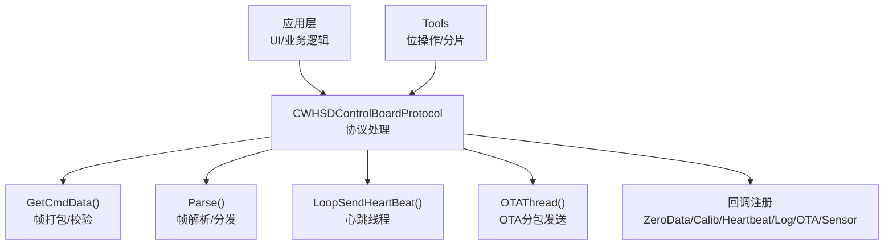
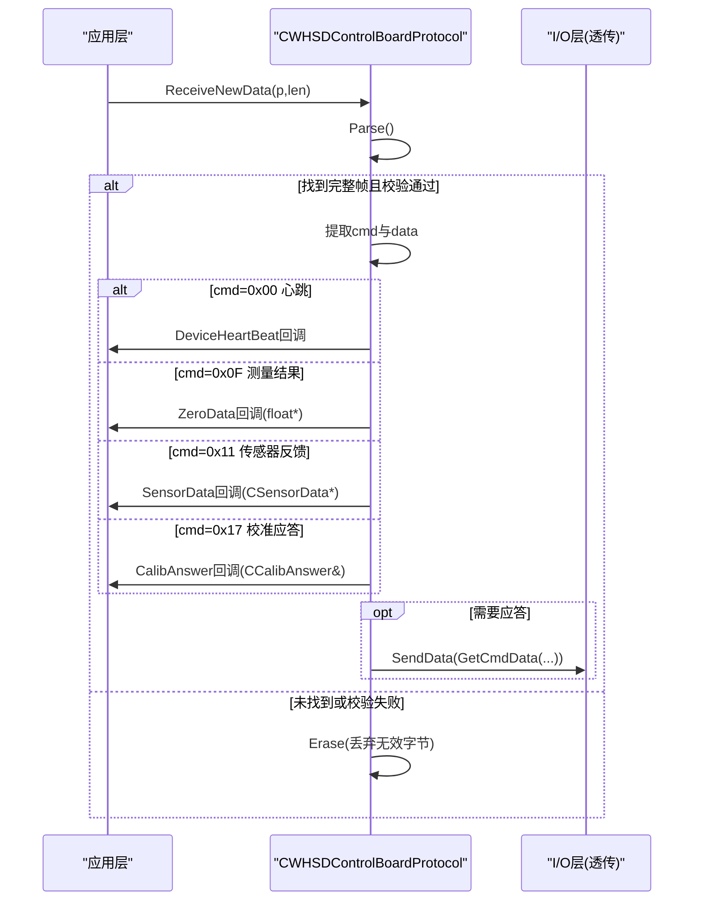
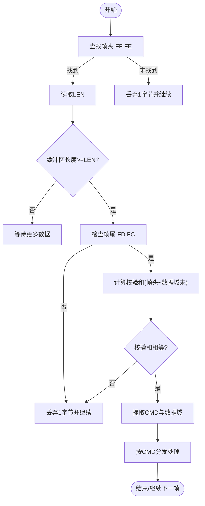
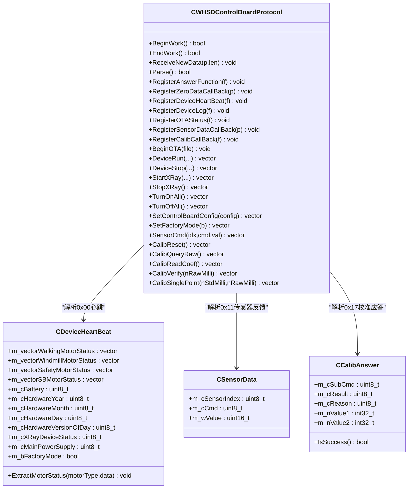
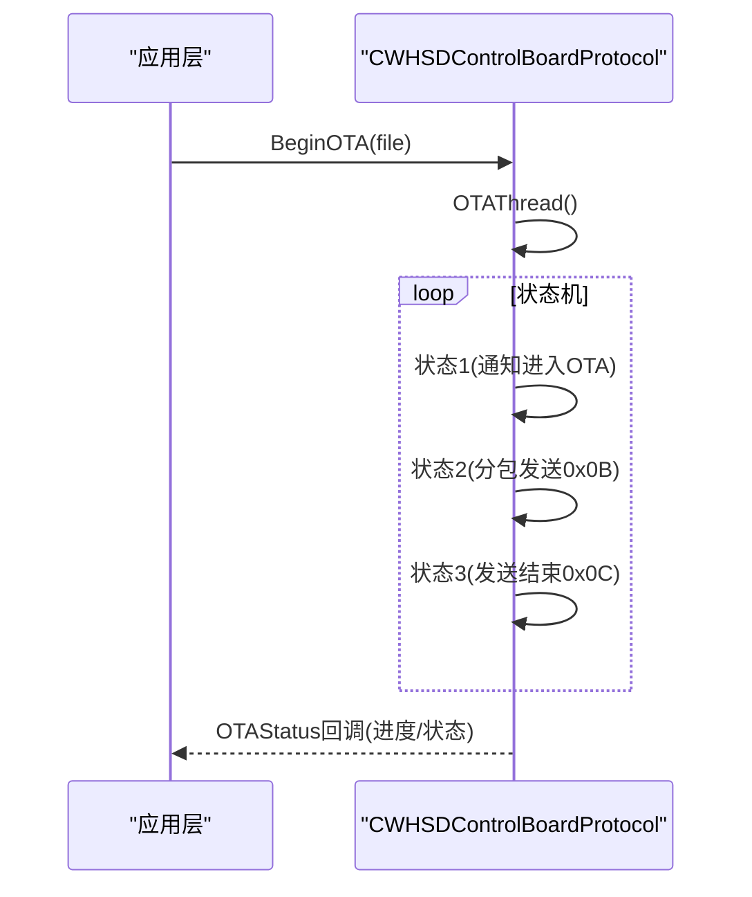
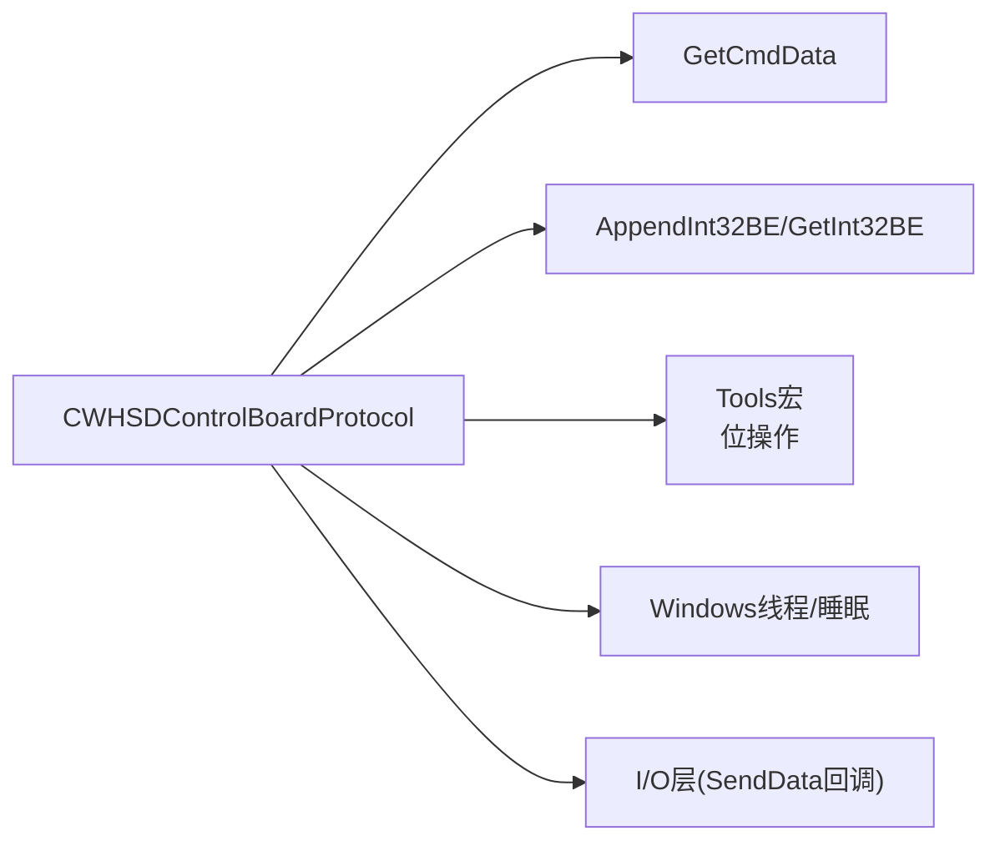

# 协议处理模块

<cite>
**本文引用的文件**
- [WHSDControlBoradProtocol.h](file://Insulator_Zero_Value_Detection_Robot/Protocol/WHSDControlBoradProtocol.h)
- [WHSDControlBoradProtocol.cpp](file://Insulator_Zero_Value_Detection_Robot/Protocol/WHSDControlBoradProtocol.cpp)
- [Tools.h](file://Insulator_Zero_Value_Detection_Robot/Tools/Tools.h)
- [单点定标协议与流程_V1.0.html](file://Insulator_Zero_Value_Detection_Robot/单点定标协议与流程_V1.0.html)
</cite>

## 目录
1. [简介](#简介)
2. [项目结构](#项目结构)
3. [核心组件](#核心组件)
4. [架构总览](#架构总览)
5. [详细组件分析](#详细组件分析)
6. [依赖关系分析](#依赖关系分析)
7. [性能考虑](#性能考虑)
8. [故障排查指南](#故障排查指南)
9. [结论](#结论)
10. [附录：协议规范与命令示例](#附录协议规范与命令示例)

## 简介
本模块为绝缘子零值检测机器人V2的“控制板通信协议处理”核心，封装了与WHSD控制板的帧级通信、命令编解码、数据解析、心跳与OTA升级、传感器数据回调、校准应答回调等能力。通过统一的回调机制，将底层协议字节流转换为上层业务对象（如设备心跳状态、传感器读数、校准结果），从而屏蔽底层细节，提升可维护性与扩展性。

## 项目结构
协议处理模块位于 Protocol 目录，核心类为 CWHSDControlBoardProtocol，配合若干数据结构类（CSensorData、CCalibAnswer、CDeviceHeartBeat、CMotorDeviceStatus、CControlBoardProtocolConfig）完成数据建模；工具函数位于 Tools 目录，提供位操作与数据拆分等通用能力。

图表来源
- [WHSDControlBoradProtocol.cpp:213-444](file://Insulator_Zero_Value_Detection_Robot/Protocol/WHSDControlBoradProtocol.cpp#L213-L444)
- [WHSDControlBoradProtocol.cpp:654-677](file://Insulator_Zero_Value_Detection_Robot/Protocol/WHSDControlBoradProtocol.cpp#L654-L677)
- [WHSDControlBoradProtocol.cpp:769-782](file://Insulator_Zero_Value_Detection_Robot/Protocol/WHSDControlBoradProtocol.cpp#L769-L782)
- [WHSDControlBoradProtocol.cpp:679-759](file://Insulator_Zero_Value_Detection_Robot/Protocol/WHSDControlBoradProtocol.cpp#L679-L759)
- [Tools.h:5-18](file://Insulator_Zero_Value_Detection_Robot/Tools/Tools.h#L5-L18)

章节来源
- [WHSDControlBoradProtocol.h:7-187](file://Insulator_Zero_Value_Detection_Robot/Protocol/WHSDControlBoradProtocol.h#L7-L187)
- [WHSDControlBoradProtocol.cpp:14-197](file://Insulator_Zero_Value_Detection_Robot/Protocol/WHSDControlBoradProtocol.cpp#L14-L197)

## 核心组件
- CWHSDControlBoardProtocol：协议处理主类，负责帧收发、解析、心跳、OTA、回调分发。
- CSensorData：传感器指令反馈的数据载体（索引、命令、数值）。
- CCalibAnswer：校准命令应答的数据载体（子命令、结果、原因、参数1/2）。
- CDeviceHeartBeat / CMotorDeviceStatus：设备心跳状态模型（电机状态、电池、固件信息、电源、工厂模式）。
- CControlBoardProtocolConfig：控制板配置项（激光测距阈值、角度阈值、异常电压阈值、运行时间等），支持序列化为字节数组。

章节来源
- [WHSDControlBoradProtocol.h:7-187](file://Insulator_Zero_Value_Detection_Robot/Protocol/WHSDControlBoradProtocol.h#L7-L187)
- [WHSDControlBoradProtocol.cpp:14-197](file://Insulator_Zero_Value_Detection_Robot/Protocol/WHSDControlBoradProtocol.cpp#L14-L197)

## 架构总览
协议处理采用“接收缓冲 + 逐帧解析 + 按命令分发 + 回调通知”的分层设计：
- 接收：ReceiveNewData 将新数据追加到缓冲区，循环调用 Parse。
- 解析：Parse 查找帧头/帧尾，校验和匹配后提取命令字和数据域，存入成员变量并触发 Answer 回调（用于需要确认的命令）。
- 分发：根据命令字分别处理心跳(0x00)、日志(0x07)、OTA状态(0x0A/0x0B/0x0C)、测量结果(0x0F)、传感器反馈(0x11)、校准应答(0x17)等。
- 回调：通过 RegisterXxx 注册的函数指针，将解析后的数据以业务对象形式上报给上层。

图表来源
- [WHSDControlBoradProtocol.cpp:213-444](file://Insulator_Zero_Value_Detection_Robot/Protocol/WHSDControlBoradProtocol.cpp#L213-L444)
- [WHSDControlBoradProtocol.cpp:631-652](file://Insulator_Zero_Value_Detection_Robot/Protocol/WHSDControlBoradProtocol.cpp#L631-L652)

## 详细组件分析

### 帧格式与编解码
- 帧结构：帧头 FF FE，长度 LEN（整帧字节数），地址固定 0x01，命令字 CMD，数据域 N 字节，校验 CHK（从帧头至数据域末尾所有字节累加和的低8位），帧尾 FD FC。
- 编码：GetCmdData 组装帧，自动递增包号 cPackNumber，计算校验和，返回完整字节序列。
- 解码：Parse 扫描缓冲区，定位帧头/帧尾，校验和比对通过后提取数据域，清空已处理部分。
- 多字节整数：统一为大端序；X值与校准参数使用有符号 int32 毫值。

图表来源
- [WHSDControlBoradProtocol.cpp:228-444](file://Insulator_Zero_Value_Detection_Robot/Protocol/WHSDControlBoradProtocol.cpp#L228-L444)
- [WHSDControlBoradProtocol.cpp:654-677](file://Insulator_Zero_Value_Detection_Robot/Protocol/WHSDControlBoradProtocol.cpp#L654-L677)

章节来源
- [WHSDControlBoradProtocol.cpp:228-444](file://Insulator_Zero_Value_Detection_Robot/Protocol/WHSDControlBoradProtocol.cpp#L228-L444)
- [WHSDControlBoradProtocol.cpp:654-677](file://Insulator_Zero_Value_Detection_Robot/Protocol/WHSDControlBoradProtocol.cpp#L654-L677)

### 支持的协议命令类型
- 心跳：0x00（上行周期上报设备状态，含电机、电池、固件信息等）
- 延时/脉冲/射线控制：0x01/0x02/0x03/0x04
- 电机控制：0x05（运行/停止/刹车/全停）
- 版本/日志：0x06/0x07
- 总电源开关：0x08
- 工厂模式：0x09
- OTA：0x0A/0x0B/0x0C（进入OTA、分包传输、结束）
- 配置：0x0D（写入控制板阈值等配置）
- 测量结果回报：0x0F（主动上报X值，int32毫值大端）
- 传感器指令反馈：0x11（传感器查询/触发响应）
- 校准命令：0x17（恢复默认/查询原始值/读回系数/补偿验证/单点定标）

章节来源
- [WHSDControlBoradProtocol.cpp:260-428](file://Insulator_Zero_Value_Detection_Robot/Protocol/WHSDControlBoradProtocol.cpp#L260-L428)
- [单点定标协议与流程_V1.0.html:45-138](file://Insulator_Zero_Value_Detection_Robot/单点定标协议与流程_V1.0.html#L45-L138)

### 数据帧处理与异常处理
- 帧同步：严格匹配帧头/帧尾，否则丢弃首字节继续扫描，避免粘包/半包问题。
- 校验：累加和校验，不匹配则丢弃当前帧起始字节。
- 超时与错误：
  - 心跳线程周期性发送心跳，若长时间无应答，上层可通过心跳回调判断链路状态。
  - OTA 过程包含重试计数与状态机，错误次数超限退出。
  - 校准应答中“结果/原因”字段指示成功或失败原因（如Flash写失败、参数非法等）。

章节来源
- [WHSDControlBoradProtocol.cpp:228-444](file://Insulator_Zero_Value_Detection_Robot/Protocol/WHSDControlBoradProtocol.cpp#L228-L444)
- [WHSDControlBoradProtocol.cpp:679-759](file://Insulator_Zero_Value_Detection_Robot/Protocol/WHSDControlBoradProtocol.cpp#L679-L759)
- [WHSDControlBoradProtocol.cpp:392-418](file://Insulator_Zero_Value_Detection_Robot/Protocol/WHSDControlBoradProtocol.cpp#L392-L418)

### 回调机制设计
- 注册接口：RegisterAnswerFunction、RegisterZeroDataCallBack、RegisterDeviceHeartBeat、RegisterDeviceLog、RegisterOTAStatus、RegisterSensorDataCallBack、RegisterCalibCallBack。
- 触发时机：
  - 收到需要应答的命令时，内部构造应答帧并通过 Answer 回调发送。
  - 解析到测量结果(0x0F)时，转换 X 值为 float(MΩ) 并调用 ZeroData 回调。
  - 解析到心跳(0x00)时，填充 CDeviceHeartBeat 并调用 DeviceHeartBeat 回调。
  - 解析到传感器反馈(0x11)时，填充 CSensorData 并调用 SensorData 回调。
  - 解析到校准应答(0x17)时，填充 CCalibAnswer 并调用 CalibAnswer 回调。
  - OTA 状态变化时，调用 OTAStatus 回调。
- 优势：解耦底层协议与上层业务，便于替换实现与单元测试。

图表来源
- [WHSDControlBoradProtocol.h:189-355](file://Insulator_Zero_Value_Detection_Robot/Protocol/WHSDControlBoradProtocol.h#L189-L355)
- [WHSDControlBoradProtocol.cpp:106-177](file://Insulator_Zero_Value_Detection_Robot/Protocol/WHSDControlBoradProtocol.cpp#L106-L177)
- [WHSDControlBoradProtocol.cpp:321-418](file://Insulator_Zero_Value_Detection_Robot/Protocol/WHSDControlBoradProtocol.cpp#L321-L418)

章节来源
- [WHSDControlBoradProtocol.h:189-355](file://Insulator_Zero_Value_Detection_Robot/Protocol/WHSDControlBoradProtocol.h#L189-L355)
- [WHSDControlBoradProtocol.cpp:199-211](file://Insulator_Zero_Value_Detection_Robot/Protocol/WHSDControlBoradProtocol.cpp#L199-L211)
- [WHSDControlBoradProtocol.cpp:446-486](file://Insulator_Zero_Value_Detection_Robot/Protocol/WHSDControlBoradProtocol.cpp#L446-L486)
- [WHSDControlBoradProtocol.cpp:321-418](file://Insulator_Zero_Value_Detection_Robot/Protocol/WHSDControlBoradProtocol.cpp#L321-L418)

### 关键算法与数据处理
- 心跳解析：固定长度64字节，前四段各4字节描述四类电机的使能与状态位，后续字段依次解析电池、固件日期、射线机状态、总电源、工厂模式标志。
- 测量结果解析：0x0F 数据域第7~10字节为 int32 毫值大端，转换为 float(MΩ) 后回调。
- 校准应答解析：0x17 数据域包含子命令、结果、原因及参数1/2（int32 毫值大端），封装为 CCalibAnswer 并回调。
- 配置序列化：CControlBoardProtocolConfig::GetDataByte 将多个阈值与运行时间顺序拷贝为字节数组，供 SetControlBoardConfig 下发。

章节来源
- [WHSDControlBoradProtocol.cpp:122-177](file://Insulator_Zero_Value_Detection_Robot/Protocol/WHSDControlBoradProtocol.cpp#L122-L177)
- [WHSDControlBoradProtocol.cpp:321-362](file://Insulator_Zero_Value_Detection_Robot/Protocol/WHSDControlBoradProtocol.cpp#L321-L362)
- [WHSDControlBoradProtocol.cpp:392-418](file://Insulator_Zero_Value_Detection_Robot/Protocol/WHSDControlBoradProtocol.cpp#L392-L418)
- [WHSDControlBoradProtocol.cpp:49-98](file://Insulator_Zero_Value_Detection_Robot/Protocol/WHSDControlBoradProtocol.cpp#L49-L98)

### 心跳与OTA流程
- 心跳：独立线程 LoopSendHeartBeat 定时发送心跳帧，支持暂停（OTA期间）。
- OTA：BeginOTA 启动 OTAThread，分片发送固件数据，依据设备反馈推进状态机，完成后发送结束命令。

图表来源
- [WHSDControlBoradProtocol.cpp:679-759](file://Insulator_Zero_Value_Detection_Robot/Protocol/WHSDControlBoradProtocol.cpp#L679-L759)
- [WHSDControlBoradProtocol.cpp:769-782](file://Insulator_Zero_Value_Detection_Robot/Protocol/WHSDControlBoradProtocol.cpp#L769-L782)

章节来源
- [WHSDControlBoradProtocol.cpp:679-759](file://Insulator_Zero_Value_Detection_Robot/Protocol/WHSDControlBoradProtocol.cpp#L679-L759)
- [WHSDControlBoradProtocol.cpp:769-782](file://Insulator_Zero_Value_Detection_Robot/Protocol/WHSDControlBoradProtocol.cpp#L769-L782)

## 依赖关系分析
- 内部依赖：
  - GetCmdData：帧打包与校验的核心。
  - AppendInt32BE/GetInt32BE：大端 int32 编解码。
  - Tools 宏：位操作（TOOLS_GET_BIT 等）用于解析心跳中的电机状态位。
- 外部依赖：
  - Windows 线程与睡眠（Sleep）用于心跳与OTA时序控制。
  - I/O 抽象：通过 RegisterAnswerFunction 传入的 SendData 回调将帧发送到物理通道（如TCP/串口）。

图表来源
- [WHSDControlBoradProtocol.cpp:562-580](file://Insulator_Zero_Value_Detection_Robot/Protocol/WHSDControlBoradProtocol.cpp#L562-L580)
- [WHSDControlBoradProtocol.cpp:654-677](file://Insulator_Zero_Value_Detection_Robot/Protocol/WHSDControlBoradProtocol.cpp#L654-L677)
- [Tools.h:5-18](file://Insulator_Zero_Value_Detection_Robot/Tools/Tools.h#L5-L18)

章节来源
- [WHSDControlBoradProtocol.cpp:562-580](file://Insulator_Zero_Value_Detection_Robot/Protocol/WHSDControlBoradProtocol.cpp#L562-L580)
- [WHSDControlBoradProtocol.cpp:654-677](file://Insulator_Zero_Value_Detection_Robot/Protocol/WHSDControlBoradProtocol.cpp#L654-L677)
- [Tools.h:5-18](file://Insulator_Zero_Value_Detection_Robot/Tools/Tools.h#L5-L18)

## 性能考虑
- 解析效率：Parse 在缓冲区中线性扫描，遇到有效帧即处理并 Erase 已消费部分，避免重复拷贝。
- 内存管理：使用 std::vector 作为缓冲，按需扩容；Erase 仅删除已处理头部，减少分配开销。
- 线程安全：心跳与OTA使用独立线程，注意与主线程回调的并发访问（上层需保证回调函数的线程安全）。
- 网络/串口吞吐：心跳间隔可调，OTA分包大小固定，建议结合链路质量调整超时与重试策略。

[本节为通用指导，无需特定文件引用]

## 故障排查指南
- 校验失败：检查帧头/帧尾、长度字段、校验和计算是否一致；确保多字节整数为大端。
- 心跳无应答：检查心跳线程是否运行、是否被暂停（OTA期间）、上层是否正确注册 Answer 回调。
- 测量结果缺失：确认已发送 0x11 触发，等待约3.2秒后应收到 0x0F；若超时，检查链路延迟与超时设置。
- 校准失败：
  - 原因 0x01：查询原始值超时（>5秒），重新触发检测后立即查询。
  - 原因 0x05：参数长度非8字节，检查组帧（标准值+原始值，均为int32毫值大端）。
  - 原因 0x09：参数非法（标准值/原始值≤0或原始值≥标准值），检查硬件与读数。
  - 原因 0x04：Flash写失败，重发并检查存储介质。
- OTA失败：检查进入OTA状态、分包序号、错误计数上限；必要时重启流程。

章节来源
- [WHSDControlBoradProtocol.cpp:228-444](file://Insulator_Zero_Value_Detection_Robot/Protocol/WHSDControlBoradProtocol.cpp#L228-L444)
- [WHSDControlBoradProtocol.cpp:679-759](file://Insulator_Zero_Value_Detection_Robot/Protocol/WHSDControlBoradProtocol.cpp#L679-L759)
- [单点定标协议与流程_V1.0.html:140-148](file://Insulator_Zero_Value_Detection_Robot/单点定标协议与流程_V1.0.html#L140-L148)

## 结论
CWHSDControlBoardProtocol 提供了稳定、可扩展的控制板通信协议处理能力，涵盖帧编解码、命令分发、心跳与OTA、传感器与校准回调等关键功能。通过清晰的回调机制与数据模型，上层业务可以专注于检测流程与报告生成，而无需关心底层字节细节。建议在实际部署中结合链路质量调优心跳间隔与超时策略，并完善日志记录以便快速定位问题。

[本节为总结，无需特定文件引用]

## 附录：协议规范与命令示例
- 通用帧格式：FF FE | LEN | 01 | CMD | DATA | CHK | FD FC
- 多字节整数：大端序；X值与校准参数为 int32 毫值。
- 常用命令与示例（HEX）：
  - 触发检测 0x11：FF FE 0C 01 11 00 01 00 00 1C FD FC
  - 恢复默认 0x17/0x05：FF FE 09 01 17 05 23 FD FC
  - 查询原始值 0x17/0x06：FF FE 09 01 17 06 24 FD FC
  - 单点定标 0x17/0x0E（示例：500 MΩ / 419.333 MΩ）：FF FE 11 01 17 0E 00 07 A1 20 00 06 66 05 6D FD FC
  - 读回系数 0x17/0x0C：FF FE 09 01 17 0C 2A FD FC
  - 补偿验证 0x17/0x0A（示例：原始值 788 MΩ）：FF FE 0D 01 17 0A 00 0C 06 20 5E FD FC

章节来源
- [单点定标协议与流程_V1.0.html:45-138](file://Insulator_Zero_Value_Detection_Robot/单点定标协议与流程_V1.0.html#L45-L138)