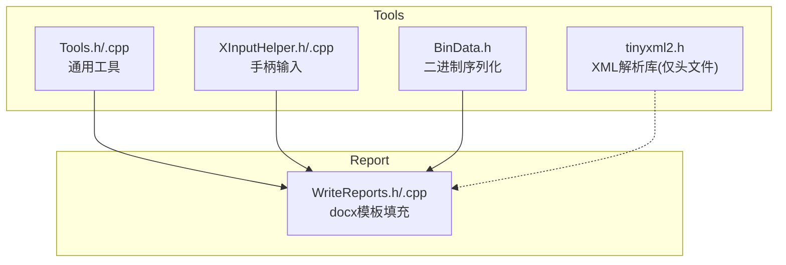
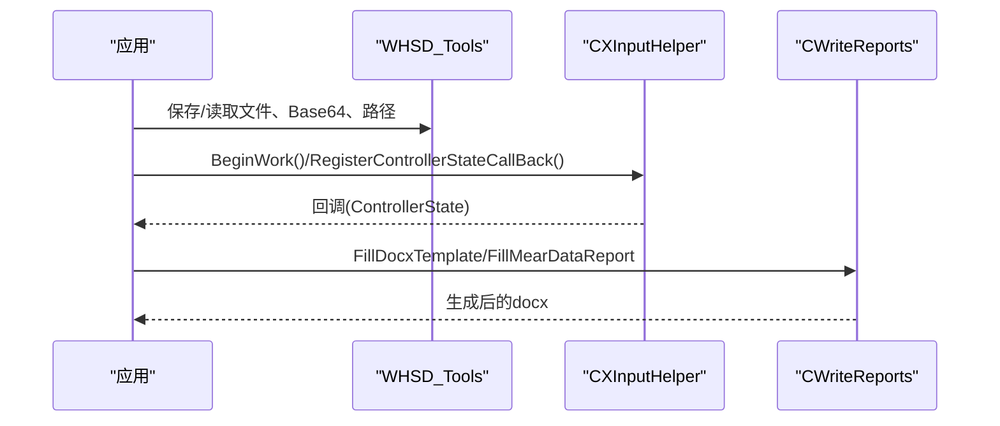
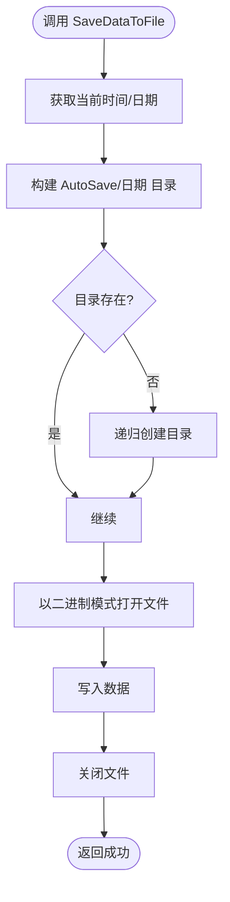
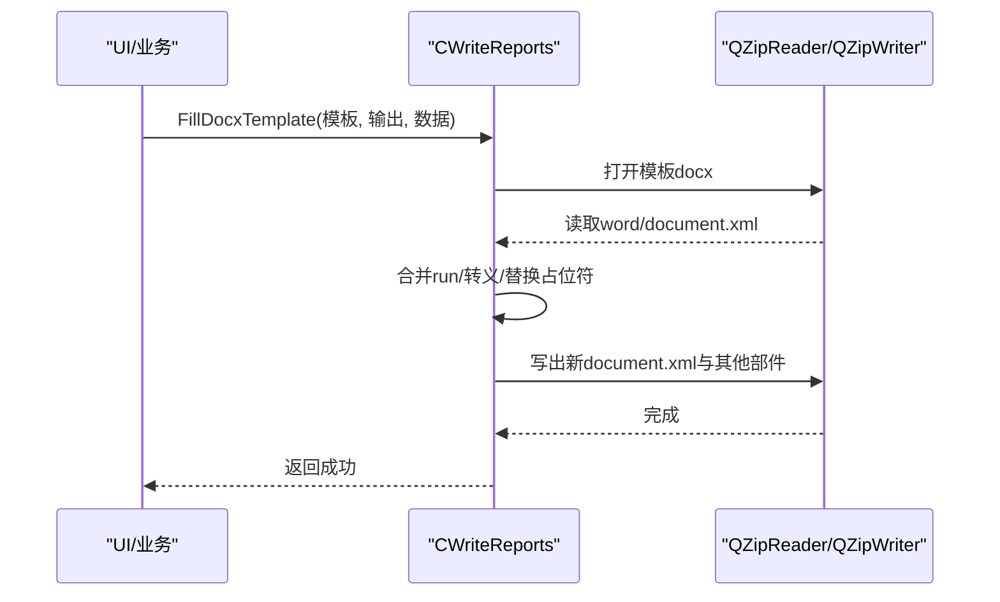
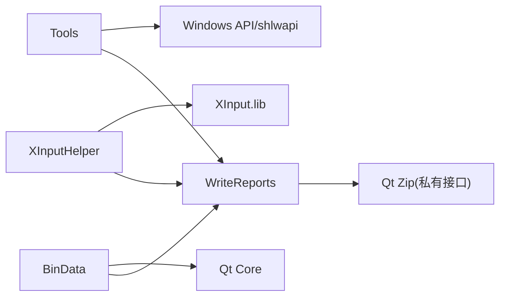

# 工具模块

<cite>
**本文引用的文件**
- [Tools.h](file://Insulator_Zero_Value_Detection_Robot/Tools/Tools.h)
- [Tools.cpp](file://Insulator_Zero_Value_Detection_Robot/Tools/Tools.cpp)
- [XInputHelper.h](file://Insulator_Zero_Value_Detection_Robot/Tools/XInputHelper.h)
- [XInputHelper.cpp](file://Insulator_Zero_Value_Detection_Robot/Tools/XInputHelper.cpp)
- [BinData.h](file://Insulator_Zero_Value_Detection_Robot/Tools/BinData.h)
- [tinyxml2.h](file://Insulator_Zero_Value_Detection_Robot/Tools/tinyxml2.h)
- [WriteReports.h](file://Insulator_Zero_Value_Detection_Robot/Report/WriteReports.h)
- [WriteReports.cpp](file://Insulator_Zero_Value_Detection_Robot/Report/WriteReports.cpp)
</cite>

## 目录
1. [简介](#简介)
2. [项目结构](#项目结构)
3. [核心组件](#核心组件)
4. [架构总览](#架构总览)
5. [详细组件分析](#详细组件分析)
6. [依赖关系分析](#依赖关系分析)
7. [性能考虑](#性能考虑)
8. [故障排查指南](#故障排查指南)
9. [结论](#结论)
10. [附录：使用示例与最佳实践](#附录使用示例与最佳实践)

## 简介
本模块为绝缘子零值检测机器人V2提供通用工具能力，涵盖：
- 基础工具函数：时间、路径、文件读写、字符串分割、Base64编解码、数组缩放等
- 手柄输入处理器：基于XInput的控制器状态轮询、按键映射、回调事件
- 二进制数据处理：容器序列化/反序列化、Base64转换
- XML解析集成：通过第三方tinyxml2头文件（本项目内嵌），并在报告生成中采用Qt Zip方式处理docx内部XML
- 扩展指南：新增工具函数的规范与注意事项

## 项目结构
工具模块主要位于 Tools 目录，包含通用工具、手柄输入、二进制数据封装以及第三方库头文件。报告生成在 Report 目录，演示了XML相关处理流程（docx模板填充）。



图表来源
- [Tools.h:1-79](file://Insulator_Zero_Value_Detection_Robot/Tools/Tools.h#L1-L79)
- [XInputHelper.h:1-48](file://Insulator_Zero_Value_Detection_Robot/Tools/XInputHelper.h#L1-L48)
- [BinData.h:1-73](file://Insulator_Zero_Value_Detection_Robot/Tools/BinData.h#L1-L73)
- [WriteReports.h:1-89](file://Insulator_Zero_Value_Detection_Robot/Report/WriteReports.h#L1-L89)

章节来源
- [Tools.h:1-79](file://Insulator_Zero_Value_Detection_Robot/Tools/Tools.h#L1-L79)
- [Tools.cpp:1-598](file://Insulator_Zero_Value_Detection_Robot/Tools/Tools.cpp#L1-L598)
- [XInputHelper.h:1-48](file://Insulator_Zero_Value_Detection_Robot/Tools/XInputHelper.h#L1-L48)
- [XInputHelper.cpp:1-149](file://Insulator_Zero_Value_Detection_Robot/Tools/XInputHelper.cpp#L1-L149)
- [BinData.h:1-73](file://Insulator_Zero_Value_Detection_Robot/Tools/BinData.h#L1-L73)
- [WriteReports.h:1-89](file://Insulator_Zero_Value_Detection_Robot/Report/WriteReports.h#L1-L89)
- [WriteReports.cpp:1-200](file://Insulator_Zero_Value_Detection_Robot/Report/WriteReports.cpp#L1-L200)

## 核心组件
- 通用工具 WHSD_Tools：提供时间获取、文件保存/读取、目录操作、字符串分割、整数提取、路径处理、Base64编解码、数组缩放等
- 手柄输入 CXInputHelper：基于XInput的控制器状态读取、死区处理、标准化、回调通知
- 二进制数据 BinData：基于QDataStream的容器序列化/反序列化和Base64转换
- XML集成 tinyxml2：提供XML解析能力（头文件）；报告生成采用Qt Zip方式直接操作docx内部XML

章节来源
- [Tools.h:20-79](file://Insulator_Zero_Value_Detection_Robot/Tools/Tools.h#L20-L79)
- [XInputHelper.h:5-48](file://Insulator_Zero_Value_Detection_Robot/Tools/XInputHelper.h#L5-L48)
- [BinData.h:9-73](file://Insulator_Zero_Value_Detection_Robot/Tools/BinData.h#L9-L73)
- [tinyxml2.h:113-123](file://Insulator_Zero_Value_Detection_Robot/Tools/tinyxml2.h#L113-L123)

## 架构总览
工具模块以“功能分层”组织：
- 基础层：Tools 提供跨场景的基础能力（文件、字符串、编码、路径）
- 设备交互层：XInputHelper 抽象手柄输入，屏蔽平台API细节
- 数据层：BinData 统一二进制序列化/反序列化
- 应用层：Report 中的 WriteReports 利用上述能力完成docx报告生成（内部XML替换）



图表来源
- [Tools.cpp:27-143](file://Insulator_Zero_Value_Detection_Robot/Tools/Tools.cpp#L27-L143)
- [XInputHelper.cpp:22-42](file://Insulator_Zero_Value_Detection_Robot/Tools/XInputHelper.cpp#L22-L42)
- [WriteReports.cpp:40-115](file://Insulator_Zero_Value_Detection_Robot/Report/WriteReports.cpp#L40-L115)

## 详细组件分析

### 通用工具 WHSD_Tools
职责与关键能力
- 时间与路径：获取当前时间字符串、可执行目录、绝对路径拼接
- 文件操作：二进制保存（按日期自动归档）、按GUID创建目录并保存、批量读取到vector、递归创建目录、清空目录内容
- 字符串与数据：字符串分割、从字符串向量提取整数、Base64编解码、uint16数组归一化缩放
- 资源释放：SafeRelease/SafeReleaseWithEndWork模板函数

复杂度与性能要点
- 文件读取采用分块读取（4KB），避免大文件内存峰值
- Base64编解码为O(n)，空间开销线性
- 目录删除采用递归遍历，注意权限与只读属性处理

错误处理
- 文件打开失败返回false
- 目录创建失败抛出运行时异常或返回false
- Base64非法字符抛异常



图表来源
- [Tools.cpp:27-77](file://Insulator_Zero_Value_Detection_Robot/Tools/Tools.cpp#L27-L77)

章节来源
- [Tools.h:20-79](file://Insulator_Zero_Value_Detection_Robot/Tools/Tools.h#L20-L79)
- [Tools.cpp:9-598](file://Insulator_Zero_Value_Detection_Robot/Tools/Tools.cpp#L9-L598)

### 手柄输入处理器 CXInputHelper
职责与关键能力
- 控制器连接检测：通过XInputGetState判断是否连接
- 按键映射：将XINPUT_GAMEPAD_*映射到buttons数组，方向键映射到dpad字段
- 模拟量处理：扳机与摇杆原始值标准化到[0,1]或[-1,1]，并应用死区阈值
- 事件处理：后台线程轮询，触发注册的回调函数

线程模型
- BeginWork启动独立线程循环读取，EndWork设置退出标志
- 回调通过std::function传递，支持任意业务逻辑

```mermaid
classDiagram
class ControllerState {
+bool connected
+bool buttons[14]
+float leftTrigger
+float rightTrigger
+float leftThumbX
+float leftThumbY
+float rightThumbX
+float rightThumbY
+int dpad
}
class CXInputHelper {
-int m_nHandleIndex
-bool m_bIsNeedExit
-ControllerState m_memControllerState
-std : : function<void(int, ControllerState*)> m_function_ControllerStateCallBack
+BeginWork() bool
+EndWork() void
+RegisterControllerStateCallBack(p) void
-ReadControllerState() bool
-LoopGetHandleValue() void
-NormalizeTrigger(value) float
-NormalizeThumbstick(value) float
}
CXInputHelper --> ControllerState : "维护状态"
```

图表来源
- [XInputHelper.h:5-48](file://Insulator_Zero_Value_Detection_Robot/Tools/XInputHelper.h#L5-L48)
- [XInputHelper.cpp:15-149](file://Insulator_Zero_Value_Detection_Robot/Tools/XInputHelper.cpp#L15-L149)

章节来源
- [XInputHelper.h:1-48](file://Insulator_Zero_Value_Detection_Robot/Tools/XInputHelper.h#L1-L48)
- [XInputHelper.cpp:1-149](file://Insulator_Zero_Value_Detection_Robot/Tools/XInputHelper.cpp#L1-L149)

### 二进制数据处理 BinData
职责与关键能力
- toBinaryData/fromBinaryData：基于QDataStream对容器进行序列化/反序列化，固定Qt版本保证兼容性
- binaryToBase64/base64ToBinary：用于文本配置存储（如ini/xml只能存字符串）时的二进制转文本

使用建议
- 序列化前确保容器类型支持QDataStream流操作
- 反序列化时检查返回值与流状态，避免空数据导致解析失败

章节来源
- [BinData.h:9-73](file://Insulator_Zero_Value_Detection_Robot/Tools/BinData.h#L9-L73)

### XML解析与报告生成
- tinyxml2：作为第三方库头文件引入，提供XML解析能力（本项目未直接使用其实现，但提供了接口定义）
- 报告生成：WriteReports通过Qt Zip直接读取/修改docx内部的word/document.xml，实现占位符替换与表格数据行重建



图表来源
- [WriteReports.cpp:40-115](file://Insulator_Zero_Value_Detection_Robot/Report/WriteReports.cpp#L40-L115)
- [WriteReports.h:24-89](file://Insulator_Zero_Value_Detection_Robot/Report/WriteReports.h#L24-L89)

章节来源
- [tinyxml2.h:113-123](file://Insulator_Zero_Value_Detection_Robot/Tools/tinyxml2.h#L113-L123)
- [WriteReports.h:24-89](file://Insulator_Zero_Value_Detection_Robot/Report/WriteReports.h#L24-L89)
- [WriteReports.cpp:1-200](file://Insulator_Zero_Value_Detection_Robot/Report/WriteReports.cpp#L1-L200)

## 依赖关系分析
- Tools 依赖标准库与Windows API（shlwapi），用于路径与文件操作
- XInputHelper 依赖XInput库，需链接XInput.lib
- BinData 依赖Qt Core（QDataStream、QByteArray、QSettings等）
- WriteReports 依赖Qt Core私有Zip接口（qzipreader_p/qzipwriter_p）



图表来源
- [Tools.cpp:1-8](file://Insulator_Zero_Value_Detection_Robot/Tools/Tools.cpp#L1-L8)
- [XInputHelper.cpp:1-8](file://Insulator_Zero_Value_Detection_Robot/Tools/XInputHelper.cpp#L1-L8)
- [BinData.h:1-7](file://Insulator_Zero_Value_Detection_Robot/Tools/BinData.h#L1-L7)
- [WriteReports.h:10-18](file://Insulator_Zero_Value_Detection_Robot/Report/WriteReports.h#L10-L18)

章节来源
- [Tools.cpp:1-8](file://Insulator_Zero_Value_Detection_Robot/Tools/Tools.cpp#L1-L8)
- [XInputHelper.cpp:1-8](file://Insulator_Zero_Value_Detection_Robot/Tools/XInputHelper.cpp#L1-L8)
- [BinData.h:1-7](file://Insulator_Zero_Value_Detection_Robot/Tools/BinData.h#L1-L7)
- [WriteReports.h:10-18](file://Insulator_Zero_Value_Detection_Robot/Report/WriteReports.h#L10-L18)

## 性能考虑
- 文件I/O：读取采用分块策略，适合大文件；写文件前确保目录存在，减少重复创建开销
- Base64：编解码为线性复杂度，避免频繁小对象分配，必要时复用缓冲区
- 手柄轮询：10ms周期，兼顾实时性与CPU占用；死区过滤减少抖动
- docx处理：仅修改document.xml，其余部件原样复制，降低IO与CPU压力

## 故障排查指南
常见问题与定位
- 文件保存失败：检查路径权限、磁盘空间、目标目录是否存在
- 手柄无响应：确认已调用BeginWork且回调已注册；检查XInputGetState返回值
- Base64解码异常：校验输入长度是否为4的倍数，检查非法字符
- docx生成失败：确认模板有效、输出路径可写、文档结构完整

定位方法
- 查看函数返回值与异常信息
- 打印中间状态（如路径、文件大小、回调触发次数）
- 逐步缩小范围（先验证文件读写，再验证手柄，最后验证报告生成）

章节来源
- [Tools.cpp:27-143](file://Insulator_Zero_Value_Detection_Robot/Tools/Tools.cpp#L27-L143)
- [XInputHelper.cpp:22-42](file://Insulator_Zero_Value_Detection_Robot/Tools/XInputHelper.cpp#L22-L42)
- [WriteReports.cpp:40-115](file://Insulator_Zero_Value_Detection_Robot/Report/WriteReports.cpp#L40-L115)

## 结论
本工具模块为机器人系统提供了稳定可靠的基础能力：
- 通用工具覆盖日常开发所需的数据与文件操作
- 手柄输入处理器简化了设备交互，便于扩展控制逻辑
- 二进制数据封装提升了配置与数据传输的便捷性
- 报告生成模块展示了XML处理的工程实践，结合Qt Zip高效生成docx

建议在后续迭代中持续完善错误处理、日志记录与单元测试，以提升健壮性与可维护性。

## 附录：使用示例与最佳实践

- 通用工具
  - 保存二进制数据到带日期的目录：参考路径
    - [Tools.cpp:27-77](file://Insulator_Zero_Value_Detection_Robot/Tools/Tools.cpp#L27-L77)
  - 按GUID创建目录并保存：参考路径
    - [Tools.cpp:101-143](file://Insulator_Zero_Value_Detection_Robot/Tools/Tools.cpp#L101-L143)
  - Base64编解码：参考路径
    - [Tools.cpp:361-469](file://Insulator_Zero_Value_Detection_Robot/Tools/Tools.cpp#L361-L469)
  - 数组归一化缩放：参考路径
    - [Tools.cpp:329-359](file://Insulator_Zero_Value_Detection_Robot/Tools/Tools.cpp#L329-L359)

- 手柄输入
  - 初始化并开始轮询：参考路径
    - [XInputHelper.cpp:15-32](file://Insulator_Zero_Value_Detection_Robot/Tools/XInputHelper.cpp#L15-L32)
  - 注册回调处理按键与摇杆：参考路径
    - [XInputHelper.cpp:39-42](file://Insulator_Zero_Value_Detection_Robot/Tools/XInputHelper.cpp#L39-L42)
  - 停止轮询：参考路径
    - [XInputHelper.cpp:34-37](file://Insulator_Zero_Value_Detection_Robot/Tools/XInputHelper.cpp#L34-L37)

- 二进制数据
  - 容器序列化/反序列化：参考路径
    - [BinData.h:9-32](file://Insulator_Zero_Value_Detection_Robot/Tools/BinData.h#L9-L32)
  - Base64转换（用于文本配置）：参考路径
    - [BinData.h:34-44](file://Insulator_Zero_Value_Detection_Robot/Tools/BinData.h#L34-L44)

- XML与报告
  - 填充docx模板：参考路径
    - [WriteReports.cpp:107-127](file://Insulator_Zero_Value_Detection_Robot/Report/WriteReports.cpp#L107-L127)
  - 填充测量数据表：参考路径
    - [WriteReports.cpp:129-151](file://Insulator_Zero_Value_Detection_Robot/Report/WriteReports.cpp#L129-L151)

- 扩展指南与新工具函数开发规范
  - 命名与组织：遵循现有命名风格（如WHSD_Tools、CXInputHelper），保持单一职责
  - 错误处理：优先返回布尔或明确错误码，必要时抛出异常；对外接口保持一致
  - 线程安全：涉及共享状态的函数需加锁或避免并发访问
  - 性能：避免不必要的拷贝，预分配容器容量，合理使用分块I/O
  - 可测试性：提供纯函数或可注入依赖的版本，便于单元测试
  - 文档：为新函数补充注释与使用示例，更新本文档