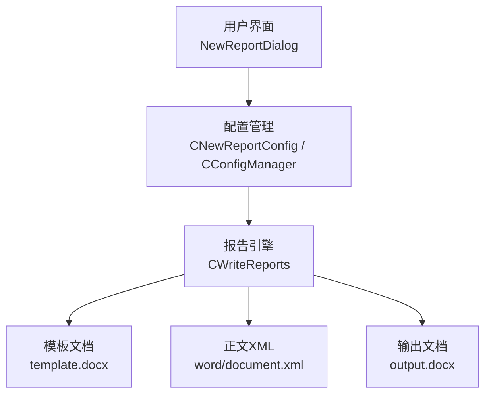
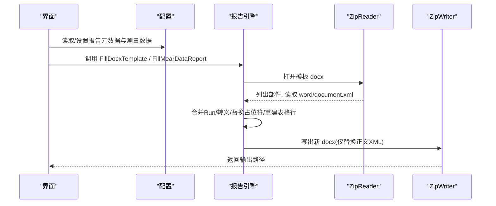
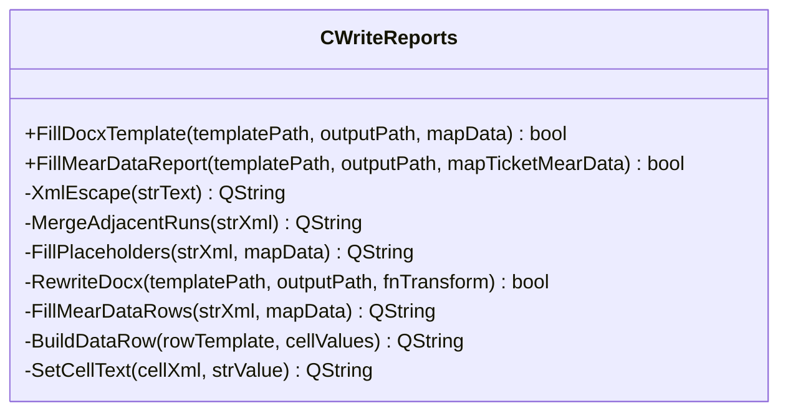
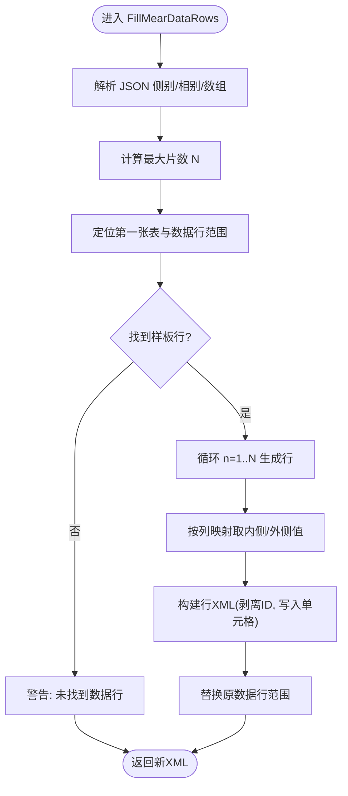
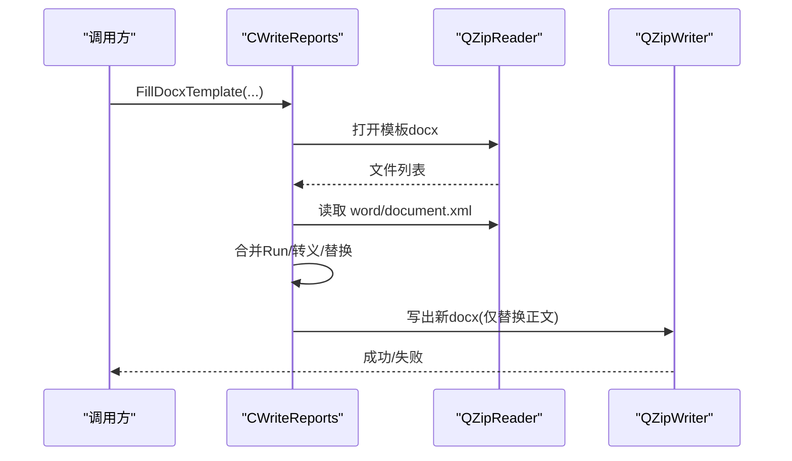

# 报告生成模块

<cite>
**本文引用的文件**
- [WriteReports.h](file://Insulator_Zero_Value_Detection_Robot/Report/WriteReports.h)
- [WriteReports.cpp](file://Insulator_Zero_Value_Detection_Robot/Report/WriteReports.cpp)
- [document.xml](file://Insulator_Zero_Value_Detection_Robot/Report/document.xml)
- [example.cpp](file://Insulator_Zero_Value_Detection_Robot/Report/example.cpp)
- [NewReportDialog.h](file://Insulator_Zero_Value_Detection_Robot/UI/NewReportDialog.h)
- [NewReportDialog.cpp](file://Insulator_Zero_Value_Detection_Robot/UI/NewReportDialog.cpp)
- [ConfigManager.h](file://Insulator_Zero_Value_Detection_Robot/Config/ConfigManager.h)
- [Insulator_Zero_Value_Detection_Robot.cpp](file://Insulator_Zero_Value_Detection_Robot/UI/Insulator_Zero_Value_Detection_Robot.cpp)
</cite>

## 目录
1. [简介](#简介)
2. [项目结构](#项目结构)
3. [核心组件](#核心组件)
4. [架构总览](#架构总览)
5. [详细组件分析](#详细组件分析)
6. [依赖关系分析](#依赖关系分析)
7. [性能考虑](#性能考虑)
8. [故障排查指南](#故障排查指南)
9. [结论](#结论)
10. [附录](#附录)

## 简介
本模块为绝缘子零值检测机器人V2的报告生成子系统，负责基于Word模板（docx）自动生成检测报告、校准报告等。其技术路线是：将docx视为zip容器，仅对正文XML（word/document.xml）进行占位符替换与表格数据行重建，其他资源（样式、图片、页眉页脚等）原样保留，从而在不安装Word的情况下跨平台生成标准格式报告。

## 项目结构
报告相关代码集中在 Report 目录，UI 层提供报告配置入口，配置管理模块承载报告元数据与测量数据。

图表来源
- [WriteReports.h:20-88](file://Insulator_Zero_Value_Detection_Robot/Report/WriteReports.h#L20-L88)
- [WriteReports.cpp:40-115](file://Insulator_Zero_Value_Detection_Robot/Report/WriteReports.cpp#L40-L115)
- [NewReportDialog.cpp:19-44](file://Insulator_Zero_Value_Detection_Robot/UI/NewReportDialog.cpp#L19-L44)
- [ConfigManager.h:176-198](file://Insulator_Zero_Value_Detection_Robot/Config/ConfigManager.h#L176-L198)

章节来源
- [WriteReports.h:20-88](file://Insulator_Zero_Value_Detection_Robot/Report/WriteReports.h#L20-L88)
- [WriteReports.cpp:40-115](file://Insulator_Zero_Value_Detection_Robot/Report/WriteReports.cpp#L40-L115)
- [NewReportDialog.cpp:19-44](file://Insulator_Zero_Value_Detection_Robot/UI/NewReportDialog.cpp#L19-L44)
- [ConfigManager.h:176-198](file://Insulator_Zero_Value_Detection_Robot/Config/ConfigManager.h#L176-L198)

## 核心组件
- CWriteReports：报告模板引擎核心类，提供两类能力
  - 文本占位符填充：FillDocxTemplate
  - 测量数据表填充：FillMearDataReport（自适应行数）
- 工具方法：XmlEscape、MergeAdjacentRuns、SetCellText、BuildDataRow、FillPlaceholders、RewriteDocx、FillMearDataRows
- 示例程序：example.cpp 演示最小可用流程
- UI 交互：NewReportDialog 收集报告基本信息并触发后续生成流程
- 配置模型：CNewReportConfig 承载报告ID、单位、人员、地点及测量数据JSON

章节来源
- [WriteReports.h:20-88](file://Insulator_Zero_Value_Detection_Robot/Report/WriteReports.h#L20-L88)
- [WriteReports.cpp:10-321](file://Insulator_Zero_Value_Detection_Robot/Report/WriteReports.cpp#L10-L321)
- [example.cpp:17-71](file://Insulator_Zero_Value_Detection_Robot/Report/example.cpp#L17-L71)
- [NewReportDialog.cpp:19-44](file://Insulator_Zero_Value_Detection_Robot/UI/NewReportDialog.cpp#L19-L44)
- [ConfigManager.h:176-198](file://Insulator_Zero_Value_Detection_Robot/Config/ConfigManager.h#L176-L198)

## 架构总览
报告生成的整体流程如下：

图表来源
- [WriteReports.cpp:40-115](file://Insulator_Zero_Value_Detection_Robot/Report/WriteReports.cpp#L40-L115)
- [WriteReports.cpp:131-151](file://Insulator_Zero_Value_Detection_Robot/Report/WriteReports.cpp#L131-L151)
- [WriteReports.cpp:206-320](file://Insulator_Zero_Value_Detection_Robot/Report/WriteReports.cpp#L206-L320)

## 详细组件分析

### 模板引擎：CWriteReports
- 设计要点
  - 不依赖外部库解析docx，直接操作zip内部结构，仅修改正文XML，保证兼容性与可移植性
  - 通过正则表达式处理Word在渲染时拆分的run片段，确保占位符${key}可被完整匹配和替换
  - 表格数据行按模板第一张表的“样板行”克隆生成，自动增删行以适配实际数据量
- 关键接口
  - FillDocxTemplate：通用占位符填充
  - FillMearDataReport：双联测量数据填充到数据表
  - 重载支持 std::string 与 QString 两种路径类型
- 内部实现要点
  - XmlEscape：对 < > & 进行转义，避免破坏XML结构
  - MergeAdjacentRuns：合并相邻w:r/w:t片段，使占位符连续
  - FillPlaceholders：遍历mapData执行替换
  - RewriteDocx：统一读写docx的入口，应用变换函数后写回
  - BuildDataRow/SetCellText：单元格级文本写入，剥离重复ID避免Word报错
  - FillMearDataRows：解析JSON测量数据，定位表格数据行范围，按列映射生成N行

图表来源
- [WriteReports.h:20-88](file://Insulator_Zero_Value_Detection_Robot/Report/WriteReports.h#L20-L88)

章节来源
- [WriteReports.h:20-88](file://Insulator_Zero_Value_Detection_Robot/Report/WriteReports.h#L20-L88)
- [WriteReports.cpp:10-321](file://Insulator_Zero_Value_Detection_Robot/Report/WriteReports.cpp#L10-L321)

### 数据表填充算法（测量数据）
- 输入数据结构
  - QJsonObject mapTicketMearData：外层键为“大号/小号”，内层键为“A/B/C”相别，值为该相测量值数组（内侧、外侧成对）
- 处理逻辑
  - 计算最大片数 N = max(ceil(size/2)) 作为目标行数
  - 定位模板中第一张表与数据行范围（首列为纯数字片号且共14单元格）
  - 以样板行为模板，逐行生成14个单元格的值：[片号, 大号A内/外, B内/外, C内/外, 小号A内/外, B内/外, C内/外]
  - 写入第一个w:t，清空其余w:t，避免多行ID冲突
- 流程图

图表来源
- [WriteReports.cpp:206-320](file://Insulator_Zero_Value_Detection_Robot/Report/WriteReports.cpp#L206-L320)

章节来源
- [WriteReports.cpp:206-320](file://Insulator_Zero_Value_Detection_Robot/Report/WriteReports.cpp#L206-L320)

### 模板加载与渲染流程
- 步骤
  1) 校验路径与防覆盖
  2) 使用QZipReader打开模板docx
  3) 读取并转换word/document.xml（合并Run、转义、替换或表格重建）
  4) 创建输出目录（不存在则自动创建）
  5) 使用QZipWriter逐部件写出，仅替换正文XML，其余原样复制
- 时序图

图表来源
- [WriteReports.cpp:40-115](file://Insulator_Zero_Value_Detection_Robot/Report/WriteReports.cpp#L40-L115)

章节来源
- [WriteReports.cpp:40-115](file://Insulator_Zero_Value_Detection_Robot/Report/WriteReports.cpp#L40-L115)

### 报告数据结构与映射
- 报告元数据（CNewReportConfig）
  - 报告编号、检测单位、检测人员、工作地点、备注、是否已生成报告标志
  - 测量数据：QJsonObject m_mapTicketMearData（侧别→相别→数值数组）
- 数据表映射规则
  - 每行14单元格：[片号, 大号A内, 大号A外, 大号B内, 大号B外, 大号C内, 大号C外, 片号, 小号A内, 小号A外, 小号B内, 小号B外, 小号C内, 小号C外]
  - 每相数组按[内侧,外侧]成对存放，第n片对应索引 2(n-1) 与 2(n-1)+1
- 映射关系说明
  - 大号侧 → 表格左半区；小号侧 → 表格右半区
  - 相别 A/B/C → 对应三组列
  - 内侧/外侧 → 左右列

章节来源
- [ConfigManager.h:176-198](file://Insulator_Zero_Value_Detection_Robot/Config/ConfigManager.h#L176-L198)
- [WriteReports.h:43-55](file://Insulator_Zero_Value_Detection_Robot/Report/WriteReports.h#L43-L55)
- [WriteReports.cpp:206-320](file://Insulator_Zero_Value_Detection_Robot/Report/WriteReports.cpp#L206-L320)

### 多种报告类型支持
- 检测报告：使用默认模板，包含检测概况、依据、判定规则、数据表等
- 校准报告：可通过更换模板docx与调整占位符/表格结构复用同一引擎
- 扩展方式
  - 新增模板：准备新的docx，定义占位符与表格结构
  - 数据绑定：构造对应的QHash/QJsonObject数据
  - 调用相同接口完成生成

章节来源
- [WriteReports.h:20-88](file://Insulator_Zero_Value_Detection_Robot/Report/WriteReports.h#L20-L88)
- [WriteReports.cpp:107-151](file://Insulator_Zero_Value_Detection_Robot/Report/WriteReports.cpp#L107-L151)

### 模板定制与自定义字段添加指南
- 占位符
  - 在模板正文任意位置插入 ${字段名}，例如 ${name}、${dept}、${phone}
  - 引擎会合并跨run片段，确保占位符不被拆分
- 表格字段
  - 若需扩展数据表列，需同步更新：
    - 样板行的单元格数量与顺序
    - 列映射数组与内外侧判断逻辑
    - 数据源JSON结构与解析函数
- 注意事项
  - 避免手动编辑导致ID重复（引擎会自动剥离paraId/textId）
  - 特殊字符会被自动转义，无需手工处理

章节来源
- [WriteReports.cpp:20-38](file://Insulator_Zero_Value_Detection_Robot/Report/WriteReports.cpp#L20-L38)
- [WriteReports.cpp:177-204](file://Insulator_Zero_Value_Detection_Robot/Report/WriteReports.cpp#L177-L204)
- [WriteReports.cpp:206-320](file://Insulator_Zero_Value_Detection_Robot/Report/WriteReports.cpp#L206-L320)

### 示例与最小可用流程
- example.cpp 展示了：
  - 环境配置（Qt Core 与私有Zip头）
  - 占位符替换的最小实现
  - 从模板生成输出docx的基本流程
- 可用于快速验证模板与数据绑定是否正确

章节来源
- [example.cpp:17-71](file://Insulator_Zero_Value_Detection_Robot/Report/example.cpp#L17-L71)

## 依赖关系分析
- 外部依赖
  - Qt Core（QString、QHash、QJsonArray、QRegularExpression等）
  - Qt 私有 Zip 读写器（qzipreader_p.h/qzipwriter_p.h），用于直接操作docx内部结构
- 内部依赖
  - UI层：NewReportDialog 收集报告信息并触发生成
  - 配置层：CNewReportConfig 承载元数据与测量数据
  - 主界面：接收信号并更新状态，标记是否生成报告

图表来源
- [NewReportDialog.cpp:19-44](file://Insulator_Zero_Value_Detection_Robot/UI/NewReportDialog.cpp#L19-L44)
- [Insulator_Zero_Value_Detection_Robot.cpp:2745-2773](file://Insulator_Zero_Value_Detection_Robot/UI/Insulator_Zero_Value_Detection_Robot.cpp#L2745-L2773)
- [ConfigManager.h:176-198](file://Insulator_Zero_Value_Detection_Robot/Config/ConfigManager.h#L176-L198)
- [WriteReports.cpp:40-115](file://Insulator_Zero_Value_Detection_Robot/Report/WriteReports.cpp#L40-L115)

章节来源
- [NewReportDialog.cpp:19-44](file://Insulator_Zero_Value_Detection_Robot/UI/NewReportDialog.cpp#L19-L44)
- [Insulator_Zero_Value_Detection_Robot.cpp:2745-2773](file://Insulator_Zero_Value_Detection_Robot/UI/Insulator_Zero_Value_Detection_Robot.cpp#L2745-L2773)
- [ConfigManager.h:176-198](file://Insulator_Zero_Value_Detection_Robot/Config/ConfigManager.h#L176-L198)
- [WriteReports.cpp:40-115](file://Insulator_Zero_Value_Detection_Robot/Report/WriteReports.cpp#L40-L115)

## 性能考虑
- 时间复杂度
  - 占位符替换：O(N×M)，N为XML长度，M为占位符数量
  - 表格行重建：O(R×C)，R为目标行数，C为每行列数（固定14）
- I/O优化
  - 仅在必要时创建输出目录
  - 仅替换正文XML，其余资源原样复制，减少不必要处理
- 内存占用
  - 全文XML一次性载入，适合中等大小模板；超大模板建议分块或流式处理
- 并发与批量
  - 当前实现为单实例串行；可在上层封装批量任务队列，按模板与数据并行生成（注意线程安全与磁盘I/O）

## 故障排查指南
- 常见问题
  - 模板或输出路径为空：检查传入参数
  - 模板与输出路径相同：防止原地覆盖，需指定不同路径
  - 模板打开失败：确认docx存在且可读
  - word/document.xml为空：模板损坏或不规范
  - 未找到数据表/数据行：检查模板表格结构与样板行是否符合要求（14单元格、首列为数字片号）
  - 测量数据为空：数据表将不含任何片号数据行（属预期）
- 日志与调试
  - 使用 qWarning 输出的提示信息定位问题
  - 借助 example.cpp 快速验证模板与数据绑定
- 修复建议
  - 修正模板结构（保持样板行一致）
  - 确保JSON数据符合侧别/相别/数组约定
  - 避免在模板中手动维护ID，交由引擎处理

章节来源
- [WriteReports.cpp:40-115](file://Insulator_Zero_Value_Detection_Robot/Report/WriteReports.cpp#L40-L115)
- [WriteReports.cpp:206-320](file://Insulator_Zero_Value_Detection_Robot/Report/WriteReports.cpp#L206-L320)

## 结论
报告生成模块以轻量、跨平台的方式实现了Word模板的占位符替换与表格数据行自适应填充，满足检测报告与校准报告等多种场景。通过清晰的接口与严格的数据映射，保证了数据正确性与模板兼容性。建议在批量场景下增加任务队列与并发控制，进一步提升吞吐与稳定性。

## 附录
- 模板示例参考：document.xml 展示了标题、段落、表格等结构，可作为定制模板的基础
- 使用示例：example.cpp 提供了最小可用的占位符替换流程，便于快速集成与测试

章节来源
- [document.xml:1-2](file://Insulator_Zero_Value_Detection_Robot/Report/document.xml#L1-L2)
- [example.cpp:17-71](file://Insulator_Zero_Value_Detection_Robot/Report/example.cpp#L17-L71)