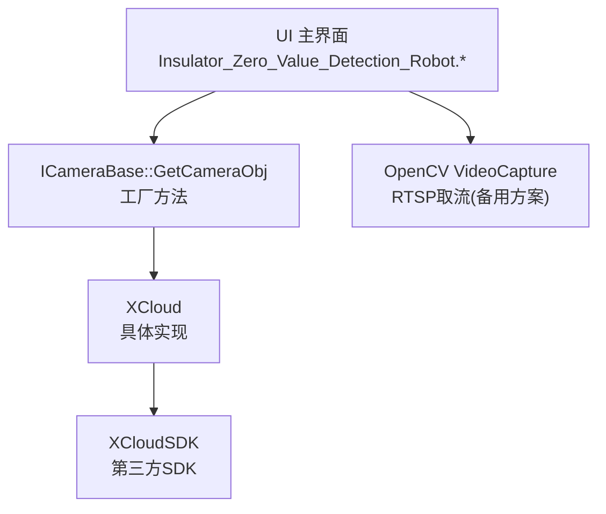
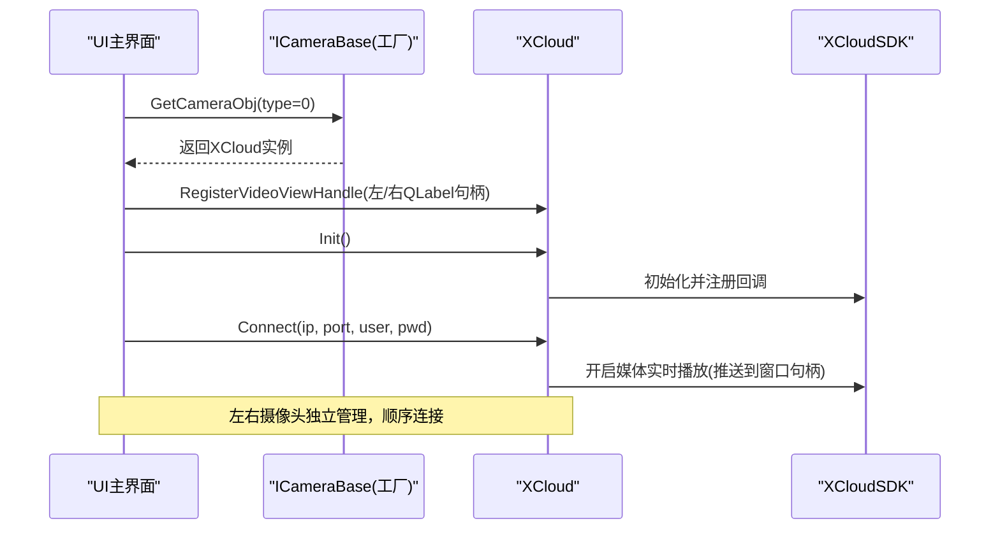
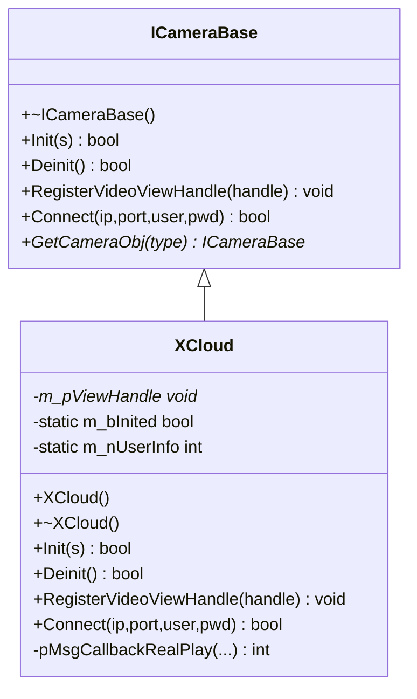
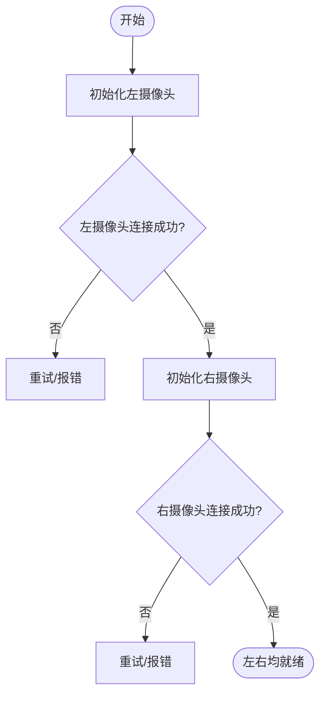
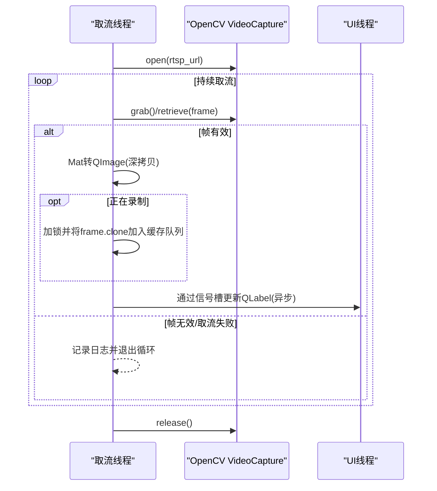
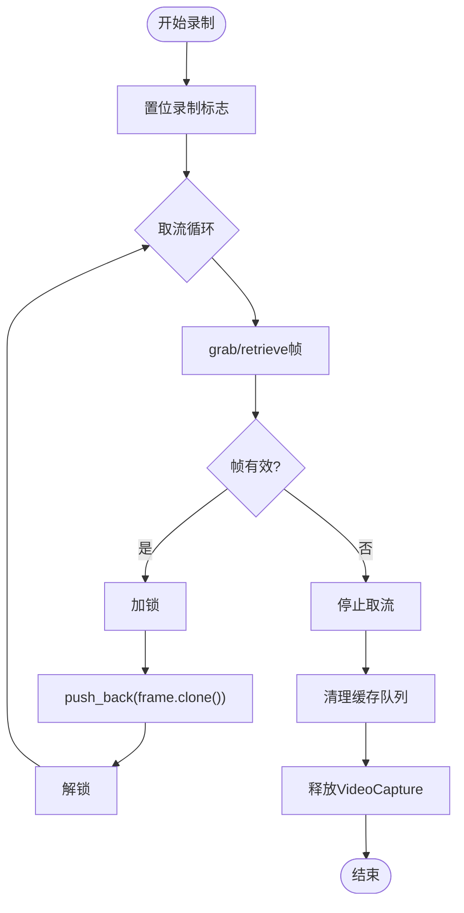
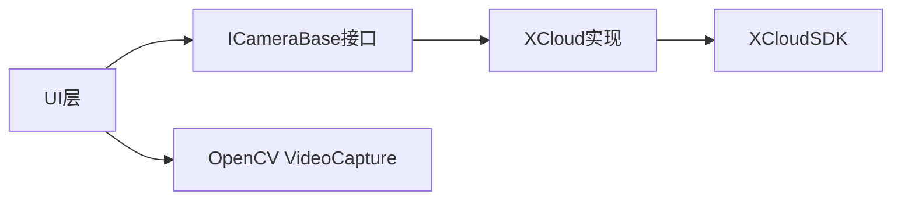

# 摄像头模块

<cite>
**本文引用的文件**
- [CameraBase.h](file://Insulator_Zero_Value_Detection_Robot/Camera/CameraBase.h)
- [CameraBase.cpp](file://Insulator_Zero_Value_Detection_Robot/Camera/CameraBase.cpp)
- [XCloud.h](file://Insulator_Zero_Value_Detection_Robot/Camera/XCloud.h)
- [XCloud.cpp](file://Insulator_Zero_Value_Detection_Robot/Camera/XCloud.cpp)
- [Insulator_Zero_Value_Detection_Robot.h](file://Insulator_Zero_Value_Detection_Robot/UI/Insulator_Zero_Value_Detection_Robot.h)
- [Insulator_Zero_Value_Detection_Robot.cpp](file://Insulator_Zero_Value_Detection_Robot/UI/Insulator_Zero_Value_Detection_Robot.cpp)
</cite>

## 目录
1. [简介](#简介)
2. [项目结构](#项目结构)
3. [核心组件](#核心组件)
4. [架构总览](#架构总览)
5. [详细组件分析](#详细组件分析)
6. [依赖关系分析](#依赖关系分析)
7. [性能考虑](#性能考虑)
8. [故障排查指南](#故障排查指南)
9. [结论](#结论)
10. [附录](#附录)

## 简介
本章节面向绝缘子零值检测机器人V2的摄像头模块，聚焦于抽象接口 ICameraBase 与具体实现 XCloud 的设计与使用。文档涵盖视频流获取、图像捕获、录制控制、双摄像头独立管理与同步连接、帧率与内存管理、线程安全、截图与录像实现细节、连接管理、错误处理与资源释放，以及扩展开发与性能优化建议。

## 项目结构
摄像头模块位于 Camera 目录，包含抽象接口与具体实现；UI 层负责实例化、初始化、注册显示窗口句柄并发起连接。整体采用“抽象接口 + 具体实现”的分层设计，便于后续替换或扩展其他摄像头SDK。

图表来源
- [CameraBase.cpp:8-19](file://Insulator_Zero_Value_Detection_Robot/Camera/CameraBase.cpp#L8-L19)
- [XCloud.cpp:18-62](file://Insulator_Zero_Value_Detection_Robot/Camera/XCloud.cpp#L18-L62)
- [Insulator_Zero_Value_Detection_Robot.cpp:302-312](file://Insulator_Zero_Value_Detection_Robot/UI/Insulator_Zero_Value_Detection_Robot.cpp#L302-L312)
- [Insulator_Zero_Value_Detection_Robot.cpp:1371-1473](file://Insulator_Zero_Value_Detection_Robot/UI/Insulator_Zero_Value_Detection_Robot.cpp#L1371-L1473)

章节来源
- [CameraBase.h:5-14](file://Insulator_Zero_Value_Detection_Robot/Camera/CameraBase.h#L5-L14)
- [CameraBase.cpp:1-19](file://Insulator_Zero_Value_Detection_Robot/Camera/CameraBase.cpp#L1-L19)
- [XCloud.h:6-33](file://Insulator_Zero_Value_Detection_Robot/Camera/XCloud.h#L6-L33)
- [XCloud.cpp:1-69](file://Insulator_Zero_Value_Detection_Robot/Camera/XCloud.cpp#L1-L69)
- [Insulator_Zero_Value_Detection_Robot.h:376-384](file://Insulator_Zero_Value_Detection_Robot/UI/Insulator_Zero_Value_Detection_Robot.h#L376-L384)
- [Insulator_Zero_Value_Detection_Robot.cpp:302-312](file://Insulator_Zero_Value_Detection_Robot/UI/Insulator_Zero_Value_Detection_Robot.cpp#L302-L312)

## 核心组件
- ICameraBase 抽象接口：定义统一的初始化、反初始化、视频视图句柄注册、设备连接等能力，并提供工厂方法以按类型创建具体实现。
- XCloud 具体实现：基于 XCloudSDK 完成 SDK 初始化、回调注册、媒体实时播放（推送到指定窗口句柄）与反初始化流程。
- UI 集成：主界面通过工厂方法创建左右两个摄像头对象，分别绑定到不同 QLabel 的窗口句柄，并在后台线程中顺序执行初始化与连接。

章节来源
- [CameraBase.h:5-14](file://Insulator_Zero_Value_Detection_Robot/Camera/CameraBase.h#L5-L14)
- [CameraBase.cpp:8-19](file://Insulator_Zero_Value_Detection_Robot/Camera/CameraBase.cpp#L8-L19)
- [XCloud.h:6-33](file://Insulator_Zero_Value_Detection_Robot/Camera/XCloud.h#L6-L33)
- [XCloud.cpp:18-62](file://Insulator_Zero_Value_Detection_Robot/Camera/XCloud.cpp#L18-L62)
- [Insulator_Zero_Value_Detection_Robot.h:376-384](file://Insulator_Zero_Value_Detection_Robot/UI/Insulator_Zero_Value_Detection_Robot.h#L376-L384)
- [Insulator_Zero_Value_Detection_Robot.cpp:302-312](file://Insulator_Zero_Value_Detection_Robot/UI/Insulator_Zero_Value_Detection_Robot.cpp#L302-L312)

## 架构总览
摄像头模块采用“抽象接口 + 具体实现 + UI 编排”的分层架构。UI 层负责生命周期编排与显示绑定；抽象接口屏蔽底层差异；具体实现对接第三方 SDK。同时提供基于 OpenCV 的 RTSP 取流作为备选路径，用于低延迟预览与录制缓存。

图表来源
- [CameraBase.cpp:8-19](file://Insulator_Zero_Value_Detection_Robot/Camera/CameraBase.cpp#L8-L19)
- [XCloud.cpp:18-62](file://Insulator_Zero_Value_Detection_Robot/Camera/XCloud.cpp#L18-L62)
- [Insulator_Zero_Value_Detection_Robot.cpp:302-312](file://Insulator_Zero_Value_Detection_Robot/UI/Insulator_Zero_Value_Detection_Robot.cpp#L302-L312)
- [Insulator_Zero_Value_Detection_Robot.cpp:1315-1369](file://Insulator_Zero_Value_Detection_Robot/UI/Insulator_Zero_Value_Detection_Robot.cpp#L1315-L1369)

## 详细组件分析

### ICameraBase 抽象接口
- 职责
  - 统一初始化/反初始化：Init/Deinit
  - 视频视图句柄注册：RegisterVideoViewHandle
  - 设备连接：Connect
  - 工厂方法：GetCameraObj
- 设计要点
  - 纯虚接口，便于多实现扩展
  - 静态工厂方法集中创建策略，隐藏具体实现类型
- 复杂度
  - 接口方法均为 O(1) 调用，实际复杂度取决于具体实现

章节来源
- [CameraBase.h:5-14](file://Insulator_Zero_Value_Detection_Robot/Camera/CameraBase.h#L5-L14)
- [CameraBase.cpp:8-19](file://Insulator_Zero_Value_Detection_Robot/Camera/CameraBase.cpp#L8-L19)

### XCloud 具体实现
- 职责
  - 封装 XCloudSDK 的初始化、回调注册、媒体实时播放与反初始化
  - 将视频渲染目标绑定为上层传入的窗口句柄
- 关键流程
  - Init：初始化SDK、注册消息回调、设置全局状态标志
  - Deinit：注销回调、反初始化SDK、重置状态
  - RegisterVideoViewHandle：保存窗口句柄供后续媒体播放使用
  - Connect：调用媒体实时播放接口，将画面输出到指定窗口
- 线程与回调
  - 回调函数为 SDK 线程触发，当前实现未做复杂处理，保持轻量
- 错误处理
  - 初始化失败直接返回 false
  - 反初始化具备幂等保护，避免重复释放

图表来源
- [CameraBase.h:5-14](file://Insulator_Zero_Value_Detection_Robot/Camera/CameraBase.h#L5-L14)
- [XCloud.h:6-33](file://Insulator_Zero_Value_Detection_Robot/Camera/XCloud.h#L6-L33)
- [XCloud.cpp:1-69](file://Insulator_Zero_Value_Detection_Robot/Camera/XCloud.cpp#L1-L69)

章节来源
- [XCloud.h:6-33](file://Insulator_Zero_Value_Detection_Robot/Camera/XCloud.h#L6-L33)
- [XCloud.cpp:1-69](file://Insulator_Zero_Value_Detection_Robot/Camera/XCloud.cpp#L1-L69)

### 双摄像头支持与管理
- 设计
  - UI 层通过工厂方法创建两个独立的 ICameraBase 实例（左/右），分别绑定不同 QLabel 的窗口句柄
  - 连接流程在后台线程中以状态机方式顺序执行：先初始化，再依次连接左右摄像头
- 同步控制
  - 当前实现为顺序连接，非严格并行；若需严格同步可在状态机中加入等待与超时机制
- 资源隔离
  - 每个实例持有独立的窗口句柄与SDK上下文，互不干扰

图表来源
- [Insulator_Zero_Value_Detection_Robot.cpp:302-312](file://Insulator_Zero_Value_Detection_Robot/UI/Insulator_Zero_Value_Detection_Robot.cpp#L302-L312)
- [Insulator_Zero_Value_Detection_Robot.cpp:1315-1369](file://Insulator_Zero_Value_Detection_Robot/UI/Insulator_Zero_Value_Detection_Robot.cpp#L1315-L1369)

章节来源
- [Insulator_Zero_Value_Detection_Robot.h:376-384](file://Insulator_Zero_Value_Detection_Robot/UI/Insulator_Zero_Value_Detection_Robot.h#L376-L384)
- [Insulator_Zero_Value_Detection_Robot.cpp:302-312](file://Insulator_Zero_Value_Detection_Robot/UI/Insulator_Zero_Value_Detection_Robot.cpp#L302-L312)
- [Insulator_Zero_Value_Detection_Robot.cpp:1315-1369](file://Insulator_Zero_Value_Detection_Robot/UI/Insulator_Zero_Value_Detection_Robot.cpp#L1315-L1369)

### 视频流处理机制（RTSP 备用路径）
- 取流方式
  - 使用 OpenCV 的 VideoCapture 打开 RTSP 流，设置最小缓冲区以降低延迟
- 帧率控制
  - 通过 grab/retrieve 循环读取最新帧，结合 UI 刷新频率控制实际呈现帧率
- 内存管理
  - 每帧转换为 QImage 后深拷贝，避免悬空指针；录制期间将帧 clone 入队列缓存
- 线程安全
  - 取流在独立线程进行，UI 更新通过 Qt 的 QueuedConnection 安全切换至 UI 线程
  - 录制缓冲使用互斥锁保护，防止并发写入冲突

图表来源
- [Insulator_Zero_Value_Detection_Robot.cpp:1371-1473](file://Insulator_Zero_Value_Detection_Robot/UI/Insulator_Zero_Value_Detection_Robot.cpp#L1371-L1473)
- [Insulator_Zero_Value_Detection_Robot.cpp:1478-1514](file://Insulator_Zero_Value_Detection_Robot/UI/Insulator_Zero_Value_Detection_Robot.cpp#L1478-L1514)

章节来源
- [Insulator_Zero_Value_Detection_Robot.cpp:1371-1473](file://Insulator_Zero_Value_Detection_Robot/UI/Insulator_Zero_Value_Detection_Robot.cpp#L1371-L1473)
- [Insulator_Zero_Value_Detection_Robot.cpp:1478-1514](file://Insulator_Zero_Value_Detection_Robot/UI/Insulator_Zero_Value_Detection_Robot.cpp#L1478-L1514)

### 截图功能
- 触发入口：UI 按钮事件绑定到截图回调
- 行为说明：当前代码仅完成按钮绑定与事件接入，截图的具体实现逻辑未在已分析片段中体现
- 建议实现：从当前显示的 QLabel 或最近一帧 Mat/QImage 生成图片并保存

章节来源
- [Insulator_Zero_Value_Detection_Robot.cpp:332](file://Insulator_Zero_Value_Detection_Robot/UI/Insulator_Zero_Value_Detection_Robot.cpp#L332)
- [Insulator_Zero_Value_Detection_Robot.cpp:1572](file://Insulator_Zero_Value_Detection_Robot/UI/Insulator_Zero_Value_Detection_Robot.cpp#L1572)

### 视频录制功能
- 触发入口：UI 按钮事件切换录制状态
- 行为说明
  - 录制期间，取流线程将每帧 clone 并追加到内存队列，避免直接写盘带来的阻塞
  - 停止录制时，UI 线程可弹出路径选择，再将缓存帧统一编码为视频文件
  - 退出时清理缓存队列，释放 VideoCapture 资源
- 线程安全：使用互斥锁保护录制缓冲队列

图表来源
- [Insulator_Zero_Value_Detection_Robot.cpp:1421-1427](file://Insulator_Zero_Value_Detection_Robot/UI/Insulator_Zero_Value_Detection_Robot.cpp#L1421-L1427)
- [Insulator_Zero_Value_Detection_Robot.cpp:1467-1473](file://Insulator_Zero_Value_Detection_Robot/UI/Insulator_Zero_Value_Detection_Robot.cpp#L1467-L1473)
- [Insulator_Zero_Value_Detection_Robot.cpp:1656-1691](file://Insulator_Zero_Value_Detection_Robot/UI/Insulator_Zero_Value_Detection_Robot.cpp#L1656-L1691)

章节来源
- [Insulator_Zero_Value_Detection_Robot.cpp:1421-1427](file://Insulator_Zero_Value_Detection_Robot/UI/Insulator_Zero_Value_Detection_Robot.cpp#L1421-L1427)
- [Insulator_Zero_Value_Detection_Robot.cpp:1467-1473](file://Insulator_Zero_Value_Detection_Robot/UI/Insulator_Zero_Value_Detection_Robot.cpp#L1467-L1473)
- [Insulator_Zero_Value_Detection_Robot.cpp:1656-1691](file://Insulator_Zero_Value_Detection_Robot/UI/Insulator_Zero_Value_Detection_Robot.cpp#L1656-L1691)

### 连接管理、错误处理与资源释放
- 连接管理
  - 通过状态机顺序执行：初始化 -> 左摄像头连接 -> 右摄像头连接
  - 使用独立线程执行，避免阻塞 UI
- 错误处理
  - 初始化失败立即返回；连接失败时记录日志并终止当前流程
  - 取流过程中对空帧与抓取失败进行判断并退出循环
- 资源释放
  - XCloud 析构时调用 Deinit，确保 SDK 反初始化与回调注销
  - RTSP 路径在退出循环后释放 VideoCapture 并清空录制缓存

章节来源
- [XCloud.cpp:13-51](file://Insulator_Zero_Value_Detection_Robot/Camera/XCloud.cpp#L13-L51)
- [Insulator_Zero_Value_Detection_Robot.cpp:1315-1369](file://Insulator_Zero_Value_Detection_Robot/UI/Insulator_Zero_Value_Detection_Robot.cpp#L1315-L1369)
- [Insulator_Zero_Value_Detection_Robot.cpp:1451-1473](file://Insulator_Zero_Value_Detection_Robot/UI/Insulator_Zero_Value_Detection_Robot.cpp#L1451-L1473)

## 依赖关系分析
- 模块内依赖
  - UI 依赖 ICameraBase 抽象接口与工厂方法
  - XCloud 依赖 XCloudSDK 提供的初始化、回调注册与媒体播放接口
  - RTSP 路径依赖 OpenCV 的 VideoCapture
- 外部依赖
  - XCloudSDK：第三方摄像头SDK
  - OpenCV：用于 RTSP 取流与图像格式转换
- 耦合度
  - UI 与具体实现解耦，通过抽象接口降低耦合
  - XCloud 与 SDK 强耦合，但被接口隔离

图表来源
- [CameraBase.cpp:8-19](file://Insulator_Zero_Value_Detection_Robot/Camera/CameraBase.cpp#L8-L19)
- [XCloud.cpp:1-69](file://Insulator_Zero_Value_Detection_Robot/Camera/XCloud.cpp#L1-L69)
- [Insulator_Zero_Value_Detection_Robot.cpp:1371-1473](file://Insulator_Zero_Value_Detection_Robot/UI/Insulator_Zero_Value_Detection_Robot.cpp#L1371-L1473)

章节来源
- [CameraBase.cpp:8-19](file://Insulator_Zero_Value_Detection_Robot/Camera/CameraBase.cpp#L8-L19)
- [XCloud.cpp:1-69](file://Insulator_Zero_Value_Detection_Robot/Camera/XCloud.cpp#L1-L69)
- [Insulator_Zero_Value_Detection_Robot.cpp:1371-1473](file://Insulator_Zero_Value_Detection_Robot/UI/Insulator_Zero_Value_Detection_Robot.cpp#L1371-L1473)

## 性能考虑
- 帧率控制
  - 通过最小缓冲区与 grab/retrieve 快速取最新帧，减少延迟
  - UI 刷新频率影响最终呈现帧率，可根据硬件能力调整定时器周期
- 内存管理
  - 使用深拷贝避免悬空指针；录制期间 clone 帧入队，注意队列长度与内存峰值
  - 退出时及时释放 VideoCapture 与清空缓存
- 线程安全
  - 取流与 UI 更新分离，使用 Qt 的信号槽与互斥锁保证一致性
- 网络与解码
  - RTSP 流质量与网络抖动会影响稳定性，建议在失败时增加重连与降级策略
  - 根据设备能力选择合适的分辨率与编码格式，平衡画质与性能

[本节为通用性能指导，不直接分析具体文件]

## 故障排查指南
- 常见问题
  - 初始化失败：检查 SDK 初始化返回值与配置参数
  - 连接失败：核对 IP、端口与账号密码；确认网络可达
  - 取流失败：检查 RTSP URL 有效性、FFMPEG 后端是否可用
  - 帧为空：网络丢包或解码异常，建议增加重试与日志
- 定位手段
  - 查看设备日志输出，关注“开始连接”“打开失败”“帧为空”等关键字
  - 逐步验证：初始化 -> 连接 -> 取流 -> 显示/录制
- 恢复措施
  - 反初始化并重新初始化
  - 断开并重连摄像头
  - 重启应用以释放残留资源

章节来源
- [XCloud.cpp:18-51](file://Insulator_Zero_Value_Detection_Robot/Camera/XCloud.cpp#L18-L51)
- [Insulator_Zero_Value_Detection_Robot.cpp:1371-1473](file://Insulator_Zero_Value_Detection_Robot/UI/Insulator_Zero_Value_Detection_Robot.cpp#L1371-L1473)

## 结论
本摄像头模块通过抽象接口与具体实现的解耦设计，实现了双摄像头的独立管理与统一接入。XCloud 封装了第三方 SDK，UI 层负责生命周期编排与显示绑定；同时提供基于 OpenCV 的 RTSP 取流作为低延迟预览与录制的备选路径。整体具备良好的可扩展性与可维护性，适合在机器人系统中稳定运行。

[本节为总结性内容，不直接分析具体文件]

## 附录

### 摄像头扩展开发指南
- 新增摄像头实现
  - 新建类继承 ICameraBase，实现 Init/Deinit/RegisterVideoViewHandle/Connect
  - 在工厂方法中增加类型分支，返回新实现实例
- 接入 UI
  - 通过工厂方法创建实例，注册显示窗口句柄，调用初始化与连接
- 注意事项
  - 确保线程安全：回调与数据访问需加锁或使用线程安全队列
  - 资源管理：析构时释放所有外部资源，避免泄漏
  - 错误处理：对外暴露明确的布尔返回值与日志信息

章节来源
- [CameraBase.h:5-14](file://Insulator_Zero_Value_Detection_Robot/Camera/CameraBase.h#L5-L14)
- [CameraBase.cpp:8-19](file://Insulator_Zero_Value_Detection_Robot/Camera/CameraBase.cpp#L8-L19)

### 性能优化建议
- 降低延迟
  - 使用最小缓冲区、优先取最新帧
  - 合理设置分辨率与编码格式
- 提升稳定性
  - 增加重连与超时机制
  - 对网络波动进行自适应降级
- 降低内存占用
  - 限制录制缓存队列长度
  - 及时释放临时对象与句柄

[本节为通用优化建议，不直接分析具体文件]