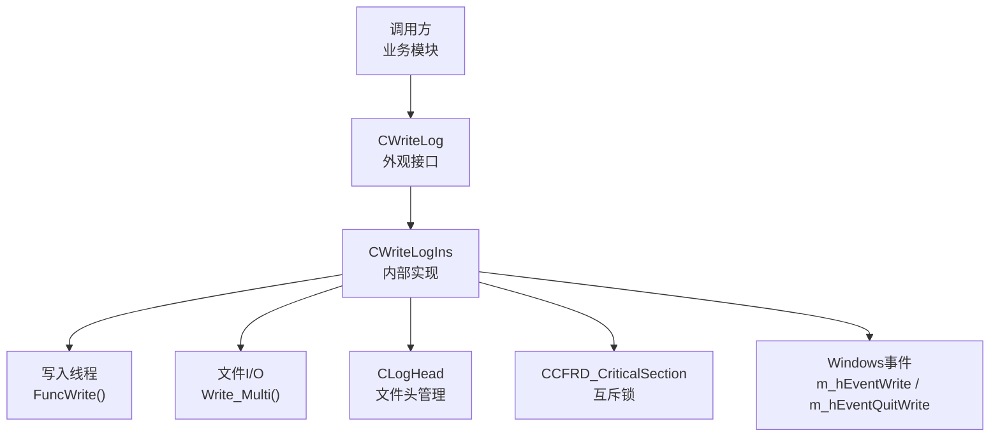
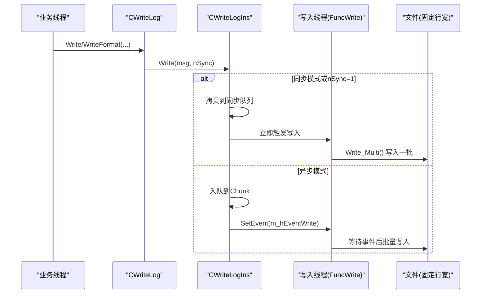
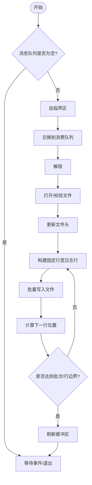
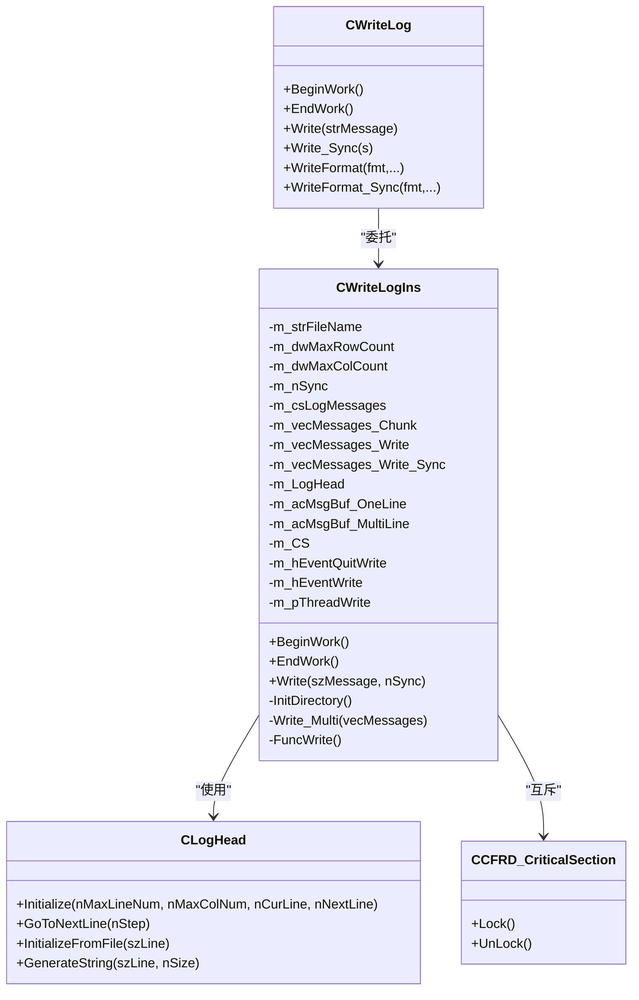

# 日志系统

<cite>
**本文引用的文件**
- [ScanS_WriteLog.h](file://Insulator_Zero_Value_Detection_Robot/Log/ScanS_WriteLog.h)
- [ScanS_WriteLog.cpp](file://Insulator_Zero_Value_Detection_Robot/Log/ScanS_WriteLog.cpp)
- [WriteLogIns.h](file://Insulator_Zero_Value_Detection_Robot/Log/WriteLogIns.h)
- [WriteLogIns.cpp](file://Insulator_Zero_Value_Detection_Robot/Log/WriteLogIns.cpp)
- [ScanS_FC.h](file://Insulator_Zero_Value_Detection_Robot/Log/ScanS_FC.h)
- [ScanS_FC.cpp](file://Insulator_Zero_Value_Detection_Robot/Log/ScanS_FC.cpp)
</cite>

## 目录
1. [简介](#简介)
2. [项目结构](#项目结构)
3. [核心组件](#核心组件)
4. [架构总览](#架构总览)
5. [详细组件分析](#详细组件分析)
6. [依赖关系分析](#依赖关系分析)
7. [性能与并发特性](#性能与并发特性)
8. [故障排查指南](#故障排查指南)
9. [结论](#结论)
10. [附录：扩展与调试建议](#附录：扩展与调试建议)

## 简介
本文件为绝缘子零值检测机器人V2的日志系统技术文档，聚焦于CWriteLog类与底层扫描日志实现（CWriteLogIns）的架构设计。内容涵盖异步日志写入、固定行宽循环覆盖的文件轮转策略、多线程安全保证、日志格式与头部管理、错误码与异常路径，以及可扩展性与调试实践。该日志系统适用于设备通信、系统运行、错误等场景的统一记录，便于后续查询与分析。

## 项目结构
日志子系统位于 Log 目录，采用“外观接口 + 内部实现”的分层设计：
- 外观层：CWriteLog 提供简洁易用的线程安全写日志接口，屏蔽内部细节。
- 实现层：CWriteLogIns 负责消息缓冲、异步写入线程、文件头维护、固定行宽循环写入、错误处理等。
- 基础工具：ScanS_FC 提供临界区、时间、字符串转换等通用能力。

图表来源
- [ScanS_WriteLog.h:5-42](file://Insulator_Zero_Value_Detection_Robot/Log/ScanS_WriteLog.h#L5-L42)
- [WriteLogIns.h:65-129](file://Insulator_Zero_Value_Detection_Robot/Log/WriteLogIns.h#L65-L129)
- [WriteLogIns.cpp:43-93](file://Insulator_Zero_Value_Detection_Robot/Log/WriteLogIns.cpp#L43-L93)
- [WriteLogIns.cpp:161-321](file://Insulator_Zero_Value_Detection_Robot/Log/WriteLogIns.cpp#L161-L321)
- [ScanS_FC.h:20-63](file://Insulator_Zero_Value_Detection_Robot/Log/ScanS_FC.h#L20-L63)

章节来源
- [ScanS_WriteLog.h:5-42](file://Insulator_Zero_Value_Detection_Robot/Log/ScanS_WriteLog.h#L5-L42)
- [WriteLogIns.h:65-129](file://Insulator_Zero_Value_Detection_Robot/Log/WriteLogIns.h#L65-L129)
- [ScanS_FC.h:20-63](file://Insulator_Zero_Value_Detection_Robot/Log/ScanS_FC.h#L20-L63)

## 核心组件
- CWriteLog：对外暴露的日志写入外观类，支持同步/异步写入、格式化输出、生命周期管理（BeginWork/EndWork）。
- CWriteLogIns：内部实现类，封装消息队列、异步写入线程、文件头与循环覆盖逻辑、错误码返回。
- CLogHead：日志文件头部结构体，记录最大行数、列数、当前行、下一行位置，用于固定行宽文件的随机访问与循环覆盖。
- CCFRD_CriticalSection：基于Windows临界区的轻量级互斥锁，保障多线程对共享资源的互斥访问。
- 时间/转换工具：ScanS_FC 中的时间与时序工具，用于日志时间戳与格式化。

章节来源
- [ScanS_WriteLog.h:5-42](file://Insulator_Zero_Value_Detection_Robot/Log/ScanS_WriteLog.h#L5-L42)
- [WriteLogIns.h:26-129](file://Insulator_Zero_Value_Detection_Robot/Log/WriteLogIns.h#L26-L129)
- [ScanS_FC.h:20-63](file://Insulator_Zero_Value_Detection_Robot/Log/ScanS_FC.h#L20-L63)

## 架构总览
日志系统采用“生产者-消费者”模型：
- 多个业务线程作为生产者，通过 CWriteLog::Write/WriteFormat 将日志消息加入缓冲队列。
- 内部单一线程作为消费者，监听事件并批量写入磁盘，减少系统调用次数，提升吞吐。
- 文件采用固定行宽布局，首行为文件头，后续每行长度一致，支持按行号随机读写，实现循环覆盖而不需移动历史数据。

图表来源
- [ScanS_WriteLog.cpp:28-66](file://Insulator_Zero_Value_Detection_Robot/Log/ScanS_WriteLog.cpp#L28-L66)
- [WriteLogIns.cpp:128-159](file://Insulator_Zero_Value_Detection_Robot/Log/WriteLogIns.cpp#L128-L159)
- [WriteLogIns.cpp:66-93](file://Insulator_Zero_Value_Detection_Robot/Log/WriteLogIns.cpp#L66-L93)
- [WriteLogIns.cpp:161-321](file://Insulator_Zero_Value_Detection_Robot/Log/WriteLogIns.cpp#L161-L321)

## 详细组件分析

### CWriteLog（外观接口）
- 职责：提供线程安全的日志写入API，统一封装内部实现；支持同步/异步两种模式。
- 关键方法：
  - BeginWork/EndWork：启动/停止内部写入线程与资源。
  - Write/Write_Sync：普通/强制同步写入。
  - WriteFormat/WriteFormat_Sync：格式化写入，内部使用可变参数构造消息。
- 限制与约定：
  - 一个对象可被多线程并发写入，但不同对象不应指向同一日志文件。
  - 每行最大字节数需在合理范围内（最小包含头部与尾部定长字段，最大不超过上限）。

章节来源
- [ScanS_WriteLog.h:5-42](file://Insulator_Zero_Value_Detection_Robot/Log/ScanS_WriteLog.h#L5-L42)
- [ScanS_WriteLog.cpp:5-66](file://Insulator_Zero_Value_Detection_Robot/Log/ScanS_WriteLog.cpp#L5-L66)

### CWriteLogIns（内部实现）
- 职责：消息缓冲、异步写入线程调度、文件头维护、固定行宽循环写入、错误码管理。
- 关键数据结构：
  - m_vecMessages_Chunk：生产端缓冲队列，受临界区保护。
  - m_vecMessages_Write / m_vecMessages_Write_Sync：消费端临时队列，避免跨线程直接操作共享队列。
  - CLogHead：文件头信息，控制循环覆盖的行指针。
  - 缓冲区：单行与多行批写缓冲区，降低IO开销。
- 关键流程：
  - BeginWork：创建事件与写入线程。
  - FuncWrite：等待事件或退出信号，批量取队并写入。
  - Write_Multi：打开/校验文件头，更新头信息，按行号定位写入，循环覆盖。
  - EndWork：通知退出并等待线程结束，释放资源。
- 错误码：
  - LE_Succeed：成功。
  - LE_Init：初始化时行列配置非法。
  - LE_Open：文件打开失败。
  - LE_Overflow：消息超长被截断。

图表来源
- [WriteLogIns.cpp:66-93](file://Insulator_Zero_Value_Detection_Robot/Log/WriteLogIns.cpp#L66-L93)
- [WriteLogIns.cpp:161-321](file://Insulator_Zero_Value_Detection_Robot/Log/WriteLogIns.cpp#L161-L321)

章节来源
- [WriteLogIns.h:65-129](file://Insulator_Zero_Value_Detection_Robot/Log/WriteLogIns.h#L65-L129)
- [WriteLogIns.cpp:6-41](file://Insulator_Zero_Value_Detection_Robot/Log/WriteLogIns.cpp#L6-L41)
- [WriteLogIns.cpp:43-93](file://Insulator_Zero_Value_Detection_Robot/Log/WriteLogIns.cpp#L43-L93)
- [WriteLogIns.cpp:128-159](file://Insulator_Zero_Value_Detection_Robot/Log/WriteLogIns.cpp#L128-L159)
- [WriteLogIns.cpp:161-321](file://Insulator_Zero_Value_Detection_Robot/Log/WriteLogIns.cpp#L161-L321)

### CLogHead（文件头管理）
- 职责：维护日志文件头，包括最大行数、列数、当前行、下一行位置；支持从文件恢复状态。
- 关键点：
  - 固定行宽：每行长度一致，便于按行号随机定位。
  - 循环覆盖：当写入超过最大行数时，自动回到起始位置继续覆盖。
  - 一致性校验：读取文件头时进行合法性检查，不合法则重建头。

章节来源
- [WriteLogIns.h:26-49](file://Insulator_Zero_Value_Detection_Robot/Log/WriteLogIns.h#L26-L49)
- [WriteLogIns.cpp:323-421](file://Insulator_Zero_Value_Detection_Robot/Log/WriteLogIns.cpp#L323-L421)

### 基础工具（ScanS_FC）
- CCFRD_CriticalSection：封装Windows临界区，提供Lock/UnLock，确保多线程对共享数据的互斥访问。
- 时间与转换：提供SYSTEMTIME与字符串互转、时间差计算、高精度计时等工具，支撑日志时间戳与性能测量。

章节来源
- [ScanS_FC.h:20-63](file://Insulator_Zero_Value_Detection_Robot/Log/ScanS_FC.h#L20-L63)
- [ScanS_FC.cpp:14-42](file://Insulator_Zero_Value_Detection_Robot/Log/ScanS_FC.cpp#L14-L42)
- [ScanS_FC.cpp:243-351](file://Insulator_Zero_Value_Detection_Robot/Log/ScanS_FC.cpp#L243-L351)
- [ScanS_FC.cpp:400-588](file://Insulator_Zero_Value_Detection_Robot/Log/ScanS_FC.cpp#L400-L588)

## 依赖关系分析
- CWriteLog 依赖 CWriteLogIns 完成实际写入。
- CWriteLogIns 依赖：
  - CLogHead：文件头管理与循环覆盖。
  - CCFRD_CriticalSection：线程安全。
  - Windows事件：线程间同步。
  - 标准库与Windows API：文件I/O、时间获取等。
- ScanS_FC 提供底层工具，被 WriteLogIns 复用。

图表来源
- [ScanS_WriteLog.h:5-42](file://Insulator_Zero_Value_Detection_Robot/Log/ScanS_WriteLog.h#L5-L42)
- [WriteLogIns.h:65-129](file://Insulator_Zero_Value_Detection_Robot/Log/WriteLogIns.h#L65-L129)
- [WriteLogIns.h:26-49](file://Insulator_Zero_Value_Detection_Robot/Log/WriteLogIns.h#L26-L49)
- [ScanS_FC.h:20-63](file://Insulator_Zero_Value_Detection_Robot/Log/ScanS_FC.h#L20-L63)

章节来源
- [ScanS_WriteLog.h:5-42](file://Insulator_Zero_Value_Detection_Robot/Log/ScanS_WriteLog.h#L5-L42)
- [WriteLogIns.h:65-129](file://Insulator_Zero_Value_Detection_Robot/Log/WriteLogIns.h#L65-L129)
- [ScanS_FC.h:20-63](file://Insulator_Zero_Value_Detection_Robot/Log/ScanS_FC.h#L20-L63)

## 性能与并发特性
- 异步写入：默认模式下，写入线程通过事件驱动批量处理消息，减少频繁的系统调用，提高吞吐。
- 批处理：每次最多处理固定数量的消息（如256条），降低锁竞争与内存分配开销。
- 固定行宽与随机写入：每行长度固定，写入时按行号定位，避免追加导致的文件碎片与重排。
- 循环覆盖：达到最大行数后自动回到起始位置覆盖，无需删除或滚动历史文件，简化存储管理。
- 同步模式：在关键路径或需要强一致性的场景，可通过同步写入确保日志落盘。
- 线程安全：通过临界区保护消息队列与文件句柄，避免竞态条件。

[本节为通用性能讨论，不直接分析具体文件]

## 故障排查指南
- 文件无法打开：
  - 现象：返回LE_Open错误码。
  - 可能原因：路径不存在、权限不足、磁盘空间不足。
  - 处理：检查InitDirectory是否正确创建目录；确认进程对目标路径有写权限；检查磁盘空间。
- 消息溢出：
  - 现象：返回LE_Overflow错误码，消息被截断。
  - 可能原因：单条消息过长，超出每行最大列数限制。
  - 处理：调整dwMaxColCount或拆分长消息。
- 文件头不一致：
  - 现象：文件头校验失败，导致重建头。
  - 可能原因：外部修改了文件头或损坏。
  - 处理：清理或替换损坏的日志文件，确保由本系统生成。
- 线程未正确退出：
  - 现象：程序退出时卡住或崩溃。
  - 可能原因：未调用EndWork或未设置退出事件。
  - 处理：确保在析构前调用EndWork，等待写入线程结束。

章节来源
- [WriteLogIns.cpp:161-321](file://Insulator_Zero_Value_Detection_Robot/Log/WriteLogIns.cpp#L161-L321)
- [WriteLogIns.cpp:52-64](file://Insulator_Zero_Value_Detection_Robot/Log/WriteLogIns.cpp#L52-L64)

## 结论
该日志系统以CWriteLog为入口，结合CWriteLogIns的内部实现，提供了高性能、线程安全、固定行宽循环覆盖的日志写入能力。其异步批处理机制与文件头管理策略，兼顾了吞吐与可靠性，适合设备通信、系统运行、错误等多类型日志的统一记录。通过合理的配置与错误处理，可在复杂多线程环境下稳定运行。

[本节为总结性内容，不直接分析具体文件]

## 附录：扩展与调试建议
- 日志级别管理：
  - 当前实现未内置日志级别过滤，可在CWriteLog::Write前增加级别判断，或在CWriteLogIns::Write中根据消息前缀/标签进行过滤。
- 文件轮转策略：
  - 当前为循环覆盖，如需按日期或大小切分，可在写入前检测文件大小或时间，切换新文件路径。
- 日志查询与分析：
  - 由于固定行宽，可使用任意文本编辑器或脚本按行号快速定位；也可编写解析器读取文件头，按行号遍历日志。
  - 建议为每条日志添加结构化前缀（如模块名、级别），便于筛选。
- 调试技巧：
  - 使用同步模式验证关键路径的落盘顺序。
  - 在FuncWrite中增加统计计数与耗时采样，评估吞吐瓶颈。
  - 利用ScanS_FC的时间工具进行性能测量。

[本节为通用指导，不直接分析具体文件]