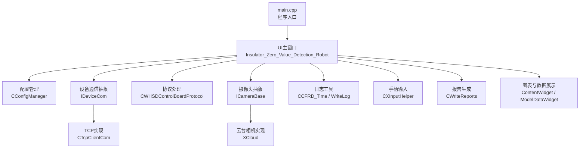
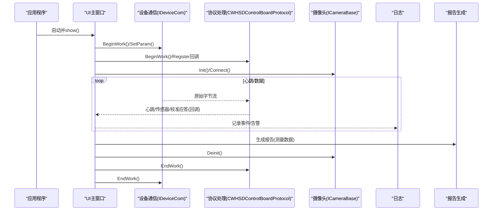
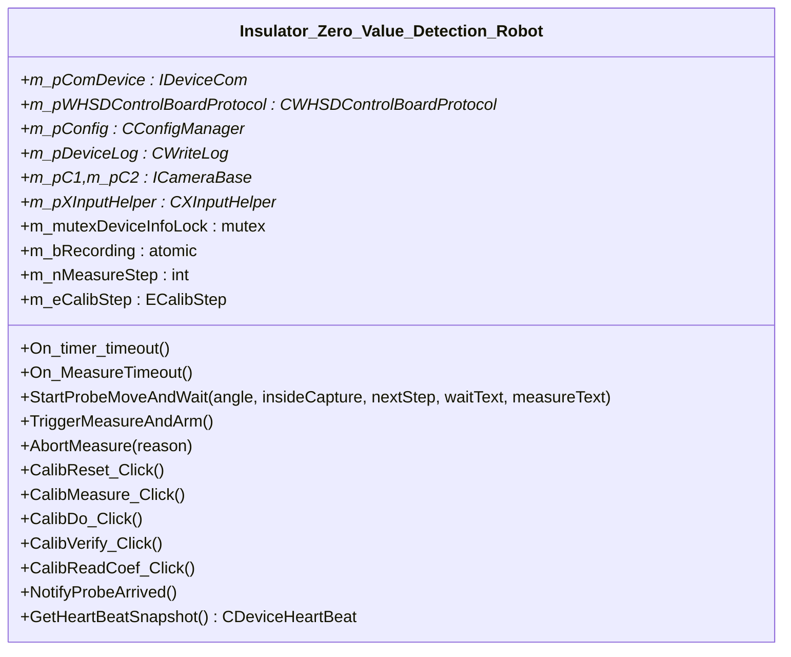
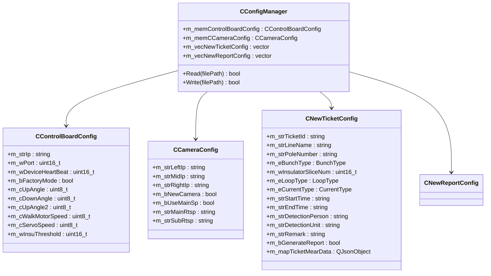
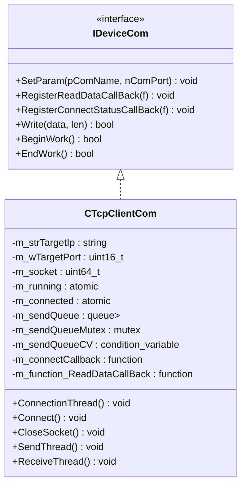
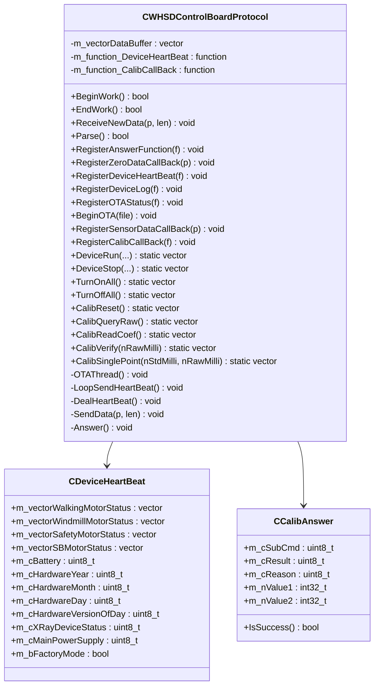
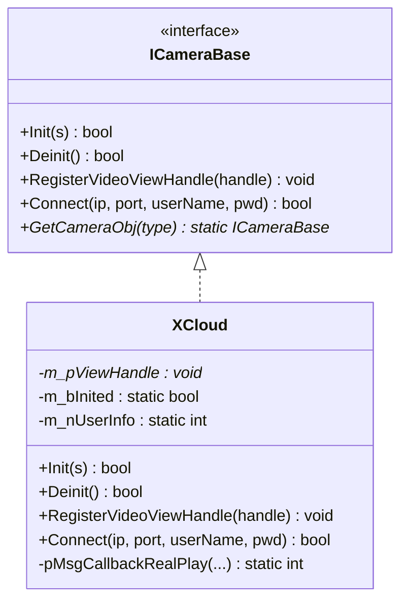
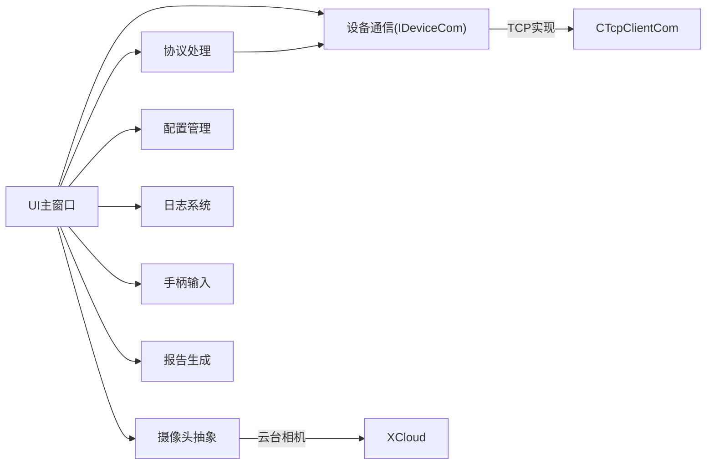

# 模块结构

<cite>
**本文引用的文件**
- [main.cpp](file://Insulator_Zero_Value_Detection_Robot/main.cpp)
- [UI/Insulator_Zero_Value_Detection_Robot.h](file://Insulator_Zero_Value_Detection_Robot/UI/Insulator_Zero_Value_Detection_Robot.h)
- [Config/ConfigManager.h](file://Insulator_Zero_Value_Detection_Robot/Config/ConfigManager.h)
- [DeviceCom/IDeviceCom.h](file://Insulator_Zero_Value_Detection_Robot/DeviceCom/IDeviceCom.h)
- [DeviceCom/TcpClient.h](file://Insulator_Zero_Value_Detection_Robot/DeviceCom/TcpClient.h)
- [Protocol/WHSDControlBoradProtocol.h](file://Insulator_Zero_Value_Detection_Robot/Protocol/WHSDControlBoradProtocol.h)
- [Camera/CameraBase.h](file://Insulator_Zero_Value_Detection_Robot/Camera/CameraBase.h)
- [Camera/XCloud.h](file://Insulator_Zero_Value_Detection_Robot/Camera/XCloud.h)
- [Log/ScanS_FC.h](file://Insulator_Zero_Value_Detection_Robot/Log/ScanS_FC.h)
- [Tools/XInputHelper.h](file://Insulator_Zero_Value_Detection_Robot/Tools/XInputHelper.h)
- [Report/WriteReports.h](file://Insulator_Zero_Value_Detection_Robot/Report/WriteReports.h)
- [UI/contentwidget.h](file://Insulator_Zero_Value_Detection_Robot/UI/contentwidget.h)
- [UI/modeldatawidget.h](file://Insulator_Zero_Value_Detection_Robot/UI/modeldatawidget.h)
</cite>

## 目录
1. [简介](#简介)
2. [项目结构](#项目结构)
3. [核心组件](#核心组件)
4. [架构总览](#架构总览)
5. [详细组件分析](#详细组件分析)
6. [依赖关系分析](#依赖关系分析)
7. [性能与并发特性](#性能与并发特性)
8. [故障排查指南](#故障排查指南)
9. [结论](#结论)
10. [附录：开发最佳实践与注意事项](#附录：开发最佳实践与注意事项)

## 简介
本文件为“绝缘子零值检测机器人V2”的模块结构文档，面向开发者与维护者，系统化说明各模块职责、接口设计、内部结构、生命周期管理、初始化流程、模块间依赖与调用关系，并提供可扩展性与替换机制说明。重点覆盖UI模块、配置管理模块、设备通信模块、协议处理模块、摄像头模块、日志系统、手柄输入、报告生成等。

## 项目结构
项目采用按功能域划分的目录组织方式，核心入口位于 main.cpp，启动Qt应用并创建主窗口对象；UI层通过Qt Widgets构建界面，聚合配置、通信、协议、摄像头、日志、工具等模块，形成“主控窗口 + 多模块协作”的架构。

图示来源
- [main.cpp:11-23](file://Insulator_Zero_Value_Detection_Robot/main.cpp#L11-L23)
- [UI/Insulator_Zero_Value_Detection_Robot.h:26-384](file://Insulator_Zero_Value_Detection_Robot/UI/Insulator_Zero_Value_Detection_Robot.h#L26-L384)
- [Config/ConfigManager.h:185-199](file://Insulator_Zero_Value_Detection_Robot/Config/ConfigManager.h#L185-L199)
- [DeviceCom/IDeviceCom.h:4-15](file://Insulator_Zero_Value_Detection_Robot/DeviceCom/IDeviceCom.h#L4-L15)
- [DeviceCom/TcpClient.h:8-46](file://Insulator_Zero_Value_Detection_Robot/DeviceCom/TcpClient.h#L8-L46)
- [Protocol/WHSDControlBoradProtocol.h:189-356](file://Insulator_Zero_Value_Detection_Robot/Protocol/WHSDControlBoradProtocol.h#L189-L356)
- [Camera/CameraBase.h:5-14](file://Insulator_Zero_Value_Detection_Robot/Camera/CameraBase.h#L5-L14)
- [Camera/XCloud.h:6-33](file://Insulator_Zero_Value_Detection_Robot/Camera/XCloud.h#L6-L33)
- [Log/ScanS_FC.h:20-367](file://Insulator_Zero_Value_Detection_Robot/Log/ScanS_FC.h#L20-L367)
- [Tools/XInputHelper.h:18-47](file://Insulator_Zero_Value_Detection_Robot/Tools/XInputHelper.h#L18-L47)
- [Report/WriteReports.h:24-89](file://Insulator_Zero_Value_Detection_Robot/Report/WriteReports.h#L24-L89)
- [UI/contentwidget.h:12-32](file://Insulator_Zero_Value_Detection_Robot/UI/contentwidget.h#L12-L32)
- [UI/modeldatawidget.h:20-49](file://Insulator_Zero_Value_Detection_Robot/UI/modeldatawidget.h#L20-L49)

章节来源
- [main.cpp:11-23](file://Insulator_Zero_Value_Detection_Robot/main.cpp#L11-L23)

## 核心组件
- UI主窗口（Insulator_Zero_Value_Detection_Robot）
  - 职责：用户交互、业务流程编排（测量、定标、工单/报告）、状态机控制、跨线程信号槽协调、资源生命周期管理。
  - 关键成员：定时器、互斥锁、原子标志、协议实例、通信实例、摄像头实例、日志实例、手柄实例、配置实例、模型数据控件。
- 配置管理（CConfigManager）
  - 职责：读取/写入配置文件，维护控制板参数、相机参数、工单与报告模板配置。
  - 数据结构：控制板配置、相机配置、新工单配置、新报告配置。
- 设备通信（IDeviceCom 及 CTcpClientCom）
  - 职责：抽象设备通信能力，提供连接、读写、回调注册、工作启停；TCP实现包含连接、收发线程、队列与条件变量。
- 协议处理（CWHSDControlBoardProtocol）
  - 职责：解析/封装控制板协议帧，心跳发送与解析，传感器数据回调，校准命令应答回调，OTA状态回调，电机/射线机等控制命令构造。
- 摄像头（ICameraBase 及 XCloud）
  - 职责：抽象摄像头接入，统一Init/Deinit/Connect/视图句柄注册；XCloud为具体云台相机实现。
- 日志系统（ScanS_FC 中的时间/转换工具，以及WriteLog相关）
  - 职责：时间戳、临界区、类型转换、日志写入辅助。
- 手柄输入（CXInputHelper）
  - 职责：轮询手柄状态，标准化扳机/摇杆值，回调通知UI。
- 报告生成（CWriteReports）
  - 职责：基于docx模板填充占位符，自适应表格行，输出检测报告。
- 图表与数据展示（ContentWidget / ModelDataWidget）
  - 职责：通用图表容器与测量数据表格+曲线联动显示。

章节来源
- [UI/Insulator_Zero_Value_Detection_Robot.h:26-384](file://Insulator_Zero_Value_Detection_Robot/UI/Insulator_Zero_Value_Detection_Robot.h#L26-L384)
- [Config/ConfigManager.h:10-199](file://Insulator_Zero_Value_Detection_Robot/Config/ConfigManager.h#L10-L199)
- [DeviceCom/IDeviceCom.h:4-15](file://Insulator_Zero_Value_Detection_Robot/DeviceCom/IDeviceCom.h#L4-L15)
- [DeviceCom/TcpClient.h:8-46](file://Insulator_Zero_Value_Detection_Robot/DeviceCom/TcpClient.h#L8-L46)
- [Protocol/WHSDControlBoradProtocol.h:7-356](file://Insulator_Zero_Value_Detection_Robot/Protocol/WHSDControlBoradProtocol.h#L7-L356)
- [Camera/CameraBase.h:5-14](file://Insulator_Zero_Value_Detection_Robot/Camera/CameraBase.h#L5-L14)
- [Camera/XCloud.h:6-33](file://Insulator_Zero_Value_Detection_Robot/Camera/XCloud.h#L6-L33)
- [Log/ScanS_FC.h:20-367](file://Insulator_Zero_Value_Detection_Robot/Log/ScanS_FC.h#L20-L367)
- [Tools/XInputHelper.h:18-47](file://Insulator_Zero_Value_Detection_Robot/Tools/XInputHelper.h#L18-L47)
- [Report/WriteReports.h:24-89](file://Insulator_Zero_Value_Detection_Robot/Report/WriteReports.h#L24-L89)
- [UI/contentwidget.h:12-32](file://Insulator_Zero_Value_Detection_Robot/UI/contentwidget.h#L12-L32)
- [UI/modeldatawidget.h:20-49](file://Insulator_Zero_Value_Detection_Robot/UI/modeldatawidget.h#L20-L49)

## 架构总览
系统以UI主窗口为调度中心，通过事件驱动与定时器驱动业务流程。设备通信与协议处理解耦，摄像头抽象支持多实现替换，配置集中管理，日志贯穿全链路，报告生成在业务完成后输出。

图示来源
- [main.cpp:11-23](file://Insulator_Zero_Value_Detection_Robot/main.cpp#L11-L23)
- [UI/Insulator_Zero_Value_Detection_Robot.h:142-161](file://Insulator_Zero_Value_Detection_Robot/UI/Insulator_Zero_Value_Detection_Robot.h#L142-L161)
- [Protocol/WHSDControlBoradProtocol.h:192-216](file://Insulator_Zero_Value_Detection_Robot/Protocol/WHSDControlBoradProtocol.h#L192-L216)
- [Camera/CameraBase.h:8-13](file://Insulator_Zero_Value_Detection_Robot/Camera/CameraBase.h#L8-L13)
- [Report/WriteReports.h:32-55](file://Insulator_Zero_Value_Detection_Robot/Report/WriteReports.h#L32-L55)

## 详细组件分析

### UI主窗口模块（Insulator_Zero_Value_Detection_Robot）
- 职责
  - 界面初始化、动作绑定、参数加载、设备连接、测量流程编排、定标流程编排、工单/报告管理、录像与截图、告警面板、状态机推进。
- 关键设计
  - 使用QTimer进行轮询（探针到位、测量超时、输入轮询）。
  - 使用std::mutex与std::atomic保证跨线程安全（心跳快照、录制缓冲、测量步骤、定标标志）。
  - 通过信号槽将协议线程回调切换到UI线程处理（如校准应答、测量结果回报）。
  - 内置测量流程状态机：空闲→等待内测结果→等待外侧结果→结束或异常中止。
  - 内置定标流程状态机：恢复默认→测原始值→下发定标→验证→读回系数/离线抽查。
- 主要成员
  - 通信指针、协议指针、配置指针、日志指针、摄像头指针、手柄指针。
  - 定时器、互斥量、原子标志、状态变量、待执行参数缓存。
  - 图表与数据展示控件、工单/报告对话框。

图示来源
- [UI/Insulator_Zero_Value_Detection_Robot.h:26-384](file://Insulator_Zero_Value_Detection_Robot/UI/Insulator_Zero_Value_Detection_Robot.h#L26-L384)

章节来源
- [UI/Insulator_Zero_Value_Detection_Robot.h:36-127](file://Insulator_Zero_Value_Detection_Robot/UI/Insulator_Zero_Value_Detection_Robot.h#L36-L127)
- [UI/Insulator_Zero_Value_Detection_Robot.h:139-384](file://Insulator_Zero_Value_Detection_Robot/UI/Insulator_Zero_Value_Detection_Robot.h#L139-L384)

### 配置管理模块（CConfigManager）
- 职责
  - 读取/写入配置文件，维护控制板参数（IP、端口、心跳周期、工厂模式、角度、速度、阈值）、相机参数（左右中IP、码流选择）、工单与报告配置。
- 数据结构
  - CControlBoardConfig：控制板网络与运行参数。
  - CCameraConfig：相机IP、码流、新旧相机标记。
  - CNewTicketConfig：工单信息（串数、回路、交直流、片数、人员、单位、时间、备注、测量数据JSON）。
  - CNewReportConfig：报告元信息（编号、单位、人员、地点）。
- 扩展点
  - 新增配置项可在对应结构体中添加字段，并在读写逻辑中适配。

图示来源
- [Config/ConfigManager.h:10-199](file://Insulator_Zero_Value_Detection_Robot/Config/ConfigManager.h#L10-L199)

章节来源
- [Config/ConfigManager.h:10-199](file://Insulator_Zero_Value_Detection_Robot/Config/ConfigManager.h#L10-L199)

### 设备通信模块（IDeviceCom 与 CTcpClientCom）
- 职责
  - 抽象设备通信接口，提供设置参数、注册数据回调、注册连接状态回调、写数据、开始/结束工作。
  - TCP实现包含连接线程、接收线程、发送线程，使用队列与条件变量协调发送，原子变量管理运行与连接状态。
- 关键点
  - 回调函数用于将底层数据上报到上层（协议处理）。
  - 连接状态回调用于UI更新连接指示。
  - 多线程安全：发送队列加锁，条件变量唤醒发送线程。

图示来源
- [DeviceCom/IDeviceCom.h:4-15](file://Insulator_Zero_Value_Detection_Robot/DeviceCom/IDeviceCom.h#L4-L15)
- [DeviceCom/TcpClient.h:8-46](file://Insulator_Zero_Value_Detection_Robot/DeviceCom/TcpClient.h#L8-L46)

章节来源
- [DeviceCom/IDeviceCom.h:4-15](file://Insulator_Zero_Value_Detection_Robot/DeviceCom/IDeviceCom.h#L4-L15)
- [DeviceCom/TcpClient.h:8-46](file://Insulator_Zero_Value_Detection_Robot/DeviceCom/TcpClient.h#L8-L46)

### 协议处理模块（CWHSDControlBoardProtocol）
- 职责
  - 解析设备返回帧，组装控制命令帧；心跳定时发送与解析；传感器数据回调；校准命令应答回调；OTA状态回调；日志回调。
  - 提供静态方法构造常用命令：设备启停、脉冲计数、延时、射线机启停、全部开关、控制板配置、工厂模式、传感器命令、校准系列命令。
- 数据结构
  - CSensorData：传感器索引、命令、值。
  - CCalibAnswer：校准应答（子命令、结果、原因、参数1/2）。
  - CDeviceHeartBeat：设备心跳（电机状态、电池、固件版本、射线机状态、总电源、工厂模式）。
  - CControlBoardProtocolConfig：协议阈值配置（激光距离、角度、电压阈值、运行时间等）。
- 关键点
  - 大端整数处理、报文拼装、回调注册、线程内循环发送心跳、OTA分片传输。

图示来源
- [Protocol/WHSDControlBoradProtocol.h:7-356](file://Insulator_Zero_Value_Detection_Robot/Protocol/WHSDControlBoradProtocol.h#L7-L356)

章节来源
- [Protocol/WHSDControlBoradProtocol.h:189-356](file://Insulator_Zero_Value_Detection_Robot/Protocol/WHSDControlBoradProtocol.h#L189-L356)

### 摄像头模块（ICameraBase 与 XCloud）
- 职责
  - 抽象摄像头接入，统一初始化、反初始化、连接、视频视图句柄注册；XCloud为具体云台相机实现，负责SDK消息回调与播放。
- 关键点
  - 通过GetCameraObj(type)可动态获取不同相机实现，便于替换与扩展。
  - 视图句柄注册用于将视频渲染到UI控件。

图示来源
- [Camera/CameraBase.h:5-14](file://Insulator_Zero_Value_Detection_Robot/Camera/CameraBase.h#L5-L14)
- [Camera/XCloud.h:6-33](file://Insulator_Zero_Value_Detection_Robot/Camera/XCloud.h#L6-L33)

章节来源
- [Camera/CameraBase.h:5-14](file://Insulator_Zero_Value_Detection_Robot/Camera/CameraBase.h#L5-L14)
- [Camera/XCloud.h:6-33](file://Insulator_Zero_Value_Detection_Robot/Camera/XCloud.h#L6-L33)

### 日志系统（ScanS_FC 与 WriteLog）
- 职责
  - 提供时间戳、临界区、类型转换等基础工具；WriteLog用于实际日志落盘与格式化。
- 关键点
  - CCFRD_Time支持毫秒级时间差计算、字符串与SYSTEMTIME互转、计时器起止。
  - CCFRD_CriticalSection提供Windows临界区封装，确保多线程安全。
  - CCFRD_Convert提供数值与字符串转换、时间格式化工具。

章节来源
- [Log/ScanS_FC.h:20-367](file://Insulator_Zero_Value_Detection_Robot/Log/ScanS_FC.h#L20-L367)

### 手柄输入模块（CXInputHelper）
- 职责
  - 轮询手柄状态，标准化扳机与摇杆值，回调通知UI。
- 关键点
  - RegisterControllerStateCallBack用于将手柄状态推送到UI线程处理。
  - NormalizeTrigger/NormalizeThumbstick对原始值归一化。

章节来源
- [Tools/XInputHelper.h:18-47](file://Insulator_Zero_Value_Detection_Robot/Tools/XInputHelper.h#L18-L47)

### 报告生成模块（CWriteReports）
- 职责
  - 基于docx模板填充占位符，生成检测报告；支持测量数据表自适应行数填充。
- 关键点
  - FillDocxTemplate：模板路径、输出路径、键值对映射。
  - FillMearDataReport：根据侧别/相别/方向组织的数据填充表格。
  - 内部XML转义、相邻run合并、document.xml重写、单元格文本设置。

章节来源
- [Report/WriteReports.h:24-89](file://Insulator_Zero_Value_Detection_Robot/Report/WriteReports.h#L24-L89)

### 图表与数据展示（ContentWidget / ModelDataWidget）
- 职责
  - ContentWidget：通用图表容器，提供ChartView管理与默认视图创建。
  - ModelDataWidget：表格与曲线联动，按列头建列、按片数建行，追加/删除测量值并绘制曲线点。
- 关键点
  - setTableLayout：初始化表格布局与曲线轴。
  - appendValue/removeLastValue：实时数据更新与撤销。

章节来源
- [UI/contentwidget.h:12-32](file://Insulator_Zero_Value_Detection_Robot/UI/contentwidget.h#L12-L32)
- [UI/modeldatawidget.h:20-49](file://Insulator_Zero_Value_Detection_Robot/UI/modeldatawidget.h#L20-L49)

## 依赖关系分析
- UI主窗口依赖所有核心模块，作为编排中心。
- 设备通信抽象被UI与协议处理共同使用；TCP实现为具体通信后端。
- 协议处理依赖设备通信进行数据收发，并向UI暴露回调。
- 摄像头抽象被UI使用，XCloud为具体实现。
- 配置管理被UI与协议处理使用，提供运行时参数。
- 日志系统被协议处理与UI使用，记录运行与告警。
- 手柄输入被UI使用，提供外部控制输入。
- 报告生成被UI使用，在测量完成后生成报告。

图示来源
- [UI/Insulator_Zero_Value_Detection_Robot.h:229-235](file://Insulator_Zero_Value_Detection_Robot/UI/Insulator_Zero_Value_Detection_Robot.h#L229-L235)
- [DeviceCom/IDeviceCom.h:4-15](file://Insulator_Zero_Value_Detection_Robot/DeviceCom/IDeviceCom.h#L4-L15)
- [DeviceCom/TcpClient.h:8-46](file://Insulator_Zero_Value_Detection_Robot/DeviceCom/TcpClient.h#L8-L46)
- [Protocol/WHSDControlBoradProtocol.h:189-356](file://Insulator_Zero_Value_Detection_Robot/Protocol/WHSDControlBoradProtocol.h#L189-L356)
- [Camera/CameraBase.h:5-14](file://Insulator_Zero_Value_Detection_Robot/Camera/CameraBase.h#L5-L14)
- [Camera/XCloud.h:6-33](file://Insulator_Zero_Value_Detection_Robot/Camera/XCloud.h#L6-L33)
- [Config/ConfigManager.h:185-199](file://Insulator_Zero_Value_Detection_Robot/Config/ConfigManager.h#L185-L199)
- [Log/ScanS_FC.h:20-367](file://Insulator_Zero_Value_Detection_Robot/Log/ScanS_FC.h#L20-L367)
- [Tools/XInputHelper.h:18-47](file://Insulator_Zero_Value_Detection_Robot/Tools/XInputHelper.h#L18-L47)
- [Report/WriteReports.h:24-89](file://Insulator_Zero_Value_Detection_Robot/Report/WriteReports.h#L24-L89)

## 性能与并发特性
- 多线程通信：TCP客户端使用独立连接、接收、发送线程，通过队列与条件变量避免忙轮询。
- 线程安全：UI中使用互斥锁保护设备信息快照，原子变量保护录制状态与测量标志。
- 定时器驱动：探针到位轮询、测量超时、输入轮询，避免阻塞UI线程。
- 回调切线程：协议回调通过信号槽切换到UI线程处理，防止跨线程直接操作UI。
- 资源复用：录像帧缓存与统一转视频，减少频繁I/O开销。

[本节为通用性能讨论，不直接分析具体文件]

## 故障排查指南
- 连接问题
  - 检查设备通信参数（IP、端口）是否正确，确认BeginWork成功。
  - 观察连接状态回调是否触发，确认CTcpClientCom的连接线程与接收线程运行正常。
- 协议解析失败
  - 核对协议帧格式与大端整数处理，检查ReceiveNewData与Parse流程。
  - 关注校准应答的原因码，定位失败原因（原始值超时、Flash写失败、参数非法等）。
- 摄像头无画面
  - 确认Init与Connect成功，视图句柄已正确注册。
  - 检查XCloud的消息回调是否触发，确认SDK初始化全局状态。
- 日志缺失
  - 确认RegisterDeviceLog已注册，WriteLog写入路径存在且可写。
  - 使用CCFRD_Time生成时间戳，核对日志时间顺序。
- 手柄无响应
  - 检查BeginWork是否调用，RegisterControllerStateCallBack是否注册。
  - 确认Normalized扳机/摇杆值范围合理。

章节来源
- [DeviceCom/TcpClient.h:18-46](file://Insulator_Zero_Value_Detection_Robot/DeviceCom/TcpClient.h#L18-L46)
- [Protocol/WHSDControlBoradProtocol.h:21-52](file://Insulator_Zero_Value_Detection_Robot/Protocol/WHSDControlBoradProtocol.h#L21-L52)
- [Camera/XCloud.h:16-33](file://Insulator_Zero_Value_Detection_Robot/Camera/XCloud.h#L16-L33)
- [Log/ScanS_FC.h:132-367](file://Insulator_Zero_Value_Detection_Robot/Log/ScanS_FC.h#L132-L367)
- [Tools/XInputHelper.h:18-47](file://Insulator_Zero_Value_Detection_Robot/Tools/XInputHelper.h#L18-L47)

## 结论
本项目采用清晰的模块化设计，UI主窗口作为调度中心，设备通信与协议处理解耦，摄像头抽象支持多实现替换，配置集中管理，日志贯穿全链路，报告生成在业务完成后输出。通过定时器与信号槽实现异步与线程安全，整体架构具备良好的可扩展性与可维护性。

[本节为总结性内容，不直接分析具体文件]

## 附录：开发最佳实践与注意事项
- 模块边界清晰
  - 通过IDeviceCom与ICameraBase抽象接口隔离具体实现，新增设备或协议时优先扩展接口而非修改UI。
- 线程安全
  - 跨线程共享数据使用互斥锁或原子变量；UI更新仅在UI线程进行，协议回调通过信号槽切换。
- 错误处理
  - 协议回调中区分成功与失败原因，及时记录日志并向上层反馈；UI层对异常进行兜底处理（如超时、断线）。
- 配置管理
  - 新增配置项需同步更新读写逻辑与UI展示；对敏感参数（IP、密码）进行校验与加密存储。
- 日志与可观测性
  - 关键流程（连接、命令发送、解析、异常）均需记录日志；使用时间戳与上下文信息便于追踪。
- 测试与验证
  - 针对协议命令编写单元测试；对测量流程与定标流程进行端到端验证；对摄像头与手柄进行集成测试。
- 扩展与替换
  - 新增摄像头实现只需继承ICameraBase并实现接口；新增通信后端只需实现IDeviceCom。
  - 报告模板可通过更换docx模板与占位符快速适配新需求。

[本节为通用指导，不直接分析具体文件]