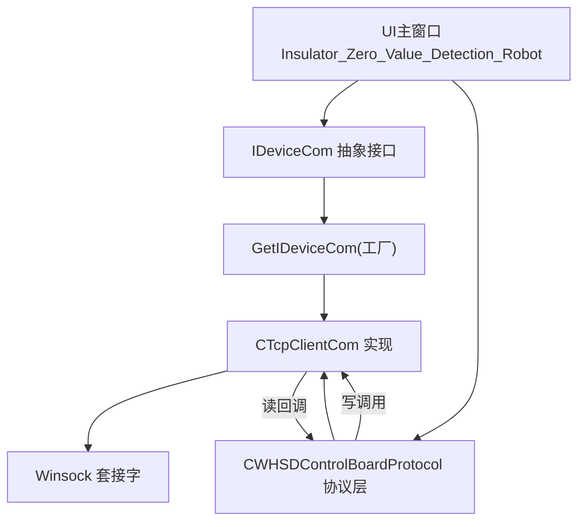
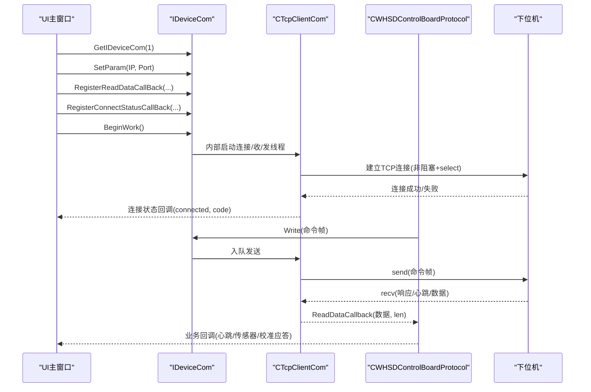
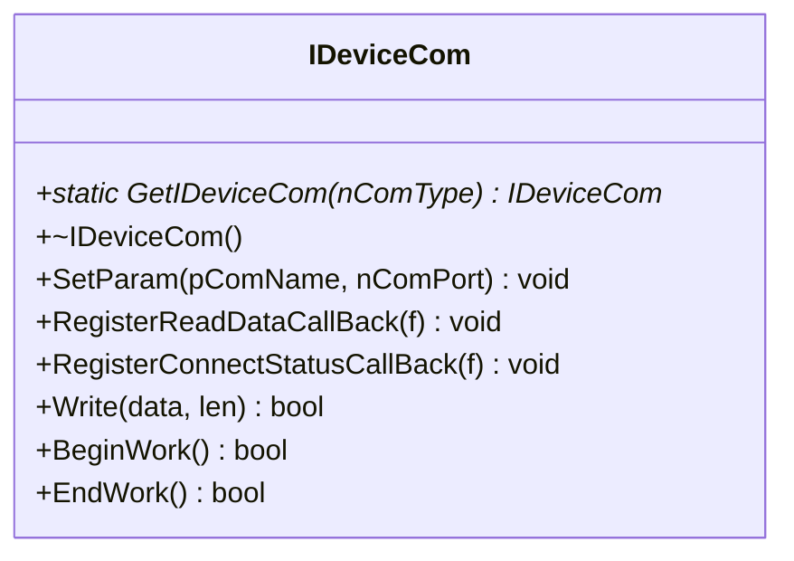
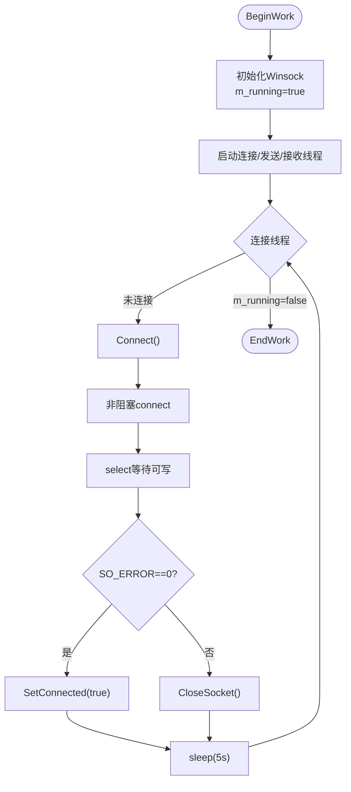
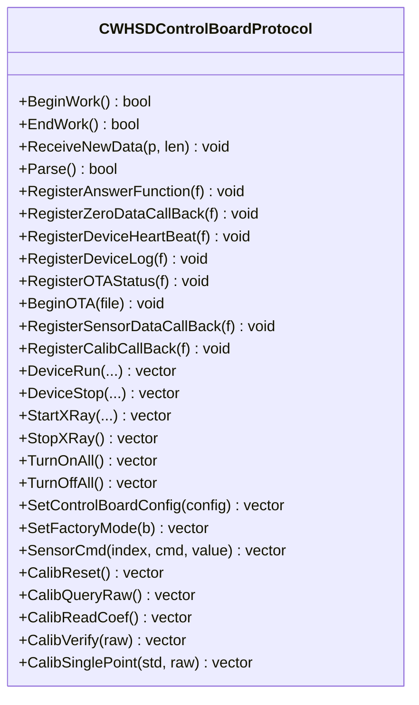
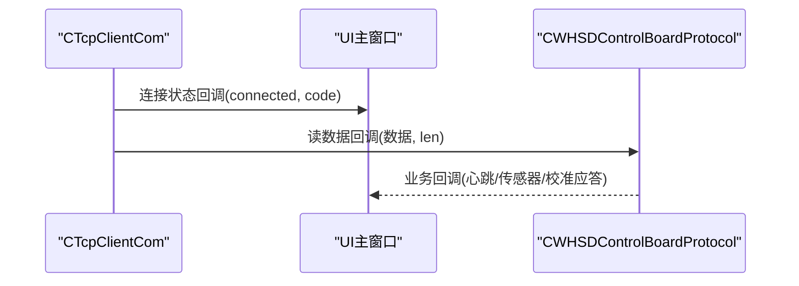
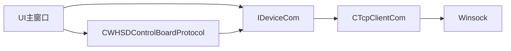

# 设备通信模块

<cite>
**本文引用的文件**
- [IDeviceCom.h](file://Insulator_Zero_Value_Detection_Robot/DeviceCom/IDeviceCom.h)
- [IDeviceCom.cpp](file://Insulator_Zero_Value_Detection_Robot/DeviceCom/IDeviceCom.cpp)
- [TcpClient.h](file://Insulator_Zero_Value_Detection_Robot/DeviceCom/TcpClient.h)
- [TcpClient.cpp](file://Insulator_Zero_Value_Detection_Robot/DeviceCom/TcpClient.cpp)
- [WHSDControlBoradProtocol.h](file://Insulator_Zero_Value_Detection_Robot/Protocol/WHSDControlBoradProtocol.h)
- [Insulator_Zero_Value_Detection_Robot.h](file://Insulator_Zero_Value_Detection_Robot/UI/Insulator_Zero_Value_Detection_Robot.h)
- [Insulator_Zero_Value_Detection_Robot.cpp](file://Insulator_Zero_Value_Detection_Robot/UI/Insulator_Zero_Value_Detection_Robot.cpp)
</cite>

## 目录
1. [简介](#简介)
2. [项目结构](#项目结构)
3. [核心组件](#核心组件)
4. [架构总览](#架构总览)
5. [详细组件分析](#详细组件分析)
6. [依赖关系分析](#依赖关系分析)
7. [性能与可靠性](#性能与可靠性)
8. [故障排查指南](#故障排查指南)
9. [结论](#结论)
10. [附录：扩展与调试](#附录：扩展与调试)

## 简介
本模块为绝缘子零值检测机器人V2的设备通信层，提供统一的设备通信抽象接口与TCP客户端实现，负责与下位机控制板进行可靠的数据收发、连接管理与状态通知。上层协议层通过回调机制接收数据并解析，UI层通过连接状态回调感知通信变化，从而实现“连接管理—数据传输—协议解析—业务处理”的完整链路。

## 项目结构
设备通信相关代码位于 DeviceCom 目录，包含统一抽象接口 IDeviceCom 及其工厂方法，以及基于 TCP 的具体实现 CTcpClientCom。协议封装位于 Protocol 目录，UI 层在初始化时装配通信与协议对象，完成回调绑定与工作启动。

图表来源
- [Insulator_Zero_Value_Detection_Robot.cpp:265-290](file://Insulator_Zero_Value_Detection_Robot/UI/Insulator_Zero_Value_Detection_Robot.cpp#L265-L290)
- [IDeviceCom.cpp:4-12](file://Insulator_Zero_Value_Detection_Robot/DeviceCom/IDeviceCom.cpp#L4-L12)
- [TcpClient.cpp:59-87](file://Insulator_Zero_Value_Detection_Robot/DeviceCom/TcpClient.cpp#L59-L87)

章节来源
- [Insulator_Zero_Value_Detection_Robot.cpp:265-290](file://Insulator_Zero_Value_Detection_Robot/UI/Insulator_Zero_Value_Detection_Robot.cpp#L265-L290)
- [IDeviceCom.h:4-15](file://Insulator_Zero_Value_Detection_Robot/DeviceCom/IDeviceCom.h#L4-L15)
- [IDeviceCom.cpp:4-12](file://Insulator_Zero_Value_Detection_Robot/DeviceCom/IDeviceCom.cpp#L4-L12)
- [TcpClient.h:8-46](file://Insulator_Zero_Value_Detection_Robot/DeviceCom/TcpClient.h#L8-L46)
- [TcpClient.cpp:59-87](file://Insulator_Zero_Value_Detection_Robot/DeviceCom/TcpClient.cpp#L59-L87)

## 核心组件
- IDeviceCom：定义设备通信的统一抽象接口，包括参数设置、读写、生命周期管理、回调注册等。
- CTcpClientCom：基于 Windows Winsock 的 TCP 客户端实现，提供连接管理、发送队列、接收线程、连接状态监控与重连机制。
- CWHSDControlBoardProtocol：协议封装层，负责将原始字节流解析为业务对象（心跳、传感器数据、校准应答等），并提供命令构造与发送能力。

章节来源
- [IDeviceCom.h:4-15](file://Insulator_Zero_Value_Detection_Robot/DeviceCom/IDeviceCom.h#L4-L15)
- [TcpClient.h:8-46](file://Insulator_Zero_Value_Detection_Robot/DeviceCom/TcpClient.h#L8-L46)
- [WHSDControlBoradProtocol.h:189-356](file://Insulator_Zero_Value_Detection_Robot/Protocol/WHSDControlBoradProtocol.h#L189-L356)

## 架构总览
整体采用“抽象接口 + 具体实现 + 协议封装 + UI装配”的分层设计：
- UI 层通过工厂获取 IDeviceCom 实例，配置目标IP与端口，注册读数据回调和连接状态回调。
- 协议层通过 RegisterAnswerFunction 将 Write 绑定到 IDeviceCom::Write，从而将协议命令下发到底层传输。
- 底层 CTcpClientCom 维护三个线程：连接线程（负责建立与重连）、发送线程（队列化发送）、接收线程（非阻塞读取并回调）。
- 连接状态变化通过回调通知 UI，用于界面提示与流程控制。

图表来源
- [Insulator_Zero_Value_Detection_Robot.cpp:265-290](file://Insulator_Zero_Value_Detection_Robot/UI/Insulator_Zero_Value_Detection_Robot.cpp#L265-L290)
- [TcpClient.cpp:59-87](file://Insulator_Zero_Value_Detection_Robot/DeviceCom/TcpClient.cpp#L59-L87)
- [TcpClient.cpp:163-236](file://Insulator_Zero_Value_Detection_Robot/DeviceCom/TcpClient.cpp#L163-L236)
- [TcpClient.cpp:238-382](file://Insulator_Zero_Value_Detection_Robot/DeviceCom/TcpClient.cpp#L238-L382)

## 详细组件分析

### IDeviceCom 抽象接口设计与实现原理
- 统一抽象：通过纯虚类定义 SetParam、RegisterReadDataCallBack、RegisterConnectStatusCallBack、Write、BeginWork、EndWork 等方法，屏蔽不同传输介质差异。
- 工厂模式：GetIDeviceCom 根据类型返回具体实现（当前支持 TCP）。
- 回调机制：读数据回调与连接状态回调使用 std::function，便于上层灵活绑定处理逻辑。
- 生命周期：BeginWork/EndWork 管理资源初始化与清理，确保多线程安全。

图表来源
- [IDeviceCom.h:4-15](file://Insulator_Zero_Value_Detection_Robot/DeviceCom/IDeviceCom.h#L4-L15)
- [IDeviceCom.cpp:4-12](file://Insulator_Zero_Value_Detection_Robot/DeviceCom/IDeviceCom.cpp#L4-L12)

章节来源
- [IDeviceCom.h:4-15](file://Insulator_Zero_Value_Detection_Robot/DeviceCom/IDeviceCom.h#L4-L15)
- [IDeviceCom.cpp:4-12](file://Insulator_Zero_Value_Detection_Robot/DeviceCom/IDeviceCom.cpp#L4-L12)

### CTcpClientCom 的具体实现
- 网络连接建立：
  - 使用 Winsock 创建 SOCK_STREAM 套接字，设置为非阻塞模式。
  - 通过 connect 发起连接，若返回 WSAEWOULDBLOCK，则使用 select 等待可写事件，并通过 getsockopt 检查 SO_ERROR 判断连接是否成功。
  - 连接成功后设置 m_connected=true 并触发连接状态回调。
- 数据发送：
  - Write 将数据拷贝到发送队列，通过条件变量唤醒发送线程。
  - 发送线程循环从队列取数据并调用 send；若发生错误（非 WSAEWOULDBLOCK/WSAEINTR）则置连接为断开。
- 数据接收：
  - 接收线程使用 select 监听可读事件，超时时间为1秒；收到数据后调用读数据回调。
  - 若 recv 返回0或错误，则置连接为断开。
- 连接状态监控与重连：
  - 连接线程周期性尝试 Connect；未连接时每隔固定时间重试（当前实现为5秒间隔）。
  - 关闭套接字时调用 CloseSocket，重置连接状态并触发回调。
- 线程与同步：
  - 使用 std::thread 管理连接、发送、接收线程。
  - 使用 mutex 与 condition_variable 保护发送队列。
  - 使用 atomic<bool> 表示运行与连接状态，保证跨线程可见性。

图表来源
- [TcpClient.cpp:59-87](file://Insulator_Zero_Value_Detection_Robot/DeviceCom/TcpClient.cpp#L59-L87)
- [TcpClient.cpp:123-135](file://Insulator_Zero_Value_Detection_Robot/DeviceCom/TcpClient.cpp#L123-L135)
- [TcpClient.cpp:163-236](file://Insulator_Zero_Value_Detection_Robot/DeviceCom/TcpClient.cpp#L163-L236)
- [TcpClient.cpp:89-121](file://Insulator_Zero_Value_Detection_Robot/DeviceCom/TcpClient.cpp#L89-L121)

章节来源
- [TcpClient.h:8-46](file://Insulator_Zero_Value_Detection_Robot/DeviceCom/TcpClient.h#L8-L46)
- [TcpClient.cpp:21-57](file://Insulator_Zero_Value_Detection_Robot/DeviceCom/TcpClient.cpp#L21-L57)
- [TcpClient.cpp:59-121](file://Insulator_Zero_Value_Detection_Robot/DeviceCom/TcpClient.cpp#L59-L121)
- [TcpClient.cpp:123-236](file://Insulator_Zero_Value_Detection_Robot/DeviceCom/TcpClient.cpp#L123-L236)
- [TcpClient.cpp:238-382](file://Insulator_Zero_Value_Detection_Robot/DeviceCom/TcpClient.cpp#L238-L382)

### 心跳机制与协议封装
- 心跳由协议层定时发送，并在收到设备心跳时更新本地状态对象（电机状态、电池、固件信息等）。
- 协议层提供多种命令构造方法（如设备启停、X射线控制、传感器命令、校准命令等），并通过 RegisterAnswerFunction 将 Write 绑定到 IDeviceCom。
- 协议层还暴露多个回调：设备日志、OTA状态、传感器数据、校准应答、零点数据等，供上层处理。

图表来源
- [WHSDControlBoradProtocol.h:189-356](file://Insulator_Zero_Value_Detection_Robot/Protocol/WHSDControlBoradProtocol.h#L189-L356)

章节来源
- [WHSDControlBoradProtocol.h:189-356](file://Insulator_Zero_Value_Detection_Robot/Protocol/WHSDControlBoradProtocol.h#L189-L356)
- [Insulator_Zero_Value_Detection_Robot.cpp:265-290](file://Insulator_Zero_Value_Detection_Robot/UI/Insulator_Zero_Value_Detection_Robot.cpp#L265-L290)

### 回调机制与异步通知
- 读数据回调：CTcpClientCom::ReceiveThread 收到数据后调用注册的函数，将原始字节流交给协议层解析。
- 连接状态回调：当连接状态变化时，CTcpClientCom::SetConnected 调用注册的函数，通知上层应用（UI）进行界面更新或流程控制。
- 协议回调：协议层解析完成后，通过各自回调将业务数据（心跳、传感器、校准应答等）推送给上层。

图表来源
- [TcpClient.cpp:138-150](file://Insulator_Zero_Value_Detection_Robot/DeviceCom/TcpClient.cpp#L138-L150)
- [TcpClient.cpp:302-382](file://Insulator_Zero_Value_Detection_Robot/DeviceCom/TcpClient.cpp#L302-L382)
- [Insulator_Zero_Value_Detection_Robot.cpp:265-290](file://Insulator_Zero_Value_Detection_Robot/UI/Insulator_Zero_Value_Detection_Robot.cpp#L265-L290)

章节来源
- [TcpClient.cpp:138-150](file://Insulator_Zero_Value_Detection_Robot/DeviceCom/TcpClient.cpp#L138-L150)
- [TcpClient.cpp:302-382](file://Insulator_Zero_Value_Detection_Robot/DeviceCom/TcpClient.cpp#L302-L382)
- [Insulator_Zero_Value_Detection_Robot.cpp:265-290](file://Insulator_Zero_Value_Detection_Robot/UI/Insulator_Zero_Value_Detection_Robot.cpp#L265-L290)

## 依赖关系分析
- UI 依赖 IDeviceCom 抽象接口，通过工厂获取具体实现。
- 协议层依赖 IDeviceCom::Write 进行命令下发，依赖读数据回调接收响应。
- CTcpClientCom 依赖 Winsock API 进行网络操作，使用标准库线程与同步原语。

图表来源
- [Insulator_Zero_Value_Detection_Robot.cpp:265-290](file://Insulator_Zero_Value_Detection_Robot/UI/Insulator_Zero_Value_Detection_Robot.cpp#L265-L290)
- [IDeviceCom.cpp:4-12](file://Insulator_Zero_Value_Detection_Robot/DeviceCom/IDeviceCom.cpp#L4-L12)
- [TcpClient.cpp:1-19](file://Insulator_Zero_Value_Detection_Robot/DeviceCom/TcpClient.cpp#L1-L19)

章节来源
- [Insulator_Zero_Value_Detection_Robot.cpp:265-290](file://Insulator_Zero_Value_Detection_Robot/UI/Insulator_Zero_Value_Detection_Robot.cpp#L265-L290)
- [IDeviceCom.cpp:4-12](file://Insulator_Zero_Value_Detection_Robot/DeviceCom/IDeviceCom.cpp#L4-L12)
- [TcpClient.cpp:1-19](file://Insulator_Zero_Value_Detection_Robot/DeviceCom/TcpClient.cpp#L1-L19)

## 性能与可靠性
- 非阻塞I/O：连接与接收均使用非阻塞模式配合 select，避免阻塞主线程，提高响应性。
- 发送队列：通过队列缓冲发送数据，降低瞬时拥塞导致的丢包风险。
- 重连策略：连接线程周期性尝试重连，提升在网络波动环境下的鲁棒性。
- 线程安全：使用原子变量与互斥锁保护共享状态与队列，避免竞态条件。
- 超时处理：接收线程设置1秒超时，防止长时间无数据导致死等；连接选择超时5秒，避免卡死。

[本节为通用指导，不直接分析具体文件]

## 故障排查指南
- 无法连接：
  - 检查 IP 与端口是否正确配置。
  - 查看连接状态回调返回值，确认是否进入重连循环。
  - 确认防火墙或网络设备是否允许该端口通信。
- 发送失败：
  - 检查 m_running 与 m_connected 状态，确保 BeginWork 已调用且连接成功。
  - 观察发送线程日志（调试模式下输出 HEX），定位发送错误码。
- 接收异常：
  - 检查 select 返回值与错误码，确认是否存在网络中断。
  - 确认协议层是否正确解析数据，必要时增加日志输出。
- 资源泄漏：
  - 确保 EndWork 被调用，释放 Winsock 资源并等待线程结束。

章节来源
- [TcpClient.cpp:59-121](file://Insulator_Zero_Value_Detection_Robot/DeviceCom/TcpClient.cpp#L59-L121)
- [TcpClient.cpp:163-236](file://Insulator_Zero_Value_Detection_Robot/DeviceCom/TcpClient.cpp#L163-L236)
- [TcpClient.cpp:238-382](file://Insulator_Zero_Value_Detection_Robot/DeviceCom/TcpClient.cpp#L238-L382)

## 结论
本通信模块通过清晰的抽象接口与可靠的 TCP 实现，提供了稳定的设备通信能力。结合协议层的丰富回调与命令封装，上层应用可以专注于业务逻辑，而无需关心底层网络细节。重连机制、非阻塞I/O与线程安全设计确保了系统在复杂网络环境下的稳定性与可扩展性。

[本节为总结性内容，不直接分析具体文件]

## 附录：扩展与调试

### 新通信方式扩展指南
- 新增通信类型：
  - 在 IDeviceCom 中扩展 GetIDeviceCom 的类型分支，返回新的实现对象。
  - 实现新的通信类，继承 IDeviceCom，实现 SetParam、RegisterReadDataCallBack、RegisterConnectStatusCallBack、Write、BeginWork、EndWork。
  - 在 UI 层通过 GetIDeviceCom 获取新实现，并完成回调绑定与启动。
- 注意事项：
  - 保持接口一致性，确保回调签名与行为符合预期。
  - 注意线程安全与资源管理，避免内存泄漏与死锁。
  - 在 BeginWork/EndWork 中正确初始化与清理外部资源（如串口、UDP、MQTT等）。

章节来源
- [IDeviceCom.cpp:4-12](file://Insulator_Zero_Value_Detection_Robot/DeviceCom/IDeviceCom.cpp#L4-L12)
- [Insulator_Zero_Value_Detection_Robot.cpp:265-290](file://Insulator_Zero_Value_Detection_Robot/UI/Insulator_Zero_Value_Detection_Robot.cpp#L265-L290)

### 调试方法
- 启用调试日志：
  - 在调试模式下，CTcpClientCom 会输出发送与接收数据的 HEX 格式，便于与协议文档逐字节比对。
- 断点与日志：
  - 在连接、发送、接收关键路径设置断点，观察状态变化。
  - 在协议层回调中记录业务数据，辅助定位解析问题。
- 网络抓包：
  - 使用 Wireshark 等工具抓取 TCP 流量，验证报文结构与时序。

章节来源
- [TcpClient.cpp:267-283](file://Insulator_Zero_Value_Detection_Robot/DeviceCom/TcpClient.cpp#L267-L283)
- [TcpClient.cpp:331-347](file://Insulator_Zero_Value_Detection_Robot/DeviceCom/TcpClient.cpp#L331-L347)