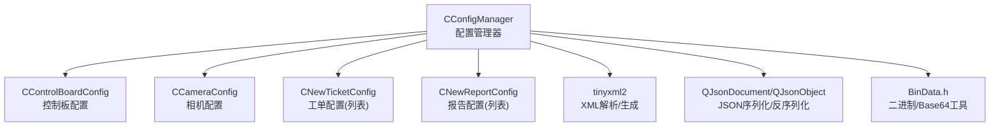
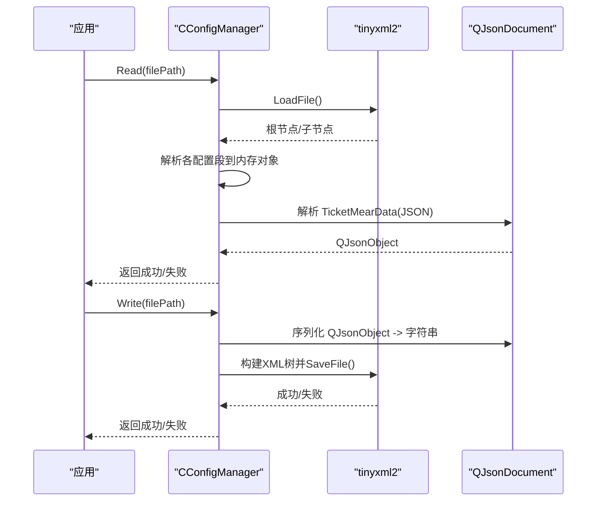
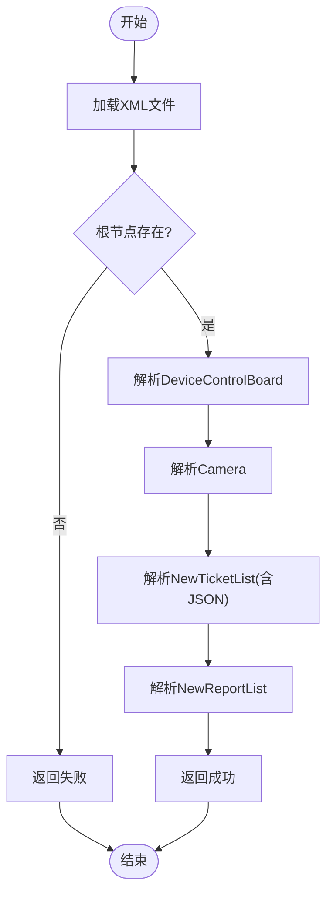
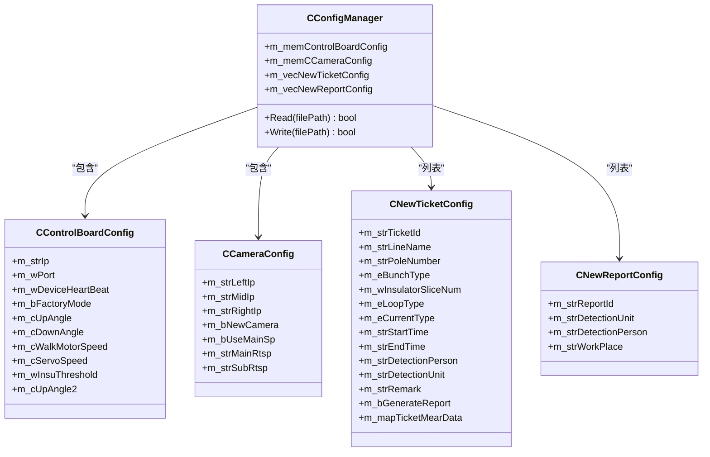

# 配置管理模块

<cite>
**本文引用的文件**
- [ConfigManager.h](file://Insulator_Zero_Value_Detection_Robot/Config/ConfigManager.h)
- [ConfigManager.cpp](file://Insulator_Zero_Value_Detection_Robot/Config/ConfigManager.cpp)
- [BinData.h](file://Insulator_Zero_Value_Detection_Robot/Tools/BinData.h)
- [document.xml](file://Insulator_Zero_Value_Detection_Robot/Report/document.xml)
</cite>

## 目录
1. [简介](#简介)
2. [项目结构](#项目结构)
3. [核心组件](#核心组件)
4. [架构总览](#架构总览)
5. [详细组件分析](#详细组件分析)
6. [依赖关系分析](#依赖关系分析)
7. [性能与可靠性](#性能与可靠性)
8. [故障排查指南](#故障排查指南)
9. [结论](#结论)
10. [附录：配置文件示例与最佳实践](#附录：配置文件示例与最佳实践)

## 简介
本模块为绝缘子零值检测机器人V2的配置管理子系统，核心由 CConfigManager 类实现。它负责从 XML 配置文件读取并写入设备连接参数、系统设置、用户偏好（如报告与工单模板）等配置项；提供默认值初始化、JSON 测量数据序列化/反序列化、以及基于 tinyxml2 的持久化存储。该模块同时暴露了用于扩展的新增配置类型接口，便于后续功能扩展。

## 项目结构
配置管理相关代码集中在 Config 目录，使用 Qt 容器与 JSON 库进行数据结构组织与复杂字段处理，底层通过 tinyxml2 完成 XML 读写。辅助工具 BinData.h 提供了二进制与 Base64 转换能力，可用于未来扩展更复杂的配置存储方案。

图表来源
- [ConfigManager.h:10-199](file://Insulator_Zero_Value_Detection_Robot/Config/ConfigManager.h#L10-L199)
- [ConfigManager.cpp:1-452](file://Insulator_Zero_Value_Detection_Robot/Config/ConfigManager.cpp#L1-L452)
- [BinData.h:1-73](file://Insulator_Zero_Value_Detection_Robot/Tools/BinData.h#L1-L73)

章节来源
- [ConfigManager.h:10-199](file://Insulator_Zero_Value_Detection_Robot/Config/ConfigManager.h#L10-L199)
- [ConfigManager.cpp:1-452](file://Insulator_Zero_Value_Detection_Robot/Config/ConfigManager.cpp#L1-L452)

## 核心组件
- CConfigManager：配置管理器，提供 Read(filePath)/Write(filePath) 两个核心接口，维护内存中的配置对象集合。
- CControlBoardConfig：设备控制板连接与运行参数（IP、端口、心跳、工厂模式、角度、速度、阈值等）。
- CCameraConfig：多路相机配置（左右中 IP、是否新款相机、主/子码流开关与 RTSP 地址）。
- CNewTicketConfig：工单配置（线路、杆塔、串数、回路、交直流类型、时间、人员、备注、测量数据 JSON 等），包含枚举与字符串互转方法。
- CNewReportConfig：报告配置（报告编号、检测单位、检测人员、作业地点）。
- 辅助工具：BinData.h 提供二进制与 Base64 转换能力，便于在文本型配置中存储复杂数据。

章节来源
- [ConfigManager.h:10-199](file://Insulator_Zero_Value_Detection_Robot/Config/ConfigManager.h#L10-L199)
- [ConfigManager.cpp:8-14](file://Insulator_Zero_Value_Detection_Robot/Config/ConfigManager.cpp#L8-L14)
- [BinData.h:1-73](file://Insulator_Zero_Value_Detection_Robot/Tools/BinData.h#L1-L73)

## 架构总览
配置管理采用“内存模型 + XML 持久化”的架构：
- 启动时调用 Read 将 XML 解析为内存对象；运行时修改内存对象；退出或保存时调用 Write 写回 XML。
- 复杂数据（如测量结果）以 JSON 文本形式嵌入 XML 节点，利用 QJsonDocument 进行序列化/反序列化。
- 支持枚举与中文显示名之间的双向映射，保证配置可读性与程序易用性。

图表来源
- [ConfigManager.cpp:16-257](file://Insulator_Zero_Value_Detection_Robot/Config/ConfigManager.cpp#L16-L257)
- [ConfigManager.cpp:259-452](file://Insulator_Zero_Value_Detection_Robot/Config/ConfigManager.cpp#L259-L452)

## 详细组件分析

### CConfigManager：配置读写与生命周期
- 职责：封装 XML 文件的读取与写入，维护四类配置对象的内存视图。
- 关键流程：
  - Read：加载 XML，校验根节点与必要子节点，逐项解析到内存对象；对 TicketMearData 字段进行 JSON 解析。
  - Write：构建 XML 文档，按顺序写入 DeviceControlBoard、Camera、NewTicketList、NewReportList 四个区块；将 QJsonObject 序列化为紧凑 JSON 字符串后写入。
- 错误处理：
  - 文件加载失败、根节点缺失、必要子节点缺失均返回 false。
  - 写入失败时返回 false，可结合日志记录具体错误。
- 默认值：
  - CControlBoardConfig 构造函数中设置了默认心跳值等，避免未配置时的空值问题。

图表来源
- [ConfigManager.cpp:16-257](file://Insulator_Zero_Value_Detection_Robot/Config/ConfigManager.cpp#L16-L257)

章节来源
- [ConfigManager.cpp:16-257](file://Insulator_Zero_Value_Detection_Robot/Config/ConfigManager.cpp#L16-L257)
- [ConfigManager.cpp:259-452](file://Insulator_Zero_Value_Detection_Robot/Config/ConfigManager.cpp#L259-L452)
- [ConfigManager.h:185-199](file://Insulator_Zero_Value_Detection_Robot/Config/ConfigManager.h#L185-L199)

### CControlBoardConfig：设备控制板配置
- 字段说明：
  - 网络与心跳：IP、端口、心跳间隔。
  - 运行模式：工厂模式开关。
  - 机械与运动：上下角度、行走电机速度、舵机速度、第二探针角度。
  - 阈值：绝缘阈值。
- 默认值：心跳默认值在构造函数中设定，确保无配置时仍具备合理行为。

章节来源
- [ConfigManager.h:10-24](file://Insulator_Zero_Value_Detection_Robot/Config/ConfigManager.h#L10-L24)
- [ConfigManager.cpp:8-14](file://Insulator_Zero_Value_Detection_Robot/Config/ConfigManager.cpp#L8-L14)
- [ConfigManager.cpp:27-82](file://Insulator_Zero_Value_Detection_Robot/Config/ConfigManager.cpp#L27-L82)
- [ConfigManager.cpp:269-313](file://Insulator_Zero_Value_Detection_Robot/Config/ConfigManager.cpp#L269-L313)

### CCameraConfig：相机配置
- 字段说明：
  - 三相机 IP：左、中、右。
  - 相机特性：是否新款相机、是否使用主码流。
  - 码流地址：主码流与子码流 RTSP 地址。
- 读写：对应 Camera 节点下的 Left/Mid/Right/NewCamera/UseMainSp/MainRtsp/SubRtsp。

章节来源
- [ConfigManager.h:26-37](file://Insulator_Zero_Value_Detection_Robot/Config/ConfigManager.h#L26-L37)
- [ConfigManager.cpp:85-131](file://Insulator_Zero_Value_Detection_Robot/Config/ConfigManager.cpp#L85-L131)
- [ConfigManager.cpp:315-347](file://Insulator_Zero_Value_Detection_Robot/Config/ConfigManager.cpp#L315-L347)

### CNewTicketConfig：工单配置与枚举映射
- 字段说明：
  - 标识与基本信息：工单ID、线路名称、杆塔号、串数、回路数、交直流类型、时间、人员、单位、备注。
  - 测量数据：以 QJsonObject 存储，键为侧别与相别/方向，值为测量数组。
- 枚举与映射：
  - 串数类型（单联/双联）、回路类型（同塔单回/双回/四回）、电流类型（交流/直流）。
  - 提供静态方法实现枚举与中文显示名的双向转换，增强配置可读性。
- JSON 处理：
  - 读取时将 TicketMearData 节点内容作为 JSON 文本解析为 QJsonObject。
  - 写入时将 QJsonObject 紧凑序列化为 JSON 字符串写入 XML。

章节来源
- [ConfigManager.h:52-183](file://Insulator_Zero_Value_Detection_Robot/Config/ConfigManager.h#L52-L183)
- [ConfigManager.cpp:133-217](file://Insulator_Zero_Value_Detection_Robot/Config/ConfigManager.cpp#L133-L217)
- [ConfigManager.cpp:349-414](file://Insulator_Zero_Value_Detection_Robot/Config/ConfigManager.cpp#L349-L414)

### CNewReportConfig：报告配置
- 字段说明：报告编号、检测单位、检测人员、作业地点。
- 读写：对应 NewReportList 下的 Size 节点集合，每个 Size 包含 ReportId、WorkPlace、DetectionPerson、DetectionUnit。

章节来源
- [ConfigManager.h:39-50](file://Insulator_Zero_Value_Detection_Robot/Config/ConfigManager.h#L39-L50)
- [ConfigManager.cpp:220-255](file://Insulator_Zero_Value_Detection_Robot/Config/ConfigManager.cpp#L220-L255)
- [ConfigManager.cpp:416-443](file://Insulator_Zero_Value_Detection_Robot/Config/ConfigManager.cpp#L416-L443)

### 配置验证机制与错误处理策略
- 文件级验证：
  - XML 加载失败直接返回 false。
  - 根节点或关键子节点缺失返回 false，防止部分配置导致的不一致状态。
- 字段级验证：
  - 数值字段通过 QueryIntText 安全转换，失败则跳过赋值，保留默认或上次有效值。
  - 布尔字段通过整型比较判断，兼容 0/1 表示。
- JSON 验证：
  - 使用 QJsonParseError 检查解析错误，仅在成功且为对象时更新测量数据。
- 写入保护：
  - 写入失败返回 false，建议上层捕获并记录日志，必要时回滚或提示用户。

章节来源
- [ConfigManager.cpp:16-257](file://Insulator_Zero_Value_Detection_Robot/Config/ConfigManager.cpp#L16-L257)
- [ConfigManager.cpp:259-452](file://Insulator_Zero_Value_Detection_Robot/Config/ConfigManager.cpp#L259-L452)

## 依赖关系分析
- 外部库：
  - tinyxml2：XML 解析与生成。
  - Qt JSON：QJsonDocument/QJsonObject 用于复杂数据的序列化/反序列化。
  - Qt 元类型：Q_DECLARE_METATYPE 注册自定义类型，便于 QVariant 传递。
- 内部依赖：
  - BinData.h：提供二进制与 Base64 转换能力，当前未直接使用于配置读写，但为未来扩展预留。

图表来源
- [ConfigManager.h:10-199](file://Insulator_Zero_Value_Detection_Robot/Config/ConfigManager.h#L10-L199)

章节来源
- [ConfigManager.h:10-199](file://Insulator_Zero_Value_Detection_Robot/Config/ConfigManager.h#L10-L199)
- [ConfigManager.cpp:1-452](file://Insulator_Zero_Value_Detection_Robot/Config/ConfigManager.cpp#L1-L452)
- [BinData.h:1-73](file://Insulator_Zero_Value_Detection_Robot/Tools/BinData.h#L1-L73)

## 性能与可靠性
- 解析性能：
  - 使用 tinyxml2 逐节点解析，复杂度与 XML 规模线性相关；对于大型配置（大量工单/报告条目）需注意 I/O 与 DOM 构建开销。
- JSON 处理：
  - 紧凑序列化减少体积，提升 I/O 效率；解析失败时静默跳过，避免影响整体配置加载。
- 可靠性：
  - 关键路径均有返回值指示成功/失败，便于上层统一处理。
  - 默认值机制降低因缺失配置导致的异常风险。
- 可扩展性：
  - 新增配置段只需在 Read/Write 中添加相应节点解析与写入逻辑，保持模块化。

[本节为通用指导，不直接分析具体文件]

## 故障排查指南
- 常见问题定位：
  - 配置文件路径错误或权限不足：Read 返回 false，检查 filePath 与文件系统权限。
  - XML 格式错误：LoadFile 失败，检查 XML 语法与编码。
  - 缺少必要节点：根节点或 DeviceControlBoard/Camera/NewTicketList/NewReportList 缺失导致返回 false，核对 XML 结构。
  - JSON 解析失败：TicketMearData 非合法 JSON 或不是对象，将不会更新测量数据，检查数据来源。
  - 写入失败：SaveFile 返回错误，检查目标路径与磁盘空间。
- 建议措施：
  - 在调用 Read/Write 前后记录日志，包括文件路径、错误码、关键节点是否存在。
  - 对关键数值字段增加范围校验，避免非法值进入系统。
  - 对 JSON 字段增加 schema 校验，确保结构稳定。

章节来源
- [ConfigManager.cpp:16-257](file://Insulator_Zero_Value_Detection_Robot/Config/ConfigManager.cpp#L16-L257)
- [ConfigManager.cpp:259-452](file://Insulator_Zero_Value_Detection_Robot/Config/ConfigManager.cpp#L259-L452)

## 结论
CConfigManager 提供了清晰、健壮的 XML 配置管理能力，覆盖设备连接、相机、工单与报告等核心场景。通过枚举映射与 JSON 支持，兼顾了配置的可读性与灵活性。建议在后续迭代中增强字段校验与版本兼容性处理，进一步提升系统的鲁棒性与可维护性。

[本节为总结，不直接分析具体文件]

## 附录：配置文件示例与最佳实践

### 支持的配置项类型
- 设备连接参数：IP、端口、心跳、工厂模式、角度、速度、阈值。
- 系统设置：相机 IP、码流开关与地址。
- 用户偏好：工单与报告的元信息（人员、单位、地点、时间、备注）。
- 复杂数据：测量结果以 JSON 文本嵌入 XML，便于扩展与迁移。

### 配置文件结构（XML）
以下为典型配置结构示意（节选关键节点）：
- 根节点：Config
- 设备控制板：DeviceControlBoard
  - Ip, Port, DeviceHeartBeat, FactoryMode, UpAngle, DownAngle, WalkMotorSpeed, ServoSpeed, InsuThreshold, UpAngle2
- 相机：Camera
  - Left, Mid, Right, NewCamera, UseMainSp, MainRtsp, SubRtsp
- 工单列表：NewTicketList
  - Size（多个）
    - TicketId, LineName, PoleNumber, BunchType, InsulatorSliceNum, LoopType, DetectionUnit, DetectionPerson, CurrentType, StartTime, EndTime, Remark, TicketMearData(JSON)
- 报告列表：NewReportList
  - Size（多个）
    - ReportId, WorkPlace, DetectionPerson, DetectionUnit

章节来源
- [ConfigManager.cpp:27-82](file://Insulator_Zero_Value_Detection_Robot/Config/ConfigManager.cpp#L27-L82)
- [ConfigManager.cpp:85-131](file://Insulator_Zero_Value_Detection_Robot/Config/ConfigManager.cpp#L85-L131)
- [ConfigManager.cpp:133-217](file://Insulator_Zero_Value_Detection_Robot/Config/ConfigManager.cpp#L133-L217)
- [ConfigManager.cpp:220-255](file://Insulator_Zero_Value_Detection_Robot/Config/ConfigManager.cpp#L220-L255)
- [ConfigManager.cpp:269-313](file://Insulator_Zero_Value_Detection_Robot/Config/ConfigManager.cpp#L269-L313)
- [ConfigManager.cpp:315-347](file://Insulator_Zero_Value_Detection_Robot/Config/ConfigManager.cpp#L315-L347)
- [ConfigManager.cpp:349-414](file://Insulator_Zero_Value_Detection_Robot/Config/ConfigManager.cpp#L349-L414)
- [ConfigManager.cpp:416-443](file://Insulator_Zero_Value_Detection_Robot/Config/ConfigManager.cpp#L416-L443)

### 常用配置场景
- 新设备接入：填写 DeviceControlBoard 的 IP、端口、心跳与角度/速度参数，启用工厂模式进行调试。
- 多相机部署：配置 Left/Mid/Right 的 IP 与码流地址，选择是否使用主码流。
- 批量工单导入：在 NewTicketList 中批量添加 Size 节点，填充线路、杆塔、串数、回路、交直流类型、时间与人员信息；TicketMearData 存放测量数据 JSON。
- 报告模板：在 NewReportList 中配置报告元信息，配合 Report/document.xml 模板生成最终报告。

章节来源
- [ConfigManager.cpp:133-217](file://Insulator_Zero_Value_Detection_Robot/Config/ConfigManager.cpp#L133-L217)
- [ConfigManager.cpp:220-255](file://Insulator_Zero_Value_Detection_Robot/Config/ConfigManager.cpp#L220-L255)
- [document.xml:1-2](file://Insulator_Zero_Value_Detection_Robot/Report/document.xml#L1-L2)

### 配置扩展开发指南
- 新增配置段：
  - 在 ConfigManager.h 中定义新的配置类，并在 CConfigManager 中添加成员变量。
  - 在 Read 中解析 XML 节点到内存对象；在 Write 中将内存对象写回 XML。
- 新增字段：
  - 在现有类中添加字段，并在 Read/Write 中对应节点解析与写入。
- 数据类型：
  - 基础类型使用 tinyxml2 的 QueryIntText/GetText 安全转换。
  - 复杂数据使用 QJsonDocument/QJsonObject 进行序列化/反序列化。
- 版本兼容：
  - 建议引入版本号字段，在 Read 中进行向后兼容处理；对未知节点忽略或降级处理。
  - 使用 BinData.h 的二进制/Base64 能力存储复杂结构，提高跨版本兼容性。

章节来源
- [ConfigManager.h:10-199](file://Insulator_Zero_Value_Detection_Robot/Config/ConfigManager.h#L10-L199)
- [ConfigManager.cpp:16-257](file://Insulator_Zero_Value_Detection_Robot/Config/ConfigManager.cpp#L16-L257)
- [ConfigManager.cpp:259-452](file://Insulator_Zero_Value_Detection_Robot/Config/ConfigManager.cpp#L259-L452)
- [BinData.h:1-73](file://Insulator_Zero_Value_Detection_Robot/Tools/BinData.h#L1-L73)

### 配置管理的最佳实践
- 始终校验输入：对必填字段进行存在性与合法性检查。
- 使用默认值：为可选字段提供合理默认值，避免空值传播。
- 日志与错误上报：在关键路径记录错误上下文，便于快速定位问题。
- 原子写入：先写入临时文件，成功后再替换原文件，避免损坏配置。
- 版本管理：为配置引入版本字段，并在读取时进行兼容处理。
- 测试覆盖：为 Read/Write 编写单元测试，覆盖正常、边界与异常场景。

[本节为通用指导，不直接分析具体文件]