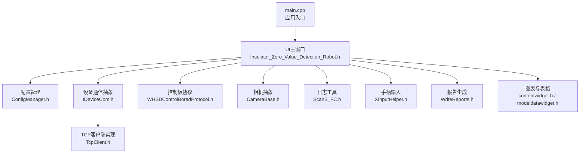
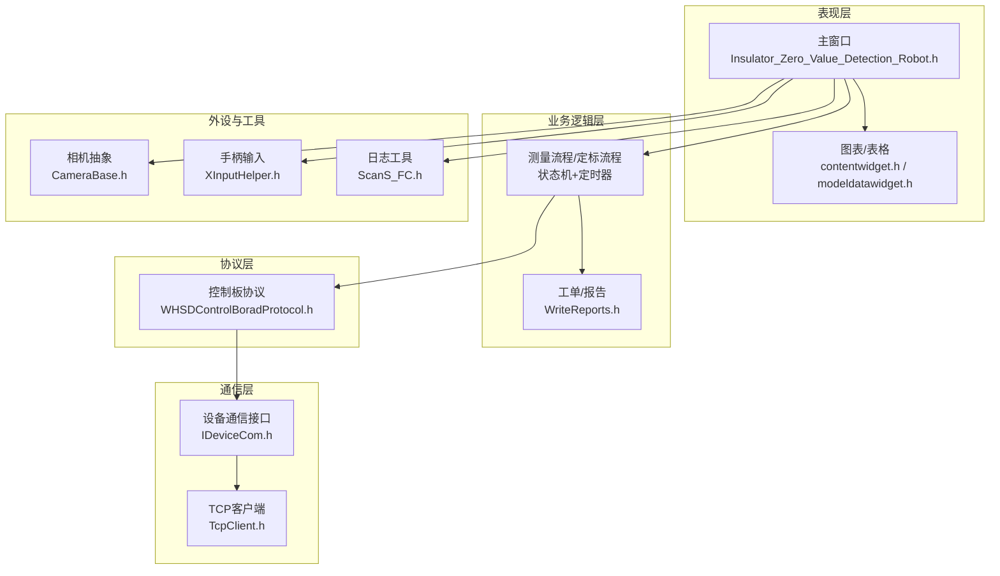
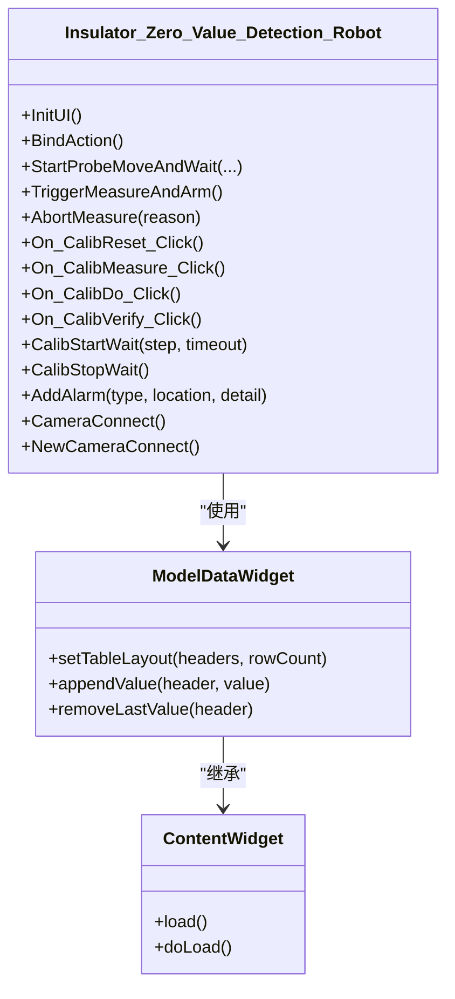
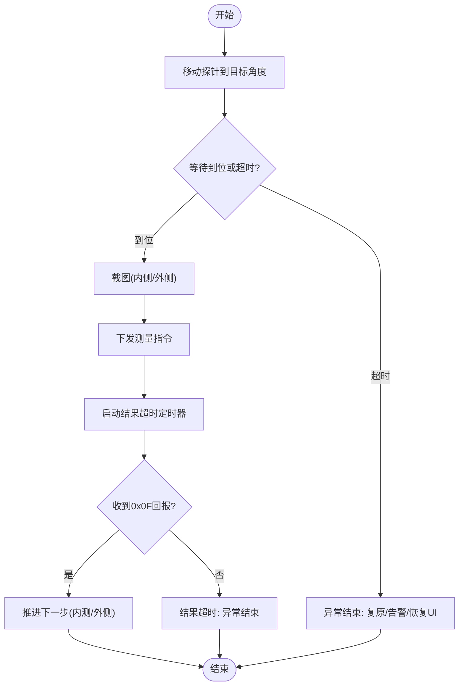
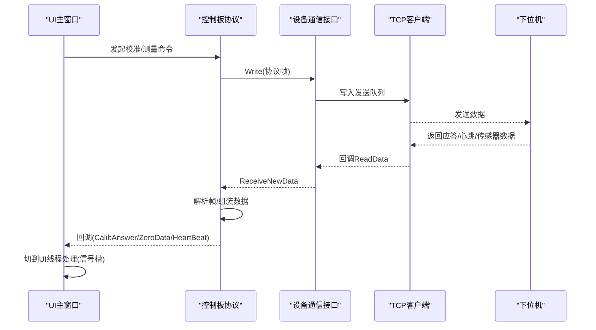
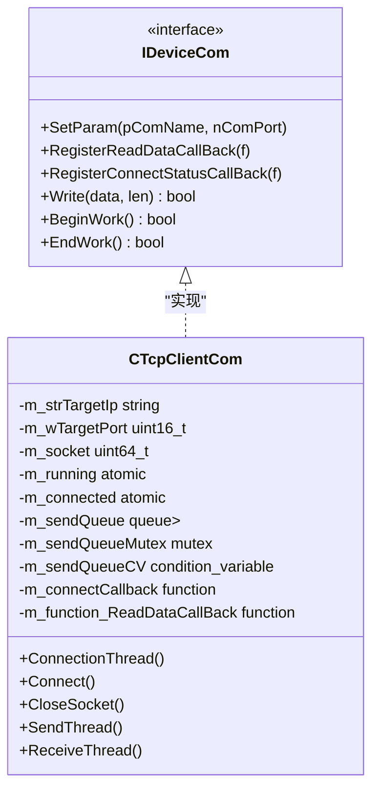
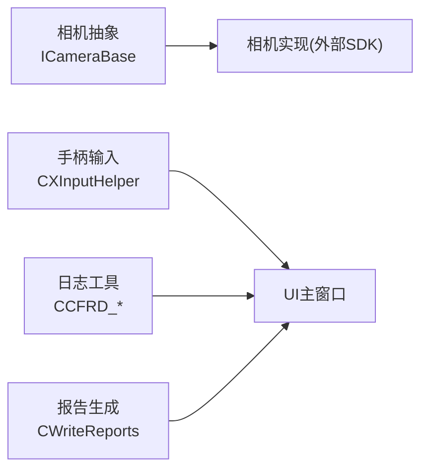
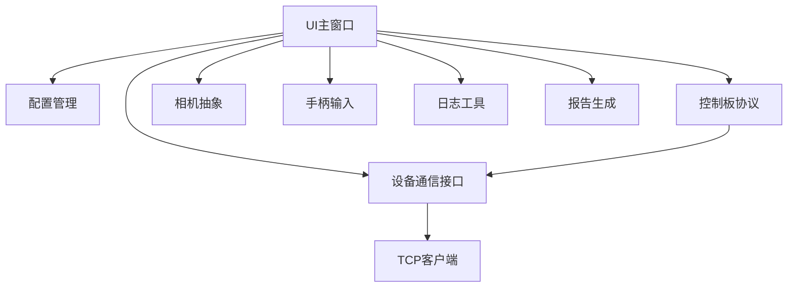

# 系统架构

<cite>
**本文引用的文件**
- [README.md](file://README.md)
- [main.cpp](file://Insulator_Zero_Value_Detection_Robot/main.cpp)
- [UI主窗口头文件](file://Insulator_Zero_Value_Detection_Robot/UI/Insulator_Zero_Value_Detection_Robot.h)
- [配置管理器头文件](file://Insulator_Zero_Value_Detection_Robot/Config/ConfigManager.h)
- [设备通信接口头文件](file://Insulator_Zero_Value_Detection_Robot/DeviceCom/IDeviceCom.h)
- [TCP客户端实现头文件](file://Insulator_Zero_Value_Detection_Robot/DeviceCom/TcpClient.h)
- [控制板协议头文件](file://Insulator_Zero_Value_Detection_Robot/Protocol/WHSDControlBoradProtocol.h)
- [摄像头基类头文件](file://Insulator_Zero_Value_Detection_Robot/Camera/CameraBase.h)
- [日志工具头文件](file://Insulator_Zero_Value_Detection_Robot/Log/ScanS_FC.h)
- [手柄输入辅助头文件](file://Insulator_Zero_Value_Detection_Robot/Tools/XInputHelper.h)
- [报告生成器头文件](file://Insulator_Zero_Value_Detection_Robot/Report/WriteReports.h)
- [内容图表控件头文件](file://Insulator_Zero_Value_Detection_Robot/UI/contentwidget.h)
- [模型数据控件头文件](file://Insulator_Zero_Value_Detection_Robot/UI/modeldatawidget.h)
</cite>

## 目录
1. [简介](#简介)
2. [项目结构](#项目结构)
3. [核心组件](#核心组件)
4. [架构总览](#架构总览)
5. [详细组件分析](#详细组件分析)
6. [依赖关系分析](#依赖关系分析)
7. [性能与并发特性](#性能与并发特性)
8. [故障排查指南](#故障排查指南)
9. [结论](#结论)
10. [附录：扩展与插件化建议](#附录：扩展与插件化建议)

## 简介
本系统为“绝缘子零值检测机器人V2”的上位机软件，采用分层架构与事件驱动设计，围绕“界面交互—业务编排—协议封装—设备通信—外设采集—结果输出”的主线组织。系统通过Qt构建UI，使用自定义协议与下位机控制板通信，支持多相机接入、手柄操控、工单与报告管理，并提供在线校准与离线抽查能力。

技术选型要点：
- Qt框架：提供跨平台UI、事件循环、线程与网络能力。
- 分层架构：表现层（UI）、业务逻辑层（测量流程/状态机/定标流程）、协议层（报文编解码/回调分发）、通信层（TCP/串口抽象）。
- 观察者模式：广泛使用函数对象回调注册机制，解耦协议解析与上层处理。
- 工厂模式：设备通信与相机模块通过静态工厂方法按类型创建具体实现。
- 状态机模式：测量流程与定标流程以显式步骤推进，结合定时器兜底超时，保证鲁棒性。

**章节来源**
- [README.md:1-3](file://README.md#L1-L3)

## 项目结构
整体目录按职责划分清晰：
- UI：主窗口、对话框、图表与表格展示
- Config：配置读写与数据结构定义
- DeviceCom：设备通信抽象与TCP实现
- Protocol：控制板协议封装与回调分发
- Camera：相机抽象与实例化
- Log：时间、临界区、转换等通用工具
- Tools：手柄输入、XML工具等
- Report：报告模板填充与数据表生成

**图示来源**
- [main.cpp:11-23](file://Insulator_Zero_Value_Detection_Robot/main.cpp#L11-L23)
- [UI主窗口头文件:26-385](file://Insulator_Zero_Value_Detection_Robot/UI/Insulator_Zero_Value_Detection_Robot.h#L26-L385)
- [设备通信接口头文件:4-15](file://Insulator_Zero_Value_Detection_Robot/DeviceCom/IDeviceCom.h#L4-L15)
- [TCP客户端实现头文件:8-46](file://Insulator_Zero_Value_Detection_Robot/DeviceCom/TcpClient.h#L8-L46)
- [控制板协议头文件:189-356](file://Insulator_Zero_Value_Detection_Robot/Protocol/WHSDControlBoradProtocol.h#L189-L356)
- [摄像头基类头文件:5-14](file://Insulator_Zero_Value_Detection_Robot/Camera/CameraBase.h#L5-L14)
- [日志工具头文件:20-122](file://Insulator_Zero_Value_Detection_Robot/Log/ScanS_FC.h#L20-L122)
- [手柄输入辅助头文件:18-47](file://Insulator_Zero_Value_Detection_Robot/Tools/XInputHelper.h#L18-L47)
- [报告生成器头文件:24-89](file://Insulator_Zero_Value_Detection_Robot/Report/WriteReports.h#L24-L89)
- [内容图表控件头文件:12-32](file://Insulator_Zero_Value_Detection_Robot/UI/contentwidget.h#L12-L32)
- [模型数据控件头文件:20-49](file://Insulator_Zero_Value_Detection_Robot/UI/modeldatawidget.h#L20-L49)

**章节来源**
- [main.cpp:11-23](file://Insulator_Zero_Value_Detection_Robot/main.cpp#L11-L23)

## 核心组件
- 表现层（UI）
  - 主窗口负责初始化各子系统、绑定用户操作、维护测量与定标流程的状态机、显示告警与数据表格。
  - 图表与表格控件用于实时展示测量数据与曲线。
- 业务逻辑层
  - 测量流程：探针到位轮询、触发测量、结果超时处理、异常自动恢复。
  - 定标流程：恢复默认、测原始值、下发定标、验证与读回系数。
  - 工单与报告：工单生命周期管理、报告模板填充与数据表生成。
- 协议层
  - 控制板协议封装：命令构造、应答解析、心跳处理、传感器数据回调、校准回调。
- 通信层
  - 设备通信抽象：统一读写、连接状态回调、参数设置。
  - TCP客户端：多线程收发、重连、队列发送。
- 外设与工具
  - 相机抽象：多相机接入、视频流句柄注册。
  - 手柄输入：控制器状态轮询与回调。
  - 日志工具：时间、临界区、字符串/数值转换。
  - 报告生成：基于docx模板的占位符替换与数据表重建。

**章节来源**
- [UI主窗口头文件:26-385](file://Insulator_Zero_Value_Detection_Robot/UI/Insulator_Zero_Value_Detection_Robot.h#L26-L385)
- [控制板协议头文件:189-356](file://Insulator_Zero_Value_Detection_Robot/Protocol/WHSDControlBoradProtocol.h#L189-L356)
- [设备通信接口头文件:4-15](file://Insulator_Zero_Value_Detection_Robot/DeviceCom/IDeviceCom.h#L4-L15)
- [TCP客户端实现头文件:8-46](file://Insulator_Zero_Value_Detection_Robot/DeviceCom/TcpClient.h#L8-L46)
- [摄像头基类头文件:5-14](file://Insulator_Zero_Value_Detection_Robot/Camera/CameraBase.h#L5-L14)
- [手柄输入辅助头文件:18-47](file://Insulator_Zero_Value_Detection_Robot/Tools/XInputHelper.h#L18-L47)
- [日志工具头文件:20-122](file://Insulator_Zero_Value_Detection_Robot/Log/ScanS_FC.h#L20-L122)
- [报告生成器头文件:24-89](file://Insulator_Zero_Value_Detection_Robot/Report/WriteReports.h#L24-L89)

## 架构总览
系统采用分层架构与事件驱动：
- 表现层：Qt主窗口与对话框，接收用户输入并驱动业务流程。
- 业务逻辑层：状态机驱动的测量与定标流程，协调各子系统。
- 协议层：将业务指令转换为协议帧，解析下位机应答并回调到上层。
- 通信层：抽象设备通信接口，具体由TCP实现，提供异步收发与连接管理。
- 外设层：相机、手柄等通过抽象或辅助类接入。
- 数据与持久化：配置管理、报告生成、日志记录。

**图示来源**
- [UI主窗口头文件:26-385](file://Insulator_Zero_Value_Detection_Robot/UI/Insulator_Zero_Value_Detection_Robot.h#L26-L385)
- [控制板协议头文件:189-356](file://Insulator_Zero_Value_Detection_Robot/Protocol/WHSDControlBoradProtocol.h#L189-L356)
- [设备通信接口头文件:4-15](file://Insulator_Zero_Value_Detection_Robot/DeviceCom/IDeviceCom.h#L4-L15)
- [TCP客户端实现头文件:8-46](file://Insulator_Zero_Value_Detection_Robot/DeviceCom/TcpClient.h#L8-L46)
- [摄像头基类头文件:5-14](file://Insulator_Zero_Value_Detection_Robot/Camera/CameraBase.h#L5-L14)
- [手柄输入辅助头文件:18-47](file://Insulator_Zero_Value_Detection_Robot/Tools/XInputHelper.h#L18-L47)
- [日志工具头文件:20-122](file://Insulator_Zero_Value_Detection_Robot/Log/ScanS_FC.h#L20-L122)
- [报告生成器头文件:24-89](file://Insulator_Zero_Value_Detection_Robot/Report/WriteReports.h#L24-L89)

## 详细组件分析

### 表现层（UI）
- 主窗口职责
  - 初始化配置、通信、协议、相机、手柄、日志、报告等子系统。
  - 绑定按钮与键盘/手柄事件，驱动测量与定标流程。
  - 维护测量等待弹窗、告警面板、工单与报告表格。
  - 通过信号槽将协议线程回调切到UI线程处理，避免跨线程直接更新UI。
- 图表与表格
  - ContentWidget提供图表视图基础能力；ModelDataWidget按列（相别/方向）动态建表与绘制曲线，支持追加/删除测量值。

**图示来源**
- [UI主窗口头文件:26-385](file://Insulator_Zero_Value_Detection_Robot/UI/Insulator_Zero_Value_Detection_Robot.h#L26-L385)
- [模型数据控件头文件:20-49](file://Insulator_Zero_Value_Detection_Robot/UI/modeldatawidget.h#L20-L49)
- [内容图表控件头文件:12-32](file://Insulator_Zero_Value_Detection_Robot/UI/contentwidget.h#L12-L32)

**章节来源**
- [UI主窗口头文件:26-385](file://Insulator_Zero_Value_Detection_Robot/UI/Insulator_Zero_Value_Detection_Robot.h#L26-L385)
- [内容图表控件头文件:12-32](file://Insulator_Zero_Value_Detection_Robot/UI/contentwidget.h#L12-L32)
- [模型数据控件头文件:20-49](file://Insulator_Zero_Value_Detection_Robot/UI/modeldatawidget.h#L20-L49)

### 业务逻辑层（测量与定标流程）
- 测量流程状态机
  - 步骤：探针移动到指定角度→等待到位或兜底超时→截图→下发测量指令→启动结果超时定时器→收到0x0F回报后推进下一步（内测/外侧）。
  - 异常处理：超时或异常时自动结束测量、探针复原、关闭等待窗、恢复按钮、记录告警。
- 定标流程状态机
  - 步骤顺序：恢复默认→测原始值（连测3次取平均）→下发定标→验证（修正值对比）→可选读回系数/离线抽查。
  - 互斥保护：定标期间屏蔽工单测量对0x0F结果的干扰，使用原子标志区分。

**图示来源**
- [UI主窗口头文件:188-197](file://Insulator_Zero_Value_Detection_Robot/UI/Insulator_Zero_Value_Detection_Robot.h#L188-L197)
- [UI主窗口头文件:294-313](file://Insulator_Zero_Value_Detection_Robot/UI/Insulator_Zero_Value_Detection_Robot.h#L294-L313)

**章节来源**
- [UI主窗口头文件:188-197](file://Insulator_Zero_Value_Detection_Robot/UI/Insulator_Zero_Value_Detection_Robot.h#L188-L197)
- [UI主窗口头文件:294-313](file://Insulator_Zero_Value_Detection_Robot/UI/Insulator_Zero_Value_Detection_Robot.h#L294-L313)

### 协议层（控制板协议）
- 功能
  - 命令构造：电机控制、启停、全开/全关、传感器命令、校准相关命令（恢复默认、查询原始值、读回系数、补偿验证、单点定标）。
  - 数据解析：心跳包、传感器数据、校准应答、零值数据回调。
  - OTA升级：分片传输与状态回调。
- 回调机制
  - 通过Register*系列函数注册回调，协议线程解析后调用上层处理函数，再由上层切到UI线程。

**图示来源**
- [控制板协议头文件:189-356](file://Insulator_Zero_Value_Detection_Robot/Protocol/WHSDControlBoradProtocol.h#L189-L356)
- [设备通信接口头文件:4-15](file://Insulator_Zero_Value_Detection_Robot/DeviceCom/IDeviceCom.h#L4-L15)
- [TCP客户端实现头文件:8-46](file://Insulator_Zero_Value_Detection_Robot/DeviceCom/TcpClient.h#L8-L46)

**章节来源**
- [控制板协议头文件:189-356](file://Insulator_Zero_Value_Detection_Robot/Protocol/WHSDControlBoradProtocol.h#L189-L356)

### 通信层（设备通信抽象与TCP实现）
- 抽象接口
  - IDeviceCom提供统一SetParam、RegisterReadDataCallBack、RegisterConnectStatusCallBack、Write、BeginWork、EndWork。
- TCP实现
  - 多线程：连接线程、接收线程、发送线程；发送队列与条件变量保证线程安全。
  - 连接状态与数据回调通过函数对象通知上层。

**图示来源**
- [设备通信接口头文件:4-15](file://Insulator_Zero_Value_Detection_Robot/DeviceCom/IDeviceCom.h#L4-L15)
- [TCP客户端实现头文件:8-46](file://Insulator_Zero_Value_Detection_Robot/DeviceCom/TcpClient.h#L8-L46)

**章节来源**
- [设备通信接口头文件:4-15](file://Insulator_Zero_Value_Detection_Robot/DeviceCom/IDeviceCom.h#L4-L15)
- [TCP客户端实现头文件:8-46](file://Insulator_Zero_Value_Detection_Robot/DeviceCom/TcpClient.h#L8-L46)

### 外设与工具（相机、手柄、日志、报告）
- 相机抽象
  - ICameraBase提供Init、Deinit、RegisterVideoViewHandle、Connect、GetCameraObj工厂方法，便于扩展不同相机SDK。
- 手柄输入
  - CXInputHelper轮询控制器状态，标准化扳机与摇杆值，回调ControllerState给上层。
- 日志工具
  - 提供临界区、时间计算、字符串/数值转换等通用能力。
- 报告生成
  - CWriteReports基于docx模板进行占位符替换与数据表重建，支持双联测量数据的自适应行生成。

**图示来源**
- [摄像头基类头文件:5-14](file://Insulator_Zero_Value_Detection_Robot/Camera/CameraBase.h#L5-L14)
- [手柄输入辅助头文件:18-47](file://Insulator_Zero_Value_Detection_Robot/Tools/XInputHelper.h#L18-L47)
- [日志工具头文件:20-122](file://Insulator_Zero_Value_Detection_Robot/Log/ScanS_FC.h#L20-L122)
- [报告生成器头文件:24-89](file://Insulator_Zero_Value_Detection_Robot/Report/WriteReports.h#L24-L89)

**章节来源**
- [摄像头基类头文件:5-14](file://Insulator_Zero_Value_Detection_Robot/Camera/CameraBase.h#L5-L14)
- [手柄输入辅助头文件:18-47](file://Insulator_Zero_Value_Detection_Robot/Tools/XInputHelper.h#L18-L47)
- [日志工具头文件:20-122](file://Insulator_Zero_Value_Detection_Robot/Log/ScanS_FC.h#L20-L122)
- [报告生成器头文件:24-89](file://Insulator_Zero_Value_Detection_Robot/Report/WriteReports.h#L24-L89)

## 依赖关系分析
- 耦合度
  - UI与协议层通过回调解耦；协议层与通信层通过接口抽象解耦；相机与手柄通过抽象或辅助类接入。
- 直接依赖
  - 主窗口依赖配置、通信、协议、相机、手柄、日志、报告等模块。
  - 协议层依赖通信接口；TCP实现依赖标准库与Qt线程。
- 间接依赖
  - 报告生成依赖Qt私有Zip能力；日志工具依赖Windows API。

**图示来源**
- [UI主窗口头文件:26-385](file://Insulator_Zero_Value_Detection_Robot/UI/Insulator_Zero_Value_Detection_Robot.h#L26-L385)
- [设备通信接口头文件:4-15](file://Insulator_Zero_Value_Detection_Robot/DeviceCom/IDeviceCom.h#L4-L15)
- [控制板协议头文件:189-356](file://Insulator_Zero_Value_Detection_Robot/Protocol/WHSDControlBoradProtocol.h#L189-L356)
- [TCP客户端实现头文件:8-46](file://Insulator_Zero_Value_Detection_Robot/DeviceCom/TcpClient.h#L8-L46)

**章节来源**
- [UI主窗口头文件:26-385](file://Insulator_Zero_Value_Detection_Robot/UI/Insulator_Zero_Value_Detection_Robot.h#L26-L385)
- [设备通信接口头文件:4-15](file://Insulator_Zero_Value_Detection_Robot/DeviceCom/IDeviceCom.h#L4-L15)
- [控制板协议头文件:189-356](file://Insulator_Zero_Value_Detection_Robot/Protocol/WHSDControlBoradProtocol.h#L189-L356)
- [TCP客户端实现头文件:8-46](file://Insulator_Zero_Value_Detection_Robot/DeviceCom/TcpClient.h#L8-L46)

## 性能与并发特性
- 线程模型
  - 通信层：连接、接收、发送分离线程，使用队列与条件变量降低阻塞。
  - 协议层：解析在独立线程，回调到UI线程处理，避免UI卡顿。
  - 录像与取流：原子标志与互斥锁保护帧缓存，避免竞争。
- 同步机制
  - 互斥锁：设备信息快照、发送队列、录制帧缓存。
  - 原子变量：运行标志、连接标志、录制标志、探针到位标志。
- 超时与兜底
  - 测量结果超时、探针到位兜底超时、定标步骤超时，确保流程可恢复。
- 可扩展性
  - 工厂模式：设备通信与相机通过静态工厂方法按类型创建，便于新增实现。
  - 观察者模式：回调注册机制使协议与上层解耦，易于扩展新数据类型。
  - 状态机模式：测量与定标流程显式状态推进，便于调试与维护。

[本节为通用性能讨论，不直接分析具体代码文件]

## 故障排查指南
- 通信问题
  - 检查TCP连接状态回调与连接线程是否正常运行。
  - 确认IP、端口配置正确，防火墙允许通信。
- 协议解析失败
  - 核对帧格式与大端字节序，检查校验与长度字段。
  - 查看协议回调是否被正确注册与调用。
- 测量流程卡死
  - 检查探针到位信号与超时定时器是否正常触发。
  - 确认0x0F回报是否在预期时间内到达。
- 定标失败
  - 核对标准值与原始值范围，Flash写失败原因码定位。
  - 读回系数与补偿验证结果比对。
- 报告生成异常
  - 检查模板路径与占位符键名，确认XML转义与合并相邻run。
  - 双联数据表行数与单元格数量匹配。

**章节来源**
- [TCP客户端实现头文件:8-46](file://Insulator_Zero_Value_Detection_Robot/DeviceCom/TcpClient.h#L8-L46)
- [控制板协议头文件:189-356](file://Insulator_Zero_Value_Detection_Robot/Protocol/WHSDControlBoradProtocol.h#L189-L356)
- [UI主窗口头文件:188-197](file://Insulator_Zero_Value_Detection_Robot/UI/Insulator_Zero_Value_Detection_Robot.h#L188-L197)
- [报告生成器头文件:24-89](file://Insulator_Zero_Value_Detection_Robot/Report/WriteReports.h#L24-L89)

## 结论
本系统通过分层架构与事件驱动实现了高内聚、低耦合的设计，UI与业务逻辑清晰分离，协议与通信解耦，外设接入灵活。状态机驱动的测量与定标流程保证了可靠性与可维护性。工厂模式与观察者模式提升了扩展性，配合超时与兜底机制增强了鲁棒性。未来可在插件化相机与通信实现上进一步扩展，完善监控与诊断能力。

[本节为总结性内容，不直接分析具体代码文件]

## 附录：扩展与插件化建议
- 新增通信后端
  - 实现IDeviceCom接口，注册到工厂方法，支持串口/UDP等。
- 新增相机类型
  - 实现ICameraBase接口，通过GetCameraObj按类型获取实例。
- 扩展协议命令
  - 在协议层增加命令构造与解析，注册回调并在UI层处理。
- 增强报告模板
  - 扩展占位符与数据表结构，适配更多报告格式。

[本节为概念性建议，不直接分析具体代码文件]