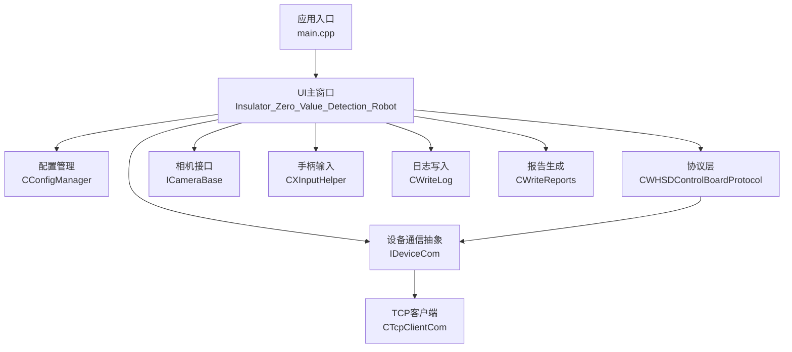
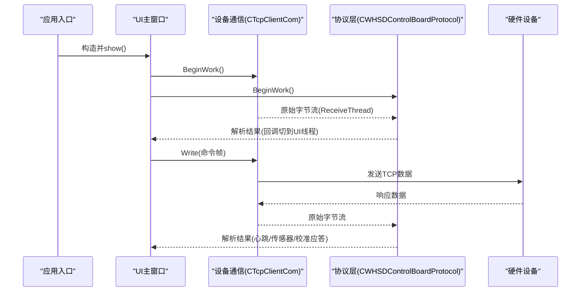
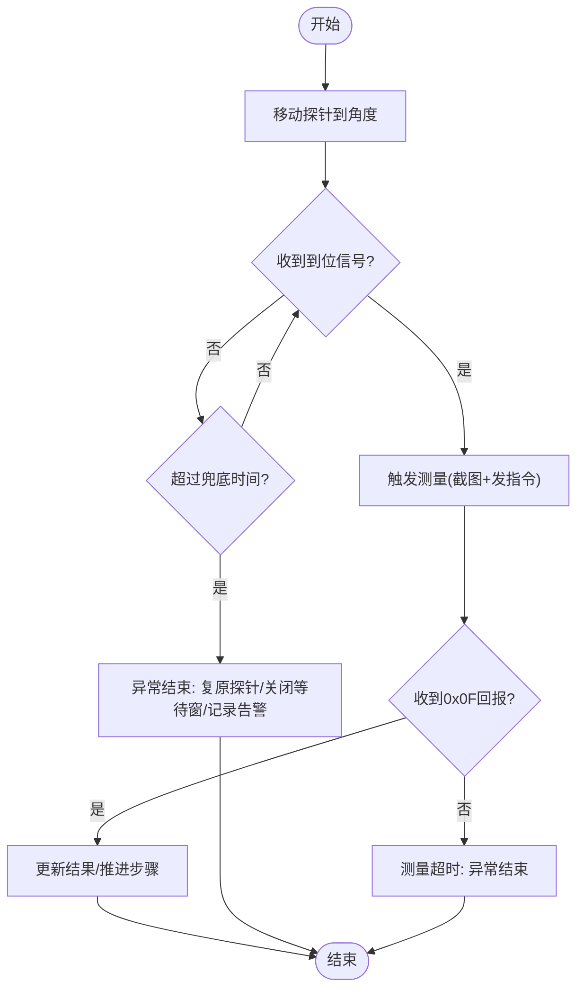
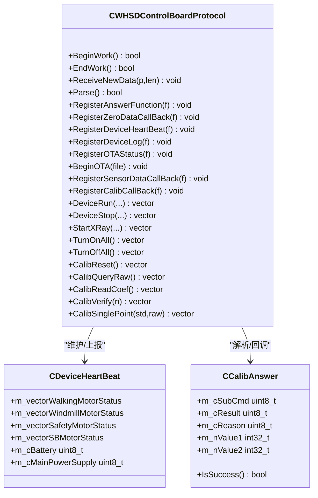
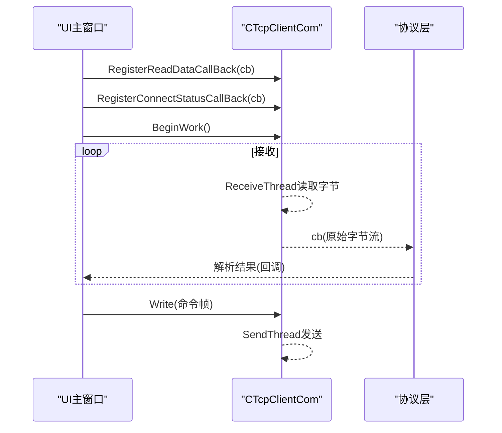
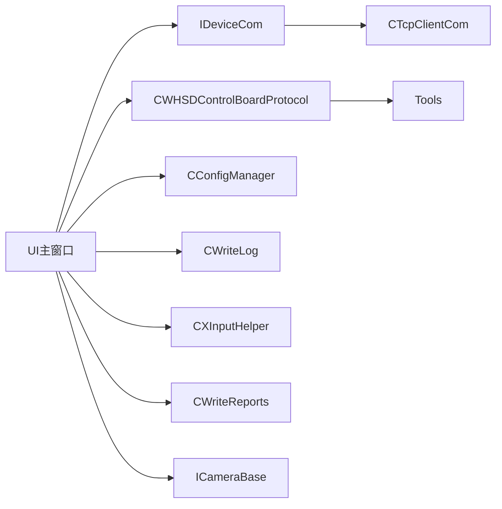

# 组件交互

<cite>
**本文引用的文件**
- [main.cpp](file://Insulator_Zero_Value_Detection_Robot/main.cpp)
- [UI主窗口头文件](file://Insulator_Zero_Value_Detection_Robot/UI/Insulator_Zero_Value_Detection_Robot.h)
- [UI主窗口实现](file://Insulator_Zero_Value_Detection_Robot/UI/Insulator_Zero_Value_Detection_Robot.cpp)
- [设备通信抽象接口](file://Insulator_Zero_Value_Detection_Robot/DeviceCom/IDeviceCom.h)
- [TCP客户端实现](file://Insulator_Zero_Value_Detection_Robot/DeviceCom/TcpClient.h)
- [TCP客户端实现源](file://Insulator_Zero_Value_Detection_Robot/DeviceCom/TcpClient.cpp)
- [控制板协议定义](file://Insulator_Zero_Value_Detection_Robot/Protocol/WHSDControlBoradProtocol.h)
- [控制板协议实现](file://Insulator_Zero_Value_Detection_Robot/Protocol/WHSDControlBoradProtocol.cpp)
- [配置管理器接口](file://Insulator_Zero_Value_Detection_Robot/Config/ConfigManager.h)
- [日志写入器](file://Insulator_Zero_Value_Detection_Robot/Log/ScanS_WriteLog.h)
- [手柄输入助手](file://Insulator_Zero_Value_Detection_Robot/Tools/XInputHelper.h)
- [报告生成器](file://Insulator_Zero_Value_Detection_Robot/Report/WriteReports.h)
- [相机基类接口](file://Insulator_Zero_Value_Detection_Robot/Camera/CameraBase.h)
</cite>

## 目录
1. [简介](#简介)
2. [项目结构](#项目结构)
3. [核心组件](#核心组件)
4. [架构总览](#架构总览)
5. [详细组件分析](#详细组件分析)
6. [依赖关系分析](#依赖关系分析)
7. [性能与并发特性](#性能与并发特性)
8. [故障排查指南](#故障排查指南)
9. [结论](#结论)
10. [附录：调试与测试方法](#附录：调试与测试方法)

## 简介
本文件面向“绝缘子零值检测机器人V2”的组件交互，聚焦以下目标：
- 描述UI组件、业务逻辑层、协议层、硬件设备之间的交互方式与通信机制。
- 说明信号槽机制在跨线程通信中的应用。
- 解释异步通信与同步调用的使用场景。
- 阐述错误处理与异常传播机制。
- 提供关键业务流程的时序图，展示组件协作。
- 说明组件依赖管理与生命周期协调。
- 给出调试与测试方法。

## 项目结构
系统采用分层+模块化的组织方式：
- UI层：Qt主窗口与对话框，负责用户交互、状态显示与流程编排。
- 业务逻辑层：以主窗口为核心，编排测量、定标、截图、报告生成等流程。
- 协议层：解析/封装控制板协议帧，维护心跳、传感器数据、校准应答等回调。
- 设备通信层：基于TCP的异步收发，提供连接管理、发送队列、接收线程。
- 外设与工具：相机、手柄、日志、报告生成、配置管理等。

图表来源
- [main.cpp:11-23](file://Insulator_Zero_Value_Detection_Robot/main.cpp#L11-L23)
- [UI主窗口头文件:26-385](file://Insulator_Zero_Value_Detection_Robot/UI/Insulator_Zero_Value_Detection_Robot.h#L26-L385)
- [设备通信抽象接口:4-15](file://Insulator_Zero_Value_Detection_Robot/DeviceCom/IDeviceCom.h#L4-L15)
- [TCP客户端实现:8-46](file://Insulator_Zero_Value_Detection_Robot/DeviceCom/TcpClient.h#L8-L46)
- [控制板协议定义:189-356](file://Insulator_Zero_Value_Detection_Robot/Protocol/WHSDControlBoradProtocol.h#L189-L356)
- [相机基类接口:5-14](file://Insulator_Zero_Value_Detection_Robot/Camera/CameraBase.h#L5-L14)
- [手柄输入助手:18-47](file://Insulator_Zero_Value_Detection_Robot/Tools/XInputHelper.h#L18-L47)
- [日志写入器:5-42](file://Insulator_Zero_Value_Detection_Robot/Log/ScanS_WriteLog.h#L5-L42)
- [报告生成器:24-88](file://Insulator_Zero_Value_Detection_Robot/Report/WriteReports.h#L24-L88)

章节来源
- [main.cpp:11-23](file://Insulator_Zero_Value_Detection_Robot/main.cpp#L11-L23)
- [UI主窗口头文件:26-385](file://Insulator_Zero_Value_Detection_Robot/UI/Insulator_Zero_Value_Detection_Robot.h#L26-L385)

## 核心组件
- UI主窗口（业务编排）：负责界面初始化、动作绑定、测量/定标流程状态机、定时器轮询、截图与录像、告警面板、工单/报告表维护。通过Qt信号槽将协议线程回调切换到UI线程执行。
- 协议层（控制板协议）：负责帧组装/解析、心跳维护、传感器数据分发、校准应答分发、OTA状态上报。对外暴露注册回调接口，内部维护缓冲区与线程。
- 设备通信层（TCP）：实现连接、重连、发送队列、接收线程；通过回调将原始字节流交给协议层解析。
- 配置管理：集中管理控制板参数、相机参数、工单与报告配置。
- 日志记录：多线程安全写入，支持同步/异步模式。
- 手柄输入：周期性读取控制器状态并通过回调通知UI。
- 报告生成：基于docx模板填充文本与表格数据。
- 相机接口：抽象不同相机实现，提供视频流接入能力。

章节来源
- [UI主窗口头文件:26-385](file://Insulator_Zero_Value_Detection_Robot/UI/Insulator_Zero_Value_Detection_Robot.h#L26-L385)
- [控制板协议定义:189-356](file://Insulator_Zero_Value_Detection_Robot/Protocol/WHSDControlBoradProtocol.h#L189-L356)
- [设备通信抽象接口:4-15](file://Insulator_Zero_Value_Detection_Robot/DeviceCom/IDeviceCom.h#L4-L15)
- [TCP客户端实现:8-46](file://Insulator_Zero_Value_Detection_Robot/DeviceCom/TcpClient.h#L8-L46)
- [配置管理器接口:185-199](file://Insulator_Zero_Value_Detection_Robot/Config/ConfigManager.h#L185-L199)
- [日志写入器:5-42](file://Insulator_Zero_Value_Detection_Robot/Log/ScanS_WriteLog.h#L5-L42)
- [手柄输入助手:18-47](file://Insulator_Zero_Value_Detection_Robot/Tools/XInputHelper.h#L18-L47)
- [报告生成器:24-88](file://Insulator_Zero_Value_Detection_Robot/Report/WriteReports.h#L24-L88)
- [相机基类接口:5-14](file://Insulator_Zero_Value_Detection_Robot/Camera/CameraBase.h#L5-L14)

## 架构总览
系统运行由main启动Qt应用并创建主窗口。主窗口初始化后，建立配置、日志、协议、设备通信、手柄、相机等子系统，并通过信号槽与定时器驱动业务流程。

图表来源
- [main.cpp:11-23](file://Insulator_Zero_Value_Detection_Robot/main.cpp#L11-L23)
- [TCP客户端实现:59-87](file://Insulator_Zero_Value_Detection_Robot/DeviceCom/TcpClient.cpp#L59-L87)
- [控制板协议实现:179-200](file://Insulator_Zero_Value_Detection_Robot/Protocol/WHSDControlBoradProtocol.cpp#L179-L200)

## 详细组件分析

### UI主窗口与业务编排
- 职责：界面初始化、动作绑定、测量/定标流程状态机、定时器轮询、截图/录像、告警、工单/报告表维护。
- 关键交互：
  - 通过Qt信号槽将协议线程回调切换到UI线程，避免跨线程直接操作UI。
  - 使用QTimer进行探针到位轮询与测量结果超时控制。
  - 通过IDeviceCom向协议层下发命令，接收协议层回调更新UI。
  - 调用报告生成器输出docx报告，调用日志写入器记录事件。
- 典型流程：
  - 测量流程：移动探针→等待到位或兜底超时→触发测量→等待0x0F回报→更新结果→结束。
  - 定标流程：恢复默认→测原始值→下发定标→验证→读回系数。

图表来源
- [UI主窗口头文件:188-197](file://Insulator_Zero_Value_Detection_Robot/UI/Insulator_Zero_Value_Detection_Robot.h#L188-L197)
- [UI主窗口实现:55-73](file://Insulator_Zero_Value_Detection_Robot/UI/Insulator_Zero_Value_Detection_Robot.cpp#L55-L73)

章节来源
- [UI主窗口头文件:36-137](file://Insulator_Zero_Value_Detection_Robot/UI/Insulator_Zero_Value_Detection_Robot.h#L36-L137)
- [UI主窗口实现:88-200](file://Insulator_Zero_Value_Detection_Robot/UI/Insulator_Zero_Value_Detection_Robot.cpp#L88-L200)

### 协议层与控制板通信
- 职责：帧组装/解析、心跳维护、传感器数据分发、校准应答分发、OTA状态上报。
- 关键交互：
  - 通过RegisterAnswerFunction/RegisterZeroDataCallBack/RegisterDeviceHeartBeat/RegisterCalibCallBack等回调注册上层处理函数。
  - BeginWork/EndWork管理协议线程与心跳循环。
  - 静态方法提供命令帧组装（如DeviceRun、CalibSinglePoint等）。
- 数据模型：
  - CDeviceHeartBeat：设备心跳信息（电机状态、电池、电源、固件信息等）。
  - CCalibAnswer：校准命令应答（子命令、结果、原因、参数）。
  - CSensorData：传感器数据（索引、命令、值）。

图表来源
- [控制板协议定义:189-356](file://Insulator_Zero_Value_Detection_Robot/Protocol/WHSDControlBoradProtocol.h#L189-L356)
- [控制板协议实现:179-200](file://Insulator_Zero_Value_Detection_Robot/Protocol/WHSDControlBoradProtocol.cpp#L179-L200)

章节来源
- [控制板协议定义:7-52](file://Insulator_Zero_Value_Detection_Robot/Protocol/WHSDControlBoradProtocol.h#L7-L52)
- [控制板协议定义:121-187](file://Insulator_Zero_Value_Detection_Robot/Protocol/WHSDControlBoradProtocol.h#L121-L187)
- [控制板协议定义:189-356](file://Insulator_Zero_Value_Detection_Robot/Protocol/WHSDControlBoradProtocol.h#L189-L356)
- [控制板协议实现:14-33](file://Insulator_Zero_Value_Detection_Robot/Protocol/WHSDControlBoradProtocol.cpp#L14-L33)
- [控制板协议实现:106-177](file://Insulator_Zero_Value_Detection_Robot/Protocol/WHSDControlBoradProtocol.cpp#L106-L177)

### 设备通信层（TCP）
- 职责：连接管理、发送队列、接收线程、连接状态回调。
- 关键交互：
  - BeginWork启动连接、接收、发送三个线程；EndWork清理资源。
  - Write将数据入队，SendThread统一发送。
  - ReceiveThread接收数据后通过回调交给协议层解析。
  - 连接状态变化时调用注册的状态回调。
- 并发与安全：
  - 使用互斥锁保护发送队列，条件变量唤醒发送线程。
  - 原子变量控制运行与连接状态。

图表来源
- [TCP客户端实现:33-57](file://Insulator_Zero_Value_Detection_Robot/DeviceCom/TcpClient.cpp#L33-L57)
- [TCP客户端实现:59-87](file://Insulator_Zero_Value_Detection_Robot/DeviceCom/TcpClient.cpp#L59-L87)

章节来源
- [设备通信抽象接口:4-15](file://Insulator_Zero_Value_Detection_Robot/DeviceCom/IDeviceCom.h#L4-L15)
- [TCP客户端实现:8-46](file://Insulator_Zero_Value_Detection_Robot/DeviceCom/TcpClient.h#L8-L46)
- [TCP客户端实现:21-121](file://Insulator_Zero_Value_Detection_Robot/DeviceCom/TcpClient.cpp#L21-L121)

### 配置管理、日志、手柄、报告、相机
- 配置管理：集中存储控制板参数、相机参数、工单与报告配置，提供读写接口。
- 日志写入：多线程安全写入，支持同步/异步模式，用于设备通信、协议解析、业务流程记录。
- 手柄输入：周期性读取控制器状态，通过回调通知UI，实现按键/摇杆控制。
- 报告生成：基于docx模板替换占位符与表格数据，输出检测报告。
- 相机接口：抽象相机实现，提供视频流接入与视图句柄注册。

章节来源
- [配置管理器接口:10-199](file://Insulator_Zero_Value_Detection_Robot/Config/ConfigManager.h#L10-L199)
- [日志写入器:5-42](file://Insulator_Zero_Value_Detection_Robot/Log/ScanS_WriteLog.h#L5-L42)
- [手柄输入助手:5-47](file://Insulator_Zero_Value_Detection_Robot/Tools/XInputHelper.h#L5-L47)
- [报告生成器:24-88](file://Insulator_Zero_Value_Detection_Robot/Report/WriteReports.h#L24-L88)
- [相机基类接口:5-14](file://Insulator_Zero_Value_Detection_Robot/Camera/CameraBase.h#L5-L14)

## 依赖关系分析
- UI主窗口依赖：
  - 设备通信抽象接口（IDeviceCom），具体实现为TCP客户端。
  - 协议层（CWHSDControlBoardProtocol），用于命令组装与解析。
  - 配置管理（CConfigManager），用于加载/保存参数。
  - 日志写入（CWriteLog），用于记录事件。
  - 手柄输入（CXInputHelper），用于外部控制。
  - 报告生成（CWriteReports），用于输出报告。
  - 相机接口（ICameraBase），用于视频流。
- 协议层依赖：
  - 设备通信抽象接口，用于发送数据与接收回调。
  - 工具库（Tools），用于字节序转换等。
- 设备通信层依赖：
  - Windows Socket API，实现TCP连接与收发。

图表来源
- [UI主窗口头文件:26-385](file://Insulator_Zero_Value_Detection_Robot/UI/Insulator_Zero_Value_Detection_Robot.h#L26-L385)
- [设备通信抽象接口:4-15](file://Insulator_Zero_Value_Detection_Robot/DeviceCom/IDeviceCom.h#L4-L15)
- [TCP客户端实现:8-46](file://Insulator_Zero_Value_Detection_Robot/DeviceCom/TcpClient.h#L8-L46)
- [控制板协议定义:189-356](file://Insulator_Zero_Value_Detection_Robot/Protocol/WHSDControlBoradProtocol.h#L189-L356)

章节来源
- [UI主窗口头文件:26-385](file://Insulator_Zero_Value_Detection_Robot/UI/Insulator_Zero_Value_Detection_Robot.h#L26-L385)
- [设备通信抽象接口:4-15](file://Insulator_Zero_Value_Detection_Robot/DeviceCom/IDeviceCom.h#L4-L15)
- [TCP客户端实现:8-46](file://Insulator_Zero_Value_Detection_Robot/DeviceCom/TcpClient.h#L8-L46)
- [控制板协议定义:189-356](file://Insulator_Zero_Value_Detection_Robot/Protocol/WHSDControlBoradProtocol.h#L189-L356)

## 性能与并发特性
- 异步通信：
  - TCP接收线程异步读取数据，通过回调传递给协议层解析，避免阻塞UI。
  - 发送通过队列与独立线程发送，提高吞吐与稳定性。
- 同步调用：
  - 命令发送返回布尔值表示是否成功入队，调用方可据此判断链路状态。
- 线程安全：
  - 发送队列使用互斥锁与条件变量保护。
  - 心跳数据快照加锁，避免UI读到写一半的数据。
  - 原子变量用于运行与连接状态标志。
- 定时器轮询：
  - 探针到位轮询与测量结果超时通过QTimer实现，保证流程可控。

章节来源
- [TCP客户端实现:43-57](file://Insulator_Zero_Value_Detection_Robot/DeviceCom/TcpClient.cpp#L43-L57)
- [TCP客户端实现:59-121](file://Insulator_Zero_Value_Detection_Robot/DeviceCom/TcpClient.cpp#L59-L121)
- [UI主窗口头文件:99-106](file://Insulator_Zero_Value_Detection_Robot/UI/Insulator_Zero_Value_Detection_Robot.h#L99-L106)
- [控制板协议实现:179-200](file://Insulator_Zero_Value_Detection_Robot/Protocol/WHSDControlBoradProtocol.cpp#L179-L200)

## 故障排查指南
- 连接问题：
  - 检查TCP客户端BeginWork是否成功，确认IP与端口配置。
  - 观察连接状态回调，确认连接/断开事件。
- 数据解析失败：
  - 检查协议层ReceiveNewData是否正确接收数据。
  - 核对命令帧格式与大端字节序。
- 测量超时：
  - 确认0x0F回报是否在预期时间内到达。
  - 检查探针到位信号与兜底超时设置。
- 校准失败：
  - 根据CCalibAnswer的原因码定位问题（如原始值超时、Flash写失败、参数非法）。
- 日志与调试：
  - 启用日志写入，记录设备通信与协议解析过程。
  - 使用控制台输出（调试模式）辅助定位。

章节来源
- [TCP客户端实现:123-200](file://Insulator_Zero_Value_Detection_Robot/DeviceCom/TcpClient.cpp#L123-L200)
- [控制板协议定义:17-52](file://Insulator_Zero_Value_Detection_Robot/Protocol/WHSDControlBoradProtocol.h#L17-L52)
- [UI主窗口实现:55-73](file://Insulator_Zero_Value_Detection_Robot/UI/Insulator_Zero_Value_Detection_Robot.cpp#L55-L73)
- [日志写入器:17-38](file://Insulator_Zero_Value_Detection_Robot/Log/ScanS_WriteLog.h#L17-L38)

## 结论
本系统通过清晰的层次划分与模块化设计，实现了UI、业务逻辑、协议与硬件设备的解耦。信号槽机制有效解决了跨线程通信问题，异步通信提升了系统响应性。通过定时器轮询与状态机，保证了测量与定标流程的可靠性。日志与报告生成为运维与交付提供了有力支撑。

## 附录：调试与测试方法
- 单元测试：
  - 对协议层命令组装与解析进行断言测试，确保帧格式正确。
  - 对TCP客户端发送队列与接收回调进行模拟测试。
- 集成测试：
  - 搭建真实硬件环境，验证测量与定标全流程。
  - 使用手柄输入模拟外部控制，验证UI响应。
- 日志分析：
  - 导出设备通信日志，逐字节比对协议文档示例帧。
  - 分析心跳数据，确认设备状态正常。
- 性能测试：
  - 压测TCP收发，评估吞吐与延迟。
  - 监控内存与CPU使用，优化瓶颈。

章节来源
- [控制板协议定义:220-287](file://Insulator_Zero_Value_Detection_Robot/Protocol/WHSDControlBoradProtocol.h#L220-L287)
- [TCP客户端实现:43-57](file://Insulator_Zero_Value_Detection_Robot/DeviceCom/TcpClient.cpp#L43-L57)
- [日志写入器:17-38](file://Insulator_Zero_Value_Detection_Robot/Log/ScanS_WriteLog.h#L17-L38)
- [报告生成器:32-55](file://Insulator_Zero_Value_Detection_Robot/Report/WriteReports.h#L32-L55)