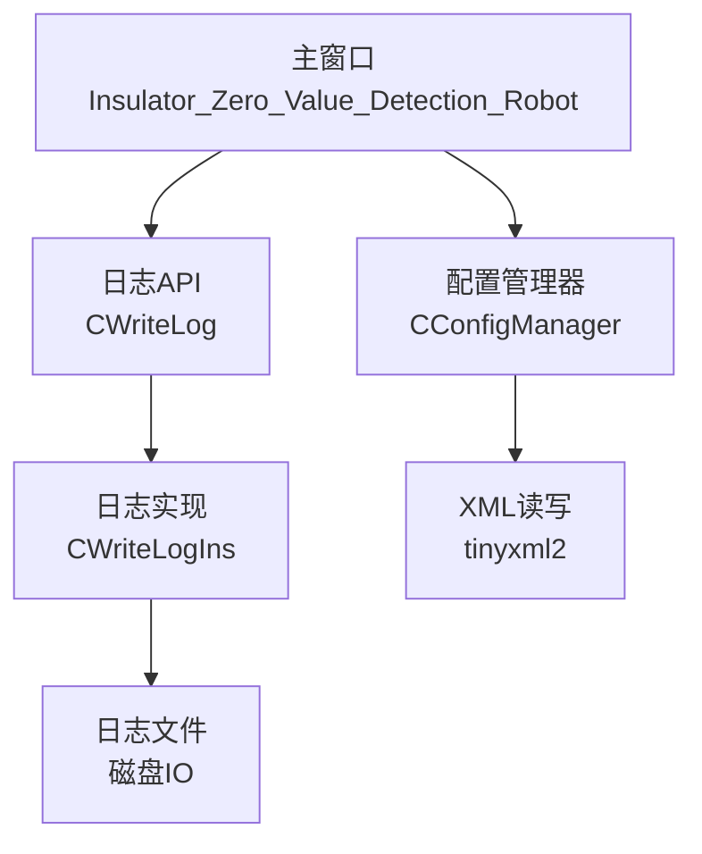
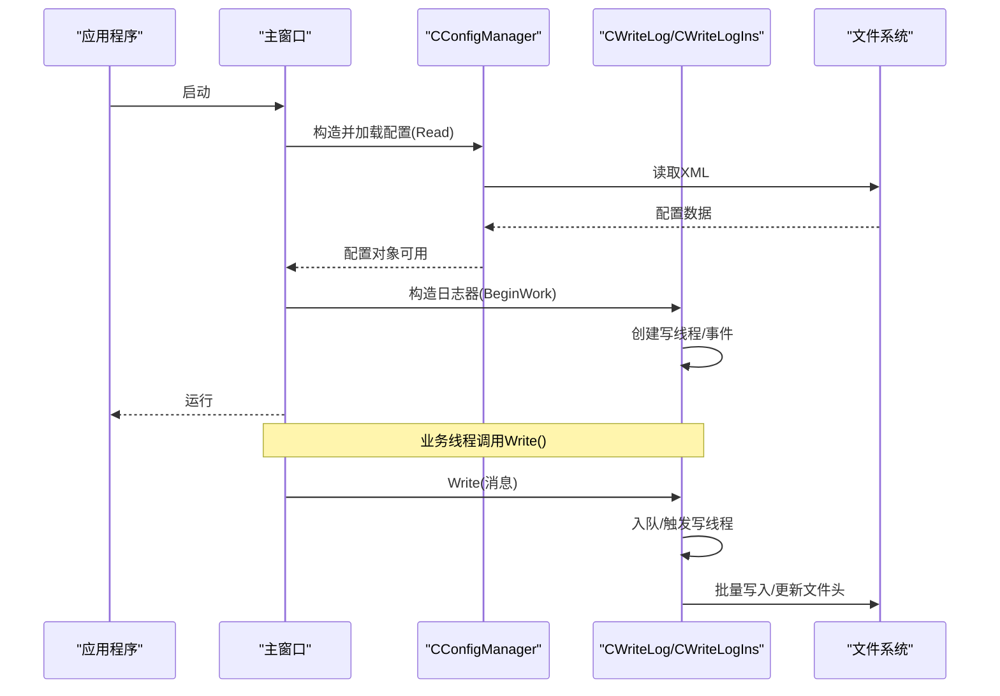
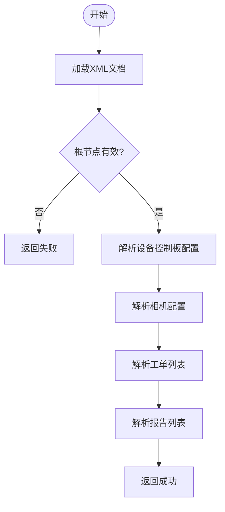
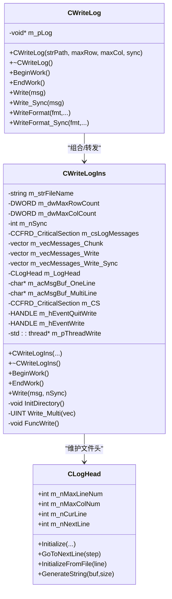
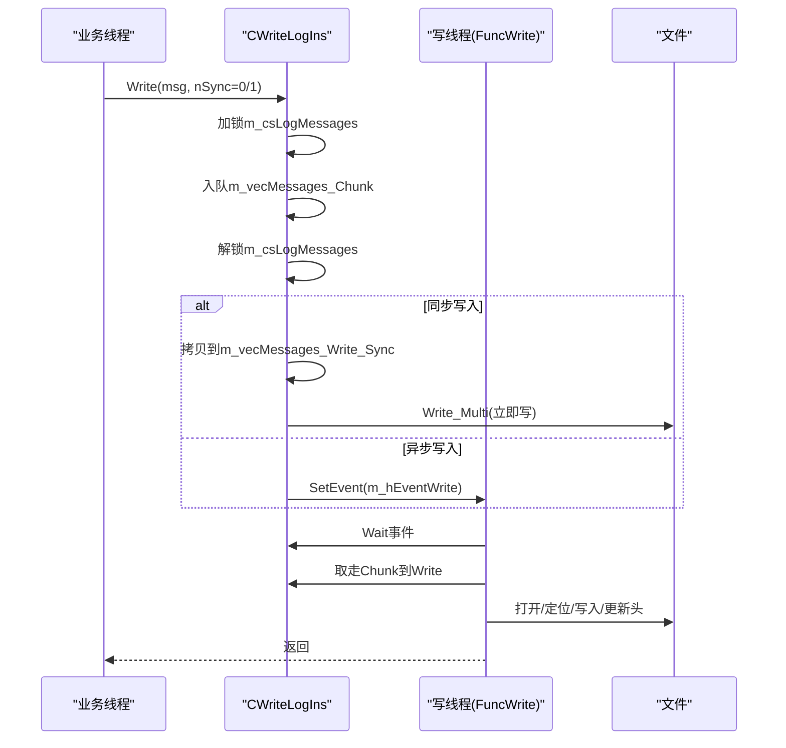
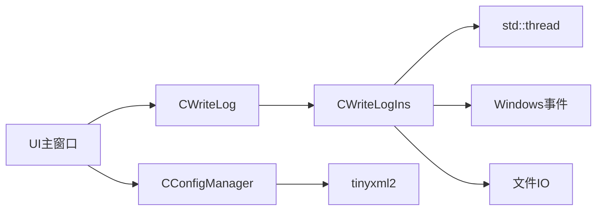

# 单例模式应用

<cite>
**本文引用的文件**
- [ConfigManager.h](file://Insulator_Zero_Value_Detection_Robot/Config/ConfigManager.h)
- [ConfigManager.cpp](file://Insulator_Zero_Value_Detection_Robot/Config/ConfigManager.cpp)
- [WriteLogIns.h](file://Insulator_Zero_Value_Detection_Robot/Log/WriteLogIns.h)
- [WriteLogIns.cpp](file://Insulator_Zero_Value_Detection_Robot/Log/WriteLogIns.cpp)
- [ScanS_WriteLog.h](file://Insulator_Zero_Value_Detection_Robot/Log/ScanS_WriteLog.h)
- [ScanS_WriteLog.cpp](file://Insulator_Zero_Value_Detection_Robot/Log/ScanS_WriteLog.cpp)
- [Insulator_Zero_Value_Detection_Robot.h](file://Insulator_Zero_Value_Detection_Robot/UI/Insulator_Zero_Value_Detection_Robot.h)
- [Insulator_Zero_Value_Detection_Robot.cpp](file://Insulator_Zero_Value_Detection_Robot/UI/Insulator_Zero_Value_Detection_Robot.cpp)
</cite>

## 目录
1. [简介](#简介)
2. [项目结构](#项目结构)
3. [核心组件](#核心组件)
4. [架构总览](#架构总览)
5. [详细组件分析](#详细组件分析)
6. [依赖关系分析](#依赖关系分析)
7. [性能考虑](#性能考虑)
8. [故障排查指南](#故障排查指南)
9. [结论](#结论)
10. [附录：使用示例与最佳实践](#附录使用示例与最佳实践)

## 简介
本文聚焦绝缘子零值检测机器人V2中“全局配置管理”和“日志系统”的线程安全实现，围绕CConfigManager与CWriteLog（底层为CWriteLogIns）展开。尽管代码未采用传统“静态GetInstance”形式的单例，但通过“主窗口持有唯一实例指针并在多处共享”的方式，实现了与单例等效的全局服务效果。本文将解释这种设计在资源管理与系统级服务中的价值，并给出多线程环境下的互斥锁、事件同步与延迟初始化机制的分析与建议。

## 项目结构
- 配置模块：Config/ConfigManager.* 负责从XML读取/写入设备控制板、相机、工单与报告等配置数据。
- 日志模块：Log/WriteLogIns.* 提供带环形缓冲、异步写线程、文件头管理的日志写入；Log/ScanS_WriteLog.* 作为上层封装，暴露简洁接口。
- UI层：UI/Insulator_Zero_Value_Detection_Robot.* 在主窗口中创建并持有CConfigManager与CWriteLog的唯一实例，供各子系统访问。

图表来源
- [Insulator_Zero_Value_Detection_Robot.h:231-233](file://Insulator_Zero_Value_Detection_Robot/UI/Insulator_Zero_Value_Detection_Robot.h#L231-L233)
- [ConfigManager.h:185-194](file://Insulator_Zero_Value_Detection_Robot/Config/ConfigManager.h#L185-L194)
- [ScanS_WriteLog.h:5-42](file://Insulator_Zero_Value_Detection_Robot/Log/ScanS_WriteLog.h#L5-L42)
- [WriteLogIns.h:65-129](file://Insulator_Zero_Value_Detection_Robot/Log/WriteLogIns.h#L65-L129)

章节来源
- [Insulator_Zero_Value_Detection_Robot.h:231-233](file://Insulator_Zero_Value_Detection_Robot/UI/Insulator_Zero_Value_Detection_Robot.h#L231-L233)
- [ConfigManager.h:185-194](file://Insulator_Zero_Value_Detection_Robot/Config/ConfigManager.h#L185-L194)
- [ScanS_WriteLog.h:5-42](file://Insulator_Zero_Value_Detection_Robot/Log/ScanS_WriteLog.h#L5-L42)
- [WriteLogIns.h:65-129](file://Insulator_Zero_Value_Detection_Robot/Log/WriteLogIns.h#L65-L129)

## 核心组件
- CConfigManager：集中管理设备控制板、相机、工单与报告的配置数据，提供Read/Write方法完成XML持久化。
- CWriteLog/CWriteLogIns：提供线程安全的日志写入能力，支持同步/异步模式，具备循环覆盖、文件头维护、多缓冲区与写线程等待事件驱动。

章节来源
- [ConfigManager.h:185-194](file://Insulator_Zero_Value_Detection_Robot/Config/ConfigManager.h#L185-L194)
- [ConfigManager.cpp:16-257](file://Insulator_Zero_Value_Detection_Robot/Config/ConfigManager.cpp#L16-L257)
- [ConfigManager.cpp:259-452](file://Insulator_Zero_Value_Detection_Robot/Config/ConfigManager.cpp#L259-L452)
- [WriteLogIns.h:65-129](file://Insulator_Zero_Value_Detection_Robot/Log/WriteLogIns.h#L65-L129)
- [WriteLogIns.cpp:6-159](file://Insulator_Zero_Value_Detection_Robot/Log/WriteLogIns.cpp#L6-L159)
- [ScanS_WriteLog.h:5-42](file://Insulator_Zero_Value_Detection_Robot/Log/ScanS_WriteLog.h#L5-L42)
- [ScanS_WriteLog.cpp:5-66](file://Insulator_Zero_Value_Detection_Robot/Log/ScanS_WriteLog.cpp#L5-L66)

## 架构总览
本项目的“全局服务”由主窗口统一创建并持有，其他模块通过该指针访问，达到“全局可见、单一实例”的效果。配置与日志分别承担“状态中心”和“可观测性基础设施”的职责。

图表来源
- [Insulator_Zero_Value_Detection_Robot.cpp:88-95](file://Insulator_Zero_Value_Detection_Robot/UI/Insulator_Zero_Value_Detection_Robot.cpp#L88-L95)
- [ConfigManager.cpp:16-257](file://Insulator_Zero_Value_Detection_Robot/Config/ConfigManager.cpp#L16-L257)
- [WriteLogIns.cpp:43-93](file://Insulator_Zero_Value_Detection_Robot/Log/WriteLogIns.cpp#L43-L93)
- [WriteLogIns.cpp:128-159](file://Insulator_Zero_Value_Detection_Robot/Log/WriteLogIns.cpp#L128-L159)

## 详细组件分析

### 配置管理器 CConfigManager
- 职责：解析/生成XML，维护设备控制板参数、相机参数、工单与报告列表。
- 数据结构：包含多个配置类（控制板、相机、工单、报告），以成员变量承载内存态配置。
- 关键流程：
  - Read：加载XML根节点，逐项解析到内存结构，失败时返回false。
  - Write：构建XML树，将内存配置序列化到文件，保存失败返回false。
- 线程安全：当前实现未内置互斥保护；若存在并发读写，应在外部加锁或改为线程安全版本。
- 扩展点：可在Read/Write前后加入校验、默认值填充、增量更新等逻辑。

图表来源
- [ConfigManager.cpp:16-257](file://Insulator_Zero_Value_Detection_Robot/Config/ConfigManager.cpp#L16-L257)

章节来源
- [ConfigManager.h:185-194](file://Insulator_Zero_Value_Detection_Robot/Config/ConfigManager.h#L185-L194)
- [ConfigManager.cpp:16-257](file://Insulator_Zero_Value_Detection_Robot/Config/ConfigManager.cpp#L16-L257)
- [ConfigManager.cpp:259-452](file://Insulator_Zero_Value_Detection_Robot/Config/ConfigManager.cpp#L259-L452)

### 日志系统 CWriteLog / CWriteLogIns
- 职责：提供线程安全、高性能的日志写入，支持同步/异步模式，具备循环覆盖与文件头维护。
- 关键设计：
  - 双缓冲队列：m_vecMessages_Chunk用于快速入队，m_vecMessages_Write用于写线程消费。
  - 写线程：基于Windows事件WaitForMultipleObjects，收到写事件后批量写入。
  - 文件头：固定长度头部记录最大行数、列数、当前行与下一行位置，支持循环覆盖。
  - 互斥保护：m_csLogMessages保护消息队列；m_CS保护文件句柄与I/O。
- 生命周期：BeginWork启动写线程与事件；EndWork通知退出并join线程，释放资源。

图表来源
- [ScanS_WriteLog.h:5-42](file://Insulator_Zero_Value_Detection_Robot/Log/ScanS_WriteLog.h#L5-L42)
- [ScanS_WriteLog.cpp:5-66](file://Insulator_Zero_Value_Detection_Robot/Log/ScanS_WriteLog.cpp#L5-L66)
- [WriteLogIns.h:26-129](file://Insulator_Zero_Value_Detection_Robot/Log/WriteLogIns.h#L26-L129)
- [WriteLogIns.cpp:6-159](file://Insulator_Zero_Value_Detection_Robot/Log/WriteLogIns.cpp#L6-L159)
- [WriteLogIns.cpp:161-321](file://Insulator_Zero_Value_Detection_Robot/Log/WriteLogIns.cpp#L161-L321)
- [WriteLogIns.cpp:323-421](file://Insulator_Zero_Value_Detection_Robot/Log/WriteLogIns.cpp#L323-L421)

#### 写流程时序

图表来源
- [WriteLogIns.cpp:128-159](file://Insulator_Zero_Value_Detection_Robot/Log/WriteLogIns.cpp#L128-L159)
- [WriteLogIns.cpp:66-93](file://Insulator_Zero_Value_Detection_Robot/Log/WriteLogIns.cpp#L66-L93)
- [WriteLogIns.cpp:161-321](file://Insulator_Zero_Value_Detection_Robot/Log/WriteLogIns.cpp#L161-L321)

章节来源
- [WriteLogIns.h:65-129](file://Insulator_Zero_Value_Detection_Robot/Log/WriteLogIns.h#L65-L129)
- [WriteLogIns.cpp:6-159](file://Insulator_Zero_Value_Detection_Robot/Log/WriteLogIns.cpp#L6-L159)
- [WriteLogIns.cpp:161-321](file://Insulator_Zero_Value_Detection_Robot/Log/WriteLogIns.cpp#L161-L321)
- [WriteLogIns.cpp:323-421](file://Insulator_Zero_Value_Detection_Robot/Log/WriteLogIns.cpp#L323-L421)
- [ScanS_WriteLog.h:5-42](file://Insulator_Zero_Value_Detection_Robot/Log/ScanS_WriteLog.h#L5-L42)
- [ScanS_WriteLog.cpp:5-66](file://Insulator_Zero_Value_Detection_Robot/Log/ScanS_WriteLog.cpp#L5-L66)

### 全局服务的“单例式”使用方式
- 主窗口成员指针：m_pConfig（CConfigManager*）、m_pDeviceLog（CWriteLog*）。
- 使用方式：在主窗口构造/初始化阶段创建实例，并在析构前结束日志工作；其他模块通过该指针访问，达到“全局可见、单一实例”的效果。
- 优势：避免全局变量污染命名空间，便于测试替换与生命周期管理。
- 风险：需确保所有使用者遵循同一生命周期约定，否则可能出现悬垂指针或重复创建。

章节来源
- [Insulator_Zero_Value_Detection_Robot.h:231-233](file://Insulator_Zero_Value_Detection_Robot/UI/Insulator_Zero_Value_Detection_Robot.h#L231-L233)
- [Insulator_Zero_Value_Detection_Robot.cpp:88-95](file://Insulator_Zero_Value_Detection_Robot/UI/Insulator_Zero_Value_Detection_Robot.cpp#L88-L95)

## 依赖关系分析
- 配置模块依赖XML库进行序列化/反序列化。
- 日志模块依赖Windows事件与线程，内部使用自定义临界区（CCFRD_CriticalSection）进行互斥。
- UI层依赖配置与日志两个子系统，并通过成员指针统一管理其生命周期。

图表来源
- [Insulator_Zero_Value_Detection_Robot.h:231-233](file://Insulator_Zero_Value_Detection_Robot/UI/Insulator_Zero_Value_Detection_Robot.h#L231-L233)
- [ConfigManager.cpp:1-6](file://Insulator_Zero_Value_Detection_Robot/Config/ConfigManager.cpp#L1-L6)
- [WriteLogIns.cpp:1-3](file://Insulator_Zero_Value_Detection_Robot/Log/WriteLogIns.cpp#L1-L3)

章节来源
- [ConfigManager.cpp:1-6](file://Insulator_Zero_Value_Detection_Robot/Config/ConfigManager.cpp#L1-L6)
- [WriteLogIns.cpp:1-3](file://Insulator_Zero_Value_Detection_Robot/Log/WriteLogIns.cpp#L1-L3)
- [Insulator_Zero_Value_Detection_Robot.h:231-233](file://Insulator_Zero_Value_Detection_Robot/UI/Insulator_Zero_Value_Detection_Robot.h#L231-L233)

## 性能考虑
- 日志写入：
  - 异步模式降低调用线程阻塞，提高吞吐；同步模式保证关键日志即时落盘。
  - 批量写入减少系统调用次数；环形覆盖避免无限增长。
  - 文件头固定长度，随机写回头部开销可控。
- 配置读写：
  - XML解析/生成可能成为瓶颈，建议对大配置文件进行缓存或增量更新。
  - 读写路径应尽量避免频繁I/O，必要时引入内存缓存与定时落盘。

[本节为通用性能讨论，不直接分析具体文件]

## 故障排查指南
- 日志无法写入：
  - 检查BeginWork是否调用，写线程是否已启动。
  - 检查目录是否存在（InitDirectory会尝试创建），权限是否足够。
  - 查看Write_Multi返回值，区分LE_Open、LE_Overflow等错误码。
- 配置读取失败：
  - 确认XML路径正确，根节点与子节点名称匹配。
  - 关注Read返回值，失败时检查对应节点是否存在与类型转换是否成功。
- 多线程问题：
  - 日志内部已通过临界区与事件同步，避免竞态。
  - 配置读写若并发，需在外部加锁或使用线程安全封装。

章节来源
- [WriteLogIns.cpp:95-126](file://Insulator_Zero_Value_Detection_Robot/Log/WriteLogIns.cpp#L95-L126)
- [WriteLogIns.cpp:161-321](file://Insulator_Zero_Value_Detection_Robot/Log/WriteLogIns.cpp#L161-L321)
- [ConfigManager.cpp:16-257](file://Insulator_Zero_Value_Detection_Robot/Config/ConfigManager.cpp#L16-L257)

## 结论
本项目通过“主窗口持有唯一实例指针”的方式，实现了与单例等效的全局配置与日志服务。日志系统具备完善的线程安全与高吞吐设计，配置系统提供了清晰的XML持久化能力。建议在大型项目中：
- 明确全局服务生命周期，避免悬垂指针与重复创建。
- 对配置读写增加并发保护与缓存策略。
- 对日志系统提供统一的工厂或注册表，简化跨模块获取。

[本节为总结性内容，不直接分析具体文件]

## 附录：使用示例与最佳实践

### 全局服务的使用方式（概念示例）
- 创建与初始化：
  - 在主窗口构造中创建CConfigManager实例，并调用Read加载配置。
  - 创建CWriteLog实例，调用BeginWork启动写线程。
- 使用：
  - 通过m_pConfig访问配置数据，如设备IP、相机RTSP地址、工单列表等。
  - 通过m_pDeviceLog.Write或WriteFormat记录日志，必要时使用Write_Sync确保关键日志落盘。
- 清理：
  - 程序退出前调用EndWork停止日志写线程，再销毁配置对象。

章节来源
- [Insulator_Zero_Value_Detection_Robot.h:231-233](file://Insulator_Zero_Value_Detection_Robot/UI/Insulator_Zero_Value_Detection_Robot.h#L231-L233)
- [ScanS_WriteLog.h:17-38](file://Insulator_Zero_Value_Detection_Robot/Log/ScanS_WriteLog.h#L17-L38)
- [WriteLogIns.cpp:43-64](file://Insulator_Zero_Value_Detection_Robot/Log/WriteLogIns.cpp#L43-L64)

### 多线程环境下的线程安全要点
- 日志：
  - 使用临界区保护消息队列与文件句柄。
  - 通过事件驱动写线程，避免忙轮询。
  - 同步/异步模式按需选择，关键路径使用同步写入。
- 配置：
  - 当前实现无内置锁，建议在外部加锁或在读/写前后进行一致性校验。
  - 对于高频读取，可考虑只读缓存与定期刷新。

章节来源
- [WriteLogIns.h:77-98](file://Insulator_Zero_Value_Detection_Robot/Log/WriteLogIns.h#L77-L98)
- [WriteLogIns.cpp:66-93](file://Insulator_Zero_Value_Detection_Robot/Log/WriteLogIns.cpp#L66-L93)
- [WriteLogIns.cpp:128-159](file://Insulator_Zero_Value_Detection_Robot/Log/WriteLogIns.cpp#L128-L159)

### 单例模式的优势与潜在问题
- 优势：
  - 全局可见、单一实例，简化资源管理。
  - 易于扩展为懒加载与延迟初始化。
- 潜在问题：
  - 隐式耦合，难以替换与测试。
  - 多线程下需要谨慎处理初始化顺序与并发访问。
- 大型项目建议：
  - 使用依赖注入容器管理全局服务，提升可测试性与解耦度。
  - 对关键服务提供明确的接口与生命周期契约。

[本节为通用指导，不直接分析具体文件]