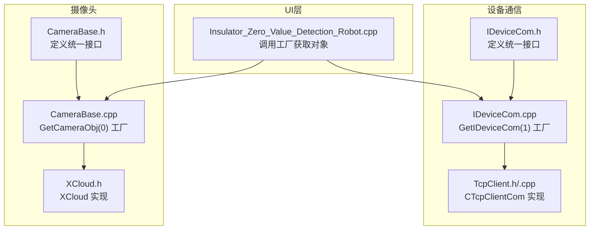
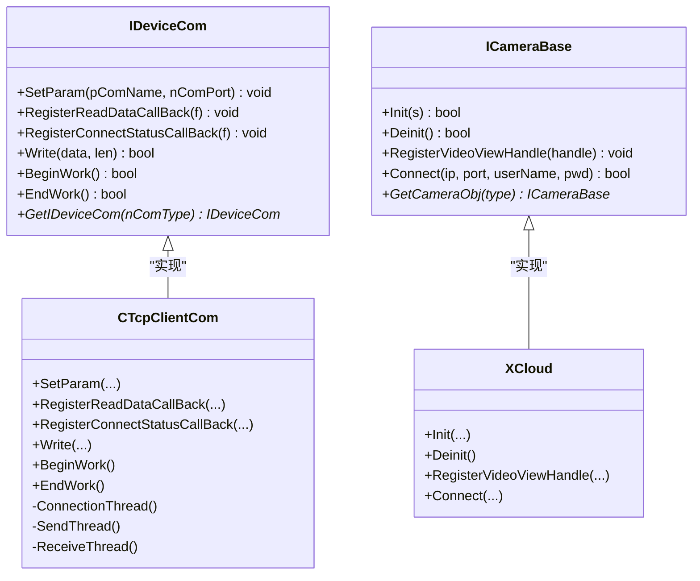
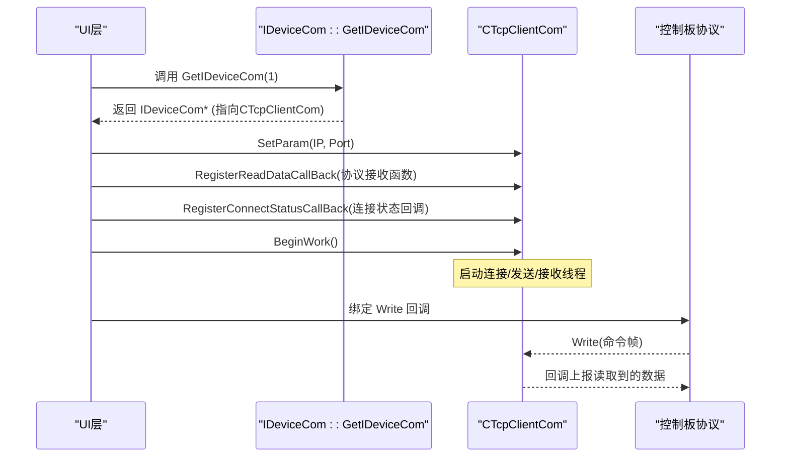
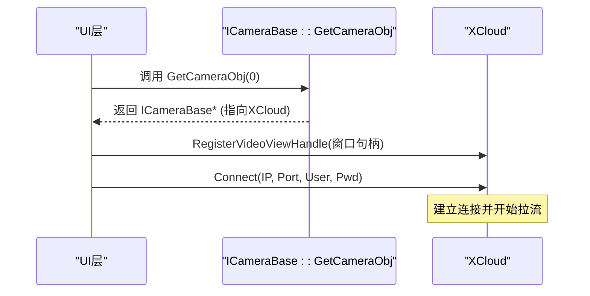
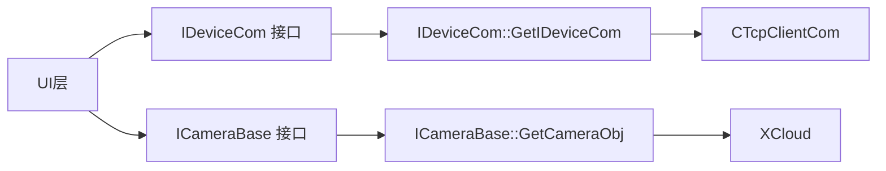
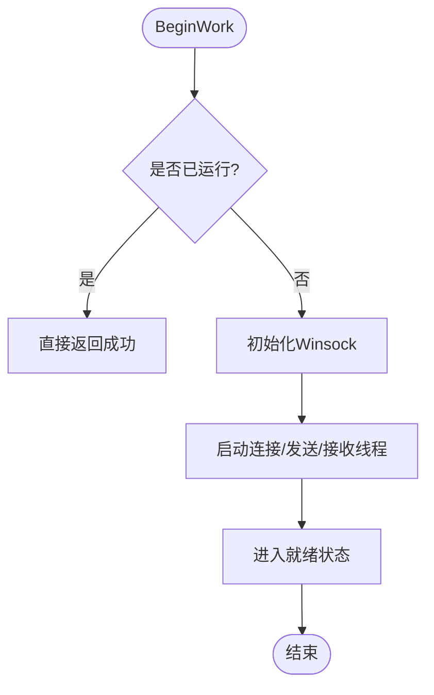

# 工厂模式应用

<cite>
**本文引用的文件**
- [IDeviceCom.h](file://Insulator_Zero_Value_Detection_Robot/DeviceCom/IDeviceCom.h)
- [IDeviceCom.cpp](file://Insulator_Zero_Value_Detection_Robot/DeviceCom/IDeviceCom.cpp)
- [TcpClient.h](file://Insulator_Zero_Value_Detection_Robot/DeviceCom/TcpClient.h)
- [TcpClient.cpp](file://Insulator_Zero_Value_Detection_Robot/DeviceCom/TcpClient.cpp)
- [CameraBase.h](file://Insulator_Zero_Value_Detection_Robot/Camera/CameraBase.h)
- [CameraBase.cpp](file://Insulator_Zero_Value_Detection_Robot/Camera/CameraBase.cpp)
- [XCloud.h](file://Insulator_Zero_Value_Detection_Robot/Camera/XCloud.h)
- [Insulator_Zero_Value_Detection_Robot.cpp](file://Insulator_Zero_Value_Detection_Robot/UI/Insulator_Zero_Value_Detection_Robot.cpp)
</cite>

## 目录
1. [简介](#简介)
2. [项目结构](#项目结构)
3. [核心组件](#核心组件)
4. [架构总览](#架构总览)
5. [详细组件分析](#详细组件分析)
6. [依赖关系分析](#依赖关系分析)
7. [性能与并发特性](#性能与并发特性)
8. [故障排查指南](#故障排查指南)
9. [结论](#结论)
10. [附录：扩展新设备类型步骤](#附录：扩展新设备类型步骤)

## 简介
本文件聚焦于绝缘子零值检测机器人V2中“工厂模式”在设备抽象层的应用。通过定义统一的设备通信接口 IDeviceCom 与摄像头接口 ICameraBase，并在各自静态工厂方法 GetIDeviceCom(1) 与 GetCameraObj(0) 中根据参数动态创建具体实现（如 TCP 客户端、云摄像头），实现了设备接入的松耦合与可扩展性。调用方仅依赖接口，无需感知具体实现细节，从而降低耦合度、提升可维护性与可测试性。

## 项目结构
围绕工厂模式的关键代码分布在以下模块：
- 设备通信抽象与工厂：DeviceCom/IDeviceCom.*，DeviceCom/TcpClient.*
- 摄像头抽象与工厂：Camera/CameraBase.*，Camera/XCloud.*
- UI层使用工厂创建实例并驱动工作流：UI/Insulator_Zero_Value_Detection_Robot.cpp

图表来源
- [IDeviceCom.h:1-15](file://Insulator_Zero_Value_Detection_Robot/DeviceCom/IDeviceCom.h#L1-L15)
- [IDeviceCom.cpp:1-13](file://Insulator_Zero_Value_Detection_Robot/DeviceCom/IDeviceCom.cpp#L1-L13)
- [TcpClient.h:1-47](file://Insulator_Zero_Value_Detection_Robot/DeviceCom/TcpClient.h#L1-L47)
- [CameraBase.h:1-15](file://Insulator_Zero_Value_Detection_Robot/Camera/CameraBase.h#L1-L15)
- [CameraBase.cpp:1-19](file://Insulator_Zero_Value_Detection_Robot/Camera/CameraBase.cpp#L1-L19)
- [XCloud.h:1-34](file://Insulator_Zero_Value_Detection_Robot/Camera/XCloud.h#L1-L34)
- [Insulator_Zero_Value_Detection_Robot.cpp:260-315](file://Insulator_Zero_Value_Detection_Robot/UI/Insulator_Zero_Value_Detection_Robot.cpp#L260-L315)

章节来源
- [IDeviceCom.h:1-15](file://Insulator_Zero_Value_Detection_Robot/DeviceCom/IDeviceCom.h#L1-L15)
- [IDeviceCom.cpp:1-13](file://Insulator_Zero_Value_Detection_Robot/DeviceCom/IDeviceCom.cpp#L1-L13)
- [CameraBase.h:1-15](file://Insulator_Zero_Value_Detection_Robot/Camera/CameraBase.h#L1-L15)
- [CameraBase.cpp:1-19](file://Insulator_Zero_Value_Detection_Robot/Camera/CameraBase.cpp#L1-L19)
- [Insulator_Zero_Value_Detection_Robot.cpp:260-315](file://Insulator_Zero_Value_Detection_Robot/UI/Insulator_Zero_Value_Detection_Robot.cpp#L260-L315)

## 核心组件
- IDeviceCom：设备通信的统一抽象接口，提供设置参数、注册回调、数据写入、开始/结束工作等能力；并提供静态工厂方法 GetIDeviceCom(int) 用于按类型创建具体通信实现。
- CTcpClientCom：基于TCP的客户端实现，封装连接、发送、接收线程及队列，暴露与 IDeviceCom 一致的接口。
- ICameraBase：摄像头的统一抽象接口，提供初始化、反初始化、视频句柄注册、连接等能力；并提供静态工厂方法 GetCameraObj(int) 用于按类型创建具体摄像头实现。
- XCloud：基于云SDK的摄像头实现，遵循 ICameraBase 接口约定。

章节来源
- [IDeviceCom.h:1-15](file://Insulator_Zero_Value_Detection_Robot/DeviceCom/IDeviceCom.h#L1-L15)
- [TcpClient.h:1-47](file://Insulator_Zero_Value_Detection_Robot/DeviceCom/TcpClient.h#L1-L47)
- [CameraBase.h:1-15](file://Insulator_Zero_Value_Detection_Robot/Camera/CameraBase.h#L1-L15)
- [XCloud.h:1-34](file://Insulator_Zero_Value_Detection_Robot/Camera/XCloud.h#L1-L34)

## 架构总览
工厂模式在本系统中的职责边界清晰：
- 接口层：IDeviceCom、ICameraBase 定义稳定契约，屏蔽底层差异。
- 工厂层：GetIDeviceCom、GetCameraObj 集中管理实例化逻辑，依据参数返回不同实现。
- 实现层：CTcpClientCom、XCloud 分别负责具体通信与摄像头操作。
- 调用层：UI 层通过工厂获取对象后，以统一方式配置与驱动设备。

图表来源
- [IDeviceCom.h:1-15](file://Insulator_Zero_Value_Detection_Robot/DeviceCom/IDeviceCom.h#L1-L15)
- [TcpClient.h:1-47](file://Insulator_Zero_Value_Detection_Robot/DeviceCom/TcpClient.h#L1-L47)
- [CameraBase.h:1-15](file://Insulator_Zero_Value_Detection_Robot/Camera/CameraBase.h#L1-L15)
- [XCloud.h:1-34](file://Insulator_Zero_Value_Detection_Robot/Camera/XCloud.h#L1-L34)

## 详细组件分析

### 设备通信工厂：GetIDeviceCom(1)
- 作用：根据传入的类型标识创建具体的设备通信对象。当前实现中，当类型为 1 时返回 TCP 客户端实例；其他情况返回空指针，便于调用方进行错误处理。
- 关键点：
  - 工厂位于接口类内部，调用方无需知道具体实现类名，降低耦合。
  - 新增通信协议只需新增一个实现类并在 switch 分支中添加对应类型即可。
- 典型调用路径：
  - UI 层调用 GetIDeviceCom(1) 获取 IDeviceCom 指针。
  - 设置参数（IP、端口）、注册读数据回调与连接状态回调。
  - 调用 BeginWork 启动后台线程进行收发。
  - 通过 Write 发送指令，接收数据由回调上报到协议层。

图表来源
- [IDeviceCom.cpp:1-13](file://Insulator_Zero_Value_Detection_Robot/DeviceCom/IDeviceCom.cpp#L1-L13)
- [TcpClient.h:1-47](file://Insulator_Zero_Value_Detection_Robot/DeviceCom/TcpClient.h#L1-L47)
- [Insulator_Zero_Value_Detection_Robot.cpp:260-315](file://Insulator_Zero_Value_Detection_Robot/UI/Insulator_Zero_Value_Detection_Robot.cpp#L260-L315)

章节来源
- [IDeviceCom.cpp:1-13](file://Insulator_Zero_Value_Detection_Robot/DeviceCom/IDeviceCom.cpp#L1-L13)
- [Insulator_Zero_Value_Detection_Robot.cpp:260-315](file://Insulator_Zero_Value_Detection_Robot/UI/Insulator_Zero_Value_Detection_Robot.cpp#L260-L315)

### 摄像头工厂：GetCameraObj(0)
- 作用：根据类型标识创建具体摄像头对象。当前实现中，类型为 0 时返回云摄像头 XCloud 实例；其他情况返回空指针。
- 关键点：
  - 工厂将摄像头SDK细节隐藏在实现类中，UI 层只关心统一接口。
  - 支持多路摄像头同时创建与管理。
- 典型调用路径：
  - UI 层根据配置决定使用新摄像头或旧方案。
  - 调用 GetCameraObj(0) 获取 ICameraBase 指针。
  - 注册视频显示句柄，启动连接线程完成登录与取流。

图表来源
- [CameraBase.cpp:1-19](file://Insulator_Zero_Value_Detection_Robot/Camera/CameraBase.cpp#L1-L19)
- [XCloud.h:1-34](file://Insulator_Zero_Value_Detection_Robot/Camera/XCloud.h#L1-L34)
- [Insulator_Zero_Value_Detection_Robot.cpp:292-315](file://Insulator_Zero_Value_Detection_Robot/UI/Insulator_Zero_Value_Detection_Robot.cpp#L292-L315)

章节来源
- [CameraBase.cpp:1-19](file://Insulator_Zero_Value_Detection_Robot/Camera/CameraBase.cpp#L1-L19)
- [Insulator_Zero_Value_Detection_Robot.cpp:292-315](file://Insulator_Zero_Value_Detection_Robot/UI/Insulator_Zero_Value_Detection_Robot.cpp#L292-L315)

### 工厂模式在设备抽象层中的作用
- 解耦：调用方仅依赖接口，不依赖具体实现类，避免硬编码 new 具体类带来的紧耦合。
- 集中管理：所有实例化逻辑集中在工厂方法内，便于统一添加日志、统计、资源限制等横切关注点。
- 易扩展：新增设备类型只需新增实现类并在工厂 switch 分支中添加映射，不影响现有调用方。
- 易替换：在不改变上层调用的前提下，可替换底层实现（例如更换摄像头SDK或通信协议）。

章节来源
- [IDeviceCom.h:1-15](file://Insulator_Zero_Value_Detection_Robot/DeviceCom/IDeviceCom.h#L1-L15)
- [CameraBase.h:1-15](file://Insulator_Zero_Value_Detection_Robot/Camera/CameraBase.h#L1-L15)

## 依赖关系分析
- 调用方对工厂的依赖是稳定的（接口+静态方法），对实现的依赖被隔离在工厂内部。
- 工厂内部包含对具体实现的头文件引用，形成单向依赖：UI -> 工厂 -> 实现。
- 通过回调机制，实现层与协议层/UI层解耦，避免循环依赖。

图表来源
- [IDeviceCom.cpp:1-13](file://Insulator_Zero_Value_Detection_Robot/DeviceCom/IDeviceCom.cpp#L1-L13)
- [CameraBase.cpp:1-19](file://Insulator_Zero_Value_Detection_Robot/Camera/CameraBase.cpp#L1-L19)
- [TcpClient.h:1-47](file://Insulator_Zero_Value_Detection_Robot/DeviceCom/TcpClient.h#L1-L47)
- [XCloud.h:1-34](file://Insulator_Zero_Value_Detection_Robot/Camera/XCloud.h#L1-L34)

章节来源
- [Insulator_Zero_Value_Detection_Robot.cpp:260-315](file://Insulator_Zero_Value_Detection_Robot/UI/Insulator_Zero_Value_Detection_Robot.cpp#L260-L315)

## 性能与并发特性
- TCP 客户端采用多线程模型：连接线程、发送线程、接收线程分离，配合条件变量与队列实现高效异步收发。
- 原子标志位与互斥量保护共享状态，避免竞态条件。
- 工厂方法本身为轻量级分支判断，开销极低；实际性能瓶颈在于网络I/O与摄像头SDK。

图表来源
- [TcpClient.cpp:59-70](file://Insulator_Zero_Value_Detection_Robot/DeviceCom/TcpClient.cpp#L59-L70)

章节来源
- [TcpClient.cpp:59-70](file://Insulator_Zero_Value_Detection_Robot/DeviceCom/TcpClient.cpp#L59-L70)

## 故障排查指南
- 工厂返回空指针：检查传入类型是否正确（设备通信为 1，摄像头为 0）；若为未知类型，需扩展工厂分支。
- 无法连接设备：确认 SetParam 设置的 IP/端口正确；检查 BeginWork 是否成功；查看连接状态回调返回值。
- 无数据回调：确认已正确注册 ReadData 回调；检查网络连通性与协议帧格式。
- 摄像头无画面：确认已注册视频句柄；检查 Connect 参数与权限；查看 SDK 回调与错误码。

章节来源
- [IDeviceCom.cpp:1-13](file://Insulator_Zero_Value_Detection_Robot/DeviceCom/IDeviceCom.cpp#L1-L13)
- [CameraBase.cpp:1-19](file://Insulator_Zero_Value_Detection_Robot/Camera/CameraBase.cpp#L1-L19)
- [Insulator_Zero_Value_Detection_Robot.cpp:260-315](file://Insulator_Zero_Value_Detection_Robot/UI/Insulator_Zero_Value_Detection_Robot.cpp#L260-L315)

## 结论
通过工厂模式，本项目在设备抽象层实现了清晰的职责划分与松耦合设计。调用方仅需依赖稳定接口，并通过工厂方法按需获取具体实现，既简化了初始化流程，又提升了系统的可维护性与可扩展性。未来新增设备类型时，只需在工厂中增加映射并实现相应接口，即可无缝集成。

## 附录：扩展新设备类型步骤
- 新增设备通信类型（示例：串口通信）：
  - 新建实现类继承 IDeviceCom，实现 SetParam、RegisterReadDataCallBack、RegisterConnectStatusCallBack、Write、BeginWork、EndWork。
  - 在 IDeviceCom::GetIDeviceCom 中新增 case 分支，返回新实现实例。
  - 在 UI 层通过新的类型标识调用工厂获取并使用。
- 新增摄像头类型（示例：本地SDK摄像头）：
  - 新建实现类继承 ICameraBase，实现 Init、Deinit、RegisterVideoViewHandle、Connect。
  - 在 ICameraBase::GetCameraObj 中新增 case 分支，返回新实现实例。
  - 在 UI 层通过新的类型标识调用工厂获取并使用。

章节来源
- [IDeviceCom.h:1-15](file://Insulator_Zero_Value_Detection_Robot/DeviceCom/IDeviceCom.h#L1-L15)
- [IDeviceCom.cpp:1-13](file://Insulator_Zero_Value_Detection_Robot/DeviceCom/IDeviceCom.cpp#L1-L13)
- [CameraBase.h:1-15](file://Insulator_Zero_Value_Detection_Robot/Camera/CameraBase.h#L1-L15)
- [CameraBase.cpp:1-19](file://Insulator_Zero_Value_Detection_Robot/Camera/CameraBase.cpp#L1-L19)