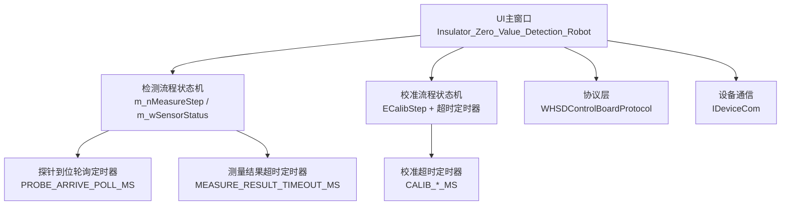
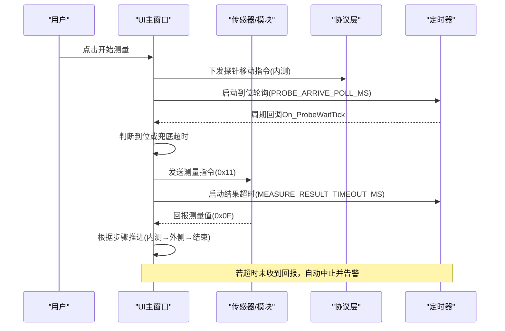
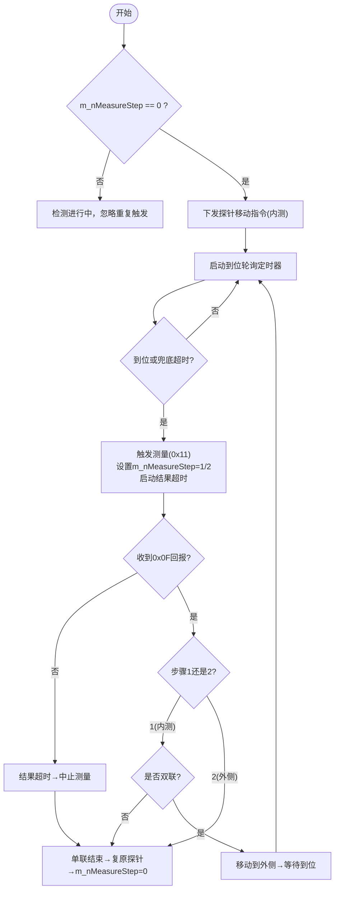
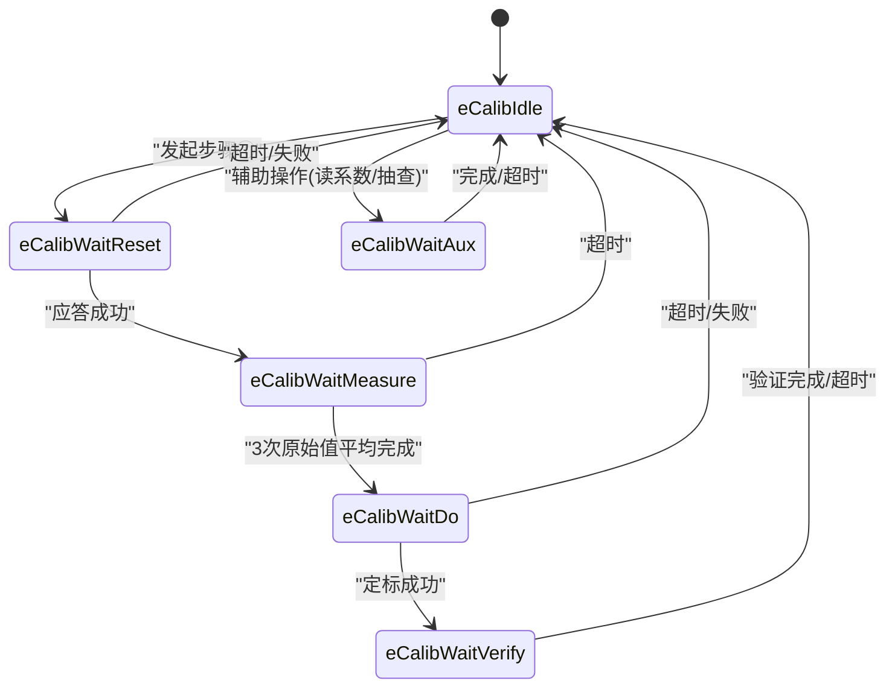
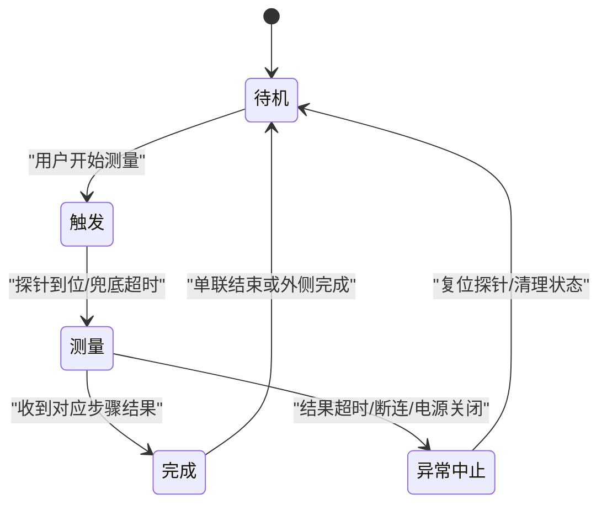
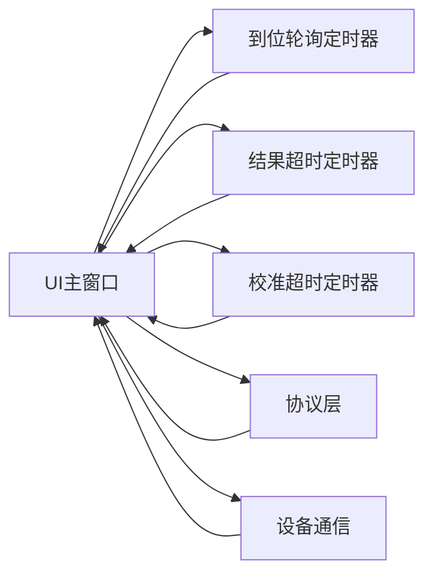

# 状态机模式应用

<cite>
**本文引用的文件**
- [Insulator_Zero_Value_Detection_Robot.h](file://Insulator_Zero_Value_Detection_Robot/UI/Insulator_Zero_Value_Detection_Robot.h)
- [Insulator_Zero_Value_Detection_Robot.cpp](file://Insulator_Zero_Value_Detection_Robot/UI/Insulator_Zero_Value_Detection_Robot.cpp)
</cite>

## 目录
1. [简介](#简介)
2. [项目结构](#项目结构)
3. [核心组件](#核心组件)
4. [架构总览](#架构总览)
5. [详细组件分析](#详细组件分析)
6. [依赖关系分析](#依赖关系分析)
7. [性能考虑](#性能考虑)
8. [故障排查指南](#故障排查指南)
9. [结论](#结论)
10. [附录](#附录)

## 简介
本文件聚焦绝缘子零值检测机器人V2中“状态机模式”的应用，重点解析两类业务流程的状态管理：
- 检测流程：待机→触发→测量→完成（含异常自动结束）
- 校准流程：单点定标步骤①~④的有序推进与超时处理

通过明确的状态变量、定时器与信号槽协作，系统实现了可预测、可恢复、可观测的业务流程控制。

## 项目结构
与状态机相关的实现集中在UI主窗口类中，包含：
- 检测流程状态机：探针到位轮询、结果超时、异常中止
- 校准流程状态机：按步骤顺序执行，等待下位机应答/回报，超时统一处理

图表来源
- [Insulator_Zero_Value_Detection_Robot.h:294-325](file://Insulator_Zero_Value_Detection_Robot/UI/Insulator_Zero_Value_Detection_Robot.h#L294-L325)
- [Insulator_Zero_Value_Detection_Robot.cpp:55-73](file://Insulator_Zero_Value_Detection_Robot/UI/Insulator_Zero_Value_Detection_Robot.cpp#L55-L73)

章节来源
- [Insulator_Zero_Value_Detection_Robot.h:294-325](file://Insulator_Zero_Value_Detection_Robot/UI/Insulator_Zero_Value_Detection_Robot.h#L294-L325)
- [Insulator_Zero_Value_Detection_Robot.cpp:55-73](file://Insulator_Zero_Value_Detection_Robot/UI/Insulator_Zero_Value_Detection_Robot.cpp#L55-L73)

## 核心组件
- 检测流程状态变量
  - m_nMeasureStep：当前测量步骤（0=空闲；1=等待内测结果；2=等待外侧结果）
  - m_wSensorStatus：传感器/设备状态（用于界面显示：待机、触发、触发完成等）
- 校准流程状态枚举
  - ECalibStep：eCalibIdle/eCalibWaitReset/eCalibWaitMeasure/eCalibWaitDo/eCalibWaitVerify/eCalibWaitAux
- 关键定时器
  - 检测：m_pProbeWaitTimer（到位轮询）、m_pMeasureTimeoutTimer（结果超时）
  - 校准：m_pCalibTimeoutTimer（各步骤超时）
- 关键参数
  - 检测：PROBE_ARRIVE_POLL_MS、PROBE_ARRIVE_TIMEOUT_MS、MEASURE_RESULT_TIMEOUT_MS
  - 校准：CALIB_MEASURE_TIMEOUT_MS、CALIB_FLASH_TIMEOUT_MS、CALIB_CMD_TIMEOUT_MS、CALIB_MEASURE_INTERVAL_MS、CALIB_MEASURE_COUNT

章节来源
- [Insulator_Zero_Value_Detection_Robot.h:294-325](file://Insulator_Zero_Value_Detection_Robot/UI/Insulator_Zero_Value_Detection_Robot.h#L294-L325)
- [Insulator_Zero_Value_Detection_Robot.cpp:55-73](file://Insulator_Zero_Value_Detection_Robot/UI/Insulator_Zero_Value_Detection_Robot.cpp#L55-L73)

## 架构总览
状态机由“事件驱动+定时器兜底”构成：
- 检测流程：用户触发→探针移动到内测→轮询到位或超时→触发测量并启动结果超时→收到结果后进入下一步或结束→异常时自动中止
- 校准流程：按步骤顺序发起命令→进入等待态→收到应答/回报则推进到下一步→超时则记录失败并回到空闲

图表来源
- [Insulator_Zero_Value_Detection_Robot.cpp:2062-2139](file://Insulator_Zero_Value_Detection_Robot/UI/Insulator_Zero_Value_Detection_Robot.cpp#L2062-L2139)
- [Insulator_Zero_Value_Detection_Robot.cpp:2186-2233](file://Insulator_Zero_Value_Detection_Robot/UI/Insulator_Zero_Value_Detection_Robot.cpp#L2186-L2233)

## 详细组件分析

### 检测流程状态机（待机→触发→测量→完成）
- 状态定义与流转
  - 初始：m_nMeasureStep = 0（空闲），界面显示“待机”
  - 触发：用户点击开始测量，进入内测等待，界面显示“检测中”
  - 测量：探针到位后触发测量，设置m_nMeasureStep为1或2，启动结果超时定时器
  - 完成：收到对应步骤的结果后，推进或清零m_nMeasureStep，界面恢复“待机”
- 关键变量
  - m_nMeasureStep：仅UI线程读写，表示当前测量步骤
  - m_wSensorStatus：来自设备心跳/状态上报，用于界面显示（待机/触发/触发完成/未找到设备等）
- 超时与异常
  - 结果超时：MEASURE_RESULT_TIMEOUT_MS内未收到回报，自动中止测量、复位探针、关闭弹窗、记录告警
  - 断连/电源关闭：在到位轮询中检测到控制板断开或总电源已确认关闭，立即中止并告警

图表来源
- [Insulator_Zero_Value_Detection_Robot.cpp:2062-2139](file://Insulator_Zero_Value_Detection_Robot/UI/Insulator_Zero_Value_Detection_Robot.cpp#L2062-L2139)
- [Insulator_Zero_Value_Detection_Robot.cpp:2186-2233](file://Insulator_Zero_Value_Detection_Robot/UI/Insulator_Zero_Value_Detection_Robot.cpp#L2186-L2233)

章节来源
- [Insulator_Zero_Value_Detection_Robot.cpp:504-531](file://Insulator_Zero_Value_Detection_Robot/UI/Insulator_Zero_Value_Detection_Robot.cpp#L504-L531)
- [Insulator_Zero_Value_Detection_Robot.cpp:2062-2139](file://Insulator_Zero_Value_Detection_Robot/UI/Insulator_Zero_Value_Detection_Robot.cpp#L2062-L2139)
- [Insulator_Zero_Value_Detection_Robot.cpp:2186-2233](file://Insulator_Zero_Value_Detection_Robot/UI/Insulator_Zero_Value_Detection_Robot.cpp#L2186-L2233)

### 校准流程状态机（单点定标）
- 状态定义
  - eCalibIdle：空闲，允许发起步骤①
  - eCalibWaitReset：等待0x05恢复默认应答
  - eCalibWaitMeasure：等待0x0F原始值回报（连测3次取平均）
  - eCalibWaitDo：等待0x0E定标应答（写Flash）
  - eCalibWaitVerify：等待0x0F修正值回报（验证）
  - eCalibWaitAux：等待0x0C读回系数/0x0A离线抽查应答
- 超时参数与作用
  - CALIB_MEASURE_TIMEOUT_MS：0x0F约3.2秒回报，超时≥5秒，防止卡死
  - CALIB_FLASH_TIMEOUT_MS：0x0E需擦写Flash耗时1~2秒，超时≥3秒
  - CALIB_CMD_TIMEOUT_MS：普通命令应答较快，超时3秒
  - CALIB_MEASURE_INTERVAL_MS：两次测量间隔，给模块读数稳定时间
  - CALIB_MEASURE_COUNT：连测次数（建议2~3次取平均）
- 流程推进
  - 步骤①：恢复默认→等待应答→成功则置位m_bCalibResetDone
  - 步骤②：触发测量→收集3次原始值→计算平均值→置位m_bCalibRawDone
  - 步骤③：下发定标→等待应答→成功写入Flash→置位m_bCalibDoDone
  - 步骤④：验证/抽查→等待应答/回报→展示误差或结果

图表来源
- [Insulator_Zero_Value_Detection_Robot.h:317-325](file://Insulator_Zero_Value_Detection_Robot/UI/Insulator_Zero_Value_Detection_Robot.h#L317-L325)
- [Insulator_Zero_Value_Detection_Robot.cpp:974-1313](file://Insulator_Zero_Value_Detection_Robot/UI/Insulator_Zero_Value_Detection_Robot.cpp#L974-L1313)

章节来源
- [Insulator_Zero_Value_Detection_Robot.h:317-325](file://Insulator_Zero_Value_Detection_Robot/UI/Insulator_Zero_Value_Detection_Robot.h#L317-L325)
- [Insulator_Zero_Value_Detection_Robot.cpp:974-1313](file://Insulator_Zero_Value_Detection_Robot/UI/Insulator_Zero_Value_Detection_Robot.cpp#L974-L1313)

### 状态转换图（检测流程）

图表来源
- [Insulator_Zero_Value_Detection_Robot.cpp:2062-2139](file://Insulator_Zero_Value_Detection_Robot/UI/Insulator_Zero_Value_Detection_Robot.cpp#L2062-L2139)
- [Insulator_Zero_Value_Detection_Robot.cpp:2186-2233](file://Insulator_Zero_Value_Detection_Robot/UI/Insulator_Zero_Value_Detection_Robot.cpp#L2186-L2233)

### 代码级示例（路径引用）
- 检测流程入口与状态推进
  - [开始测量入口:2030-2071](file://Insulator_Zero_Value_Detection_Robot/UI/Insulator_Zero_Value_Detection_Robot.cpp#L2030-L2071)
  - [探针到位轮询与触发测量:2073-2139](file://Insulator_Zero_Value_Detection_Robot/UI/Insulator_Zero_Value_Detection_Robot.cpp#L2073-L2139)
  - [结果处理与步骤推进:2186-2233](file://Insulator_Zero_Value_Detection_Robot/UI/Insulator_Zero_Value_Detection_Robot.cpp#L2186-L2233)
  - [异常中止与复位:2141-2178](file://Insulator_Zero_Value_Detection_Robot/UI/Insulator_Zero_Value_Detection_Robot.cpp#L2141-L2178)
- 校准流程状态控制
  - [步骤①恢复默认:974-977](file://Insulator_Zero_Value_Detection_Robot/UI/Insulator_Zero_Value_Detection_Robot.cpp#L974-L977)
  - [步骤②测原始值:979-1005](file://Insulator_Zero_Value_Detection_Robot/UI/Insulator_Zero_Value_Detection_Robot.cpp#L979-L1005)
  - [步骤③下发定标:1078-1114](file://Insulator_Zero_Value_Detection_Robot/UI/Insulator_Zero_Value_Detection_Robot.cpp#L1078-L1114)
  - [步骤④验证/抽查:1116-1158](file://Insulator_Zero_Value_Detection_Robot/UI/Insulator_Zero_Value_Detection_Robot.cpp#L1116-L1158)
  - [超时处理:1267-1313](file://Insulator_Zero_Value_Detection_Robot/UI/Insulator_Zero_Value_Detection_Robot.cpp#L1267-L1313)

## 依赖关系分析
- 检测流程依赖
  - 定时器：m_pProbeWaitTimer、m_pMeasureTimeoutTimer
  - 协议：DeviceRun(探针移动)、SensorCmd(测量触发)
  - 设备状态：m_bControlBroadConnected、IsMainPowerConfirmedOff()
- 校准流程依赖
  - 定时器：m_pCalibTimeoutTimer
  - 协议：CalibReset/CalibTriggerMeasure/CalibSinglePoint/CalibVerify/CalibReadCoef
  - 标志位：m_bCalibMeasuring、m_bCalibResetDone/m_bCalibRawDone/m_bCalibDoDone

图表来源
- [Insulator_Zero_Value_Detection_Robot.h:294-325](file://Insulator_Zero_Value_Detection_Robot/UI/Insulator_Zero_Value_Detection_Robot.h#L294-L325)
- [Insulator_Zero_Value_Detection_Robot.cpp:55-73](file://Insulator_Zero_Value_Detection_Robot/UI/Insulator_Zero_Value_Detection_Robot.cpp#L55-L73)

章节来源
- [Insulator_Zero_Value_Detection_Robot.h:294-325](file://Insulator_Zero_Value_Detection_Robot/UI/Insulator_Zero_Value_Detection_Robot.h#L294-L325)
- [Insulator_Zero_Value_Detection_Robot.cpp:55-73](file://Insulator_Zero_Value_Detection_Robot/UI/Insulator_Zero_Value_Detection_Robot.cpp#L55-L73)

## 性能考虑
- 定时器粒度
  - 到位轮询周期短（100ms）以快速响应到位信号，减少等待时间
  - 结果超时合理设置（8s）覆盖0x0F约3.2秒回报，避免误判
- 资源占用
  - 仅在需要时创建/启动定时器，完成后停止，避免常驻开销
- 并发安全
  - m_bProbeArrived使用原子变量，跨线程安全
  - 心跳快照加锁保护，避免读到写一半的数据

[本节为通用性能讨论，不直接分析具体文件]

## 故障排查指南
- 常见问题定位
  - 测量无返回值：检查MEASURE_RESULT_TIMEOUT_MS是否过短；查看日志“测量流程:结果超时”
  - 探针不动：检查控制板连接与总电源状态；查看“控制板已断开/总电源已关闭”告警
  - 校准失败：根据原因码（0x01/0x04/0x05/0x09）定位问题；检查链路心跳与参数合法性
- 日志与提示
  - 校准日志：步骤状态标签与textEdit_CalibLog追加信息
  - 测量日志：步骤推进、超时、异常中止均记录详细原因

章节来源
- [Insulator_Zero_Value_Detection_Robot.cpp:1267-1313](file://Insulator_Zero_Value_Detection_Robot/UI/Insulator_Zero_Value_Detection_Robot.cpp#L1267-L1313)
- [Insulator_Zero_Value_Detection_Robot.cpp:2141-2178](file://Insulator_Zero_Value_Detection_Robot/UI/Insulator_Zero_Value_Detection_Robot.cpp#L2141-L2178)

## 结论
状态机模式在本项目中有效保障了检测与校准流程的正确性与可预测性：
- 明确的状态变量与枚举使流程清晰可控
- 定时器兜底确保异常场景下的自愈能力
- 信号槽与标志位协同实现跨线程安全与解耦
- 超时参数与步骤完成标志保证业务逻辑的严谨性

最佳实践
- 将复杂流程拆分为有限状态，每个状态职责单一
- 用定时器兜底避免阻塞与死锁
- 通过日志与UI状态反馈提升可观测性
- 对关键标志使用原子类型或互斥锁保护

[本节为总结性内容，不直接分析具体文件]

## 附录
- 关键常量参考
  - 检测：PROBE_ARRIVE_POLL_MS、PROBE_ARRIVE_TIMEOUT_MS、MEASURE_RESULT_TIMEOUT_MS
  - 校准：CALIB_MEASURE_TIMEOUT_MS、CALIB_FLASH_TIMEOUT_MS、CALIB_CMD_TIMEOUT_MS、CALIB_MEASURE_INTERVAL_MS、CALIB_MEASURE_COUNT

章节来源
- [Insulator_Zero_Value_Detection_Robot.cpp:55-73](file://Insulator_Zero_Value_Detection_Robot/UI/Insulator_Zero_Value_Detection_Robot.cpp#L55-L73)