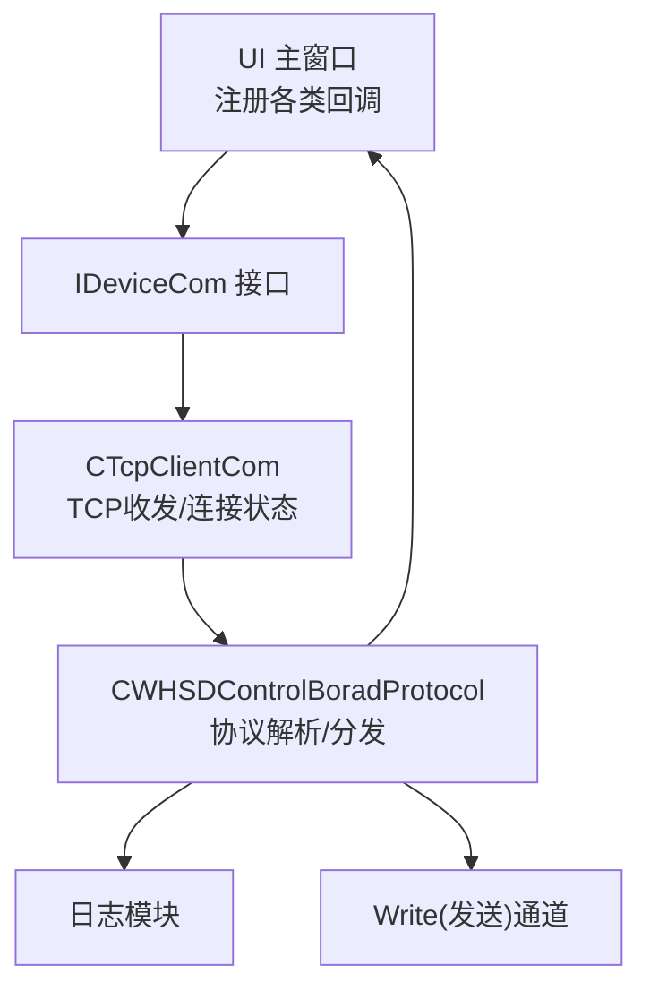
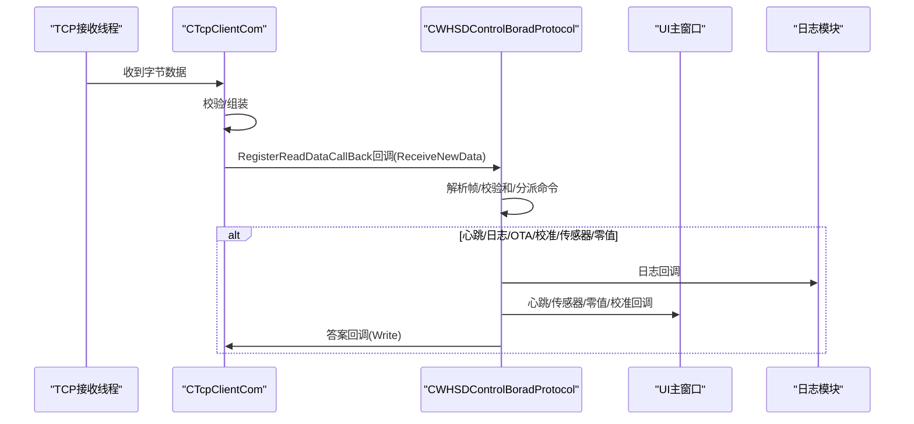
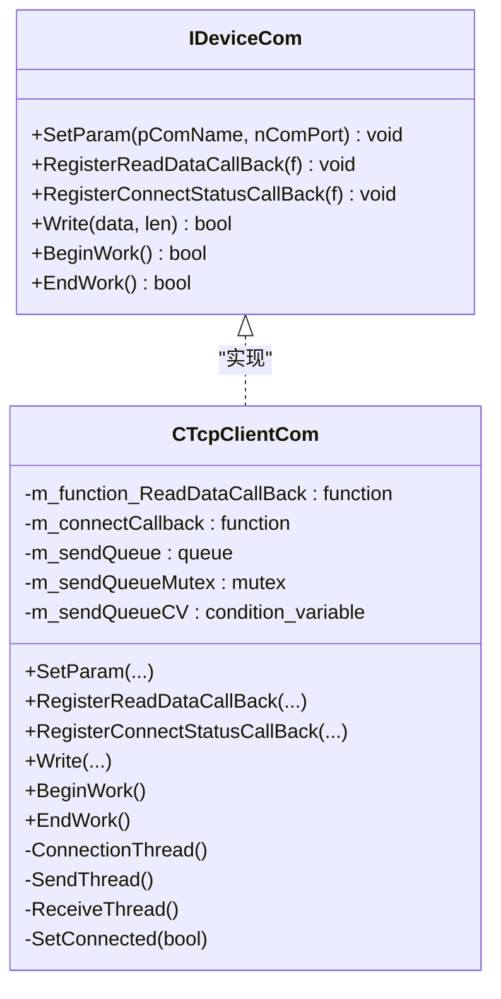
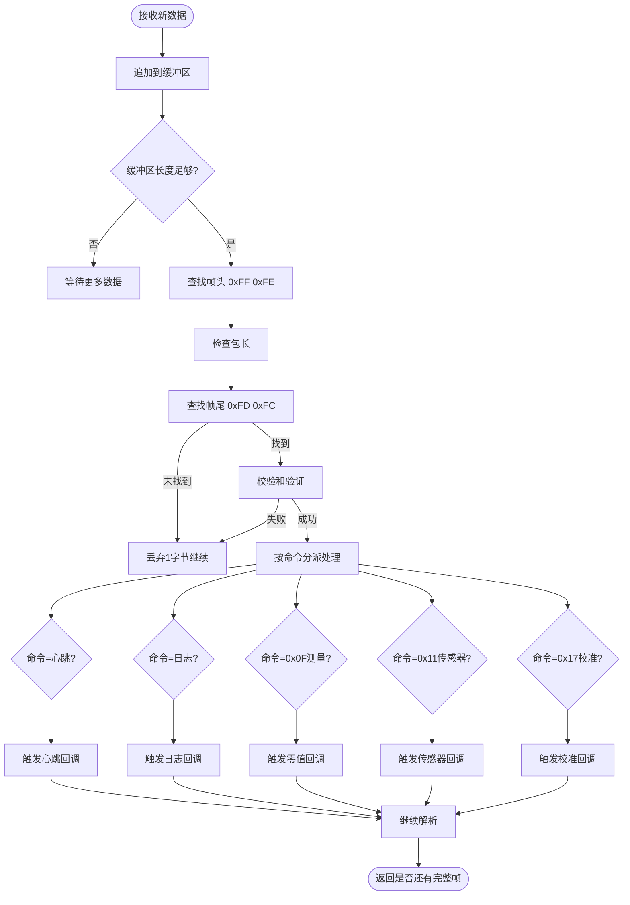
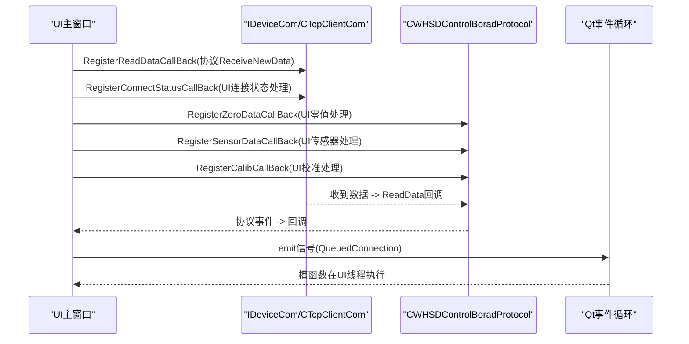
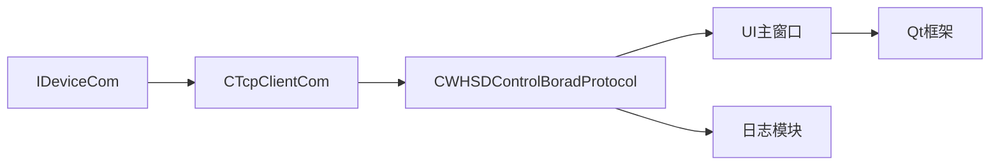

# 观察者模式应用

<cite>
**本文引用的文件**
- [IDeviceCom.h](file://Insulator_Zero_Value_Detection_Robot/DeviceCom/IDeviceCom.h)
- [IDeviceCom.cpp](file://Insulator_Zero_Value_Detection_Robot/DeviceCom/IDeviceCom.cpp)
- [TcpClient.h](file://Insulator_Zero_Value_Detection_Robot/DeviceCom/TcpClient.h)
- [TcpClient.cpp](file://Insulator_Zero_Value_Detection_Robot/DeviceCom/TcpClient.cpp)
- [WHSDControlBoradProtocol.h](file://Insulator_Zero_Value_Detection_Robot/Protocol/WHSDControlBoradProtocol.h)
- [WHSDControlBoradProtocol.cpp](file://Insulator_Zero_Value_Detection_Robot/Protocol/WHSDControlBoradProtocol.cpp)
- [Insulator_Zero_Value_Detection_Robot.h](file://Insulator_Zero_Value_Detection_Robot/UI/Insulator_Zero_Value_Detection_Robot.h)
- [Insulator_Zero_Value_Detection_Robot.cpp](file://Insulator_Zero_Value_Detection_Robot/UI/Insulator_Zero_Value_Detection_Robot.cpp)
</cite>

## 目录
1. [简介](#简介)
2. [项目结构](#项目结构)
3. [核心组件](#核心组件)
4. [架构总览](#架构总览)
5. [详细组件分析](#详细组件分析)
6. [依赖关系分析](#依赖关系分析)
7. [性能与并发注意事项](#性能与并发注意事项)
8. [故障排查指南](#故障排查指南)
9. [结论](#结论)
10. [附录：注册与处理示例路径](#附录注册与处理示例路径)

## 简介
本文件聚焦于绝缘子零值检测机器人V2中“观察者模式”的应用，重点说明设备通信、协议解析与UI更新之间的松耦合通信机制。文档围绕以下关键点展开：
- 回调函数机制的实现：RegisterReadDataCallBack、RegisterConnectStatusCallBack、RegisterSensorDataCallBack等注册方法的工作原理
- std::bind与std::placeholders的使用方式
- 信号槽机制与观察者模式的结合（Qt信号槽跨线程安全）
- 异步事件与多线程环境下的优势与注意事项
- 具体代码示例的引用路径（不直接粘贴源码）

## 项目结构
本项目采用分层设计：
- 设备通信层：IDeviceCom接口与CTcpClientCom实现，负责TCP连接、收发数据与连接状态管理
- 协议解析层：CWHSDControlBoardProtocol，负责帧解析、命令封装、心跳、OTA、传感器数据分发
- UI层：主窗口类通过注册回调接收协议事件，并更新界面、记录日志、驱动测量流程

图表来源
- [IDeviceCom.h:4-14](file://Insulator_Zero_Value_Detection_Robot/DeviceCom/IDeviceCom.h#L4-L14)
- [TcpClient.h:8-46](file://Insulator_Zero_Value_Detection_Robot/DeviceCom/TcpClient.h#L8-L46)
- [WHSDControlBoradProtocol.h:189-355](file://Insulator_Zero_Value_Detection_Robot/Protocol/WHSDControlBoradProtocol.h#L189-L355)
- [Insulator_Zero_Value_Detection_Robot.h:26-385](file://Insulator_Zero_Value_Detection_Robot/UI/Insulator_Zero_Value_Detection_Robot.h#L26-L385)

章节来源
- [IDeviceCom.h:4-14](file://Insulator_Zero_Value_Detection_Robot/DeviceCom/IDeviceCom.h#L4-L14)
- [TcpClient.h:8-46](file://Insulator_Zero_Value_Detection_Robot/DeviceCom/TcpClient.h#L8-L46)
- [WHSDControlBoradProtocol.h:189-355](file://Insulator_Zero_Value_Detection_Robot/Protocol/WHSDControlBoradProtocol.h#L189-L355)
- [Insulator_Zero_Value_Detection_Robot.h:26-385](file://Insulator_Zero_Value_Detection_Robot/UI/Insulator_Zero_Value_Detection_Robot.h#L26-L385)

## 核心组件
- IDeviceCom：定义设备通信抽象接口，提供注册读数据回调、注册连接状态回调、写数据、开始/结束工作等方法
- CTcpClientCom：基于Winsock的TCP客户端实现，维护连接线程、发送队列、接收线程；在收到数据或连接状态变化时调用已注册的回调
- CWHSDControlBoradProtocol：协议解析器，维护多种回调（答案回调、零值回调、心跳回调、日志回调、OTA状态回调、传感器数据回调、校准应答回调），将底层字节流解析为高层事件
- UI主窗口：注册上述回调，使用std::bind绑定成员方法与参数占位符，并通过Qt信号槽将协议线程的事件切换到UI线程执行

章节来源
- [IDeviceCom.h:4-14](file://Insulator_Zero_Value_Detection_Robot/DeviceCom/IDeviceCom.h#L4-L14)
- [TcpClient.h:8-46](file://Insulator_Zero_Value_Detection_Robot/DeviceCom/TcpClient.h#L8-L46)
- [WHSDControlBoradProtocol.h:189-355](file://Insulator_Zero_Value_Detection_Robot/Protocol/WHSDControlBoradProtocol.h#L189-L355)
- [Insulator_Zero_Value_Detection_Robot.h:26-385](file://Insulator_Zero_Value_Detection_Robot/UI/Insulator_Zero_Value_Detection_Robot.h#L26-L385)

## 架构总览
观察者模式在本系统中的体现：
- 发布者（Subject）：设备通信层（TCP）与协议解析层（协议）
- 订阅者（Observer）：UI主窗口、日志模块、业务逻辑模块
- 解耦点：通过std::function存储回调指针，发布者在适当时机调用回调，无需知道订阅者具体类型

图表来源
- [TcpClient.cpp:301-382](file://Insulator_Zero_Value_Detection_Robot/DeviceCom/TcpClient.cpp#L301-L382)
- [WHSDControlBoradProtocol.cpp:213-444](file://Insulator_Zero_Value_Detection_Robot/Protocol/WHSDControlBoradProtocol.cpp#L213-L444)
- [Insulator_Zero_Value_Detection_Robot.cpp:273-285](file://Insulator_Zero_Value_Detection_Robot/UI/Insulator_Zero_Value_Detection_Robot.cpp#L273-L285)

## 详细组件分析

### 设备通信层：IDeviceCom与CTcpClientCom
- IDeviceCom定义了统一的回调注册接口：
  - RegisterReadDataCallBack：用于将底层收到的原始数据转发给上层（通常是协议解析器）
  - RegisterConnectStatusCallBack：用于通知连接状态变化（连接成功/断开）
- CTcpClientCom内部维护：
  - 连接线程：周期性尝试连接，成功后设置m_connected并触发连接状态回调
  - 发送线程：从队列取数据发送，失败则置断连
  - 接收线程：使用select阻塞等待数据，收到后调用ReadData回调
  - 条件变量与互斥锁：保证发送队列的线程安全

图表来源
- [IDeviceCom.h:4-14](file://Insulator_Zero_Value_Detection_Robot/DeviceCom/IDeviceCom.h#L4-L14)
- [TcpClient.h:8-46](file://Insulator_Zero_Value_Detection_Robot/DeviceCom/TcpClient.h#L8-L46)

章节来源
- [IDeviceCom.h:4-14](file://Insulator_Zero_Value_Detection_Robot/DeviceCom/IDeviceCom.h#L4-L14)
- [TcpClient.cpp:21-121](file://Insulator_Zero_Value_Detection_Robot/DeviceCom/TcpClient.cpp#L21-L121)
- [TcpClient.cpp:123-236](file://Insulator_Zero_Value_Detection_Robot/DeviceCom/TcpClient.cpp#L123-L236)
- [TcpClient.cpp:238-382](file://Insulator_Zero_Value_Detection_Robot/DeviceCom/TcpClient.cpp#L238-L382)

### 协议解析层：CWHSDControlBoradProtocol
- 维护多类回调：
  - RegisterAnswerFunction：用于将需要回发的数据交给通信层发送
  - RegisterZeroDataCallBack：上报测量结果（零值）
  - RegisterDeviceHeartBeat：上报心跳信息
  - RegisterDeviceLog：输出日志
  - RegisterOTAStatus：上报OTA进度/状态
  - RegisterSensorDataCallBack：上报传感器指令反馈
  - RegisterCalibCallBack：上报校准命令应答
- 解析流程：
  - ReceiveNewData：将新数据追加到缓冲区
  - Parse：查找帧头/帧尾、校验和，按命令分派处理，必要时触发对应回调
  - Answer：根据命令生成应答帧并通过答案回调发送

图表来源
- [WHSDControlBoradProtocol.cpp:213-444](file://Insulator_Zero_Value_Detection_Robot/Protocol/WHSDControlBoradProtocol.cpp#L213-L444)

章节来源
- [WHSDControlBoradProtocol.h:189-355](file://Insulator_Zero_Value_Detection_Robot/Protocol/WHSDControlBoradProtocol.h#L189-L355)
- [WHSDControlBoradProtocol.cpp:179-211](file://Insulator_Zero_Value_Detection_Robot/Protocol/WHSDControlBoradProtocol.cpp#L179-L211)
- [WHSDControlBoradProtocol.cpp:213-444](file://Insulator_Zero_Value_Detection_Robot/Protocol/WHSDControlBoradProtocol.cpp#L213-L444)
- [WHSDControlBoradProtocol.cpp:446-486](file://Insulator_Zero_Value_Detection_Robot/Protocol/WHSDControlBoradProtocol.cpp#L446-L486)

### UI层：回调注册与处理
- 注册阶段（初始化时）：
  - 通过IDeviceCom::RegisterReadDataCallBack将协议解析器的ReceiveNewData作为读数据回调
  - 通过IDeviceCom::RegisterConnectStatusCallBack将UI的连接状态处理函数作为连接状态回调
  - 通过协议层的各Register*回调将UI的处理函数绑定到协议事件
- 处理阶段：
  - 回调运行在协议线程或通信线程，UI更新通过Qt信号槽（QueuedConnection）切到UI线程
  - 对测量结果进行可视化、告警、数据持久化等操作

图表来源
- [Insulator_Zero_Value_Detection_Robot.cpp:273-285](file://Insulator_Zero_Value_Detection_Robot/UI/Insulator_Zero_Value_Detection_Robot.cpp#L273-L285)
- [Insulator_Zero_Value_Detection_Robot.cpp:635-834](file://Insulator_Zero_Value_Detection_Robot/UI/Insulator_Zero_Value_Detection_Robot.cpp#L635-L834)

章节来源
- [Insulator_Zero_Value_Detection_Robot.cpp:273-285](file://Insulator_Zero_Value_Detection_Robot/UI/Insulator_Zero_Value_Detection_Robot.cpp#L273-L285)
- [Insulator_Zero_Value_Detection_Robot.cpp:635-834](file://Insulator_Zero_Value_Detection_Robot/UI/Insulator_Zero_Value_Detection_Robot.cpp#L635-L834)

## 依赖关系分析
- 低耦合：
  - 设备通信层仅依赖IDeviceCom接口，不关心上层如何处理数据
  - 协议层仅依赖std::function回调，不关心UI或日志的具体实现
  - UI层通过注册回调订阅事件，避免被底层细节污染
- 直接依赖：
  - TcpClient依赖Winsock与标准库线程原语
  - 协议层依赖工具函数（如大端转换、向量拆分）
  - UI层依赖Qt框架（信号槽、定时器、控件）

图表来源
- [IDeviceCom.h:4-14](file://Insulator_Zero_Value_Detection_Robot/DeviceCom/IDeviceCom.h#L4-L14)
- [TcpClient.h:8-46](file://Insulator_Zero_Value_Detection_Robot/DeviceCom/TcpClient.h#L8-L46)
- [WHSDControlBoradProtocol.h:189-355](file://Insulator_Zero_Value_Detection_Robot/Protocol/WHSDControlBoradProtocol.h#L189-L355)
- [Insulator_Zero_Value_Detection_Robot.h:26-385](file://Insulator_Zero_Value_Detection_Robot/UI/Insulator_Zero_Value_Detection_Robot.h#L26-L385)

章节来源
- [IDeviceCom.h:4-14](file://Insulator_Zero_Value_Detection_Robot/DeviceCom/IDeviceCom.h#L4-L14)
- [TcpClient.h:8-46](file://Insulator_Zero_Value_Detection_Robot/DeviceCom/TcpClient.h#L8-L46)
- [WHSDControlBoradProtocol.h:189-355](file://Insulator_Zero_Value_Detection_Robot/Protocol/WHSDControlBoradProtocol.h#L189-L355)
- [Insulator_Zero_Value_Detection_Robot.h:26-385](file://Insulator_Zero_Value_Detection_Robot/UI/Insulator_Zero_Value_Detection_Robot.h#L26-L385)

## 性能与并发注意事项
- 线程模型：
  - 接收线程负责网络I/O与回调触发，避免阻塞UI
  - 发送线程使用条件变量与互斥锁保护队列，减少竞争
  - UI更新通过Qt信号槽排队执行，确保线程安全
- 性能优化：
  - 使用非阻塞套接字与select轮询，降低CPU占用
  - 批量处理协议帧，减少回调次数
  - 仅在必要时刷新UI（如阈值告警、曲线绘制）
- 注意事项：
  - 回调中不要执行耗时操作，避免阻塞接收线程
  - UI更新必须切到UI线程，防止竞态条件
  - 注意内存生命周期：回调对象销毁前需取消注册或置空回调

[本节为通用指导，不直接分析具体文件]

## 故障排查指南
- 连接问题：
  - 检查RegisterConnectStatusCallBack是否正确注册
  - 查看连接线程的重试逻辑与超时设置
- 数据丢失：
  - 确认ReceiveNewData是否被正确注册为读数据回调
  - 检查协议Parse中的帧头/帧尾匹配与校验和逻辑
- UI无响应：
  - 确认回调中是否通过Qt信号槽切换到UI线程
  - 检查是否存在长时间阻塞的UI操作

章节来源
- [TcpClient.cpp:123-236](file://Insulator_Zero_Value_Detection_Robot/DeviceCom/TcpClient.cpp#L123-L236)
- [WHSDControlBoradProtocol.cpp:213-444](file://Insulator_Zero_Value_Detection_Robot/Protocol/WHSDControlBoradProtocol.cpp#L213-L444)
- [Insulator_Zero_Value_Detection_Robot.cpp:635-834](file://Insulator_Zero_Value_Detection_Robot/UI/Insulator_Zero_Value_Detection_Robot.cpp#L635-L834)

## 结论
本项目通过观察者模式实现了设备通信、协议解析与UI更新之间的松耦合通信：
- 设备通信层通过IDeviceCom接口暴露回调注册能力
- 协议层通过多种Register*回调分发不同事件
- UI层通过std::bind绑定成员方法与占位符，并使用Qt信号槽确保线程安全
该设计提高了系统的可维护性与扩展性，便于后续增加新的设备类型或UI功能。

[本节为总结，不直接分析具体文件]

## 附录：注册与处理示例路径
- 注册读数据回调：
  - [Insulator_Zero_Value_Detection_Robot.cpp:273-275](file://Insulator_Zero_Value_Detection_Robot/UI/Insulator_Zero_Value_Detection_Robot.cpp#L273-L275)
- 注册连接状态回调：
  - [Insulator_Zero_Value_Detection_Robot.cpp:276-278](file://Insulator_Zero_Value_Detection_Robot/UI/Insulator_Zero_Value_Detection_Robot.cpp#L276-L278)
- 注册协议层各类回调：
  - [Insulator_Zero_Value_Detection_Robot.cpp:280-285](file://Insulator_Zero_Value_Detection_Robot/UI/Insulator_Zero_Value_Detection_Robot.cpp#L280-L285)
- 连接状态变化处理：
  - [Insulator_Zero_Value_Detection_Robot.cpp:635-640](file://Insulator_Zero_Value_Detection_Robot/UI/Insulator_Zero_Value_Detection_Robot.cpp#L635-L640)
- 传感器数据处理：
  - [Insulator_Zero_Value_Detection_Robot.cpp:649-673](file://Insulator_Zero_Value_Detection_Robot/UI/Insulator_Zero_Value_Detection_Robot.cpp#L649-L673)
- 零值数据处理与UI更新：
  - [Insulator_Zero_Value_Detection_Robot.cpp:675-818](file://Insulator_Zero_Value_Detection_Robot/UI/Insulator_Zero_Value_Detection_Robot.cpp#L675-L818)
- 校准应答处理：
  - [Insulator_Zero_Value_Detection_Robot.cpp:824-829](file://Insulator_Zero_Value_Detection_Robot/UI/Insulator_Zero_Value_Detection_Robot.cpp#L824-L829)

章节来源
- [Insulator_Zero_Value_Detection_Robot.cpp:273-285](file://Insulator_Zero_Value_Detection_Robot/UI/Insulator_Zero_Value_Detection_Robot.cpp#L273-L285)
- [Insulator_Zero_Value_Detection_Robot.cpp:635-834](file://Insulator_Zero_Value_Detection_Robot/UI/Insulator_Zero_Value_Detection_Robot.cpp#L635-L834)