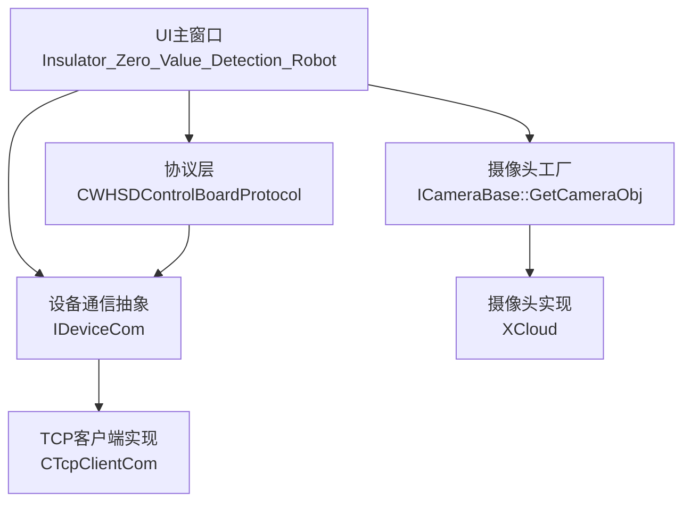
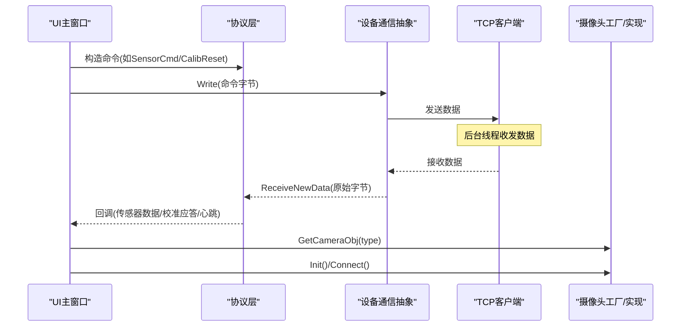
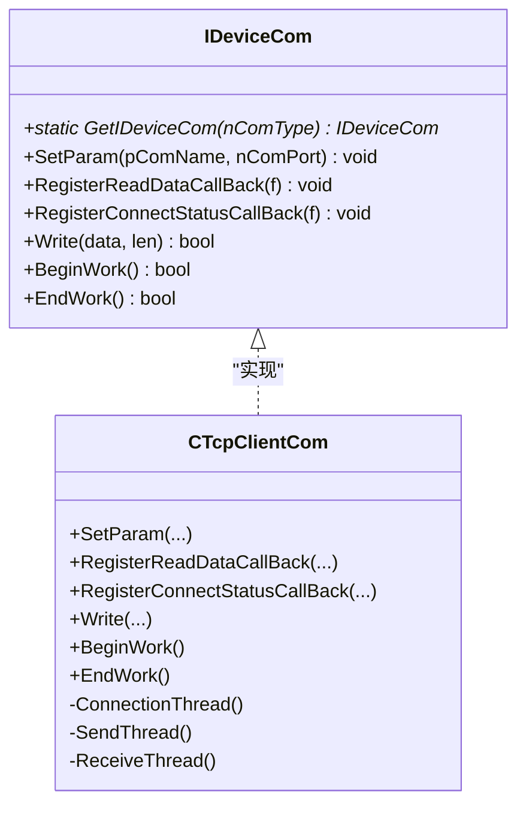
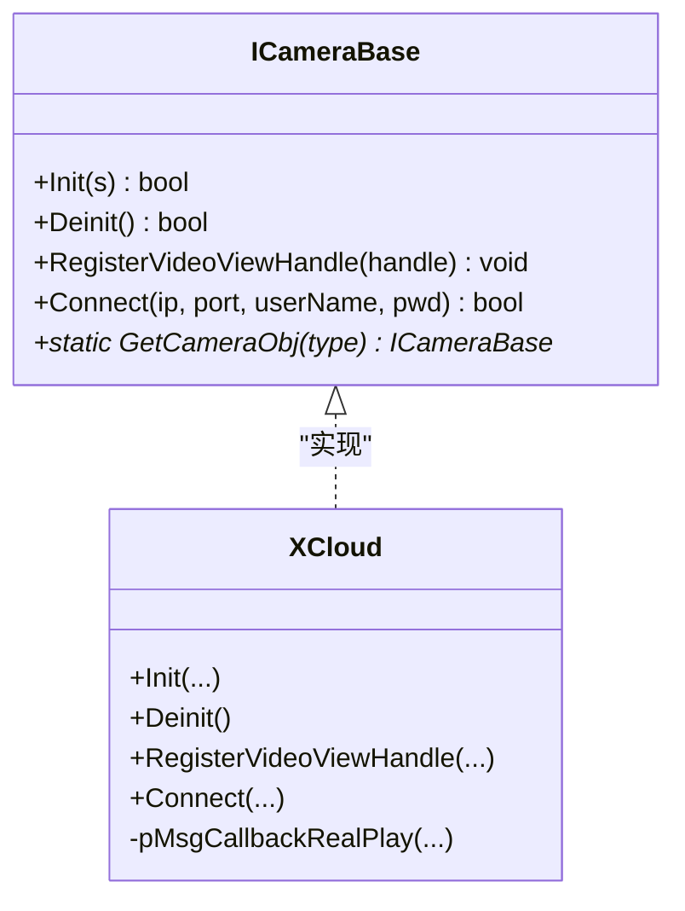
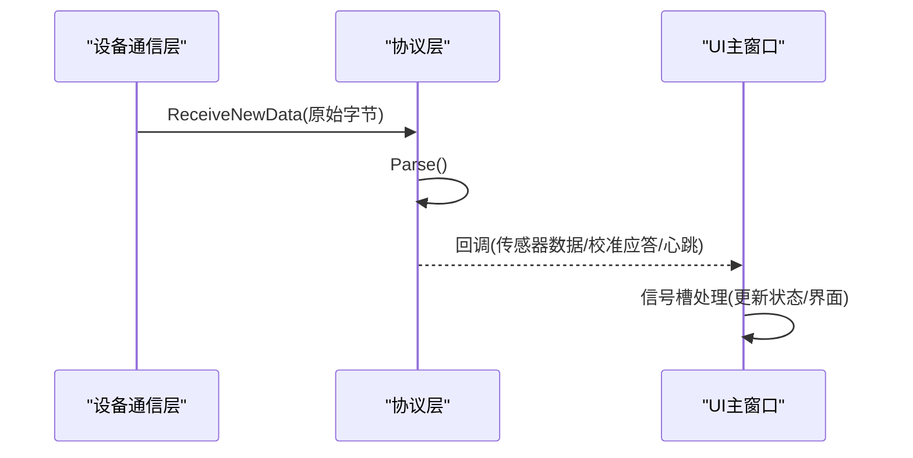
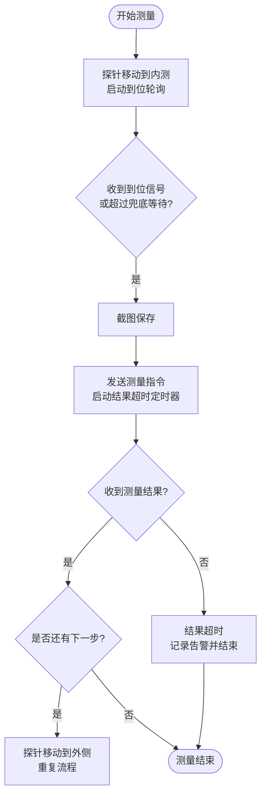
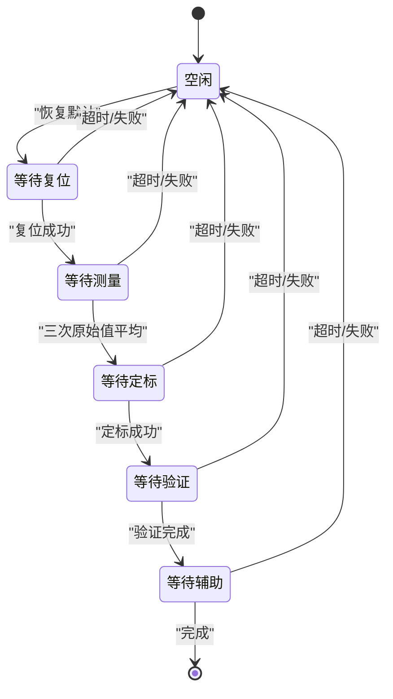
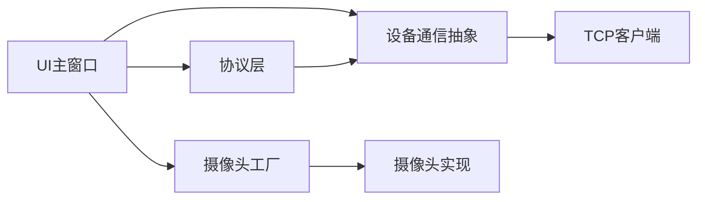

# 设计模式应用

<cite>
**本文引用的文件**
- [main.cpp](file://Insulator_Zero_Value_Detection_Robot/main.cpp)
- [IDeviceCom.h](file://Insulator_Zero_Value_Detection_Robot/DeviceCom/IDeviceCom.h)
- [IDeviceCom.cpp](file://Insulator_Zero_Value_Detection_Robot/DeviceCom/IDeviceCom.cpp)
- [TcpClient.h](file://Insulator_Zero_Value_Detection_Robot/DeviceCom/TcpClient.h)
- [CameraBase.h](file://Insulator_Zero_Value_Detection_Robot/Camera/CameraBase.h)
- [CameraBase.cpp](file://Insulator_Zero_Value_Detection_Robot/Camera/CameraBase.cpp)
- [XCloud.h](file://Insulator_Zero_Value_Detection_Robot/Camera/XCloud.h)
- [WHSDControlBoradProtocol.h](file://Insulator_Zero_Value_Detection_Robot/Protocol/WHSDControlBoradProtocol.h)
- [WHSDControlBoradProtocol.cpp](file://Insulator_Zero_Value_Detection_Robot/Protocol/WHSDControlBoradProtocol.cpp)
- [Insulator_Zero_Value_Detection_Robot.h](file://Insulator_Zero_Value_Detection_Robot/UI/Insulator_Zero_Value_Detection_Robot.h)
- [Insulator_Zero_Value_Detection_Robot.cpp](file://Insulator_Zero_Value_Detection_Robot/UI/Insulator_Zero_Value_Detection_Robot.cpp)
</cite>

## 目录
1. [简介](#简介)
2. [项目结构](#项目结构)
3. [核心组件](#核心组件)
4. [架构总览](#架构总览)
5. [详细组件分析](#详细组件分析)
6. [依赖关系分析](#依赖关系分析)
7. [性能考虑](#性能考虑)
8. [故障排查指南](#故障排查指南)
9. [结论](#结论)
10. [附录：最佳实践与扩展建议](#附录最佳实践与扩展建议)

## 简介
本文件面向“绝缘子零值检测机器人V2”的设计模式应用，聚焦以下三类模式在系统中的落地与实践：
- 工厂模式：用于设备通信对象与摄像头对象的创建，屏蔽具体实现差异，提升扩展性。
- 观察者模式：通过回调函数机制（std::function）将协议解析、设备状态变化等事件通知到UI或业务层，实现松耦合。
- 状态机模式：在检测流程与校准流程中显式管理步骤与等待态，保证流程顺序、可观测性与异常兜底。

文档将从系统架构、数据流、处理逻辑、集成点、错误处理与性能特性等方面展开，并给出可视化图示与代码片段路径，帮助读者理解这些模式如何促成高内聚、低耦合的代码结构，以及它们带来的可扩展与维护性优势。

## 项目结构
系统采用分层与模块化组织：
- UI层：Qt主窗口与交互逻辑，承载测量与校准流程的状态机、定时器与用户操作。
- 协议层：控制板协议封装，负责帧组装、解析与回调分发。
- 设备通信层：抽象接口与TCP客户端实现，提供读写与连接状态回调。
- 摄像头层：抽象接口与具体实现（如XCloud），通过工厂创建实例。
- 配置与日志：参数管理与日志记录，贯穿各层。

图表来源
- [Insulator_Zero_Value_Detection_Robot.h:26-385](file://Insulator_Zero_Value_Detection_Robot/UI/Insulator_Zero_Value_Detection_Robot.h#L26-L385)
- [WHSDControlBoradProtocol.h:189-356](file://Insulator_Zero_Value_Detection_Robot/Protocol/WHSDControlBoradProtocol.h#L189-L356)
- [IDeviceCom.h:4-15](file://Insulator_Zero_Value_Detection_Robot/DeviceCom/IDeviceCom.h#L4-L15)
- [TcpClient.h:8-46](file://Insulator_Zero_Value_Detection_Robot/DeviceCom/TcpClient.h#L8-L46)
- [CameraBase.h:5-14](file://Insulator_Zero_Value_Detection_Robot/Camera/CameraBase.h#L5-L14)
- [XCloud.h:6-33](file://Insulator_Zero_Value_Detection_Robot/Camera/XCloud.h#L6-L33)

章节来源
- [main.cpp:11-24](file://Insulator_Zero_Value_Detection_Robot/main.cpp#L11-L24)
- [Insulator_Zero_Value_Detection_Robot.h:26-385](file://Insulator_Zero_Value_Detection_Robot/UI/Insulator_Zero_Value_Detection_Robot.h#L26-L385)

## 核心组件
- 设备通信抽象与实现
  - IDeviceCom：定义统一的设备通信接口，包括设置参数、注册读数据回调、注册连接状态回调、写数据、开始/结束工作。
  - CTcpClientCom：基于TCP的通信实现，包含连接线程、发送队列、接收线程与回调存储。
- 摄像头抽象与工厂
  - ICameraBase：摄像头抽象接口，提供初始化、反初始化、视频句柄注册、连接等能力，并提供静态工厂方法获取具体摄像头对象。
  - XCloud：具体摄像头实现，封装SDK回调与连接逻辑。
- 协议层
  - CWHSDControlBoardProtocol：控制板协议封装，提供命令构造、解析、心跳、OTA、传感器数据回调、校准应答回调等。
- UI主窗口
  - Insulator_Zero_Value_Detection_Robot：承载测量流程与校准流程的状态机、定时器、信号槽、用户交互与告警面板。

章节来源
- [IDeviceCom.h:4-15](file://Insulator_Zero_Value_Detection_Robot/DeviceCom/IDeviceCom.h#L4-L15)
- [TcpClient.h:8-46](file://Insulator_Zero_Value_Detection_Robot/DeviceCom/TcpClient.h#L8-L46)
- [CameraBase.h:5-14](file://Insulator_Zero_Value_Detection_Robot/Camera/CameraBase.h#L5-L14)
- [XCloud.h:6-33](file://Insulator_Zero_Value_Detection_Robot/Camera/XCloud.h#L6-L33)
- [WHSDControlBoradProtocol.h:189-356](file://Insulator_Zero_Value_Detection_Robot/Protocol/WHSDControlBoradProtocol.h#L189-L356)
- [Insulator_Zero_Value_Detection_Robot.h:26-385](file://Insulator_Zero_Value_Detection_Robot/UI/Insulator_Zero_Value_Detection_Robot.h#L26-L385)

## 架构总览
系统以UI为主控，通过协议层与设备通信层协同完成检测与校准；摄像头模块独立接入，支持多路取流与录制。关键交互如下：
- UI调用协议层生成命令，经设备通信层下发至下位机。
- 下位机响应通过协议层解析后，触发注册的回调，再由UI的信号槽处理并推进状态机。
- 摄像头对象由工厂创建，UI直接通过抽象接口进行初始化与连接。

图表来源
- [Insulator_Zero_Value_Detection_Robot.cpp:2062-2139](file://Insulator_Zero_Value_Detection_Robot/UI/Insulator_Zero_Value_Detection_Robot.cpp#L2062-L2139)
- [WHSDControlBoradProtocol.cpp:462-504](file://Insulator_Zero_Value_Detection_Robot/Protocol/WHSDControlBoradProtocol.cpp#L462-L504)
- [IDeviceCom.cpp:4-13](file://Insulator_Zero_Value_Detection_Robot/DeviceCom/IDeviceCom.cpp#L4-L13)
- [CameraBase.cpp:8-19](file://Insulator_Zero_Value_Detection_Robot/Camera/CameraBase.cpp#L8-L19)

## 详细组件分析

### 工厂模式：设备通信对象创建
- 选择原因
  - 统一入口：通过静态工厂方法按类型创建不同通信实现，避免调用方感知具体类名。
  - 易扩展：新增通信方式只需增加类型分支与实现类，不影响现有调用。
- 实现要点
  - IDeviceCom::GetIDeviceCom根据传入类型返回对应实现（当前为TCP）。
  - 调用方仅持有抽象指针，降低耦合。
- 好处
  - 松耦合：上层不依赖具体通信实现。
  - 高内聚：创建逻辑集中在工厂，便于集中管理与测试。

图表来源
- [IDeviceCom.h:4-15](file://Insulator_Zero_Value_Detection_Robot/DeviceCom/IDeviceCom.h#L4-L15)
- [TcpClient.h:8-46](file://Insulator_Zero_Value_Detection_Robot/DeviceCom/TcpClient.h#L8-L46)
- [IDeviceCom.cpp:4-13](file://Insulator_Zero_Value_Detection_Robot/DeviceCom/IDeviceCom.cpp#L4-L13)

章节来源
- [IDeviceCom.cpp:4-13](file://Insulator_Zero_Value_Detection_Robot/DeviceCom/IDeviceCom.cpp#L4-L13)
- [TcpClient.h:8-46](file://Insulator_Zero_Value_Detection_Robot/DeviceCom/TcpClient.h#L8-L46)

### 工厂模式：摄像头对象创建
- 选择原因
  - 多摄像头支持：通过类型区分不同摄像头实现，便于未来扩展更多品牌或型号。
  - 解耦初始化：调用方无需关心具体摄像头的初始化细节。
- 实现要点
  - ICameraBase::GetCameraObj根据类型返回具体实现（当前为XCloud）。
  - UI通过抽象接口进行Init与Connect，屏蔽底层差异。
- 好处
  - 易于替换与升级摄像头实现。
  - 提高代码复用率与可测试性。

图表来源
- [CameraBase.h:5-14](file://Insulator_Zero_Value_Detection_Robot/Camera/CameraBase.h#L5-L14)
- [CameraBase.cpp:8-19](file://Insulator_Zero_Value_Detection_Robot/Camera/CameraBase.cpp#L8-L19)
- [XCloud.h:6-33](file://Insulator_Zero_Value_Detection_Robot/Camera/XCloud.h#L6-L33)

章节来源
- [CameraBase.cpp:8-19](file://Insulator_Zero_Value_Detection_Robot/Camera/CameraBase.cpp#L8-L19)
- [XCloud.h:6-33](file://Insulator_Zero_Value_Detection_Robot/Camera/XCloud.h#L6-L33)

### 观察者模式：回调函数机制
- 选择原因
  - 异步事件驱动：协议解析、设备心跳、传感器数据等事件需要通知多个订阅者，使用回调可实现松耦合的事件分发。
  - 跨线程安全：协议线程解析数据后通过回调通知UI线程，避免直接修改UI资源。
- 实现要点
  - 协议层提供多种RegisterXXX函数，注册回调函数（std::function）。
  - 设备通信层也提供注册读数据与连接状态回调的方法。
  - UI在主窗口中绑定信号槽，接收回调并更新界面与状态机。
- 好处
  - 解耦：协议与UI之间无直接依赖，便于独立演进。
  - 灵活：可动态注册/注销回调，适应不同场景需求。

图表来源
- [WHSDControlBoradProtocol.h:202-216](file://Insulator_Zero_Value_Detection_Robot/Protocol/WHSDControlBoradProtocol.h#L202-L216)
- [WHSDControlBoradProtocol.cpp:462-504](file://Insulator_Zero_Value_Detection_Robot/Protocol/WHSDControlBoradProtocol.cpp#L462-L504)
- [IDeviceCom.h:9-11](file://Insulator_Zero_Value_Detection_Robot/DeviceCom/IDeviceCom.h#L9-L11)
- [Insulator_Zero_Value_Detection_Robot.h:36-41](file://Insulator_Zero_Value_Detection_Robot/UI/Insulator_Zero_Value_Detection_Robot.h#L36-L41)

章节来源
- [WHSDControlBoradProtocol.h:202-216](file://Insulator_Zero_Value_Detection_Robot/Protocol/WHSDControlBoradProtocol.h#L202-L216)
- [WHSDControlBoradProtocol.cpp:462-504](file://Insulator_Zero_Value_Detection_Robot/Protocol/WHSDControlBoradProtocol.cpp#L462-L504)
- [IDeviceCom.h:9-11](file://Insulator_Zero_Value_Detection_Robot/DeviceCom/IDeviceCom.h#L9-L11)
- [Insulator_Zero_Value_Detection_Robot.h:36-41](file://Insulator_Zero_Value_Detection_Robot/UI/Insulator_Zero_Value_Detection_Robot.h#L36-L41)

### 状态机模式：检测流程
- 选择原因
  - 复杂时序：检测流程包含探针到位等待、测量触发、结果超时等多阶段，状态机能清晰表达步骤顺序与条件转移。
  - 异常兜底：通过定时器与状态切换确保异常情况下自动恢复与告警。
- 实现要点
  - 使用成员变量表示当前步骤（如内测/外侧），配合定时器轮询到位与结果超时。
  - 关键方法：StartProbeMoveAndWait、TriggerMeasureAndArm、On_MeasureTimeout、AbortMeasure。
- 好处
  - 可读性强：状态与动作分离，便于调试与扩展。
  - 健壮性：超时与异常路径明确，避免死锁或悬挂状态。

图表来源
- [Insulator_Zero_Value_Detection_Robot.cpp:2062-2139](file://Insulator_Zero_Value_Detection_Robot/UI/Insulator_Zero_Value_Detection_Robot.cpp#L2062-L2139)
- [Insulator_Zero_Value_Detection_Robot.cpp:2141-2233](file://Insulator_Zero_Value_Detection_Robot/UI/Insulator_Zero_Value_Detection_Robot.cpp#L2141-L2233)

章节来源
- [Insulator_Zero_Value_Detection_Robot.cpp:2062-2139](file://Insulator_Zero_Value_Detection_Robot/UI/Insulator_Zero_Value_Detection_Robot.cpp#L2062-L2139)
- [Insulator_Zero_Value_Detection_Robot.cpp:2141-2233](file://Insulator_Zero_Value_Detection_Robot/UI/Insulator_Zero_Value_Detection_Robot.cpp#L2141-L2233)

### 状态机模式：校准流程
- 选择原因
  - 步骤严格顺序：校准流程包含恢复默认、测原始值、下发定标、验证等步骤，必须自上而下执行。
  - 等待与超时：每步发出命令后进入等待态，依靠回调与超时定时器推进或失败。
- 实现要点
  - 使用枚举表示步骤（空闲、等待复位、等待测量、等待定标、等待验证、等待辅助命令）。
  - 关键方法：CalibStartWait、CalibStopWait、CalibTriggerMeasure、On_CalibAnswer、On_CalibTimeout。
- 好处
  - 可追踪：每一步有明确状态与日志，便于定位问题。
  - 可维护：新增步骤只需扩展状态与处理逻辑，不影响其他步骤。

图表来源
- [Insulator_Zero_Value_Detection_Robot.h:317-325](file://Insulator_Zero_Value_Detection_Robot/UI/Insulator_Zero_Value_Detection_Robot.h#L317-L325)
- [Insulator_Zero_Value_Detection_Robot.cpp:865-892](file://Insulator_Zero_Value_Detection_Robot/UI/Insulator_Zero_Value_Detection_Robot.cpp#L865-L892)
- [Insulator_Zero_Value_Detection_Robot.cpp:979-1055](file://Insulator_Zero_Value_Detection_Robot/UI/Insulator_Zero_Value_Detection_Robot.cpp#L979-L1055)
- [Insulator_Zero_Value_Detection_Robot.cpp:1267-1313](file://Insulator_Zero_Value_Detection_Robot/UI/Insulator_Zero_Value_Detection_Robot.cpp#L1267-L1313)

章节来源
- [Insulator_Zero_Value_Detection_Robot.h:317-325](file://Insulator_Zero_Value_Detection_Robot/UI/Insulator_Zero_Value_Detection_Robot.h#L317-L325)
- [Insulator_Zero_Value_Detection_Robot.cpp:865-892](file://Insulator_Zero_Value_Detection_Robot/UI/Insulator_Zero_Value_Detection_Robot.cpp#L865-L892)
- [Insulator_Zero_Value_Detection_Robot.cpp:979-1055](file://Insulator_Zero_Value_Detection_Robot/UI/Insulator_Zero_Value_Detection_Robot.cpp#L979-L1055)
- [Insulator_Zero_Value_Detection_Robot.cpp:1267-1313](file://Insulator_Zero_Value_Detection_Robot/UI/Insulator_Zero_Value_Detection_Robot.cpp#L1267-L1313)

## 依赖关系分析
- UI对协议层的依赖：通过静态方法构造命令，并通过回调接收响应。
- 协议层对设备通信的依赖：通过抽象接口发送数据，不关心具体传输方式。
- 设备通信层对TCP实现的依赖：通过工厂创建具体客户端，隐藏实现细节。
- UI对摄像头工厂的依赖：通过抽象接口创建与操控摄像头，屏蔽具体SDK差异。

图表来源
- [Insulator_Zero_Value_Detection_Robot.h:26-385](file://Insulator_Zero_Value_Detection_Robot/UI/Insulator_Zero_Value_Detection_Robot.h#L26-L385)
- [WHSDControlBoradProtocol.h:189-356](file://Insulator_Zero_Value_Detection_Robot/Protocol/WHSDControlBoradProtocol.h#L189-L356)
- [IDeviceCom.h:4-15](file://Insulator_Zero_Value_Detection_Robot/DeviceCom/IDeviceCom.h#L4-L15)
- [TcpClient.h:8-46](file://Insulator_Zero_Value_Detection_Robot/DeviceCom/TcpClient.h#L8-L46)
- [CameraBase.h:5-14](file://Insulator_Zero_Value_Detection_Robot/Camera/CameraBase.h#L5-L14)
- [XCloud.h:6-33](file://Insulator_Zero_Value_Detection_Robot/Camera/XCloud.h#L6-L33)

章节来源
- [Insulator_Zero_Value_Detection_Robot.h:26-385](file://Insulator_Zero_Value_Detection_Robot/UI/Insulator_Zero_Value_Detection_Robot.h#L26-L385)
- [WHSDControlBoradProtocol.h:189-356](file://Insulator_Zero_Value_Detection_Robot/Protocol/WHSDControlBoradProtocol.h#L189-L356)
- [IDeviceCom.h:4-15](file://Insulator_Zero_Value_Detection_Robot/DeviceCom/IDeviceCom.h#L4-L15)
- [TcpClient.h:8-46](file://Insulator_Zero_Value_Detection_Robot/DeviceCom/TcpClient.h#L8-L46)
- [CameraBase.h:5-14](file://Insulator_Zero_Value_Detection_Robot/Camera/CameraBase.h#L5-L14)
- [XCloud.h:6-33](file://Insulator_Zero_Value_Detection_Robot/Camera/XCloud.h#L6-L33)

## 性能考虑
- 设备通信
  - 使用线程池与队列管理发送与接收，避免阻塞UI线程。
  - 条件变量协调生产者-消费者模型，减少忙轮询。
- 摄像头取流
  - 低延迟参数设置与最小缓冲区，提升实时性。
  - 录像期间缓存帧，停止后统一编码，降低IO压力。
- 状态机
  - 定时器粒度合理，避免频繁轮询导致CPU占用过高。
  - 超时策略防止长时间等待，提升用户体验。

[本节为通用性能讨论，不直接分析具体文件]

## 故障排查指南
- 设备未连接
  - 现象：无法发送命令，日志提示未连接。
  - 排查：检查连接状态回调与心跳快照，确认链路正常。
- 测量超时
  - 现象：未收到测量结果，自动结束并告警。
  - 排查：检查下位机是否正常工作，确认超时阈值与网络状况。
- 校准失败
  - 现象：校准步骤失败，显示失败原因。
  - 排查：根据原因码定位问题（如Flash写失败、参数非法），重试或修正参数。

章节来源
- [Insulator_Zero_Value_Detection_Robot.cpp:2053-2060](file://Insulator_Zero_Value_Detection_Robot/UI/Insulator_Zero_Value_Detection_Robot.cpp#L2053-L2060)
- [Insulator_Zero_Value_Detection_Robot.cpp:2141-2150](file://Insulator_Zero_Value_Detection_Robot/UI/Insulator_Zero_Value_Detection_Robot.cpp#L2141-L2150)
- [Insulator_Zero_Value_Detection_Robot.cpp:1267-1313](file://Insulator_Zero_Value_Detection_Robot/UI/Insulator_Zero_Value_Detection_Robot.cpp#L1267-L1313)

## 结论
通过工厂模式、观察者模式与状态机模式的组合应用，系统在设备通信、摄像头接入、检测与校准流程中实现了高内聚、低耦合的结构。工厂模式简化了对象创建与扩展，观察者模式实现了事件驱动的松耦合通信，状态机模式确保了复杂流程的可控性与健壮性。这些模式共同提升了系统的可扩展性、可维护性与可观测性，为后续功能迭代与问题定位提供了坚实基础。

[本节为总结性内容，不直接分析具体文件]

## 附录：最佳实践与扩展建议
- 工厂模式最佳实践
  - 集中管理创建逻辑，避免分散的new语句。
  - 使用类型或枚举作为创建参数，便于扩展新实现。
  - 对工厂方法进行单元测试，确保正确返回预期对象。
- 观察者模式最佳实践
  - 回调函数应轻量且线程安全，避免在回调中执行耗时操作。
  - 提供注销回调的能力，防止内存泄漏与悬空引用。
  - 在跨线程场景中，确保回调目标线程安全（如Qt的信号槽）。
- 状态机模式最佳实践
  - 明确定义状态与转移条件，保持状态转换单一职责。
  - 为每个状态提供进入/退出钩子，便于日志记录与资源管理。
  - 结合定时器与异常处理，确保状态机不会陷入死锁或悬挂状态。
- 扩展性建议
  - 新增设备通信方式时，仅需实现接口并在工厂中添加分支。
  - 新增摄像头类型时，实现抽象接口并在工厂中注册。
  - 扩展校准流程时，增加新状态与处理逻辑，保持原有流程稳定。

[本节为通用指导，不直接分析具体文件]