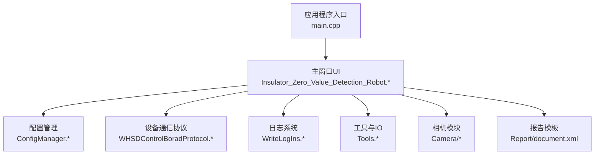
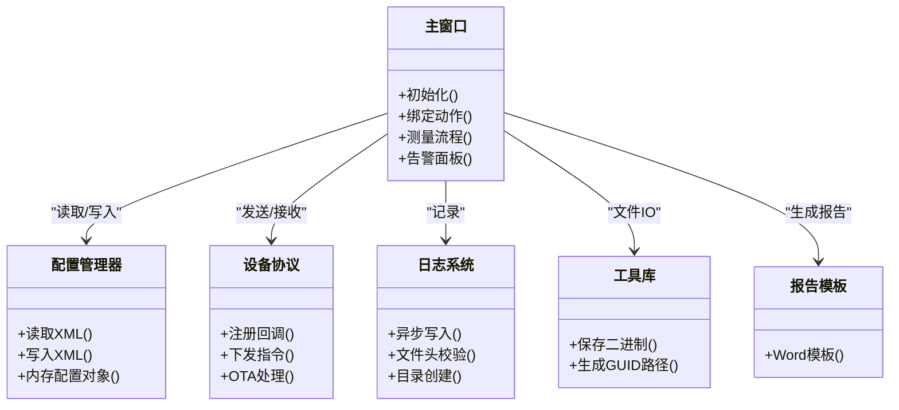
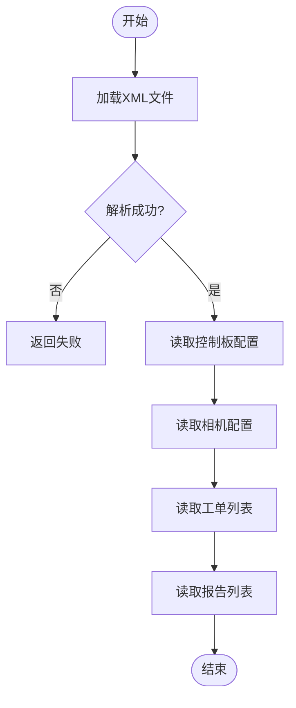
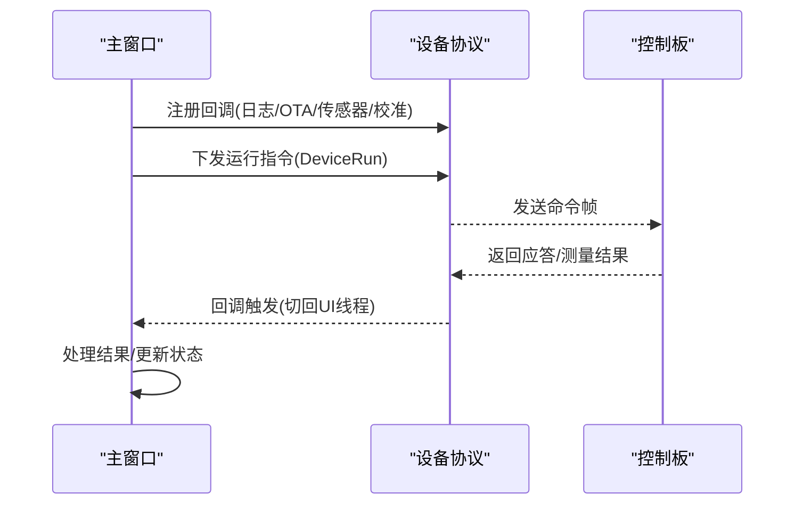
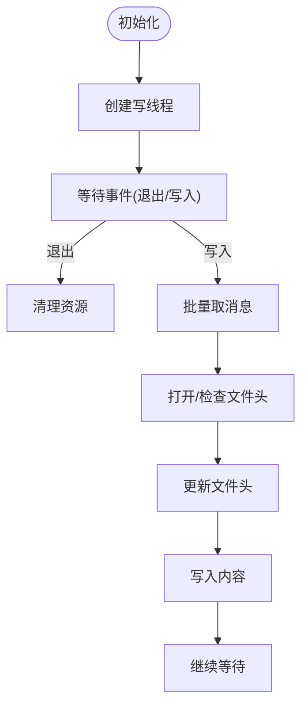
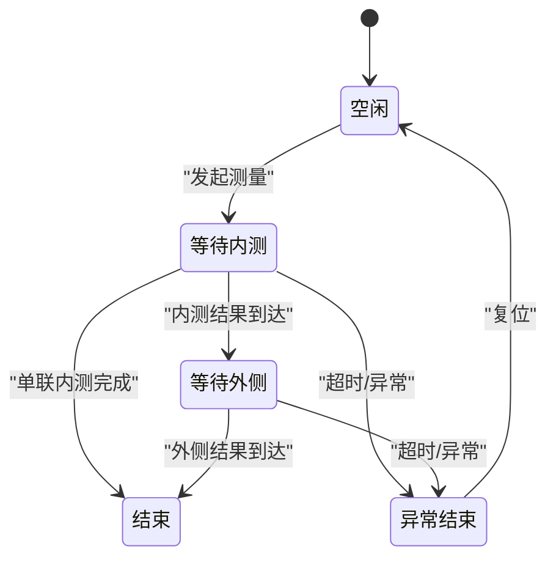
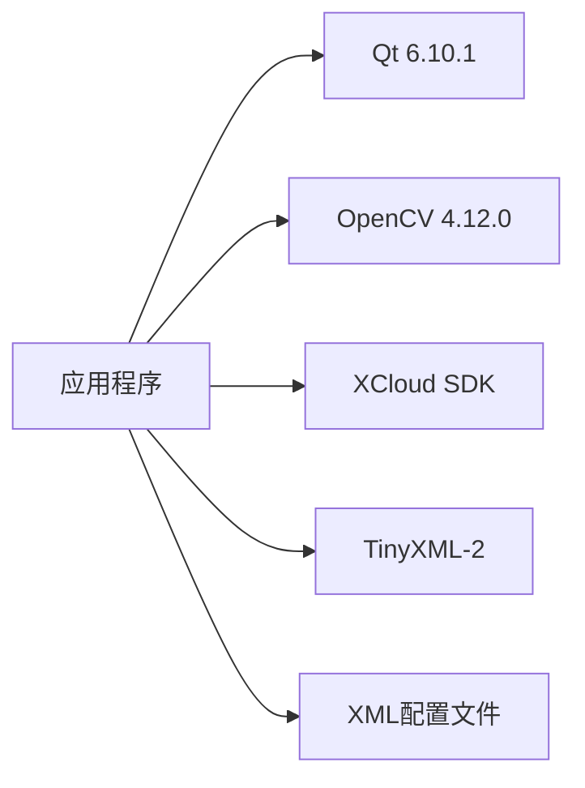

# 部署与维护

<cite>
**本文引用的文件**
- [README.md](file://README.md)
- [main.cpp](file://Insulator_Zero_Value_Detection_Robot/main.cpp)
- [Insulator_Zero_Value_Detection_Robot.vcxproj](file://Insulator_Zero_Value_Detection_Robot/Insulator_Zero_Value_Detection_Robot.vcxproj)
- [Insulator_Zero_Value_Detection_Robot.vcxproj.user](file://Insulator_Zero_Value_Detection_Robot/Insulator_Zero_Value_Detection_Robot.vcxproj.user)
- [ConfigManager.h](file://Insulator_Zero_Value_Detection_Robot/Config/ConfigManager.h)
- [ConfigManager.cpp](file://Insulator_Zero_Value_Detection_Robot/Config/ConfigManager.cpp)
- [WHSDControlBoradProtocol.cpp](file://Insulator_Zero_Value_Detection_Robot/Protocol/WHSDControlBoradProtocol.cpp)
- [WriteLogIns.cpp](file://Insulator_Zero_Value_Detection_Robot/Log/WriteLogIns.cpp)
- [Tools.cpp](file://Insulator_Zero_Value_Detection_Robot/Tools/Tools.cpp)
- [Insulator_Zero_Value_Detection_Robot.h](file://Insulator_Zero_Value_Detection_Robot/UI/Insulator_Zero_Value_Detection_Robot.h)
- [Insulator_Zero_Value_Detection_Robot.cpp](file://Insulator_Zero_Value_Detection_Robot/UI/Insulator_Zero_Value_Detection_Robot.cpp)
- [document.xml](file://Insulator_Zero_Value_Detection_Robot/Report/document.xml)
- [操作说明书.md](file://操作说明书.md)
</cite>

## 目录
1. [简介](#简介)
2. [项目结构](#项目结构)
3. [核心组件](#核心组件)
4. [架构总览](#架构总览)
5. [详细组件分析](#详细组件分析)
6. [依赖关系分析](#依赖关系分析)
7. [性能考虑](#性能考虑)
8. [故障诊断指南](#故障诊断指南)
9. [结论](#结论)
10. [附录](#附录)

## 简介
本文件面向运维与现场实施人员，提供绝缘子零值检测机器人V2软件的部署、配置、日常维护、监控优化、版本升级与回滚策略，以及常见问题的排障方法。软件基于Qt UI框架，通过设备通信模块与下位机控制板交互，使用相机采集图像，结合XML配置文件管理设备参数、工单与报告信息，并输出检测报告。

## 项目结构
- 入口程序：Windows桌面应用，启动后创建主窗口并进入事件循环。
- 配置管理：读取/写入XML配置文件，包含控制板、相机、工单与报告等配置项。
- 设备通信：封装协议命令，负责与控制板交互（含测量、校准、OTA等）。
- 日志系统：异步线程写日志，支持固定行/列的表格化日志文件。
- 工具与IO：二进制数据保存、路径生成、自动归档等。
- UI界面：主窗口、工单/报告对话框、测量流程状态机、告警面板等。
- 报告模板：Word文档模板用于生成检测报告。

图表来源
- [main.cpp:11-23](file://Insulator_Zero_Value_Detection_Robot/main.cpp#L11-L23)
- [Insulator_Zero_Value_Detection_Robot.h:26-384](file://Insulator_Zero_Value_Detection_Robot/UI/Insulator_Zero_Value_Detection_Robot.h#L26-L384)
- [ConfigManager.cpp:16-257](file://Insulator_Zero_Value_Detection_Robot/Config/ConfigManager.cpp#L16-L257)
- [WHSDControlBoradProtocol.cpp:462-504](file://Insulator_Zero_Value_Detection_Robot/Protocol/WHSDControlBoradProtocol.cpp#L462-L504)
- [WriteLogIns.cpp:47-93](file://Insulator_Zero_Value_Detection_Robot/Log/WriteLogIns.cpp#L47-L93)
- [Tools.cpp:52-108](file://Insulator_Zero_Value_Detection_Robot/Tools/Tools.cpp#L52-L108)
- [document.xml:1-2](file://Insulator_Zero_Value_Detection_Robot/Report/document.xml#L1-L2)

章节来源
- [main.cpp:11-23](file://Insulator_Zero_Value_Detection_Robot/main.cpp#L11-L23)
- [Insulator_Zero_Value_Detection_Robot.vcxproj:1-94](file://Insulator_Zero_Value_Detection_Robot/Insulator_Zero_Value_Detection_Robot.vcxproj#L1-L94)
- [Insulator_Zero_Value_Detection_Robot.vcxproj.user:1-18](file://Insulator_Zero_Value_Detection_Robot/Insulator_Zero_Value_Detection_Robot.vcxproj.user#L1-L18)

## 核心组件
- 应用程序入口与生命周期：初始化Qt应用、创建主窗口并显示。
- 配置管理：解析XML配置，加载控制板IP/端口/心跳、相机IP/码流、工单与报告列表；支持持久化写入。
- 设备通信协议：封装控制板指令（运行、停止、校准、OTA等），提供回调注册与线程安全处理。
- 日志系统：后台线程批量写入日志，支持文件头校验、溢出截断、目录自动创建。
- 工具与IO：二进制文件保存、GUID路径生成、自动归档到时间戳目录。
- UI与测量流程：状态机驱动探针到位等待与测量结果超时处理，记录告警、截图、视频录制。
- 报告生成：基于Word模板填充检测单位、人员、线路、日期等信息。

章节来源
- [ConfigManager.h:10-199](file://Insulator_Zero_Value_Detection_Robot/Config/ConfigManager.h#L10-L199)
- [ConfigManager.cpp:16-452](file://Insulator_Zero_Value_Detection_Robot/Config/ConfigManager.cpp#L16-L452)
- [WHSDControlBoradProtocol.cpp:462-504](file://Insulator_Zero_Value_Detection_Robot/Protocol/WHSDControlBoradProtocol.cpp#L462-L504)
- [WriteLogIns.cpp:47-275](file://Insulator_Zero_Value_Detection_Robot/Log/WriteLogIns.cpp#L47-L275)
- [Tools.cpp:52-108](file://Insulator_Zero_Value_Detection_Robot/Tools/Tools.cpp#L52-L108)
- [Insulator_Zero_Value_Detection_Robot.h:26-384](file://Insulator_Zero_Value_Detection_Robot/UI/Insulator_Zero_Value_Detection_Robot.h#L26-L384)
- [document.xml:1-2](file://Insulator_Zero_Value_Detection_Robot/Report/document.xml#L1-L2)

## 架构总览
系统采用分层设计：UI层负责交互与流程编排；配置层提供运行时参数；协议层抽象设备通信；日志层保障可观测性；工具层提供通用能力；报告层输出业务文档。

图表来源
- [Insulator_Zero_Value_Detection_Robot.h:26-384](file://Insulator_Zero_Value_Detection_Robot/UI/Insulator_Zero_Value_Detection_Robot.h#L26-L384)
- [ConfigManager.cpp:16-452](file://Insulator_Zero_Value_Detection_Robot/Config/ConfigManager.cpp#L16-L452)
- [WHSDControlBoradProtocol.cpp:462-504](file://Insulator_Zero_Value_Detection_Robot/Protocol/WHSDControlBoradProtocol.cpp#L462-L504)
- [WriteLogIns.cpp:47-275](file://Insulator_Zero_Value_Detection_Robot/Log/WriteLogIns.cpp#L47-L275)
- [Tools.cpp:52-108](file://Insulator_Zero_Value_Detection_Robot/Tools/Tools.cpp#L52-L108)
- [document.xml:1-2](file://Insulator_Zero_Value_Detection_Robot/Report/document.xml#L1-L2)

## 详细组件分析

### 配置管理组件
- 功能：从XML读取控制板网络参数、相机IP与码流、工单与报告列表；支持将内存配置写回XML。
- 数据结构：控制板配置、相机配置、工单配置（含串数类型、回路数、电流类型、时间范围、测量数据JSON）、报告配置。
- 复杂度：读取/写入为线性遍历XML节点，时间复杂度O(N)，N为节点数量；JSON序列化/反序列化为O(M)。
- 错误处理：XML解析失败返回false；缺失节点时跳过或保持默认值。
- 优化建议：对大配置文件可采用增量更新；对频繁读场景可缓存内存结构。

图表来源
- [ConfigManager.cpp:16-257](file://Insulator_Zero_Value_Detection_Robot/Config/ConfigManager.cpp#L16-L257)

章节来源
- [ConfigManager.h:10-199](file://Insulator_Zero_Value_Detection_Robot/Config/ConfigManager.h#L10-L199)
- [ConfigManager.cpp:16-452](file://Insulator_Zero_Value_Detection_Robot/Config/ConfigManager.cpp#L16-L452)

### 设备通信协议组件
- 功能：封装控制板指令（运行、停止、校准、OTA），提供回调注册机制，支持多线程调用。
- 关键接口：注册日志/OTA/传感器/校准回调；设备运行命令构造；OTA分片传输。
- 线程模型：协议回调在独立线程执行，通过信号槽切回UI线程处理。
- 错误处理：参数长度非法、Flash写失败等通过原因码上报。

图表来源
- [WHSDControlBoradProtocol.cpp:462-504](file://Insulator_Zero_Value_Detection_Robot/Protocol/WHSDControlBoradProtocol.cpp#L462-L504)
- [Insulator_Zero_Value_Detection_Robot.h:36-128](file://Insulator_Zero_Value_Detection_Robot/UI/Insulator_Zero_Value_Detection_Robot.h#L36-L128)

章节来源
- [WHSDControlBoradProtocol.cpp:462-504](file://Insulator_Zero_Value_Detection_Robot/Protocol/WHSDControlBoradProtocol.cpp#L462-L504)
- [Insulator_Zero_Value_Detection_Robot.h:36-128](file://Insulator_Zero_Value_Detection_Robot/UI/Insulator_Zero_Value_Detection_Robot.h#L36-L128)

### 日志系统组件
- 功能：后台线程批量写入日志，支持文件头校验、溢出截断、目录自动创建。
- 线程模型：生产者-消费者模式，主线程入队消息，写线程等待事件后批量写入。
- 文件管理：首次写入检查文件头，若无效则重建；按最大行列限制截断超长消息。
- 错误处理：打开文件失败返回错误码；写入异常捕获并记录。

图表来源
- [WriteLogIns.cpp:47-93](file://Insulator_Zero_Value_Detection_Robot/Log/WriteLogIns.cpp#L47-L93)
- [WriteLogIns.cpp:162-275](file://Insulator_Zero_Value_Detection_Robot/Log/WriteLogIns.cpp#L162-L275)

章节来源
- [WriteLogIns.cpp:47-275](file://Insulator_Zero_Value_Detection_Robot/Log/WriteLogIns.cpp#L47-L275)

### 工具与IO组件
- 功能：二进制数据保存到指定路径；自动生成时间戳目录；GUID路径生成。
- 路径策略：调试模式下使用当前工作目录，发布模式使用可执行文件目录。
- 错误处理：文件打开失败返回false；异常捕获避免崩溃。

章节来源
- [Tools.cpp:52-108](file://Insulator_Zero_Value_Detection_Robot/Tools/Tools.cpp#L52-L108)

### UI与测量流程组件
- 功能：主窗口管理测量流程状态机，包括探针到位轮询、测量结果超时、异常自动结束、告警面板、截图与视频录制。
- 时序参数：到位轮询周期100ms，兜底等待4秒，测量结果超时8秒。
- 状态机：空闲→等待内测→等待外侧→结束；单联仅内测一次即结束。
- 交互：键盘/手柄控制探针位置、行走、停止、开始测量。

图表来源
- [Insulator_Zero_Value_Detection_Robot.cpp:67-73](file://Insulator_Zero_Value_Detection_Robot/UI/Insulator_Zero_Value_Detection_Robot.cpp#L67-L73)
- [Insulator_Zero_Value_Detection_Robot.cpp:2173-2206](file://Insulator_Zero_Value_Detection_Robot/UI/Insulator_Zero_Value_Detection_Robot.cpp#L2173-L2206)
- [Insulator_Zero_Value_Detection_Robot.h:188-197](file://Insulator_Zero_Value_Detection_Robot/UI/Insulator_Zero_Value_Detection_Robot.h#L188-L197)

章节来源
- [Insulator_Zero_Value_Detection_Robot.h:26-384](file://Insulator_Zero_Value_Detection_Robot/UI/Insulator_Zero_Value_Detection_Robot.h#L26-L384)
- [Insulator_Zero_Value_Detection_Robot.cpp:67-73](file://Insulator_Zero_Value_Detection_Robot/UI/Insulator_Zero_Value_Detection_Robot.cpp#L67-L73)
- [Insulator_Zero_Value_Detection_Robot.cpp:2173-2206](file://Insulator_Zero_Value_Detection_Robot/UI/Insulator_Zero_Value_Detection_Robot.cpp#L2173-L2206)

### 报告模板组件
- 功能：基于Word模板生成检测报告，包含检测单位、人员、线路、日期、数据表格等。
- 模板结构：标题、段落、表格、书签与域字段。
- 使用方式：通过UI触发报告生成，填充模板占位符并导出。

章节来源
- [document.xml:1-2](file://Insulator_Zero_Value_Detection_Robot/Report/document.xml#L1-L2)
- [操作说明书.md:284-308](file://操作说明书.md#L284-L308)

## 依赖关系分析
- 构建环境：Visual Studio 2022 (v143)，Windows SDK 10.0，Qt 6.10.1，OpenCV 4.12.0，XCloud SDK。
- 链接依赖：XCloudSDK.lib、opencv_world4120.lib。
- 运行时依赖：Qt运行时库、OpenCV运行时、XCloud运行时。
- 配置文件：XML格式，包含设备、相机、工单、报告等节点。

图表来源
- [Insulator_Zero_Value_Detection_Robot.vcxproj:1-94](file://Insulator_Zero_Value_Detection_Robot/Insulator_Zero_Value_Detection_Robot.vcxproj#L1-L94)

章节来源
- [Insulator_Zero_Value_Detection_Robot.vcxproj:1-94](file://Insulator_Zero_Value_Detection_Robot/Insulator_Zero_Value_Detection_Robot.vcxproj#L1-L94)
- [Insulator_Zero_Value_Detection_Robot.vcxproj.user:1-18](file://Insulator_Zero_Value_Detection_Robot/Insulator_Zero_Value_Detection_Robot.vcxproj.user#L1-L18)

## 性能考虑
- 日志写入：批量写入减少I/O次数，避免阻塞UI线程。
- 测量超时：合理设置超时阈值（8秒）避免长时间等待。
- 相机取流：使用克隆帧避免缓冲区复用冲突，互斥锁保护跨线程读写。
- 配置读取：XML解析为线性复杂度，建议配置文件精简。
- 视频录制：帧缓存队列大小需根据内存调整，避免OOM。

## 故障诊断指南
- 无法连接控制板：检查配置中的IP/端口，确认网络连通性与防火墙设置。
- 测量无结果：确认探针到位信号是否到达，检查超时设置与协议回调是否正常。
- 日志文件为空：检查日志目录权限与文件头校验逻辑。
- 报告生成失败：确认模板文件存在且格式正确，检查数据填充逻辑。
- 相机无法连接：验证相机IP与RTSP地址，检查网络与码流参数。

章节来源
- [Insulator_Zero_Value_Detection_Robot.cpp:2173-2206](file://Insulator_Zero_Value_Detection_Robot/UI/Insulator_Zero_Value_Detection_Robot.cpp#L2173-L2206)
- [WriteLogIns.cpp:162-275](file://Insulator_Zero_Value_Detection_Robot/Log/WriteLogIns.cpp#L162-L275)
- [ConfigManager.cpp:16-257](file://Insulator_Zero_Value_Detection_Robot/Config/ConfigManager.cpp#L16-L257)

## 结论
本系统通过清晰的模块化设计与健壮的错误处理机制，实现了绝缘子零值检测的自动化流程。运维人员可依据本文档进行部署、配置、维护与故障排查，确保系统稳定运行。

## 附录

### 部署与环境要求
- 操作系统：Windows 10/11（x64）
- 开发工具：Visual Studio 2022（v143）
- 依赖库：Qt 6.10.1、OpenCV 4.12.0、XCloud SDK
- 运行时：安装对应运行时库，确保动态链接可用

章节来源
- [Insulator_Zero_Value_Detection_Robot.vcxproj:1-94](file://Insulator_Zero_Value_Detection_Robot/Insulator_Zero_Value_Detection_Robot.vcxproj#L1-L94)

### 配置文件说明
- 控制板配置：IP、端口、心跳间隔、工厂模式、探针角度、电机速度、舵机速度、绝缘阈值
- 相机配置：左/中/右相机IP、新相机标志、主码流/子码流地址
- 工单配置：线路名称、杆塔号、串数类型、回路数、电流类型、时间范围、检测人员、备注、测量数据JSON
- 报告配置：报告编号、检测单位、检测人员、工作地点

章节来源
- [ConfigManager.h:10-199](file://Insulator_Zero_Value_Detection_Robot/Config/ConfigManager.h#L10-L199)
- [ConfigManager.cpp:16-452](file://Insulator_Zero_Value_Detection_Robot/Config/ConfigManager.cpp#L16-L452)

### 日常维护任务
- 日志管理：定期清理旧日志文件，监控日志文件大小与写入频率
- 数据备份：备份XML配置文件与检测报告文件
- 系统更新：替换可执行文件与依赖库，重启服务
- 健康检查：验证控制板连接、相机连接、日志写入正常

章节来源
- [WriteLogIns.cpp:47-93](file://Insulator_Zero_Value_Detection_Robot/Log/WriteLogIns.cpp#L47-L93)
- [Tools.cpp:52-108](file://Insulator_Zero_Value_Detection_Robot/Tools/Tools.cpp#L52-L108)

### 版本升级与回滚策略
- 升级前：备份配置文件与历史数据
- 升级中：替换可执行文件与依赖库，验证启动与基本功能
- 回滚：恢复备份的配置文件与旧版本可执行文件
- 验证：执行一次完整检测流程，确认数据输出正确

章节来源
- [操作说明书.md:265-308](file://操作说明书.md#L265-L308)