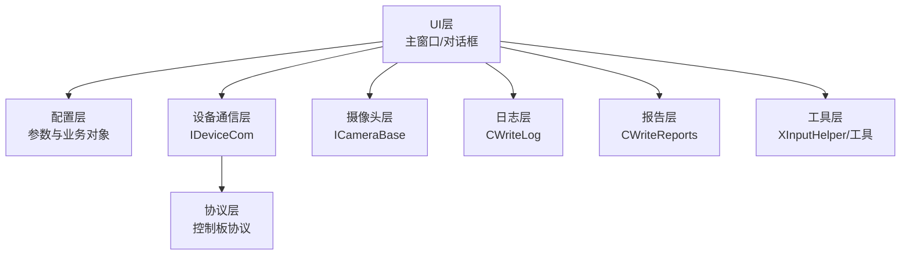
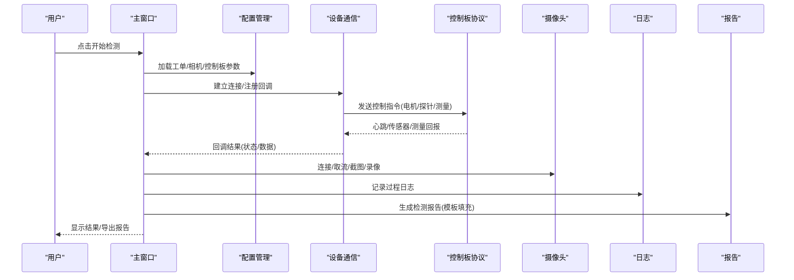
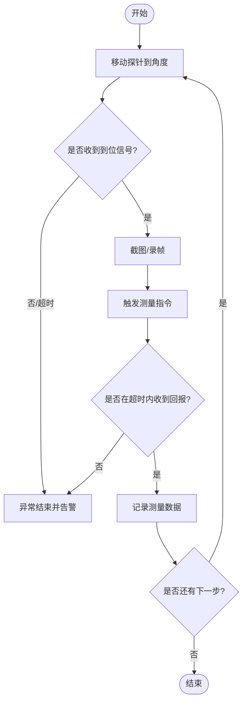
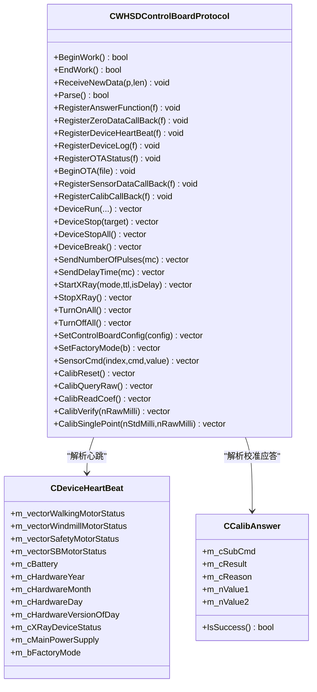
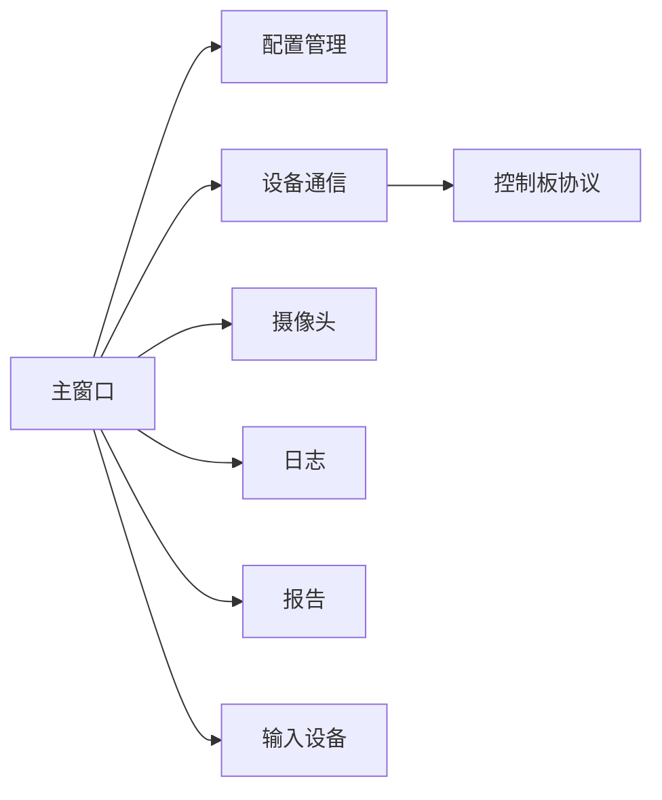

# 项目概述

<cite>
**本文引用的文件**
- [README.md](file://README.md)
- [main.cpp](file://Insulator_Zero_Value_Detection_Robot/main.cpp)
- [Insulator_Zero_Value_Detection_Robot.h](file://Insulator_Zero_Value_Detection_Robot/UI/Insulator_Zero_Value_Detection_Robot.h)
- [ConfigManager.h](file://Insulator_Zero_Value_Detection_Robot/Config/ConfigManager.h)
- [IDeviceCom.h](file://Insulator_Zero_Value_Detection_Robot/DeviceCom/IDeviceCom.h)
- [CameraBase.h](file://Insulator_Zero_Value_Detection_Robot/Camera/CameraBase.h)
- [WHSDControlBoradProtocol.h](file://Insulator_Zero_Value_Detection_Robot/Protocol/WHSDControlBoradProtocol.h)
- [ScanS_WriteLog.h](file://Insulator_Zero_Value_Detection_Robot/Log/ScanS_WriteLog.h)
- [WriteReports.h](file://Insulator_Zero_Value_Detection_Robot/Report/WriteReports.h)
- [XInputHelper.h](file://Insulator_Zero_Value_Detection_Robot/Tools/XInputHelper.h)
- [NewTicketDialog.h](file://Insulator_Zero_Value_Detection_Robot/UI/NewTicketDialog.h)
- [NewReportDialog.h](file://Insulator_Zero_Value_Detection_Robot/UI/NewReportDialog.h)
- [Insulator_Zero_Value_Detection_Robot.vcxproj](file://Insulator_Zero_Value_Detection_Robot/Insulator_Zero_Value_Detection_Robot.vcxproj)
</cite>

## 目录
1. [简介](#简介)
2. [项目结构](#项目结构)
3. [核心组件](#核心组件)
4. [架构总览](#架构总览)
5. [详细组件分析](#详细组件分析)
6. [依赖关系分析](#依赖关系分析)
7. [性能与可靠性](#性能与可靠性)
8. [故障排查指南](#故障排查指南)
9. [结论](#结论)
10. [附录：硬件与软件要求、版本演进](#附录硬件与软件要求版本演进)

## 简介
本项目为“绝缘子零值检测机器人V2”桌面应用程序，面向电力设备巡检场景，用于自动检测输电线路中绝缘子的零值故障。系统通过设备控制、数据采集、视频监控、工单管理与报告生成等能力，实现从现场作业到数据归档的闭环流程。技术栈以C++为核心，采用Qt框架构建图形界面，结合OpenCV进行图像处理，并通过自定义协议与下位机（控制板）通信，支持手柄操控与多相机接入。

## 项目结构
项目采用分层与模块化设计，按职责划分目录：
- UI层：主窗口、对话框、资源与样式
- 配置层：参数与业务对象持久化
- 设备通信层：统一抽象接口与具体实现
- 协议层：与控制板的命令封装与解析
- 摄像头层：相机抽象与连接管理
- 日志层：线程安全日志写入
- 报告层：基于模板的Word文档生成
- 工具层：输入设备辅助、通用工具与XML库

图表来源
- [Insulator_Zero_Value_Detection_Robot.h:1-385](file://Insulator_Zero_Value_Detection_Robot/UI/Insulator_Zero_Value_Detection_Robot.h#L1-L385)
- [ConfigManager.h:1-199](file://Insulator_Zero_Value_Detection_Robot/Config/ConfigManager.h#L1-L199)
- [IDeviceCom.h:1-15](file://Insulator_Zero_Value_Detection_Robot/DeviceCom/IDeviceCom.h#L1-L15)
- [WHSDControlBoradProtocol.h:1-356](file://Insulator_Zero_Value_Detection_Robot/Protocol/WHSDControlBoradProtocol.h#L1-L356)
- [CameraBase.h:1-15](file://Insulator_Zero_Value_Detection_Robot/Camera/CameraBase.h#L1-L15)
- [ScanS_WriteLog.h:1-43](file://Insulator_Zero_Value_Detection_Robot/Log/ScanS_WriteLog.h#L1-L43)
- [WriteReports.h:1-89](file://Insulator_Zero_Value_Detection_Robot/Report/WriteReports.h#L1-L89)
- [XInputHelper.h:1-48](file://Insulator_Zero_Value_Detection_Robot/Tools/XInputHelper.h#L1-L48)

章节来源
- [README.md:1-3](file://README.md#L1-L3)
- [Insulator_Zero_Value_Detection_Robot.vcxproj:1-163](file://Insulator_Zero_Value_Detection_Robot/Insulator_Zero_Value_Detection_Robot.vcxproj#L1-L163)

## 核心组件
- 主窗口与业务流程编排：负责UI交互、测量流程状态机、定标流程、告警与等待弹窗、截图/录像、工单与报告管理等。
- 配置管理：集中管理控制板参数、相机参数、工单与报告配置，并提供读写接口。
- 设备通信抽象：提供统一的设备通信接口，屏蔽底层差异，支持回调注册与连接状态通知。
- 控制板协议：封装电机控制、传感器读取、心跳、校准与OTA等命令，并解析下位机回报。
- 摄像头抽象：统一相机初始化、连接、视频流回调与句柄绑定。
- 日志模块：线程安全的日志写入，支持同步/异步模式与循环覆盖。
- 报告生成：基于docx模板替换占位符与动态表格行，输出检测报告。
- 输入设备：手柄状态采集与标准化，映射到控制动作。

章节来源
- [Insulator_Zero_Value_Detection_Robot.h:1-385](file://Insulator_Zero_Value_Detection_Robot/UI/Insulator_Zero_Value_Detection_Robot.h#L1-L385)
- [ConfigManager.h:1-199](file://Insulator_Zero_Value_Detection_Robot/Config/ConfigManager.h#L1-L199)
- [IDeviceCom.h:1-15](file://Insulator_Zero_Value_Detection_Robot/DeviceCom/IDeviceCom.h#L1-L15)
- [WHSDControlBoradProtocol.h:1-356](file://Insulator_Zero_Value_Detection_Robot/Protocol/WHSDControlBoradProtocol.h#L1-L356)
- [CameraBase.h:1-15](file://Insulator_Zero_Value_Detection_Robot/Camera/CameraBase.h#L1-L15)
- [ScanS_WriteLog.h:1-43](file://Insulator_Zero_Value_Detection_Robot/Log/ScanS_WriteLog.h#L1-L43)
- [WriteReports.h:1-89](file://Insulator_Zero_Value_Detection_Robot/Report/WriteReports.h#L1-L89)
- [XInputHelper.h:1-48](file://Insulator_Zero_Value_Detection_Robot/Tools/XInputHelper.h#L1-L48)

## 架构总览
系统采用分层架构与模块化设计：
- 表现层（UI）：Qt主窗口与对话框，承载用户操作与可视化展示。
- 业务层：测量流程、定标流程、工单与报告管理、告警处理。
- 集成层：设备通信抽象、协议解析、摄像头接入、输入设备。
- 数据与存储：配置持久化、日志记录、报告模板填充。

图表来源
- [Insulator_Zero_Value_Detection_Robot.h:1-385](file://Insulator_Zero_Value_Detection_Robot/UI/Insulator_Zero_Value_Detection_Robot.h#L1-L385)
- [IDeviceCom.h:1-15](file://Insulator_Zero_Value_Detection_Robot/DeviceCom/IDeviceCom.h#L1-L15)
- [WHSDControlBoradProtocol.h:1-356](file://Insulator_Zero_Value_Detection_Robot/Protocol/WHSDControlBoradProtocol.h#L1-L356)
- [CameraBase.h:1-15](file://Insulator_Zero_Value_Detection_Robot/Camera/CameraBase.h#L1-L15)
- [ScanS_WriteLog.h:1-43](file://Insulator_Zero_Value_Detection_Robot/Log/ScanS_WriteLog.h#L1-L43)
- [WriteReports.h:1-89](file://Insulator_Zero_Value_Detection_Robot/Report/WriteReports.h#L1-L89)

## 详细组件分析

### 主窗口与业务流程
- 职责：组织测量流程、定标流程、手柄/键盘控制、截图/录像、告警面板、工单与报告管理。
- 关键机制：
  - 测量流程状态机：探针到位轮询 + 结果超时 + 异常自动结束，确保鲁棒性。
  - 定标流程：恢复默认→测原始值→下发定标→验证/抽查→读回系数，步骤顺序执行且互斥。
  - 线程安全：协议回调在协议线程，通过信号槽切到UI线程；原子变量与互斥锁保护跨线程数据。
  - 人机交互：支持手柄按键、摇杆、扳机映射；键盘快捷键控制探针与行走。

图表来源
- [Insulator_Zero_Value_Detection_Robot.h:1-385](file://Insulator_Zero_Value_Detection_Robot/UI/Insulator_Zero_Value_Detection_Robot.h#L1-L385)

章节来源
- [Insulator_Zero_Value_Detection_Robot.h:1-385](file://Insulator_Zero_Value_Detection_Robot/UI/Insulator_Zero_Value_Detection_Robot.h#L1-L385)

### 配置管理
- 数据结构：控制板配置（IP、端口、心跳、工厂模式、探针角度、速度、阈值）、相机配置（IP、码流、新旧相机标志）、工单配置（串数类型、回路数、交直流、片数、时间、人员单位、备注、测量数据JSON）、报告配置（编号、单位、人员、地点）。
- 功能：读取/写入配置文件，维护工单与报告列表，提供全局访问。

章节来源
- [ConfigManager.h:1-199](file://Insulator_Zero_Value_Detection_Robot/Config/ConfigManager.h#L1-L199)

### 设备通信抽象
- 接口：统一设置参数、注册读数据回调、注册连接状态回调、写数据、开始/结束工作。
- 作用：解耦上层业务与底层通信实现，便于扩展不同通信方式。

章节来源
- [IDeviceCom.h:1-15](file://Insulator_Zero_Value_Detection_Robot/DeviceCom/IDeviceCom.h#L1-L15)

### 控制板协议
- 能力：电机运行/停止/急停、脉冲计数、延时、X射线启停、全开/全关、工厂模式、传感器命令、校准相关命令（恢复默认、查询原始值、读回系数、补偿验证、单点定标）。
- 数据模型：传感器数据、设备心跳（电机状态、电池、固件信息、电源状态）、校准应答（子命令、结果、原因、参数）。
- 线程与回调：协议线程接收数据并解析，通过回调将结果上报至UI或业务层。

图表来源
- [WHSDControlBoradProtocol.h:1-356](file://Insulator_Zero_Value_Detection_Robot/Protocol/WHSDControlBoradProtocol.h#L1-L356)

章节来源
- [WHSDControlBoradProtocol.h:1-356](file://Insulator_Zero_Value_Detection_Robot/Protocol/WHSDControlBoradProtocol.h#L1-L356)

### 摄像头抽象
- 接口：初始化/反初始化、注册视频视图句柄、连接（IP/端口/用户名/密码）、获取相机对象。
- 用途：统一管理多相机接入，支持主/子码流切换与RTSP地址配置。

章节来源
- [CameraBase.h:1-15](file://Insulator_Zero_Value_Detection_Robot/Camera/CameraBase.h#L1-L15)

### 日志模块
- 特性：多线程安全写入、可配置最大行数与列宽、同步/异步模式、循环覆盖。
- 用途：记录设备通信、测量过程、告警与错误信息，便于问题定位。

章节来源
- [ScanS_WriteLog.h:1-43](file://Insulator_Zero_Value_Detection_Robot/Log/ScanS_WriteLog.h#L1-L43)

### 报告生成
- 能力：基于docx模板替换占位符、动态填充测量数据表（自适应行数）、输出最终报告。
- 技术：直接操作zip容器内的XML，无需安装Office，跨平台兼容。

章节来源
- [WriteReports.h:1-89](file://Insulator_Zero_Value_Detection_Robot/Report/WriteReports.h#L1-L89)

### 输入设备（手柄）
- 能力：读取控制器连接状态、按钮、摇杆、扳机、方向键，标准化数值范围，回调上报。
- 用途：将手柄操作映射到机器人控制动作，提升现场操作效率。

章节来源
- [XInputHelper.h:1-48](file://Insulator_Zero_Value_Detection_Robot/Tools/XInputHelper.h#L1-L48)

### 工单与报告对话框
- 工单对话框：新建/修改工单，重置输入与缓存，避免历史数据残留。
- 报告对话框：新建/修改报告信息，提交后由主窗口生成报告。

章节来源
- [NewTicketDialog.h:1-37](file://Insulator_Zero_Value_Detection_Robot/UI/NewTicketDialog.h#L1-L37)
- [NewReportDialog.h:1-33](file://Insulator_Zero_Value_Detection_Robot/UI/NewReportDialog.h#L1-L33)

## 依赖关系分析
- 主窗口依赖配置、设备通信、协议、摄像头、日志、报告、输入设备等模块。
- 协议模块依赖设备通信抽象，向上提供心跳、传感器、校准等回调。
- 报告模块依赖模板与数据模型，独立于其他模块。
- 日志模块被多处调用，作为横切关注点。

图表来源
- [Insulator_Zero_Value_Detection_Robot.h:1-385](file://Insulator_Zero_Value_Detection_Robot/UI/Insulator_Zero_Value_Detection_Robot.h#L1-L385)
- [IDeviceCom.h:1-15](file://Insulator_Zero_Value_Detection_Robot/DeviceCom/IDeviceCom.h#L1-L15)
- [WHSDControlBoradProtocol.h:1-356](file://Insulator_Zero_Value_Detection_Robot/Protocol/WHSDControlBoradProtocol.h#L1-L356)

章节来源
- [Insulator_Zero_Value_Detection_Robot.h:1-385](file://Insulator_Zero_Value_Detection_Robot/UI/Insulator_Zero_Value_Detection_Robot.h#L1-L385)

## 性能与可靠性
- 线程模型：协议回调在协议线程，通过信号槽切换到UI线程，避免阻塞界面；原子变量与互斥锁保护共享状态。
- 超时与兜底：测量等待与结果回报均设超时，探针到位轮询周期短，异常时自动结束并告警，提高鲁棒性。
- 日志策略：支持同步/异步写入与循环覆盖，避免磁盘压力过大。
- 报告生成：直接操作docx内部XML，减少外部依赖，提升稳定性与跨平台兼容性。
- 建议：在高并发取流场景下注意内存占用与帧率控制；对Flash写入类操作预留足够超时；定期清理临时文件与日志。

[本节为通用指导，不直接分析具体文件]

## 故障排查指南
- 无法连接设备：检查设备通信参数与网络连通性，确认回调已注册；查看日志中的连接状态与错误码。
- 测量无回报：确认探针到位逻辑与超时设置；检查协议解析与回调链路；核对标准值与原始值范围。
- 报告生成失败：确认模板路径与占位符匹配；检查数据格式与转义；验证输出目录权限。
- 手柄无响应：确认控制器连接状态与索引；检查回调注册与数值标准化逻辑。

章节来源
- [ScanS_WriteLog.h:1-43](file://Insulator_Zero_Value_Detection_Robot/Log/ScanS_WriteLog.h#L1-L43)
- [WHSDControlBoradProtocol.h:1-356](file://Insulator_Zero_Value_Detection_Robot/Protocol/WHSDControlBoradProtocol.h#L1-L356)
- [WriteReports.h:1-89](file://Insulator_Zero_Value_Detection_Robot/Report/WriteReports.h#L1-L89)
- [XInputHelper.h:1-48](file://Insulator_Zero_Value_Detection_Robot/Tools/XInputHelper.h#L1-L48)

## 结论
绝缘子零值检测机器人V2以分层与模块化架构为基础，围绕设备控制、数据采集、视频监控、工单管理与报告生成形成完整闭环。通过Qt与OpenCV构建稳定高效的桌面应用，结合自定义协议与多相机接入，满足现场复杂工况需求。系统在可靠性方面通过超时兜底、线程安全与日志追踪保障运行质量，具备可扩展性与可维护性。

[本节为总结性内容，不直接分析具体文件]

## 附录：硬件与软件要求、版本演进
- 硬件要求
  - 控制板与传感器：支持电机、探针、激光测距、X射线等模块（通过协议控制）。
  - 相机：支持多路RTSP/USB相机，可配置主/子码流。
  - 输入设备：支持Xbox手柄等XInput设备。
- 软件依赖
  - 操作系统：Windows 10及以上（根据工程目标平台）。
  - 开发框架：Qt（MSBuild集成），C++编译器（v143）。
  - 图像处理：OpenCV（用于截图、图像转换与处理）。
  - 文档生成：基于docx模板的XML替换，无需安装Office。
- 版本演进
  - V2使用新协议与新硬件，更新UI界面，改进测量与定标流程，增强可靠性与用户体验。
  - 相比旧版，新增更完善的工单与报告管理、手柄操控、多相机支持与更稳健的超时与告警机制。

章节来源
- [README.md:1-3](file://README.md#L1-L3)
- [Insulator_Zero_Value_Detection_Robot.vcxproj:1-163](file://Insulator_Zero_Value_Detection_Robot/Insulator_Zero_Value_Detection_Robot.vcxproj#L1-L163)
- [Insulator_Zero_Value_Detection_Robot.h:1-385](file://Insulator_Zero_Value_Detection_Robot/UI/Insulator_Zero_Value_Detection_Robot.h#L1-L385)
- [WHSDControlBoradProtocol.h:1-356](file://Insulator_Zero_Value_Detection_Robot/Protocol/WHSDControlBoradProtocol.h#L1-L356)
- [WriteReports.h:1-89](file://Insulator_Zero_Value_Detection_Robot/Report/WriteReports.h#L1-L89)
- [XInputHelper.h:1-48](file://Insulator_Zero_Value_Detection_Robot/Tools/XInputHelper.h#L1-L48)