# 零值智能研判平台 · 操作说明书

> 适用软件：绝缘子零值检测机器人上位机（Insulator_Zero_Value_Detection_Robot）
> 软件版本：V2.1.0
> 文档版本：V1.0

---


## 目录

1. [产品概述](#1-产品概述)
2. [运行环境与启动](#2-运行环境与启动)
3. [主界面总览](#3-主界面总览)
4. [实时检测](#4-实时检测)
5. [工单管理](#5-工单管理)
6. [检测报告](#6-检测报告)
7. [系统设置](#7-系统设置)
8. [阻值单点校准](#8-阻值单点校准)
9. [标准作业流程](#9-标准作业流程)
10. [键盘与手柄操作对照](#10-键盘与手柄操作对照)
11. [状态与颜色说明](#11-状态与颜色说明)
12. [常见问题（FAQ）](#12-常见问题faq)

---

## 1. 产品概述

零值智能研判平台是绝缘子零值检测机器人的上位机控制软件，用于输电线路绝缘子串的**分布电阻（阻值）测量与零值/低值研判**。软件通过网口（TCP）与机器人控制板通信，驱动行走电机与探针舵机，配合摄像头实时画面，逐片测量绝缘子阻值，并根据绝缘阈值自动研判每片绝缘子是否合格。

主要能力：

- **实时检测**：实时视频监视、机器人状态监控、探针与行走控制、逐片测量、阻值曲线与告警展示。
- **工单管理**：新建 / 修改 / 删除 / 加载检测工单，按线路、电压等级、检测人员检索。
- **检测报告**：基于工单测量数据生成、查询、删除、下载报告。
- **系统设置**：探针角度、电机/舵机速度、机器人 IP、摄像头 IP、绝缘阈值`、OTA 升级`。
- **阻值单点校准**：对测量模块进行单点定标，修正读数偏差。

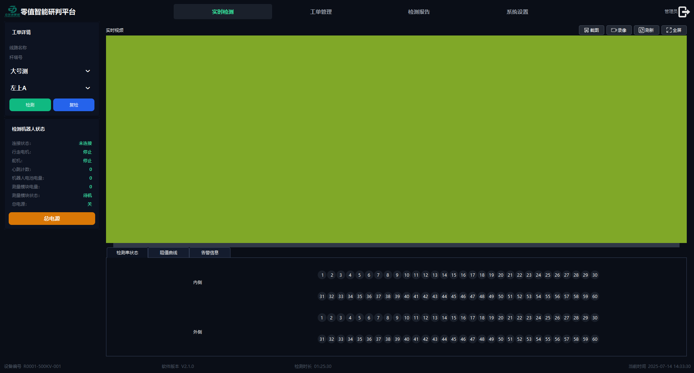
---

## 2. 运行环境与启动

### 2.1 运行环境

| 项目 | 要求 |
| --- | --- |
| 操作系统 | Windows 10 / 11（64 位） |
| 运行目录 | `RunDir\`（含 exe 及全部依赖 DLL） |
| 主程序 | `Insulator_Zero_Value_Detection_Robot.exe` |
| 配置文件 | `RunDir\Config.xml` |
| 日志文件 | `RunDir\Log\DeviceLog.txt` |
| 网络 | 与机器人控制板、摄像头处于同一网段（默认设备 IP 见系统设置） |

### 2.2 启动步骤

1. 确认机器人控制板、摄像头已上电并与本机网络连接正常。
2. 进入 `RunDir\` 目录，双击 `Insulator_Zero_Value_Detection_Robot.exe` 启动软件。
3. 软件启动后默认**最大化、全屏无边框**显示，并自动进入「实时检测」页面。
4. 观察左侧「检测机器人状态」面板，确认「连接状态」显示为已连接。

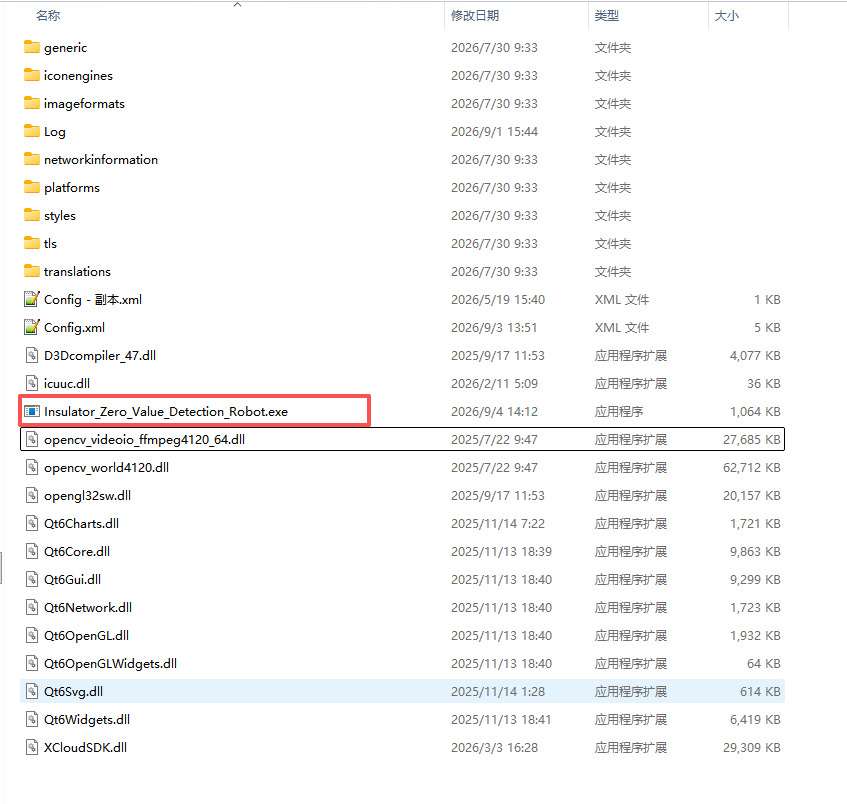

> **提示**：软件为无边框全屏窗口，如需退出请点击右上角的「关闭」图标按钮。

---

## 3. 主界面总览

主界面自上而下分为：**顶部导航栏**、**中部工作区（左侧面板 + 中央内容区）**、**底部状态栏**三部分。

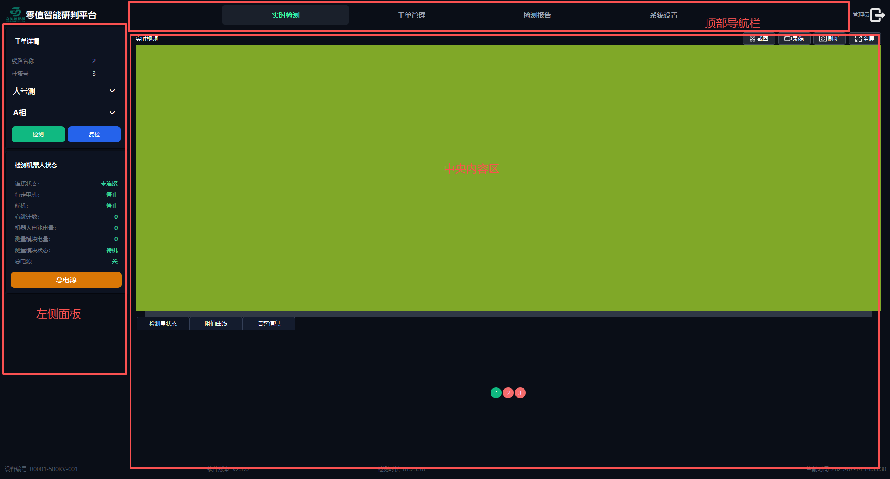

### 3.1 顶部导航栏

| 区域 | 说明 |
| --- | --- |
| Logo + 标题 | 显示「零值智能研判平台」 |
| **实时检测** | 切换到检测作业页面 |
| **工单管理** | 切换到工单列表页面 |
| **检测报告** | 切换到报告列表页面 |
| **系统设置** | 切换到参数设置与校准页面 |
| 管理员 | 当前登录用户标识 |
| 关闭按钮 | 退出软件 |

四个导航按钮为单选互斥，点击后中央内容区切换到对应页面，当前选中项高亮为荧光绿。

### 3.2 中部工作区

- **左侧面板**：工单详情、检测机器人状态、（手动控制按钮组，默认隐藏）。
- **中央内容区**：随导航切换，显示实时检测 / 工单管理 / 检测报告 / 系统设置。

### 3.3 底部状态栏

| 字段 | 说明 |
| --- | --- |
| 设备编号 | 当前机器人设备编号，如 `R0001-500KV-001` |
| 软件版本 | 当前软件版本号，如 `V2.1.0` |
| 检测时长 | 本次检测累计用时 |
| 当前时间 | 系统当前日期时间 |

---

## 4. 实时检测

点击顶部「**实时检测**」进入检测作业页面，这是日常检测的主操作界面。

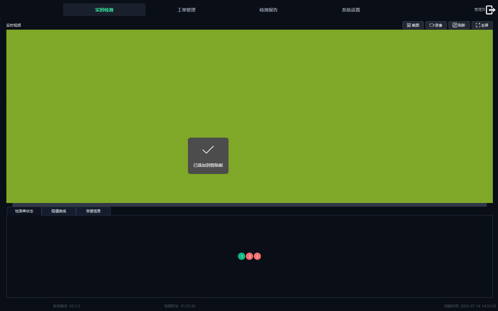

### 4.1 左侧：工单详情面板

用于显示当前已加载工单的信息并选择测量对象。

| 控件 | 说明 |
| --- | --- |
| 线路名称 | 显示当前工单的线路名称 |
| 杆塔号 | 显示当前工单的杆塔号 |
| 号侧下拉框 | 选择测量侧别：**大号测 / 小号侧** |
| 相别下拉框 | 选择测量相别（随工单回路数动态生成，如 A相/B相/C相、右A…左C、左上A…右下C） |
| **检测** 按钮 | 对当前选择的「号侧 + 相别」执行一次完整测量流程 |
| **复检** 按钮 | 对当前相别最近一次测量结果进行重测 |

> **说明**：相别下拉框的选项数量由所加载工单的「回路数」决定；未加载工单时，检测/复检按钮不可用。

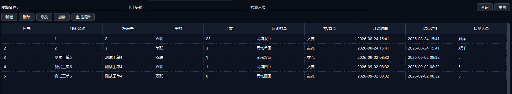

### 4.2 左侧：检测机器人状态面板

实时显示机器人与测量模块的运行状态。

| 状态项 | 说明 |
| --- | --- |
| 连接状态 | 与控制板的 TCP 连接状态（未连接 / 已连接） |
| 行走电机 | 行走电机运行状态 |
| 舵机 | 探针舵机状态 |
| 心跳计数 | 心跳包累计计数，正常通信时持续递增 |
| 机器人电池电量 | 机器人本体电量 |
| 测量模块电量 | 阻值测量模块电量 |
| 测量模块状态 | 测量模块工作状态 |
| 总电源 | 总电源开关状态 |

面板底部为「**总电源**」按钮：点击可一键开/关机器人总电源（按钮为可切换状态，按下为开机，再次按下为关机）。

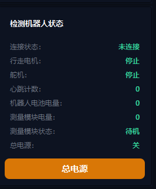

### 4.3 中央：实时视频区

显示摄像头实时画面，上方为视频工具栏。

| 按钮 | 功能 |
| --- | --- |
| **截图** | 截取当前画面，弹出保存对话框，保存为 PNG 文件 |
| **录像** | 开始录像（按钮变为「停止录像」）；再次点击停止并弹出保存对话框，保存为 AVI 视频 |
| **刷新** | 确认后重启软件以刷新摄像头连接 |
| **全屏** | 视频画面全屏切换 |

> **注意**：
> - 录像功能仅在「新摄像头模式」下可用；旧摄像头（SDK 直显）模式不支持录像，点击会提示「当前摄像头模式不支持录像」。
> - 录像停止后按录制时长与帧数自动推算帧率，编码过程在后台完成，完成后弹出保存成功提示。


### 4.4 中央：数据标签页

视频区下方为三个数据标签页：

#### （1）检测串状态

以「内侧 / 外侧」两列方块图直观展示每片绝缘子的研判结果：

- 每个方块代表一片绝缘子，按测量顺序依次点亮。
- **绿色**：阻值 ≥ 绝缘阈值，判定为合格（正常）。
- **红色**：阻值 < 绝缘阈值，判定为零值/低值（异常）。
- 单联工单只显示一列；双联工单显示内侧、外侧两列。


#### （2）阻值曲线

以表格 + 曲线形式展示各相/各片的阻值数据。表格列随相别（双联时拆分为「内侧/外侧」）动态生成，行随绝缘子片数生成。每获得一个测量值即自动填入对应单元格并刷新曲线。

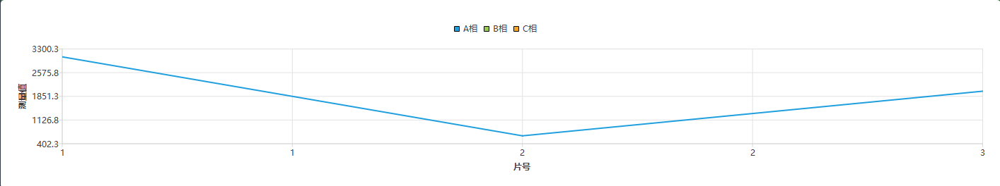

### 4.5 检测操作

在实时检测页完成一次测量的操作如下：

1. 在「工单管理」中**加载**一个工单（详见第 5 章），使工单详情面板显示线路名称与杆塔号。
2. 在工单详情面板选择「**号侧**」与「**相别**」。
3. 点击「**检测**」按钮（或按空格键）。
4. 软件自动执行测量流程，并弹出**测量等待窗**（测量结束前不可关闭）：
   - 探针指向内测 → 等待到位（约 4 秒）→ 截图保存 → 执行第一次测量；
   - **单联工单**：收到内测结果后探针复原，本次测量结束；
   - **双联工单**：内测完成后探针切换到外侧 → 等待到位（约 4 秒）→ 截图保存 → 执行第二次测量 → 收到结果后探针复原，测量结束。
5. 测量结果实时显示在视频区右下角浮层（「当前检测结果：xxx MΩ」），并同步写入检测串状态、阻值曲线与工单数据（自动保存到 `Config.xml`）。


> **提示**：
> - 若当前「号侧 + 相别」已测满该片数，软件会提示「请换相或换号侧」。
> - 测量进行中，检测/复检、行走、探针等按钮会被临时禁用，避免误触发；测量结束自动恢复。

### 4.6 复检操作

当某片测量结果可疑需重测时：

1. 选择对应的「号侧 + 相别」。
2. 点击「**复检**」按钮。
3. 软件自动删除该相最近一次（双联为最近一对内/外侧）测量值，并重新执行测量流程，复测值回填到表格与曲线。

### 4.7 手动控制（行走 / 探针 / 测量）

软件提供手动控制按钮组（前进、后退、探针1/2/3、停止、测量、生成报告），默认隐藏，主要用于调试与手动对位。各按钮功能与键盘操作一致，详见 [第 10 章](#10-键盘与手柄操作对照)。

> **说明**：手动控制按钮组在标准检测流程中通常不需要显示，如需使用请联系管理员开启。

---

## 5. 工单管理

点击顶部「**工单管理**」进入工单列表页面。工单是一次检测任务的载体，包含线路、杆塔、片数、回路等信息。

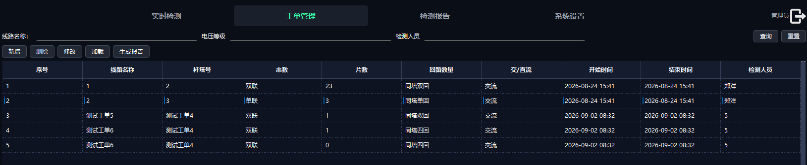


### 5.1 工单检索

页面顶部提供检索条件：**线路名称、电压等级、检测人员**。

- 在输入框中输入关键字即**实时过滤**下方工单表；
- 点击「**查询**」按条件过滤；
- 点击「**重置**」清空条件、显示全部工单。

### 5.2 工单列表

工单表列包括：**序号、线路名称、杆塔号、串数、片数、回路数量、交/直流、开始时间、结束时间、检测人员**。整行选中（点击任意一行）。

### 5.3 工单操作按钮

| 按钮 | 功能 |
| --- | --- |
| **新增** | 打开「新增工单信息」对话框，创建新工单 |
| **删除** | 删除选中工单（需二次确认），同步写入配置文件 |
| **修改** | 打开对话框修改选中工单信息 |
| **加载** | 将选中工单设为当前工单，进入可检测状态 |
| **生成报告** | 基于当前已加载工单生成检测报告（需先加载工单） |

### 5.4 新建 / 修改工单

点击「新增」或「修改」弹出工单对话框，字段如下：

| 字段 | 说明 | 必填/校验 |
| --- | --- | --- |
| 线路名称 | 检测线路名称 | **不能为空** |
| 杆塔号 | 杆塔编号 | — |
| 串数 | 单联 / 双联 | 影响测量流程（双联需测内、外侧） |
| 绝缘子片数 | 该串绝缘子片数 | **1 ~ 60** |
| 回路数 | 单回 / 双回 / 四回 | 决定相别下拉框选项数量 |
| 检测单位 | 检测单位名称 | — |
| 备注信息 | 备注 | — |
| 交/直流 | 交流 / 直流 | — |
| 开始时间 | 默认当前时间 | 格式 yyyy-MM-dd HH:mm |
| 结束时间 | 默认当前时间 | 格式 yyyy-MM-dd HH:mm |
| 检测人员 | 检测人员姓名 | — |

填写完成后点击「**确认**」保存，或点击「**取消**」放弃。

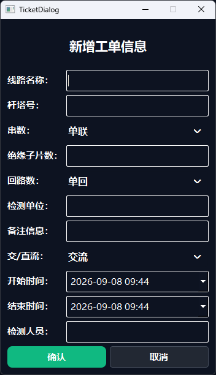

### 5.5 加载工单

选中一条工单后点击「**加载**」：

- 工单详情面板显示该工单的线路名称、杆塔号；
- 相别下拉框按回路数自动生成选项；
- 检测串状态、阻值曲线按片数与串数（单/双联）初始化，并回填该工单已有的历史测量数据；
- 「检测」「复检」按钮变为可用，即可开始检测作业。

> **重要**：进行任何检测前，必须先加载一个工单，否则点击检测会提示「请加载一个工单」。

---

## 6. 检测报告

点击顶部「**检测报告**」进入报告列表页面。

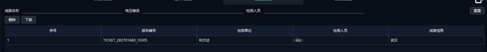

### 6.1 报告检索

顶部提供检索条件：**线路名称、电压等级、检测人员**，输入即实时过滤，点击「**重置**」显示全部。

### 6.2 报告列表

报告表列包括：**序号、报告编号、检测单位、检测人员、线路信息**。

### 6.3 报告操作

| 按钮 | 功能 |
| --- | --- |
| **删除** | 删除选中报告（需二次确认），同步写入配置文件 |
| **下载** | 下载选中报告文件 |

### 6.4 生成报告

报告基于工单测量数据生成，有两种入口：

- 在「工单管理」页选中并加载工单后，点击「**生成报告**」；
- 生成前若该工单已存在报告，软件会询问「已存在报告，是否需要重新生成？」，确认后覆盖旧报告。

生成报告时会弹出报告对话框，字段包括：**报告编号（自动取自工单）、检测单位、检测人员、作业地点**。填写后点击「确认」完成。

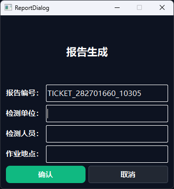

> **提示**：生成报告前必须先加载工单，否则会提示「请先加载工单」。

---

## 7. 系统设置

点击顶部「**系统设置**」进入参数设置与校准页面。左侧为参数设置区，右侧为「阻值单点校准」区。

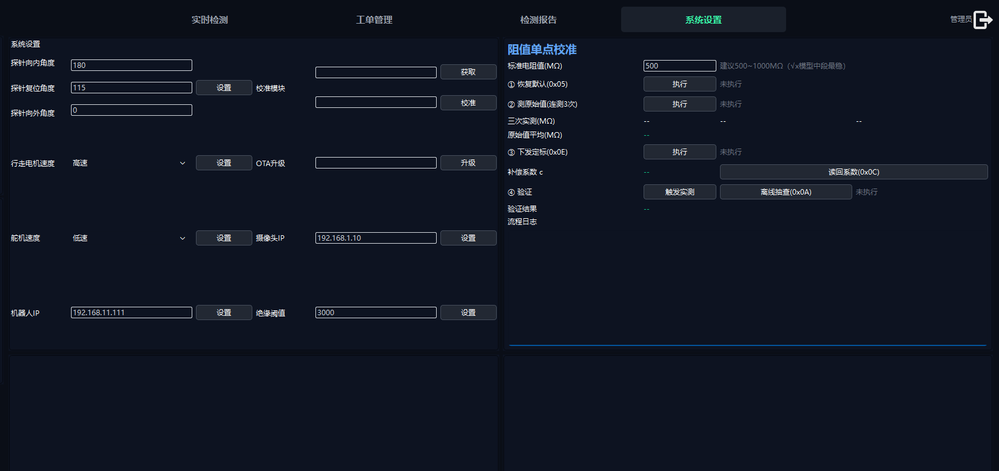

### 7.1 参数设置

| 参数 | 控件 | 说明 |
| --- | --- | --- |
| 探针向内角度 | 输入框 + 设置 | 探针指向内测的角度 |
| 探针复位角度 | 输入框 + 设置 | 探针复原的角度 |
| 探针向外角度 | 输入框 + 设置 | 探针指向外侧的角度 |
| 行走电机速度 | 下拉框（低速/中速/高速）+ 设置 | 行走电机速度档位 |
| 舵机速度 | 下拉框（低速/中速/高速）+ 设置 | 探针舵机速度档位 |
| 机器人 IP | 输入框 + 设置 | 控制板 IP 地址（带 IP 格式校验） |
| 摄像头 IP | 输入框 + 设置 | 摄像头 IP 地址（带 IP 格式校验） |
| 绝缘阈值 | 输入框 + 设置 | 研判合格/异常的阻值阈值（MΩ） |
| 校准模块 | 获取 / 校准 | 校准模块相关操作 |
| OTA 升级 | 升级 | 对下位机进行固件升级 |

**操作方式**：修改对应输入框/下拉框后，点击其右侧「**设置**」按钮保存。保存成功后弹出「参数已保存」提示，参数写入 `Config.xml`。

> **注意**：
> - 修改**机器人 IP** 后立即生效并重新连接设备。
> - 修改**摄像头 IP** 后软件会提示需要重启，确认后自动重启软件使新 IP 生效。
> - 探针角度、绝缘阈值等参数直接影响测量与研判结果，非必要请勿随意修改。

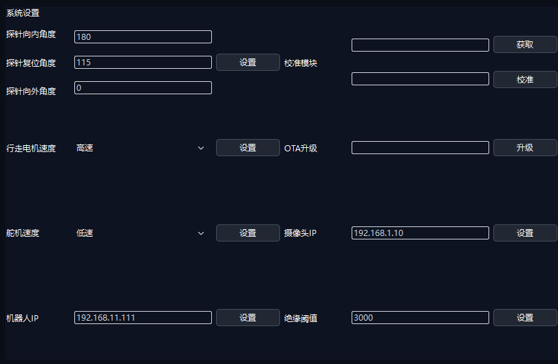

### 7.2 阻值单点校准

右侧「阻值单点校准」区用于对测量模块进行定标，详细操作见 [第 8 章](#8-阻值单点校准)。

---

## 8. 阻值单点校准

单点校准用于修正测量模块的读数偏差。校准按**自上而下顺序**执行，上一步未完成时下一步不可操作。

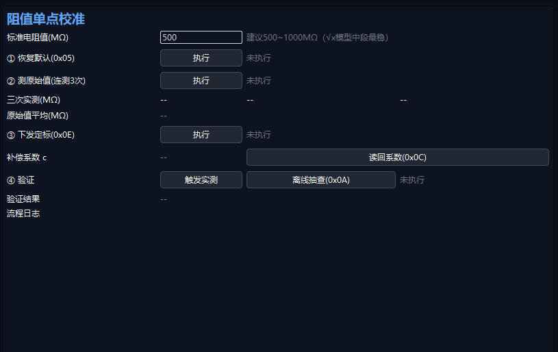

### 8.1 校准前准备

1. 进入「系统设置」页面，找到右侧「阻值单点校准」区。
2. 在「**标准电阻值(MΩ)**」输入框中填入标准电阻的标称值（建议 **500 ~ 1000 MΩ**，√x 模型中段最稳）。
3. 将标准电阻可靠接入测量模块，通电预热，待读数稳定。

### 8.2 校准步骤

| 步骤 | 按钮 | 说明 | 状态显示 |
| --- | --- | --- | --- |
| ① 恢复默认 (0x05) | 执行 | 清空旧校准系数，使测量通道直通 | 未执行 / 等待应答 / 已恢复默认 / 失败 |
| ② 测原始值（连测 3 次） | 执行 | 自动连测 3 次原始值并取平均 | 显示三次实测值与平均值 |
| ③ 下发定标 (0x0E) | 执行 | 将标准值与原始值平均值下发，固件计算补偿系数并写入 Flash（掉电保存） | 写 Flash 中 / 定标成功 c=… / 定标失败 |
| ④ 验证 | 触发实测 / 离线抽查 (0x0A) | 触发实测对比修正值与标准值算误差；或不挂电阻离线抽查 | 验证完成 / 抽查完成 / 失败 |
| 辅助：读回系数 (0x0C) | 读回系数 | 读回 Flash 中已存的补偿系数用于核对 | — |

### 8.3 操作流程

1. 填好标准电阻值 → 点击步骤①「执行」，等待状态变为「已恢复默认」。
2. 点击步骤②「执行」，软件自动连测 3 次，完成后显示「原始值平均」。
3. 点击步骤③「执行」，等待「定标成功 c=…」提示（写 Flash 约需 1~2 秒）。
4. 点击步骤④「触发实测」进行验证，查看「验证结果」中的实测值与误差百分比；或点击「离线抽查」在不挂电阻情况下核对。
5. 如需核对系数，点击「读回系数(0x0C)」。

整个过程的操作与结果都会实时记录在下方的「**流程日志**」文本框中，便于与协议文档逐条比对。


> **注意事项**：
> - 步骤③要求原始值平均值必须**大于 0 且小于标准值**；若原始值 ≥ 标准值，说明模块读数偏高，软件会提示「参数非法」，此时应检查接线与硬件，**切勿强行定标**。
> - 校准与工单测量流程**互斥**：工单测量进行中无法启动校准。
> - 各步骤有超时保护（测量约 6 秒、写 Flash 约 5 秒、普通命令约 3 秒），超时会在日志中提示。

---

## 9. 标准作业流程

以下为完成一串绝缘子检测的完整标准流程：

```
① 启动软件，确认机器人「连接状态」正常
        │
② 系统设置：核对探针角度、绝缘阈值、电机/舵机速度等参数
        │
③（可选）阻值单点校准，确保测量模块读数准确
        │
④ 工单管理：新增/选择工单 → 点击「加载」
        │
⑤ 实时检测：选择「号侧 + 相别」
        │
⑥ 点击「检测」，等待自动测量流程完成
        │
⑦ 逐片测量：每测完一片，行走机器人到下一片位置，重复⑥
        │
⑧ 可疑片使用「复检」重测
        │
⑨ 全部测完 → 工单管理/检测报告：点击「生成报告」
        │
⑩ 检测报告：查询、下载报告
```
---

## 10. 键盘与手柄操作对照

软件支持键盘（与手柄对应）快捷控制机器人，便于现场操作：

| 按键 | 功能 | 说明 |
| --- | --- | --- |
| **Q** | 探针向内（内测） | 探针打到内测角度 |
| **E** | 探针向外（外侧） | 探针打到外侧角度 |
| **R** | 探针复原 | 探针回到复位角度 |
| **A** / **←** | 行走向左 | 按住行走，松开自动停止 |
| **D** / **→** | 行走向右 | 按住行走，松开自动停止 |
| **S** | 停止 | 停止行走电机 |
| **空格** | 开始测量 | 等同点击「检测」按钮（内部已防重复触发） |

> **说明**：
> - 行走键（A/D/←/→）为「按住运动、松开停止」模式。
> - 手动控制按钮组（前进/后退/探针1/探针2/探针3/停止/测量/生成报告）功能与上表一一对应。
> - 键盘操作需在软件窗口获得焦点时生效。


> 图 10-1 手动控制按钮组（占位：请替换为实际截图）

---

## 11. 状态与颜色说明

### 11.1 检测串状态方块颜色

| 颜色 | 含义 |
| --- | --- |
| 🟩 绿色（# 10b981） | 阻值 ≥ 绝缘阈值，判定**合格/正常** |
| 🟥 红色（# f56c6c） | 阻值 < 绝缘阈值，判定**零值/低值异常** |
| ⬜ 深色（# 1A202B） | 该片尚未测量 |

### 11.2 导航按钮状态

| 状态 | 表现 |
| --- | --- |
| 选中 | 背景深色，文字荧光绿（# 39FFAA） |
| 未选中 | 文字灰色（# 9CA3AF） |

### 11.3 校准步骤状态颜色

| 状态 | 含义 |
| --- | --- |
| 灰色「未执行」 | 该步骤尚未开始 |
| 蓝色「进行中/等待应答」 | 命令已下发，等待下位机应答 |
| 绿色「成功/完成」 | 步骤执行成功 |
| 红色「失败」 | 步骤执行失败（详见流程日志原因） |

---

## 12. 常见问题（FAQ）

**Q1：连接状态一直显示「未连接」？**
- 检查机器人控制板是否上电、网线是否连接；
- 检查「系统设置」中的机器人 IP 是否与控制板实际 IP 一致；
- 修改 IP 后点击「设置」保存，观察心跳计数是否开始递增。

**Q2：点击「检测」提示「请加载一个工单」？**
- 需先到「工单管理」页选中一条工单并点击「加载」，再回到「实时检测」页操作。

**Q3：点击「检测」提示「请换相或换号侧」？**
- 说明当前「号侧 + 相别」已测满该片数，请在相别或号侧下拉框中切换到下一个待测对象。

**Q4：摄像头无画面 / 需要刷新？**
- 点击视频区「刷新」按钮，确认后软件自动重启以重新连接摄像头；
- 若为新装摄像头，请在「系统设置」中修改摄像头 IP 并保存（会提示重启生效）。

**Q5：录像按钮点击后提示「当前摄像头模式不支持录像」？**
- 录像仅在「新摄像头模式」下可用，旧摄像头（SDK 直显）模式不支持录像。

**Q6：校准步骤③提示「参数非法」？**
- 表示原始值平均值 ≥ 标准值，模块读数偏高。请检查标准电阻接线与硬件状态，勿强行定标；确认读数正常后重新从步骤①开始。

**Q7：测量结果偏差较大？**
- 建议执行「阻值单点校准」修正测量模块；并核对「绝缘阈值」设置是否合理。

**Q8：软件如何退出？**
- 软件为无边框全屏窗口，点击顶部导航栏右侧的「关闭」图标按钮退出。

---

> 本说明书依据软件当前功能编写，若软件升级导致界面或操作变化，请以实际界面为准并同步更新本文档。
